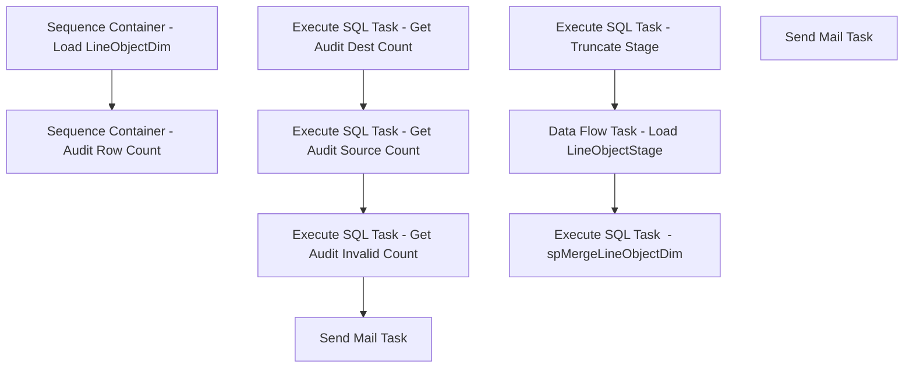

# SSIS Package: DW_SalesDimExtracts_LineObjectDim

**Project:** DW_SalesDimExtracts_LineObjectDim  
**Folder:** DW  
**Server:** STL-SSIS-P-01  

## Connection Managers

| Name | Type | Server | Catalog | Connection (sanitized) |
|---|---|---|---|---|
| DWStaging | OLEDB | papamart | DWStaging | Data Source=papamart; Initial Catalog=DWStaging; Provider=SQLNCLI11.1; Integrated Security=SSPI; Auto Translate=False |
| SMTP | SMTP |  |  |  |
| auditworks | OLEDB | bedrockdb01 | auditworks | Data Source=bedrockdb01; Initial Catalog=auditworks; Provider=SQLNCLI11.1; Integrated Security=SSPI; Auto Translate=False |
| dw | OLEDB | papamart | dw | Data Source=papamart; Initial Catalog=dw; Provider=SQLNCLI11.1; Integrated Security=SSPI; Auto Translate=False |

## Control Flow Tasks

| Task | Type |
|---|---|
| DW_SalesDimExtracts_LineObjectDim | Package |
| Sequence Container - Audit Row Count | SEQUENCE |
| Execute SQL Task - Get Audit Dest Count | ExecuteSQLTask |
| Execute SQL Task - Get Audit Invalid Count | ExecuteSQLTask |
| Execute SQL Task - Get Audit Source Count | ExecuteSQLTask |
| Send Mail Task | SendMailTask |
| Sequence Container - Load LineObjectDim | SEQUENCE |
| Data Flow Task - Load LineObjectStage | Pipeline |
| Execute SQL Task  - spMergeLineObjectDim | ExecuteSQLTask |
| Execute SQL Task - Truncate Stage | ExecuteSQLTask |
| Send Mail Task | SendMailTask |

## Control Flow Outline

```text
- Send Mail Task [SendMailTask]
- Sequence Container - Audit Row Count [SEQUENCE]
  - Execute SQL Task - Get Audit Dest Count [ExecuteSQLTask]
  - Execute SQL Task - Get Audit Invalid Count [ExecuteSQLTask]
  - Execute SQL Task - Get Audit Source Count [ExecuteSQLTask]
  - Send Mail Task [SendMailTask]
- Sequence Container - Load LineObjectDim [SEQUENCE]
  - Data Flow Task - Load LineObjectStage [Pipeline]
  - Execute SQL Task  - spMergeLineObjectDim [ExecuteSQLTask]
  - Execute SQL Task - Truncate Stage [ExecuteSQLTask]
```

## Architecture Diagram



## Variables

| Namespace | Name | Expression-bound |
|---|---|---|
| System | Propagate | No |
| User | AuditDestCount | No |
| User | AuditInvalidCount | No |
| User | AuditSrcCount | No |
| User | DateTimeStamp | Yes |
| User | EndDate | Yes |
| User | EndDateAsDATE | Yes |
| User | ErrorEmailActive | No |
| User | GetDate | Yes |
| User | GetDateAsDATE | Yes |
| User | StartDate | Yes |
| User | StartDateAsDATE | Yes |

### Expression-bound variable values

#### User::DateTimeStamp

**Expression:**

```sql
(DT_WSTR,4)DATEPART("yyyy",GetDate()) 
+ (DT_WSTR,4)DATEPART("mm",GetDate()) 
+ (DT_WSTR,4)DATEPART("dd",GetDate()) 
+ (DT_WSTR,4)DATEPART("hh",GetDate()) 
+ (DT_WSTR,4)DATEPART("mi",GetDate()) 
+ (DT_WSTR,4)DATEPART("ss",GetDate()) 
+ (DT_WSTR,4)DATEPART("ms",GetDate())
```

**Evaluated value:**

```sql
202111116619717
```

#### User::EndDate

**Expression:**

```sql
dateadd("dd", @[$Package::DaysToInclude], @[User::StartDate])
```

**Evaluated value:**

```sql
11/1/2021
```

#### User::EndDateAsDATE

**Expression:**

```sql
(DT_WSTR, 4) datepart("year", @[User::EndDate])  + "-" +
right("0"+ (DT_WSTR, 2) datepart("mm", @[User::EndDate]),2)  + "-" +
right("0" +(DT_WSTR, 2) datepart("dd",  @[User::EndDate]),2)
```

**Evaluated value:**

```sql
2021-11-01
```

#### User::GetDate

**Expression:**

```sql
(DT_DATE)DATEDIFF("Day", (DT_DATE) 0, GETDATE())
```

**Evaluated value:**

```sql
11/1/2021
```

#### User::GetDateAsDATE

**Expression:**

```sql
(DT_WSTR, 4) datepart("year", @[User::GetDate])  + "-" +
right("0"+ (DT_WSTR, 2) datepart("mm", @[User::GetDate]),2)  + "-" +
right("0" +(DT_WSTR, 2) datepart("dd",  @[User::GetDate]),2)
```

**Evaluated value:**

```sql
2021-11-01
```

#### User::StartDate

**Expression:**

```sql
dateadd("dd", -@[$Package::DaysToGoBack] , @[User::GetDate] )
```

**Evaluated value:**

```sql
10/31/2021
```

#### User::StartDateAsDATE

**Expression:**

```sql
(DT_WSTR, 4) datepart("year", @[User::StartDate])  + "-" +
right("0"+ (DT_WSTR, 2) datepart("mm", @[User::StartDate]),2)  + "-" +
right("0" +(DT_WSTR, 2) datepart("dd",  @[User::StartDate]),2)
```

**Evaluated value:**

```sql
2021-10-31
```

## Execute SQL Tasks

### Execute SQL Task - Get Audit Dest Count

**Path:** `Package\Sequence Container - Audit Row Count\Execute SQL Task - Get Audit Dest Count`  
**Connection:** dw (papamart/dw)  

```sql
SELECT COUNT(*) AS AuditDestCount 
FROM dbo.line_object_dim
WHERE line_object NOT IN (1, 2, 3, 211, 212, 213, 410, 641, 643,-1617)

```

### Execute SQL Task - Get Audit Invalid Count

**Path:** `Package\Sequence Container - Audit Row Count\Execute SQL Task - Get Audit Invalid Count`  
**Connection:** dw (papamart/dw)  

```sql
SELECT dbo.fnDW_AuditRowCounts (?,?) AS AuditCountFlag
```

### Execute SQL Task - Get Audit Source Count

**Path:** `Package\Sequence Container - Audit Row Count\Execute SQL Task - Get Audit Source Count`  
**Connection:** auditworks (bedrockdb01/auditworks)  

```sql
SELECT COUNT(*) AS AuditSrcCount
FROM dbo.vwDW_Line_Object_Dim
WHERE line_object NOT IN (1, 2, 3, 211, 212, 213, 410, 641, 643)

```

### Execute SQL Task  - spMergeLineObjectDim

**Path:** `Package\Sequence Container - Load LineObjectDim\Execute SQL Task  - spMergeLineObjectDim`  
**Connection:** DWStaging (papamart/DWStaging)  

```sql
exec spMergeLineObjectDim
```

### Execute SQL Task - Truncate Stage

**Path:** `Package\Sequence Container - Load LineObjectDim\Execute SQL Task - Truncate Stage`  
**Connection:** DWStaging (papamart/DWStaging)  

```sql
truncate table [line_object_dim_stage]
```

## Data Flow: Sources

| Component | Source Object | Type | Data Flow Task | Connection | SQL Kind |
|---|---|---|---|---|---|
| OLE DB Source - auditworks - vwDW_Line_Object_Dim |  | OLEDBSource | Data Flow Task - Load LineObjectStage | auditworks | SqlCommand |

#### OLE DB Source - auditworks - vwDW_Line_Object_Dim — SqlCommand

```sql
SELECT line_object
      ,line_object_type
      ,line_object_description
FROM dbo.vwDW_Line_Object_Dim  with (nolock)
ORDER BY line_object
```

## Data Flow: Destinations

| Component | Target Table | Type | Data Flow Task | Connection | SQL Kind |
|---|---|---|---|---|---|
| OLE DB Destination - DWStaging -  line_object_dim_stage |  | OLEDBDestination | Data Flow Task - Load LineObjectStage | DWStaging |  |
