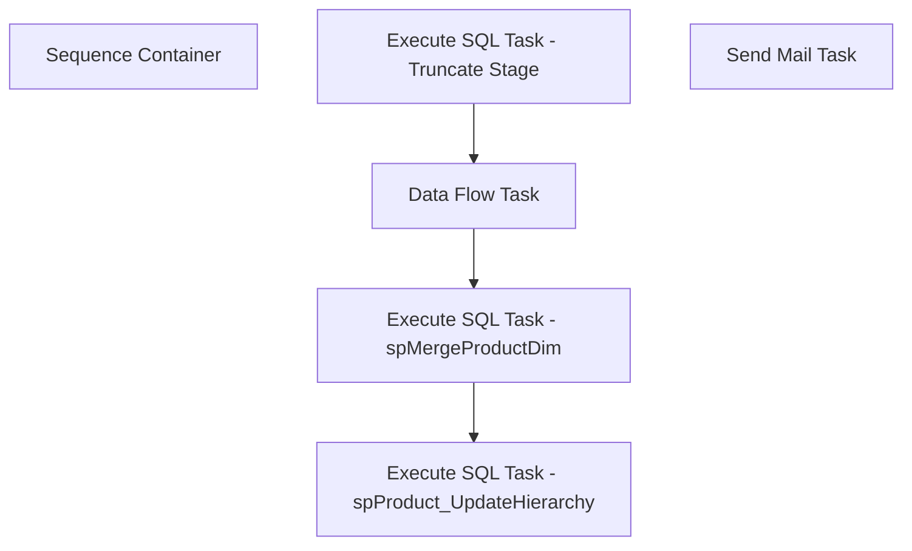

# SSIS Package: DW_SalesDimExtracts_ProductDim

**Project:** DW_SalesDimExtracts_ProductDim  
**Folder:** DW  
**Server:** STL-SSIS-P-01  

## Connection Managers

| Name | Type | Server | Catalog | Connection (sanitized) |
|---|---|---|---|---|
| DWStaging | OLEDB | PAPAMART | DWStaging | Data Source=PAPAMART; Initial Catalog=DWStaging; Provider=SQLNCLI11.1; Integrated Security=SSPI; Auto Translate=False |
| IntegrationStaging | OLEDB | STL-SSIS-P-01 | IntegrationStaging | Data Source=STL-SSIS-P-01; Initial Catalog=IntegrationStaging; Provider=SQLNCLI11.1; Integrated Security=SSPI; Auto Translate=False |
| SMTP | SMTP |  |  |  |
| dw | OLEDB | papamart | dw | Data Source=papamart; Initial Catalog=dw; Provider=SQLNCLI11.1; Integrated Security=SSPI; Auto Translate=False |
| me_01 | OLEDB | bedrockdb02 | me_01 | Data Source=bedrockdb02; Initial Catalog=me_01; Provider=SQLNCLI11.1; Integrated Security=SSPI; Auto Translate=False |

## Control Flow Tasks

| Task | Type |
|---|---|
| DW_SalesDimExtracts_ProductDim | Package |
| Sequence Container | SEQUENCE |
| Data Flow Task | Pipeline |
| Execute SQL Task - spMergeProductDim | ExecuteSQLTask |
| Execute SQL Task - spProduct_UpdateHierarchy | ExecuteSQLTask |
| Execute SQL Task - Truncate Stage | ExecuteSQLTask |
| Send Mail Task | SendMailTask |

## Control Flow Outline

```text
- Send Mail Task [SendMailTask]
- Sequence Container [SEQUENCE]
  - Data Flow Task [Pipeline]
  - Execute SQL Task - Truncate Stage [ExecuteSQLTask]
  - Execute SQL Task - spMergeProductDim [ExecuteSQLTask]
  - Execute SQL Task - spProduct_UpdateHierarchy [ExecuteSQLTask]
```

## Architecture Diagram



## Variables

| Namespace | Name | Expression-bound |
|---|---|---|
| System | Propagate | No |
| User | DateTimeStamp | Yes |
| User | EndDate | Yes |
| User | EndDateAsDATE | Yes |
| User | GetDate | Yes |
| User | GetDateAsDATE | Yes |
| User | StartDate | Yes |
| User | StartDateAsDATE | Yes |

### Expression-bound variable values

#### User::DateTimeStamp

**Expression:**

```sql
(DT_WSTR,4)DATEPART("yyyy",GetDate()) 
+ (DT_WSTR,4)DATEPART("mm",GetDate()) 
+ (DT_WSTR,4)DATEPART("dd",GetDate()) 
+ (DT_WSTR,4)DATEPART("hh",GetDate()) 
+ (DT_WSTR,4)DATEPART("mi",GetDate()) 
+ (DT_WSTR,4)DATEPART("ss",GetDate()) 
+ (DT_WSTR,4)DATEPART("ms",GetDate())
```

**Evaluated value:**

```sql
202111116122117
```

#### User::EndDate

**Expression:**

```sql
dateadd("dd", @[$Package::DaysToInclude], @[User::StartDate])
```

**Evaluated value:**

```sql
11/1/2021
```

#### User::EndDateAsDATE

**Expression:**

```sql
(DT_WSTR, 4) datepart("year", @[User::EndDate])  + "-" +
right("0"+ (DT_WSTR, 2) datepart("mm", @[User::EndDate]),2)  + "-" +
right("0" +(DT_WSTR, 2) datepart("dd",  @[User::EndDate]),2)
```

**Evaluated value:**

```sql
2021-11-01
```

#### User::GetDate

**Expression:**

```sql
(DT_DATE)DATEDIFF("Day", (DT_DATE) 0, GETDATE())
```

**Evaluated value:**

```sql
11/1/2021
```

#### User::GetDateAsDATE

**Expression:**

```sql
(DT_WSTR, 4) datepart("year", @[User::GetDate])  + "-" +
right("0"+ (DT_WSTR, 2) datepart("mm", @[User::GetDate]),2)  + "-" +
right("0" +(DT_WSTR, 2) datepart("dd",  @[User::GetDate]),2)
```

**Evaluated value:**

```sql
2021-11-01
```

#### User::StartDate

**Expression:**

```sql
dateadd("dd", -@[$Package::DaysToGoBack] , @[User::GetDate] )
```

**Evaluated value:**

```sql
10/31/2021
```

#### User::StartDateAsDATE

**Expression:**

```sql
(DT_WSTR, 4) datepart("year", @[User::StartDate])  + "-" +
right("0"+ (DT_WSTR, 2) datepart("mm", @[User::StartDate]),2)  + "-" +
right("0" +(DT_WSTR, 2) datepart("dd",  @[User::StartDate]),2)
```

**Evaluated value:**

```sql
2021-10-31
```

## Execute SQL Tasks

### Execute SQL Task - Truncate Stage

**Path:** `Package\Sequence Container\Execute SQL Task - Truncate Stage`  
**Connection:** DWStaging (PAPAMART/DWStaging)  

```sql
truncate table [dbo].[product_dim_stage]
```

### Execute SQL Task - spMergeProductDim

**Path:** `Package\Sequence Container\Execute SQL Task - spMergeProductDim`  
**Connection:** DWStaging (PAPAMART/DWStaging)  

```sql
exec [dbo].[spMergeProductDim]
```

### Execute SQL Task - spProduct_UpdateHierarchy

**Path:** `Package\Sequence Container\Execute SQL Task - spProduct_UpdateHierarchy`  
**Connection:** dw (papamart/dw)  

```sql
exec spProduct_UpdateHierarchy
```

## Data Flow: Sources

| Component | Source Object | Type | Data Flow Task | Connection | SQL Kind |
|---|---|---|---|---|---|
| OLE DB Source - me_01- vwDW_Product_Dim |  | OLEDBSource | Data Flow Task | me_01 | SqlCommand |

#### OLE DB Source - me_01- vwDW_Product_Dim — SqlCommand

```sql
SELECT sku
      ,activation_date
      ,style_code
      ,style_desc
      ,color_code
      ,color_desc
      ,product_desc
      ,subclass
      ,class
      ,department
      ,department_code
      ,division
      ,chain
      ,concept
      ,subclass_code
      ,primary_vendor_code
      ,primary_vendor_name
      ,alt_primary_vendor_code
      ,current_retail
      ,original_retail
      ,price_with_vat
      ,reorder_flag
      ,euro_value
      ,style_id
      ,color_id
      ,current_selling_retail_home
      ,jurisdiction_code
      ,jurisdiction_id
      ,cdn_value
  FROM dbo.vwDW_Product_Dim with (nolock)
 ORDER BY sku, jurisdiction_code
```

## Data Flow: Destinations

| Component | Target Table | Type | Data Flow Task | Connection | SQL Kind |
|---|---|---|---|---|---|
| OLE DB Destination - product_dim_stage |  | OLEDBDestination | Data Flow Task | DWStaging |  |
