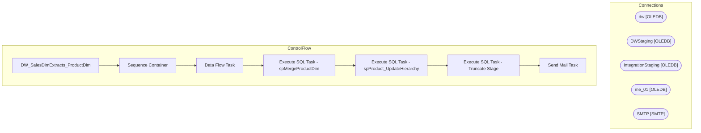

# SSIS Package: DW_SalesDimExtracts_ProductDim

**Project:** DW_SalesDimExtracts_ProductDim  
**Folder:** DW  
**Server:** STL-SSIS-P-01  

## Architecture Diagram

## Connection Managers

| Name | Type |
|---|---|
| dw | OLEDB |
| DWStaging | OLEDB |
| IntegrationStaging | OLEDB |
| me_01 | OLEDB |
| SMTP | SMTP |

## Control Flow Tasks

| Task | Type |
|---|---|
| DW_SalesDimExtracts_ProductDim | Microsoft.Package |
| Sequence Container | STOCK:SEQUENCE |
| Data Flow Task | Microsoft.Pipeline |
| Execute SQL Task - spMergeProductDim | Microsoft.ExecuteSQLTask |
| Execute SQL Task - spProduct_UpdateHierarchy | Microsoft.ExecuteSQLTask |
| Execute SQL Task - Truncate Stage | Microsoft.ExecuteSQLTask |
| Send Mail Task | Microsoft.SendMailTask |

## Data Flow: Sources

| Component | SQL Preview |
|---|---|
|  | SELECT eas.parent_id style_id, CAST(min(a.attribute_code) AS VARCHAR(6)) core_fashion_code   FROM dbo.entity_attribute_set eas with (nolock)  INNER JOIN dbo.attribute_set ats with (nolock)     ON ats.attribute_set_id = eas.attribute_set_id  INNER JOIN dbo.attribute a with (nolock)     ON ats.attribute_id = a.attribute_id  WHERE (a.attribute_label IN ('FASHION', 'CORE')    AND eas.parent_type = 1   |
|  | SELECT eas.parent_id style_id, CAST(min(a.attribute_code) AS VARCHAR(6)) gender_code /*Per merch team:  in the case that more than one gender attribute is selected, grab the first one.   using alpha order for simplicity to get min value.  If these are incorrect, they would need to    change the source attribute */   FROM dbo.entity_attribute_set eas with (nolock)  INNER JOIN dbo.attribute_set ats  |
|  | SELECT parent_id style_id, CAST(custom_property_value AS VARCHAR(30)) inline_code   FROM entity_custom_property ecp with (nolock)  INNER JOIN custom_property cp with (nolock)     ON ecp.custom_property_id = cp.custom_property_id  WHERE cust_prop_code = 'INLINE' |
|  | SELECT style_id, CAST(attribute_set_code AS VARCHAR(6)) AS merch_status FROM view_style_attribute_outer  WHERE attribute_id = 74 AND attribute_set_code IS NOT NULL |
|  | SELECT style_id, 	CAST(attribute_set_code AS VARCHAR(6)) AS wss_reportable FROM view_style_attribute_outer  WHERE attribute_id = 108 	AND attribute_set_code IS NOT NULL |
|  | SELECT sku       ,activation_date       ,style_code       ,style_desc       ,color_code       ,color_desc       ,product_desc       ,subclass       ,class       ,department       ,department_code       ,division       ,chain       ,concept       ,subclass_code       ,primary_vendor_code       ,primary_vendor_name       ,alt_primary_vendor_code       ,current_retail       ,original_retail       ,pr |

## Data Flow: Destinations

| Component | Destination |
|---|---|
|  | [dbo].[product_dim_stage] |

