# SSIS Package: DW_SalesDimExtracts_SyncCompanyStoreComps

**Project:** DW_SalesDimExtracts_SyncCompanyStoreComps  
**Folder:** DW  
**Server:** STL-SSIS-P-01  

## Connection Managers

| Name | Type | Server | Catalog | Connection (sanitized) |
|---|---|---|---|---|
| BABWMstrData | OLEDB | kodiaktest | BABWMstrData | Data Source=kodiaktest; Initial Catalog=BABWMstrData; Provider=SQLNCLI11.1; Integrated Security=SSPI; Auto Translate=False |
| DWStaging | OLEDB | papamarttest | DWStaging | Data Source=papamarttest; Initial Catalog=DWStaging; Provider=SQLNCLI11.1; Integrated Security=SSPI; Auto Translate=False |
| SMTP | SMTP |  |  |  |
| dw | OLEDB | papamarttest | dw | Data Source=papamarttest; Initial Catalog=dw; Provider=SQLNCLI11.1; Integrated Security=SSPI; Auto Translate=False |

## Control Flow Tasks

| Task | Type |
|---|---|
| DW_SalesDimExtracts_SyncCompanyStoreComps | Package |
| Sequence Container - Merge Store Comp Detail and Validate Min Date | SEQUENCE |
| Execute SQL Task - Capture Min Change Comp Actual Date | ExecuteSQLTask |
| Execute SQL Task - Capture Min Change Comp Date Key | ExecuteSQLTask |
| Execute SQL Task - Make Snapshot of Store Comp Details | ExecuteSQLTask |
| Execute SQL Task - spMergeStoreCompDetail_Dim | ExecuteSQLTask |
| Send Mail Task | SendMailTask |
| Sequence Container - Process Cube StoreComps | SEQUENCE |
| Execute SQL Task - Identify Comp Modifications Older than 30 days | ExecuteSQLTask |
| Execute SQL Task - Process Cube Measures SQL Agent Job | ExecuteSQLTask |
| Sequence Container - Stage Data  from BABWMstrDate and Merge to DW | SEQUENCE |
| Data Flow Task - BABWMstrData to Stage | Pipeline |
| Execute SQL Task - Truncate Stage | ExecuteSQLTask |
| Sequence Container - Merges | SEQUENCE |
| Execute SQL Task  - spMergeStoreOpenDim | ExecuteSQLTask |
| Execute SQL Task - spMergeStoreCompDim | ExecuteSQLTask |
| Execute SQL Task - spMergeStoreShopperTrakCompDim | ExecuteSQLTask |
| Execute SQL Task - spMergeStoreShoppertrakOpenDim | ExecuteSQLTask |
| Execute SQL Task - spMergeStoreSOTFopenDim | ExecuteSQLTask |
| Sequence Container - Testing | SEQUENCE |
| Data Flow Task - BABWMstrData to Stage | Pipeline |
| Send Mail Task | SendMailTask |

## Control Flow Outline

```text
- Send Mail Task [SendMailTask]
- Sequence Container - Merge Store Comp Detail and Validate Min Date [SEQUENCE]
  - Execute SQL Task - Capture Min Change Comp Actual Date [ExecuteSQLTask]
  - Execute SQL Task - Capture Min Change Comp Date Key [ExecuteSQLTask]
  - Execute SQL Task - Make Snapshot of Store Comp Details [ExecuteSQLTask]
  - Execute SQL Task - spMergeStoreCompDetail_Dim [ExecuteSQLTask]
  - Send Mail Task [SendMailTask]
- Sequence Container - Process Cube StoreComps [SEQUENCE]
  - Execute SQL Task - Identify Comp Modifications Older than 30 days [ExecuteSQLTask]
  - Execute SQL Task - Process Cube Measures SQL Agent Job [ExecuteSQLTask]
- Sequence Container - Stage Data  from BABWMstrDate and Merge to DW [SEQUENCE]
  - Data Flow Task - BABWMstrData to Stage [Pipeline]
  - Execute SQL Task - Truncate Stage [ExecuteSQLTask]
  - Sequence Container - Merges [SEQUENCE]
    - Execute SQL Task  - spMergeStoreOpenDim [ExecuteSQLTask]
    - Execute SQL Task - spMergeStoreCompDim [ExecuteSQLTask]
    - Execute SQL Task - spMergeStoreSOTFopenDim [ExecuteSQLTask]
    - Execute SQL Task - spMergeStoreShopperTrakCompDim [ExecuteSQLTask]
    - Execute SQL Task - spMergeStoreShoppertrakOpenDim [ExecuteSQLTask]
- Sequence Container - Testing [SEQUENCE]
  - Data Flow Task - BABWMstrData to Stage [Pipeline]
```

## Architecture Diagram

```mermaid
flowchart TD
    n_Package_Sequence_Container___Merge_Store_Comp_Detail_and_Validate_Min_Date["Sequence Container - Merge Store Comp Detail and Validate Min Date"]
    n_Package_Sequence_Container___Merge_Store_Comp_Detail_and_Validate_Min_Date_Execute_SQL_Task___Capture_Min_Change_Comp_Actual_Date["Execute SQL Task - Capture Min Change Comp Actual Date"]
    n_Package_Sequence_Container___Merge_Store_Comp_Detail_and_Validate_Min_Date_Execute_SQL_Task___Capture_Min_Change_Comp_Date_Key["Execute SQL Task - Capture Min Change Comp Date Key"]
    n_Package_Sequence_Container___Merge_Store_Comp_Detail_and_Validate_Min_Date_Execute_SQL_Task___Make_Snapshot_of_Store_Comp_Details["Execute SQL Task - Make Snapshot of Store Comp Details"]
    n_Package_Sequence_Container___Merge_Store_Comp_Detail_and_Validate_Min_Date_Execute_SQL_Task___spMergeStoreCompDetail_Dim["Execute SQL Task - spMergeStoreCompDetail_Dim"]
    n_Package_Sequence_Container___Merge_Store_Comp_Detail_and_Validate_Min_Date_Send_Mail_Task["Send Mail Task"]
    n_Package_Sequence_Container___Process_Cube_StoreComps["Sequence Container - Process Cube StoreComps"]
    n_Package_Sequence_Container___Process_Cube_StoreComps_Execute_SQL_Task___Identify_Comp_Modifications_Older_than_30_days["Execute SQL Task - Identify Comp Modifications Older than 30 days"]
    n_Package_Sequence_Container___Process_Cube_StoreComps_Execute_SQL_Task___Process_Cube_Measures_SQL_Agent_Job["Execute SQL Task - Process Cube Measures SQL Agent Job"]
    n_Package_Sequence_Container___Stage_Data__from_BABWMstrDate_and_Merge_to_DW["Sequence Container - Stage Data  from BABWMstrDate and Merge to DW"]
    n_Package_Sequence_Container___Stage_Data__from_BABWMstrDate_and_Merge_to_DW_Data_Flow_Task___BABWMstrData_to_Stage["Data Flow Task - BABWMstrData to Stage"]
    n_Package_Sequence_Container___Stage_Data__from_BABWMstrDate_and_Merge_to_DW_Execute_SQL_Task___Truncate_Stage["Execute SQL Task - Truncate Stage"]
    n_Package_Sequence_Container___Stage_Data__from_BABWMstrDate_and_Merge_to_DW_Sequence_Container___Merges["Sequence Container - Merges"]
    n_Package_Sequence_Container___Stage_Data__from_BABWMstrDate_and_Merge_to_DW_Sequence_Container___Merges_Execute_SQL_Task____spMergeStoreOpenDim["Execute SQL Task  - spMergeStoreOpenDim"]
    n_Package_Sequence_Container___Stage_Data__from_BABWMstrDate_and_Merge_to_DW_Sequence_Container___Merges_Execute_SQL_Task___spMergeStoreCompDim["Execute SQL Task - spMergeStoreCompDim"]
    n_Package_Sequence_Container___Stage_Data__from_BABWMstrDate_and_Merge_to_DW_Sequence_Container___Merges_Execute_SQL_Task___spMergeStoreShopperTrakCompDim["Execute SQL Task - spMergeStoreShopperTrakCompDim"]
    n_Package_Sequence_Container___Stage_Data__from_BABWMstrDate_and_Merge_to_DW_Sequence_Container___Merges_Execute_SQL_Task___spMergeStoreShoppertrakOpenDim["Execute SQL Task - spMergeStoreShoppertrakOpenDim"]
    n_Package_Sequence_Container___Stage_Data__from_BABWMstrDate_and_Merge_to_DW_Sequence_Container___Merges_Execute_SQL_Task___spMergeStoreSOTFopenDim["Execute SQL Task - spMergeStoreSOTFopenDim"]
    n_Package_Sequence_Container___Testing["Sequence Container - Testing"]
    n_Package_Sequence_Container___Testing_Data_Flow_Task___BABWMstrData_to_Stage["Data Flow Task - BABWMstrData to Stage"]
    n_Package_EventHandlers_OnError__Send_Mail_Task["Send Mail Task"]
    n_Package_Sequence_Container___Merge_Store_Comp_Detail_and_Validate_Min_Date_Execute_SQL_Task___Make_Snapshot_of_Store_Comp_Details --> n_Package_Sequence_Container___Merge_Store_Comp_Detail_and_Validate_Min_Date_Execute_SQL_Task___spMergeStoreCompDetail_Dim
    n_Package_Sequence_Container___Merge_Store_Comp_Detail_and_Validate_Min_Date_Execute_SQL_Task___spMergeStoreCompDetail_Dim --> n_Package_Sequence_Container___Merge_Store_Comp_Detail_and_Validate_Min_Date_Execute_SQL_Task___Capture_Min_Change_Comp_Date_Key
    n_Package_Sequence_Container___Merge_Store_Comp_Detail_and_Validate_Min_Date_Execute_SQL_Task___Capture_Min_Change_Comp_Date_Key --> n_Package_Sequence_Container___Merge_Store_Comp_Detail_and_Validate_Min_Date_Execute_SQL_Task___Capture_Min_Change_Comp_Actual_Date
    n_Package_Sequence_Container___Merge_Store_Comp_Detail_and_Validate_Min_Date_Execute_SQL_Task___Capture_Min_Change_Comp_Actual_Date --> n_Package_Sequence_Container___Merge_Store_Comp_Detail_and_Validate_Min_Date_Send_Mail_Task
    n_Package_Sequence_Container___Process_Cube_StoreComps_Execute_SQL_Task___Identify_Comp_Modifications_Older_than_30_days --> n_Package_Sequence_Container___Process_Cube_StoreComps_Execute_SQL_Task___Process_Cube_Measures_SQL_Agent_Job
    n_Package_Sequence_Container___Stage_Data__from_BABWMstrDate_and_Merge_to_DW_Execute_SQL_Task___Truncate_Stage --> n_Package_Sequence_Container___Stage_Data__from_BABWMstrDate_and_Merge_to_DW_Data_Flow_Task___BABWMstrData_to_Stage
    n_Package_Sequence_Container___Stage_Data__from_BABWMstrDate_and_Merge_to_DW_Data_Flow_Task___BABWMstrData_to_Stage --> n_Package_Sequence_Container___Stage_Data__from_BABWMstrDate_and_Merge_to_DW_Sequence_Container___Merges
    n_Package_Sequence_Container___Stage_Data__from_BABWMstrDate_and_Merge_to_DW --> n_Package_Sequence_Container___Merge_Store_Comp_Detail_and_Validate_Min_Date
    n_Package_Sequence_Container___Merge_Store_Comp_Detail_and_Validate_Min_Date --> n_Package_Sequence_Container___Process_Cube_StoreComps
```



## Variables

| Namespace | Name | Expression-bound |
|---|---|---|
| System | Propagate | No |
| User | CountOlderThan30Days | No |
| User | DateTimeStamp | Yes |
| User | EndDate | Yes |
| User | EndDateAsDATE | Yes |
| User | GetDate | Yes |
| User | GetDateAsDATE | Yes |
| User | StartDate | Yes |
| User | StartDateAsDATE | Yes |
| User | minCompDateChanged | No |
| User | minDateKeyChanged | No |

### Expression-bound variable values

#### User::DateTimeStamp

**Expression:**

```sql
(DT_WSTR,4)DATEPART("yyyy",GetDate()) 
+ (DT_WSTR,4)DATEPART("mm",GetDate()) 
+ (DT_WSTR,4)DATEPART("dd",GetDate()) 
+ (DT_WSTR,4)DATEPART("hh",GetDate()) 
+ (DT_WSTR,4)DATEPART("mi",GetDate()) 
+ (DT_WSTR,4)DATEPART("ss",GetDate()) 
+ (DT_WSTR,4)DATEPART("ms",GetDate())
```

**Evaluated value:**

```sql
202111317143170
```

#### User::EndDate

**Expression:**

```sql
dateadd("dd", @[$Package::DaysToInclude], @[User::StartDate])
```

**Evaluated value:**

```sql
11/3/2021
```

#### User::EndDateAsDATE

**Expression:**

```sql
(DT_WSTR, 4) datepart("year", @[User::EndDate])  + "-" +
right("0"+ (DT_WSTR, 2) datepart("mm", @[User::EndDate]),2)  + "-" +
right("0" +(DT_WSTR, 2) datepart("dd",  @[User::EndDate]),2)
```

**Evaluated value:**

```sql
2021-11-03
```

#### User::GetDate

**Expression:**

```sql
(DT_DATE)DATEDIFF("Day", (DT_DATE) 0, GETDATE())
```

**Evaluated value:**

```sql
11/3/2021
```

#### User::GetDateAsDATE

**Expression:**

```sql
(DT_WSTR, 4) datepart("year", @[User::GetDate])  + "-" +
right("0"+ (DT_WSTR, 2) datepart("mm", @[User::GetDate]),2)  + "-" +
right("0" +(DT_WSTR, 2) datepart("dd",  @[User::GetDate]),2)
```

**Evaluated value:**

```sql
2021-11-03
```

#### User::StartDate

**Expression:**

```sql
dateadd("dd", -@[$Package::DaysToGoBack] , @[User::GetDate] )
```

**Evaluated value:**

```sql
11/2/2021
```

#### User::StartDateAsDATE

**Expression:**

```sql
(DT_WSTR, 4) datepart("year", @[User::StartDate])  + "-" +
right("0"+ (DT_WSTR, 2) datepart("mm", @[User::StartDate]),2)  + "-" +
right("0" +(DT_WSTR, 2) datepart("dd",  @[User::StartDate]),2)
```

**Evaluated value:**

```sql
2021-11-02
```

## Execute SQL Tasks

### Execute SQL Task - Capture Min Change Comp Actual Date

**Path:** `Package\Sequence Container - Merge Store Comp Detail and Validate Min Date\Execute SQL Task - Capture Min Change Comp Actual Date`  
**Connection:** dw (papamarttest/dw)  

> ⚠️ `SqlStatementSource` is overridden at runtime by a property expression (shown below); the static SQL may not be what executes.

**Static SqlStatementSource:**

```sql
with MinCompDate as (
select cast(getdate () as date) as MinCompDateChanged
union all 
select distinct cast (actual_date as date) as MinCompDateChanged
from date_dim 
where  date_key =1000) 
select min(MinCompDateChanged) as MinCompDateChanged
from MinCompDate
```

**Property expression (runtime override):**

```sql
"with MinCompDate as (
select cast(getdate () as date) as MinCompDateChanged
union all 
select distinct cast (actual_date as date) as MinCompDateChanged
from date_dim 
where  date_key ="+
 (DT_WSTR, 10) 
 @[User::minDateKeyChanged]+") 
select min(MinCompDateChanged) as MinCompDateChanged
from MinCompDate"
```

### Execute SQL Task - Capture Min Change Comp Date Key

**Path:** `Package\Sequence Container - Merge Store Comp Detail and Validate Min Date\Execute SQL Task - Capture Min Change Comp Date Key`  
**Connection:** dw (papamarttest/dw)  

```sql
exec spStoreCompDim_GetEarliestDateToRefresh ? OUTPUT
```

### Execute SQL Task - Make Snapshot of Store Comp Details

**Path:** `Package\Sequence Container - Merge Store Comp Detail and Validate Min Date\Execute SQL Task - Make Snapshot of Store Comp Details`  
**Connection:** dw (papamarttest/dw)  

```sql
exec spStoreCompDim_MakeSnapshot
```

### Execute SQL Task - spMergeStoreCompDetail_Dim

**Path:** `Package\Sequence Container - Merge Store Comp Detail and Validate Min Date\Execute SQL Task - spMergeStoreCompDetail_Dim`  
**Connection:** dw (papamarttest/dw)  

```sql
exec spMergeStoreCompDetail_Dim
```

### Execute SQL Task - Identify Comp Modifications Older than 30 days

**Path:** `Package\Sequence Container - Process Cube StoreComps\Execute SQL Task - Identify Comp Modifications Older than 30 days`  
**Connection:** dw (papamarttest/dw)  

```sql
with CountSummary as (
select count (*) as OlderThan30Days
from Store_Shoppertrak_Comp_Dim sscd (nolock)
join date_dim dd (nolock) on dd.date_key=sscd.date_key_from
where (INS_DT > cast(GETDATE() as date) or UPDT_DT  > cast(GETDATE() as date))
and datediff(dd,dd.actual_date,cast(getdate()as date)) > 30
union all
select count (*) as OlderThan30Days
from StoreOpen_Dim sscd (nolock)
join date_dim dd (nolock) on dd.date_key=sscd.date_key_from
where (INS_DT > cast(GETDATE() as date) or UPDT_DT  > cast(GETDATE() as date))
and datediff(dd,dd.actual_date,cast(getdate()as date)) > 30
union all
select count (*) as OlderThan30Days
from StoreComp_Dim sscd (nolock)
join date_dim dd (nolock) on dd.date_key=sscd.date_key_from
where (INS_DT > cast(GETDATE() as date) or UPDT_DT  > cast(GETDATE() as date))
and datediff(dd,dd.actual_date,cast(getdate()as date)) > 30
union all
select count (*) as OlderThan30Days
from Store_Shoppertrak_Open_Dim sscd (nolock)
join date_dim dd (nolock) on dd.date_key=sscd.date_key_from
where (INS_DT > cast(GETDATE() as date) or UPDT_DT  > cast(GETDATE() as date))
and datediff(dd,dd.actual_date,cast(getdate()as date)) > 30
union all
select count (*) as OlderThan30Days
from Store_SOTF_Open_Dim  sscd (nolock)
join date_dim dd (nolock) on dd.date_key=sscd.date_key_from
where (INS_DT > cast(GETDATE() as date) or UPDT_DT  > cast(GETDATE() as date))
and datediff(dd,dd.actual_date,cast(getdate()as date)) > 30

) 

select sum(OlderThan30Days) as SumOlderThan30Days
from CountSummary
```

### Execute SQL Task - Process Cube Measures SQL Agent Job

**Path:** `Package\Sequence Container - Process Cube StoreComps\Execute SQL Task - Process Cube Measures SQL Agent Job`  
**Connection:** DWStaging (papamarttest/DWStaging)  

```sql
EXEC [stl-ssis-p-01].msdb.dbo.sp_start_job @job_name='ProcessCubeStoreComps'
```

### Execute SQL Task - Truncate Stage

**Path:** `Package\Sequence Container - Stage Data  from BABWMstrDate and Merge to DW\Execute SQL Task - Truncate Stage`  
**Connection:** DWStaging (papamarttest/DWStaging)  

```sql
truncate table Store_Shoppertrak_Comp_Dim_Stage
truncate table StoreOpen_Dim_Stage
truncate table StoreComp_Dim_Stage
truncate table Store_Shoppertrak_Open_Dim_Stage
truncate table Store_SOTF_Open_Dim_Stage

```

### Execute SQL Task  - spMergeStoreOpenDim

**Path:** `Package\Sequence Container - Stage Data  from BABWMstrDate and Merge to DW\Sequence Container - Merges\Execute SQL Task  - spMergeStoreOpenDim`  
**Connection:** DWStaging (papamarttest/DWStaging)  

```sql
exec [spMergeStoreOpenDim]
```

### Execute SQL Task - spMergeStoreCompDim

**Path:** `Package\Sequence Container - Stage Data  from BABWMstrDate and Merge to DW\Sequence Container - Merges\Execute SQL Task - spMergeStoreCompDim`  
**Connection:** DWStaging (papamarttest/DWStaging)  

```sql
exec [spMergeStoreCompDim]
```

### Execute SQL Task - spMergeStoreSOTFopenDim

**Path:** `Package\Sequence Container - Stage Data  from BABWMstrDate and Merge to DW\Sequence Container - Merges\Execute SQL Task - spMergeStoreSOTFopenDim`  
**Connection:** DWStaging (papamarttest/DWStaging)  

```sql
exec [spMergeStoreSOTFopenDim]
```

### Execute SQL Task - spMergeStoreShopperTrakCompDim

**Path:** `Package\Sequence Container - Stage Data  from BABWMstrDate and Merge to DW\Sequence Container - Merges\Execute SQL Task - spMergeStoreShopperTrakCompDim`  
**Connection:** DWStaging (papamarttest/DWStaging)  

```sql
exec [spMergeStoreShopperTrakCompDim] 
```

### Execute SQL Task - spMergeStoreShoppertrakOpenDim

**Path:** `Package\Sequence Container - Stage Data  from BABWMstrDate and Merge to DW\Sequence Container - Merges\Execute SQL Task - spMergeStoreShoppertrakOpenDim`  
**Connection:** DWStaging (papamarttest/DWStaging)  

```sql
exec [spMergeStoreShoppertrakOpenDim]
```

## Data Flow: Sources

| Component | Source Object | Type | Data Flow Task | Connection | SQL Kind |
|---|---|---|---|---|---|
| OLE DB Source  - Sync Store Comp |  | OLEDBSource | Data Flow Task - BABWMstrData to Stage | BABWMstrData | SqlCommand |
| OLE DB Source - Store ShopperTrak Comp |  | OLEDBSource | Data Flow Task - BABWMstrData to Stage | BABWMstrData | SqlCommand |
| OLE DB Source - Sync SOTF Open |  | OLEDBSource | Data Flow Task - BABWMstrData to Stage | BABWMstrData | SqlCommand |
| OLE DB Source - Sync Store Open |  | OLEDBSource | Data Flow Task - BABWMstrData to Stage | BABWMstrData | SqlCommand |
| OLE DB Source - Sync Store ShopperTrak Open |  | OLEDBSource | Data Flow Task - BABWMstrData to Stage | BABWMstrData | SqlCommand |
| OLE DB Source - Store ShopperTrak Comp |  | OLEDBSource | Data Flow Task - BABWMstrData to Stage | BABWMstrData | SqlCommand |

#### OLE DB Source  - Sync Store Comp — SqlCommand

```sql
SELECT store_key
	 , start_Date_Key
	 , end_Date_Key
from vwDW_Store_Comp_Dim
ORDER BY
	store_key
  , start_Date_key
```

#### OLE DB Source - Store ShopperTrak Comp — SqlCommand

```sql
SELECT VSD.store_key
	 , VDDO.date_key AS date_key_from
	 , isnull(VDDC.date_key, 999999) AS date_key_thru
FROM
	dbo.STR_DIM SD
	INNER JOIN dbo.STR_SHPRTRK_COMP_DIM SOD
		ON SOD.STR_ID = SD.STR_ID
	INNER JOIN dbo.vw_STORE_DIM VSD
		ON VSD.store_id = SD.STR_NUM
	INNER JOIN dbo.vw_DATE_DIM VDDO
		ON VDDO.actual_date = cast(SOD.Start_Comp_Date AS DATETIME)
	LEFT OUTER JOIN dbo.vw_DATE_DIM VDDC
		ON VDDC.actual_date = cast(SOD.End_Comp_Date AS DATETIME)
ORDER BY
	VSD.store_key
  , VDDO.date_key
  , VDDC.date_key
```

#### OLE DB Source - Sync SOTF Open — SqlCommand

```sql
SELECT VSD.store_key
	 , VDDO.date_key AS date_key_from
	 , isnull(VDDC.date_key, 999999) AS date_key_thru
FROM
	dbo.STR_DIM SD
	INNER JOIN dbo.STR_SOTF_OPEN_DIM  SOD
		ON SOD.STR_KEY = SD.STR_ID
	INNER JOIN dbo.vw_STORE_DIM VSD
		ON VSD.store_id = SD.STR_NUM
	INNER JOIN dbo.vw_DATE_DIM VDDO
		ON VDDO.actual_date = cast(SOD.OPEN_DT AS DATETIME)
	LEFT OUTER JOIN dbo.vw_DATE_DIM VDDC
		ON VDDC.actual_date = cast(SOD.CLOSE_DT AS DATETIME)
ORDER BY
	VSD.store_key
  , VDDO.date_key
  , VDDC.date_key
```

#### OLE DB Source - Sync Store Open — SqlCommand

```sql
SELECT VSD.store_key, VDDO.date_key AS date_key_from, ISNULL(VDDC.date_key, 999999) AS date_key_thru, STD.MDSE_WGHT 
FROM dbo.STR_DIM SD
	INNER JOIN dbo.STR_OPEN_DIM SOD
		ON SOD.STR_KEY = SD.STR_ID
	INNER JOIN dbo.STR_TYP_DIM STD
		ON SOD.STR_TYPE_KEY = STD.STR_TYP_KEY
	INNER JOIN dbo.vw_STORE_DIM VSD
		ON VSD.store_id = SD.STR_NUM
	INNER JOIN dbo.vw_DATE_DIM VDDO
		ON VDDO.actual_date = CAST(SOD.OPEN_DT AS DATETIME)
	LEFT OUTER JOIN dbo.vw_DATE_DIM VDDC
		ON VDDC.actual_date = CAST(SOD.CLOSE_DT AS DATETIME)
	
	ORDER BY VSD.store_key, VDDO.date_key, VDDC.date_key
```

#### OLE DB Source - Sync Store ShopperTrak Open — SqlCommand

```sql
SELECT VSD.store_key
	 , VDDO.date_key AS date_key_from
	 , isnull(VDDC.date_key, 999999) AS date_key_thru
FROM
	dbo.STR_DIM SD
	INNER JOIN dbo.STR_SHPRTRK_OPEN_DIM SOD
		ON SOD.STR_KEY = SD.STR_ID
	INNER JOIN dbo.vw_STORE_DIM VSD
		ON VSD.store_id = SD.STR_NUM
	INNER JOIN dbo.vw_DATE_DIM VDDO
		ON VDDO.actual_date = cast(SOD.OPEN_DT AS DATETIME)
	LEFT OUTER JOIN dbo.vw_DATE_DIM VDDC
		ON VDDC.actual_date = cast(SOD.CLOSE_DT AS DATETIME)

ORDER BY
	VSD.store_key
  , VDDO.date_key
  , VDDC.date_key
```

## Data Flow: Destinations

| Component | Target Table | Type | Data Flow Task | Connection | SQL Kind |
|---|---|---|---|---|---|
| StoreComp_Dim_Stage |  | OLEDBDestination | Data Flow Task - BABWMstrData to Stage | DWStaging |  |
| StoreOpen_Dim_Stage |  | OLEDBDestination | Data Flow Task - BABWMstrData to Stage | DWStaging |  |
| Store_Shoppertrak_Comp_Dim_Stage |  | OLEDBDestination | Data Flow Task - BABWMstrData to Stage | DWStaging |  |
| Store_Shoppertrak_Open_Dim_Stage |  | OLEDBDestination | Data Flow Task - BABWMstrData to Stage | DWStaging |  |
| Store_SOTF_Open_Dim_Stage |  | OLEDBDestination | Data Flow Task - BABWMstrData to Stage | DWStaging |  |
| Store_Shoppertrak_Comp_Dim_Stage |  | OLEDBDestination | Data Flow Task - BABWMstrData to Stage | DWStaging |  |
