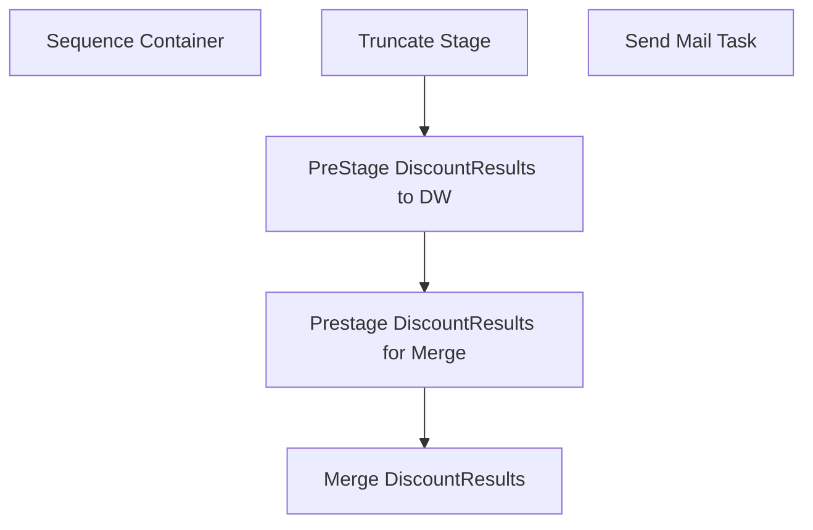

# SSIS Package: DiscountResultsETL

**Project:** DiscountResultsETL  
**Folder:** DW  
**Server:** STL-SSIS-P-01  

## Connection Managers

| Name | Type | Server | Catalog | Connection (sanitized) |
|---|---|---|---|---|
| DWStaging | OLEDB | papamart | DWStaging | Data Source=papamart; Initial Catalog=DWStaging; Provider=SQLNCLI11.1; Integrated Security=SSPI; Auto Translate=False |
| DiscountMstrData | OLEDB | kodiak | DiscountMstrData | Data Source=kodiak; Initial Catalog=DiscountMstrData; Provider=SQLNCLI11.1; Integrated Security=SSPI; Auto Translate=False |
| SMTP | SMTP |  |  |  |
| dw | OLEDB | papamart | dw | Data Source=papamart; Initial Catalog=dw; Provider=SQLNCLI11.1; Integrated Security=SSPI; Auto Translate=False |

## Control Flow Tasks

| Task | Type |
|---|---|
| DiscountResultsETL | Package |
| Sequence Container | SEQUENCE |
| Merge DiscountResults | ExecuteSQLTask |
| Prestage DiscountResults for Merge | Pipeline |
| PreStage DiscountResults to DW | ExecuteSQLTask |
| Truncate Stage | ExecuteSQLTask |
| Send Mail Task | SendMailTask |

## Control Flow Outline

```text
- Send Mail Task [SendMailTask]
- Sequence Container [SEQUENCE]
  - Merge DiscountResults [ExecuteSQLTask]
  - PreStage DiscountResults to DW [ExecuteSQLTask]
  - Prestage DiscountResults for Merge [Pipeline]
  - Truncate Stage [ExecuteSQLTask]
```

## Architecture Diagram



## Variables

| Namespace | Name | Expression-bound |
|---|---|---|
| System | Propagate | No |
| User | DateTimeStamp | Yes |
| User | EndDate | Yes |
| User | EndDateAsDATE | Yes |
| User | GetDate | Yes |
| User | GetDateAsDATE | Yes |
| User | StartDate | Yes |
| User | StartDateAsDATE | Yes |

### Expression-bound variable values

#### User::DateTimeStamp

**Expression:**

```sql
(DT_WSTR,4)DATEPART("yyyy",GetDate()) 
+ (DT_WSTR,4)DATEPART("mm",GetDate()) 
+ (DT_WSTR,4)DATEPART("dd",GetDate()) 
+ (DT_WSTR,4)DATEPART("hh",GetDate()) 
+ (DT_WSTR,4)DATEPART("mi",GetDate()) 
+ (DT_WSTR,4)DATEPART("ss",GetDate()) 
+ (DT_WSTR,4)DATEPART("ms",GetDate())
```

**Evaluated value:**

```sql
20219167052100
```

#### User::EndDate

**Expression:**

```sql
dateadd("dd", @[$Package::DaysToInclude], @[User::StartDate])
```

**Evaluated value:**

```sql
9/16/2021
```

#### User::EndDateAsDATE

**Expression:**

```sql
(DT_WSTR, 4) datepart("year", @[User::EndDate])  + "-" +
right("0"+ (DT_WSTR, 2) datepart("mm", @[User::EndDate]),2)  + "-" +
right("0" +(DT_WSTR, 2) datepart("dd",  @[User::EndDate]),2)
```

**Evaluated value:**

```sql
2021-09-16
```

#### User::GetDate

**Expression:**

```sql
(DT_DATE)DATEDIFF("Day", (DT_DATE) 0, GETDATE())
```

**Evaluated value:**

```sql
9/16/2021
```

#### User::GetDateAsDATE

**Expression:**

```sql
(DT_WSTR, 4) datepart("year", @[User::GetDate])  + "-" +
right("0"+ (DT_WSTR, 2) datepart("mm", @[User::GetDate]),2)  + "-" +
right("0" +(DT_WSTR, 2) datepart("dd",  @[User::GetDate]),2)
```

**Evaluated value:**

```sql
2021-09-16
```

#### User::StartDate

**Expression:**

```sql
dateadd("dd", -@[$Package::DaysToGoBack] , @[User::GetDate] )
```

**Evaluated value:**

```sql
8/17/2021
```

#### User::StartDateAsDATE

**Expression:**

```sql
(DT_WSTR, 4) datepart("year", @[User::StartDate])  + "-" +
right("0"+ (DT_WSTR, 2) datepart("mm", @[User::StartDate]),2)  + "-" +
right("0" +(DT_WSTR, 2) datepart("dd",  @[User::StartDate]),2)
```

**Evaluated value:**

```sql
2021-08-17
```

## Execute SQL Tasks

### Merge DiscountResults

**Path:** `Package\Sequence Container\Merge DiscountResults`  
**Connection:** DiscountMstrData (kodiak/DiscountMstrData)  

```sql
exec spMergeDiscountResults
```

### PreStage DiscountResults to DW

**Path:** `Package\Sequence Container\PreStage DiscountResults to DW`  
**Connection:** dw (papamart/dw)  

> ⚠️ `SqlStatementSource` is overridden at runtime by a property expression (shown below); the static SQL may not be what executes.

**Static SqlStatementSource:**

```sql
EXEC spDM_Build_Discount_Results @DaysHorizon=30
```

**Property expression (runtime override):**

```sql
"EXEC spDM_Build_Discount_Results @DaysHorizon=" +  (DT_STR, 4, 1252) @[$Package::DaysToGoBack]
```

### Truncate Stage

**Path:** `Package\Sequence Container\Truncate Stage`  
**Connection:** DiscountMstrData (kodiak/DiscountMstrData)  

```sql
TRUNCATE TABLE OutboundDiscountResultsStage
```

## Data Flow: Sources

| Component | Source Object | Type | Data Flow Task | Connection | SQL Kind |
|---|---|---|---|---|---|
| DW DiscountResults Staged |  | OLEDBSource | Prestage DiscountResults for Merge | dw |  |

## Data Flow: Destinations

| Component | Target Table | Type | Data Flow Task | Connection | SQL Kind |
|---|---|---|---|---|---|
| OutboundDiscountResultsStage |  | OLEDBDestination | Prestage DiscountResults for Merge | DiscountMstrData |  |
