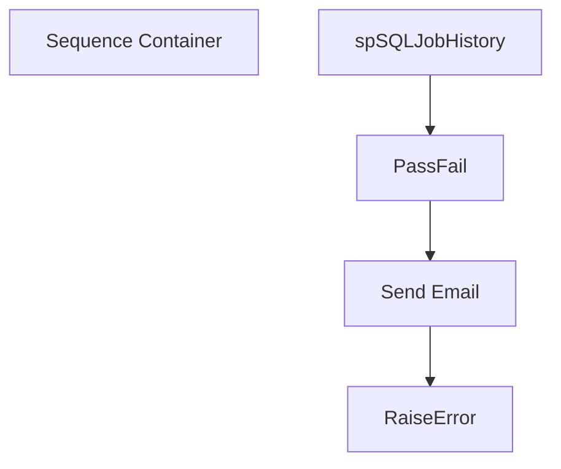

# SSIS Package: FinanceReportsPreFlightCheck

**Project:** FinanceReportsPreFlightCheck  
**Folder:** DW  
**Server:** STL-SSIS-P-01  

## Connection Managers

| Name | Type | Server | Catalog | Connection (sanitized) |
|---|---|---|---|---|
| dw | OLEDB | papamart | dw | Data Source=papamart; Initial Catalog=dw; Provider=SQLNCLI11.1; Integrated Security=SSPI; Auto Translate=False |

## Control Flow Tasks

| Task | Type |
|---|---|
| FinanceReportsPreFlightCheck | Package |
| Sequence Container | SEQUENCE |
| PassFail | ExecuteSQLTask |
| RaiseError | ExecuteSQLTask |
| Send Email | ExecuteSQLTask |
| spSQLJobHistory | ExecuteSQLTask |

## Control Flow Outline

```text
- Sequence Container [SEQUENCE]
  - PassFail [ExecuteSQLTask]
  - RaiseError [ExecuteSQLTask]
  - Send Email [ExecuteSQLTask]
  - spSQLJobHistory [ExecuteSQLTask]
```

## Architecture Diagram



## Variables

| Namespace | Name | Expression-bound |
|---|---|---|
| User | Pass | No |

## Execute SQL Tasks

### PassFail

**Path:** `Package\Sequence Container\PassFail`  
**Connection:** dw (papamart/dw)  

```sql
declare 
	@LaborStat varchar(4),
	@TrafficStat varchar(4),
	@GuestLoadStat varchar(4),
	@SalesStat varchar(4),
	@DimStat varchar(4),
	@FranchStat varchar(4),
	@Pass int
 
if (
		select count(*) from SQLJobHistory j
			where j.DataSet = 'Labor' 
				and 
				(
					(
						(j.Run_Status <> 'Succeeded' or j.Run_Status is NULL) 
							and
						j.JobName not in (select jj.JobName from SQLJobHistory jj where jj.DataSet = 'Labor' and jj.Run_Status = 'Succeeded' and jj.RunDateTime > j.RunDateTime ) --in case we ran the job again after it failed
					) 

				)
	) > 0 
		
	set @LaborStat = 'Fail' else set @LaborStat = 'Pass'

if (
		select count(*) from SQLJobHistory j
			where j.DataSet = 'Traffic' 
				and (
					(
						(j.Run_Status <> 'Succeeded' or j.Run_Status is NULL) 
							and
						j.JobName not in (select jj.JobName from SQLJobHistory jj where jj.DataSet = 'Traffic' and jj.Run_Status = 'Succeeded' and jj.RunDateTime > j.RunDateTime )--in case we ran the job again after it failed
					)
					)
	) > 0

	set @TrafficStat = 'Fail' else set @TrafficStat = 'Pass'

if (
		select count(*) from SQLJobHistory j
			where j.DataSet = 'Guest Load' 
				and (
					(
						(j.Run_Status <> 'Succeeded' or j.Run_Status is NULL) 
							and
						j.JobName not in (select jj.JobName from SQLJobHistory jj where jj.DataSet = 'Guest Load' and jj.Run_Status = 'Succeeded' and jj.RunDateTime > j.RunDateTime )--in case we ran the job again after it failed
					)
					)
	) > 0
	set @GuestLoadStat = 'Fail' else set @GuestLoadStat = 'Pass'

if (
		select count(*) from SQLJobHistory j
			where j.DataSet = 'AW Sales' and JobName='ProcessCubeMeasures'
				and 
					(
					(
						(j.Run_Status <> 'Succeeded' or j.Run_Status is NULL) 
							and
						j.JobName not in (select jj.JobName from SQLJobHistory jj where jj.DataSet = 'AW Sales' and jj.Run_Status = 'Succeeded' and jj.RunDateTime > j.RunDateTime )--in case we ran the job again after it failed
					)
					)
	) > 0
	set @SalesStat = 'Fail' else set @SalesStat = 'Pass'

if (
		select count(*) from SQLJobHistory j
			where j.DataSet = 'Dimensions' 
				and 
					(
					(
						(j.Run_Status <> 'Succeeded' or j.Run_Status is NULL) 
							and
						j.JobName not in (select jj.JobName from SQLJobHistory jj where jj.DataSet = 'Dimensions' and jj.Run_Status = 'Succeeded' and jj.RunDateTime > j.RunDateTime )--in case we ran the job again after it failed
					)
					)
	) > 0
	set @DimStat = 'Fail' else set @DimStat = 'Pass'

	if (
		select count(*) from SQLJobHistory j
			where j.DataSet = 'Franchisee' 
				and 
					(
					(
						(j.Run_Status <> 'Succeeded' or j.Run_Status is NULL) 
							and
						j.JobName not in (select jj.JobName from SQLJobHistory jj where jj.DataSet = 'Franchisee' and jj.Run_Status = 'Succeeded' and jj.RunDateTime > j.RunDateTime )--in case we ran the job again after it failed
					) 
					)
	) > 0
	set @FranchStat = 'Fail' else set @FranchStat = 'Pass'

				
if 	
	
	@LaborStat='Fail' or
	@TrafficStat='Fail' or
	@SalesStat='Fail' --or
	--@GuestLoadStat='Fail' or
	--@DimStat='Fail' or
	--@FranchStat='Fail'

	select @Pass=0
	else
	select @Pass=1

select @Pass as Pass
```

### RaiseError

**Path:** `Package\Sequence Container\RaiseError`  
**Connection:** dw (papamart/dw)  

```sql
RAISERROR ('One or more jobs have failed that are critical to the reports.',16,1)
```

### Send Email

**Path:** `Package\Sequence Container\Send Email`  
**Connection:** dw (papamart/dw)  

```sql
exec msdb.dbo.sp_send_dbmail
@profile_name = 'biadmin',
@recipients = 'FinancialAnalyst@buildabear.com;biadmin@buildabear.com',
--@recipients = 'dant@buildabear.com',
@body = 'The automated sales reports are delayed due to data processing still in progress. The BI team will notify you and/or trigger the reports when ready.',
@subject = 'Automated Sales Reports: Delayed'


```

### spSQLJobHistory

**Path:** `Package\Sequence Container\spSQLJobHistory`  
**Connection:** dw (papamart/dw)  

```sql
exec spSQLJobHistory
```

## Data Flow: Sources

_None detected._

## Data Flow: Destinations

_None detected._
