# SSIS Package: GiftCard_Process

**Project:** GiftCard_Process  
**Folder:** DW  
**Server:** STL-SSIS-P-01  

## Connection Managers

| Name | Type | Server | Catalog | Connection (sanitized) |
|---|---|---|---|---|
| ASNCorrections | FLATFILE |  |  |  |
| DW | OLEDB | papamart | dw | Data Source=papamart; Initial Catalog=dw; Provider=SQLNCLI11.1; Integrated Security=SSPI; Auto Translate=False |
| DWStaging | OLEDB | papamart | DWStaging | Data Source=papamart; Initial Catalog=DWStaging; Provider=SQLNCLI11.1; Integrated Security=SSPI; Auto Translate=False |
| Flat File Connection Manager | FLATFILE |  |  |  |
| IntegrationStaging | OLEDB | STL-SSIS-T-01 | IntegrationStaging | Data Source=STL-SSIS-T-01; Initial Catalog=IntegrationStaging; Provider=SQLNCLI11.1; Integrated Security=SSPI; Auto Translate=False |
| ProductInventory | FLATFILE |  |  |  |
| SMTP | SMTP |  |  |  |
| SendLog | FLATFILE |  |  |  |
| SendLogPIPE.csv | FILE |  |  |  |
| currentGCfile | FLATFILE |  |  |  |
| papamart.DWStaging | OLEDB | papamart | DWStaging | Data Source=papamart; Initial Catalog=DWStaging; Provider=SQLNCLI11.1; Integrated Security=SSPI; Auto Translate=False |

## Control Flow Tasks

| Task | Type |
|---|---|
| GiftCard_Process | Package |
| pause | FORLOOP |
| pause 1 | FORLOOP |
| pause 2 | FORLOOP |
| pause 3 | FORLOOP |
| pause 4 | FORLOOP |
| Process | SEQUENCE |
| UK file operations | SEQUENCE |
| UK file loading | FOREACHLOOP |
| detail merge | ExecuteSQLTask |
| FIleID update | ExecuteSQLTask |
| header merge | ExecuteSQLTask |
| pause | FORLOOP |
| pause 3 | FORLOOP |
| pause 4 | FORLOOP |
| Sequence Container 6 | SEQUENCE |
| count already written | ExecuteSQLTask |
| date to write | ExecuteSQLTask |
| truncate stage | ExecuteSQLTask |
| UK load header & detail | Pipeline |
| UK file move to processed | FOREACHLOOP |
| move and rename | FileSystemTask |
| reload UK seq | ExecuteSQLTask |
| Sequence Container | SEQUENCE |
| US inserted today | ExecuteSQLTask |
| Sequence Container 1 | SEQUENCE |
| US file | FOREACHLOOP |
| Send Mail Task | SendMailTask |
| Sequence Container 1 1 | SEQUENCE |
| UK file | FOREACHLOOP |
| Send Mail Task | SendMailTask |
| Sequence Container 2 | SEQUENCE |
| DACT | FOREACHLOOP |
| move to reports | FileSystemTask |
| HDSK | FOREACHLOOP |
| move to reports | FileSystemTask |
| Sequence Container 3 | SEQUENCE |
| pause 1 | FORLOOP |
| Sequence Container | SEQUENCE |
| retreive UK seq | ExecuteSQLTask |
| Sequence Container 1 | SEQUENCE |
| UK | FOREACHLOOP |
| rename UK file | FileSystemTask |
| UK file | FOREACHLOOP |
| GiftCard_FTP_Status | Pipeline |
| merge GC_FTP_Status | ExecuteSQLTask |
| row count | Pipeline |
| truncate stage | ExecuteSQLTask |
| Sequence Container 4 | SEQUENCE |
| US file operations | SEQUENCE |
| US file loading | FOREACHLOOP |
| detail merge | ExecuteSQLTask |
| FIleID update | ExecuteSQLTask |
| header merge | ExecuteSQLTask |
| pause | FORLOOP |
| pause 3 | FORLOOP |
| pause 4 | FORLOOP |
| Sequence Container 6 | SEQUENCE |
| count already written | ExecuteSQLTask |
| date to write | ExecuteSQLTask |
| truncate stage | ExecuteSQLTask |
| US load header & detail | Pipeline |
| US load troubleshoot1 | Pipeline |
| US load troubleshoot2 | Pipeline |
| US file move to processed | FOREACHLOOP |
| move and rename | FileSystemTask |
| reload US seq | ExecuteSQLTask |
| Sequence Container 5 | SEQUENCE |
| UK inserted today | ExecuteSQLTask |
| Verify | SEQUENCE |
| add seq number to filenames | SEQUENCE |
| US | FOREACHLOOP |
| rename US file | FileSystemTask |
| pause | FORLOOP |
| Sequence Container | SEQUENCE |
| retreive US seq | ExecuteSQLTask |
| US file | FOREACHLOOP |
| GiftCard_FTP_Status | Pipeline |
| merge GC_FTP_Status | ExecuteSQLTask |
| row count | Pipeline |
| truncate stage | ExecuteSQLTask |
| Send Mail Task | SendMailTask |

## Control Flow Outline

```text
- Send Mail Task [SendMailTask]
- Process [SEQUENCE]
  - UK file operations [SEQUENCE]
    - UK file loading [FOREACHLOOP]
      - FIleID update [ExecuteSQLTask]
      - Sequence Container 6 [SEQUENCE]
        - count already written [ExecuteSQLTask]
        - date to write [ExecuteSQLTask]
      - UK load header & detail [Pipeline]
      - detail merge [ExecuteSQLTask]
      - header merge [ExecuteSQLTask]
      - pause [FORLOOP]
      - pause 3 [FORLOOP]
      - pause 4 [FORLOOP]
      - truncate stage [ExecuteSQLTask]
    - UK file move to processed [FOREACHLOOP]
      - move and rename [FileSystemTask]
      - reload UK seq [ExecuteSQLTask]
- Sequence Container [SEQUENCE]
- Sequence Container 1 [SEQUENCE]
- Sequence Container 1 1 [SEQUENCE]
  - UK file [FOREACHLOOP]
    - Send Mail Task [SendMailTask]
  - US file [FOREACHLOOP]
    - Send Mail Task [SendMailTask]
- Sequence Container 2 [SEQUENCE]
  - DACT [FOREACHLOOP]
    - move to reports [FileSystemTask]
  - HDSK [FOREACHLOOP]
    - move to reports [FileSystemTask]
- Sequence Container 3 [SEQUENCE]
  - Sequence Container [SEQUENCE]
  - Sequence Container 1 [SEQUENCE]
    - UK [FOREACHLOOP]
      - rename UK file [FileSystemTask]
    - retreive UK seq [ExecuteSQLTask]
  - UK file [FOREACHLOOP]
    - GiftCard_FTP_Status [Pipeline]
    - merge GC_FTP_Status [ExecuteSQLTask]
    - row count [Pipeline]
    - truncate stage [ExecuteSQLTask]
  - pause 1 [FORLOOP]
- Sequence Container 4 [SEQUENCE]
  - US file operations [SEQUENCE]
    - US file loading [FOREACHLOOP]
      - FIleID update [ExecuteSQLTask]
      - Sequence Container 6 [SEQUENCE]
        - count already written [ExecuteSQLTask]
        - date to write [ExecuteSQLTask]
      - US load header & detail [Pipeline]
      - US load troubleshoot1 [Pipeline]
      - US load troubleshoot2 [Pipeline]
      - detail merge [ExecuteSQLTask]
      - header merge [ExecuteSQLTask]
      - pause [FORLOOP]
      - pause 3 [FORLOOP]
      - pause 4 [FORLOOP]
      - truncate stage [ExecuteSQLTask]
    - US file move to processed [FOREACHLOOP]
      - move and rename [FileSystemTask]
      - reload US seq [ExecuteSQLTask]
- Sequence Container 5 [SEQUENCE]
  - UK inserted today [ExecuteSQLTask]
  - US inserted today [ExecuteSQLTask]
- Verify [SEQUENCE]
  - Sequence Container [SEQUENCE]
    - retreive US seq [ExecuteSQLTask]
  - US file [FOREACHLOOP]
    - GiftCard_FTP_Status [Pipeline]
    - merge GC_FTP_Status [ExecuteSQLTask]
    - row count [Pipeline]
    - truncate stage [ExecuteSQLTask]
  - add seq number to filenames [SEQUENCE]
    - US [FOREACHLOOP]
      - rename US file [FileSystemTask]
  - pause [FORLOOP]
- pause [FORLOOP]
- pause 1 [FORLOOP]
- pause 2 [FORLOOP]
- pause 3 [FORLOOP]
- pause 4 [FORLOOP]
```

## Architecture Diagram

```mermaid
flowchart TD
    n_Package_pause["pause"]
    n_Package_pause_1["pause 1"]
    n_Package_pause_2["pause 2"]
    n_Package_pause_3["pause 3"]
    n_Package_pause_4["pause 4"]
    n_Package_Process["Process"]
    n_Package_Process_UK_file_operations["UK file operations"]
    n_Package_Process_UK_file_operations_UK_file_loading["UK file loading"]
    n_Package_Process_UK_file_operations_UK_file_loading_detail_merge["detail merge"]
    n_Package_Process_UK_file_operations_UK_file_loading_FIleID_update["FIleID update"]
    n_Package_Process_UK_file_operations_UK_file_loading_header_merge["header merge"]
    n_Package_Process_UK_file_operations_UK_file_loading_pause["pause"]
    n_Package_Process_UK_file_operations_UK_file_loading_pause_3["pause 3"]
    n_Package_Process_UK_file_operations_UK_file_loading_pause_4["pause 4"]
    n_Package_Process_UK_file_operations_UK_file_loading_Sequence_Container_6["Sequence Container 6"]
    n_Package_Process_UK_file_operations_UK_file_loading_Sequence_Container_6_count_already_written["count already written"]
    n_Package_Process_UK_file_operations_UK_file_loading_Sequence_Container_6_date_to_write["date to write"]
    n_Package_Process_UK_file_operations_UK_file_loading_truncate_stage["truncate stage"]
    n_Package_Process_UK_file_operations_UK_file_loading_UK_load_header___detail["UK load header & detail"]
    n_Package_Process_UK_file_operations_UK_file_move_to_processed["UK file move to processed"]
    n_Package_Process_UK_file_operations_UK_file_move_to_processed_move_and_rename["move and rename"]
    n_Package_Process_UK_file_operations_UK_file_move_to_processed_reload_UK_seq["reload UK seq"]
    n_Package_Sequence_Container["Sequence Container"]
    n_Package_Sequence_Container_US_inserted_today["US inserted today"]
    n_Package_Sequence_Container_1["Sequence Container 1"]
    n_Package_Sequence_Container_1_US_file["US file"]
    n_Package_Sequence_Container_1_US_file_Send_Mail_Task["Send Mail Task"]
    n_Package_Sequence_Container_1_1["Sequence Container 1 1"]
    n_Package_Sequence_Container_1_1_UK_file["UK file"]
    n_Package_Sequence_Container_1_1_UK_file_Send_Mail_Task["Send Mail Task"]
    n_Package_Sequence_Container_2["Sequence Container 2"]
    n_Package_Sequence_Container_2_DACT["DACT"]
    n_Package_Sequence_Container_2_DACT_move_to_reports["move to reports"]
    n_Package_Sequence_Container_2_HDSK["HDSK"]
    n_Package_Sequence_Container_2_HDSK_move_to_reports["move to reports"]
    n_Package_Sequence_Container_3["Sequence Container 3"]
    n_Package_Sequence_Container_3_pause_1["pause 1"]
    n_Package_Sequence_Container_3_Sequence_Container["Sequence Container"]
    n_Package_Sequence_Container_3_Sequence_Container_retreive_UK_seq["retreive UK seq"]
    n_Package_Sequence_Container_3_Sequence_Container_1["Sequence Container 1"]
    n_Package_Sequence_Container_3_Sequence_Container_1_UK["UK"]
    n_Package_Sequence_Container_3_Sequence_Container_1_UK_rename_UK_file["rename UK file"]
    n_Package_Sequence_Container_3_UK_file["UK file"]
    n_Package_Sequence_Container_3_UK_file_GiftCard_FTP_Status["GiftCard_FTP_Status"]
    n_Package_Sequence_Container_3_UK_file_merge_GC_FTP_Status["merge GC_FTP_Status"]
    n_Package_Sequence_Container_3_UK_file_row_count["row count"]
    n_Package_Sequence_Container_3_UK_file_truncate_stage["truncate stage"]
    n_Package_Sequence_Container_4["Sequence Container 4"]
    n_Package_Sequence_Container_4_US_file_operations["US file operations"]
    n_Package_Sequence_Container_4_US_file_operations_US_file_loading["US file loading"]
    n_Package_Sequence_Container_4_US_file_operations_US_file_loading_detail_merge["detail merge"]
    n_Package_Sequence_Container_4_US_file_operations_US_file_loading_FIleID_update["FIleID update"]
    n_Package_Sequence_Container_4_US_file_operations_US_file_loading_header_merge["header merge"]
    n_Package_Sequence_Container_4_US_file_operations_US_file_loading_pause["pause"]
    n_Package_Sequence_Container_4_US_file_operations_US_file_loading_pause_3["pause 3"]
    n_Package_Sequence_Container_4_US_file_operations_US_file_loading_pause_4["pause 4"]
    n_Package_Sequence_Container_4_US_file_operations_US_file_loading_Sequence_Container_6["Sequence Container 6"]
    n_Package_Sequence_Container_4_US_file_operations_US_file_loading_Sequence_Container_6_count_already_written["count already written"]
    n_Package_Sequence_Container_4_US_file_operations_US_file_loading_Sequence_Container_6_date_to_write["date to write"]
    n_Package_Sequence_Container_4_US_file_operations_US_file_loading_truncate_stage["truncate stage"]
    n_Package_Sequence_Container_4_US_file_operations_US_file_loading_US_load_header___detail["US load header & detail"]
    n_Package_Sequence_Container_4_US_file_operations_US_file_loading_US_load_troubleshoot1["US load troubleshoot1"]
    n_Package_Sequence_Container_4_US_file_operations_US_file_loading_US_load_troubleshoot2["US load troubleshoot2"]
    n_Package_Sequence_Container_4_US_file_operations_US_file_move_to_processed["US file move to processed"]
    n_Package_Sequence_Container_4_US_file_operations_US_file_move_to_processed_move_and_rename["move and rename"]
    n_Package_Sequence_Container_4_US_file_operations_US_file_move_to_processed_reload_US_seq["reload US seq"]
    n_Package_Sequence_Container_5["Sequence Container 5"]
    n_Package_Sequence_Container_5_UK_inserted_today["UK inserted today"]
    n_Package_Verify["Verify"]
    n_Package_Verify_add_seq_number_to_filenames["add seq number to filenames"]
    n_Package_Verify_add_seq_number_to_filenames_US["US"]
    n_Package_Verify_add_seq_number_to_filenames_US_rename_US_file["rename US file"]
    n_Package_Verify_pause["pause"]
    n_Package_Verify_Sequence_Container["Sequence Container"]
    n_Package_Verify_Sequence_Container_retreive_US_seq["retreive US seq"]
    n_Package_Verify_US_file["US file"]
    n_Package_Verify_US_file_GiftCard_FTP_Status["GiftCard_FTP_Status"]
    n_Package_Verify_US_file_merge_GC_FTP_Status["merge GC_FTP_Status"]
    n_Package_Verify_US_file_row_count["row count"]
    n_Package_Verify_US_file_truncate_stage["truncate stage"]
    n_Package_EventHandlers_OnError__Send_Mail_Task["Send Mail Task"]
    n_Package_Process_UK_file_operations_UK_file_loading_Sequence_Container_6_date_to_write --> n_Package_Process_UK_file_operations_UK_file_loading_Sequence_Container_6_count_already_written
    n_Package_Process_UK_file_operations_UK_file_loading_UK_load_header___detail --> n_Package_Process_UK_file_operations_UK_file_loading_Sequence_Container_6
    n_Package_Process_UK_file_operations_UK_file_loading_truncate_stage --> n_Package_Process_UK_file_operations_UK_file_loading_UK_load_header___detail
    n_Package_Process_UK_file_operations_UK_file_loading_pause_4 --> n_Package_Process_UK_file_operations_UK_file_loading_FIleID_update
    n_Package_Process_UK_file_operations_UK_file_loading_FIleID_update --> n_Package_Process_UK_file_operations_UK_file_loading_pause
    n_Package_Process_UK_file_operations_UK_file_loading_pause --> n_Package_Process_UK_file_operations_UK_file_loading_detail_merge
    n_Package_Process_UK_file_operations_UK_file_loading_pause_3 --> n_Package_Process_UK_file_operations_UK_file_loading_header_merge
    n_Package_Process_UK_file_operations_UK_file_loading_header_merge --> n_Package_Process_UK_file_operations_UK_file_loading_pause_4
    n_Package_Process_UK_file_operations_UK_file_loading_Sequence_Container_6 --> n_Package_Process_UK_file_operations_UK_file_loading_pause_3
    n_Package_Process_UK_file_operations_UK_file_move_to_processed_reload_UK_seq --> n_Package_Process_UK_file_operations_UK_file_move_to_processed_move_and_rename
    n_Package_Process_UK_file_operations_UK_file_loading --> n_Package_Process_UK_file_operations_UK_file_move_to_processed
    n_Package_Sequence_Container_2_HDSK --> n_Package_Sequence_Container_2_DACT
    n_Package_Sequence_Container_3_UK_file_row_count --> n_Package_Sequence_Container_3_UK_file_GiftCard_FTP_Status
    n_Package_Sequence_Container_3_UK_file_truncate_stage --> n_Package_Sequence_Container_3_UK_file_row_count
    n_Package_Sequence_Container_3_UK_file_GiftCard_FTP_Status --> n_Package_Sequence_Container_3_UK_file_merge_GC_FTP_Status
    n_Package_Sequence_Container_3_UK_file --> n_Package_Sequence_Container_3_pause_1
    n_Package_Sequence_Container_3_pause_1 --> n_Package_Sequence_Container_3_Sequence_Container
    n_Package_Sequence_Container_3_Sequence_Container --> n_Package_Sequence_Container_3_Sequence_Container_1
    n_Package_Sequence_Container_4_US_file_operations_US_file_loading_Sequence_Container_6_date_to_write --> n_Package_Sequence_Container_4_US_file_operations_US_file_loading_Sequence_Container_6_count_already_written
    n_Package_Sequence_Container_4_US_file_operations_US_file_loading_US_load_header___detail --> n_Package_Sequence_Container_4_US_file_operations_US_file_loading_Sequence_Container_6
    n_Package_Sequence_Container_4_US_file_operations_US_file_loading_truncate_stage --> n_Package_Sequence_Container_4_US_file_operations_US_file_loading_US_load_header___detail
    n_Package_Sequence_Container_4_US_file_operations_US_file_loading_pause_4 --> n_Package_Sequence_Container_4_US_file_operations_US_file_loading_FIleID_update
    n_Package_Sequence_Container_4_US_file_operations_US_file_loading_FIleID_update --> n_Package_Sequence_Container_4_US_file_operations_US_file_loading_pause
    n_Package_Sequence_Container_4_US_file_operations_US_file_loading_pause --> n_Package_Sequence_Container_4_US_file_operations_US_file_loading_detail_merge
    n_Package_Sequence_Container_4_US_file_operations_US_file_loading_pause_3 --> n_Package_Sequence_Container_4_US_file_operations_US_file_loading_header_merge
    n_Package_Sequence_Container_4_US_file_operations_US_file_loading_header_merge --> n_Package_Sequence_Container_4_US_file_operations_US_file_loading_pause_4
    n_Package_Sequence_Container_4_US_file_operations_US_file_loading_Sequence_Container_6 --> n_Package_Sequence_Container_4_US_file_operations_US_file_loading_pause_3
    n_Package_Sequence_Container_4_US_file_operations_US_file_move_to_processed_reload_US_seq --> n_Package_Sequence_Container_4_US_file_operations_US_file_move_to_processed_move_and_rename
    n_Package_Sequence_Container_4_US_file_operations_US_file_loading --> n_Package_Sequence_Container_4_US_file_operations_US_file_move_to_processed
    n_Package_Verify_US_file_row_count --> n_Package_Verify_US_file_GiftCard_FTP_Status
    n_Package_Verify_US_file_truncate_stage --> n_Package_Verify_US_file_row_count
    n_Package_Verify_US_file_GiftCard_FTP_Status --> n_Package_Verify_US_file_merge_GC_FTP_Status
    n_Package_Verify_US_file --> n_Package_Verify_pause
    n_Package_Verify_Sequence_Container --> n_Package_Verify_add_seq_number_to_filenames
    n_Package_Verify_pause --> n_Package_Verify_Sequence_Container
    n_Package_Sequence_Container_2 --> n_Package_Sequence_Container
    n_Package_Sequence_Container --> n_Package_pause
    n_Package_Sequence_Container --> n_Package_Sequence_Container_1
    n_Package_Sequence_Container_5 --> n_Package_Sequence_Container_1_1
    n_Package_pause_4 --> n_Package_Verify
    n_Package_Sequence_Container_2 --> n_Package_Sequence_Container_5
    n_Package_Sequence_Container_5 --> n_Package_pause_3
    n_Package_pause_4 --> n_Package_Sequence_Container_3
    n_Package_Verify --> n_Package_pause_1
    n_Package_pause_1 --> n_Package_Sequence_Container_4
    n_Package_Sequence_Container_3 --> n_Package_pause_2
    n_Package_pause_2 --> n_Package_Process
```



## Variables

| Namespace | Name | Expression-bound |
|---|---|---|
| System | Propagate | No |
| User | DateTimeStamp | Yes |
| User | EndDate | Yes |
| User | EndDateAsDATE | Yes |
| User | GetDate | Yes |
| User | GetDateAsDATE | Yes |
| User | SQL_CheckIfUKfileHasBeenProcessed | Yes |
| User | SQL_CheckIfUSfileHasBeenProcessed | Yes |
| User | StartDate | Yes |
| User | StartDateAsDATE | Yes |
| User | isUKalreadyProcessed | No |
| User | isUSalreadyProcessed | No |
| User | varCurrentDACTfile | No |
| User | varCurrentHDSKfile | No |
| User | varCurrentPTDfile | No |
| User | varCurrentPTDfilename | Yes |
| User | varDACTdestPath | Yes |
| User | varDACTsourcePath | Yes |
| User | varDateAlreadyWrittenCount | No |
| User | varDateAlreadyWrittenCountUK | No |
| User | varDateToWrite | No |
| User | varDateToWriteUK | No |
| User | varDirectoryReports | Yes |
| User | varDirectoryUK | Yes |
| User | varDirectoryUKprocessed | Yes |
| User | varDirectoryUS | Yes |
| User | varDirectoryUSprocessed | Yes |
| User | varFooterFound | No |
| User | varHDSKdestPath | Yes |
| User | varHDSKsourcePath | Yes |
| User | varPTD_GroupCode | Yes |
| User | varRowCountUK | No |
| User | varRowCountUS | No |
| User | varRowsExpected | No |
| User | varUKcode | No |
| User | varUKfileID | No |
| User | varUKfilename | No |
| User | varUKfilename2 | Yes |
| User | varUKfilename3 | Yes |
| User | varUKfilename4 | Yes |
| User | varUKfilename5 | Yes |
| User | varUKrecordsInsertedToday | No |
| User | varUKseq | No |
| User | varUScode | No |
| User | varUSfileID | No |
| User | varUSfilename | No |
| User | varUSfilename2 | Yes |
| User | varUSfilename3 | Yes |
| User | varUSfilename4 | Yes |
| User | varUSfilename5 | Yes |
| User | varUSrecordsInsertedToday | No |
| User | varUSseq | No |

### Expression-bound variable values

#### User::DateTimeStamp

**Expression:**

```sql
(DT_WSTR,4)DATEPART("yyyy",GetDate()) 
+ (DT_WSTR,4)DATEPART("mm",GetDate()) 
+ (DT_WSTR,4)DATEPART("dd",GetDate()) 
+ (DT_WSTR,4)DATEPART("hh",GetDate()) 
+ (DT_WSTR,4)DATEPART("mi",GetDate()) 
+ (DT_WSTR,4)DATEPART("ss",GetDate()) 
+ (DT_WSTR,4)DATEPART("ms",GetDate())
```

**Evaluated value:**

```sql
2026362261667
```

#### User::EndDate

**Expression:**

```sql
dateadd("dd", @[$Package::DaysToInclude], @[User::StartDate])
```

**Evaluated value:**

```sql
3/6/2026
```

#### User::EndDateAsDATE

**Expression:**

```sql
(DT_WSTR, 4) datepart("year", @[User::EndDate])  + "-" +
right("0"+ (DT_WSTR, 2) datepart("mm", @[User::EndDate]),2)  + "-" +
right("0" +(DT_WSTR, 2) datepart("dd",  @[User::EndDate]),2)
```

**Evaluated value:**

```sql
2026-03-06
```

#### User::GetDate

**Expression:**

```sql
(DT_DATE)DATEDIFF("Day", (DT_DATE) 0, GETDATE())
```

**Evaluated value:**

```sql
3/6/2026
```

#### User::GetDateAsDATE

**Expression:**

```sql
(DT_WSTR, 4) datepart("year", @[User::GetDate])  + "-" +
right("0"+ (DT_WSTR, 2) datepart("mm", @[User::GetDate]),2)  + "-" +
right("0" +(DT_WSTR, 2) datepart("dd",  @[User::GetDate]),2)
```

**Evaluated value:**

```sql
2026-03-06
```

#### User::SQL_CheckIfUKfileHasBeenProcessed

**Expression:**

```sql
"SELECT CAST(Count(file_name) AS BIT) FROM GiftCard_Header_International" +" WHERE file_name = '" + @[User::varCurrentPTDfilename] + "'"
```

**Evaluated value:**

```sql
SELECT CAST(Count(file_name) AS BIT) FROM GiftCard_Header_International WHERE file_name = 'blank_PTD_blank'
```

#### User::SQL_CheckIfUSfileHasBeenProcessed

**Expression:**

```sql
"SELECT CAST(Count(file_name) AS BIT) FROM GiftCard_Header" +" WHERE file_name = '" + @[User::varCurrentPTDfilename] + "'"
```

**Evaluated value:**

```sql
SELECT CAST(Count(file_name) AS BIT) FROM GiftCard_Header WHERE file_name = 'blank_PTD_blank'
```

#### User::StartDate

**Expression:**

```sql
dateadd("dd", -@[$Package::DaysToGoBack] , @[User::GetDate] )
```

**Evaluated value:**

```sql
3/5/2026
```

#### User::StartDateAsDATE

**Expression:**

```sql
(DT_WSTR, 4) datepart("year", @[User::StartDate])  + "-" +
right("0"+ (DT_WSTR, 2) datepart("mm", @[User::StartDate]),2)  + "-" +
right("0" +(DT_WSTR, 2) datepart("dd",  @[User::StartDate]),2)
```

**Evaluated value:**

```sql
2026-03-05
```

#### User::varCurrentPTDfilename

**Expression:**

```sql
RIGHT(   @[User::varCurrentPTDfile]         , FINDSTRING( REVERSE(  @[User::varCurrentPTDfile]      ), "\\", 1 ) - 1 )
```

**Evaluated value:**

```sql
blank_PTD_blank
```

#### User::varDACTdestPath

**Expression:**

```sql
@[User::varDirectoryReports] +  @[User::varCurrentDACTfile]
```

**Evaluated value:**

```sql
\\stl-sql-p-04\d$\BABWSCORE01_D\GCArchive\reports\
```

#### User::varDACTsourcePath

**Expression:**

```sql
@[User::varDirectoryUS] +  @[User::varCurrentDACTfile]
```

**Evaluated value:**

```sql
\\stl-sql-p-04\d$\BABWSCORE01_D\GCArchive\Incoming\
```

#### User::varDirectoryReports

**Expression:**

```sql
@[$Package::GC_archive] + "reports\\"
```

**Evaluated value:**

```sql
\\stl-sql-p-04\d$\BABWSCORE01_D\GCArchive\reports\
```

#### User::varDirectoryUK

**Expression:**

```sql
@[$Package::GC_archive] + "Incoming_International\\"
```

**Evaluated value:**

```sql
\\stl-sql-p-04\d$\BABWSCORE01_D\GCArchive\Incoming_International\
```

#### User::varDirectoryUKprocessed

**Expression:**

```sql
@[$Package::GC_archive] + "Incoming_International\\Processed\\"
```

**Evaluated value:**

```sql
\\stl-sql-p-04\d$\BABWSCORE01_D\GCArchive\Incoming_International\Processed\
```

#### User::varDirectoryUS

**Expression:**

```sql
@[$Package::GC_archive] + "Incoming\\"
```

**Evaluated value:**

```sql
\\stl-sql-p-04\d$\BABWSCORE01_D\GCArchive\Incoming\
```

#### User::varDirectoryUSprocessed

**Expression:**

```sql
@[$Package::GC_archive] + "Incoming\\Processed\\"
```

**Evaluated value:**

```sql
\\stl-sql-p-04\d$\BABWSCORE01_D\GCArchive\Incoming\Processed\
```

#### User::varHDSKdestPath

**Expression:**

```sql
@[User::varDirectoryReports] +  @[User::varCurrentHDSKfile]
```

**Evaluated value:**

```sql
\\stl-sql-p-04\d$\BABWSCORE01_D\GCArchive\reports\
```

#### User::varHDSKsourcePath

**Expression:**

```sql
@[User::varDirectoryUS] +  @[User::varCurrentHDSKfile]
```

**Evaluated value:**

```sql
\\stl-sql-p-04\d$\BABWSCORE01_D\GCArchive\Incoming\
```

#### User::varPTD_GroupCode

**Expression:**

```sql
SUBSTRING( @[User::varCurrentPTDfile] , 1,( FINDSTRING( @[User::varCurrentPTDfile] , "_PTD", 1 ) -1) )
```

**Evaluated value:**

```sql
blank
```

#### User::varUKfilename2

**Expression:**

```sql
@[User::varDirectoryUK] + "UK_PTD_" +  @[User::varUKseq] + "_" + RIGHT( @[User::varUKfilename], 19)
```

**Evaluated value:**

```sql
\\stl-sql-p-04\d$\BABWSCORE01_D\GCArchive\Incoming_International\UK_PTD_seq_blank
```

#### User::varUKfilename3

**Expression:**

```sql
@[User::varDirectoryUK] + "UK_PTD_" +  @[User::varUKseq] + "_" + RIGHT( @[User::varUKfilename], 19)
```

**Evaluated value:**

```sql
\\stl-sql-p-04\d$\BABWSCORE01_D\GCArchive\Incoming_International\UK_PTD_seq_blank
```

#### User::varUKfilename4

**Expression:**

```sql
@[User::varDirectoryUKprocessed] + SUBSTRING( @[User::varUKfilename], 1,27) + "+MovedDate_" + @[User::DateTimeStamp] + ".TXT"
```

**Evaluated value:**

```sql
\\stl-sql-p-04\d$\BABWSCORE01_D\GCArchive\Incoming_International\Processed\blank+MovedDate_2026362261670.TXT
```

#### User::varUKfilename5

**Expression:**

```sql
@[User::varDirectoryUKprocessed] + SUBSTRING( @[User::varUKfilename], 1,27) + "+Moved_DUPE_Date_" + @[User::DateTimeStamp] + ".TXT"
```

**Evaluated value:**

```sql
\\stl-sql-p-04\d$\BABWSCORE01_D\GCArchive\Incoming_International\Processed\blank+Moved_DUPE_Date_2026362261670.TXT
```

#### User::varUSfilename2

**Expression:**

```sql
@[User::varDirectoryUS] + "US_CA_PTD_" +  @[User::varUSseq] + "_" + RIGHT( @[User::varUSfilename], 19)
```

**Evaluated value:**

```sql
\\stl-sql-p-04\d$\BABWSCORE01_D\GCArchive\Incoming\US_CA_PTD_6939_blank
```

#### User::varUSfilename3

**Expression:**

```sql
@[User::varDirectoryUS] + "US_CA_PTD_" +  @[User::varUSseq] + "_" + RIGHT( @[User::varUSfilename], 19)
```

**Evaluated value:**

```sql
\\stl-sql-p-04\d$\BABWSCORE01_D\GCArchive\Incoming\US_CA_PTD_6939_blank
```

#### User::varUSfilename4

**Expression:**

```sql
@[User::varDirectoryUSprocessed] + SUBSTRING( @[User::varUSfilename], 1,30) + "+MovedDate_" + @[User::DateTimeStamp] + ".TXT"
```

**Evaluated value:**

```sql
\\stl-sql-p-04\d$\BABWSCORE01_D\GCArchive\Incoming\Processed\blank+MovedDate_2026362261673.TXT
```

#### User::varUSfilename5

**Expression:**

```sql
@[User::varDirectoryUSprocessed] + SUBSTRING( @[User::varUSfilename], 1,30) + "+Moved_DUPE_Date_" + @[User::DateTimeStamp] + ".TXT"
```

**Evaluated value:**

```sql
\\stl-sql-p-04\d$\BABWSCORE01_D\GCArchive\Incoming\Processed\blank+Moved_DUPE_Date_2026362261673.TXT
```

## Execute SQL Tasks

### FIleID update

**Path:** `Package\Process\UK file operations\UK file loading\FIleID update`  
**Connection:** DWStaging (papamart/DWStaging)  

```sql
UPDATE DWStaging.dbo.GiftCard_Detail_International_Stage SET FileID = (SELECT CAST(IDENT_CURRENT ('DW.dbo.giftcard_header_International') as int)) WHERE FileID = -1
```

### count already written

**Path:** `Package\Process\UK file operations\UK file loading\Sequence Container 6\count already written`  
**Connection:** DW (papamart/dw)  

```sql
select count(*) as writtenCount from [dbo].[GiftCard_Header_International] where cast(period_start_date as date) = cast(? as date)
```

### date to write

**Path:** `Package\Process\UK file operations\UK file loading\Sequence Container 6\date to write`  
**Connection:** DWStaging (papamart/DWStaging)  

```sql
select period_start_date as dateToWrite from [dbo].[GiftCard_Header_International_Stage]
```

### detail merge

**Path:** `Package\Process\UK file operations\UK file loading\detail merge`  
**Connection:** DWStaging (papamart/DWStaging)  

```sql
exec [dbo].[spMergeGiftCardDetailIntl]
```

### header merge

**Path:** `Package\Process\UK file operations\UK file loading\header merge`  
**Connection:** DWStaging (papamart/DWStaging)  

```sql
exec [dbo].[spMergeGiftCardHeaderIntl]
```

### truncate stage

**Path:** `Package\Process\UK file operations\UK file loading\truncate stage`  
**Connection:** DWStaging (papamart/DWStaging)  

```sql
truncate table [dbo].[GiftCard_Header_International_Stage]
truncate table [dbo].[GiftCard_Detail_International_Stage]
```

### reload UK seq

**Path:** `Package\Process\UK file operations\UK file move to processed\reload UK seq`  
**Connection:** DW (papamart/dw)  

```sql
select max(sequence_number) from [dbo].[GiftCard_FTP_Status] where cast(pulled_date as date) >= cast(getdate() as date) and GroupCode = 'UK'
```

### retreive UK seq

**Path:** `Package\Sequence Container 3\Sequence Container\retreive UK seq`  
**Connection:** DW (papamart/dw)  

```sql
select max(sequence_number) from [dbo].[GiftCard_FTP_Status] where cast(pulled_date as date) >= cast(getdate() as date) and GroupCode = 'UK'
```

### merge GC_FTP_Status

**Path:** `Package\Sequence Container 3\UK file\merge GC_FTP_Status`  
**Connection:** DWStaging (papamart/DWStaging)  

```sql
exec [dbo].[spMergeGiftCardFTPstatusIntl] 
```

### truncate stage

**Path:** `Package\Sequence Container 3\UK file\truncate stage`  
**Connection:** DWStaging (papamart/DWStaging)  

```sql
truncate table [dbo].[GiftCard_FTP_Status_International_Stage]
```

### FIleID update

**Path:** `Package\Sequence Container 4\US file operations\US file loading\FIleID update`  
**Connection:** DWStaging (papamart/DWStaging)  

```sql
UPDATE DWStaging.dbo.GiftCard_Detail_Stage SET FileID = (SELECT CAST(IDENT_CURRENT ('DW.dbo.giftcard_header') as int)) WHERE FileID = -1
```

### count already written

**Path:** `Package\Sequence Container 4\US file operations\US file loading\Sequence Container 6\count already written`  
**Connection:** DW (papamart/dw)  

```sql
select count(*) as writtenCount from [dbo].[GiftCard_Header] where cast(period_start_date as date) = cast(? as date)
```

### date to write

**Path:** `Package\Sequence Container 4\US file operations\US file loading\Sequence Container 6\date to write`  
**Connection:** DWStaging (papamart/DWStaging)  

```sql
select period_start_date as dateToWrite from [dbo].[GiftCard_Header_Stage]
```

### detail merge

**Path:** `Package\Sequence Container 4\US file operations\US file loading\detail merge`  
**Connection:** DWStaging (papamart/DWStaging)  

```sql
exec [dbo].[spMergeGiftCardDetail]
```

### header merge

**Path:** `Package\Sequence Container 4\US file operations\US file loading\header merge`  
**Connection:** DWStaging (papamart/DWStaging)  

```sql
exec [dbo].[spMergeGiftCardHeader]
```

### truncate stage

**Path:** `Package\Sequence Container 4\US file operations\US file loading\truncate stage`  
**Connection:** DWStaging (papamart/DWStaging)  

```sql
truncate table [dbo].[GiftCard_Header_Stage]
truncate table [dbo].[GiftCard_Detail_Stage]
```

### reload US seq

**Path:** `Package\Sequence Container 4\US file operations\US file move to processed\reload US seq`  
**Connection:** DW (papamart/dw)  

```sql
select max(sequence_number) from [dbo].[GiftCard_FTP_Status] where cast(pulled_date as date) >= cast(getdate() as date) and GroupCode = 'US_CA'
```

### UK inserted today

**Path:** `Package\Sequence Container 5\UK inserted today`  
**Connection:** DW (papamart/dw)  

```sql
select count(*) as recInserted from giftcard_detail_international  where cast(InsertDate as date) = cast(getdate() as date) 
```

### US inserted today

**Path:** `Package\Sequence Container\US inserted today`  
**Connection:** DW (papamart/dw)  

```sql
select count(*) as recInserted from giftcard_detail where cast(InsertDate as date) = cast(getdate() as date) 
```

### retreive US seq

**Path:** `Package\Verify\Sequence Container\retreive US seq`  
**Connection:** DW (papamart/dw)  

```sql
select max(sequence_number) from [dbo].[GiftCard_FTP_Status] where cast(pulled_date as date) >= cast(getdate() as date) and GroupCode = 'US_CA'
```

### merge GC_FTP_Status

**Path:** `Package\Verify\US file\merge GC_FTP_Status`  
**Connection:** DWStaging (papamart/DWStaging)  

```sql
exec [dbo].[spMergeGiftCardFTPstatus] 
```

### truncate stage

**Path:** `Package\Verify\US file\truncate stage`  
**Connection:** DWStaging (papamart/DWStaging)  

```sql
truncate table [dbo].[GiftCard_FTP_Status_Stage]
```

## Data Flow: Sources

| Component | Source Object | Type | Data Flow Task | Connection | SQL Kind |
|---|---|---|---|---|---|
| Flat File Source |  | FlatFileSource | UK load header & detail | currentGCfile |  |
| Flat File Source |  | FlatFileSource | GiftCard_FTP_Status | currentGCfile |  |
| Flat File Source |  | FlatFileSource | row count | currentGCfile |  |
| Flat File Source |  | FlatFileSource | US load header & detail | currentGCfile |  |
| Flat File Source |  | FlatFileSource | US load troubleshoot1 | currentGCfile |  |
| Flat File Source |  | FlatFileSource | US load troubleshoot2 | currentGCfile |  |
| Flat File Source |  | FlatFileSource | GiftCard_FTP_Status | currentGCfile |  |
| Flat File Source |  | FlatFileSource | row count | currentGCfile |  |

## Data Flow: Destinations

| Component | Target Table | Type | Data Flow Task | Connection | SQL Kind |
|---|---|---|---|---|---|
| OLE DB Destination |  | OLEDBDestination | UK load header & detail | DWStaging |  |
| OLE DB Destination 1 |  | OLEDBDestination | UK load header & detail | DWStaging |  |
| OLE DB Destination |  | OLEDBDestination | GiftCard_FTP_Status | DWStaging |  |
| OLE DB Destination |  | OLEDBDestination | US load header & detail | DWStaging |  |
| OLE DB Destination 1 |  | OLEDBDestination | US load header & detail | DWStaging |  |
| OLE DB Destination 2 |  | OLEDBDestination | US load header & detail | DWStaging |  |
| OLE DB Destination |  | OLEDBDestination | US load troubleshoot1 | DWStaging |  |
| OLE DB Destination |  | OLEDBDestination | US load troubleshoot2 | DWStaging |  |
| OLE DB Destination |  | OLEDBDestination | GiftCard_FTP_Status | DWStaging |  |
