# SSIS Package: GiftCard_Process

**Project:** GiftCard_Process  
**Folder:** DW  
**Server:** STL-SSIS-P-01  

## Architecture Diagram

```mermaid
flowchart TD
    subgraph Connections
        ASNCorrections_conn(["ASNCorrections [FLATFILE]"])
        currentGCfile_conn(["currentGCfile [FLATFILE]"])
        DW_conn(["DW [OLEDB]"])
        DWStaging_conn(["DWStaging [OLEDB]"])
        Flat_File_Connection_Manager_conn(["Flat File Connection Manager [FLATFILE]"])
        IntegrationStaging_conn(["IntegrationStaging [OLEDB]"])
        papamart_DWStaging_conn(["papamart.DWStaging [OLEDB]"])
        ProductInventory_conn(["ProductInventory [FLATFILE]"])
        SendLog_conn(["SendLog [FLATFILE]"])
        SendLogPIPE_csv_conn(["SendLogPIPE.csv [FILE]"])
        SMTP_conn(["SMTP [SMTP]"])
    end
    subgraph ControlFlow
        GiftCard_Process_task["GiftCard_Process"]
        pause_task["pause"]
        GiftCard_Process_task --> pause_task
        pause_1_task["pause 1"]
        pause_task --> pause_1_task
        pause_2_task["pause 2"]
        pause_1_task --> pause_2_task
        pause_3_task["pause 3"]
        pause_2_task --> pause_3_task
        pause_4_task["pause 4"]
        pause_3_task --> pause_4_task
        Process_task["Process"]
        pause_4_task --> Process_task
        UK_file_operations_task["UK file operations"]
        Process_task --> UK_file_operations_task
        UK_file_loading_task["UK file loading"]
        UK_file_operations_task --> UK_file_loading_task
        detail_merge_task["detail merge"]
        UK_file_loading_task --> detail_merge_task
        FIleID_update_task["FIleID update"]
        detail_merge_task --> FIleID_update_task
        header_merge_task["header merge"]
        FIleID_update_task --> header_merge_task
        pause_task["pause"]
        header_merge_task --> pause_task
        pause_3_task["pause 3"]
        pause_task --> pause_3_task
        pause_4_task["pause 4"]
        pause_3_task --> pause_4_task
        Sequence_Container_6_task["Sequence Container 6"]
        pause_4_task --> Sequence_Container_6_task
        count_already_written_task["count already written"]
        Sequence_Container_6_task --> count_already_written_task
        date_to_write_task["date to write"]
        count_already_written_task --> date_to_write_task
        truncate_stage_task["truncate stage"]
        date_to_write_task --> truncate_stage_task
        UK_load_header___detail_task["UK load header & detail"]
        truncate_stage_task --> UK_load_header___detail_task
        UK_file_move_to_processed_task["UK file move to processed"]
        UK_load_header___detail_task --> UK_file_move_to_processed_task
        move_and_rename_task["move and rename"]
        UK_file_move_to_processed_task --> move_and_rename_task
        reload_UK_seq_task["reload UK seq"]
        move_and_rename_task --> reload_UK_seq_task
        Sequence_Container_task["Sequence Container"]
        reload_UK_seq_task --> Sequence_Container_task
        US_inserted_today_task["US inserted today"]
        Sequence_Container_task --> US_inserted_today_task
        Sequence_Container_1_task["Sequence Container 1"]
        US_inserted_today_task --> Sequence_Container_1_task
        US_file_task["US file"]
        Sequence_Container_1_task --> US_file_task
        Send_Mail_Task_task["Send Mail Task"]
        US_file_task --> Send_Mail_Task_task
        Sequence_Container_1_1_task["Sequence Container 1 1"]
        Send_Mail_Task_task --> Sequence_Container_1_1_task
        UK_file_task["UK file"]
        Sequence_Container_1_1_task --> UK_file_task
        Send_Mail_Task_task["Send Mail Task"]
        UK_file_task --> Send_Mail_Task_task
        Sequence_Container_2_task["Sequence Container 2"]
        Send_Mail_Task_task --> Sequence_Container_2_task
        DACT_task["DACT"]
        Sequence_Container_2_task --> DACT_task
        move_to_reports_task["move to reports"]
        DACT_task --> move_to_reports_task
        HDSK_task["HDSK"]
        move_to_reports_task --> HDSK_task
        move_to_reports_task["move to reports"]
        HDSK_task --> move_to_reports_task
        Sequence_Container_3_task["Sequence Container 3"]
        move_to_reports_task --> Sequence_Container_3_task
        pause_1_task["pause 1"]
        Sequence_Container_3_task --> pause_1_task
        Sequence_Container_task["Sequence Container"]
        pause_1_task --> Sequence_Container_task
        retreive_UK_seq_task["retreive UK seq"]
        Sequence_Container_task --> retreive_UK_seq_task
        Sequence_Container_1_task["Sequence Container 1"]
        retreive_UK_seq_task --> Sequence_Container_1_task
        UK_task["UK"]
        Sequence_Container_1_task --> UK_task
        rename_UK_file_task["rename UK file"]
        UK_task --> rename_UK_file_task
        UK_file_task["UK file"]
        rename_UK_file_task --> UK_file_task
        GiftCard_FTP_Status_task["GiftCard_FTP_Status"]
        UK_file_task --> GiftCard_FTP_Status_task
        merge_GC_FTP_Status_task["merge GC_FTP_Status"]
        GiftCard_FTP_Status_task --> merge_GC_FTP_Status_task
        row_count_task["row count"]
        merge_GC_FTP_Status_task --> row_count_task
        truncate_stage_task["truncate stage"]
        row_count_task --> truncate_stage_task
        Sequence_Container_4_task["Sequence Container 4"]
        truncate_stage_task --> Sequence_Container_4_task
        US_file_operations_task["US file operations"]
        Sequence_Container_4_task --> US_file_operations_task
        US_file_loading_task["US file loading"]
        US_file_operations_task --> US_file_loading_task
        detail_merge_task["detail merge"]
        US_file_loading_task --> detail_merge_task
        FIleID_update_task["FIleID update"]
        detail_merge_task --> FIleID_update_task
        header_merge_task["header merge"]
        FIleID_update_task --> header_merge_task
        pause_task["pause"]
        header_merge_task --> pause_task
        pause_3_task["pause 3"]
        pause_task --> pause_3_task
        pause_4_task["pause 4"]
        pause_3_task --> pause_4_task
        Sequence_Container_6_task["Sequence Container 6"]
        pause_4_task --> Sequence_Container_6_task
        count_already_written_task["count already written"]
        Sequence_Container_6_task --> count_already_written_task
        date_to_write_task["date to write"]
        count_already_written_task --> date_to_write_task
        truncate_stage_task["truncate stage"]
        date_to_write_task --> truncate_stage_task
        US_load_header___detail_task["US load header & detail"]
        truncate_stage_task --> US_load_header___detail_task
        US_load_troubleshoot1_task["US load troubleshoot1"]
        US_load_header___detail_task --> US_load_troubleshoot1_task
        US_load_troubleshoot2_task["US load troubleshoot2"]
        US_load_troubleshoot1_task --> US_load_troubleshoot2_task
        US_file_move_to_processed_task["US file move to processed"]
        US_load_troubleshoot2_task --> US_file_move_to_processed_task
        move_and_rename_task["move and rename"]
        US_file_move_to_processed_task --> move_and_rename_task
        reload_US_seq_task["reload US seq"]
        move_and_rename_task --> reload_US_seq_task
        Sequence_Container_5_task["Sequence Container 5"]
        reload_US_seq_task --> Sequence_Container_5_task
        UK_inserted_today_task["UK inserted today"]
        Sequence_Container_5_task --> UK_inserted_today_task
        Verify_task["Verify"]
        UK_inserted_today_task --> Verify_task
        add_seq_number_to_filenames_task["add seq number to filenames"]
        Verify_task --> add_seq_number_to_filenames_task
        US_task["US"]
        add_seq_number_to_filenames_task --> US_task
        rename_US_file_task["rename US file"]
        US_task --> rename_US_file_task
        pause_task["pause"]
        rename_US_file_task --> pause_task
        Sequence_Container_task["Sequence Container"]
        pause_task --> Sequence_Container_task
        retreive_US_seq_task["retreive US seq"]
        Sequence_Container_task --> retreive_US_seq_task
        US_file_task["US file"]
        retreive_US_seq_task --> US_file_task
        GiftCard_FTP_Status_task["GiftCard_FTP_Status"]
        US_file_task --> GiftCard_FTP_Status_task
        merge_GC_FTP_Status_task["merge GC_FTP_Status"]
        GiftCard_FTP_Status_task --> merge_GC_FTP_Status_task
        row_count_task["row count"]
        merge_GC_FTP_Status_task --> row_count_task
        truncate_stage_task["truncate stage"]
        row_count_task --> truncate_stage_task
        Send_Mail_Task_task["Send Mail Task"]
        truncate_stage_task --> Send_Mail_Task_task
    end
```

## Connection Managers

| Name | Type |
|---|---|
| ASNCorrections | FLATFILE |
| currentGCfile | FLATFILE |
| DW | OLEDB |
| DWStaging | OLEDB |
| Flat File Connection Manager | FLATFILE |
| IntegrationStaging | OLEDB |
| papamart.DWStaging | OLEDB |
| ProductInventory | FLATFILE |
| SendLog | FLATFILE |
| SendLogPIPE.csv | FILE |
| SMTP | SMTP |

## Control Flow Tasks

| Task | Type |
|---|---|
| GiftCard_Process | Microsoft.Package |
| pause | STOCK:FORLOOP |
| pause 1 | STOCK:FORLOOP |
| pause 2 | STOCK:FORLOOP |
| pause 3 | STOCK:FORLOOP |
| pause 4 | STOCK:FORLOOP |
| Process | STOCK:SEQUENCE |
| UK file operations | STOCK:SEQUENCE |
| UK file loading | STOCK:FOREACHLOOP |
| detail merge | Microsoft.ExecuteSQLTask |
| FIleID update | Microsoft.ExecuteSQLTask |
| header merge | Microsoft.ExecuteSQLTask |
| pause | STOCK:FORLOOP |
| pause 3 | STOCK:FORLOOP |
| pause 4 | STOCK:FORLOOP |
| Sequence Container 6 | STOCK:SEQUENCE |
| count already written | Microsoft.ExecuteSQLTask |
| date to write | Microsoft.ExecuteSQLTask |
| truncate stage | Microsoft.ExecuteSQLTask |
| UK load header & detail | Microsoft.Pipeline |
| UK file move to processed | STOCK:FOREACHLOOP |
| move and rename | Microsoft.FileSystemTask |
| reload UK seq | Microsoft.ExecuteSQLTask |
| Sequence Container | STOCK:SEQUENCE |
| US inserted today | Microsoft.ExecuteSQLTask |
| Sequence Container 1 | STOCK:SEQUENCE |
| US file | STOCK:FOREACHLOOP |
| Send Mail Task | Microsoft.SendMailTask |
| Sequence Container 1 1 | STOCK:SEQUENCE |
| UK file | STOCK:FOREACHLOOP |
| Send Mail Task | Microsoft.SendMailTask |
| Sequence Container 2 | STOCK:SEQUENCE |
| DACT | STOCK:FOREACHLOOP |
| move to reports | Microsoft.FileSystemTask |
| HDSK | STOCK:FOREACHLOOP |
| move to reports | Microsoft.FileSystemTask |
| Sequence Container 3 | STOCK:SEQUENCE |
| pause 1 | STOCK:FORLOOP |
| Sequence Container | STOCK:SEQUENCE |
| retreive UK seq | Microsoft.ExecuteSQLTask |
| Sequence Container 1 | STOCK:SEQUENCE |
| UK | STOCK:FOREACHLOOP |
| rename UK file | Microsoft.FileSystemTask |
| UK file | STOCK:FOREACHLOOP |
| GiftCard_FTP_Status | Microsoft.Pipeline |
| merge GC_FTP_Status | Microsoft.ExecuteSQLTask |
| row count | Microsoft.Pipeline |
| truncate stage | Microsoft.ExecuteSQLTask |
| Sequence Container 4 | STOCK:SEQUENCE |
| US file operations | STOCK:SEQUENCE |
| US file loading | STOCK:FOREACHLOOP |
| detail merge | Microsoft.ExecuteSQLTask |
| FIleID update | Microsoft.ExecuteSQLTask |
| header merge | Microsoft.ExecuteSQLTask |
| pause | STOCK:FORLOOP |
| pause 3 | STOCK:FORLOOP |
| pause 4 | STOCK:FORLOOP |
| Sequence Container 6 | STOCK:SEQUENCE |
| count already written | Microsoft.ExecuteSQLTask |
| date to write | Microsoft.ExecuteSQLTask |
| truncate stage | Microsoft.ExecuteSQLTask |
| US load header & detail | Microsoft.Pipeline |
| US load troubleshoot1 | Microsoft.Pipeline |
| US load troubleshoot2 | Microsoft.Pipeline |
| US file move to processed | STOCK:FOREACHLOOP |
| move and rename | Microsoft.FileSystemTask |
| reload US seq | Microsoft.ExecuteSQLTask |
| Sequence Container 5 | STOCK:SEQUENCE |
| UK inserted today | Microsoft.ExecuteSQLTask |
| Verify | STOCK:SEQUENCE |
| add seq number to filenames | STOCK:SEQUENCE |
| US | STOCK:FOREACHLOOP |
| rename US file | Microsoft.FileSystemTask |
| pause | STOCK:FORLOOP |
| Sequence Container | STOCK:SEQUENCE |
| retreive US seq | Microsoft.ExecuteSQLTask |
| US file | STOCK:FOREACHLOOP |
| GiftCard_FTP_Status | Microsoft.Pipeline |
| merge GC_FTP_Status | Microsoft.ExecuteSQLTask |
| row count | Microsoft.Pipeline |
| truncate stage | Microsoft.ExecuteSQLTask |
| Send Mail Task | Microsoft.SendMailTask |

## Data Flow: Sources

| Component | SQL Preview |
|---|---|
|  | SELECT CAST(store_key AS VARCHAR(10)) store_key, store_id FROM store_dim |
|  | SELECT CAST(store_key AS VARCHAR(10)) store_key, store_id FROM store_dim |

## Data Flow: Destinations

| Component | Destination |
|---|---|
|  | [dbo].[GiftCard_Header_International_Stage] |
|  | [dbo].[GiftCard_Detail_International_Stage] |
|  | [dbo].[GiftCard_FTP_Status_International_Stage] |
|  | [dbo].[GiftCard_Header_Stage] |
|  | [dbo].[GiftCard_Detail_Stage] |
|  | [dbo].[GiftCard_Errors] |
|  | [dbo].[GiftCard_ErrorRows] |
|  | [dbo].[GiftCard_ErrorRows] |
|  | [dbo].[GiftCard_FTP_Status_Stage] |

