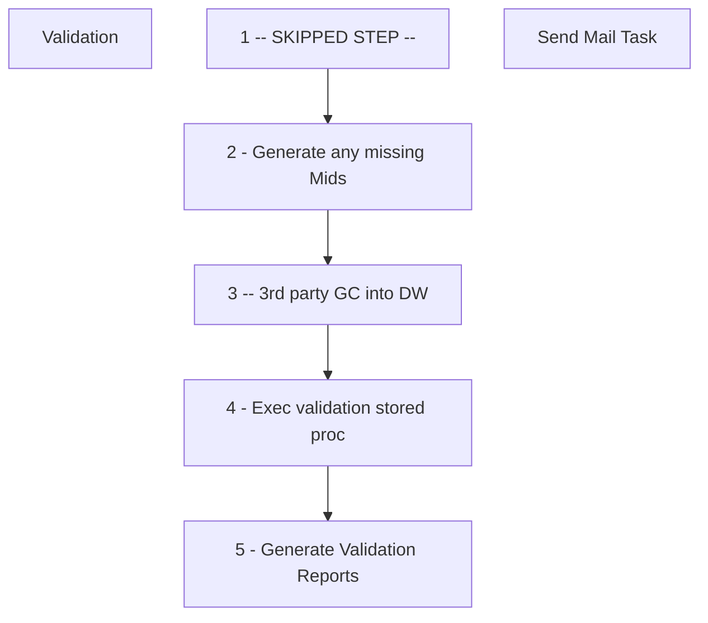

# SSIS Package: GiftCard_Validation

**Project:** GiftCard_Validation  
**Folder:** DW  
**Server:** STL-SSIS-P-01  

## Connection Managers

| Name | Type | Server | Catalog | Connection (sanitized) |
|---|---|---|---|---|
| ASNCorrections | FLATFILE |  |  |  |
| DW | OLEDB | papamart | dw | Data Source=papamart; Initial Catalog=dw; Provider=SQLNCLI11.1; Integrated Security=SSPI; Auto Translate=False |
| DWStaging | OLEDB | papamart | DWStaging | Data Source=papamart; Initial Catalog=DWStaging; Provider=SQLNCLI11.1; Integrated Security=SSPI; Auto Translate=False |
| Flat File Connection Manager | FLATFILE |  |  |  |
| IntegrationStaging | OLEDB | STL-SSIS-T-01 | IntegrationStaging | Data Source=STL-SSIS-T-01; Initial Catalog=IntegrationStaging; Provider=SQLNCLI11.1; Integrated Security=SSPI; Auto Translate=False |
| ProductInventory | FLATFILE |  |  |  |
| SMTP | SMTP |  |  |  |
| STL-SQL-P-04\SQL2008R2.ReportServer_birpt01 | OLEDB | STL-SQL-P-04\SQL2008R2 | ReportServer_birpt01 | Data Source=STL-SQL-P-04\SQL2008R2; Initial Catalog=ReportServer_birpt01; Provider=SQLNCLI11.1; Integrated Security=SSPI; Auto Translate=False |
| SendLog | FLATFILE |  |  |  |
| SendLogPIPE.csv | FILE |  |  |  |
| currentGCfile | FLATFILE |  |  |  |

## Control Flow Tasks

| Task | Type |
|---|---|
| GiftCard_Validation | Package |
| Validation | SEQUENCE |
| 1 -- SKIPPED STEP -- | ExecuteSQLTask |
| 2 - Generate any missing Mids | ExecuteSQLTask |
| 3 -- 3rd party GC into DW | ExecuteSQLTask |
| 4 - Exec validation stored proc | ExecuteSQLTask |
| 5 - Generate Validation Reports | ExecuteSQLTask |
| Send Mail Task | SendMailTask |

## Control Flow Outline

```text
- Send Mail Task [SendMailTask]
- Validation [SEQUENCE]
  - 1 -- SKIPPED STEP -- [ExecuteSQLTask]
  - 2 - Generate any missing Mids [ExecuteSQLTask]
  - 3 -- 3rd party GC into DW [ExecuteSQLTask]
  - 4 - Exec validation stored proc [ExecuteSQLTask]
  - 5 - Generate Validation Reports [ExecuteSQLTask]
```

## Architecture Diagram



## Variables

| Namespace | Name | Expression-bound |
|---|---|---|
| System | Propagate | No |
| User | DateTimeStamp | Yes |
| User | EndDate | Yes |
| User | EndDateAsDATE | Yes |
| User | GetDate | Yes |
| User | GetDateAsDATE | Yes |
| User | SQL_CheckIfUKfileHasBeenProcessed | Yes |
| User | SQL_CheckIfUSfileHasBeenProcessed | Yes |
| User | StartDate | Yes |
| User | StartDateAsDATE | Yes |
| User | isUKalreadyProcessed | No |
| User | isUSalreadyProcessed | No |
| User | varCurrentDACTfile | No |
| User | varCurrentHDSKfile | No |
| User | varCurrentPTDfile | No |
| User | varCurrentPTDfilename | Yes |
| User | varDACTdestPath | Yes |
| User | varDACTsourcePath | Yes |
| User | varDirectoryReports | Yes |
| User | varDirectoryUK | Yes |
| User | varDirectoryUKprocessed | Yes |
| User | varDirectoryUS | Yes |
| User | varDirectoryUSprocessed | Yes |
| User | varFooterFound | No |
| User | varHDSKdestPath | Yes |
| User | varHDSKsourcePath | Yes |
| User | varPTD_GroupCode | Yes |
| User | varRowCountUK | No |
| User | varRowCountUS | No |
| User | varRowsExpected | No |
| User | varUKcode | No |
| User | varUKfileID | No |
| User | varUKfilename | No |
| User | varUKfilename2 | Yes |
| User | varUKfilename3 | Yes |
| User | varUKfilename4 | Yes |
| User | varUKfilename5 | Yes |
| User | varUKseq | No |
| User | varUScode | No |
| User | varUSfileID | No |
| User | varUSfilename | No |
| User | varUSfilename2 | Yes |
| User | varUSfilename3 | Yes |
| User | varUSfilename4 | Yes |
| User | varUSfilename5 | Yes |
| User | varUSseq | No |

### Expression-bound variable values

#### User::DateTimeStamp

**Expression:**

```sql
(DT_WSTR,4)DATEPART("yyyy",GetDate()) 
+ (DT_WSTR,4)DATEPART("mm",GetDate()) 
+ (DT_WSTR,4)DATEPART("dd",GetDate()) 
+ (DT_WSTR,4)DATEPART("hh",GetDate()) 
+ (DT_WSTR,4)DATEPART("mi",GetDate()) 
+ (DT_WSTR,4)DATEPART("ss",GetDate()) 
+ (DT_WSTR,4)DATEPART("ms",GetDate())
```

**Evaluated value:**

```sql
2021106114318390
```

#### User::EndDate

**Expression:**

```sql
dateadd("dd", @[$Package::DaysToInclude], @[User::StartDate])
```

**Evaluated value:**

```sql
10/6/2021
```

#### User::EndDateAsDATE

**Expression:**

```sql
(DT_WSTR, 4) datepart("year", @[User::EndDate])  + "-" +
right("0"+ (DT_WSTR, 2) datepart("mm", @[User::EndDate]),2)  + "-" +
right("0" +(DT_WSTR, 2) datepart("dd",  @[User::EndDate]),2)
```

**Evaluated value:**

```sql
2021-10-06
```

#### User::GetDate

**Expression:**

```sql
(DT_DATE)DATEDIFF("Day", (DT_DATE) 0, GETDATE())
```

**Evaluated value:**

```sql
10/6/2021
```

#### User::GetDateAsDATE

**Expression:**

```sql
(DT_WSTR, 4) datepart("year", @[User::GetDate])  + "-" +
right("0"+ (DT_WSTR, 2) datepart("mm", @[User::GetDate]),2)  + "-" +
right("0" +(DT_WSTR, 2) datepart("dd",  @[User::GetDate]),2)
```

**Evaluated value:**

```sql
2021-10-06
```

#### User::SQL_CheckIfUKfileHasBeenProcessed

**Expression:**

```sql
"SELECT CAST(Count(file_name) AS BIT) FROM GiftCard_Header_International" +" WHERE file_name = '" + @[User::varCurrentPTDfilename] + "'"
```

**Evaluated value:**

```sql
SELECT CAST(Count(file_name) AS BIT) FROM GiftCard_Header_International WHERE file_name = 'blank_PTD_blank'
```

#### User::SQL_CheckIfUSfileHasBeenProcessed

**Expression:**

```sql
"SELECT CAST(Count(file_name) AS BIT) FROM GiftCard_Header" +" WHERE file_name = '" + @[User::varCurrentPTDfilename] + "'"
```

**Evaluated value:**

```sql
SELECT CAST(Count(file_name) AS BIT) FROM GiftCard_Header WHERE file_name = 'blank_PTD_blank'
```

#### User::StartDate

**Expression:**

```sql
dateadd("dd", -@[$Package::DaysToGoBack] , @[User::GetDate] )
```

**Evaluated value:**

```sql
10/5/2021
```

#### User::StartDateAsDATE

**Expression:**

```sql
(DT_WSTR, 4) datepart("year", @[User::StartDate])  + "-" +
right("0"+ (DT_WSTR, 2) datepart("mm", @[User::StartDate]),2)  + "-" +
right("0" +(DT_WSTR, 2) datepart("dd",  @[User::StartDate]),2)
```

**Evaluated value:**

```sql
2021-10-05
```

#### User::varCurrentPTDfilename

**Expression:**

```sql
RIGHT(   @[User::varCurrentPTDfile]         , FINDSTRING( REVERSE(  @[User::varCurrentPTDfile]      ), "\\", 1 ) - 1 )
```

**Evaluated value:**

```sql
blank_PTD_blank
```

#### User::varDACTdestPath

**Expression:**

```sql
@[User::varDirectoryReports] +  @[User::varCurrentDACTfile]
```

**Evaluated value:**

```sql
\\stl-sql-p-04\d$\BABWSCORE01_D\GCArchive\reports\
```

#### User::varDACTsourcePath

**Expression:**

```sql
@[User::varDirectoryUS] +  @[User::varCurrentDACTfile]
```

**Evaluated value:**

```sql
\\stl-sql-p-04\d$\BABWSCORE01_D\GCArchive\Incoming\
```

#### User::varDirectoryReports

**Expression:**

```sql
@[$Package::GC_archive] + "reports\\"
```

**Evaluated value:**

```sql
\\stl-sql-p-04\d$\BABWSCORE01_D\GCArchive\reports\
```

#### User::varDirectoryUK

**Expression:**

```sql
@[$Package::GC_archive] + "Incoming_International\\"
```

**Evaluated value:**

```sql
\\stl-sql-p-04\d$\BABWSCORE01_D\GCArchive\Incoming_International\
```

#### User::varDirectoryUKprocessed

**Expression:**

```sql
@[$Package::GC_archive] + "Incoming_International\\Processed\\"
```

**Evaluated value:**

```sql
\\stl-sql-p-04\d$\BABWSCORE01_D\GCArchive\Incoming_International\Processed\
```

#### User::varDirectoryUS

**Expression:**

```sql
@[$Package::GC_archive] + "Incoming\\"
```

**Evaluated value:**

```sql
\\stl-sql-p-04\d$\BABWSCORE01_D\GCArchive\Incoming\
```

#### User::varDirectoryUSprocessed

**Expression:**

```sql
@[$Package::GC_archive] + "Incoming\\Processed\\"
```

**Evaluated value:**

```sql
\\stl-sql-p-04\d$\BABWSCORE01_D\GCArchive\Incoming\Processed\
```

#### User::varHDSKdestPath

**Expression:**

```sql
@[User::varDirectoryReports] +  @[User::varCurrentHDSKfile]
```

**Evaluated value:**

```sql
\\stl-sql-p-04\d$\BABWSCORE01_D\GCArchive\reports\
```

#### User::varHDSKsourcePath

**Expression:**

```sql
@[User::varDirectoryUS] +  @[User::varCurrentHDSKfile]
```

**Evaluated value:**

```sql
\\stl-sql-p-04\d$\BABWSCORE01_D\GCArchive\Incoming\
```

#### User::varPTD_GroupCode

**Expression:**

```sql
SUBSTRING( @[User::varCurrentPTDfile] , 1,( FINDSTRING( @[User::varCurrentPTDfile] , "_PTD", 1 ) -1) )
```

**Evaluated value:**

```sql
blank
```

#### User::varUKfilename2

**Expression:**

```sql
@[User::varDirectoryUK] + "UK_PTD_" +  @[User::varUKseq] + "_" + RIGHT( @[User::varUKfilename], 19)
```

**Evaluated value:**

```sql
\\stl-sql-p-04\d$\BABWSCORE01_D\GCArchive\Incoming_International\UK_PTD_seq_blank
```

#### User::varUKfilename3

**Expression:**

```sql
@[User::varDirectoryUK] + "UK_PTD_" +  @[User::varUKseq] + "_" + RIGHT( @[User::varUKfilename], 19)
```

**Evaluated value:**

```sql
\\stl-sql-p-04\d$\BABWSCORE01_D\GCArchive\Incoming_International\UK_PTD_seq_blank
```

#### User::varUKfilename4

**Expression:**

```sql
@[User::varDirectoryUKprocessed] + SUBSTRING( @[User::varUKfilename], 1,27) + "+MovedDate_" + @[User::DateTimeStamp] + ".TXT"
```

**Evaluated value:**

```sql
\\stl-sql-p-04\d$\BABWSCORE01_D\GCArchive\Incoming_International\Processed\blank+MovedDate_2021106114318393.TXT
```

#### User::varUKfilename5

**Expression:**

```sql
@[User::varDirectoryUKprocessed] + SUBSTRING( @[User::varUKfilename], 1,27) + "+Moved_DUPE_Date_" + @[User::DateTimeStamp] + ".TXT"
```

**Evaluated value:**

```sql
\\stl-sql-p-04\d$\BABWSCORE01_D\GCArchive\Incoming_International\Processed\blank+Moved_DUPE_Date_2021106114318397.TXT
```

#### User::varUSfilename2

**Expression:**

```sql
@[User::varDirectoryUS] + "US_CA_PTD_" +  @[User::varUSseq] + "_" + RIGHT( @[User::varUSfilename], 19)
```

**Evaluated value:**

```sql
\\stl-sql-p-04\d$\BABWSCORE01_D\GCArchive\Incoming\US_CA_PTD_6939_blank
```

#### User::varUSfilename3

**Expression:**

```sql
@[User::varDirectoryUS] + "US_CA_PTD_" +  @[User::varUSseq] + "_" + RIGHT( @[User::varUSfilename], 19)
```

**Evaluated value:**

```sql
\\stl-sql-p-04\d$\BABWSCORE01_D\GCArchive\Incoming\US_CA_PTD_6939_blank
```

#### User::varUSfilename4

**Expression:**

```sql
@[User::varDirectoryUSprocessed] + SUBSTRING( @[User::varUSfilename], 1,30) + "+MovedDate_" + @[User::DateTimeStamp] + ".TXT"
```

**Evaluated value:**

```sql
\\stl-sql-p-04\d$\BABWSCORE01_D\GCArchive\Incoming\Processed\blank+MovedDate_2021106114318397.TXT
```

#### User::varUSfilename5

**Expression:**

```sql
@[User::varDirectoryUSprocessed] + SUBSTRING( @[User::varUSfilename], 1,30) + "+Moved_DUPE_Date_" + @[User::DateTimeStamp] + ".TXT"
```

**Evaluated value:**

```sql
\\stl-sql-p-04\d$\BABWSCORE01_D\GCArchive\Incoming\Processed\blank+Moved_DUPE_Date_2021106114318397.TXT
```

## Execute SQL Tasks

### 1 -- SKIPPED STEP --

**Path:** `Package\Validation\1 -- SKIPPED STEP --`  
**Connection:** DW (papamart/dw)  

```sql
-- tbd
```

### 2 - Generate any missing Mids

**Path:** `Package\Validation\2 - Generate any missing Mids`  
**Connection:** DW (papamart/dw)  

```sql
exec papamart.dw.dbo.spGiftCard_Create_Missing_MIDs
```

### 3 -- 3rd party GC into DW

**Path:** `Package\Validation\3 -- 3rd party GC into DW`  
**Connection:** DWStaging (papamart/DWStaging)  

```sql
exec [dbo].[spMergeGiftCardsActivatedValuelink] 7
```

### 4 - Exec validation stored proc

**Path:** `Package\Validation\4 - Exec validation stored proc`  
**Connection:** DW (papamart/dw)  

```sql
EXEC papamart.dwstaging.dbo.spGCValidation_000_Main_Routine
```

### 5 - Generate Validation Reports

**Path:** `Package\Validation\5 - Generate Validation Reports`  
**Connection:** STL-SQL-P-04\SQL2008R2.ReportServer_birpt01 (STL-SQL-P-04\SQL2008R2/ReportServer_birpt01)  

```sql
EXEC msdb.dbo.sp_start_job @job_name = '63222521-0EE3-4A16-AA92-43D8F3B89214'
```

## Data Flow: Sources

_None detected._

## Data Flow: Destinations

_None detected._
