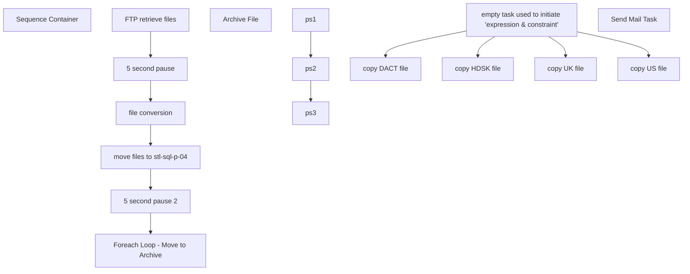

# SSIS Package: Package

**Project:** GiftCard_firstData_download  
**Folder:** DW  
**Server:** STL-SSIS-P-01  

## Connection Managers

| Name | Type | Server | Catalog | Connection (sanitized) |
|---|---|---|---|---|
| Archive | FILE |  |  |  |
| SMTP | SMTP |  |  |  |
| STL-SSIS-P-01.IntegrationStaging | OLEDB | STL-SSIS-P-01 | IntegrationStaging | Data Source=STL-SSIS-P-01; Initial Catalog=IntegrationStaging; Provider=SQLNCLI11.1; Integrated Security=SSPI; Auto Translate=False |

## Control Flow Tasks

| Task | Type |
|---|---|
| Package | Package |
| Sequence Container | SEQUENCE |
| 5 second pause | FORLOOP |
| 5 second pause 2 | FORLOOP |
| file conversion | SEQUENCE |
| ps1 | ExecuteProcess |
| ps2 | ExecuteProcess |
| ps3 | ExecuteProcess |
| Foreach Loop - Move to Archive | FOREACHLOOP |
| Archive File | FileSystemTask |
| FTP retrieve files | ExecuteSQLTask |
| move files to stl-sql-p-04 | FOREACHLOOP |
| copy DACT file | FileSystemTask |
| copy HDSK file | FileSystemTask |
| copy UK file | FileSystemTask |
| copy US file | FileSystemTask |
| empty task used to initiate 'expression & constraint' | ExecuteSQLTask |
| Send Mail Task | SendMailTask |

## Control Flow Outline

```text
- Send Mail Task [SendMailTask]
- Sequence Container [SEQUENCE]
  - 5 second pause [FORLOOP]
  - 5 second pause 2 [FORLOOP]
  - FTP retrieve files [ExecuteSQLTask]
  - Foreach Loop - Move to Archive [FOREACHLOOP]
    - Archive File [FileSystemTask]
  - file conversion [SEQUENCE]
    - ps1 [ExecuteProcess]
    - ps2 [ExecuteProcess]
    - ps3 [ExecuteProcess]
  - move files to stl-sql-p-04 [FOREACHLOOP]
    - copy DACT file [FileSystemTask]
    - copy HDSK file [FileSystemTask]
    - copy UK file [FileSystemTask]
    - copy US file [FileSystemTask]
    - empty task used to initiate 'expression & constraint' [ExecuteSQLTask]
```

## Architecture Diagram



## Variables

| Namespace | Name | Expression-bound |
|---|---|---|
| System | Propagate | No |
| User | DateTimeStamp | Yes |
| User | EndDate | Yes |
| User | EndDateAsDATE | Yes |
| User | GetDate | Yes |
| User | GetDateAsDATE | Yes |
| User | StartDate | Yes |
| User | StartDateAsDATE | Yes |
| User | UKfound | No |
| User | ftpFilename | No |
| User | varDestinationFilePathDACT | Yes |
| User | varDestinationFilePathHDSK | Yes |
| User | varDestinationFilePathUK | Yes |
| User | varDestinationFilePathUS | Yes |
| User | varDestinationFolderUK | No |
| User | varDestinationFolderUS | No |
| User | varExt | No |
| User | varFileToArchive | No |
| User | varSourceFilePath | Yes |
| User | varSourceFolder | No |
| User | varTest | Yes |

### Expression-bound variable values

#### User::DateTimeStamp

**Expression:**

```sql
(DT_WSTR,4)DATEPART("yyyy",GetDate()) 
+ (DT_WSTR,4)DATEPART("mm",GetDate()) 
+ (DT_WSTR,4)DATEPART("dd",GetDate()) 
+ (DT_WSTR,4)DATEPART("hh",GetDate()) 
+ (DT_WSTR,4)DATEPART("mi",GetDate()) 
+ (DT_WSTR,4)DATEPART("ss",GetDate()) 
+ (DT_WSTR,4)DATEPART("ms",GetDate())
```

**Evaluated value:**

```sql
2020422191740533
```

#### User::EndDate

**Expression:**

```sql
dateadd("dd", @[$Package::DaysToInclude], @[User::StartDate])
```

**Evaluated value:**

```sql
4/22/2020
```

#### User::EndDateAsDATE

**Expression:**

```sql
(DT_WSTR, 4) datepart("year", @[User::EndDate])  + "-" + 
(DT_WSTR, 2) datepart("mm", @[User::EndDate])  + "-" + 
(DT_WSTR, 2) datepart("dd",  @[User::EndDate])
```

**Evaluated value:**

```sql
2020-4-22
```

#### User::GetDate

**Expression:**

```sql
(DT_DATE)DATEDIFF("Day", (DT_DATE) 0, GETDATE())
```

**Evaluated value:**

```sql
4/22/2020
```

#### User::GetDateAsDATE

**Expression:**

```sql
(DT_WSTR, 4) datepart("year", @[User::GetDate])  + "-" + 
(DT_WSTR, 2) datepart("mm", @[User::GetDate])  + "-" + 
(DT_WSTR, 2) datepart("dd",  @[User::GetDate])
```

**Evaluated value:**

```sql
2020-4-22
```

#### User::StartDate

**Expression:**

```sql
dateadd("dd", -@[$Package::DaysToGoBack] , @[User::GetDate] )
```

**Evaluated value:**

```sql
4/21/2020
```

#### User::StartDateAsDATE

**Expression:**

```sql
(DT_WSTR, 4) datepart("year", @[User::StartDate])  + "-" + 
(DT_WSTR, 2) datepart("mm", @[User::StartDate])  + "-" + 
(DT_WSTR, 2) datepart("dd",  @[User::StartDate])
```

**Evaluated value:**

```sql
2020-4-21
```

#### User::varDestinationFilePathDACT

**Expression:**

```sql
@[User::varDestinationFolderUS]+ REPLACE( @[User::ftpFilename] , "PC2BBEAR", "US_CA_DACT")+ @[User::varExt]
```

**Evaluated value:**

```sql
\\stl-sql-p-04\d$\BABWSCORE01_D\GCArchive\Incoming\.TXT
```

#### User::varDestinationFilePathHDSK

**Expression:**

```sql
@[User::varDestinationFolderUS]+ REPLACE( @[User::ftpFilename] , "PC3BBEAR", "US_CA_HDSK")+ @[User::varExt]
```

**Evaluated value:**

```sql
\\stl-sql-p-04\d$\BABWSCORE01_D\GCArchive\Incoming\.TXT
```

#### User::varDestinationFilePathUK

**Expression:**

```sql
@[User::varDestinationFolderUK]+ REPLACE( @[User::ftpFilename] , "PC1BBEA1", "UK_PTD")+ @[User::varExt]
```

**Evaluated value:**

```sql
\\stl-sql-p-04\d$\BABWSCORE01_D\GCArchive\Incoming_International\.TXT
```

#### User::varDestinationFilePathUS

**Expression:**

```sql
@[User::varDestinationFolderUS]+ REPLACE( @[User::ftpFilename] , "PC1BBEAR", "US_CA_PTD")+ @[User::varExt]
```

**Evaluated value:**

```sql
\\stl-sql-p-04\d$\BABWSCORE01_D\GCArchive\Incoming\.TXT
```

#### User::varSourceFilePath

**Expression:**

```sql
@[User::varSourceFolder]+ @[User::ftpFilename]+ @[User::varExt]
```

**Evaluated value:**

```sql
\\stl-ssis-p-01\IntegrationStaging\firstData\.TXT
```

#### User::varTest

**Expression:**

```sql
REPLACE( @[User::ftpFilename] , "PC1BBEA1", "UK_PTD_")
```

## Execute SQL Tasks

### FTP retrieve files

**Path:** `Package\Sequence Container\FTP retrieve files`  
**Connection:** STL-SSIS-P-01.IntegrationStaging (STL-SSIS-P-01/IntegrationStaging)  

```sql
declare 
	@winSCP varchar(1000),
	@script varchar(1000),
	@log varchar(1000),
	@FTP varchar(4000),
	@Log_query varchar(1000),
	@Log_filename varchar(100),
	@Log_file_location varchar(100),
	@Log_bcp varchar(1000),
	@body varchar(4000)
select
	@winSCP = '"\\stl-ssis-p-01\C$\Program Files (x86)\WinSCP\WinSCP.exe"',
	@script = ' /script=\\stl-ssis-p-01\IntegrationStaging\firstData\FTP\sFTPdownloadScript.txt',
	@log = ' /log=\\stl-ssis-p-01\IntegrationStaging\firstData\FTP\Download.log',
	@FTP = (@winSCP + @script + @log)
			
			
exec master..xp_cmdshell @FTP
```

### empty task used to initiate 'expression & constraint'

**Path:** `Package\Sequence Container\move files to stl-sql-p-04\empty task used to initiate 'expression & constraint'`  
**Connection:** STL-SSIS-P-01.IntegrationStaging (STL-SSIS-P-01/IntegrationStaging)  

```sql
-- do nothing
```

## Data Flow: Sources

_None detected._

## Data Flow: Destinations

_None detected._
