# SSIS Package: SalesAuditToDWStaging

**Project:** SalesAuditToDWStaging  
**Folder:** DW  
**Server:** STL-SSIS-P-01  

## Connection Managers

| Name | Type | Server | Catalog | Connection (sanitized) |
|---|---|---|---|---|
| DWStaging | OLEDB | papamart | DWStaging | Data Source=papamart; Initial Catalog=DWStaging; Provider=SQLNCLI11.1; Integrated Security=SSPI; Auto Translate=False |
| IntegrationStaging | OLEDB | STL-SSIS-P-01 | IntegrationStaging | Data Source=STL-SSIS-P-01; Initial Catalog=IntegrationStaging; Provider=SQLNCLI11.1; Integrated Security=SSPI; Auto Translate=False |
| SMTP | SMTP |  |  |  |
| auditworks | OLEDB | bedrockdb01 | auditworks | Data Source=bedrockdb01; Initial Catalog=auditworks; Provider=SQLNCLI11.1; Integrated Security=SSPI; Auto Translate=False |
| dw | OLEDB | papamart | dw | Data Source=papamart; Initial Catalog=dw; Provider=SQLNCLI11.1; Integrated Security=SSPI; Auto Translate=False |

## Control Flow Tasks

| Task | Type |
|---|---|
| SalesAuditToDWStaging | Package |
| SEQ - Merge Fact Tables | SEQUENCE |
| Build Transaction_Facts | ExecuteSQLTask |
| Generate Balancing Tables | ExecuteSQLTask |
| Insert EnterpriseSellingFacts | ExecuteSQLTask |
| Merge Discount_Facts | ExecuteSQLTask |
| Merge Tender_Facts | ExecuteSQLTask |
| Merge TransactionDetailFact from TDF | ExecuteSQLTask |
| Merge TransactionFact from TF | ExecuteSQLTask |
| Merge Transaction_Detail_Facts | ExecuteSQLTask |
| Merge Transaction_Facts | ExecuteSQLTask |
| Start Job - Process Cube Measures | ExecuteSQLTask |
| SEQ - Parallel Staging | SEQUENCE |
| DataFlow - PostVoids for PBI | Pipeline |
| Load 3rd party GC From Valuelink | ExecuteSQLTask |
| Pre Stage Discounts for Coupons | ExecuteSQLTask |
| Stage Web to Store Transactions | ExecuteSQLTask |
| SEQ - Sales Extract and PreStage | SEQUENCE |
| SEQ - PreStage One | SEQUENCE |
| Data Flow - Cust Liability | Pipeline |
| DataFlow - AW_Transaction_Header | Pipeline |
| DataFlow - LineObjectActions | Pipeline |
| DataFlow - LineObjects | Pipeline |
| Merge LineObjectActions | ExecuteSQLTask |
| Merge LineObjects | ExecuteSQLTask |
| SEQ - PreStage Two | SEQUENCE |
| DataFlow - Line Notes | Pipeline |
| DataFlow - Merchandise Detail | Pipeline |
| DataFlow - Transaction Lines | Pipeline |
| spDW_Extract_Transaction_Lines | ExecuteSQLTask |
| SQL Task - Clean Up ES Discount Lines | ExecuteSQLTask |
| Set Store Date Time Keys | ExecuteSQLTask |
| Truncate Stage | ExecuteSQLTask |
| SEQ - Transformations - GC Extracts - Stage for Merge | SEQUENCE |
| SEQ - GC Activations and Redemptions from AW | SEQUENCE |
| Activations | ExecuteSQLTask |
| Prep Redemptions | ExecuteSQLTask |
| Redemptions | ExecuteSQLTask |
| SEQ - SQL Updates | SEQUENCE |
| Assign_BatchNumbers | ExecuteSQLTask |
| Assign_CashierNumbers | ExecuteSQLTask |
| Build_Missing_Line_Object_Actions | ExecuteSQLTask |
| Delete_OldTransactions | ExecuteSQLTask |
| FIX_Invalid_LO_1625 | ExecuteSQLTask |
| FIX_Invalid_LO_292 | ExecuteSQLTask |
| Move_Discounts | ExecuteSQLTask |
| Move_Tender | ExecuteSQLTask |
| Move_Transaction_Detail_Facts | ExecuteSQLTask |
| Override_StoreNo_for_Party_Deposits | ExecuteSQLTask |
| SEQ - SQL Updates - Additional | SEQUENCE |
| Allocate_Discounts_To_TDF | ExecuteSQLTask |
| AssignCouponNumbers | ExecuteSQLTask |
| Build_AW_MAUnitCost | ExecuteSQLTask |
| Cost_Merch_Items | ExecuteSQLTask |
| Determine_Discount_Lift | ExecuteSQLTask |
| Determine_Parties_and_Transaction_Type | ExecuteSQLTask |
| Generate_Upsell_to_Discount_Staging | ExecuteSQLTask |
| Send Mail Task | SendMailTask |

## Control Flow Outline

```text
- Send Mail Task [SendMailTask]
- SEQ - Merge Fact Tables [SEQUENCE]
  - Build Transaction_Facts [ExecuteSQLTask]
  - Generate Balancing Tables [ExecuteSQLTask]
  - Insert EnterpriseSellingFacts [ExecuteSQLTask]
  - Merge Discount_Facts [ExecuteSQLTask]
  - Merge Tender_Facts [ExecuteSQLTask]
  - Merge TransactionDetailFact from TDF [ExecuteSQLTask]
  - Merge TransactionFact from TF [ExecuteSQLTask]
  - Merge Transaction_Detail_Facts [ExecuteSQLTask]
  - Merge Transaction_Facts [ExecuteSQLTask]
  - Start Job - Process Cube Measures [ExecuteSQLTask]
- SEQ - Parallel Staging [SEQUENCE]
  - DataFlow - PostVoids for PBI [Pipeline]
  - Load 3rd party GC From Valuelink [ExecuteSQLTask]
  - Pre Stage Discounts for Coupons [ExecuteSQLTask]
  - Stage Web to Store Transactions [ExecuteSQLTask]
- SEQ - Sales Extract and PreStage [SEQUENCE]
  - SEQ - PreStage One [SEQUENCE]
    - Data Flow - Cust Liability [Pipeline]
    - DataFlow - AW_Transaction_Header [Pipeline]
    - DataFlow - LineObjectActions [Pipeline]
    - DataFlow - LineObjects [Pipeline]
    - Merge LineObjectActions [ExecuteSQLTask]
    - Merge LineObjects [ExecuteSQLTask]
  - SEQ - PreStage Two [SEQUENCE]
    - DataFlow - Line Notes [Pipeline]
    - DataFlow - Merchandise Detail [Pipeline]
    - DataFlow - Transaction Lines [Pipeline]
    - SQL Task - Clean Up ES Discount Lines [ExecuteSQLTask]
    - spDW_Extract_Transaction_Lines [ExecuteSQLTask]
  - Set Store Date Time Keys [ExecuteSQLTask]
  - Truncate Stage [ExecuteSQLTask]
- SEQ - Transformations - GC Extracts - Stage for Merge [SEQUENCE]
  - SEQ - GC Activations and Redemptions from AW [SEQUENCE]
    - Activations [ExecuteSQLTask]
    - Prep Redemptions [ExecuteSQLTask]
    - Redemptions [ExecuteSQLTask]
  - SEQ - SQL Updates [SEQUENCE]
  - SEQ - SQL Updates - Additional [SEQUENCE]
    - Allocate_Discounts_To_TDF [ExecuteSQLTask]
    - AssignCouponNumbers [ExecuteSQLTask]
    - Build_AW_MAUnitCost [ExecuteSQLTask]
    - Cost_Merch_Items [ExecuteSQLTask]
    - Determine_Discount_Lift [ExecuteSQLTask]
    - Determine_Parties_and_Transaction_Type [ExecuteSQLTask]
    - Generate_Upsell_to_Discount_Staging [ExecuteSQLTask]
    - Assign_BatchNumbers [ExecuteSQLTask]
    - Assign_CashierNumbers [ExecuteSQLTask]
    - Build_Missing_Line_Object_Actions [ExecuteSQLTask]
    - Delete_OldTransactions [ExecuteSQLTask]
    - FIX_Invalid_LO_1625 [ExecuteSQLTask]
    - FIX_Invalid_LO_292 [ExecuteSQLTask]
    - Move_Discounts [ExecuteSQLTask]
    - Move_Tender [ExecuteSQLTask]
    - Move_Transaction_Detail_Facts [ExecuteSQLTask]
    - Override_StoreNo_for_Party_Deposits [ExecuteSQLTask]
```

## Architecture Diagram

```mermaid
flowchart TD
    n_Package_SEQ___Merge_Fact_Tables["SEQ - Merge Fact Tables"]
    n_Package_SEQ___Merge_Fact_Tables_Build_Transaction_Facts["Build Transaction_Facts"]
    n_Package_SEQ___Merge_Fact_Tables_Generate_Balancing_Tables["Generate Balancing Tables"]
    n_Package_SEQ___Merge_Fact_Tables_Insert_EnterpriseSellingFacts["Insert EnterpriseSellingFacts"]
    n_Package_SEQ___Merge_Fact_Tables_Merge_Discount_Facts["Merge Discount_Facts"]
    n_Package_SEQ___Merge_Fact_Tables_Merge_Tender_Facts["Merge Tender_Facts"]
    n_Package_SEQ___Merge_Fact_Tables_Merge_TransactionDetailFact_from_TDF["Merge TransactionDetailFact from TDF"]
    n_Package_SEQ___Merge_Fact_Tables_Merge_TransactionFact_from_TF["Merge TransactionFact from TF"]
    n_Package_SEQ___Merge_Fact_Tables_Merge_Transaction_Detail_Facts["Merge Transaction_Detail_Facts"]
    n_Package_SEQ___Merge_Fact_Tables_Merge_Transaction_Facts["Merge Transaction_Facts"]
    n_Package_SEQ___Merge_Fact_Tables_Start_Job___Process_Cube_Measures["Start Job - Process Cube Measures"]
    n_Package_SEQ___Parallel_Staging["SEQ - Parallel Staging"]
    n_Package_SEQ___Parallel_Staging_DataFlow___PostVoids_for_PBI["DataFlow - PostVoids for PBI"]
    n_Package_SEQ___Parallel_Staging_Load_3rd_party_GC_From_Valuelink["Load 3rd party GC From Valuelink"]
    n_Package_SEQ___Parallel_Staging_Pre_Stage_Discounts_for_Coupons["Pre Stage Discounts for Coupons"]
    n_Package_SEQ___Parallel_Staging_Stage_Web_to_Store_Transactions["Stage Web to Store Transactions"]
    n_Package_SEQ___Sales_Extract_and_PreStage["SEQ - Sales Extract and PreStage"]
    n_Package_SEQ___Sales_Extract_and_PreStage_SEQ___PreStage_One["SEQ - PreStage One"]
    n_Package_SEQ___Sales_Extract_and_PreStage_SEQ___PreStage_One_Data_Flow___Cust_Liability["Data Flow - Cust Liability"]
    n_Package_SEQ___Sales_Extract_and_PreStage_SEQ___PreStage_One_DataFlow___AW_Transaction_Header["DataFlow - AW_Transaction_Header"]
    n_Package_SEQ___Sales_Extract_and_PreStage_SEQ___PreStage_One_DataFlow___LineObjectActions["DataFlow - LineObjectActions"]
    n_Package_SEQ___Sales_Extract_and_PreStage_SEQ___PreStage_One_DataFlow___LineObjects["DataFlow - LineObjects"]
    n_Package_SEQ___Sales_Extract_and_PreStage_SEQ___PreStage_One_Merge_LineObjectActions["Merge LineObjectActions"]
    n_Package_SEQ___Sales_Extract_and_PreStage_SEQ___PreStage_One_Merge_LineObjects["Merge LineObjects"]
    n_Package_SEQ___Sales_Extract_and_PreStage_SEQ___PreStage_Two["SEQ - PreStage Two"]
    n_Package_SEQ___Sales_Extract_and_PreStage_SEQ___PreStage_Two_DataFlow___Line_Notes["DataFlow - Line Notes"]
    n_Package_SEQ___Sales_Extract_and_PreStage_SEQ___PreStage_Two_DataFlow___Merchandise_Detail["DataFlow - Merchandise Detail"]
    n_Package_SEQ___Sales_Extract_and_PreStage_SEQ___PreStage_Two_DataFlow___Transaction_Lines["DataFlow - Transaction Lines"]
    n_Package_SEQ___Sales_Extract_and_PreStage_SEQ___PreStage_Two_spDW_Extract_Transaction_Lines["spDW_Extract_Transaction_Lines"]
    n_Package_SEQ___Sales_Extract_and_PreStage_SEQ___PreStage_Two_SQL_Task___Clean_Up_ES_Discount_Lines["SQL Task - Clean Up ES Discount Lines"]
    n_Package_SEQ___Sales_Extract_and_PreStage_Set_Store_Date_Time_Keys["Set Store Date Time Keys"]
    n_Package_SEQ___Sales_Extract_and_PreStage_Truncate_Stage["Truncate Stage"]
    n_Package_SEQ___Transformations___GC_Extracts___Stage_for_Merge["SEQ - Transformations - GC Extracts - Stage for Merge"]
    n_Package_SEQ___Transformations___GC_Extracts___Stage_for_Merge_SEQ___GC_Activations_and_Redemptions_from_AW["SEQ - GC Activations and Redemptions from AW"]
    n_Package_SEQ___Transformations___GC_Extracts___Stage_for_Merge_SEQ___GC_Activations_and_Redemptions_from_AW_Activations["Activations"]
    n_Package_SEQ___Transformations___GC_Extracts___Stage_for_Merge_SEQ___GC_Activations_and_Redemptions_from_AW_Prep_Redemptions["Prep Redemptions"]
    n_Package_SEQ___Transformations___GC_Extracts___Stage_for_Merge_SEQ___GC_Activations_and_Redemptions_from_AW_Redemptions["Redemptions"]
    n_Package_SEQ___Transformations___GC_Extracts___Stage_for_Merge_SEQ___SQL_Updates["SEQ - SQL Updates"]
    n_Package_SEQ___Transformations___GC_Extracts___Stage_for_Merge_SEQ___SQL_Updates_Assign_BatchNumbers["Assign_BatchNumbers"]
    n_Package_SEQ___Transformations___GC_Extracts___Stage_for_Merge_SEQ___SQL_Updates_Assign_CashierNumbers["Assign_CashierNumbers"]
    n_Package_SEQ___Transformations___GC_Extracts___Stage_for_Merge_SEQ___SQL_Updates_Build_Missing_Line_Object_Actions["Build_Missing_Line_Object_Actions"]
    n_Package_SEQ___Transformations___GC_Extracts___Stage_for_Merge_SEQ___SQL_Updates_Delete_OldTransactions["Delete_OldTransactions"]
    n_Package_SEQ___Transformations___GC_Extracts___Stage_for_Merge_SEQ___SQL_Updates_FIX_Invalid_LO_1625["FIX_Invalid_LO_1625"]
    n_Package_SEQ___Transformations___GC_Extracts___Stage_for_Merge_SEQ___SQL_Updates_FIX_Invalid_LO_292["FIX_Invalid_LO_292"]
    n_Package_SEQ___Transformations___GC_Extracts___Stage_for_Merge_SEQ___SQL_Updates_Move_Discounts["Move_Discounts"]
    n_Package_SEQ___Transformations___GC_Extracts___Stage_for_Merge_SEQ___SQL_Updates_Move_Tender["Move_Tender"]
    n_Package_SEQ___Transformations___GC_Extracts___Stage_for_Merge_SEQ___SQL_Updates_Move_Transaction_Detail_Facts["Move_Transaction_Detail_Facts"]
    n_Package_SEQ___Transformations___GC_Extracts___Stage_for_Merge_SEQ___SQL_Updates_Override_StoreNo_for_Party_Deposits["Override_StoreNo_for_Party_Deposits"]
    n_Package_SEQ___Transformations___GC_Extracts___Stage_for_Merge_SEQ___SQL_Updates___Additional["SEQ - SQL Updates - Additional"]
    n_Package_SEQ___Transformations___GC_Extracts___Stage_for_Merge_SEQ___SQL_Updates___Additional_Allocate_Discounts_To_TDF["Allocate_Discounts_To_TDF"]
    n_Package_SEQ___Transformations___GC_Extracts___Stage_for_Merge_SEQ___SQL_Updates___Additional_AssignCouponNumbers["AssignCouponNumbers"]
    n_Package_SEQ___Transformations___GC_Extracts___Stage_for_Merge_SEQ___SQL_Updates___Additional_Build_AW_MAUnitCost["Build_AW_MAUnitCost"]
    n_Package_SEQ___Transformations___GC_Extracts___Stage_for_Merge_SEQ___SQL_Updates___Additional_Cost_Merch_Items["Cost_Merch_Items"]
    n_Package_SEQ___Transformations___GC_Extracts___Stage_for_Merge_SEQ___SQL_Updates___Additional_Determine_Discount_Lift["Determine_Discount_Lift"]
    n_Package_SEQ___Transformations___GC_Extracts___Stage_for_Merge_SEQ___SQL_Updates___Additional_Determine_Parties_and_Transaction_Type["Determine_Parties_and_Transaction_Type"]
    n_Package_SEQ___Transformations___GC_Extracts___Stage_for_Merge_SEQ___SQL_Updates___Additional_Generate_Upsell_to_Discount_Staging["Generate_Upsell_to_Discount_Staging"]
    n_Package_EventHandlers_OnError__Send_Mail_Task["Send Mail Task"]
    n_Package_SEQ___Merge_Fact_Tables_Merge_Tender_Facts --> n_Package_SEQ___Merge_Fact_Tables_Build_Transaction_Facts
    n_Package_SEQ___Merge_Fact_Tables_Build_Transaction_Facts --> n_Package_SEQ___Merge_Fact_Tables_Merge_Transaction_Facts
    n_Package_SEQ___Merge_Fact_Tables_Merge_Discount_Facts --> n_Package_SEQ___Merge_Fact_Tables_Build_Transaction_Facts
    n_Package_SEQ___Merge_Fact_Tables_Merge_Transaction_Detail_Facts --> n_Package_SEQ___Merge_Fact_Tables_Build_Transaction_Facts
    n_Package_SEQ___Merge_Fact_Tables_Merge_Transaction_Facts --> n_Package_SEQ___Merge_Fact_Tables_Merge_TransactionFact_from_TF
    n_Package_SEQ___Merge_Fact_Tables_Build_Transaction_Facts --> n_Package_SEQ___Merge_Fact_Tables_Merge_TransactionDetailFact_from_TDF
    n_Package_SEQ___Merge_Fact_Tables_Merge_TransactionDetailFact_from_TDF --> n_Package_SEQ___Merge_Fact_Tables_Insert_EnterpriseSellingFacts
    n_Package_SEQ___Merge_Fact_Tables_Merge_Transaction_Facts --> n_Package_SEQ___Merge_Fact_Tables_Generate_Balancing_Tables
    n_Package_SEQ___Merge_Fact_Tables_Merge_Transaction_Facts --> n_Package_SEQ___Merge_Fact_Tables_Start_Job___Process_Cube_Measures
    n_Package_SEQ___Sales_Extract_and_PreStage_SEQ___PreStage_One_DataFlow___LineObjects --> n_Package_SEQ___Sales_Extract_and_PreStage_SEQ___PreStage_One_Merge_LineObjects
    n_Package_SEQ___Sales_Extract_and_PreStage_SEQ___PreStage_One_DataFlow___LineObjectActions --> n_Package_SEQ___Sales_Extract_and_PreStage_SEQ___PreStage_One_Merge_LineObjectActions
    n_Package_SEQ___Sales_Extract_and_PreStage_SEQ___PreStage_Two_spDW_Extract_Transaction_Lines --> n_Package_SEQ___Sales_Extract_and_PreStage_SEQ___PreStage_Two_SQL_Task___Clean_Up_ES_Discount_Lines
    n_Package_SEQ___Sales_Extract_and_PreStage_SEQ___PreStage_Two_SQL_Task___Clean_Up_ES_Discount_Lines --> n_Package_SEQ___Sales_Extract_and_PreStage_SEQ___PreStage_Two_DataFlow___Transaction_Lines
    n_Package_SEQ___Sales_Extract_and_PreStage_Truncate_Stage --> n_Package_SEQ___Sales_Extract_and_PreStage_SEQ___PreStage_One
    n_Package_SEQ___Sales_Extract_and_PreStage_SEQ___PreStage_One --> n_Package_SEQ___Sales_Extract_and_PreStage_Set_Store_Date_Time_Keys
    n_Package_SEQ___Sales_Extract_and_PreStage_Set_Store_Date_Time_Keys --> n_Package_SEQ___Sales_Extract_and_PreStage_SEQ___PreStage_Two
    n_Package_SEQ___Transformations___GC_Extracts___Stage_for_Merge_SEQ___GC_Activations_and_Redemptions_from_AW_Activations --> n_Package_SEQ___Transformations___GC_Extracts___Stage_for_Merge_SEQ___GC_Activations_and_Redemptions_from_AW_Prep_Redemptions
    n_Package_SEQ___Transformations___GC_Extracts___Stage_for_Merge_SEQ___GC_Activations_and_Redemptions_from_AW_Prep_Redemptions --> n_Package_SEQ___Transformations___GC_Extracts___Stage_for_Merge_SEQ___GC_Activations_and_Redemptions_from_AW_Redemptions
    n_Package_SEQ___Transformations___GC_Extracts___Stage_for_Merge_SEQ___SQL_Updates_FIX_Invalid_LO_292 --> n_Package_SEQ___Transformations___GC_Extracts___Stage_for_Merge_SEQ___SQL_Updates_FIX_Invalid_LO_1625
    n_Package_SEQ___Transformations___GC_Extracts___Stage_for_Merge_SEQ___SQL_Updates_FIX_Invalid_LO_1625 --> n_Package_SEQ___Transformations___GC_Extracts___Stage_for_Merge_SEQ___SQL_Updates_Assign_BatchNumbers
    n_Package_SEQ___Transformations___GC_Extracts___Stage_for_Merge_SEQ___SQL_Updates_Assign_BatchNumbers --> n_Package_SEQ___Transformations___GC_Extracts___Stage_for_Merge_SEQ___SQL_Updates_Override_StoreNo_for_Party_Deposits
    n_Package_SEQ___Transformations___GC_Extracts___Stage_for_Merge_SEQ___SQL_Updates_Override_StoreNo_for_Party_Deposits --> n_Package_SEQ___Transformations___GC_Extracts___Stage_for_Merge_SEQ___SQL_Updates_Assign_CashierNumbers
    n_Package_SEQ___Transformations___GC_Extracts___Stage_for_Merge_SEQ___SQL_Updates_Assign_CashierNumbers --> n_Package_SEQ___Transformations___GC_Extracts___Stage_for_Merge_SEQ___SQL_Updates_Build_Missing_Line_Object_Actions
    n_Package_SEQ___Transformations___GC_Extracts___Stage_for_Merge_SEQ___SQL_Updates_Build_Missing_Line_Object_Actions --> n_Package_SEQ___Transformations___GC_Extracts___Stage_for_Merge_SEQ___SQL_Updates_Delete_OldTransactions
    n_Package_SEQ___Transformations___GC_Extracts___Stage_for_Merge_SEQ___SQL_Updates_Delete_OldTransactions --> n_Package_SEQ___Transformations___GC_Extracts___Stage_for_Merge_SEQ___SQL_Updates_Move_Tender
    n_Package_SEQ___Transformations___GC_Extracts___Stage_for_Merge_SEQ___SQL_Updates_Move_Tender --> n_Package_SEQ___Transformations___GC_Extracts___Stage_for_Merge_SEQ___SQL_Updates_Move_Discounts
    n_Package_SEQ___Transformations___GC_Extracts___Stage_for_Merge_SEQ___SQL_Updates_Move_Discounts --> n_Package_SEQ___Transformations___GC_Extracts___Stage_for_Merge_SEQ___SQL_Updates_Move_Transaction_Detail_Facts
    n_Package_SEQ___Transformations___GC_Extracts___Stage_for_Merge_SEQ___SQL_Updates___Additional_Generate_Upsell_to_Discount_Staging --> n_Package_SEQ___Transformations___GC_Extracts___Stage_for_Merge_SEQ___SQL_Updates___Additional_Allocate_Discounts_To_TDF
    n_Package_SEQ___Transformations___GC_Extracts___Stage_for_Merge_SEQ___SQL_Updates___Additional_Allocate_Discounts_To_TDF --> n_Package_SEQ___Transformations___GC_Extracts___Stage_for_Merge_SEQ___SQL_Updates___Additional_AssignCouponNumbers
    n_Package_SEQ___Transformations___GC_Extracts___Stage_for_Merge_SEQ___SQL_Updates___Additional_AssignCouponNumbers --> n_Package_SEQ___Transformations___GC_Extracts___Stage_for_Merge_SEQ___SQL_Updates___Additional_Determine_Parties_and_Transaction_Type
    n_Package_SEQ___Transformations___GC_Extracts___Stage_for_Merge_SEQ___SQL_Updates___Additional_Determine_Parties_and_Transaction_Type --> n_Package_SEQ___Transformations___GC_Extracts___Stage_for_Merge_SEQ___SQL_Updates___Additional_Determine_Discount_Lift
    n_Package_SEQ___Transformations___GC_Extracts___Stage_for_Merge_SEQ___SQL_Updates___Additional_Determine_Discount_Lift --> n_Package_SEQ___Transformations___GC_Extracts___Stage_for_Merge_SEQ___SQL_Updates___Additional_Build_AW_MAUnitCost
    n_Package_SEQ___Transformations___GC_Extracts___Stage_for_Merge_SEQ___SQL_Updates___Additional_Build_AW_MAUnitCost --> n_Package_SEQ___Transformations___GC_Extracts___Stage_for_Merge_SEQ___SQL_Updates___Additional_Cost_Merch_Items
    n_Package_SEQ___Transformations___GC_Extracts___Stage_for_Merge_SEQ___SQL_Updates --> n_Package_SEQ___Transformations___GC_Extracts___Stage_for_Merge_SEQ___GC_Activations_and_Redemptions_from_AW
    n_Package_SEQ___Transformations___GC_Extracts___Stage_for_Merge_SEQ___GC_Activations_and_Redemptions_from_AW --> n_Package_SEQ___Transformations___GC_Extracts___Stage_for_Merge_SEQ___SQL_Updates___Additional
    n_Package_SEQ___Sales_Extract_and_PreStage --> n_Package_SEQ___Transformations___GC_Extracts___Stage_for_Merge
    n_Package_SEQ___Transformations___GC_Extracts___Stage_for_Merge --> n_Package_SEQ___Merge_Fact_Tables
    n_Package_SEQ___Parallel_Staging --> n_Package_SEQ___Merge_Fact_Tables
```



## Variables

| Namespace | Name | Expression-bound |
|---|---|---|
| System | Propagate | No |
| User | DateTimeStamp | Yes |
| User | EndDate | Yes |
| User | EndDateAsDATE | Yes |
| User | GetDate | Yes |
| User | GetDateAsDATE | Yes |
| User | StartDate | Yes |
| User | StartDateAsDATE | Yes |

### Expression-bound variable values

#### User::DateTimeStamp

**Expression:**

```sql
(DT_WSTR,4)DATEPART("yyyy",GetDate()) 
+ (DT_WSTR,4)DATEPART("mm",GetDate()) 
+ (DT_WSTR,4)DATEPART("dd",GetDate()) 
+ (DT_WSTR,4)DATEPART("hh",GetDate()) 
+ (DT_WSTR,4)DATEPART("mi",GetDate()) 
+ (DT_WSTR,4)DATEPART("ss",GetDate()) 
+ (DT_WSTR,4)DATEPART("ms",GetDate())
```

**Evaluated value:**

```sql
20241912271810
```

#### User::EndDate

**Expression:**

```sql
dateadd("dd", @[$Package::DaysToInclude], @[User::StartDate])
```

**Evaluated value:**

```sql
1/9/2024
```

#### User::EndDateAsDATE

**Expression:**

```sql
(DT_WSTR, 4) datepart("year", @[User::EndDate])  + "-" +
right("0"+ (DT_WSTR, 2) datepart("mm", @[User::EndDate]),2)  + "-" +
right("0" +(DT_WSTR, 2) datepart("dd",  @[User::EndDate]),2)
```

**Evaluated value:**

```sql
2024-01-09
```

#### User::GetDate

**Expression:**

```sql
(DT_DATE)DATEDIFF("Day", (DT_DATE) 0, GETDATE())
```

**Evaluated value:**

```sql
1/9/2024
```

#### User::GetDateAsDATE

**Expression:**

```sql
(DT_WSTR, 4) datepart("year", @[User::GetDate])  + "-" +
right("0"+ (DT_WSTR, 2) datepart("mm", @[User::GetDate]),2)  + "-" +
right("0" +(DT_WSTR, 2) datepart("dd",  @[User::GetDate]),2)
```

**Evaluated value:**

```sql
2024-01-09
```

#### User::StartDate

**Expression:**

```sql
dateadd("dd", -@[$Package::DaysToGoBack] , @[User::GetDate] )
```

**Evaluated value:**

```sql
12/10/2023
```

#### User::StartDateAsDATE

**Expression:**

```sql
(DT_WSTR, 4) datepart("year", @[User::StartDate])  + "-" +
right("0"+ (DT_WSTR, 2) datepart("mm", @[User::StartDate]),2)  + "-" +
right("0" +(DT_WSTR, 2) datepart("dd",  @[User::StartDate]),2)
```

**Evaluated value:**

```sql
2023-12-10
```

## Execute SQL Tasks

### Build Transaction_Facts

**Path:** `Package\SEQ - Merge Fact Tables\Build Transaction_Facts`  
**Connection:** dw (papamart/dw)  

```sql
exec spDW_Build_Transaction_Facts
```

### Generate Balancing Tables

**Path:** `Package\SEQ - Merge Fact Tables\Generate Balancing Tables`  
**Connection:** DWStaging (papamart/DWStaging)  

```sql
exec spAWImport_750_Generate_Balancing_Tables
```

### Insert EnterpriseSellingFacts

**Path:** `Package\SEQ - Merge Fact Tables\Insert EnterpriseSellingFacts`  
**Connection:** dw (papamart/dw)  

```sql
exec azure.spInsertEnterpriseSellingFact 
```

### Merge Discount_Facts

**Path:** `Package\SEQ - Merge Fact Tables\Merge Discount_Facts`  
**Connection:** DWStaging (papamart/DWStaging)  

```sql
exec spMergeDiscountFacts
```

### Merge Tender_Facts

**Path:** `Package\SEQ - Merge Fact Tables\Merge Tender_Facts`  
**Connection:** DWStaging (papamart/DWStaging)  

```sql
exec spMergeTenderFacts
```

### Merge TransactionDetailFact from TDF

**Path:** `Package\SEQ - Merge Fact Tables\Merge TransactionDetailFact from TDF`  
**Connection:** dw (papamart/dw)  

> ⚠️ `SqlStatementSource` is overridden at runtime by a property expression (shown below); the static SQL may not be what executes.

**Static SqlStatementSource:**

```sql
exec spMergeTransactionDetailFact 30
```

**Property expression (runtime override):**

```sql
"exec spMergeTransactionDetailFact " +  (DT_STR, 3, 1252) @[$Package::DaysToGoBack]
```

### Merge TransactionFact from TF

**Path:** `Package\SEQ - Merge Fact Tables\Merge TransactionFact from TF`  
**Connection:** dw (papamart/dw)  

> ⚠️ `SqlStatementSource` is overridden at runtime by a property expression (shown below); the static SQL may not be what executes.

**Static SqlStatementSource:**

```sql
exec spMergeTransactionFact 30
```

**Property expression (runtime override):**

```sql
"exec spMergeTransactionFact " + (DT_STR, 3, 1252) @[$Package::DaysToGoBack]
```

### Merge Transaction_Detail_Facts

**Path:** `Package\SEQ - Merge Fact Tables\Merge Transaction_Detail_Facts`  
**Connection:** DWStaging (papamart/DWStaging)  

```sql
exec spMergeTransaction_Detail_Facts
```

### Merge Transaction_Facts

**Path:** `Package\SEQ - Merge Fact Tables\Merge Transaction_Facts`  
**Connection:** dw (papamart/dw)  

```sql
exec spMergeTransaction_facts
```

### Start Job - Process Cube Measures

**Path:** `Package\SEQ - Merge Fact Tables\Start Job - Process Cube Measures`  
**Connection:** IntegrationStaging (STL-SSIS-P-01/IntegrationStaging)  

```sql
EXEC msdb.dbo.sp_start_job @job_name='ProcessCubeMeasures'
```

### Load 3rd party GC From Valuelink

**Path:** `Package\SEQ - Parallel Staging\Load 3rd party GC From Valuelink`  
**Connection:** DWStaging (papamart/DWStaging)  

```sql
exec spMergeGiftCardsActivatedValuelink 7
```

### Pre Stage Discounts for Coupons

**Path:** `Package\SEQ - Parallel Staging\Pre Stage Discounts for Coupons`  
**Connection:** DWStaging (papamart/DWStaging)  

```sql
exec spPreStageDiscountsForCoupons
```

### Stage Web to Store Transactions

**Path:** `Package\SEQ - Parallel Staging\Stage Web to Store Transactions`  
**Connection:** DWStaging (papamart/DWStaging)  

```sql
exec spWebToStoreTransactionLookupStage
```

### Merge LineObjectActions

**Path:** `Package\SEQ - Sales Extract and PreStage\SEQ - PreStage One\Merge LineObjectActions`  
**Connection:** DWStaging (papamart/DWStaging)  

```sql
exec spMergePOSCopy_Line_Object_Action
```

### Merge LineObjects

**Path:** `Package\SEQ - Sales Extract and PreStage\SEQ - PreStage One\Merge LineObjects`  
**Connection:** DWStaging (papamart/DWStaging)  

```sql
exec spMergePOSCopyLineObject
```

### SQL Task - Clean Up ES Discount Lines

**Path:** `Package\SEQ - Sales Extract and PreStage\SEQ - PreStage Two\SQL Task - Clean Up ES Discount Lines`  
**Connection:** auditworks (bedrockdb01/auditworks)  

```sql
use auditworks; 
-- This was added in Jan 2024
-- Dev  team's JM POS to SA interface was passing line action 20 for ES discounts rather than 91 
-- while they work on a code fix, we implemented this workaround 
-- See JIRA BIB 682 for more details. 


-- Find ES Lines in AW  Staging table 
with ESLines as 
(
select 
dd.applied_by_line_id, 
s.transaction_id, 
s.line_id, 
s.line_object, 
s.pos_discount_amount
from tmpTransactionLinesStage s

join [discount_detail] dd (nolock) on  dd.transaction_id=s.transaction_id
	and dd.line_id=s.line_id
where 1=1
and (s.line_object = '106' and s.line_action = '7')  -- Order Merchandise\Ordered 
and s.pos_discount_amount <> 0.00  -- Only Targeting Those with A Discount Applied 
--and s.transaction_id = '485711587' -- Testing Purposes 
-- Union In Archive Records
union 
select 
dd.applied_by_line_id, 
s.transaction_id, 
s.line_id, 
s.line_object, 
s.pos_discount_amount
from tmpTransactionLinesStage s
join [av_discount_detail] dd (nolock) on  dd.av_transaction_id=s.transaction_id
	and dd.line_id=s.line_id
where 1=1
and (s.line_object = '106' and s.line_action = '7') -- Order Merchandise\Ordered 
and s.pos_discount_amount <>  0.00 -- Only Targeting Those with A Discount Applied 
--and s.transaction_id = '483926896' -- Testing Purposes 
) 
, 


Summary1 as 
(
select  
lot.object_type_display_descr,
tl.transaction_id, 
tl.line_id, 
tl.line_sequence, 
tl.line_object_type, 
tl.line_action
--,e.applied_by_line_id
from tmpTransactionLinesStage tl (nolock)
join ESLines e on e.transaction_id=tl.transaction_id and e.applied_by_line_id=tl.line_id --
join line_object_type lot on lot.line_object_type=tl.line_object_type -- Just For Confirming We're looking at the discount lines 
where 1=1
and tl.line_action  =  '20' -- We only want to target and change those with the incorrect 20 to 91 
) 

 --For Testing Purposes 
--Select *
--from Summary1 s
--where 1=1
--and s.transaction_id in ('485861673','485862750','485864428','485859183','485865854','485851379','485848675','485864857','485864859','485863818','485856208','485851470','485858442','485850287','485844350','485854132','485866965','485838830','485865949','485857602')
--order by 2

update  tl
set line_action =  '91'
from tmpTransactionLinesStage tl
join Summary1 s on tl.transaction_id=s.transaction_id and tl.line_id=s.line_id and tl.line_sequence = s.line_sequence
where 1=1


```

### spDW_Extract_Transaction_Lines

**Path:** `Package\SEQ - Sales Extract and PreStage\SEQ - PreStage Two\spDW_Extract_Transaction_Lines`  
**Connection:** auditworks (bedrockdb01/auditworks)  

```sql
exec spDW_Extract_Transaction_Lines
```

### Set Store Date Time Keys

**Path:** `Package\SEQ - Sales Extract and PreStage\Set Store Date Time Keys`  
**Connection:** DWStaging (papamart/DWStaging)  

```sql
UPDATE ath
 SET ath.date_key = dd.date_key,
  ath.store_key = sd.store_key,
  ath.time_key = td.time_key,
  ath.currency_key = cd.currency_key
FROM
 aw_Transaction_Header ath WITH (NOLOCK)
 INNER JOIN dw.dbo.store_dim sd WITH (NOLOCK)
  ON ath.Store_No = sd.store_id
 INNER JOIN dw.dbo.date_dim dd WITH (NOLOCK)
  ON ath.Transaction_Date = dd.actual_date
 INNER JOIN dw.dbo.time_dim td WITH (NOLOCK)
  ON DATEPART(hh, ath.Entry_Date_Time) = td.hour
  AND DATEPART(MINUTE, ath.Entry_Date_Time) = td.minute
 INNER JOIN dw.dbo.currency_dim cd WITH (NOLOCK)
  ON ath.currency_code = cd.currency_code
```

### Truncate Stage

**Path:** `Package\SEQ - Sales Extract and PreStage\Truncate Stage`  
**Connection:** DWStaging (papamart/DWStaging)  

```sql
TRUNCATE TABLE aw_Transaction_Header
TRUNCATE TABLE aw_Merchandise_Detail
TRUNCATE TABLE aw_Transaction_Lines
TRUNCATE TABLE aw_Line_Notes
TRUNCATE TABLE aw_cust_liability
TRUNCATE TABLE LineObjectStage
TRUNCATE TABLE LineObjectActionStage
TRUNCATE TABLE DW.dbo.AWTransactionPostVoids
```

### Activations

**Path:** `Package\SEQ - Transformations - GC Extracts - Stage for Merge\SEQ - GC Activations and Redemptions from AW\Activations`  
**Connection:** DWStaging (papamart/DWStaging)  

```sql
exec spMergeGiftCardsActivated
```

### Prep Redemptions

**Path:** `Package\SEQ - Transformations - GC Extracts - Stage for Merge\SEQ - GC Activations and Redemptions from AW\Prep Redemptions`  
**Connection:** DWStaging (papamart/DWStaging)  

```sql
exec spGiftCard_Create_Redemptions
```

### Redemptions

**Path:** `Package\SEQ - Transformations - GC Extracts - Stage for Merge\SEQ - GC Activations and Redemptions from AW\Redemptions`  
**Connection:** DWStaging (papamart/DWStaging)  

```sql
spMergeGiftCardsRedeemed
```

### Allocate_Discounts_To_TDF

**Path:** `Package\SEQ - Transformations - GC Extracts - Stage for Merge\SEQ - SQL Updates - Additional\Allocate_Discounts_To_TDF`  
**Connection:** DWStaging (papamart/DWStaging)  

```sql
exec spAWImport_575_Allocate_Discounts_To_TDF
```

### AssignCouponNumbers

**Path:** `Package\SEQ - Transformations - GC Extracts - Stage for Merge\SEQ - SQL Updates - Additional\AssignCouponNumbers`  
**Connection:** DWStaging (papamart/DWStaging)  

```sql
exec spDiscountStage_AssignCouponNumbers
```

### Build_AW_MAUnitCost

**Path:** `Package\SEQ - Transformations - GC Extracts - Stage for Merge\SEQ - SQL Updates - Additional\Build_AW_MAUnitCost`  
**Connection:** DWStaging (papamart/DWStaging)  

```sql
exec spAWImport_115_Build_AW_MAUnitCost
```

### Cost_Merch_Items

**Path:** `Package\SEQ - Transformations - GC Extracts - Stage for Merge\SEQ - SQL Updates - Additional\Cost_Merch_Items`  
**Connection:** DWStaging (papamart/DWStaging)  

```sql
exec spAWImport_675_Cost_Merch_Items
```

### Determine_Discount_Lift

**Path:** `Package\SEQ - Transformations - GC Extracts - Stage for Merge\SEQ - SQL Updates - Additional\Determine_Discount_Lift`  
**Connection:** DWStaging (papamart/DWStaging)  

```sql
exec spAWImport_650_Determine_Discount_Lift
```

### Determine_Parties_and_Transaction_Type

**Path:** `Package\SEQ - Transformations - GC Extracts - Stage for Merge\SEQ - SQL Updates - Additional\Determine_Parties_and_Transaction_Type`  
**Connection:** DWStaging (papamart/DWStaging)  

```sql
exec spAWImport_600_Determine_Parties_and_Transaction_Type
```

### Generate_Upsell_to_Discount_Staging

**Path:** `Package\SEQ - Transformations - GC Extracts - Stage for Merge\SEQ - SQL Updates - Additional\Generate_Upsell_to_Discount_Staging`  
**Connection:** DWStaging (papamart/DWStaging)  

```sql
exec spAWImport_575_Generate_Upsell_to_Discount_Staging
```

### Assign_BatchNumbers

**Path:** `Package\SEQ - Transformations - GC Extracts - Stage for Merge\SEQ - SQL Updates\Assign_BatchNumbers`  
**Connection:** DWStaging (papamart/DWStaging)  

```sql
exec spAWImport_110_Assign_BatchNumbers
```

### Assign_CashierNumbers

**Path:** `Package\SEQ - Transformations - GC Extracts - Stage for Merge\SEQ - SQL Updates\Assign_CashierNumbers`  
**Connection:** DWStaging (papamart/DWStaging)  

```sql
exec spAWImport_130_Assign_CashierNumbers
```

### Build_Missing_Line_Object_Actions

**Path:** `Package\SEQ - Transformations - GC Extracts - Stage for Merge\SEQ - SQL Updates\Build_Missing_Line_Object_Actions`  
**Connection:** DWStaging (papamart/DWStaging)  

```sql
exec .spAWImport_200_Build_Missing_Line_Object_Actions
```

### Delete_OldTransactions

**Path:** `Package\SEQ - Transformations - GC Extracts - Stage for Merge\SEQ - SQL Updates\Delete_OldTransactions`  
**Connection:** DWStaging (papamart/DWStaging)  

```sql
exec spAWImport_150_Delete_OldTransactions
```

### FIX_Invalid_LO_1625

**Path:** `Package\SEQ - Transformations - GC Extracts - Stage for Merge\SEQ - SQL Updates\FIX_Invalid_LO_1625`  
**Connection:** DWStaging (papamart/DWStaging)  

```sql
exec spAWImport_FIX_Invalid_LO_1625
```

### FIX_Invalid_LO_292

**Path:** `Package\SEQ - Transformations - GC Extracts - Stage for Merge\SEQ - SQL Updates\FIX_Invalid_LO_292`  
**Connection:** DWStaging (papamart/DWStaging)  

```sql
exec spAWImport_FIX_Invalid_LO_292
```

### Move_Discounts

**Path:** `Package\SEQ - Transformations - GC Extracts - Stage for Merge\SEQ - SQL Updates\Move_Discounts`  
**Connection:** DWStaging (papamart/DWStaging)  

```sql
exec spAWImport_400_Move_Discounts
```

### Move_Tender

**Path:** `Package\SEQ - Transformations - GC Extracts - Stage for Merge\SEQ - SQL Updates\Move_Tender`  
**Connection:** DWStaging (papamart/DWStaging)  

```sql
exec spAWImport_300_Move_Tender
```

### Move_Transaction_Detail_Facts

**Path:** `Package\SEQ - Transformations - GC Extracts - Stage for Merge\SEQ - SQL Updates\Move_Transaction_Detail_Facts`  
**Connection:** DWStaging (papamart/DWStaging)  

```sql
exec spAWImport_500_Move_Transaction_Detail_Facts
```

### Override_StoreNo_for_Party_Deposits

**Path:** `Package\SEQ - Transformations - GC Extracts - Stage for Merge\SEQ - SQL Updates\Override_StoreNo_for_Party_Deposits`  
**Connection:** DWStaging (papamart/DWStaging)  

```sql
exec spAWImport_120_Override_StoreNo_for_Party_Deposits
```

## Data Flow: Sources

| Component | Source Object | Type | Data Flow Task | Connection | SQL Kind |
|---|---|---|---|---|---|
| vwDW_PostVoids |  | OLEDBSource | DataFlow - PostVoids for PBI | auditworks |  |
| cust_liability |  | OLEDBSource | Data Flow - Cust Liability | auditworks | SqlCommand |
| dwETL_Transactions_To_Pull |  | OLEDBSource | DataFlow - AW_Transaction_Header | auditworks | SqlCommand |
| line object actions |  | OLEDBSource | DataFlow - LineObjectActions | auditworks | SqlCommand |
| Line Objects |  | OLEDBSource | DataFlow - LineObjects | auditworks | SqlCommand |
| vwDW_Extract_Line_Notes |  | OLEDBSource | DataFlow - Line Notes | auditworks |  |
| vwDW_Extract_Merchandise_Detail |  | OLEDBSource | DataFlow - Merchandise Detail | auditworks |  |
| tmpTransactionLinesStage |  | OLEDBSource | DataFlow - Transaction Lines | auditworks | SqlCommand |

#### cust_liability — SqlCommand

```sql
select 
	cl.reference_no,
	cl.issuing_store_no
from cust_liability cl with (nolock)
join cust_liability_history clh with (nolock) 
	on cl.reference_no = clh.reference_no
	and cl.issuing_store_no = clh.store_no
	and cl.date_issued = clh.transaction_date
where cl.reference_type = 7 --enterprise selling
and datediff(dd, cl.date_issued, getdate()) <= 90
group by 
	cl.reference_no,
	cl.issuing_store_no
```

#### dwETL_Transactions_To_Pull — SqlCommand

```sql
SELECT
	transaction_id,
	store_no,
	register_no,
	transaction_no,
	cashier_no,
	transaction_category,
	transaction_series,
	transaction_date,
	entry_date_time,
	tender_total,
	CAST(ISNULL(OC.DFLT_CRNCY_CODE,'?') AS VARCHAR(3)) AS currency_code
FROM
	dbo.dwETL_Transactions_To_Pull AS ath WITH (NOLOCK)
	left JOIN ORG_CHN OC WITH (NOLOCK)
	ON ath.store_no = OC.ORG_CHN_NUM
```

#### line object actions — SqlCommand

```sql
SELECT
	loaa.line_object,
	loaa.line_action,
	CAST(lo.line_object_description AS VARCHAR(255)) AS line_object_description,
	CAST(la.line_action_display_descr AS VARCHAR(255)) AS actionDescr

FROM
	line_object_action_association loaa WITH (NOLOCK)
	INNER JOIN line_object lo WITH (NOLOCK)
		ON loaa.line_object = lo.line_object
	INNER JOIN line_action la WITH (NOLOCK)
		ON loaa.line_action = la.line_action
WHERE
	loaa.transaction_category = 1
ORDER BY 
	loaa.line_object,
	loaa.line_action
```

#### Line Objects — SqlCommand

```sql
SELECT lo.line_object,
		lo.line_object_type,
		CAST(lo.line_object_description AS VARCHAR(255)) AS line_object_description

FROM line_object lo WITH (NOLOCK)
order by lo.line_object
```

#### tmpTransactionLinesStage — SqlCommand

```sql
-- Previously just this source table: tmpTransactionLinesStage
use auditworks;

select
tl.transaction_id, 
tl.line_id, 
tl.line_sequence, 
tl.line_object_type, 
tl.line_object, 
tl.line_action, 
tl.gross_line_amount, 
tl.pos_discount_amount, 
tl.db_cr_none, 
tl.reference_type, 
tl.reference_no, 
tl.voiding_reversal_flag
--,loam.target -- Just For Troubleshooting\validation
--,dd.pos_discount_amount as disc_detail_amount-- Just For Troubleshooting\validation
from tmpTransactionLinesStage tl (nolock)
join transaction_header th (nolock) on th.transaction_id=tl.transaction_id -- Needed as discount detail would be null for all archive records
join PAPAMART.dwstaging.dbo.Line_Object_Action_Master loam ON tl.line_object = loam.line_object
			AND tl.line_action = loam.line_action
left join discount_detail dd (nolock) on dd.transaction_id=tl.transaction_id 
	and dd.applied_by_line_id=tl.line_id
where 1=1
and 
(
	(loam.target = 'DISC' and dd.pos_discount_amount is not null) 
		or 
	(loam.target <> 'DISC')
)
union
select
tl.transaction_id, 
tl.line_id, 
tl.line_sequence, 
tl.line_object_type, 
tl.line_object, 
tl.line_action, 
tl.gross_line_amount, 
tl.pos_discount_amount, 
tl.db_cr_none, 
tl.reference_type, 
tl.reference_no, 
tl.voiding_reversal_flag
--,loam.target -- Just For Troubleshooting\validation
--,dd.pos_discount_amount as disc_detail_amount-- Just For Troubleshooting\validation
from tmpTransactionLinesStage tl (nolock)
join av_transaction_header th (nolock) on th.av_transaction_id=tl.transaction_id -- Needed as discount detail would be null for all current period records
join PAPAMART.dwstaging.dbo.Line_Object_Action_Master loam ON tl.line_object = loam.line_object
			AND tl.line_action = loam.line_action
left join av_discount_detail dd (nolock) on dd.av_transaction_id=tl.transaction_id 
	and dd.applied_by_line_id=tl.line_id
where 1=1
and 
(
	(loam.target = 'DISC' and dd.pos_discount_amount is not null) 
		or 
	(loam.target <> 'DISC')
)
```

## Data Flow: Destinations

| Component | Target Table | Type | Data Flow Task | Connection | SQL Kind |
|---|---|---|---|---|---|
| AWTransactionPostVoids |  | OLEDBDestination | DataFlow - PostVoids for PBI | dw |  |
| aw_cust_liability |  | OLEDBDestination | Data Flow - Cust Liability | DWStaging |  |
| aw_transaction_header |  | OLEDBDestination | DataFlow - AW_Transaction_Header | DWStaging |  |
| LineObjectActionStage |  | OLEDBDestination | DataFlow - LineObjectActions | DWStaging |  |
| LineObjectStage |  | OLEDBDestination | DataFlow - LineObjects | DWStaging |  |
| aw_line_notes |  | OLEDBDestination | DataFlow - Line Notes | DWStaging |  |
| aw_Merchandise_Detail |  | OLEDBDestination | DataFlow - Merchandise Detail | DWStaging |  |
| aw_transaction_lines |  | OLEDBDestination | DataFlow - Transaction Lines | DWStaging |  |
