# SSIS Package: SalesAuditToDWStaging

**Project:** SalesAuditToDWStaging  
**Folder:** DW  
**Server:** STL-SSIS-P-01  

## Architecture Diagram

```mermaid
flowchart TD
    subgraph Connections
        auditworks_conn(["auditworks [OLEDB]"])
        dw_conn(["dw [OLEDB]"])
        DWStaging_conn(["DWStaging [OLEDB]"])
        IntegrationStaging_conn(["IntegrationStaging [OLEDB]"])
        SMTP_conn(["SMTP [SMTP]"])
    end
    subgraph ControlFlow
        SalesAuditToDWStaging_task["SalesAuditToDWStaging"]
        SEQ___Merge_Fact_Tables_task["SEQ - Merge Fact Tables"]
        SalesAuditToDWStaging_task --> SEQ___Merge_Fact_Tables_task
        Build_Transaction_Facts_task["Build Transaction_Facts"]
        SEQ___Merge_Fact_Tables_task --> Build_Transaction_Facts_task
        Generate_Balancing_Tables_task["Generate Balancing Tables"]
        Build_Transaction_Facts_task --> Generate_Balancing_Tables_task
        Insert_EnterpriseSellingFacts_task["Insert EnterpriseSellingFacts"]
        Generate_Balancing_Tables_task --> Insert_EnterpriseSellingFacts_task
        Merge_Discount_Facts_task["Merge Discount_Facts"]
        Insert_EnterpriseSellingFacts_task --> Merge_Discount_Facts_task
        Merge_Tender_Facts_task["Merge Tender_Facts"]
        Merge_Discount_Facts_task --> Merge_Tender_Facts_task
        Merge_TransactionDetailFact_from_TDF_task["Merge TransactionDetailFact from TDF"]
        Merge_Tender_Facts_task --> Merge_TransactionDetailFact_from_TDF_task
        Merge_TransactionFact_from_TF_task["Merge TransactionFact from TF"]
        Merge_TransactionDetailFact_from_TDF_task --> Merge_TransactionFact_from_TF_task
        Merge_Transaction_Detail_Facts_task["Merge Transaction_Detail_Facts"]
        Merge_TransactionFact_from_TF_task --> Merge_Transaction_Detail_Facts_task
        Merge_Transaction_Facts_task["Merge Transaction_Facts"]
        Merge_Transaction_Detail_Facts_task --> Merge_Transaction_Facts_task
        Start_Job___Process_Cube_Measures_task["Start Job - Process Cube Measures"]
        Merge_Transaction_Facts_task --> Start_Job___Process_Cube_Measures_task
        SEQ___Parallel_Staging_task["SEQ - Parallel Staging"]
        Start_Job___Process_Cube_Measures_task --> SEQ___Parallel_Staging_task
        DataFlow___PostVoids_for_PBI_task["DataFlow - PostVoids for PBI"]
        SEQ___Parallel_Staging_task --> DataFlow___PostVoids_for_PBI_task
        Load_3rd_party_GC_From_Valuelink_task["Load 3rd party GC From Valuelink"]
        DataFlow___PostVoids_for_PBI_task --> Load_3rd_party_GC_From_Valuelink_task
        Pre_Stage_Discounts_for_Coupons_task["Pre Stage Discounts for Coupons"]
        Load_3rd_party_GC_From_Valuelink_task --> Pre_Stage_Discounts_for_Coupons_task
        Stage_Web_to_Store_Transactions_task["Stage Web to Store Transactions"]
        Pre_Stage_Discounts_for_Coupons_task --> Stage_Web_to_Store_Transactions_task
        SEQ___Sales_Extract_and_PreStage_task["SEQ - Sales Extract and PreStage"]
        Stage_Web_to_Store_Transactions_task --> SEQ___Sales_Extract_and_PreStage_task
        SEQ___PreStage_One_task["SEQ - PreStage One"]
        SEQ___Sales_Extract_and_PreStage_task --> SEQ___PreStage_One_task
        Data_Flow___Cust_Liability_task["Data Flow - Cust Liability"]
        SEQ___PreStage_One_task --> Data_Flow___Cust_Liability_task
        DataFlow___AW_Transaction_Header_task["DataFlow - AW_Transaction_Header"]
        Data_Flow___Cust_Liability_task --> DataFlow___AW_Transaction_Header_task
        DataFlow___LineObjectActions_task["DataFlow - LineObjectActions"]
        DataFlow___AW_Transaction_Header_task --> DataFlow___LineObjectActions_task
        DataFlow___LineObjects_task["DataFlow - LineObjects"]
        DataFlow___LineObjectActions_task --> DataFlow___LineObjects_task
        Merge_LineObjectActions_task["Merge LineObjectActions"]
        DataFlow___LineObjects_task --> Merge_LineObjectActions_task
        Merge_LineObjects_task["Merge LineObjects"]
        Merge_LineObjectActions_task --> Merge_LineObjects_task
        SEQ___PreStage_Two_task["SEQ - PreStage Two"]
        Merge_LineObjects_task --> SEQ___PreStage_Two_task
        DataFlow___Line_Notes_task["DataFlow - Line Notes"]
        SEQ___PreStage_Two_task --> DataFlow___Line_Notes_task
        DataFlow___Merchandise_Detail_task["DataFlow - Merchandise Detail"]
        DataFlow___Line_Notes_task --> DataFlow___Merchandise_Detail_task
        DataFlow___Transaction_Lines_task["DataFlow - Transaction Lines"]
        DataFlow___Merchandise_Detail_task --> DataFlow___Transaction_Lines_task
        spDW_Extract_Transaction_Lines_task["spDW_Extract_Transaction_Lines"]
        DataFlow___Transaction_Lines_task --> spDW_Extract_Transaction_Lines_task
        SQL_Task___Clean_Up_ES_Discount_Lines_task["SQL Task - Clean Up ES Discount Lines"]
        spDW_Extract_Transaction_Lines_task --> SQL_Task___Clean_Up_ES_Discount_Lines_task
        Set_Store_Date_Time_Keys_task["Set Store Date Time Keys"]
        SQL_Task___Clean_Up_ES_Discount_Lines_task --> Set_Store_Date_Time_Keys_task
        Truncate_Stage_task["Truncate Stage"]
        Set_Store_Date_Time_Keys_task --> Truncate_Stage_task
        SEQ___Transformations___GC_Extracts___Stage_for_Merge_task["SEQ - Transformations - GC Extracts - Stage for Merge"]
        Truncate_Stage_task --> SEQ___Transformations___GC_Extracts___Stage_for_Merge_task
        SEQ___GC_Activations_and_Redemptions_from_AW_task["SEQ - GC Activations and Redemptions from AW"]
        SEQ___Transformations___GC_Extracts___Stage_for_Merge_task --> SEQ___GC_Activations_and_Redemptions_from_AW_task
        Activations_task["Activations"]
        SEQ___GC_Activations_and_Redemptions_from_AW_task --> Activations_task
        Prep_Redemptions_task["Prep Redemptions"]
        Activations_task --> Prep_Redemptions_task
        Redemptions_task["Redemptions"]
        Prep_Redemptions_task --> Redemptions_task
        SEQ___SQL_Updates_task["SEQ - SQL Updates"]
        Redemptions_task --> SEQ___SQL_Updates_task
        Assign_BatchNumbers_task["Assign_BatchNumbers"]
        SEQ___SQL_Updates_task --> Assign_BatchNumbers_task
        Assign_CashierNumbers_task["Assign_CashierNumbers"]
        Assign_BatchNumbers_task --> Assign_CashierNumbers_task
        Build_Missing_Line_Object_Actions_task["Build_Missing_Line_Object_Actions"]
        Assign_CashierNumbers_task --> Build_Missing_Line_Object_Actions_task
        Delete_OldTransactions_task["Delete_OldTransactions"]
        Build_Missing_Line_Object_Actions_task --> Delete_OldTransactions_task
        FIX_Invalid_LO_1625_task["FIX_Invalid_LO_1625"]
        Delete_OldTransactions_task --> FIX_Invalid_LO_1625_task
        FIX_Invalid_LO_292_task["FIX_Invalid_LO_292"]
        FIX_Invalid_LO_1625_task --> FIX_Invalid_LO_292_task
        Move_Discounts_task["Move_Discounts"]
        FIX_Invalid_LO_292_task --> Move_Discounts_task
        Move_Tender_task["Move_Tender"]
        Move_Discounts_task --> Move_Tender_task
        Move_Transaction_Detail_Facts_task["Move_Transaction_Detail_Facts"]
        Move_Tender_task --> Move_Transaction_Detail_Facts_task
        Override_StoreNo_for_Party_Deposits_task["Override_StoreNo_for_Party_Deposits"]
        Move_Transaction_Detail_Facts_task --> Override_StoreNo_for_Party_Deposits_task
        SEQ___SQL_Updates___Additional_task["SEQ - SQL Updates - Additional"]
        Override_StoreNo_for_Party_Deposits_task --> SEQ___SQL_Updates___Additional_task
        Allocate_Discounts_To_TDF_task["Allocate_Discounts_To_TDF"]
        SEQ___SQL_Updates___Additional_task --> Allocate_Discounts_To_TDF_task
        AssignCouponNumbers_task["AssignCouponNumbers"]
        Allocate_Discounts_To_TDF_task --> AssignCouponNumbers_task
        Build_AW_MAUnitCost_task["Build_AW_MAUnitCost"]
        AssignCouponNumbers_task --> Build_AW_MAUnitCost_task
        Cost_Merch_Items_task["Cost_Merch_Items"]
        Build_AW_MAUnitCost_task --> Cost_Merch_Items_task
        Determine_Discount_Lift_task["Determine_Discount_Lift"]
        Cost_Merch_Items_task --> Determine_Discount_Lift_task
        Determine_Parties_and_Transaction_Type_task["Determine_Parties_and_Transaction_Type"]
        Determine_Discount_Lift_task --> Determine_Parties_and_Transaction_Type_task
        Generate_Upsell_to_Discount_Staging_task["Generate_Upsell_to_Discount_Staging"]
        Determine_Parties_and_Transaction_Type_task --> Generate_Upsell_to_Discount_Staging_task
        Send_Mail_Task_task["Send Mail Task"]
        Generate_Upsell_to_Discount_Staging_task --> Send_Mail_Task_task
    end
```

## Connection Managers

| Name | Type |
|---|---|
| auditworks | OLEDB |
| dw | OLEDB |
| DWStaging | OLEDB |
| IntegrationStaging | OLEDB |
| SMTP | SMTP |

## Control Flow Tasks

| Task | Type |
|---|---|
| SalesAuditToDWStaging | Microsoft.Package |
| SEQ - Merge Fact Tables | STOCK:SEQUENCE |
| Build Transaction_Facts | Microsoft.ExecuteSQLTask |
| Generate Balancing Tables | Microsoft.ExecuteSQLTask |
| Insert EnterpriseSellingFacts | Microsoft.ExecuteSQLTask |
| Merge Discount_Facts | Microsoft.ExecuteSQLTask |
| Merge Tender_Facts | Microsoft.ExecuteSQLTask |
| Merge TransactionDetailFact from TDF | Microsoft.ExecuteSQLTask |
| Merge TransactionFact from TF | Microsoft.ExecuteSQLTask |
| Merge Transaction_Detail_Facts | Microsoft.ExecuteSQLTask |
| Merge Transaction_Facts | Microsoft.ExecuteSQLTask |
| Start Job - Process Cube Measures | Microsoft.ExecuteSQLTask |
| SEQ - Parallel Staging | STOCK:SEQUENCE |
| DataFlow - PostVoids for PBI | Microsoft.Pipeline |
| Load 3rd party GC From Valuelink | Microsoft.ExecuteSQLTask |
| Pre Stage Discounts for Coupons | Microsoft.ExecuteSQLTask |
| Stage Web to Store Transactions | Microsoft.ExecuteSQLTask |
| SEQ - Sales Extract and PreStage | STOCK:SEQUENCE |
| SEQ - PreStage One | STOCK:SEQUENCE |
| Data Flow - Cust Liability | Microsoft.Pipeline |
| DataFlow - AW_Transaction_Header | Microsoft.Pipeline |
| DataFlow - LineObjectActions | Microsoft.Pipeline |
| DataFlow - LineObjects | Microsoft.Pipeline |
| Merge LineObjectActions | Microsoft.ExecuteSQLTask |
| Merge LineObjects | Microsoft.ExecuteSQLTask |
| SEQ - PreStage Two | STOCK:SEQUENCE |
| DataFlow - Line Notes | Microsoft.Pipeline |
| DataFlow - Merchandise Detail | Microsoft.Pipeline |
| DataFlow - Transaction Lines | Microsoft.Pipeline |
| spDW_Extract_Transaction_Lines | Microsoft.ExecuteSQLTask |
| SQL Task - Clean Up ES Discount Lines | Microsoft.ExecuteSQLTask |
| Set Store Date Time Keys | Microsoft.ExecuteSQLTask |
| Truncate Stage | Microsoft.ExecuteSQLTask |
| SEQ - Transformations - GC Extracts - Stage for Merge | STOCK:SEQUENCE |
| SEQ - GC Activations and Redemptions from AW | STOCK:SEQUENCE |
| Activations | Microsoft.ExecuteSQLTask |
| Prep Redemptions | Microsoft.ExecuteSQLTask |
| Redemptions | Microsoft.ExecuteSQLTask |
| SEQ - SQL Updates | STOCK:SEQUENCE |
| Assign_BatchNumbers | Microsoft.ExecuteSQLTask |
| Assign_CashierNumbers | Microsoft.ExecuteSQLTask |
| Build_Missing_Line_Object_Actions | Microsoft.ExecuteSQLTask |
| Delete_OldTransactions | Microsoft.ExecuteSQLTask |
| FIX_Invalid_LO_1625 | Microsoft.ExecuteSQLTask |
| FIX_Invalid_LO_292 | Microsoft.ExecuteSQLTask |
| Move_Discounts | Microsoft.ExecuteSQLTask |
| Move_Tender | Microsoft.ExecuteSQLTask |
| Move_Transaction_Detail_Facts | Microsoft.ExecuteSQLTask |
| Override_StoreNo_for_Party_Deposits | Microsoft.ExecuteSQLTask |
| SEQ - SQL Updates - Additional | STOCK:SEQUENCE |
| Allocate_Discounts_To_TDF | Microsoft.ExecuteSQLTask |
| AssignCouponNumbers | Microsoft.ExecuteSQLTask |
| Build_AW_MAUnitCost | Microsoft.ExecuteSQLTask |
| Cost_Merch_Items | Microsoft.ExecuteSQLTask |
| Determine_Discount_Lift | Microsoft.ExecuteSQLTask |
| Determine_Parties_and_Transaction_Type | Microsoft.ExecuteSQLTask |
| Generate_Upsell_to_Discount_Staging | Microsoft.ExecuteSQLTask |
| Send Mail Task | Microsoft.SendMailTask |

## Data Flow: Sources

| Component | SQL Preview |
|---|---|
|  | select  	cl.reference_no, 	cl.issuing_store_no from cust_liability cl with (nolock) join cust_liability_history clh with (nolock)  	on cl.reference_no = clh.reference_no 	and cl.issuing_store_no = clh.store_no 	and cl.date_issued = clh.transaction_date where cl.reference_type = 7 --enterprise selling and datediff(dd, cl.date_issued, getdate()) <= 90 group by  	cl.reference_no, 	cl.issuing_store_no |
|  | select * from [dbo].[store_dim] |
|  | SELECT 	transaction_id, 	store_no, 	register_no, 	transaction_no, 	cashier_no, 	transaction_category, 	transaction_series, 	transaction_date, 	entry_date_time, 	tender_total, 	CAST(ISNULL(OC.DFLT_CRNCY_CODE,'?') AS VARCHAR(3)) AS currency_code FROM 	dbo.dwETL_Transactions_To_Pull AS ath WITH (NOLOCK) 	left JOIN ORG_CHN OC WITH (NOLOCK) 	ON ath.store_no = OC.ORG_CHN_NUM |
|  | SELECT 	loaa.line_object, 	loaa.line_action, 	CAST(lo.line_object_description AS VARCHAR(255)) AS line_object_description, 	CAST(la.line_action_display_descr AS VARCHAR(255)) AS actionDescr  FROM 	line_object_action_association loaa WITH (NOLOCK) 	INNER JOIN line_object lo WITH (NOLOCK) 		ON loaa.line_object = lo.line_object 	INNER JOIN line_action la WITH (NOLOCK) 		ON loaa.line_action = la.line_ |
|  | SELECT lo.line_object, 		lo.line_object_type, 		CAST(lo.line_object_description AS VARCHAR(255)) AS line_object_description  FROM line_object lo WITH (NOLOCK) order by lo.line_object |
|  | -- Previously just this source table: tmpTransactionLinesStage use auditworks;  select tl.transaction_id,  tl.line_id,  tl.line_sequence,  tl.line_object_type,  tl.line_object,  tl.line_action,  tl.gross_line_amount,  tl.pos_discount_amount,  tl.db_cr_none,  tl.reference_type,  tl.reference_no,  tl.voiding_reversal_flag --,loam.target -- Just For Troubleshooting\validation --,dd.pos_discount_amoun |

## Data Flow: Destinations

| Component | Destination |
|---|---|
|  | [dbo].[AWTransactionPostVoids] |
|  | [dbo].[vwDW_PostVoids] |
|  | [dbo].[aw_cust_liability] |
|  | [dbo].[aw_Transaction_Header] |
|  | [LineObjectActionStage] |
|  | [LineObjectStage] |
|  | [dbo].[aw_Line_Notes] |
|  | [dbo].[vwDW_Extract_Line_Notes] |
|  | [dbo].[aw_Merchandise_Detail] |
|  | [dbo].[vwDW_Extract_Merchandise_Detail] |
|  | [dbo].[aw_Transaction_Lines] |
|  | [dbo].[tmpTransactionLinesStage] |

