# SSIS Package: StoreDimETL

**Project:** StoreDimETL  
**Folder:** DW  
**Server:** STL-SSIS-P-01  

## Connection Managers

| Name | Type | Server | Catalog | Connection (sanitized) |
|---|---|---|---|---|
| BABWMstrData | OLEDB | kodiak | BABWMstrData | Data Source=kodiak; Initial Catalog=BABWMstrData; Provider=SQLNCLI11.1; Integrated Security=SSPI; Auto Translate=False |
| Bearhouse | OLEDB | kodiak | BearHouse | Data Source=kodiak; Initial Catalog=BearHouse; Provider=SQLNCLI11.1; Integrated Security=SSPI; Auto Translate=False |
| BearwebDB | OLEDB | bearwebdb | Locations | Data Source=bearwebdb; Initial Catalog=Locations; Provider=SQLNCLI10.1; Integrated Security=SSPI; Application Name=SSIS-StoreDimETL-{1393C939-732E-43C9-913F-155153C26404}bearwebdb.Locations; Auto Translate=False |
| DW | OLEDB | papamart | dw | Data Source=papamart; Initial Catalog=dw; Provider=SQLNCLI11.1; Integrated Security=SSPI; Auto Translate=False |
| DWStaging | OLEDB | papamart | DWStaging | Data Source=papamart; Initial Catalog=DWStaging; Provider=SQLNCLI11.1; Integrated Security=SSPI; Auto Translate=False |
| IntegrationStaging | OLEDB | STL-SSIS-p-01 | IntegrationStaging | Data Source=STL-SSIS-p-01; Initial Catalog=IntegrationStaging; Provider=SQLNCLI11.1; Integrated Security=SSPI; Auto Translate=False |
| Kodiak | OLEDB | kodiak | BearData | Data Source=kodiak; Initial Catalog=BearData; Provider=SQLNCLI11.1; Integrated Security=SSPI; Auto Translate=False |
| SMTP | SMTP |  |  |  |
| WebCart_Commerce | OLEDB | bearwebdb | WebCart_Commerce | Data Source=bearwebdb; Initial Catalog=WebCart_Commerce; Provider=SQLNCLI10.1; Integrated Security=SSPI; Application Name=SSIS-StoreDimETL-{AFEB8C03-01B0-48C0-B5EB-420B4F2B7AD0}bearwebdb.WebCart_Commerce; Auto Translate=False |

## Control Flow Tasks

| Task | Type |
|---|---|
| StoreDimETL | Package |
| Copy Store Dim | SEQUENCE |
| Merge StoreDim Sequence | SEQUENCE |
| Merge StoreDim - BearData | ExecuteSQLTask |
| Merge StoreDim - BearHouse | ExecuteSQLTask |
| Merge StoreDim - Locations | ExecuteSQLTask |
| Merge StoreDim - WebCartCommerce | ExecuteSQLTask |
| StoreDimStage | Pipeline |
| Truncate Stage Sequence | SEQUENCE |
| Truncate Stage BearwebDB | ExecuteSQLTask |
| Truncate Stage Kodiak | ExecuteSQLTask |
| Send Mail Task | SendMailTask |

## Control Flow Outline

```text
- Send Mail Task [SendMailTask]
- Copy Store Dim [SEQUENCE]
  - Merge StoreDim Sequence [SEQUENCE]
    - Merge StoreDim - BearData [ExecuteSQLTask]
    - Merge StoreDim - BearHouse [ExecuteSQLTask]
    - Merge StoreDim - Locations [ExecuteSQLTask]
    - Merge StoreDim - WebCartCommerce [ExecuteSQLTask]
  - StoreDimStage [Pipeline]
  - Truncate Stage Sequence [SEQUENCE]
    - Truncate Stage BearwebDB [ExecuteSQLTask]
    - Truncate Stage Kodiak [ExecuteSQLTask]
```

## Architecture Diagram

```mermaid
flowchart TD
    n_Package_Copy_Store_Dim["Copy Store Dim"]
    n_Package_Copy_Store_Dim_Merge_StoreDim_Sequence["Merge StoreDim Sequence"]
    n_Package_Copy_Store_Dim_Merge_StoreDim_Sequence_Merge_StoreDim___BearData["Merge StoreDim - BearData"]
    n_Package_Copy_Store_Dim_Merge_StoreDim_Sequence_Merge_StoreDim___BearHouse["Merge StoreDim - BearHouse"]
    n_Package_Copy_Store_Dim_Merge_StoreDim_Sequence_Merge_StoreDim___Locations["Merge StoreDim - Locations"]
    n_Package_Copy_Store_Dim_Merge_StoreDim_Sequence_Merge_StoreDim___WebCartCommerce["Merge StoreDim - WebCartCommerce"]
    n_Package_Copy_Store_Dim_StoreDimStage["StoreDimStage"]
    n_Package_Copy_Store_Dim_Truncate_Stage_Sequence["Truncate Stage Sequence"]
    n_Package_Copy_Store_Dim_Truncate_Stage_Sequence_Truncate_Stage_BearwebDB["Truncate Stage BearwebDB"]
    n_Package_Copy_Store_Dim_Truncate_Stage_Sequence_Truncate_Stage_Kodiak["Truncate Stage Kodiak"]
    n_Package_EventHandlers_OnError__Send_Mail_Task["Send Mail Task"]
    n_Package_Copy_Store_Dim_Truncate_Stage_Sequence --> n_Package_Copy_Store_Dim_StoreDimStage
    n_Package_Copy_Store_Dim_StoreDimStage --> n_Package_Copy_Store_Dim_Merge_StoreDim_Sequence
```



## Variables

| Namespace | Name | Expression-bound |
|---|---|---|
| System | Propagate | No |
| User | DateTimeStamp | Yes |
| User | EndDate | Yes |
| User | EndDateAsDATE | Yes |
| User | GetDate | Yes |
| User | GetDateAsDATE | Yes |
| User | StartDate | Yes |
| User | StartDateAsDATE | Yes |

### Expression-bound variable values

#### User::DateTimeStamp

**Expression:**

```sql
(DT_WSTR,4)DATEPART("yyyy",GetDate()) 
+ (DT_WSTR,4)DATEPART("mm",GetDate()) 
+ (DT_WSTR,4)DATEPART("dd",GetDate()) 
+ (DT_WSTR,4)DATEPART("hh",GetDate()) 
+ (DT_WSTR,4)DATEPART("mi",GetDate()) 
+ (DT_WSTR,4)DATEPART("ss",GetDate()) 
+ (DT_WSTR,4)DATEPART("ms",GetDate())
```

**Evaluated value:**

```sql
202110893037187
```

#### User::EndDate

**Expression:**

```sql
dateadd("dd", @[$Package::DaysToInclude], @[User::StartDate])
```

**Evaluated value:**

```sql
10/8/2021
```

#### User::EndDateAsDATE

**Expression:**

```sql
(DT_WSTR, 4) datepart("year", @[User::EndDate])  + "-" + 
(DT_WSTR, 2) datepart("mm", @[User::EndDate])  + "-" + 
(DT_WSTR, 2) datepart("dd",  @[User::EndDate])
```

**Evaluated value:**

```sql
2021-10-8
```

#### User::GetDate

**Expression:**

```sql
(DT_DATE)DATEDIFF("Day", (DT_DATE) 0, GETDATE())
```

**Evaluated value:**

```sql
10/8/2021
```

#### User::GetDateAsDATE

**Expression:**

```sql
(DT_WSTR, 4) datepart("year", @[User::GetDate])  + "-" + 
(DT_WSTR, 2) datepart("mm", @[User::GetDate])  + "-" + 
(DT_WSTR, 2) datepart("dd",  @[User::GetDate])
```

**Evaluated value:**

```sql
2021-10-8
```

#### User::StartDate

**Expression:**

```sql
dateadd("dd", -@[$Package::DaysToGoBack] , @[User::GetDate] )
```

**Evaluated value:**

```sql
10/7/2021
```

#### User::StartDateAsDATE

**Expression:**

```sql
(DT_WSTR, 4) datepart("year", @[User::StartDate])  + "-" + 
(DT_WSTR, 2) datepart("mm", @[User::StartDate])  + "-" + 
(DT_WSTR, 2) datepart("dd",  @[User::StartDate])
```

**Evaluated value:**

```sql
2021-10-7
```

## Execute SQL Tasks

### Merge StoreDim - BearData

**Path:** `Package\Copy Store Dim\Merge StoreDim Sequence\Merge StoreDim - BearData`  
**Connection:** Kodiak (kodiak/BearData)  

```sql
exec spMergeStoreDim
```

### Merge StoreDim - BearHouse

**Path:** `Package\Copy Store Dim\Merge StoreDim Sequence\Merge StoreDim - BearHouse`  
**Connection:** Bearhouse (kodiak/BearHouse)  

```sql
exec spMergeStoreDim
```

### Merge StoreDim - Locations

**Path:** `Package\Copy Store Dim\Merge StoreDim Sequence\Merge StoreDim - Locations`  
**Connection:** BearwebDB (bearwebdb/Locations)  

```sql
exec spMergeStoreDim
```

### Merge StoreDim - WebCartCommerce

**Path:** `Package\Copy Store Dim\Merge StoreDim Sequence\Merge StoreDim - WebCartCommerce`  
**Connection:** WebCart_Commerce (bearwebdb/WebCart_Commerce)  

```sql
exec spMergeStoreDim
```

### Truncate Stage BearwebDB

**Path:** `Package\Copy Store Dim\Truncate Stage Sequence\Truncate Stage BearwebDB`  
**Connection:** BearwebDB (bearwebdb/Locations)  

```sql
TRUNCATE TABLE Locations.dbo.StoreDimStage
--TRUNCATE TABLE WebCart_Commerce.dbo.StoreDimStage
```

### Truncate Stage Kodiak

**Path:** `Package\Copy Store Dim\Truncate Stage Sequence\Truncate Stage Kodiak`  
**Connection:** Kodiak (kodiak/BearData)  

```sql
TRUNCATE TABLE beardata.dbo.StoreDimStage
TRUNCATE TABLE bearhouse.dbo.StoreDimStage
```

## Data Flow: Sources

| Component | Source Object | Type | Data Flow Task | Connection | SQL Kind |
|---|---|---|---|---|---|
| StoreDim-DW |  | OLEDBSource | StoreDimStage | DW |  |

## Data Flow: Destinations

| Component | Target Table | Type | Data Flow Task | Connection | SQL Kind |
|---|---|---|---|---|---|
| StoreDimStage - BearWebDB-Locations |  | OLEDBDestination | StoreDimStage | BearwebDB |  |
| StoreDimStage - Kodiak-BearData |  | OLEDBDestination | StoreDimStage | Kodiak |  |
| StoreDimStage - Kodiak-Bearhouse |  | OLEDBDestination | StoreDimStage | Bearhouse |  |
