# SSIS Package: StoreSalesCheck

**Project:** StoreSalesCheck  
**Folder:** DW  
**Server:** STL-SSIS-P-01  

## Architecture Diagram

```mermaid
flowchart TD
    subgraph Connections
        auditworks_conn(["auditworks [OLEDB]"])
        IntegrationStaging_conn(["IntegrationStaging [OLEDB]"])
        SMTP_conn(["SMTP [SMTP]"])
        store_awCompResults_conn(["store_awCompResults [FLATFILE]"])
        USICOAL1_conn(["USICOAL1 [OLEDB]"])
        USICOAL2_conn(["USICOAL2 [OLEDB]"])
        USICOAL3_conn(["USICOAL3 [OLEDB]"])
        USICOAL4_conn(["USICOAL4 [OLEDB]"])
        WebOrderProcessing_conn(["WebOrderProcessing [OLEDB]"])
    end
    subgraph ControlFlow
        StoreSalesCheck_task["StoreSalesCheck"]
        SEQ___Store_Sales_task["SEQ - Store Sales"]
        StoreSalesCheck_task --> SEQ___Store_Sales_task
        Load_Web_task["Load Web"]
        SEQ___Store_Sales_task --> Load_Web_task
        Send_Email_task["Send Email"]
        Load_Web_task --> Send_Email_task
        Send_Mail_Task_task["Send Mail Task"]
        Send_Email_task --> Send_Mail_Task_task
        Sequence_Container_1_task["Sequence Container 1"]
        Send_Mail_Task_task --> Sequence_Container_1_task
        SEQ_Group_1_task["SEQ Group 1"]
        Sequence_Container_1_task --> SEQ_Group_1_task
        Foreach_Loop_Container_task["Foreach Loop Container"]
        SEQ_Group_1_task --> Foreach_Loop_Container_task
        DataFlow___Load_Store_Data_task["DataFlow - Load Store Data"]
        Foreach_Loop_Container_task --> DataFlow___Load_Store_Data_task
        Get_Store_Groups_task["Get Store Groups"]
        DataFlow___Load_Store_Data_task --> Get_Store_Groups_task
        SEQ_Group_2_task["SEQ Group 2"]
        Get_Store_Groups_task --> SEQ_Group_2_task
        Foreach_Loop_Container_task["Foreach Loop Container"]
        SEQ_Group_2_task --> Foreach_Loop_Container_task
        DataFlow___Load_Store_Data_task["DataFlow - Load Store Data"]
        Foreach_Loop_Container_task --> DataFlow___Load_Store_Data_task
        Get_Store_Groups_task["Get Store Groups"]
        DataFlow___Load_Store_Data_task --> Get_Store_Groups_task
        SEQ_Group_3_task["SEQ Group 3"]
        Get_Store_Groups_task --> SEQ_Group_3_task
        Foreach_Loop_Container_task["Foreach Loop Container"]
        SEQ_Group_3_task --> Foreach_Loop_Container_task
        DataFlow___Load_Store_Data_task["DataFlow - Load Store Data"]
        Foreach_Loop_Container_task --> DataFlow___Load_Store_Data_task
        Get_Store_Groups_task["Get Store Groups"]
        DataFlow___Load_Store_Data_task --> Get_Store_Groups_task
        SEQ_Group_4_task["SEQ Group 4"]
        Get_Store_Groups_task --> SEQ_Group_4_task
        Foreach_Loop_Container_task["Foreach Loop Container"]
        SEQ_Group_4_task --> Foreach_Loop_Container_task
        DataFlow___Load_Store_Data_task["DataFlow - Load Store Data"]
        Foreach_Loop_Container_task --> DataFlow___Load_Store_Data_task
        Get_Store_Groups_task["Get Store Groups"]
        DataFlow___Load_Store_Data_task --> Get_Store_Groups_task
        Stage_File_task["Stage File"]
        Get_Store_Groups_task --> Stage_File_task
        Stage_Store_List_task["Stage Store List"]
        Stage_File_task --> Stage_Store_List_task
        Stage_Variances_task["Stage Variances"]
        Stage_Store_List_task --> Stage_Variances_task
        TRUNCATE_STAGE_task["TRUNCATE STAGE"]
        Stage_Variances_task --> TRUNCATE_STAGE_task
    end
```

## Connection Managers

| Name | Type |
|---|---|
| auditworks | OLEDB |
| IntegrationStaging | OLEDB |
| SMTP | SMTP |
| store_awCompResults | FLATFILE |
| USICOAL1 | OLEDB |
| USICOAL2 | OLEDB |
| USICOAL3 | OLEDB |
| USICOAL4 | OLEDB |
| WebOrderProcessing | OLEDB |

## Control Flow Tasks

| Task | Type |
|---|---|
| StoreSalesCheck | Microsoft.Package |
| SEQ - Store Sales | STOCK:SEQUENCE |
| Load Web | Microsoft.ExecuteSQLTask |
| Send Email | Microsoft.ExecuteSQLTask |
| Send Mail Task | Microsoft.SendMailTask |
| Sequence Container 1 | STOCK:SEQUENCE |
| SEQ Group 1 | STOCK:SEQUENCE |
| Foreach Loop Container | STOCK:FOREACHLOOP |
| DataFlow - Load Store Data | Microsoft.Pipeline |
| Get Store Groups | Microsoft.ExecuteSQLTask |
| SEQ Group 2 | STOCK:SEQUENCE |
| Foreach Loop Container | STOCK:FOREACHLOOP |
| DataFlow - Load Store Data | Microsoft.Pipeline |
| Get Store Groups | Microsoft.ExecuteSQLTask |
| SEQ Group 3 | STOCK:SEQUENCE |
| Foreach Loop Container | STOCK:FOREACHLOOP |
| DataFlow - Load Store Data | Microsoft.Pipeline |
| Get Store Groups | Microsoft.ExecuteSQLTask |
| SEQ Group 4 | STOCK:SEQUENCE |
| Foreach Loop Container | STOCK:FOREACHLOOP |
| DataFlow - Load Store Data | Microsoft.Pipeline |
| Get Store Groups | Microsoft.ExecuteSQLTask |
| Stage File | Microsoft.Pipeline |
| Stage Store List | Microsoft.Pipeline |
| Stage Variances | Microsoft.ExecuteSQLTask |
| TRUNCATE STAGE | Microsoft.ExecuteSQLTask |

## Data Flow: Sources

| Component | SQL Preview |
|---|---|
|  | select RT.STORE_NO,sum(LI.QUANTITY) as UNIT_SALES, sum(LI.EXT_NET_PRICE) as NET_SALES, cast(CONVERT(VarChar, RT.END_DATETIME, 111) as datetime) As BUSINESS_DATE, getdate() dateStamp From 	RETAIL_TRANSACTION RT 	inner join SALE_RTRN_LN_ITEM LI 	on (RT.RTL_TRN_ID = LI.RTL_TRN_ID) 	AND (RT.STORE_NO = LI.STORE_NO) where       RTL_TRN_TYPE_CODE = 'SALE'     and SUSPENDED_FLG=0     and TRAINING_FLG=0    |
|  | select RT.STORE_NO,sum(LI.QUANTITY) as UNIT_SALES, sum(LI.EXT_NET_PRICE) as NET_SALES, cast(CONVERT(VarChar, RT.END_DATETIME, 111) as datetime) As BUSINESS_DATE, getdate() dateStamp From 	RETAIL_TRANSACTION RT 	inner join SALE_RTRN_LN_ITEM LI 	on (RT.RTL_TRN_ID = LI.RTL_TRN_ID) 	AND (RT.STORE_NO = LI.STORE_NO) where       RTL_TRN_TYPE_CODE = 'SALE'     and SUSPENDED_FLG=0     and TRAINING_FLG=0    |
|  | select RT.STORE_NO,sum(LI.QUANTITY) as UNIT_SALES, sum(LI.EXT_NET_PRICE) as NET_SALES, cast(CONVERT(VarChar, RT.END_DATETIME, 111) as datetime) As BUSINESS_DATE, getdate() dateStamp From 	RETAIL_TRANSACTION RT 	inner join SALE_RTRN_LN_ITEM LI 	on (RT.RTL_TRN_ID = LI.RTL_TRN_ID) 	AND (RT.STORE_NO = LI.STORE_NO) where       RTL_TRN_TYPE_CODE = 'SALE'     and SUSPENDED_FLG=0     and TRAINING_FLG=0    |
|  | select RT.STORE_NO,sum(LI.QUANTITY) as UNIT_SALES, sum(LI.EXT_NET_PRICE) as NET_SALES, cast(CONVERT(VarChar, RT.END_DATETIME, 111) as datetime) As BUSINESS_DATE, getdate() dateStamp From 	RETAIL_TRANSACTION RT 	inner join SALE_RTRN_LN_ITEM LI 	on (RT.RTL_TRN_ID = LI.RTL_TRN_ID) 	AND (RT.STORE_NO = LI.STORE_NO) where       RTL_TRN_TYPE_CODE = 'SALE'     and SUSPENDED_FLG=0     and TRAINING_FLG=0    |
|  | select store_id, store_units, aw_units, diff_units, issue   from StoreSalesCheck_Diff   order by store_id |
|  | SELECT  	cast(STORE_NUM as int) AS istoreid, 	concat('SW0',right(concat('0000', cast(STORE_NUM as varchar)),4),'00001') store_ip, 	NTILE(4) OVER(ORDER BY dbo.fnReturnRand() ASC) StoreGroup FROM POLLING_STORES WHERE POLLING_VLDTN = 1 AND POLLING_VLDTN_DATE <= GETDATE() and cast(STORE_NUM as int) in (select StoreID from KODIAK.BABWMstrData.dbo.vwDW_StoreGroupIPsStoreSalesCheck) order by 1 |

## Data Flow: Destinations

| Component | Destination |
|---|---|
|  | [dbo].[tmpGAAPStage] |
|  | [dbo].[StoreSalesCheck_StoreSales] |
|  | [dbo].[tmpGAAPStage] |
|  | [dbo].[StoreSalesCheck_StoreSales] |
|  | [dbo].[tmpGAAPStage] |
|  | [dbo].[StoreSalesCheck_StoreSales] |
|  | [dbo].[tmpGAAPStage] |
|  | [dbo].[StoreSalesCheck_StoreSales] |
|  | [dbo].[StoreSalesCheck_StoreList] |

