# SSIS Package: StoreSalesCheck

**Project:** StoreSalesCheck  
**Folder:** DW  
**Server:** STL-SSIS-P-01  

## Connection Managers

| Name | Type | Server | Catalog | Connection (sanitized) |
|---|---|---|---|---|
| IntegrationStaging | OLEDB | STL-SSIS-P-01 | IntegrationStaging | Data Source=STL-SSIS-P-01; Initial Catalog=IntegrationStaging; Provider=SQLNCLI11.1; Integrated Security=SSPI; Auto Translate=False |
| SMTP | SMTP |  |  |  |
| USICOAL1 | OLEDB | SW0000200001 | USICOAL | Data Source=SW0000200001; Initial Catalog=USICOAL; Provider=SQLNCLI11.1; Connect Timeout=15; General Timeout=15; Auto Translate=False |
| USICOAL2 | OLEDB | SW0000200001 | USICOAL | Data Source=SW0000200001; Initial Catalog=USICOAL; Provider=SQLNCLI11.1; Connect Timeout=15; General Timeout=15; Auto Translate=False |
| USICOAL3 | OLEDB | SW0000200001 | USICOAL | Data Source=SW0000200001; Initial Catalog=USICOAL; Provider=SQLNCLI11.1; Connect Timeout=15; General Timeout=15; Auto Translate=False |
| USICOAL4 | OLEDB | SW0000200001 | USICOAL | Data Source=SW0000200001; Initial Catalog=USICOAL; Provider=SQLNCLI11.1; Connect Timeout=15; General Timeout=15; Auto Translate=False |
| WebOrderProcessing | OLEDB | bearcluster01.sql.buildabear.com | WebOrderProcessing | Data Source=bearcluster01.sql.buildabear.com; Initial Catalog=WebOrderProcessing; Provider=SQLNCLI11.1; Integrated Security=SSPI; Auto Translate=False |
| auditworks | OLEDB | bedrockdb01 | auditworks | Data Source=bedrockdb01; Initial Catalog=auditworks; Provider=SQLNCLI11.1; Integrated Security=SSPI; Auto Translate=False |
| store_awCompResults | FLATFILE |  |  |  |

## Control Flow Tasks

| Task | Type |
|---|---|
| StoreSalesCheck | Package |
| SEQ - Store Sales | SEQUENCE |
| Load Web | ExecuteSQLTask |
| Send Email | ExecuteSQLTask |
| Send Mail Task | SendMailTask |
| Sequence Container 1 | SEQUENCE |
| SEQ Group 1 | SEQUENCE |
| Foreach Loop Container | FOREACHLOOP |
| DataFlow - Load Store Data | Pipeline |
| Get Store Groups | ExecuteSQLTask |
| SEQ Group 2 | SEQUENCE |
| Foreach Loop Container | FOREACHLOOP |
| DataFlow - Load Store Data | Pipeline |
| Get Store Groups | ExecuteSQLTask |
| SEQ Group 3 | SEQUENCE |
| Foreach Loop Container | FOREACHLOOP |
| DataFlow - Load Store Data | Pipeline |
| Get Store Groups | ExecuteSQLTask |
| SEQ Group 4 | SEQUENCE |
| Foreach Loop Container | FOREACHLOOP |
| DataFlow - Load Store Data | Pipeline |
| Get Store Groups | ExecuteSQLTask |
| Stage File | Pipeline |
| Stage Store List | Pipeline |
| Stage Variances | ExecuteSQLTask |
| TRUNCATE STAGE | ExecuteSQLTask |

## Control Flow Outline

```text
- SEQ - Store Sales [SEQUENCE]
  - Load Web [ExecuteSQLTask]
  - Send Email [ExecuteSQLTask]
  - Send Mail Task [SendMailTask]
  - Sequence Container 1 [SEQUENCE]
    - SEQ Group 1 [SEQUENCE]
      - Foreach Loop Container [FOREACHLOOP]
        - DataFlow - Load Store Data [Pipeline]
      - Get Store Groups [ExecuteSQLTask]
    - SEQ Group 2 [SEQUENCE]
      - Foreach Loop Container [FOREACHLOOP]
        - DataFlow - Load Store Data [Pipeline]
      - Get Store Groups [ExecuteSQLTask]
    - SEQ Group 3 [SEQUENCE]
      - Foreach Loop Container [FOREACHLOOP]
        - DataFlow - Load Store Data [Pipeline]
      - Get Store Groups [ExecuteSQLTask]
    - SEQ Group 4 [SEQUENCE]
      - Foreach Loop Container [FOREACHLOOP]
        - DataFlow - Load Store Data [Pipeline]
      - Get Store Groups [ExecuteSQLTask]
  - Stage File [Pipeline]
  - Stage Store List [Pipeline]
  - Stage Variances [ExecuteSQLTask]
  - TRUNCATE STAGE [ExecuteSQLTask]
```

## Architecture Diagram

```mermaid
flowchart TD
    n_Package_SEQ___Store_Sales["SEQ - Store Sales"]
    n_Package_SEQ___Store_Sales_Load_Web["Load Web"]
    n_Package_SEQ___Store_Sales_Send_Email["Send Email"]
    n_Package_SEQ___Store_Sales_Send_Mail_Task["Send Mail Task"]
    n_Package_SEQ___Store_Sales_Sequence_Container_1["Sequence Container 1"]
    n_Package_SEQ___Store_Sales_Sequence_Container_1_SEQ_Group_1["SEQ Group 1"]
    n_Package_SEQ___Store_Sales_Sequence_Container_1_SEQ_Group_1_Foreach_Loop_Container["Foreach Loop Container"]
    n_Package_SEQ___Store_Sales_Sequence_Container_1_SEQ_Group_1_Foreach_Loop_Container_DataFlow___Load_Store_Data["DataFlow - Load Store Data"]
    n_Package_SEQ___Store_Sales_Sequence_Container_1_SEQ_Group_1_Get_Store_Groups["Get Store Groups"]
    n_Package_SEQ___Store_Sales_Sequence_Container_1_SEQ_Group_2["SEQ Group 2"]
    n_Package_SEQ___Store_Sales_Sequence_Container_1_SEQ_Group_2_Foreach_Loop_Container["Foreach Loop Container"]
    n_Package_SEQ___Store_Sales_Sequence_Container_1_SEQ_Group_2_Foreach_Loop_Container_DataFlow___Load_Store_Data["DataFlow - Load Store Data"]
    n_Package_SEQ___Store_Sales_Sequence_Container_1_SEQ_Group_2_Get_Store_Groups["Get Store Groups"]
    n_Package_SEQ___Store_Sales_Sequence_Container_1_SEQ_Group_3["SEQ Group 3"]
    n_Package_SEQ___Store_Sales_Sequence_Container_1_SEQ_Group_3_Foreach_Loop_Container["Foreach Loop Container"]
    n_Package_SEQ___Store_Sales_Sequence_Container_1_SEQ_Group_3_Foreach_Loop_Container_DataFlow___Load_Store_Data["DataFlow - Load Store Data"]
    n_Package_SEQ___Store_Sales_Sequence_Container_1_SEQ_Group_3_Get_Store_Groups["Get Store Groups"]
    n_Package_SEQ___Store_Sales_Sequence_Container_1_SEQ_Group_4["SEQ Group 4"]
    n_Package_SEQ___Store_Sales_Sequence_Container_1_SEQ_Group_4_Foreach_Loop_Container["Foreach Loop Container"]
    n_Package_SEQ___Store_Sales_Sequence_Container_1_SEQ_Group_4_Foreach_Loop_Container_DataFlow___Load_Store_Data["DataFlow - Load Store Data"]
    n_Package_SEQ___Store_Sales_Sequence_Container_1_SEQ_Group_4_Get_Store_Groups["Get Store Groups"]
    n_Package_SEQ___Store_Sales_Stage_File["Stage File"]
    n_Package_SEQ___Store_Sales_Stage_Store_List["Stage Store List"]
    n_Package_SEQ___Store_Sales_Stage_Variances["Stage Variances"]
    n_Package_SEQ___Store_Sales_TRUNCATE_STAGE["TRUNCATE STAGE"]
    n_Package_SEQ___Store_Sales_Sequence_Container_1_SEQ_Group_1_Get_Store_Groups --> n_Package_SEQ___Store_Sales_Sequence_Container_1_SEQ_Group_1_Foreach_Loop_Container
    n_Package_SEQ___Store_Sales_Sequence_Container_1_SEQ_Group_2_Get_Store_Groups --> n_Package_SEQ___Store_Sales_Sequence_Container_1_SEQ_Group_2_Foreach_Loop_Container
    n_Package_SEQ___Store_Sales_Sequence_Container_1_SEQ_Group_3_Get_Store_Groups --> n_Package_SEQ___Store_Sales_Sequence_Container_1_SEQ_Group_3_Foreach_Loop_Container
    n_Package_SEQ___Store_Sales_Sequence_Container_1_SEQ_Group_4_Get_Store_Groups --> n_Package_SEQ___Store_Sales_Sequence_Container_1_SEQ_Group_4_Foreach_Loop_Container
    n_Package_SEQ___Store_Sales_TRUNCATE_STAGE --> n_Package_SEQ___Store_Sales_Stage_Store_List
    n_Package_SEQ___Store_Sales_Stage_Store_List --> n_Package_SEQ___Store_Sales_Sequence_Container_1
    n_Package_SEQ___Store_Sales_Load_Web --> n_Package_SEQ___Store_Sales_Stage_Variances
    n_Package_SEQ___Store_Sales_Send_Mail_Task --> n_Package_SEQ___Store_Sales_TRUNCATE_STAGE
    n_Package_SEQ___Store_Sales_Stage_Variances --> n_Package_SEQ___Store_Sales_Send_Email
    n_Package_SEQ___Store_Sales_Send_Email --> n_Package_SEQ___Store_Sales_Stage_File
    n_Package_SEQ___Store_Sales_Sequence_Container_1 --> n_Package_SEQ___Store_Sales_Load_Web
```



## Variables

| Namespace | Name | Expression-bound |
|---|---|---|
| System | Propagate | No |
| User | DateTimeStamp | Yes |
| User | EndDate | Yes |
| User | EndDateAsDATE | Yes |
| User | GetDate | Yes |
| User | GetDateAsDATE | Yes |
| User | SQL_StoreServerQuery | Yes |
| User | StartDate | Yes |
| User | StartDateAsDATE | Yes |
| User | StoreDataRowCount | No |
| User | StoreList1 | No |
| User | StoreList2 | No |
| User | StoreList3 | No |
| User | StoreList4 | No |
| User | StoreNumber1 | No |
| User | StoreNumber2 | No |
| User | StoreNumber3 | No |
| User | StoreNumber4 | No |
| User | StoreServerName1 | No |
| User | StoreServerName2 | No |
| User | StoreServerName3 | No |
| User | StoreServerName4 | No |

### Expression-bound variable values

#### User::DateTimeStamp

**Expression:**

```sql
(DT_WSTR,4)DATEPART("yyyy",GetDate()) 
+ (DT_WSTR,4)DATEPART("mm",GetDate()) 
+ (DT_WSTR,4)DATEPART("dd",GetDate()) 
+ (DT_WSTR,4)DATEPART("hh",GetDate()) 
+ (DT_WSTR,4)DATEPART("mi",GetDate()) 
+ (DT_WSTR,4)DATEPART("ss",GetDate()) 
+ (DT_WSTR,4)DATEPART("ms",GetDate())
```

**Evaluated value:**

```sql
2024131121321130
```

#### User::EndDate

**Expression:**

```sql
dateadd("dd", @[$Package::DaysToInclude], @[User::StartDate])
```

**Evaluated value:**

```sql
1/31/2024
```

#### User::EndDateAsDATE

**Expression:**

```sql
(DT_WSTR, 4) datepart("year", @[User::EndDate])  + "-" +
right("0"+ (DT_WSTR, 2) datepart("mm", @[User::EndDate]),2)  + "-" +
right("0" +(DT_WSTR, 2) datepart("dd",  @[User::EndDate]),2)
```

**Evaluated value:**

```sql
2024-01-31
```

#### User::GetDate

**Expression:**

```sql
(DT_DATE)DATEDIFF("Day", (DT_DATE) 0, GETDATE())
```

**Evaluated value:**

```sql
1/31/2024
```

#### User::GetDateAsDATE

**Expression:**

```sql
(DT_WSTR, 4) datepart("year", @[User::GetDate])  + "-" +
right("0"+ (DT_WSTR, 2) datepart("mm", @[User::GetDate]),2)  + "-" +
right("0" +(DT_WSTR, 2) datepart("dd",  @[User::GetDate]),2)
```

**Evaluated value:**

```sql
2024-01-31
```

#### User::SQL_StoreServerQuery

**Expression:**

```sql
"
IF (Object_ID('usicoal..tmpGAAP') IS NOT NULL) DROP TABLE tmpGAAP
	create table tmpGAAP
	(RTL_TRN_ID int,
	TRANS_COUNT int,
	NET_UNITS decimal(18,4),
	NET_SALES money,
	BEAR_UNITS decimal(18,4),
	BEAR_SALES money,
	SHOE_UNITS decimal(18,4),
	SHOE_SALES money,
	SOUND_UNITS decimal(18,4),
	SOUND_SALES money, 
	GIFT_CARD_UNITS decimal(18,4),
	PARTY_UNITS decimal(18,4),
	END_DATETIME datetime,
	END_YEAR int,
	END_MONTH int,
	END_DAY int,
	END_HOUR int,
	REDEEMED_AMOUNT money,
	SHIFTID datetime,
	shiftDescription varchar(20),
	Start_Shift datetime,
	Excluded_Items int,
	Tran_Units int)

declare @current_date as varchar(50),
		@store varchar(4),
		@name varchar(52),
		@sql varchar(1000)

set @sql = 'insert into tmpGAAP exec USICOAL.dbo.BEAR_PAWS_RPT ''" + @[User::StartDateAsDATE] + "'', ''" + @[User::EndDateAsDATE]  + "'''
exec (@sql)

select top 1 @store = right(('0000' + convert(varchar, RT.STORE_NO)), 4) 
from tmpGAAP a
	INNER JOIN RETAIL_TRANSACTION RT WITH(NOLOCK)
		ON a.RTL_TRN_ID = RT.RTL_TRN_ID
	INNER JOIN (SELECT s.RTL_TRN_ID,
					s.STORE_NO,
					MIN(s.ITEM_NO) AS ITEM_NO,
					MAX(s.VOID_FLG) AS VOID_FLG
				FROM SALE_RTRN_LN_ITEM s WITH(NOLOCK)
				GROUP BY s.RTL_TRN_ID,
					s.STORE_NO
	) LI
		on (RT.RTL_TRN_ID = LI.RTL_TRN_ID)
		AND (RT.STORE_NO = LI.STORE_NO)

select @name = case when store_no = 3002 then 'Shanghai Disney' else address1 end
from store 
where store_no = @store

IF (Object_ID('usicoal..tmpGAAPStage') IS NOT NULL) DROP TABLE tmpGAAPStage
select	@store as location_code, 
		@name as location_name,
		RT.RTL_TRN_ID,
		RT.STORE_NO,
		RT.WORKSTATION_NO,
		RT.RTL_TRN_NO,
		RT.OPERATOR_NO,
		RT.RTL_TRN_TYPE_CODE,
		cast(LI.ITEM_NO as varchar(20)) as ITEM_NO,
		LI.VOID_FLG, 
		a.END_DATETIME as TransactionDatetime, 
		isnull((a.net_sales - a.redeemed_amount), 0) AS net_sales, 
		net_units,
		tran_units,
		a.END_DATETIME as EntryDatetime, 
		'Coalition' as source
into tmpGAAPStage
from tmpGAAP a
	INNER JOIN RETAIL_TRANSACTION RT WITH(NOLOCK)
		ON a.RTL_TRN_ID = RT.RTL_TRN_ID
	INNER JOIN (SELECT s.RTL_TRN_ID,
					s.STORE_NO,
					MIN(s.ITEM_NO) AS ITEM_NO,
					MAX(s.VOID_FLG) AS VOID_FLG,
					sum(QUANTITY) as QUANTITY
				FROM SALE_RTRN_LN_ITEM s WITH(NOLOCK)
				GROUP BY s.RTL_TRN_ID,
					s.STORE_NO
	) LI
		on (RT.RTL_TRN_ID = LI.RTL_TRN_ID)
		AND (RT.STORE_NO = LI.STORE_NO)
where net_sales <> 0
"
```

**Evaluated value:**

```sql

IF (Object_ID('usicoal..tmpGAAP') IS NOT NULL) DROP TABLE tmpGAAP
	create table tmpGAAP
	(RTL_TRN_ID int,
	TRANS_COUNT int,
	NET_UNITS decimal(18,4),
	NET_SALES money,
	BEAR_UNITS decimal(18,4),
	BEAR_SALES money,
	SHOE_UNITS decimal(18,4),
	SHOE_SALES money,
	SOUND_UNITS decimal(18,4),
	SOUND_SALES money, 
	GIFT_CARD_UNITS decimal(18,4),
	PARTY_UNITS decimal(18,4),
	END_DATETIME datetime,
	END_YEAR int,
	END_MONTH int,
	END_DAY int,
	END_HOUR int,
	REDEEMED_AMOUNT money,
	SHIFTID datetime,
	shiftDescription varchar(20),
	Start_Shift datetime,
	Excluded_Items int,
	Tran_Units int)

declare @current_date as varchar(50),
		@store varchar(4),
		@name varchar(52),
		@sql varchar(1000)

set @sql = 'insert into tmpGAAP exec USICOAL.dbo.BEAR_PAWS_RPT ''2024-01-30'', ''2024-01-31'''
exec (@sql)

select top 1 @store = right(('0000' + convert(varchar, RT.STORE_NO)), 4) 
from tmpGAAP a
	INNER JOIN RETAIL_TRANSACTION RT WITH(NOLOCK)
		ON a.RTL_TRN_ID = RT.RTL_TRN_ID
	INNER JOIN (SELECT s.RTL_TRN_ID,
					s.STORE_NO,
					MIN(s.ITEM_NO) AS ITEM_NO,
					MAX(s.VOID_FLG) AS VOID_FLG
				FROM SALE_RTRN_LN_ITEM s WITH(NOLOCK)
				GROUP BY s.RTL_TRN_ID,
					s.STORE_NO
	) LI
		on (RT.RTL_TRN_ID = LI.RTL_TRN_ID)
		AND (RT.STORE_NO = LI.STORE_NO)

select @name = case when store_no = 3002 then 'Shanghai Disney' else address1 end
from store 
where store_no = @store

IF (Object_ID('usicoal..tmpGAAPStage') IS NOT NULL) DROP TABLE tmpGAAPStage
select	@store as location_code, 
		@name as location_name,
		RT.RTL_TRN_ID,
		RT.STORE_NO,
		RT.WORKSTATION_NO,
		RT.RTL_TRN_NO,
		RT.OPERATOR_NO,
		RT.RTL_TRN_TYPE_CODE,
		cast(LI.ITEM_NO as varchar(20)) as ITEM_NO,
		LI.VOID_FLG, 
		a.END_DATETIME as TransactionDatetime, 
		isnull((a.net_sales - a.redeemed_amount), 0) AS net_sales, 
		net_units,
		tran_units,
		a.END_DATETIME as EntryDatetime, 
		'Coalition' as source
into tmpGAAPStage
from tmpGAAP a
	INNER JOIN RETAIL_TRANSACTION RT WITH(NOLOCK)
		ON a.RTL_TRN_ID = RT.RTL_TRN_ID
	INNER JOIN (SELECT s.RTL_TRN_ID,
					s.STORE_NO,
					MIN(s.ITEM_NO) AS ITEM_NO,
					MAX(s.VOID_FLG) AS VOID_FLG,
					sum(QUANTITY) as QUANTITY
				FROM SALE_RTRN_LN_ITEM s WITH(NOLOCK)
				GROUP BY s.RTL_TRN_ID,
					s.STORE_NO
	) LI
		on (RT.RTL_TRN_ID = LI.RTL_TRN_ID)
		AND (RT.STORE_NO = LI.STORE_NO)
where net_sales <> 0

```

#### User::StartDate

**Expression:**

```sql
dateadd("dd", -@[$Package::DaysToGoBack] , @[User::GetDate] )
```

**Evaluated value:**

```sql
1/30/2024
```

#### User::StartDateAsDATE

**Expression:**

```sql
(DT_WSTR, 4) datepart("year", @[User::StartDate])  + "-" +
right("0"+ (DT_WSTR, 2) datepart("mm", @[User::StartDate]),2)  + "-" +
right("0" +(DT_WSTR, 2) datepart("dd",  @[User::StartDate]),2)
```

**Evaluated value:**

```sql
2024-01-30
```

## Execute SQL Tasks

### Load Web

**Path:** `Package\SEQ - Store Sales\Load Web`  
**Connection:** IntegrationStaging (STL-SSIS-P-01/IntegrationStaging)  

```sql
exec spStoreSalesCheck_Insert_WebSales
```

### Send Email

**Path:** `Package\SEQ - Store Sales\Send Email`  
**Connection:** IntegrationStaging (STL-SSIS-P-01/IntegrationStaging)  

```sql
exec spStoreSalesCheck_EmailAlerts
```

### Get Store Groups

**Path:** `Package\SEQ - Store Sales\Sequence Container 1\SEQ Group 1\Get Store Groups`  
**Connection:** IntegrationStaging (STL-SSIS-P-01/IntegrationStaging)  

```sql
select 
right((concat('0000',store_id)),4) store_id,
	store_ip
from StoreSalesCheck_StoreList
where store_group =1
and right((concat('0000',store_id)),4) not in (select storeid from papamart.dw.dbo.vwPOSActiveJumpMindStores)
and store_id not in (select storeid from papamart.dw.dbo.vwPOSActiveJumpMindStores)
```

### Get Store Groups

**Path:** `Package\SEQ - Store Sales\Sequence Container 1\SEQ Group 2\Get Store Groups`  
**Connection:** IntegrationStaging (STL-SSIS-P-01/IntegrationStaging)  

```sql
select 
right((concat('0000',store_id)),4) store_id,
 store_ip
from StoreSalesCheck_StoreList
where store_group =2
and right((concat('0000',store_id)),4) not in (select storeid from papamart.dw.dbo.vwPOSActiveJumpMindStores)
and store_id not in (select storeid from papamart.dw.dbo.vwPOSActiveJumpMindStores)
```

### Get Store Groups

**Path:** `Package\SEQ - Store Sales\Sequence Container 1\SEQ Group 3\Get Store Groups`  
**Connection:** IntegrationStaging (STL-SSIS-P-01/IntegrationStaging)  

```sql
select 
right((concat('0000',store_id)),4) store_id,
 store_ip
from StoreSalesCheck_StoreList
where store_group =3

and store_id not in (select storeid from papamart.dw.dbo.vwPOSActiveJumpMindStores)
```

### Get Store Groups

**Path:** `Package\SEQ - Store Sales\Sequence Container 1\SEQ Group 4\Get Store Groups`  
**Connection:** IntegrationStaging (STL-SSIS-P-01/IntegrationStaging)  

```sql
select 
right((concat('0000',store_id)),4) store_id,
 store_ip
from StoreSalesCheck_StoreList
where store_group =4

and store_id not in (select storeid from papamart.dw.dbo.vwPOSActiveJumpMindStores)
```

### Stage Variances

**Path:** `Package\SEQ - Store Sales\Stage Variances`  
**Connection:** IntegrationStaging (STL-SSIS-P-01/IntegrationStaging)  

```sql
exec spStoreSalesCheck_Find_SalesDiff
```

### TRUNCATE STAGE

**Path:** `Package\SEQ - Store Sales\TRUNCATE STAGE`  
**Connection:** IntegrationStaging (STL-SSIS-P-01/IntegrationStaging)  

```sql
TRUNCATE TABLE StoreSalesCheck_StoreList
TRUNCATE TABLE StoreSalesCheck_StoreSales

```

## Data Flow: Sources

| Component | Source Object | Type | Data Flow Task | Connection | SQL Kind |
|---|---|---|---|---|---|
| Store Sales |  | OLEDBSource | DataFlow - Load Store Data | USICOAL1 | SqlCommand |
| Store Sales |  | OLEDBSource | DataFlow - Load Store Data | USICOAL2 | SqlCommand |
| Store Sales |  | OLEDBSource | DataFlow - Load Store Data | USICOAL3 | SqlCommand |
| Store Sales |  | OLEDBSource | DataFlow - Load Store Data | USICOAL4 | SqlCommand |
| StoreSalesCheck_Diff |  | OLEDBSource | Stage File | IntegrationStaging | SqlCommand |
| StoreGroups |  | OLEDBSource | Stage Store List | auditworks | SqlCommand |

#### Store Sales — SqlCommand

```sql
select RT.STORE_NO,sum(LI.QUANTITY) as UNIT_SALES, sum(LI.EXT_NET_PRICE) as NET_SALES,
cast(CONVERT(VarChar, RT.END_DATETIME, 111) as datetime) As BUSINESS_DATE,
getdate() dateStamp
From
	RETAIL_TRANSACTION RT
	inner join SALE_RTRN_LN_ITEM LI
	on (RT.RTL_TRN_ID = LI.RTL_TRN_ID)
	AND (RT.STORE_NO = LI.STORE_NO)
where       RTL_TRN_TYPE_CODE = 'SALE'
    and SUSPENDED_FLG=0
    and TRAINING_FLG=0
    and RT.VOID_FLG=0
    and RT.VOIDED_FLG=0
    and RT.VOIDING_FLG=0
    and LI.VOID_FLG=0
    and LI.DEPT_NO is not null
    and RT.END_DATETIME Between CONVERT(char,DATEADD(day,-1,GETDATE()),101)
    and CONVERT(char,DATEADD(day,-0,GETDATE()),101)
group by RT.STORE_NO, cast(CONVERT(VarChar, RT.END_DATETIME, 111) as datetime)
```

#### StoreSalesCheck_Diff — SqlCommand

```sql
select store_id, store_units, aw_units, diff_units, issue 

from StoreSalesCheck_Diff 

order by store_id
```

#### StoreGroups — SqlCommand

```sql
SELECT 
	cast(STORE_NUM as int) AS istoreid,
	concat('SW0',right(concat('0000', cast(STORE_NUM as varchar)),4),'00001') store_ip,
	NTILE(4) OVER(ORDER BY dbo.fnReturnRand() ASC) StoreGroup
FROM POLLING_STORES
WHERE POLLING_VLDTN = 1
AND POLLING_VLDTN_DATE <= GETDATE()
and cast(STORE_NUM as int) in (select StoreID from KODIAK.BABWMstrData.dbo.vwDW_StoreGroupIPsStoreSalesCheck)
order by 1
```

## Data Flow: Destinations

| Component | Target Table | Type | Data Flow Task | Connection | SQL Kind |
|---|---|---|---|---|---|
| StoreSalesCheck_StoreSales |  | OLEDBDestination | DataFlow - Load Store Data | IntegrationStaging |  |
| StoreSalesCheck_StoreSales |  | OLEDBDestination | DataFlow - Load Store Data | IntegrationStaging |  |
| StoreSalesCheck_StoreSales |  | OLEDBDestination | DataFlow - Load Store Data | IntegrationStaging |  |
| StoreSalesCheck_StoreSales |  | OLEDBDestination | DataFlow - Load Store Data | IntegrationStaging |  |
| store_awCompResults |  | FlatFileDestination | Stage File | store_awCompResults |  |
| StoreSalesCheck_StoreList |  | OLEDBDestination | Stage Store List | IntegrationStaging |  |
