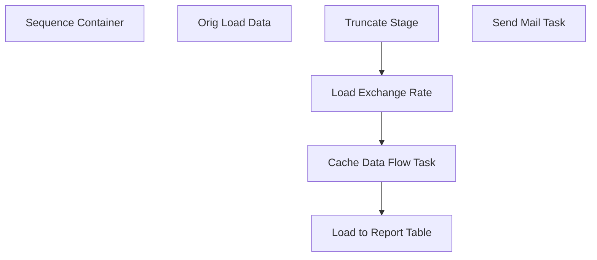

# SSIS Package: UKShipmentInvoiceReportETL

**Project:** UKShipmentInvoiceReportETL  
**Folder:** DailyReportingBuild  
**Server:** STL-SSIS-P-01  

## Connection Managers

| Name | Type | Server | Catalog | Connection (sanitized) |
|---|---|---|---|---|
| Cache Connection Manager | CACHE |  |  |  |
| DW | OLEDB | papamart | dw | Data Source=papamart; Initial Catalog=dw; Provider=SQLNCLI11.1; Integrated Security=SSPI; Auto Translate=False |
| IntegrationStaging | OLEDB | STL-SSIS-p-01 | IntegrationStaging | Data Source=STL-SSIS-p-01; Initial Catalog=IntegrationStaging; Provider=SQLNCLI11.1; Integrated Security=SSPI; Auto Translate=False |
| InventoryFiles | FLATFILE |  |  |  |
| ME_01 | OLEDB | bedrockdb02 | me_01 | Data Source=bedrockdb02; Initial Catalog=me_01; Provider=SQLNCLI11.1; Integrated Security=SSPI; Auto Translate=False |
| SMTP | SMTP |  |  |  |

## Control Flow Tasks

| Task | Type |
|---|---|
| UKShipmentInvoiceReportETL | Package |
| Sequence Container | SEQUENCE |
| Cache Data Flow Task | Pipeline |
| Load Exchange Rate | ExecuteSQLTask |
| Load to Report Table | Pipeline |
| Orig Load Data | Pipeline |
| Truncate Stage | ExecuteSQLTask |
| Send Mail Task | SendMailTask |

## Control Flow Outline

```text
- Send Mail Task [SendMailTask]
- Sequence Container [SEQUENCE]
  - Cache Data Flow Task [Pipeline]
  - Load Exchange Rate [ExecuteSQLTask]
  - Load to Report Table [Pipeline]
  - Orig Load Data [Pipeline]
  - Truncate Stage [ExecuteSQLTask]
```

## Architecture Diagram



## Variables

| Namespace | Name | Expression-bound |
|---|---|---|
| System | Propagate | No |
| User | DateTimeStamp | Yes |
| User | EndDate | Yes |
| User | EndDateAsDATE | Yes |
| User | ExchangeRate | No |
| User | GetDate | Yes |
| User | GetDateAsDATE | Yes |
| User | SQLCostLookupWithExchangeRate | Yes |
| User | StartDate | Yes |
| User | StartDateAsDATE | Yes |

### Expression-bound variable values

#### User::DateTimeStamp

**Expression:**

```sql
(DT_WSTR,4)DATEPART("yyyy",GetDate()) 
+ (DT_WSTR,4)DATEPART("mm",GetDate()) 
+ (DT_WSTR,4)DATEPART("dd",GetDate()) 
+ (DT_WSTR,4)DATEPART("hh",GetDate()) 
+ (DT_WSTR,4)DATEPART("mi",GetDate()) 
+ (DT_WSTR,4)DATEPART("ss",GetDate()) 
+ (DT_WSTR,4)DATEPART("ms",GetDate())
```

**Evaluated value:**

```sql
2023101995441777
```

#### User::EndDate

**Expression:**

```sql
dateadd("dd", @[$Package::DaysToInclude], @[User::StartDate])
```

**Evaluated value:**

```sql
10/19/2023
```

#### User::EndDateAsDATE

**Expression:**

```sql
(DT_WSTR, 4) datepart("year", @[User::EndDate])  + "-" + 
(DT_WSTR, 2) datepart("mm", @[User::EndDate])  + "-" + 
(DT_WSTR, 2) datepart("dd",  @[User::EndDate])
```

**Evaluated value:**

```sql
2023-10-19
```

#### User::GetDate

**Expression:**

```sql
(DT_DATE)DATEDIFF("Day", (DT_DATE) 0, GETDATE())
```

**Evaluated value:**

```sql
10/19/2023
```

#### User::GetDateAsDATE

**Expression:**

```sql
(DT_WSTR, 4) datepart("year", @[User::GetDate])  + "-" + 
(DT_WSTR, 2) datepart("mm", @[User::GetDate])  + "-" + 
(DT_WSTR, 2) datepart("dd",  @[User::GetDate])
```

**Evaluated value:**

```sql
2023-10-19
```

#### User::SQLCostLookupWithExchangeRate

**Expression:**

```sql
"select style_code, (average_cost / "  + @[User::ExchangeRate] + ") as average_cost 
from keith_average_cost with (nolock)"
```

**Evaluated value:**

```sql
select style_code, (average_cost / 1) as average_cost 
from keith_average_cost with (nolock)
```

#### User::StartDate

**Expression:**

```sql
dateadd("dd", -@[$Package::DaysToGoBack] , @[User::GetDate] )
```

**Evaluated value:**

```sql
10/18/2023
```

#### User::StartDateAsDATE

**Expression:**

```sql
(DT_WSTR, 4) datepart("year", @[User::StartDate])  + "-" + 
(DT_WSTR, 2) datepart("mm", @[User::StartDate])  + "-" + 
(DT_WSTR, 2) datepart("dd",  @[User::StartDate])
```

**Evaluated value:**

```sql
2023-10-18
```

## Execute SQL Tasks

### Load Exchange Rate

**Path:** `Package\Sequence Container\Load Exchange Rate`  
**Connection:** DW (papamart/dw)  

```sql
select vw.ExchangeRate
from azure.vwCurrencyExchangeFact vw
join date_dim dd with (nolock) 
	on vw.FiscalYear=dd.fiscal_year
	and vw.FiscalMonth=dd.fiscal_period
	and cast(getdate() as date) = cast(dd.actual_date as date)
where FromCurrencyCode = 'GBP'

```

### Truncate Stage

**Path:** `Package\Sequence Container\Truncate Stage`  
**Connection:** IntegrationStaging (STL-SSIS-p-01/IntegrationStaging)  

```sql
TRUNCATE TABLE Reporting.UKShipmentInvoiceReportStage
TRUNCATE TABLE Reporting.[UKItemCostUom]
```

## Data Flow: Sources

| Component | Source Object | Type | Data Flow Task | Connection | SQL Kind |
|---|---|---|---|---|---|
| Merch Cost |  | OLEDBSource | Cache Data Flow Task | ME_01 | SqlCommand |
| Product and Dept |  | OLEDBSource | Cache Data Flow Task | IntegrationStaging | SqlCommand |
| Supply Cost |  | OLEDBSource | Cache Data Flow Task | IntegrationStaging | SqlCommand |
| Weight UOM - No US Counterpart |  | OLEDBSource | Cache Data Flow Task | IntegrationStaging | SqlCommand |
| Weight UOM - US Counterpart |  | OLEDBSource | Cache Data Flow Task | IntegrationStaging | SqlCommand |
| ERP_DynamicsShipmentStage_UK |  | OLEDBSource | Load to Report Table | ME_01 | SqlCommand |
| ERP_DynamicsShipmentStage_UK |  | OLEDBSource | Orig Load Data | ME_01 | SqlCommand |

#### Merch Cost — SqlCommand

```sql
select kac.style_code as ProductNumber, 
kac.short_desc as ProductDescription, 
kac.average_cost as UnitCost
from keith_average_cost kac (nolock) 
join style s (nolock) on s.style_code=kac.style_code
join style_group sg (nolock) on s.style_id = sg.style_id
join hierarchy_group hg (nolock) on sg.hierarchy_group_id = hg.hierarchy_group_id
where substring(hg.hierarchy_group_code,7,2) <> '60' -- Exclude Supplies
and  left(kac.style_code, 1) in ('4','5','6')
order by 1
```

#### Product and Dept — SqlCommand

```sql
select cast(imp.ProductNumber as varchar (6)) as ProductNumber , 
im.NecessaryProductionWorkingTimeSchedulingPropertyId as ItemType, 
imp.ProductName as ProductDescription
from wms.ItemMasterProducts imp 
left join wms.ItemMaster im on imp.ProductNumber=im.ProductNumber
		and im.Entity = '2110'	
where left(imp.ProductNumber,1) in ('4','5','6')
```

#### Supply Cost — SqlCommand

```sql
select cast (imp.ProductNumber as varchar) as ProductNumber , 
cast (imp.ProductDescription as varchar) as ProductDescription,
cast (im.PurchasePrice as numeric (38,6) )  as UnitCost
--, im.NecessaryProductionWorkingTimeSchedulingPropertyId as ItemType

from [WMS].[ItemMasterProducts] imp 
join wms.ItemMaster im on imp.ProductNumber=im.ProductNumber
		and im.Entity = '2110'	
where left(imp.ProductNumber,1) in('4','5','6')
and im.NecessaryProductionWorkingTimeSchedulingPropertyId = 'Supplies'
```

#### Weight UOM - No US Counterpart — SqlCommand

```sql
select cast(im.ProductNumber as varchar(6)) as ProductNumber, 
cast (im.InventoryUnitSymbol as nvarchar(10)) as InventoryUnitSymbol,
uom.FromUnitSymbol,
uom.ToUnitSymbol, 
uom.Factor,
(im.NetProductWeight * 0.453592) WeightKG
from wms.ItemMaster im  (nolock) 
join wms.ItemsUOM uom with (nolock) 
			on im.Entity=uom.Entity
			and im.ProductNumber=uom.ProductNumber
			and uom.ToUnitSymbol = 'wmea'
			and uom.FromUnitSymbol = im.InventoryUnitSymbol 
where im.entity = 1100 -- US
and im.ProductNumber in (select distinct ProductNumber from WMS.vwUKItemsUSWeight vw where vw.WeightPound is null) -- Means No US Counterpart Found in View
```

#### Weight UOM - US Counterpart — SqlCommand

```sql
Select cast(ProductNumber as varchar(6)) as ProductNumber, 
cast (InventoryUnitSymbol as nvarchar(10)) as InventoryUnitSymbol,
FromUnitSymbol,
ToUnitSymbol,
Factor,
WeightKG
from WMS.vwUKItemsUSWeight
where WeightPound is not null -- Means there is a US equivalent
```

#### ERP_DynamicsShipmentStage_UK — SqlCommand

```sql
select 
	cast('2970' as varchar(4)) as ShipFrom,
	cast(location_code as varchar(4)) as ShipTo,
	cast(ship_date as date) as ShipDate,
	cast(style_code as varchar(6)) as ItemNumber,
	sum(sent_qty*-1) as Qty,
	'each' as Multiple,
	cast (isnull(insert_date, ship_date) as date) as ShipmentFileProcessingDate
--cast(NULL as float)  as NetWeight
--cast(NULL as float) as UnitCost,
--cast(NULL as float) as ExtendedCost
from ERP_DynamicsShipmentStage_UK with (nolock)
where datediff(dd, ship_date, getdate()) <= 21

--and shipment = '2900170623'
group by 
	location_code,
	cast(ship_date as date),
	style_code, 
	cast (isnull(insert_date, ship_date) as date)
```

#### ERP_DynamicsShipmentStage_UK — SqlCommand

```sql
select 
	cast('2970' as varchar(4)) as ShipFrom,
	cast(location_code as varchar(4)) as ShipTo,
	cast(ship_date as date) as ShipDate,
	cast(style_code as varchar(6)) as ItemNumber,
	sum(sent_qty*-1) as Qty,
	'each' as Multiple
--cast(NULL as float)  as NetWeight
--cast(NULL as float) as UnitCost,
--cast(NULL as float) as ExtendedCost
from ERP_DynamicsShipmentStage_UK with (nolock)
where datediff(dd, ship_date, getdate()) <= 7
group by 
	location_code,
	cast(ship_date as date),
	style_code
```

## Data Flow: Destinations

| Component | Target Table | Type | Data Flow Task | Connection | SQL Kind |
|---|---|---|---|---|---|
| Dump to Table for Missing Report |  | OLEDBDestination | Cache Data Flow Task | IntegrationStaging |  |
| UKShipmentInvoiceReportStage |  | OLEDBDestination | Load to Report Table | IntegrationStaging |  |
| UKShipmentInvoiceReportStage |  | OLEDBDestination | Orig Load Data | IntegrationStaging |  |
