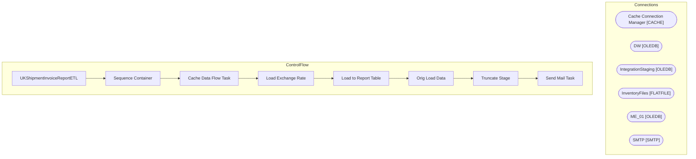

# SSIS Package: UKShipmentInvoiceReportETL

**Project:** UKShipmentInvoiceReportETL  
**Folder:** DailyReportingBuild  
**Server:** STL-SSIS-P-01  

## Architecture Diagram

## Connection Managers

| Name | Type |
|---|---|
| Cache Connection Manager | CACHE |
| DW | OLEDB |
| IntegrationStaging | OLEDB |
| InventoryFiles | FLATFILE |
| ME_01 | OLEDB |
| SMTP | SMTP |

## Control Flow Tasks

| Task | Type |
|---|---|
| UKShipmentInvoiceReportETL | Microsoft.Package |
| Sequence Container | STOCK:SEQUENCE |
| Cache Data Flow Task | Microsoft.Pipeline |
| Load Exchange Rate | Microsoft.ExecuteSQLTask |
| Load to Report Table | Microsoft.Pipeline |
| Orig Load Data | Microsoft.Pipeline |
| Truncate Stage | Microsoft.ExecuteSQLTask |
| Send Mail Task | Microsoft.SendMailTask |

## Data Flow: Sources

| Component | SQL Preview |
|---|---|
|  | select kac.style_code as ProductNumber,  kac.short_desc as ProductDescription,  kac.average_cost as UnitCost from keith_average_cost kac (nolock)  join style s (nolock) on s.style_code=kac.style_code join style_group sg (nolock) on s.style_id = sg.style_id join hierarchy_group hg (nolock) on sg.hierarchy_group_id = hg.hierarchy_group_id where substring(hg.hierarchy_group_code,7,2) <> '60' -- Exclu |
|  | select cast(imp.ProductNumber as varchar (6)) as ProductNumber ,  im.NecessaryProductionWorkingTimeSchedulingPropertyId as ItemType,  imp.ProductName as ProductDescription from wms.ItemMasterProducts imp  left join wms.ItemMaster im on imp.ProductNumber=im.ProductNumber 		and im.Entity = '2110'	 where left(imp.ProductNumber,1) in ('4','5','6') |
|  | select cast (imp.ProductNumber as varchar) as ProductNumber ,  cast (imp.ProductDescription as varchar) as ProductDescription, cast (im.PurchasePrice as numeric (38,6) )  as UnitCost --, im.NecessaryProductionWorkingTimeSchedulingPropertyId as ItemType  from [WMS].[ItemMasterProducts] imp  join wms.ItemMaster im on imp.ProductNumber=im.ProductNumber 		and im.Entity = '2110'	 where left(imp.Product |
|  | select cast(im.ProductNumber as varchar(6)) as ProductNumber,  cast (im.InventoryUnitSymbol as nvarchar(10)) as InventoryUnitSymbol, uom.FromUnitSymbol, uom.ToUnitSymbol,  uom.Factor, (im.NetProductWeight * 0.453592) WeightKG from wms.ItemMaster im  (nolock)  join wms.ItemsUOM uom with (nolock)  			on im.Entity=uom.Entity 			and im.ProductNumber=uom.ProductNumber 			and uom.ToUnitSymbol = 'wmea' 	 |
|  | Select cast(ProductNumber as varchar(6)) as ProductNumber,  cast (InventoryUnitSymbol as nvarchar(10)) as InventoryUnitSymbol, FromUnitSymbol, ToUnitSymbol, Factor, WeightKG from WMS.vwUKItemsUSWeight where WeightPound is not null -- Means there is a US equivalent |
|  | select  	cast('2970' as varchar(4)) as ShipFrom, 	cast(location_code as varchar(4)) as ShipTo, 	cast(ship_date as date) as ShipDate, 	cast(style_code as varchar(6)) as ItemNumber, 	sum(sent_qty*-1) as Qty, 	'each' as Multiple, 	cast (isnull(insert_date, ship_date) as date) as ShipmentFileProcessingDate --cast(NULL as float)  as NetWeight --cast(NULL as float) as UnitCost, --cast(NULL as float) as  |
|  | select  			cast(l.location_code as varchar(4)) as LocationCode, 			a.address_name, 			a.address_line1, 			a.address_line2, 			a.address_city, 			a.address_state, 			a.address_zip_code, 			c.country_code 		from bedrockdb02.me_01.dbo.location l 		join bedrockdb02.me_01.dbo.address a on l.location_id=a.parent_id 		join bedrockdb02.me_01.dbo.country c on a.country_id=c.country_id |
|  | select cast (imp.ProductNumber as varchar) as ProductNumber ,  cast(imp.ProductName as varchar) as ProductDescription, cast(imp.HarmonizedSystemCode as varchar) as HarmonizedSystemCode,  cast(im.OriginCountryRegionId as varchar) as OriginCountryRegionId,  --im.entity,  im.NecessaryProductionWorkingTimeSchedulingPropertyId as ItemType from [WMS].[ItemMasterProducts] imp  join wms.ItemMaster im on i |
|  | select  	cast(location_code as varchar(4)) as ShipTo, 	cast(ship_date as date) as ShipDate, 	max(cast(shipment as varchar(20))) as Invoice from ERP_DynamicsShipmentStage_UK with (nolock) where datediff(dd, ship_date, getdate()) <= 21  group by  	location_code, 	cast(ship_date as date) |
|  | select  	cast('2970' as varchar(4)) as ShipFrom, 	cast(location_code as varchar(4)) as ShipTo, 	cast(ship_date as date) as ShipDate, 	cast(style_code as varchar(6)) as ItemNumber, 	sum(sent_qty*-1) as Qty, 	'each' as Multiple --cast(NULL as float)  as NetWeight --cast(NULL as float) as UnitCost, --cast(NULL as float) as ExtendedCost from ERP_DynamicsShipmentStage_UK with (nolock) where datediff(dd |
|  | select  			cast(l.location_code as varchar(4)) as LocationCode, 			a.address_name, 			a.address_line1, 			a.address_line2, 			a.address_city, 			a.address_state, 			a.address_zip_code, 			c.country_code 		from bedrockdb02.me_01.dbo.location l 		join bedrockdb02.me_01.dbo.address a on l.location_id=a.parent_id 		join bedrockdb02.me_01.dbo.country c on a.country_id=c.country_id |
|  | select  	cast(location_code as varchar(4)) as ShipTo, 	cast(ship_date as date) as ShipDate, 	max(cast(shipment as varchar(20))) as Invoice from ERP_DynamicsShipmentStage_UK with (nolock) where datediff(dd, ship_date, getdate()) <= 7  group by  	location_code, 	cast(ship_date as date) |
|  | select  			cast(m.style_code as varchar(6)) as ProductNumber, 			cast(m.short_desc as varchar(50)) as ProductDescription, 			cast(m.HTS as varchar(15)) as HTS, 			cast(m.Country as varchar(20)) as CountryOfOrigin 		from bedrockdb02.me_01.dbo.vwzStyleHTSCOO m |
|  | select  			cast(right(p.ProductNumber,6) as varchar(6)) as ProductNumber, 			cast(p.ProductName as varchar(50)) as ProductDescription, 			cast(p.HarmonizedSystemCode as varchar(20)) as HTS, 			cast(f.FactoryCountry as varchar(20)) as CountryOfOrigin 		from erp.ItemMasterProducts p with (nolock) 		left join erp.vwItemFactoryMaster f  			on p.ProductNumber=f.ProductNumber 			and f.entity=2110 		wher |
|  | Select cast(ProductNumber as varchar(6)) as ProductNumber,  InventoryUnitSymbol,  FromUnitSymbol,  ToUnitSymbol, Factor,  WeightKG,  UnitCost  from WMS.vwUKItemsUSWeight |

## Data Flow: Destinations

| Component | Destination |
|---|---|
|  | [Reporting].[UKItemCostUom] |
|  | [Reporting].[UKShipmentInvoiceReportStage] |
|  | [Reporting].[UKShipmentInvoiceReportStage] |

