# SSIS Package: ERP_AdyenETL

**Project:** ERP_AdyenETL  
**Folder:** ERP  
**Server:** STL-SSIS-P-01  

## Connection Managers

| Name | Type | Server | Catalog | Connection (sanitized) |
|---|---|---|---|---|
| AdyenFinal | FLATFILE |  |  |  |
| Excel Connection Manager 2 | EXCEL | \\stl-dynsnc-p-01\d$\oData\paymentechD365\bankStatementFiles\bankChase.xlsx |  | Provider=Microsoft.ACE.OLEDB.12.0; Data Source=\\stl-dynsnc-p-01\d$\oData\paymentechD365\bankStatementFiles\bankChase.xlsx; Extended Properties="EXCEL 12.0 XML; HDR=YES" |
| IntegrationStaging | OLEDB | stl-ssis-p-01 | IntegrationStaging | Data Source=stl-ssis-p-01; Initial Catalog=IntegrationStaging; Provider=SQLNCLI11.1; Integrated Security=SSPI; Auto Translate=False |
| adyen.csv | FLATFILE |  |  |  |
| adyen.csv 1 | FLATFILE |  |  |  |
| adyenFinal | FLATFILE |  |  |  |
| bankAdyen csv | FLATFILE |  |  |  |

## Control Flow Tasks

| Task | Type |
|---|---|
| ERP_AdyenETL | Package |
| merchant loop | FORLOOP |
| batch # loop | FORLOOP |
| cleanup | ExecuteProcess |
| delete | FileSystemTask |
| delete staged file | FileSystemTask |
| exist | FOREACHLOOP |
| archive | FileSystemTask |
| babw_adyen 1 | Pipeline |
| copy | FileSystemTask |
| exist | ExecuteSQLTask |
| GBRWEB fix | ExecuteSQLTask |
| prepare bank statement csv | SEQUENCE |
| bank file | ExecuteSQLTask |
| export bank csv | Pipeline |
| timestamped copy | FileSystemTask |
| prepare D365 files | SEQUENCE |
| 1100 | FileSystemTask |
| 1700 | FileSystemTask |
| 2110 | FileSystemTask |
| archive | FileSystemTask |
| copy dat | FileSystemTask |
| Data Flow Task | Pipeline |
| wait2 | ExecuteSQLTask |
| Sequence Container | SEQUENCE |
| delete dat | FileSystemTask |
| spAdyenFileControl | ExecuteSQLTask |
| truncate | ExecuteSQLTask |
| USAWEB fix | ExecuteSQLTask |
| wait | ExecuteSQLTask |
| wait 1 | ExecuteSQLTask |
| file already loaded? | ExecuteSQLTask |
| wait 1 1 | ExecuteSQLTask |
| wait 1 2 | ExecuteSQLTask |
| wait2 2 | ExecuteSQLTask |
| wget | ExecuteProcess |
| batch var | ExecuteSQLTask |
| marchant var | ExecuteSQLTask |
| wait | ExecuteSQLTask |
| wait 1 | ExecuteSQLTask |

## Control Flow Outline

```text
- merchant loop [FORLOOP]
  - batch # loop [FORLOOP]
    - cleanup [ExecuteProcess]
    - delete [FileSystemTask]
    - delete staged file [FileSystemTask]
    - exist [FOREACHLOOP]
      - GBRWEB fix [ExecuteSQLTask]
      - Sequence Container [SEQUENCE]
        - delete dat [FileSystemTask]
        - spAdyenFileControl [ExecuteSQLTask]
      - USAWEB fix [ExecuteSQLTask]
      - archive [FileSystemTask]
      - babw_adyen 1 [Pipeline]
      - copy [FileSystemTask]
      - exist [ExecuteSQLTask]
      - prepare D365 files [SEQUENCE]
        - 1100 [FileSystemTask]
        - 1700 [FileSystemTask]
        - 2110 [FileSystemTask]
        - Data Flow Task [Pipeline]
        - archive [FileSystemTask]
        - copy dat [FileSystemTask]
        - wait2 [ExecuteSQLTask]
      - prepare bank statement csv [SEQUENCE]
        - bank file [ExecuteSQLTask]
        - export bank csv [Pipeline]
        - timestamped copy [FileSystemTask]
      - truncate [ExecuteSQLTask]
      - wait [ExecuteSQLTask]
      - wait 1 [ExecuteSQLTask]
    - file already loaded? [ExecuteSQLTask]
    - wait 1 1 [ExecuteSQLTask]
    - wait 1 2 [ExecuteSQLTask]
    - wait2 2 [ExecuteSQLTask]
    - wget [ExecuteProcess]
  - batch var [ExecuteSQLTask]
  - marchant var [ExecuteSQLTask]
  - wait [ExecuteSQLTask]
  - wait 1 [ExecuteSQLTask]
```

## Architecture Diagram

```mermaid
flowchart TD
    n_Package_merchant_loop["merchant loop"]
    n_Package_merchant_loop_batch___loop["batch # loop"]
    n_Package_merchant_loop_batch___loop_cleanup["cleanup"]
    n_Package_merchant_loop_batch___loop_delete["delete"]
    n_Package_merchant_loop_batch___loop_delete_staged_file["delete staged file"]
    n_Package_merchant_loop_batch___loop_exist["exist"]
    n_Package_merchant_loop_batch___loop_exist_archive["archive"]
    n_Package_merchant_loop_batch___loop_exist_babw_adyen_1["babw_adyen 1"]
    n_Package_merchant_loop_batch___loop_exist_copy["copy"]
    n_Package_merchant_loop_batch___loop_exist_exist["exist"]
    n_Package_merchant_loop_batch___loop_exist_GBRWEB_fix["GBRWEB fix"]
    n_Package_merchant_loop_batch___loop_exist_prepare_bank_statement_csv["prepare bank statement csv"]
    n_Package_merchant_loop_batch___loop_exist_prepare_bank_statement_csv_bank_file["bank file"]
    n_Package_merchant_loop_batch___loop_exist_prepare_bank_statement_csv_export_bank_csv["export bank csv"]
    n_Package_merchant_loop_batch___loop_exist_prepare_bank_statement_csv_timestamped_copy["timestamped copy"]
    n_Package_merchant_loop_batch___loop_exist_prepare_D365_files["prepare D365 files"]
    n_Package_merchant_loop_batch___loop_exist_prepare_D365_files_1100["1100"]
    n_Package_merchant_loop_batch___loop_exist_prepare_D365_files_1700["1700"]
    n_Package_merchant_loop_batch___loop_exist_prepare_D365_files_2110["2110"]
    n_Package_merchant_loop_batch___loop_exist_prepare_D365_files_archive["archive"]
    n_Package_merchant_loop_batch___loop_exist_prepare_D365_files_copy_dat["copy dat"]
    n_Package_merchant_loop_batch___loop_exist_prepare_D365_files_Data_Flow_Task["Data Flow Task"]
    n_Package_merchant_loop_batch___loop_exist_prepare_D365_files_wait2["wait2"]
    n_Package_merchant_loop_batch___loop_exist_Sequence_Container["Sequence Container"]
    n_Package_merchant_loop_batch___loop_exist_Sequence_Container_delete_dat["delete dat"]
    n_Package_merchant_loop_batch___loop_exist_Sequence_Container_spAdyenFileControl["spAdyenFileControl"]
    n_Package_merchant_loop_batch___loop_exist_truncate["truncate"]
    n_Package_merchant_loop_batch___loop_exist_USAWEB_fix["USAWEB fix"]
    n_Package_merchant_loop_batch___loop_exist_wait["wait"]
    n_Package_merchant_loop_batch___loop_exist_wait_1["wait 1"]
    n_Package_merchant_loop_batch___loop_file_already_loaded_["file already loaded?"]
    n_Package_merchant_loop_batch___loop_wait_1_1["wait 1 1"]
    n_Package_merchant_loop_batch___loop_wait_1_2["wait 1 2"]
    n_Package_merchant_loop_batch___loop_wait2_2["wait2 2"]
    n_Package_merchant_loop_batch___loop_wget["wget"]
    n_Package_merchant_loop_batch_var["batch var"]
    n_Package_merchant_loop_marchant_var["marchant var"]
    n_Package_merchant_loop_wait["wait"]
    n_Package_merchant_loop_wait_1["wait 1"]
    n_Package_merchant_loop_batch___loop_exist_prepare_bank_statement_csv_bank_file --> n_Package_merchant_loop_batch___loop_exist_prepare_bank_statement_csv_timestamped_copy
    n_Package_merchant_loop_batch___loop_exist_prepare_D365_files_Data_Flow_Task --> n_Package_merchant_loop_batch___loop_exist_prepare_D365_files_wait2
    n_Package_merchant_loop_batch___loop_exist_prepare_D365_files_archive --> n_Package_merchant_loop_batch___loop_exist_prepare_D365_files_copy_dat
    n_Package_merchant_loop_batch___loop_exist_prepare_D365_files_copy_dat --> n_Package_merchant_loop_batch___loop_exist_prepare_D365_files_1100
    n_Package_merchant_loop_batch___loop_exist_prepare_D365_files_copy_dat --> n_Package_merchant_loop_batch___loop_exist_prepare_D365_files_2110
    n_Package_merchant_loop_batch___loop_exist_prepare_D365_files_wait2 --> n_Package_merchant_loop_batch___loop_exist_prepare_D365_files_archive
    n_Package_merchant_loop_batch___loop_exist_prepare_D365_files_copy_dat --> n_Package_merchant_loop_batch___loop_exist_prepare_D365_files_1700
    n_Package_merchant_loop_batch___loop_exist_Sequence_Container_delete_dat --> n_Package_merchant_loop_batch___loop_exist_Sequence_Container_spAdyenFileControl
    n_Package_merchant_loop_batch___loop_exist_truncate --> n_Package_merchant_loop_batch___loop_exist_babw_adyen_1
    n_Package_merchant_loop_batch___loop_exist_wait --> n_Package_merchant_loop_batch___loop_exist_archive
    n_Package_merchant_loop_batch___loop_exist_Sequence_Container --> n_Package_merchant_loop_batch___loop_exist_prepare_bank_statement_csv
    n_Package_merchant_loop_batch___loop_exist_copy --> n_Package_merchant_loop_batch___loop_exist_truncate
    n_Package_merchant_loop_batch___loop_exist_exist --> n_Package_merchant_loop_batch___loop_exist_wait
    n_Package_merchant_loop_batch___loop_exist_archive --> n_Package_merchant_loop_batch___loop_exist_copy
    n_Package_merchant_loop_batch___loop_exist_babw_adyen_1 --> n_Package_merchant_loop_batch___loop_exist_wait_1
    n_Package_merchant_loop_batch___loop_exist_wait_1 --> n_Package_merchant_loop_batch___loop_exist_GBRWEB_fix
    n_Package_merchant_loop_batch___loop_exist_prepare_D365_files --> n_Package_merchant_loop_batch___loop_exist_Sequence_Container
    n_Package_merchant_loop_batch___loop_exist_GBRWEB_fix --> n_Package_merchant_loop_batch___loop_exist_USAWEB_fix
    n_Package_merchant_loop_batch___loop_exist_USAWEB_fix --> n_Package_merchant_loop_batch___loop_exist_prepare_D365_files
    n_Package_merchant_loop_batch___loop_exist --> n_Package_merchant_loop_batch___loop_delete_staged_file
    n_Package_merchant_loop_batch___loop_wait2_2 --> n_Package_merchant_loop_batch___loop_file_already_loaded_
    n_Package_merchant_loop_batch___loop_wait_1_2 --> n_Package_merchant_loop_batch___loop_cleanup
    n_Package_merchant_loop_batch___loop_wget --> n_Package_merchant_loop_batch___loop_wait2_2
    n_Package_merchant_loop_batch___loop_file_already_loaded_ --> n_Package_merchant_loop_batch___loop_delete
    n_Package_merchant_loop_batch___loop_file_already_loaded_ --> n_Package_merchant_loop_batch___loop_exist
    n_Package_merchant_loop_batch___loop_wait_1_1 --> n_Package_merchant_loop_batch___loop_wget
    n_Package_merchant_loop_batch___loop_delete_staged_file --> n_Package_merchant_loop_batch___loop_wait_1_2
    n_Package_merchant_loop_marchant_var --> n_Package_merchant_loop_wait
    n_Package_merchant_loop_wait --> n_Package_merchant_loop_batch_var
    n_Package_merchant_loop_batch_var --> n_Package_merchant_loop_wait_1
    n_Package_merchant_loop_wait_1 --> n_Package_merchant_loop_batch___loop
```



## Variables

| Namespace | Name | Expression-bound |
|---|---|---|
| User | FilePath | No |
| User | GJ_Path2 | No |
| User | GJ_Path3 | No |
| User | GJ_path | No |
| User | RowHeader | No |
| User | bankStatementFile | No |
| User | bankStatementPath | Yes |
| User | calendarDaysToGoBack | Yes |
| User | csv_copy | Yes |
| User | d365archiveFile | Yes |
| User | d365archiveFile2 | Yes |
| User | d365file | No |
| User | datDelete | No |
| User | extension | No |
| User | extension2 | No |
| User | extension3 | No |
| User | fileDate | No |
| User | file_to_delete | Yes |
| User | finalGJfilename | Yes |
| User | finalGJfilename2 | Yes |
| User | finalGJfilename_1700 | Yes |
| User | finalGJfilename_2110 | Yes |
| User | newFile | Yes |
| User | varAdyenFilePath | Yes |
| User | varAdyenFinalPath | Yes |
| User | varAdyenStagedFilePath | Yes |
| User | varApiArg | Yes |
| User | varArchiveFolder | No |
| User | varArchiveFolder2 | No |
| User | varArchiveFolderD365 | Yes |
| User | varArchiveFolderRaw | Yes |
| User | varBankStatementFolder | No |
| User | varBankStatementTemplateFolder | No |
| User | varBatchAndMerchantSelect | No |
| User | varBatchNumber | No |
| User | varCleanupArg | No |
| User | varCurrentBatchNumber | No |
| User | varCurrentFilename | No |
| User | varCurrentSeqNumber | No |
| User | varDTGB | No |
| User | varFileExists | No |
| User | varFileLoaded | No |
| User | varMaxBatchNumber | Yes |
| User | varMerchantAccount | No |
| User | varStartDate | Yes |
| User | varTest | Yes |
| User | xlsx_copy | Yes |

### Expression-bound variable values

#### User::bankStatementPath

**Expression:**

```sql
@[User::varBankStatementFolder] +  @[User::bankStatementFile] +  @[User::extension]
```

**Evaluated value:**

```sql
\\stl-dynsnc-p-01\d$\oData\AdyenBankStatement\bankAdyen.csv
```

#### User::calendarDaysToGoBack

**Expression:**

```sql
@[$Package::DaysToGoBack]
```

**Evaluated value:**

```sql
3
```

#### User::csv_copy

**Expression:**

```sql
@[User::varBankStatementFolder] +  @[User::varMerchantAccount] + "\\" + @[User::bankStatementFile] + "_" + (DT_WSTR, 4) @[User::varCurrentBatchNumber] + "_" + @[User::fileDate] + "_"+ (DT_WSTR, 4) year(getdate()) +  (DT_WSTR, 2) month(getdate()) + 
(DT_WSTR, 2) day(getdate()) + RIGHT("0" + (DT_STR, 2, 1252)DATEPART("hh", GetDate()), 2) + RIGHT("0" + (DT_STR, 2, 1252)DATEPART("mi", GetDate()), 2) + RIGHT("0" + (DT_STR, 2, 1252)DATEPART("ss", GetDate()), 2) 
+ @[User::extension3]
```

**Evaluated value:**

```sql
\\stl-dynsnc-p-01\d$\oData\AdyenBankStatement\BABUSAPOS\bankAdyen_4__2024615211001.txt
```

#### User::d365archiveFile

**Expression:**

```sql
@[User::varArchiveFolder] + @[User::d365file] + "_"+  @[User::varMerchantAccount]  + "_"+ (DT_WSTR, 4) year(getdate()) +  (DT_WSTR, 2) month(getdate()) +  (DT_WSTR, 2) day(getdate()) + RIGHT("0" + (DT_STR, 2, 1252)DATEPART("hh", GetDate()), 2) + RIGHT("0" + (DT_STR, 2, 1252)DATEPART("mi", GetDate()), 2) + RIGHT("0" + (DT_STR, 2, 1252)DATEPART("ss", GetDate()), 2) + @[User::extension]
```

**Evaluated value:**

```sql
\\stl-ssis-p-01\IntegrationStaging\Adyen\archive\adyenD365_BABUSAPOS_2024615211001.csv
```

#### User::d365archiveFile2

**Expression:**

```sql
@[User::varArchiveFolder2] + @[User::d365file] + "_"+  @[User::fileDate] + "_"+ (DT_WSTR, 4) year(getdate()) +  (DT_WSTR, 2) month(getdate()) +  (DT_WSTR, 2) day(getdate()) + RIGHT("0" + (DT_STR, 2, 1252)DATEPART("hh", GetDate()), 2) + RIGHT("0" + (DT_STR, 2, 1252)DATEPART("mi", GetDate()), 2) + RIGHT("0" + (DT_STR, 2, 1252)DATEPART("ss", GetDate()), 2) + @[User::extension]
```

**Evaluated value:**

```sql
\\stl-dynsnc-p-01\d$\oData\paymentechD365\archive\adyenD365__2024615211001.csv
```

#### User::file_to_delete

**Expression:**

```sql
@[User::varBankStatementFolder] + @[User::bankStatementFile] +  @[User::extension2]
```

**Evaluated value:**

```sql
\\stl-dynsnc-p-01\d$\oData\AdyenBankStatement\bankAdyen.xlsx
```

#### User::finalGJfilename

**Expression:**

```sql
@[User::GJ_path] + "adyenD365" + "_" + RIGHT(@[User::varMerchantAccount],6) + "_" +  (DT_WSTR,4)@[User::varCurrentBatchNumber]    +  @[User::fileDate] + "_"+ (DT_WSTR, 4) year(getdate()) +  (DT_WSTR, 2) month(getdate()) +  (DT_WSTR, 2) day(getdate()) + RIGHT("0" + (DT_STR, 2, 1252)DATEPART("hh", GetDate()), 2) + RIGHT("0" + (DT_STR, 2, 1252)DATEPART("mi", GetDate()), 2) + RIGHT("0" + (DT_STR, 2, 1252)DATEPART("ss", GetDate()), 2) + @[User::extension]
```

**Evaluated value:**

```sql
\\stl-dynsnc-p-01\d$\BABWIntegrations\GeneralJournal\prod\1100\adyenD365_USAPOS_4_2024615211001.csv
```

#### User::finalGJfilename2

**Expression:**

```sql
RIGHT( @[User::finalGJfilename] , 30)
```

**Evaluated value:**

```sql
365_USAPOS_4_2024615211001.csv
```

#### User::finalGJfilename_1700

**Expression:**

```sql
@[User::GJ_Path3] + "adyenD365" + "_" +  RIGHT(@[User::varMerchantAccount],6) + "_" +  (DT_WSTR,4)@[User::varCurrentBatchNumber]    +  @[User::fileDate] + "_"+ (DT_WSTR, 4) year(getdate()) +  (DT_WSTR, 2) month(getdate()) +  (DT_WSTR, 2) day(getdate()) + RIGHT("0" + (DT_STR, 2, 1252)DATEPART("hh", GetDate()), 2) + RIGHT("0" + (DT_STR, 2, 1252)DATEPART("mi", GetDate()), 2) + RIGHT("0" + (DT_STR, 2, 1252)DATEPART("ss", GetDate()), 2) + @[User::extension]
```

**Evaluated value:**

```sql
\\stl-dynsnc-p-01\d$\BABWIntegrations\GeneralJournal\prod\1700\adyenD365_USAPOS_4_2024615211001.csv
```

#### User::finalGJfilename_2110

**Expression:**

```sql
@[User::GJ_Path2] + "adyenD365" + "_" + RIGHT(@[User::varMerchantAccount],6) + "_" +  (DT_WSTR,4)@[User::varCurrentBatchNumber]    +  @[User::fileDate] + "_"+ (DT_WSTR, 4) year(getdate()) +  (DT_WSTR, 2) month(getdate()) +  (DT_WSTR, 2) day(getdate()) + RIGHT("0" + (DT_STR, 2, 1252)DATEPART("hh", GetDate()), 2) + RIGHT("0" + (DT_STR, 2, 1252)DATEPART("mi", GetDate()), 2) + RIGHT("0" + (DT_STR, 2, 1252)DATEPART("ss", GetDate()), 2) + @[User::extension]
```

**Evaluated value:**

```sql
\\stl-dynsnc-p-01\d$\BABWIntegrations\GeneralJournal\prod\2110\adyenD365_USAPOS_4_2024615211001.csv
```

#### User::newFile

**Expression:**

```sql
@[User::varBankStatementTemplateFolder] + @[User::bankStatementFile] +  @[User::extension2]
```

**Evaluated value:**

```sql
\\stl-ssis-p-01\IntegrationStaging\paymentech\paymentechD365\bankStatementFiles\template\bankAdyen.xlsx
```

#### User::varAdyenFilePath

**Expression:**

```sql
@[$Package::AdyenDirectory] + "settlement_detail_report.csv"
```

**Evaluated value:**

```sql
\\stl-ssis-p-01\IntegrationStaging\Adyen\settlement_detail_report.csv
```

#### User::varAdyenFinalPath

**Expression:**

```sql
@[$Package::AdyenDirectory] + "AdyenFinal.dat"
```

**Evaluated value:**

```sql
\\stl-ssis-p-01\IntegrationStaging\Adyen\AdyenFinal.dat
```

#### User::varAdyenStagedFilePath

**Expression:**

```sql
@[$Package::AdyenStageDirectory] + "settlement_detail_report_batch_" + (DT_WSTR, 4)  @[User::varCurrentBatchNumber] + ".csv"
```

**Evaluated value:**

```sql
\\stl-ssis-p-01\IntegrationStaging\Adyen\SalesRecon\settlement_detail_report_batch_4.csv
```

#### User::varApiArg

**Expression:**

```sql
"--http-user=" +  @[$Package::apiUsername] + " " + "--http-password=" +  @[$Package::apiPassword] + " " +  @[$Package::apiURL] +  @[User::varMerchantAccount] + "/settlement_detail_report_batch_" +  (DT_WSTR, 10) @[User::varCurrentBatchNumber] + ".csv"
```

**Evaluated value:**

```sql
--http-user=report@Company.Build-A-Bear --http-password=5a%R5$WpnW%g:xF*,#$eMY7B3 https://ca-live.adyen.com/reports/download/MerchantAccount/BABUSAPOS/settlement_detail_report_batch_4.csv
```

#### User::varArchiveFolderD365

**Expression:**

```sql
@[$Package::AdyenArchiveDirectory] +  @[User::varMerchantAccount] + "\\" +  "adyenD365" + "_" +  (DT_WSTR,4)@[User::varCurrentBatchNumber]    +  @[User::fileDate] + "_"+ (DT_WSTR, 4) year(getdate()) +  (DT_WSTR, 2) month(getdate()) +  (DT_WSTR, 2) day(getdate()) + RIGHT("0" + (DT_STR, 2, 1252)DATEPART("hh", GetDate()), 2) + RIGHT("0" + (DT_STR, 2, 1252)DATEPART("mi", GetDate()), 2) + RIGHT("0" + (DT_STR, 2, 1252)DATEPART("ss", GetDate()), 2) + @[User::extension]
```

**Evaluated value:**

```sql
\\stl-ssis-p-01\IntegrationStaging\Adyen\Archive\BABUSAPOS\adyenD365_4_2024615211001.csv
```

#### User::varArchiveFolderRaw

**Expression:**

```sql
@[$Package::AdyenArchiveDirectory] +  @[User::varMerchantAccount] + "\\" +  @[User::varCurrentFilename] + ".csv"
```

**Evaluated value:**

```sql
\\stl-ssis-p-01\IntegrationStaging\Adyen\Archive\BABUSAPOS\settlement_detail_report_batch_0.csv
```

#### User::varMaxBatchNumber

**Expression:**

```sql
@[User::varBatchNumber] + 19
```

**Evaluated value:**

```sql
20
```

#### User::varStartDate

**Expression:**

```sql
RIGHT("0" + (DT_WSTR, 2) DATEPART("MM", DATEADD("day", -@[User::calendarDaysToGoBack] , GETDATE())),2) + "/" +
RIGHT("0" + (DT_WSTR, 2) DATEPART("DD", DATEADD("day", -@[User::calendarDaysToGoBack] , GETDATE())),2) + "/" + 
(DT_WSTR, 4) YEAR(DATEADD("day", -@[User::calendarDaysToGoBack] ,GETDATE()))
```

**Evaluated value:**

```sql
06/12/2024
```

#### User::varTest

**Expression:**

```sql
@[$Package::AdyenDirectory]
```

**Evaluated value:**

```sql
\\stl-ssis-p-01\IntegrationStaging\Adyen\
```

#### User::xlsx_copy

**Expression:**

```sql
@[User::varBankStatementFolder] + @[User::bankStatementFile] + "_" + @[User::fileDate] + "_"+ (DT_WSTR, 4) year(getdate()) +  (DT_WSTR, 2) month(getdate()) +  (DT_WSTR, 2) day(getdate()) + RIGHT("0" + (DT_STR, 2, 1252)DATEPART("hh", GetDate()), 2) + RIGHT("0" + (DT_STR, 2, 1252)DATEPART("mi", GetDate()), 2) + RIGHT("0" + (DT_STR, 2, 1252)DATEPART("ss", GetDate()), 2) + @[User::extension2]
```

**Evaluated value:**

```sql
\\stl-dynsnc-p-01\d$\oData\AdyenBankStatement\bankAdyen__2024615211001.xlsx
```

## Execute SQL Tasks

### GBRWEB fix

**Path:** `Package\merchant loop\batch # loop\exist\GBRWEB fix`  
**Connection:** IntegrationStaging (stl-ssis-p-01/IntegrationStaging)  

```sql
update [dbo].[babw_adyen] set Store = '2013'  where (Store = '' and Merchant_Account = 'BABGBRWEB' and Type in ('Settled','Refunded','Fee','InvoiceDeduction')) or (Store is null  and Merchant_Account = 'BABGBRWEB' and Type in ('Settled','Refunded','Fee','InvoiceDeduction'))

```

### spAdyenFileControl

**Path:** `Package\merchant loop\batch # loop\exist\Sequence Container\spAdyenFileControl`  
**Connection:** IntegrationStaging (stl-ssis-p-01/IntegrationStaging)  

```sql
spAdyenFileControl ?,?,?
```

### USAWEB fix

**Path:** `Package\merchant loop\batch # loop\exist\USAWEB fix`  
**Connection:** IntegrationStaging (stl-ssis-p-01/IntegrationStaging)  

```sql
update [dbo].[babw_adyen] set Store = '1013'  where (Store = '' and Merchant_Account = 'BABUSAWEB' and Type in ('Settled','Refunded','Fee','InvoiceDeduction')) or (Store is null  and Merchant_Account = 'BABUSAWEB' and Type in ('Settled','Refunded','Fee','InvoiceDeduction'))

```

### exist

**Path:** `Package\merchant loop\batch # loop\exist\exist`  
**Connection:** IntegrationStaging (stl-ssis-p-01/IntegrationStaging)  

```sql
-- do nothing
```

### wait2

**Path:** `Package\merchant loop\batch # loop\exist\prepare D365 files\wait2`  
**Connection:** IntegrationStaging (stl-ssis-p-01/IntegrationStaging)  

```sql
WAITFOR DELAY '00:00:05'
```

### bank file

**Path:** `Package\merchant loop\batch # loop\exist\prepare bank statement csv\bank file`  
**Connection:** IntegrationStaging (stl-ssis-p-01/IntegrationStaging)  

```sql
exec [dbo].[spAdyen_Bank_Export] ?
```

### truncate

**Path:** `Package\merchant loop\batch # loop\exist\truncate`  
**Connection:** IntegrationStaging (stl-ssis-p-01/IntegrationStaging)  

```sql
truncate table [dbo].[babw_adyen]
```

### wait

**Path:** `Package\merchant loop\batch # loop\exist\wait`  
**Connection:** IntegrationStaging (stl-ssis-p-01/IntegrationStaging)  

```sql
WAITFOR DELAY '00:00:05'
```

### wait 1

**Path:** `Package\merchant loop\batch # loop\exist\wait 1`  
**Connection:** IntegrationStaging (stl-ssis-p-01/IntegrationStaging)  

```sql
WAITFOR DELAY '00:00:10'
```

### file already loaded?

**Path:** `Package\merchant loop\batch # loop\file already loaded?`  
**Connection:** IntegrationStaging (stl-ssis-p-01/IntegrationStaging)  

```sql
spAdyenFileCheck ?,?
```

### wait 1 1

**Path:** `Package\merchant loop\batch # loop\wait 1 1`  
**Connection:** IntegrationStaging (stl-ssis-p-01/IntegrationStaging)  

```sql
WAITFOR DELAY '00:00:10'
```

### wait 1 2

**Path:** `Package\merchant loop\batch # loop\wait 1 2`  
**Connection:** IntegrationStaging (stl-ssis-p-01/IntegrationStaging)  

```sql
WAITFOR DELAY '00:00:25'
```

### wait2 2

**Path:** `Package\merchant loop\batch # loop\wait2 2`  
**Connection:** IntegrationStaging (stl-ssis-p-01/IntegrationStaging)  

```sql
WAITFOR DELAY '00:00:02'
```

### batch var

**Path:** `Package\merchant loop\batch var`  
**Connection:** IntegrationStaging (stl-ssis-p-01/IntegrationStaging)  

```sql
select lastBatchNum + 1  as 'varBatchNumber' from [dbo].[babw_adyen_merchant] where seqNumber = ?
```

### marchant var

**Path:** `Package\merchant loop\marchant var`  
**Connection:** IntegrationStaging (stl-ssis-p-01/IntegrationStaging)  

```sql
select MerchantAccount as 'varMerchantAccount' from [dbo].[babw_adyen_merchant] where seqNumber = ?
```

### wait

**Path:** `Package\merchant loop\wait`  
**Connection:** IntegrationStaging (stl-ssis-p-01/IntegrationStaging)  

```sql
WAITFOR DELAY '00:00:02'
```

### wait 1

**Path:** `Package\merchant loop\wait 1`  
**Connection:** IntegrationStaging (stl-ssis-p-01/IntegrationStaging)  

```sql
WAITFOR DELAY '00:00:02'
```

## Data Flow: Sources

| Component | Source Object | Type | Data Flow Task | Connection | SQL Kind |
|---|---|---|---|---|---|
| Flat File Source |  | FlatFileSource | babw_adyen 1 | adyen.csv 1 |  |
| OLE DB Source |  | OLEDBSource | export bank csv | IntegrationStaging | SqlCommand |
| OLE DB Source |  | OLEDBSource | Data Flow Task | IntegrationStaging | SqlCommand |

#### OLE DB Source — SqlCommand

```sql
select (select distinct convert(varchar(10), cast(Creation_Date as date), 101)  from [dbo].[babw_adyen] where Type = 'MerchantPayout') as 'As Of'
,(select distinct [Gross_Currency] from [dbo].[babw_adyen] where [Gross_Currency] is not null) as 'Currency'
, 'ABA' as 'BankID Type','123456789' as 'BankID',
 'Account' = CASE WHEN Payment_Method in ('visa','mc') THEN '1100MCVCLEAR' WHEN  Payment_Method in ('discover') THEN '1100DISCVCLEAR' WHEN Payment_Method in ('dinersr') THEN '1100DINRSCLEAR' END
 ,'Credits' as 'Data Type','399' as 'BAI Code','Deposit' as 'Description', sum(Gross_Credit_GC) as 'Amount' ,
 '' as 'Balance/Value Date', Store as 'Customer Reference','' as 'Immediate Availability', '' as '1 Day Float',
'' as '2 + DayFloat'
,(select distinct convert(varchar(10), cast(Creation_Date as date), 112)  from [dbo].[babw_adyen] where Type = 'MerchantPayout') + Store as 'Bank Reference'
,'' as '# of Items',(select distinct convert(varchar(10), cast(Creation_Date as date), 112)  from [dbo].[babw_adyen] where Type = 'MerchantPayout') + Store as 'Text'
from [dbo].[babw_adyen] where Type in ('Settled','Refunded','Chargeback','Chargebacks','Fee') 
group by Store, Payment_Method having sum(Gross_Credit_GC) <> 0

union all

select (select distinct convert(varchar(10), cast(Creation_Date as date), 101)  from [dbo].[babw_adyen] where Type = 'MerchantPayout') as 'As Of'
,(select distinct [Gross_Currency] from [dbo].[babw_adyen] where [Gross_Currency] is not null) as 'Currency'
, 'ABA' as 'BankID Type','123456789' as 'BankID', 
  'Account' = CASE WHEN ( select top 1 Payment_Method  from [dbo].[babw_adyen] )  in ('visa','mc') THEN '1100MCVCLEAR' 
 WHEN  ( select top 1 Payment_Method  from [dbo].[babw_adyen] )  in ('discover') THEN '1100DISCVCLEAR' 
 WHEN ( select top 1 Payment_Method  from [dbo].[babw_adyen] )  in ('dinersr') THEN '1100DINRSCLEAR' END
 ,'Debits' as 'Data Type','699' as 'BAI Code','Disbursement' as 'Description', sum(Gross_Credit_GC) as 'Amount' ,
 '' as 'Balance/Value Date', '9999' as 'Customer Reference','' as 'Immediate Availability', '' as '1 Day Float',
'' as '2 + DayFloat'
,(select distinct convert(varchar(10), cast(Creation_Date as date), 112)  from [dbo].[babw_adyen] where Type = 'MerchantPayout') + '9999' as 'Bank Reference'
,'' as '# of Items',(select distinct convert(varchar(10), cast(Creation_Date as date), 112)  from [dbo].[babw_adyen] where Type = 'MerchantPayout') + '9999' as 'Text'
from [dbo].[babw_adyen]
```

#### OLE DB Source — SqlCommand

```sql
declare @totalCredits decimal(18,2)
declare @totalDebits decimal(18,2)
declare @summaryLineNumber integer
declare @merchantAccountCode varchar(50)

set @totalCredits = 0 
set @totalDebits = 0 

set @totalCredits = (select (sum(Gross_Credit_GC)) as 'total credits' from [dbo].[babw_adyen] where Type in ('Settled','Refunded','Fee'))


set  @totalDebits = (
select sum(debits) from
(
select sum(isnull(Commission_NC, 0.00) + isnull(Markup_NC, 0.00) + isnull(Scheme_Fees_NC, 0.00) + isnull(Interchange_NC, 0.00) ) as debits from [dbo].[babw_adyen] where  Type in ('Settled','Refunded','Chargeback','Chargebacks')
 union all
select sum(Gross_Debit_GC) as debits from [dbo].[babw_adyen] where  Type in ('Refunded','Chargeback','Chargebacks')
 union all
select sum(Net_Debit_NC) as debits from  [dbo].[babw_adyen] where  Type in ('Fee','InvoiceDeduction')
) x
)


set  @summaryLineNumber = (
  select max(ROW_NUM) +1  from
(
SELECT *, ROW_NUMBER() OVER(ORDER BY Company_Account) ROW_NUM
  FROM (
  select Company_Account from [dbo].[babw_adyen] where Type in ( 'Settled', 'Refunded','Chargeback') 
  union all
  select Company_Account from [dbo].[babw_adyen] where Type in ( 'Settled') 
  union all
  select Company_Account from [dbo].[babw_adyen] where Type in ( 'Fee','InvoiceDeduction') 
  ) a
  ) b
  )

 -- set @merchantAccountCode = 
 -- (
 -- select 
	--'merchAccountCode' = case
 --     when right(Modification_Reference,9) = 'BABUSAPOS' then 'AUP'
	--  when right(Modification_Reference,9) = 'BABGBRWEB' then 'AGW'
	--  when right(Modification_Reference,9) = 'BABUSAWEB' then 'AUW'
	--  when right(Modification_Reference,9) = 'BABCANPOS' then 'ACP'
	--  when right(Modification_Reference,9) = 'BABGBRPOS' then 'AGP'
	--  else '' end 
	--  from [dbo].[babw_adyen] where Type = 'MerchantPayout'
	--  )


set @merchantAccountCode = 
  (
	   select top 1
	'merchAccountCode' = case
      when  Merchant_Account = 'BABUSAPOS' then 'AUP'
	  when Merchant_Account = 'BABGBRWEB' then 'AGW'
	  when Merchant_Account = 'BABUSAWEB' then 'AUW'
	  when Merchant_Account = 'BABCANPOS' then 'ACP'
	  when Merchant_Account = 'BABGBRPOS' then 'AGP'
	  else '' end 
	  from [dbo].[babw_adyen] 
	  )

SELECT *, ROW_NUMBER() OVER(ORDER BY JOURNALBATCHNUMBER) ROW_NUM
  FROM (

-- Bank lines
select 'GLNUM001' as JOURNALBATCHNUMBER, 
--ROW_NUMBER() OVER(ORDER BY Company_Account ASC) AS LINENUMBER,
 'ACCOUNTDISPLAYVALUE' = CASE    WHEN Store in (285,470,990,991,999) and Type in ('Settled','Refunded') and Payment_Method in ('visa','mc','maestro','mc_applepay','visa_applepay','cup','jcb','vpay') THEN 'MCVClear'
								WHEN Store in (285,470,990,991,999) and Type in ('Settled','Refunded') and Payment_Method in ('discover') THEN 'DiscvClear'
								WHEN Store in (285,470,990,991,999) and Type in ('Settled','Refunded') and Payment_Method in ('dinersr') THEN 'DinrsClear'
			                     WHEN Store in (285,470,990,991,999) and Type in ('Chargeback','Chargebacks') THEN '601000-9999-9999-10--'
								WHEN Store in (285,470,990,991,999) and Type not in ('Settled','Refunded','Chargeback','Chargebacks') THEN '601000-9999-9999-10--'
			                     WHEN Store in ('1013') and Type in ('Settled','Refunded') THEN 'MCVClear'
							   --WHEN Store in ('0013') and Type not in ('Settled','Refunded') THEN '601000-1013-9999-11--'
							   WHEN  Store not in (285,470,990,991,999) and Type in ('Settled','Refunded') and Payment_Method in ('visa','mc','maestro','mc_applepay','visa_applepay','cup','jcb','vpay') THEN 'MCVClear'
							   WHEN  Store not in (285,470,990,991,999) and Type in ('Settled','Refunded') and Payment_Method in ('discover') THEN 'DiscvClear'
							   WHEN  Store not in (285,470,990,991,999) and Type in ('Settled','Refunded') and Payment_Method in ('diners') THEN 'DinrsClear'
							   WHEN  Store not in (285,470,990,991,999) and Type in ('Chargeback','Chargebacks') THEN '601000-' + convert(varchar, Store) + '-9999-10--'
							   WHEN Store not in (285,470,990,991,999) and Type not in ('Settled','Refunded','Chargeback','Chargebacks') THEN '601000-' + convert(varchar, Store) + '-9999-10--'
							   WHEN  Type in ('Settled','Refunded') and Payment_Method in ('visa','mc','maestro','mc_applepay','visa_applepay','cup','jcb','vpay') THEN 'MCVClear'
							   WHEN  Type in ('Settled','Refunded') and Payment_Method in ('discover') THEN 'DiscvClear'
							   WHEN  Type in ('Settled','Refunded') and Payment_Method in ('diners') THEN 'DinrsClear'
							   WHEN  Type in ('Chargeback','Chargebacks') THEN '601000-9999-9999-10--'
								WHEN Store > 1000 and Type not in ('Settled','Refunded','Chargeback','Chargebacks') THEN '601000-9999-9999-10--' END,
	'ACCOUNTTYPE' = CASE   WHEN Store in (285,470,990,991,999) and Type in ('Settled','Refunded') THEN 'Bank'
						WHEN Store in (285,470,990,991,999) and Type in ('Chargeback','Chargebacks') THEN 'Ledger'
						WHEN Store in (285,470,990,991,999) and Type not in ('Settled','Refunded','Chargeback','Chargebacks') THEN 'Ledger'
			            WHEN Store in ('0013','1013') and Type in ('Settled','Refunded') THEN 'Bank'
						WHEN Store in ('0013','1013') and Type not in ('Settled','Refunded') THEN 'Ledger'
						WHEN  Store not in (285,470,990,991,999) and Type in ('Settled','Refunded') THEN 'Bank'
						WHEN Store not in (285,470,990,991,999) and Type in ('Chargeback','Chargebacks') THEN 'Ledger'
						WHEN Store not in (285,470,990,991,999) and Type not in ('Settled','Refunded','Chargeback','Chargebacks') THEN 'Ledger'
			            WHEN  Type in ('Settled','Refunded') THEN 'Bank'
				        WHEN Type in ('Chargeback','Chargebacks') THEN 'Ledger'
				        WHEN Type not in ('Settled','Refunded','Chargeback','Chargebacks') THEN 'Ledger' END,
'BANKTRANSTYPE' = CASE  WHEN Store in (285,470,990,991,999) and Type in ('Settled','Refunded') THEN 'ADYEN'
				  WHEN Store in (285,470,990,991,999) and Type in ('Chargeback','Chargebacks') THEN ''
				  WHEN Store in (285,470,990,991,999) and Type not in ('Settled','Refunded','Chargeback','Chargebacks') THEN ''
			                     WHEN Store in ('0013') and Type in ('Settled','Refunded') THEN 'ADYEN'
				   WHEN Store in ('0013') and Type not in ('Settled','Refunded') THEN ''
				   WHEN Store < 1000 and Store not in (285,470,990,991,999) and Type in ('Settled','Refunded') THEN 'ADYEN'
				   WHEN Store < 1000 and Store not in (285,470,990,991,999) and Type in ('Chargeback','Chargebacks') THEN ''
				   WHEN Store < 1000 and Store not in (285,470,990,991,999) and Type not in ('Settled','Refunded','Chargeback','Chargebacks') THEN ''
			                     WHEN Store > 1000 and Type in ('Settled','Refunded') THEN 'ADYEN'
				   WHEN Store > 1000 and Type in ('Chargeback','Chargebacks') THEN ''
				    WHEN Store > 1000 and Type not in ('Settled','Refunded','Chargeback','Chargebacks') THEN '' END,

					
'CREDITAMOUNT' = CASE WHEN Type in ('Settled','Refunded','Chargeback','Chargebacks','Fee') and [Gross_Credit_GC] is not null THEN [Gross_Credit_GC] ELSE 0 END, 
[Gross_Currency] as CURRENCYCODE,
'DEBITAMOUNT' = CASE WHEN  Type in ('Settled','Refunded','Chargeback','Chargebacks','Fee') and [Gross_Debit_GC] is not null THEN [Gross_Debit_GC]  ELSE 0 END,

--'DEFAULTDIMENSIONDISPLAYVALUE' = CASE WHEN Store in (285,470,990,991,999) and Type in ('Settled','Refunded') THEN '9999-9999-10--'
--									WHEN Store in (285,470,990,991,999) and Type in ('Chargeback','Chargebacks') THEN ''
--			                         WHEN Store in (285,470,990,991,999) and Type not in ('Settled','Refunded','Chargeback','Chargebacks') THEN ''
--			                       WHEN Store in ('0013','1013') and Type in ('Settled','Refunded') THEN '1013-9999-11--'
--								   WHEN Store in ('0013','1013') and Type not in ('Settled','Refunded') THEN ''
--								   WHEN  Store not in (285,470,990,991,999) and Type in ('Settled','Refunded') THEN convert(varchar, Store) + '-9999-10--' 
--								   WHEN Store not in (285,470,990,991,999) and Type in ('Chargeback','Chargebacks') THEN ''
--								   WHEN  Store not in (285,470,990,991,999) and Type not in ('Settled','Refunded','Chargeback','Chargebacks') THEN ''
--									WHEN  Type not in ('Settled','Refunded','Chargeback','Chargebacks') THEN '' END,

								
'DEFAULTDIMENSIONDISPLAYVALUE' = CASE WHEN [Gross_Currency] = 'GBP' THEN
									CASE   
										 WHEN Store in (285,470,990,991,999) and Type in ('Settled','Refunded') THEN '9999-9999-11--'
											WHEN Store in (285,470,990,991,999) and Type in ('Chargeback','Chargebacks') THEN ''
											 WHEN Store in (285,470,990,991,999) and Type not in ('Settled','Refunded','Chargeback','Chargebacks') THEN ''
										   WHEN Store in ('0013','1013') and Type in ('Settled','Refunded') THEN '1013-9999-11--'
										   WHEN Store in ('0013','1013') and Type not in ('Settled','Refunded') THEN ''
										   WHEN  Store not in (285,470,990,991,999) and Type in ('Settled','Refunded') THEN convert(varchar, Store) + '-9999-11--' 
										   WHEN Store not in (285,470,990,991,999) and Type in ('Chargeback','Chargebacks') THEN ''
										   WHEN  Store not in (285,470,990,991,999) and Type not in ('Settled','Refunded','Chargeback','Chargebacks') THEN ''
											WHEN  Type not in ('Settled','Refunded','Chargeback','Chargebacks') THEN '' END
								WHEN [Gross_Currency] = 'USD' THEN
											CASE WHEN Store in (285,470,990,991,999) and Type in ('Settled','Refunded') THEN '9999-9999-10--'
											WHEN Store in (285,470,990,991,999) and Type in ('Chargeback','Chargebacks') THEN ''
											 WHEN Store in (285,470,990,991,999) and Type not in ('Settled','Refunded','Chargeback','Chargebacks') THEN ''
										   WHEN Store in ('0013','1013') and Type in ('Settled','Refunded') THEN '1013-9999-11--'
										   WHEN Store in ('0013','1013') and Type not in ('Settled','Refunded') THEN ''
										   WHEN  Store not in (285,470,990,991,999) and Store not between 1800 and 1899 and Type in ('Settled','Refunded') THEN convert(varchar, Store) + '-9999-10--' 
										   WHEN Store between 1800 and 1899 and Type in ('Settled','Refunded') THEN convert(varchar, Store) + '-9999-12--' 
										   WHEN Store not in (285,470,990,991,999) and Type in ('Chargeback','Chargebacks') THEN ''
										   WHEN  Store not in (285,470,990,991,999) and Type not in ('Settled','Refunded','Chargeback','Chargebacks') THEN ''
											WHEN  Type not in ('Settled','Refunded','Chargeback','Chargebacks') THEN '' END
								ELSE '' END,


--'DESCRIPTION' = CASE WHEN Payment_Method in ('visa','mc') THEN 'MCVMERCH' + convert(varchar(10), cast(Creation_Date as date), 112)
'DESCRIPTION' = CASE WHEN Payment_Method in ('visa','mc','maestro','mc_applepay','visa_applepay','cup','jcb','vpay')  THEN @merchantAccountCode  + '-MCVMERCH' + convert(varchar(10), cast(Creation_Date as date), 112)
WHEN Payment_Method in ('discover') THEN @merchantAccountCode  + '-DSCVMERCH' + convert(varchar(10), cast(Creation_Date as date), 112)
 WHEN Payment_Method in ('diners') THEN @merchantAccountCode  + '-DINEMERCH' + convert(varchar(10), cast(Creation_Date as date), 112)
 ELSE '' END,

'Yes' as 'ISPOSTED','GL-CC' as 'JOURNALNAME',
'PAYMENTMETHOD' = CASE							   WHEN Type = 'Settled' and Payment_Method in ('visa','visa_applepay') THEN 'MERDEPVI' 
                                                   WHEN Type = 'Settled' and Payment_Method in ('mc','mc_applepay','cup','jcb','vpay') THEN 'MERDEPMC'
												   WHEN Type = 'Settled' and Payment_Method = 'maestro' THEN 'MERDEPMC'
												   WHEN Type = 'Settled' and Payment_Method = 'discover' THEN 'MERDEPDSCVR'
												   WHEN Type = 'Settled' and Payment_Method = 'diners' THEN 'MERDEPDNRS'
                                                  -- WHEN Type = 'Settled' and Payment_Method not in ('visa','mc') THEN 'MERDEPDB' 
                                                   WHEN Type = 'Refunded' and Payment_Method in ('visa','visa_applepay','cup','jcb','vpay')  THEN 'MERREFVI' 
                                                   WHEN Type = 'Refunded' and Payment_Method in ('mc','mc_applepay') THEN 'MERREFMC'
												    WHEN Type = 'Refunded' and Payment_Method = 'maestro' THEN 'MERREFMC'
												   WHEN Type = 'Refunded' and Payment_Method = 'discover' THEN 'MERREFDSCVR'
												    WHEN Type = 'Refunded' and Payment_Method = 'diners' THEN 'MERREFDINERS'
												  -- WHEN Type = 'Refunded' and Payment_Method not in ('visa','mc') THEN 'MERREF'
												   WHEN Type in ('Chargeback','Chargebacks')and Payment_Method in ('visa','mc','maestro','mc_applepay','visa_applepay','cup','jcb','vpay') THEN 'MERCBMCV'
												   WHEN Type in ('Chargeback','Chargebacks')and Payment_Method in ('discover') THEN 'MERCBDSVR'
												   WHEN Type in ('Chargeback','Chargebacks')and Payment_Method in ('diners') THEN 'MERCBMDNRS'
												   WHEN Type in ('Fee')and Payment_Method in ('visa','mc','maestro','mc_applepay','visa_applepay') THEN 'MERFEEMCV'
												    WHEN Type in ('Fee')and Payment_Method in ('discover') THEN 'MERFEEDSCVR'
													 WHEN Type in ('Fee')and Payment_Method in ('visa','mc') THEN 'MERFEEDNRS'
                                                   ELSE '' END,
Store as 'PAYMENTREFERENCE' ,
'Current' as 'POSTINGLAYER',

'TEXT' = CASE									 
												      WHEN Type = 'Settled' and Payment_Method in ('visa','visa_applepay') THEN 'MERDEPVI'  + convert(varchar(10), cast(Creation_Date as date), 112)
                                                   WHEN Type = 'Settled' and Payment_Method in ('mc','maestro','mc_applepay','cup','jcb','vpay') THEN 'MERDEPMC' + convert(varchar(10), cast(Creation_Date as date), 112)
												   WHEN Type = 'Settled' and Payment_Method = 'discover' THEN 'MERDEPDSCV' + convert(varchar(10), cast(Creation_Date as date), 112)
												   WHEN Type = 'Settled' and Payment_Method = 'diners' THEN 'MERDEPDNRS' + convert(varchar(10), cast(Creation_Date as date), 112)
                                                  -- WHEN Type = 'Settled' and Payment_Method not in ('visa','mc') THEN 'MERDEPDB' 
                                                   WHEN Type = 'Refunded' and Payment_Method in ('visa','visa_applepay') THEN 'MERREFVI'  + convert(varchar(10), cast(Creation_Date as date), 112)
                                                   WHEN Type = 'Refunded' and Payment_Method in ('mc','maestro','mc_applepay','cup','jcb','vpay') THEN 'MERREFMC' + convert(varchar(10), cast(Creation_Date as date), 112)
												   WHEN Type = 'Refunded' and Payment_Method = 'discover' THEN 'MERREFDSCVR' + convert(varchar(10), cast(Creation_Date as date), 112)
												    WHEN Type = 'Refunded' and Payment_Method = 'diners' THEN 'MERREFDINERS' + convert(varchar(10), cast(Creation_Date as date), 112)
												  -- WHEN Type = 'Refunded' and Payment_Method not in ('visa','mc') THEN 'MERREF'
												   WHEN Type in ('Chargeback','Chargebacks')and Payment_Method in ('visa','mc','maestro','mc_applepay','visa_applepay','cup','jcb','vpay') THEN 'MERCBMCV' + convert(varchar(10), cast(Creation_Date as date), 112)
												   WHEN Type in ('Chargeback','Chargebacks')and Payment_Method in ('discover') THEN 'MERCBDSVR' + convert(varchar(10), cast(Creation_Date as date), 112)
												   WHEN Type in ('Chargeback','Chargebacks')and Payment_Method in ('diners') THEN 'MERCBMDNRS' + convert(varchar(10), cast(Creation_Date as date), 112)
												   WHEN Type in ('Fee')and Payment_Method in ('visa','mc','maestro','mc_applepay','visa_applepay','cup','jcb','vpay') THEN 'MERFEEMCV' + convert(varchar(10), cast(Creation_Date as date), 112)
												    WHEN Type in ('Fee')and Payment_Method in ('discover') THEN 'MERFEEDSCVR' + convert(varchar(10), cast(Creation_Date as date), 112)
													 WHEN Type in ('Fee')and Payment_Method in ('diners') THEN 'MERFEEDNRS' + convert(varchar(10), cast(Creation_Date as date), 112)
                                                   ELSE '' END,


convert(varchar(10), cast(Creation_Date as date), 101) as 'TRANSDATE',
 'ADYEN' + convert(varchar(10), cast(Creation_Date as date), 112) as 'VOUCHER'
from [dbo].[babw_adyen]
--where Type in ('Settled') 
where Type in ('Settled','Refunded','Chargeback') 
-- and Type not in ('BalanceTransfer','Fee','MerchantPayout')
--and Gross_Credit_GC = 22.47 and Store = '1800' 

UNION ALL 

-- Ledger lines 
select 'GLNUM001' as JOURNALBATCHNUMBER,
--ROW_NUMBER() OVER(ORDER BY Company_Account ASC) AS LINENUMBER,
 --'ACCOUNTDISPLAYVALUE' = CASE WHEN [Gross_Currency] = 'GBP' THEN
	--							CASE   
	--								 WHEN Store in (285,470,990,991,999)  THEN '601000-9999-9999-10--'
	--								 WHEN Store in (1013,2013)  THEN '601000-9999-9999-11--'
	--							   WHEN  Store not in (285,470,990,991,999)  THEN '601000-' + convert(varchar, Store) + '-9999-11--'
	--							 ELSE '601000-9995-9999-10--' END
	--					WHEN [Gross_Currency] = 'USD' THEN
	--								CASE   
	--								 WHEN Store in (285,470,990,991,999)  THEN '601000-9999-9999-10--'
	--								 WHEN Store in (1013,2013)  THEN '601000-9999-9999-11--'
	--							   WHEN  Store not in (285,470,990,991,999)  THEN '601000-' + convert(varchar, Store) + '-9999-10--'
	--							 ELSE '601000-9995-9999-10--' END
	--					ELSE '601000-9995-9999-10--' END,


 'ACCOUNTDISPLAYVALUE' = CASE when @merchantAccountCode = 'AUW' THEN
								CASE   
									 WHEN Store in (285,470,990,991,999)  THEN '601000-9999-9999-11--'
									 WHEN Store in (1013)  THEN '601000-1013-9999-11--'
								     WHEN  Store not in (285,470,990,991,999) and  Store not between 1800 and 1899 THEN '601000-' + convert(varchar, Store) + '-9999-11--'
								     WHEN Store between 1800 and 1899 THEN '601000-' + convert(varchar, Store) + '-9999-12--'
								 ELSE '601000-9995-9999-11--' END
						WHEN @merchantAccountCode = 'AGW' THEN
									CASE   
									 WHEN Store in (285,470,990,991,999)  THEN '601000-9999-9999-11--'
									 WHEN Store in (2013)  THEN '601000-2013-9999-11--'
								     WHEN  Store not in (285,470,990,991,999) and Store not between 1800 and 1899 THEN '601000-' + convert(varchar, Store) + '-9999-10--'
								     WHEN Store between 1800 and 1899 THEN '601000-' + convert(varchar, Store) + '-9999-12--'
								 ELSE '601000-9995-9999-11--' END
						WHEN @merchantAccountCode in ('AUP','ACP','AGP') THEN
									CASE   
									WHEN Store in (285,470,990,991,999)  THEN '601000-9999-9999-10--'
								    WHEN  Store not in (285,470,990,991,999) and Store not between 1800 and 1899 THEN '601000-' + convert(varchar, Store) + '-9999-10--'
								    WHEN Store between 1800 and 1899 THEN '601000-' + convert(varchar, Store) + '-9999-12--'
								 ELSE '601000-9995-9999-10--' END
						ELSE  '601000-9995-9999-10--' END, 
	'Ledger' as 'ACCOUNTTYPE',
'' as 'BANKTRANSTYPE' ,

					
--'CREDITAMOUNT' = CASE WHEN Type in ('Settled','Refunded','Chargeback','Chargebacks','Fee') and [Gross_Credit_GC] is not null THEN [Gross_Credit_GC] ELSE 0 END, 
0 as 'CREDITAMOUNT',
isnull([Gross_Currency],[Net_Currency]) as CURRENCYCODE,
--'DEBITAMOUNT' = CASE WHEN  Type in ('Settled','Refunded','Chargeback','Chargebacks','Fee') and [Gross_Debit_GC] is not null THEN [Gross_Debit_GC]  ELSE 0 END,
isnull(Net_Debit_NC, 0.00) + isnull(Commission_NC, 0.00) + isnull(Markup_NC, 0.00) + isnull(Scheme_Fees_NC, 0.00) + isnull(Interchange_NC, 0.00) as 'DEBITAMOUNT',

'' as 'DEFAULTDIMENSIONDISPLAYVALUE',

									--'MCVMERCH' + convert(varchar(10), cast(getdate()-1 as date), 112) as 'DESCRIPTION',

--'DESCRIPTION' = CASE WHEN Payment_Method in ('visa','mc') THEN 'MCVMERCH' + convert(varchar(10), cast(getdate()-1 as date), 112)
'DESCRIPTION' = CASE WHEN Payment_Method in ('visa','mc','maestro','mc_applepay','visa_applepay','cup','jcb','vpay') THEN @merchantAccountCode  + '-MCVMERCH' + convert(varchar(10), cast(Creation_Date as date), 112)
WHEN Payment_Method in ('discover') THEN @merchantAccountCode  + '-DSCVMERCH' + convert(varchar(10), cast(Creation_Date as date), 112)
 WHEN Payment_Method in ('diners') THEN @merchantAccountCode  + '-DINEMERCH' + convert(varchar(10), cast(Creation_Date as date), 112)
 ELSE @merchantAccountCode  + '-FEEMERCH' + convert(varchar(10), cast(Creation_Date as date), 112) END,

'Yes' as 'ISPOSTED','GL-CC' as 'JOURNALNAME',
'PAYMENTMETHOD' = CASE							   WHEN Type = 'Settled' and Payment_Method in ('visa','visa_applepay') THEN 'MERFEEMCV' 
                                                   WHEN Type = 'Settled' and Payment_Method in ('mc','maestro','mc_applepay','cup','jcb','vpay') THEN 'MERFEEMCV'
												   WHEN Type = 'Settled' and Payment_Method = 'discover' THEN 'MERFEEDSCVR'
												   WHEN Type = 'Settled' and Payment_Method = 'diners' THEN 'MERFEEDNRS'
                                                  -- WHEN Type = 'Settled' and Payment_Method not in ('visa','mc') THEN 'MERDEPDB' 
                                                   WHEN Type = 'Refunded' and Payment_Method  in ('visa','visa_applepay') THEN 'MERREFVI' 
                                                   WHEN Type = 'Refunded' and Payment_Method in ('mc','maestro','mc_applepay','cup','jcb','vpay') THEN 'MERREFMC'
												   WHEN Type = 'Refunded' and Payment_Method = 'discover' THEN 'MERREFDSCVR'
												    WHEN Type = 'Refunded' and Payment_Method = 'diners' THEN 'MERREFDINERS'
												  -- WHEN Type = 'Refunded' and Payment_Method not in ('visa','mc') THEN 'MERREF'
												   WHEN Type in ('Chargeback','Chargebacks')and Payment_Method in ('visa','mc','maestro','mc_applepay','visa_applepay','cup','jcb','vpay') THEN 'MERCBMCV'
												   WHEN Type in ('Chargeback','Chargebacks')and Payment_Method in ('discover') THEN 'MERCBDSVR'
												   WHEN Type in ('Chargeback','Chargebacks')and Payment_Method in ('diners') THEN 'MERCBMDNRS'
												  WHEN Type in ('Fee') THEN 'MERCHFEE'
												  WHEN Type in ('InvoiceDeduction') THEN 'MERCHFEE'
												  --  WHEN Type in ('Fee')and Payment_Method in ('discover') THEN 'MERFEEDSCVR'
													 --WHEN Type in ('Fee')and Payment_Method in ('visa','mc') THEN 'MERFEEDNRS'
                                                   ELSE '' END,
isnull(Store, '9995') as 'PAYMENTREFERENCE' ,
'Current' as 'POSTINGLAYER',

'TEXT' = CASE									 
												      WHEN Type = 'Settled' and Payment_Method in ('visa','visa_applepay') THEN 'MERFEEMCV'  + convert(varchar(10), cast(Creation_Date as date), 112)
                                                   WHEN Type = 'Settled' and Payment_Method in ('mc','maestro','mc_applepay','cup','jcb','vpay') THEN 'MERFEEMCV' + convert(varchar(10), cast(Creation_Date as date), 112)
												   WHEN Type = 'Settled' and Payment_Method = 'discover' THEN 'MERFEEDSCVR' + convert(varchar(10), cast(Creation_Date as date), 112)
												   WHEN Type = 'Settled' and Payment_Method = 'diners' THEN 'MERFEEDNRS' + convert(varchar(10), cast(Creation_Date as date), 112)
                                                  -- WHEN Type = 'Settled' and Payment_Method not in ('visa','mc') THEN 'MERDEPDB' 
                                                   WHEN Type = 'Refunded' and Payment_Method in ('visa','visa_applepay') THEN 'MERREFVI'  + convert(varchar(10), cast(Creation_Date as date), 112)
                                                   WHEN Type = 'Refunded' and Payment_Method in ('mc','maestro','mc_applepay','cup','jcb','vpay') THEN 'MERREFMC' + convert(varchar(10), cast(Creation_Date as date), 112)
												   WHEN Type = 'Refunded' and Payment_Method = 'discover' THEN 'MERREFDSCVR' + convert(varchar(10), cast(Creation_Date as date), 112)
												    WHEN Type = 'Refunded' and Payment_Method = 'diners' THEN 'MERREFDINERS' + convert(varchar(10), cast(Creation_Date as date), 112)
												  -- WHEN Type = 'Refunded' and Payment_Method not in ('visa','mc') THEN 'MERREF'
												   WHEN Type in ('Chargeback','Chargebacks')and Payment_Method in ('visa','mc','maestro','mc_applepay','visa_applepay','cup','jcb','vpay') THEN 'MERCBMCV' + convert(varchar(10), cast(Creation_Date as date), 112)
												   WHEN Type in ('Chargeback','Chargebacks')and Payment_Method in ('discover') THEN 'MERCBDSVR' + convert(varchar(10), cast(Creation_Date as date), 112)
												   WHEN Type in ('Chargeback','Chargebacks')and Payment_Method in ('diners') THEN 'MERCBMDNRS' + convert(varchar(10), cast(Creation_Date as date), 112)
												  WHEN Type in ('Fee') THEN 'MERCHFEE' + convert(varchar(10), cast(Creation_Date as date), 112)
												   WHEN Type in ('InvoiceDeduction') THEN 'MERCHFEE' + convert(varchar(10), cast(Creation_Date as date), 112)
												  --  WHEN Type in ('Fee')and Payment_Method in ('discover') THEN 'MERFEEDSCVR' + convert(varchar(10), cast(Creation_Date as date), 112)
													 --WHEN Type in ('Fee')and Payment_Method in ('visa','mc') THEN 'MERFEEDNRS' + convert(varchar(10), cast(Creation_Date as date), 112)
                                                   ELSE '' END,


convert(varchar(10), cast(Creation_Date as date), 101) as 'TRANSDATE',
 'ADYEN' + convert(varchar(10), cast(Creation_Date as date), 112) as 'VOUCHER'
from [dbo].[babw_adyen]
where Type in ( 'Settled','Fee','InvoiceDeduction') 
-- and Type not in ('BalanceTransfer','Fee','MerchantPayout')
--and  store = '1800' and (isnull(Net_Debit_NC, 0.00) + isnull(Commission_NC, 0.00) + isnull(Markup_NC, 0.00) + isnull(Scheme_Fees_NC, 0.00) + isnull(Interchange_NC, 0.00)) = .3

) a


-- summary line
union all 

select top 1 'GLNUM001' as JOURNALBATCHNUMBER, 
--(select count(*)+1 from [dbo].[babw_adyen]  where Type in ('Settled','Refunded','Fee')) AS LINENUMBER,

'PNC_VISA' as 'ACCOUNTDISPLAYVALUE',
 'Bank' as ACCOUNTTYPE,'ADYEN' as 'BANKTRANSTYPE',
 --  0 as 'CREDITAMOUNT', 'USD' as CURRENCYCODE, convert(varchar, @totalCredits-@totalDebits) as 'DEBITAMOUNT',   
 'CREDITAMOUNT' = CASE WHEN @totalCredits+@totalDebits < 0 then convert(varchar, -1*(@totalCredits+@totalDebits))
 else '0' end,
-- 'USD' as CURRENCYCODE,  
 --CURRENCYCODE = (select Net_Currency from [dbo].[babw_adyen] where Type = 'MerchantPayout'),
  CURRENCYCODE = (select top 1 Net_Currency from [dbo].[babw_adyen]),
 'DEBITAMOUNT' = CASE WHEN @totalCredits+@totalDebits > 0 then convert(varchar, @totalCredits-@totalDebits) 
 else '0' end,
--'9999-9999-10--' as DEFAULTDIMENSIONDISPLAYVALUE,
'DEFAULTDIMENSIONDISPLAYVALUE' = CASE when @merchantAccountCode in ('AUW','AGW') THEN '9999-9999-11--' ELSE '9999-9999-10--' END,   
@merchantAccountCode  + '-MCVMERCH' + 
(select  max(convert(varchar(10), cast(Creation_Date as date), 112)) from [dbo].[babw_adyen]) as 'DESCRIPTION',
'Yes' as 'ISPOSTED','GL-CC' as 'JOURNALNAME',
'SUMMARY' as 'PAYMENTMETHOD',9999 as 'PAYMENTREFERENCE',
'Current' as 'POSTINGLAYER',
'ADYEN' + (select  max(convert(varchar(10), cast(Creation_Date as date), 112)) from [dbo].[babw_adyen]) as 'TEXT',
--(select  max(convert(varchar(10), cast(Creation_Date as date), 101)) from [dbo].[babw_adyen]) as 'TRANSDATE',
convert(varchar(10), cast(Creation_Date as date), 101) as 'TRANSDATE',
'ADYEN' + (select  max(convert(varchar(10), cast(Creation_Date as date), 112)) from [dbo].[babw_adyen]) as 'VOUCHER',
@summaryLineNumber AS LINENUMBER
from [dbo].[babw_adyen] where Type in ('Settled','Refunded','Fee')
```

## Data Flow: Destinations

| Component | Target Table | Type | Data Flow Task | Connection | SQL Kind |
|---|---|---|---|---|---|
| OLE DB Destination |  | OLEDBDestination | babw_adyen 1 | IntegrationStaging |  |
| Flat File Destination |  | FlatFileDestination | export bank csv | bankAdyen csv |  |
| Flat File Destination |  | FlatFileDestination | Data Flow Task | adyenFinal |  |
