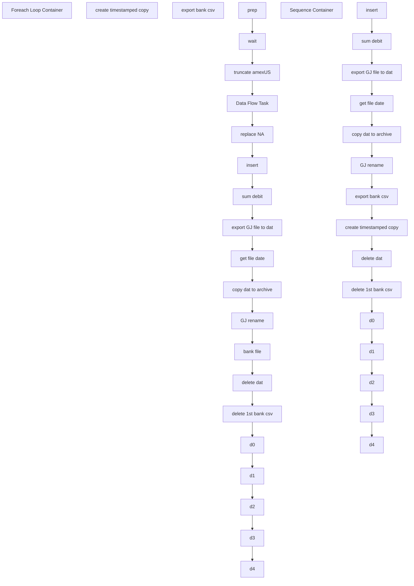

# SSIS Package: Package

**Project:** ERP_AmExETL  
**Folder:** ERP  
**Server:** STL-SSIS-P-01  

## Connection Managers

| Name | Type | Server | Catalog | Connection (sanitized) |
|---|---|---|---|---|
| amexUS | FLATFILE |  |  |  |
| amexUS.csv | FILE |  |  |  |
| amexUS1.csv | FILE |  |  |  |
| amexUS2.csv | FLATFILE |  |  |  |
| amexUS2.csv 1 | FILE |  |  |  |
| amexUS3.csv | FILE |  |  |  |
| amexUS4.csv | FILE |  |  |  |
| amexUSfinal.csv | FLATFILE |  |  |  |
| amexUSfinal.csv 1 | FLATFILE |  |  |  |
| bankAmex | FLATFILE |  |  |  |
| bankChase csv | FLATFILE |  |  |  |
| stl-dynsnc-p-01 | OLEDB | stl-dynsnc-p-01 | DBAUtility | Data Source=stl-dynsnc-p-01; Initial Catalog=DBAUtility; Provider=SQLNCLI11.1; Integrated Security=SSPI; Auto Translate=False |
| stl-ssis-p-01 | OLEDB | STL-SSIS-P-01 | IntegrationStaging | Data Source=STL-SSIS-P-01; Initial Catalog=IntegrationStaging; Provider=SQLNCLI11.1; Integrated Security=SSPI; Auto Translate=False |

## Control Flow Tasks

| Task | Type |
|---|---|
| Package | Package |
| Foreach Loop Container | FOREACHLOOP |
| bank file | ExecuteSQLTask |
| copy dat to archive | FileSystemTask |
| create timestamped copy | FileSystemTask |
| d0 | FileSystemTask |
| d1 | FileSystemTask |
| d2 | FileSystemTask |
| d3 | FileSystemTask |
| d4 | FileSystemTask |
| Data Flow Task | Pipeline |
| delete 1st bank csv | FileSystemTask |
| delete dat | FileSystemTask |
| export bank csv | Pipeline |
| export GJ file to dat | Pipeline |
| get file date | ExecuteSQLTask |
| GJ rename | FileSystemTask |
| insert | ExecuteSQLTask |
| prep | ExecuteSQLTask |
| replace NA | ExecuteSQLTask |
| sum debit | ExecuteSQLTask |
| truncate amexUS | ExecuteSQLTask |
| wait | ExecuteSQLTask |
| Sequence Container | SEQUENCE |
| copy dat to archive | FileSystemTask |
| create timestamped copy | FileSystemTask |
| d0 | FileSystemTask |
| d1 | FileSystemTask |
| d2 | FileSystemTask |
| d3 | FileSystemTask |
| d4 | FileSystemTask |
| delete 1st bank csv | FileSystemTask |
| delete dat | FileSystemTask |
| export bank csv | Pipeline |
| export GJ file to dat | Pipeline |
| get file date | ExecuteSQLTask |
| GJ rename | FileSystemTask |
| insert | ExecuteSQLTask |
| sum debit | ExecuteSQLTask |

## Control Flow Outline

```text
- Foreach Loop Container [FOREACHLOOP]
  - Data Flow Task [Pipeline]
  - GJ rename [FileSystemTask]
  - bank file [ExecuteSQLTask]
  - copy dat to archive [FileSystemTask]
  - create timestamped copy [FileSystemTask]
  - d0 [FileSystemTask]
  - d1 [FileSystemTask]
  - d2 [FileSystemTask]
  - d3 [FileSystemTask]
  - d4 [FileSystemTask]
  - delete 1st bank csv [FileSystemTask]
  - delete dat [FileSystemTask]
  - export GJ file to dat [Pipeline]
  - export bank csv [Pipeline]
  - get file date [ExecuteSQLTask]
  - insert [ExecuteSQLTask]
  - prep [ExecuteSQLTask]
  - replace NA [ExecuteSQLTask]
  - sum debit [ExecuteSQLTask]
  - truncate amexUS [ExecuteSQLTask]
  - wait [ExecuteSQLTask]
- Sequence Container [SEQUENCE]
  - GJ rename [FileSystemTask]
  - copy dat to archive [FileSystemTask]
  - create timestamped copy [FileSystemTask]
  - d0 [FileSystemTask]
  - d1 [FileSystemTask]
  - d2 [FileSystemTask]
  - d3 [FileSystemTask]
  - d4 [FileSystemTask]
  - delete 1st bank csv [FileSystemTask]
  - delete dat [FileSystemTask]
  - export GJ file to dat [Pipeline]
  - export bank csv [Pipeline]
  - get file date [ExecuteSQLTask]
  - insert [ExecuteSQLTask]
  - sum debit [ExecuteSQLTask]
```

## Architecture Diagram



## Variables

| Namespace | Name | Expression-bound |
|---|---|---|
| User | GJ_path | No |
| User | bankStatementFile | No |
| User | bankStatementPath | Yes |
| User | csv_copy | Yes |
| User | d365archiveFile | Yes |
| User | d365file | No |
| User | datDelete | No |
| User | extension | No |
| User | fileDate | No |
| User | finalGJfilename | Yes |
| User | varArchiveFolder | No |
| User | varBankStatementFolder | No |
| User | varSourceFolder | No |

### Expression-bound variable values

#### User::bankStatementPath

**Expression:**

```sql
@[User::varBankStatementFolder] +  @[User::bankStatementFile] +  @[User::extension]
```

**Evaluated value:**

```sql
\\stl-dynsnc-p-01\d$\oData\amex\bankStatementFiles\bankAmex.csv
```

#### User::csv_copy

**Expression:**

```sql
@[User::varBankStatementFolder] + @[User::bankStatementFile] + "_" + @[User::fileDate] + "_"+ (DT_WSTR, 4) year(getdate()) +  (DT_WSTR, 2) month(getdate()) +  (DT_WSTR, 2) day(getdate()) + RIGHT("0" + (DT_STR, 2, 1252)DATEPART("hh", GetDate()), 2) + RIGHT("0" + (DT_STR, 2, 1252)DATEPART("mi", GetDate()), 2) + RIGHT("0" + (DT_STR, 2, 1252)DATEPART("ss", GetDate()), 2) + @[User::extension]
```

**Evaluated value:**

```sql
\\stl-dynsnc-p-01\d$\oData\amex\bankStatementFiles\bankAmex__2024212113846.csv
```

#### User::d365archiveFile

**Expression:**

```sql
@[User::varArchiveFolder] + @[User::d365file]  + "_"+  @[User::fileDate] + "_"+ (DT_WSTR, 4) year(getdate()) +  (DT_WSTR, 2) month(getdate()) +  (DT_WSTR, 2) day(getdate()) + "_" + RIGHT("0" + (DT_STR, 2, 1252)DATEPART("hh", GetDate()), 2) + RIGHT("0" + (DT_STR, 2, 1252)DATEPART("mi", GetDate()), 2) + RIGHT("0" + (DT_STR, 2, 1252)DATEPART("ss", GetDate()), 2)  + @[User::extension]
```

**Evaluated value:**

```sql
\\stl-dynsnc-p-01\oData\amex\archive\amexUS2__2024212_113846.csv
```

#### User::finalGJfilename

**Expression:**

```sql
@[User::GJ_path] + "amexUS" + "_"+  @[User::fileDate] + "_"+ (DT_WSTR, 4) year(getdate()) +  (DT_WSTR, 2) month(getdate()) +  (DT_WSTR, 2) day(getdate()) + RIGHT("0" + (DT_STR, 2, 1252)DATEPART("hh", GetDate()), 2) + RIGHT("0" + (DT_STR, 2, 1252)DATEPART("mi", GetDate()), 2) + RIGHT("0" + (DT_STR, 2, 1252)DATEPART("ss", GetDate()), 2) + @[User::extension]
```

**Evaluated value:**

```sql
\\stl-dynsnc-p-01\d$\BABWIntegrations\GeneralJournal\prod\1100\amexUS__2024212113846.csv
```

## Execute SQL Tasks

### bank file

**Path:** `Package\Foreach Loop Container\bank file`  
**Connection:** stl-ssis-p-01 (STL-SSIS-P-01/IntegrationStaging)  

```sql
exec [dbo].[spAmex_Bank_Export] 
```

### get file date

**Path:** `Package\Foreach Loop Container\get file date`  
**Connection:** stl-ssis-p-01 (STL-SSIS-P-01/IntegrationStaging)  

```sql
select convert(varchar(10),dateadd(day, 1, cast(max(AmexDate) as date)), 112) as fileDate from [dbo].[babw_amexUS]
```

### insert

**Path:** `Package\Foreach Loop Container\insert`  
**Connection:** stl-ssis-p-01 (STL-SSIS-P-01/IntegrationStaging)  

```sql
declare @totalCredits money
declare @totalDebits money
declare @discountAmount money
declare @feesIncentive money
declare @totalDebitsFees money

set @totalDebits = (select sum(cast([Credits] as money)) from [dbo].[babw_amexUS]   where [SubmissionAmount] like '%(%')

set @totalCredits = (select sum(convert(float, REPLACE(REPLACE(REPLACE(REPLACE([TotalCharges],'$',''),',',''),'(',''),')',''), 10)) - 
sum(convert(float, REPLACE(REPLACE(REPLACE(REPLACE([Credits],'$',''),',',''),'(',''),')',''), 10)) from [dbo].[babw_amexUS])


set @discountAmount =
(select isnull(sum(convert(money, REPLACE(REPLACE(REPLACE(REPLACE([DiscountAmount],'$',''),',',''),'(',''),')',''), 10))*-1,0) from [dbo].[babw_amexUS] where [DiscountAmount] like '%(%')
+
(select isnull(sum(convert(money, REPLACE(REPLACE(REPLACE(REPLACE([DiscountAmount],'$',''),',',''),'(',''),')',''), 10)),0) from [dbo].[babw_amexUS] where [DiscountAmount] not like '%(%')

set @feesIncentive = 
(select isnull(sum(convert(money, REPLACE(REPLACE(REPLACE(REPLACE([FeesIncentives],'$',''),',',''),'(',''),')',''), 10))*-1,0) from [dbo].[babw_amexUS] where [FeesIncentives] like '%(%')
+
(select isnull(sum(convert(money, REPLACE(REPLACE(REPLACE(REPLACE([FeesIncentives],'$',''),',',''),'(',''),')',''), 10)),0) from [dbo].[babw_amexUS] where [FeesIncentives] not like '%(%')

set @totalDebits = @discountAmount + @feesIncentive
set @totalCredits = @totalCredits - @totalDebits


INSERT INTO [dbo].[babw_amexUSd365]([JOURNALBATCHNUMBER],[LINENUMBER],[ACCOUNTDISPLAYVALUE],[ACCOUNTTYPE],[BANKTRANSTYPE],[CREDITAMOUNT],[CURRENCYCODE],[DEBITAMOUNT]
,[DEFAULTDIMENSIONDISPLAYVALUE],[DESCRIPTION],[ISPOSTED],[JOURNALNAME],[PAYMENTMETHOD],[PAYMENTREFERENCE],[POSTINGLAYER],[TEXT],[TRANSDATE],[VOUCHER])
 select 'GLNUM001' as JOURNALBATCHNUMBER, '' AS LINENUMBER, 'AmExClear' as 'ACCOUNTDISPLAYVALUE', 'Bank' as ACCOUNTTYPE,'AMEX' as BANKTRANSTYPE,
'CREDITAMOUNT' = CASE WHEN [TotalCharges] not like '%(%' THEN convert(float, REPLACE(REPLACE(REPLACE(REPLACE([TotalCharges],'$',''),',',''),'(',''),')',''),10) 
- convert(float, REPLACE(REPLACE(REPLACE(REPLACE([Credits],'$',''),',',''),'(',''),')',''),10) ELSE '0' END, 
'USD' as CURRENCYCODE,
'DEBITAMOUNT' = 0,

 'DEFAULTDIMENSIONDISPLAYVALUE' = CASE WHEN [SubmittingLocID] = 'N/A' THEN '9999-9999-10--'
WHEN [SubmittingLocID]+1000 in (1470,1990,1991,1999) THEN '9999-9999-10--'
WHEN [SubmittingLocID]+1000 in (1609) THEN '1307-9999-10--'
WHEN [SubmittingLocID]+1000 in (1013) THEN '1013-9999-11--'
WHEN [SubmittingLocID]+1000 between 1800 and 1899 THEN convert(varchar, [SubmittingLocID]+1000) + '-9999-12--' 
ELSE convert(varchar, [SubmittingLocID]+1000) + '-9999-10--' END,

 'AMEXUSMERCH' + (select convert(varchar(10),dateadd(day, 1, cast(max(AmexDate) as date)), 112) from [dbo].[babw_amexUS]) as 'DESCRIPTION',
'Yes' as 'ISPOSTED','GL-CC' as 'JOURNALNAME',
'AMEX' as 'PAYMENTMETHOD',
'PAYMENTREFERENCE' = CASE WHEN [SubmittingLocID] = 'N/A' THEN convert(bigint,[SubmittingMerchant])
WHEN [SubmittingLocID] = 609 THEN 1307 
ELSE [SubmittingLocID]+1000 END,
'Current' as 'POSTINGLAYER',
'AMEX' + convert(varchar(10),cast([TranDate] as date),112) as 'TEXT',
(select convert(varchar(10),dateadd(day, 1, cast(max(AmexDate) as date)), 101) as fileDate from [dbo].[babw_amexUS]) as 'TRANSDATE',
  'AMEX' + (select convert(varchar(10),dateadd(day, 1, cast(max(AmexDate) as date)), 112) as fileDate from [dbo].[babw_amexUS]) as 'VOUCHER'
from [dbo].[babw_amexUS] 


--order by [SubmittingLocID] asc

union all 

select 'GLNUM001' as JOURNALBATCHNUMBER,'' AS LINENUMBER,
 'ACCOUNTDISPLAYVALUE' = CASE WHEN [SubmittingLocID] = 'N/A' THEN '601000-9999-9999-10--'
WHEN [SubmittingLocID]+1000 in (1470,1990,1991,1999) THEN '601000-9999-9999-10--'
WHEN [SubmittingLocID]+1000 in (1609) THEN '601000-1307-9999-10--'
WHEN [SubmittingLocID]+1000 in (1013) THEN '601000-1013-9999-11--'
WHEN [SubmittingLocID]+1000 between 1800 and 1899 THEN '601000-' + convert(varchar, [SubmittingLocID]+1000) + '-9999-12--'  
ELSE '601000-' + convert(varchar, [SubmittingLocID]+1000) + '-9999-10--' END,
 'Ledger' as ACCOUNTTYPE,'' as BANKTRANSTYPE,
 'CREDITAMOUNT' = convert(varchar, 0),
'USD' as CURRENCYCODE,
  'DEBITAMOUNT' = CASE WHEN [DiscountAmount] like '%(%' and [FeesIncentives] like '%(%' THEN
 cast(convert(float, REPLACE(REPLACE(REPLACE(REPLACE([DiscountAmount],'$',''),',',''),'(',''),')',''),10)*-1
 + convert(float, REPLACE(REPLACE(REPLACE(REPLACE([FeesIncentives],'$',''),',',''),'(',''),')',''),10)*-1 as decimal (18,2))
    WHEN [DiscountAmount] not like '%(%' and [FeesIncentives] like '%(%' THEN
    cast(convert(float, REPLACE(REPLACE(REPLACE(REPLACE([DiscountAmount],'$',''),',',''),'(',''),')',''),10)
 + convert(float, REPLACE(REPLACE(REPLACE(REPLACE([FeesIncentives],'$',''),',',''),'(',''),')',''),10)*-1 as decimal (18,2))
    WHEN [DiscountAmount] like '%(%' and [FeesIncentives] not like '%(%' THEN
    cast(convert(float, REPLACE(REPLACE(REPLACE(REPLACE([DiscountAmount],'$',''),',',''),'(',''),')',''),10)*-1
 + convert(float, REPLACE(REPLACE(REPLACE(REPLACE([FeesIncentives],'$',''),',',''),'(',''),')',''),10) as decimal (18,2))
    ELSE
    cast(convert(float, REPLACE(REPLACE(REPLACE(REPLACE([DiscountAmount],'$',''),',',''),'(',''),')',''),10)
 + convert(float, REPLACE(REPLACE(REPLACE(REPLACE([FeesIncentives],'$',''),',',''),'(',''),')',''),10) as decimal (18,2)) END,
'' as 'DEFAULTDIMENSIONDISPLAYVALUE',
 'AMEXUSMERCH' + (select convert(varchar(10),dateadd(day, 1, cast(max(AmexDate) as date)), 112) from [dbo].[babw_amexUS]) as 'DESCRIPTION',
'Yes' as 'ISPOSTED','GL-CC' as 'JOURNALNAME',
'AMEXFEES' as 'PAYMENTMETHOD',
'PAYMENTREFERENCE' = CASE WHEN [SubmittingLocID] = 'N/A' THEN convert(bigint,[SubmittingMerchant])
WHEN [SubmittingLocID] = 609 THEN 1307 
ELSE [SubmittingLocID]+1000 END,
'Current' as 'POSTINGLAYER',
'AMEXFEES' + convert(varchar(10),cast([TranDate] as date),112) as 'TEXT',
(select convert(varchar(10),dateadd(day, 1, cast(max(AmexDate) as date)), 101) as fileDate from [dbo].[babw_amexUS]) as 'TRANSDATE',
  'AMEX' + (select convert(varchar(10),dateadd(day, 1, cast(max(AmexDate) as date)), 112) as fileDate from [dbo].[babw_amexUS]) as 'VOUCHER'
from [dbo].[babw_amexUS] 
where convert(float, REPLACE(REPLACE(REPLACE(REPLACE([DiscountAmount],'$',''),',',''),'(',''),')',''),10) 
+ convert(float, REPLACE(REPLACE(REPLACE(REPLACE([FeesIncentives],'$',''),',',''),'(',''),')',''),10) > 0

union all 

select top 1 'GLNUM001' as JOURNALBATCHNUMBER, '' AS LINENUMBER,'PNC_AMEX' as 'ACCOUNTDISPLAYVALUE',
 'Bank' as ACCOUNTTYPE,'AMEX' as BANKTRANSTYPE,
convert(varchar, 0) as 'CREDITAMOUNT', 'USD' as CURRENCYCODE, convert(varchar, @totalCredits) as 'DEBITAMOUNT',   
'9999-9999-10--' as DEFAULTDIMENSIONDISPLAYVALUE,
'AMEXUSMERCH' +  (select convert(varchar(10),dateadd(day, 1, cast(max(AmexDate) as date)), 112) from [dbo].[babw_amexUS]) as 'DESCRIPTION',
'Yes' as 'ISPOSTED','GL-CC' as 'JOURNALNAME',
'SUMMARY' as 'PAYMENTMETHOD',9999 as 'PAYMENTREFERENCE',
'Current' as 'POSTINGLAYER',
 'AMEX' + (select convert(varchar(10),dateadd(day, 1, cast(max(AmexDate) as date)), 112) as fileDate from [dbo].[babw_amexUS]) as 'TEXT',
(select convert(varchar(10),dateadd(day, 1, cast(max(AmexDate) as date)), 101) from [dbo].[babw_amexUS]) as 'TRANSDATE',
'AMEX' + (select convert(varchar(10),dateadd(day, 1, cast(max(AmexDate) as date)), 112) as fileDate from [dbo].[babw_amexUS]) as 'VOUCHER'
from [dbo].[babw_amexUS]


```

### prep

**Path:** `Package\Foreach Loop Container\prep`  
**Connection:** stl-dynsnc-p-01 (stl-dynsnc-p-01/DBAUtility)  

```sql
EXEC master..xp_CMDShell "D:\oData\amex\aPrep.bat"

```

### replace NA

**Path:** `Package\Foreach Loop Container\replace NA`  
**Connection:** stl-ssis-p-01 (STL-SSIS-P-01/IntegrationStaging)  

```sql
update [dbo].[babw_amexUS] set [SubmittingLocID] = '999' where [SubmittingLocID] = 'N/A'
```

### sum debit

**Path:** `Package\Foreach Loop Container\sum debit`  
**Connection:** stl-ssis-p-01 (STL-SSIS-P-01/IntegrationStaging)  

```sql
update [dbo].[babw_amexUSd365] set DEBITAMOUNT = 
(select sum(cast(CREDITAMOUNT as money))-sum(cast(DEBITAMOUNT as money)) from [dbo].[babw_amexUSd365] where ACCOUNTDISPLAYVALUE <> 'PNC_AMEX')
where ACCOUNTDISPLAYVALUE = 'PNC_AMEX'
```

### truncate amexUS

**Path:** `Package\Foreach Loop Container\truncate amexUS`  
**Connection:** stl-ssis-p-01 (STL-SSIS-P-01/IntegrationStaging)  

```sql
truncate table [dbo].[babw_amexUS]
truncate table [dbo].[babw_amexUSd365]
```

### wait

**Path:** `Package\Foreach Loop Container\wait`  
**Connection:** stl-dynsnc-p-01 (stl-dynsnc-p-01/DBAUtility)  

```sql
WAITFOR DELAY '00:00:05'

```

### get file date

**Path:** `Package\Sequence Container\get file date`  
**Connection:** stl-ssis-p-01 (STL-SSIS-P-01/IntegrationStaging)  

```sql
select convert(varchar(10),dateadd(day, 1, cast(max(AmexDate) as date)), 112) as fileDate from [dbo].[babw_amexUS]
```

### insert

**Path:** `Package\Sequence Container\insert`  
**Connection:** stl-ssis-p-01 (STL-SSIS-P-01/IntegrationStaging)  

```sql
declare @totalCredits money
declare @totalDebits money
declare @discountAmount money
declare @feesIncentive money
declare @totalDebitsFees money

set @totalDebits = (select sum(cast([Credits] as money)) from [dbo].[babw_amexUS]   where [SubmissionAmount] like '%(%')

set @totalCredits = (select sum(convert(float, REPLACE(REPLACE(REPLACE(REPLACE([TotalCharges],'$',''),',',''),'(',''),')',''), 10)) - 
sum(convert(float, REPLACE(REPLACE(REPLACE(REPLACE([Credits],'$',''),',',''),'(',''),')',''), 10)) from [dbo].[babw_amexUS])


set @discountAmount =
(select isnull(sum(convert(money, REPLACE(REPLACE(REPLACE(REPLACE([DiscountAmount],'$',''),',',''),'(',''),')',''), 10))*-1,0) from [dbo].[babw_amexUS] where [DiscountAmount] like '%(%')
+
(select isnull(sum(convert(money, REPLACE(REPLACE(REPLACE(REPLACE([DiscountAmount],'$',''),',',''),'(',''),')',''), 10)),0) from [dbo].[babw_amexUS] where [DiscountAmount] not like '%(%')

set @feesIncentive = 
(select isnull(sum(convert(money, REPLACE(REPLACE(REPLACE(REPLACE([FeesIncentives],'$',''),',',''),'(',''),')',''), 10))*-1,0) from [dbo].[babw_amexUS] where [FeesIncentives] like '%(%')
+
(select isnull(sum(convert(money, REPLACE(REPLACE(REPLACE(REPLACE([FeesIncentives],'$',''),',',''),'(',''),')',''), 10)),0) from [dbo].[babw_amexUS] where [FeesIncentives] not like '%(%')

set @totalDebits = @discountAmount + @feesIncentive
set @totalCredits = @totalCredits - @totalDebits


INSERT INTO [dbo].[babw_amexUSd365]([JOURNALBATCHNUMBER],[LINENUMBER],[ACCOUNTDISPLAYVALUE],[ACCOUNTTYPE],[BANKTRANSTYPE],[CREDITAMOUNT],[CURRENCYCODE],[DEBITAMOUNT]
,[DEFAULTDIMENSIONDISPLAYVALUE],[DESCRIPTION],[ISPOSTED],[JOURNALNAME],[PAYMENTMETHOD],[PAYMENTREFERENCE],[POSTINGLAYER],[TEXT],[TRANSDATE],[VOUCHER])
 select 'GLNUM001' as JOURNALBATCHNUMBER, '' AS LINENUMBER, 'AmExClear' as 'ACCOUNTDISPLAYVALUE', 'Bank' as ACCOUNTTYPE,'AMEX' as BANKTRANSTYPE,
'CREDITAMOUNT' = CASE WHEN [TotalCharges] not like '%(%' THEN convert(float, REPLACE(REPLACE(REPLACE(REPLACE([TotalCharges],'$',''),',',''),'(',''),')',''),10) 
- convert(float, REPLACE(REPLACE(REPLACE(REPLACE([Credits],'$',''),',',''),'(',''),')',''),10) ELSE '0' END, 
'USD' as CURRENCYCODE,
'DEBITAMOUNT' = 0,

 'DEFAULTDIMENSIONDISPLAYVALUE' = CASE WHEN [SubmittingLocID] = 'N/A' THEN '9999-9999-10--'
WHEN [SubmittingLocID]+1000 in (1470,1990,1991,1999) THEN '9999-9999-10--'
WHEN [SubmittingLocID]+1000 in (1609) THEN '1307-9999-10--'
WHEN [SubmittingLocID]+1000 in (1013) THEN '1013-9999-11--'
ELSE convert(varchar, [SubmittingLocID]+1000) + '-9999-10--' END,

 'AMEXUSMERCH' + (select convert(varchar(10),dateadd(day, 1, cast(max(AmexDate) as date)), 112) from [dbo].[babw_amexUS]) as 'DESCRIPTION',
'Yes' as 'ISPOSTED','GL-CC' as 'JOURNALNAME',
'AMEX' as 'PAYMENTMETHOD',
'PAYMENTREFERENCE' = CASE WHEN [SubmittingLocID] = 'N/A' THEN convert(bigint,[SubmittingMerchant])
WHEN [SubmittingLocID] = 609 THEN 1307 
ELSE [SubmittingLocID]+1000 END,
'Current' as 'POSTINGLAYER',
'AMEX' + convert(varchar(10),cast([TranDate] as date),112) as 'TEXT',
(select convert(varchar(10),dateadd(day, 1, cast(max(AmexDate) as date)), 101) as fileDate from [dbo].[babw_amexUS]) as 'TRANSDATE',
  'AMEX' + (select convert(varchar(10),dateadd(day, 1, cast(max(AmexDate) as date)), 112) as fileDate from [dbo].[babw_amexUS]) as 'VOUCHER'
from [dbo].[babw_amexUS] 


union all 

select 'GLNUM001' as JOURNALBATCHNUMBER,'' AS LINENUMBER,
 'ACCOUNTDISPLAYVALUE' = CASE WHEN [SubmittingLocID] = 'N/A' THEN '601000-9999-9999-10--'
WHEN [SubmittingLocID]+1000 in (1470,1990,1991,1999) THEN '601000-9999-9999-10--'
WHEN [SubmittingLocID]+1000 in (1609) THEN '601000-1307-9999-10--'
WHEN [SubmittingLocID]+1000 in (1013) THEN '601000-1013-9999-11--'
ELSE '601000-' + convert(varchar, [SubmittingLocID]+1000) + '-9999-10--' END,
 'Ledger' as ACCOUNTTYPE,'' as BANKTRANSTYPE,
 'CREDITAMOUNT' = convert(varchar, 0),
'USD' as CURRENCYCODE,
  'DEBITAMOUNT' = CASE WHEN [DiscountAmount] like '%(%' and [FeesIncentives] like '%(%' THEN
 cast(convert(float, REPLACE(REPLACE(REPLACE(REPLACE([DiscountAmount],'$',''),',',''),'(',''),')',''),10)*-1
 + convert(float, REPLACE(REPLACE(REPLACE(REPLACE([FeesIncentives],'$',''),',',''),'(',''),')',''),10)*-1 as decimal (18,2))
    WHEN [DiscountAmount] not like '%(%' and [FeesIncentives] like '%(%' THEN
    cast(convert(float, REPLACE(REPLACE(REPLACE(REPLACE([DiscountAmount],'$',''),',',''),'(',''),')',''),10)
 + convert(float, REPLACE(REPLACE(REPLACE(REPLACE([FeesIncentives],'$',''),',',''),'(',''),')',''),10)*-1 as decimal (18,2))
    WHEN [DiscountAmount] like '%(%' and [FeesIncentives] not like '%(%' THEN
    cast(convert(float, REPLACE(REPLACE(REPLACE(REPLACE([DiscountAmount],'$',''),',',''),'(',''),')',''),10)*-1
 + convert(float, REPLACE(REPLACE(REPLACE(REPLACE([FeesIncentives],'$',''),',',''),'(',''),')',''),10) as decimal (18,2))
    ELSE
    cast(convert(float, REPLACE(REPLACE(REPLACE(REPLACE([DiscountAmount],'$',''),',',''),'(',''),')',''),10)
 + convert(float, REPLACE(REPLACE(REPLACE(REPLACE([FeesIncentives],'$',''),',',''),'(',''),')',''),10) as decimal (18,2)) END,
'' as 'DEFAULTDIMENSIONDISPLAYVALUE',
 'AMEXUSMERCH' + (select convert(varchar(10),dateadd(day, 1, cast(max(AmexDate) as date)), 112) from [dbo].[babw_amexUS]) as 'DESCRIPTION',
'Yes' as 'ISPOSTED','GL-CC' as 'JOURNALNAME',
'AMEXFEES' as 'PAYMENTMETHOD',
'PAYMENTREFERENCE' = CASE WHEN [SubmittingLocID] = 'N/A' THEN convert(bigint,[SubmittingMerchant])
WHEN [SubmittingLocID] = 609 THEN 1307 
ELSE [SubmittingLocID]+1000 END,
'Current' as 'POSTINGLAYER',
'AMEXFEES' + convert(varchar(10),cast([TranDate] as date),112) as 'TEXT',
(select convert(varchar(10),dateadd(day, 1, cast(max(AmexDate) as date)), 101) as fileDate from [dbo].[babw_amexUS]) as 'TRANSDATE',
  'AMEX' + (select convert(varchar(10),dateadd(day, 1, cast(max(AmexDate) as date)), 112) as fileDate from [dbo].[babw_amexUS]) as 'VOUCHER'
from [dbo].[babw_amexUS] 
where convert(float, REPLACE(REPLACE(REPLACE(REPLACE([DiscountAmount],'$',''),',',''),'(',''),')',''),10) 
+ convert(float, REPLACE(REPLACE(REPLACE(REPLACE([FeesIncentives],'$',''),',',''),'(',''),')',''),10) > 0

union all 

select top 1 'GLNUM001' as JOURNALBATCHNUMBER, '' AS LINENUMBER,'PNC_AMEX' as 'ACCOUNTDISPLAYVALUE',
 'Bank' as ACCOUNTTYPE,'AMEX' as BANKTRANSTYPE,
convert(varchar, 0) as 'CREDITAMOUNT', 'USD' as CURRENCYCODE, convert(varchar, @totalCredits) as 'DEBITAMOUNT',   
'9999-9999-10--' as DEFAULTDIMENSIONDISPLAYVALUE,
'AMEXUSMERCH' +  (select convert(varchar(10),dateadd(day, 1, cast(max(AmexDate) as date)), 112) from [dbo].[babw_amexUS]) as 'DESCRIPTION',
'Yes' as 'ISPOSTED','GL-CC' as 'JOURNALNAME',
'SUMMARY' as 'PAYMENTMETHOD',9999 as 'PAYMENTREFERENCE',
'Current' as 'POSTINGLAYER',
 'AMEX' + (select convert(varchar(10),dateadd(day, 1, cast(max(AmexDate) as date)), 112) as fileDate from [dbo].[babw_amexUS]) as 'TEXT',
(select convert(varchar(10),dateadd(day, 1, cast(max(AmexDate) as date)), 101) from [dbo].[babw_amexUS]) as 'TRANSDATE',
'AMEX' + (select convert(varchar(10),dateadd(day, 1, cast(max(AmexDate) as date)), 112) as fileDate from [dbo].[babw_amexUS]) as 'VOUCHER'
from [dbo].[babw_amexUS]
```

### sum debit

**Path:** `Package\Sequence Container\sum debit`  
**Connection:** stl-ssis-p-01 (STL-SSIS-P-01/IntegrationStaging)  

```sql
update [dbo].[babw_amexUSd365] set DEBITAMOUNT = 
(select sum(cast(CREDITAMOUNT as money))-sum(cast(DEBITAMOUNT as money)) from [dbo].[babw_amexUSd365] where ACCOUNTDISPLAYVALUE <> 'PNC_AMEX')
where ACCOUNTDISPLAYVALUE = 'PNC_AMEX'
```

## Data Flow: Sources

| Component | Source Object | Type | Data Flow Task | Connection | SQL Kind |
|---|---|---|---|---|---|
| Flat File Source |  | FlatFileSource | Data Flow Task | amexUS |  |
| OLE DB Source |  | OLEDBSource | export bank csv | stl-ssis-p-01 | SqlCommand |
| OLE DB Source |  | OLEDBSource | export GJ file to dat | stl-ssis-p-01 | SqlCommand |
| OLE DB Source |  | OLEDBSource | export bank csv | stl-ssis-p-01 | SqlCommand |
| OLE DB Source |  | OLEDBSource | export GJ file to dat | stl-ssis-p-01 | SqlCommand |

#### OLE DB Source — SqlCommand

```sql
select (select convert(varchar(10),dateadd(day, 1, cast(max(AmexDate) as date)), 101) from [dbo].[babw_amexUS]) as 'As Of', 'USD' as 'Currency', 'ABA' as 'BankID Type','123456789' as 'BankID', '1100AMEXCLEAR' as 'Account','Credits' as 'Data Type',
'399' as 'BAI Code','Deposit' as 'Description',convert(float, REPLACE(REPLACE(REPLACE(REPLACE([SubmissionAmount],'$',''),',',''),'(',''),')',''), 10) as 'Amount','' as 'Balance/Value Date',
'Customer Reference' = CASE WHEN [SubmittingLocID]+1000 = 1609 THEN '1307'
ELSE [SubmittingLocID]+1000 END,
 '' as 'Immediate Availability', '' as '1 Day Float',
'' as '2 + DayFloat',
'Bank Reference' = CASE WHEN [SubmittingLocID]+1000 = 1609 THEN
concat((select convert(varchar(10),dateadd(day, 1, cast(max(AmexDate) as date)), 112) from [dbo].[babw_amexUS]), cast(1307 as varchar))
ELSE concat((select convert(varchar(10),dateadd(day, 1, cast(max(AmexDate) as date)), 112) from [dbo].[babw_amexUS]), cast([SubmittingLocID]+1000 as varchar)) END,
'' as '# of Items', 
'Text' =CASE WHEN [SubmittingLocID]+1000 = 1609 THEN
concat((select convert(varchar(10),dateadd(day, 1, cast(max(AmexDate) as date)), 112) from [dbo].[babw_amexUS]), cast(1307 as varchar))
ELSE concat((select convert(varchar(10),dateadd(day, 1, cast(max(AmexDate) as date)), 112) from [dbo].[babw_amexUS]), cast([SubmittingLocID]+1000 as varchar)) END
from [dbo].[babw_amexUS] where [SubmissionAmount] not like '%(%' 
and convert(float, REPLACE(REPLACE(REPLACE(REPLACE([SubmissionAmount],'$',''),',',''),'(',''),')',''), 10) <> 0

union all

select (select convert(varchar(10),dateadd(day, 1, cast(max(AmexDate) as date)), 101) from [dbo].[babw_amexUS]) as 'As Of', 'USD' as 'Currency', 'ABA' as 'BankID Type','123456789' as 'BankID', '1100AMEXCLEAR' as 'Account','Debits' as 'Data Type',
'699' as 'BAI Code','Disbursement' as 'Description',sum(convert(float, REPLACE(REPLACE(REPLACE(REPLACE([SubmissionAmount],'$',''),',',''),'(',''),')',''), 10)) as 'Amount','' as 'Balance/Value Date', '9999' as 'Customer Reference','' as 'Immediate Availability', '' as '1 Day Float',
'' as '2 + DayFloat',(select convert(varchar(10),dateadd(day, 1, cast(max(AmexDate) as date)), 112) from [dbo].[babw_amexUS]) + '9999' as 'Bank Reference','' as '# of Items', 
(select convert(varchar(10),dateadd(day, 1, cast(max(AmexDate) as date)), 112) from [dbo].[babw_amexUS]) + '9999' as 'Text'
from [dbo].[babw_amexUS]  where [SubmissionAmount] not like '%(%'
```

#### OLE DB Source — SqlCommand

```sql
SELECT [JOURNALBATCHNUMBER],ROW_NUMBER() OVER(ORDER BY [JOURNALBATCHNUMBER] ASC) AS LINENUMBER,
[ACCOUNTDISPLAYVALUE],[ACCOUNTTYPE],[BANKTRANSTYPE],[CREDITAMOUNT],[CURRENCYCODE],[DEBITAMOUNT],[DEFAULTDIMENSIONDISPLAYVALUE],[DESCRIPTION],[ISPOSTED]
,[JOURNALNAME],[PAYMENTMETHOD],[PAYMENTREFERENCE],[POSTINGLAYER],[TEXT],[TRANSDATE],[VOUCHER] FROM [dbo].[babw_amexUSd365]
```

## Data Flow: Destinations

| Component | Target Table | Type | Data Flow Task | Connection | SQL Kind |
|---|---|---|---|---|---|
| OLE DB Destination |  | OLEDBDestination | Data Flow Task | stl-ssis-p-01 |  |
| Flat File Destination |  | FlatFileDestination | export bank csv | bankAmex |  |
| Flat File Destination |  | FlatFileDestination | export GJ file to dat | amexUSfinal.csv |  |
| Flat File Destination |  | FlatFileDestination | export bank csv | bankAmex |  |
| Flat File Destination |  | FlatFileDestination | export GJ file to dat | amexUSfinal.csv |  |
