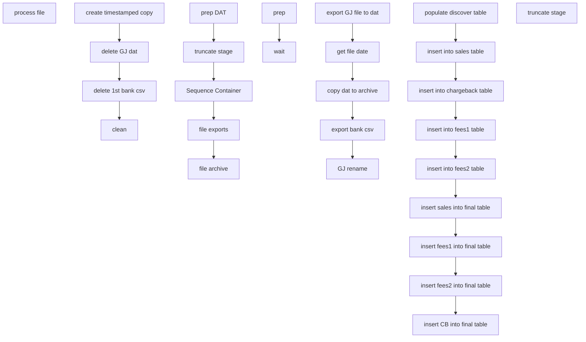

# SSIS Package: Package

**Project:** ERP_DiscoverETL  
**Folder:** ERP  
**Server:** STL-SSIS-P-01  

## Connection Managers

| Name | Type | Server | Catalog | Connection (sanitized) |
|---|---|---|---|---|
| Discover.dat | FILE |  |  |  |
| STL-SSIS-P-01 | OLEDB | STL-SSIS-P-01 | IntegrationStaging | Data Source=STL-SSIS-P-01; Initial Catalog=IntegrationStaging; Provider=SQLNCLI11.1; Integrated Security=SSPI; Auto Translate=False |
| bankDiscover csv | FLATFILE |  |  |  |
| discover csv | FLATFILE |  |  |  |
| discover csv 1 | FLATFILE |  |  |  |
| discover.dat | FLATFILE |  |  |  |
| stl-dynsnc-p-01 | OLEDB | stl-dynsnc-p-01 | DBAUtility | Data Source=stl-dynsnc-p-01; Initial Catalog=DBAUtility; Provider=SQLNCLI11.1; Integrated Security=SSPI; Auto Translate=False |

## Control Flow Tasks

| Task | Type |
|---|---|
| Package | Package |
| process file | FOREACHLOOP |
| file archive | SEQUENCE |
| clean | ExecuteSQLTask |
| create timestamped copy | FileSystemTask |
| delete 1st bank csv | FileSystemTask |
| delete GJ dat | FileSystemTask |
| file exports | SEQUENCE |
| copy dat to archive | FileSystemTask |
| export bank csv | Pipeline |
| export GJ file to dat | Pipeline |
| get file date | ExecuteSQLTask |
| GJ rename | FileSystemTask |
| prep DAT | SEQUENCE |
| prep | ExecuteSQLTask |
| wait | ExecuteSQLTask |
| Sequence Container | SEQUENCE |
| insert CB into final table | ExecuteSQLTask |
| insert fees1 into final table | ExecuteSQLTask |
| insert fees2 into final table | ExecuteSQLTask |
| insert into chargeback table | ExecuteSQLTask |
| insert into fees1 table | ExecuteSQLTask |
| insert into fees2 table | ExecuteSQLTask |
| insert into sales table | ExecuteSQLTask |
| insert sales into final table | ExecuteSQLTask |
| populate discover table | Pipeline |
| truncate stage | SEQUENCE |
| truncate stage | ExecuteSQLTask |

## Control Flow Outline

```text
- process file [FOREACHLOOP]
  - Sequence Container [SEQUENCE]
    - insert CB into final table [ExecuteSQLTask]
    - insert fees1 into final table [ExecuteSQLTask]
    - insert fees2 into final table [ExecuteSQLTask]
    - insert into chargeback table [ExecuteSQLTask]
    - insert into fees1 table [ExecuteSQLTask]
    - insert into fees2 table [ExecuteSQLTask]
    - insert into sales table [ExecuteSQLTask]
    - insert sales into final table [ExecuteSQLTask]
    - populate discover table [Pipeline]
  - file archive [SEQUENCE]
    - clean [ExecuteSQLTask]
    - create timestamped copy [FileSystemTask]
    - delete 1st bank csv [FileSystemTask]
    - delete GJ dat [FileSystemTask]
  - file exports [SEQUENCE]
    - GJ rename [FileSystemTask]
    - copy dat to archive [FileSystemTask]
    - export GJ file to dat [Pipeline]
    - export bank csv [Pipeline]
    - get file date [ExecuteSQLTask]
  - prep DAT [SEQUENCE]
    - prep [ExecuteSQLTask]
    - wait [ExecuteSQLTask]
  - truncate stage [SEQUENCE]
    - truncate stage [ExecuteSQLTask]
```

## Architecture Diagram



## Variables

| Namespace | Name | Expression-bound |
|---|---|---|
| User | GJ_path | No |
| User | bankStatementFile | No |
| User | csv_copy | Yes |
| User | d365archiveFile | Yes |
| User | d365file | No |
| User | datDelete | No |
| User | extension | No |
| User | extension2 | No |
| User | fileDate | No |
| User | finalGJfilename | Yes |
| User | newFile | Yes |
| User | varArchiveFolder | No |
| User | varBankStatementFolder | No |
| User | varBankStatementPath | Yes |
| User | varBankStatementTemplateFolder | No |

### Expression-bound variable values

#### User::csv_copy

**Expression:**

```sql
@[User::varBankStatementFolder] + @[User::bankStatementFile] + "_" + @[User::fileDate] + "_"+ (DT_WSTR, 4) year(getdate()) +  (DT_WSTR, 2) month(getdate()) +  (DT_WSTR, 2) day(getdate()) + RIGHT("0" + (DT_STR, 2, 1252)DATEPART("hh", GetDate()), 2) + RIGHT("0" + (DT_STR, 2, 1252)DATEPART("mi", GetDate()), 2) + RIGHT("0" + (DT_STR, 2, 1252)DATEPART("ss", GetDate()), 2) + @[User::extension]
```

**Evaluated value:**

```sql
\\stl-dynsnc-p-01\d$\oData\discover\bankStatementFiles\bankDiscover__2021426201024.csv
```

#### User::d365archiveFile

**Expression:**

```sql
@[User::varArchiveFolder] + @[User::d365file] + "_"+ (DT_WSTR, 4) year(getdate()) +  (DT_WSTR, 2) month(getdate()) +  (DT_WSTR, 2) day(getdate()) + "_" + RIGHT("0" + (DT_STR, 2, 1252)DATEPART("hh", GetDate()), 2) + RIGHT("0" + (DT_STR, 2, 1252)DATEPART("mi", GetDate()), 2) + RIGHT("0" + (DT_STR, 2, 1252)DATEPART("ss", GetDate()), 2) + @[User::extension]
```

**Evaluated value:**

```sql
\\stl-dynsnc-p-01\d$\oData\discover\archive\discover_2021426_201024.csv
```

#### User::finalGJfilename

**Expression:**

```sql
@[User::GJ_path] + "discover" + "_"+  @[User::fileDate] + "_"+ (DT_WSTR, 4) year(getdate()) +  (DT_WSTR, 2) month(getdate()) +  (DT_WSTR, 2) day(getdate()) + RIGHT("0" + (DT_STR, 2, 1252)DATEPART("hh", GetDate()), 2) + RIGHT("0" + (DT_STR, 2, 1252)DATEPART("mi", GetDate()), 2) + RIGHT("0" + (DT_STR, 2, 1252)DATEPART("ss", GetDate()), 2) + @[User::extension]
```

**Evaluated value:**

```sql
\\stl-dynsnc-p-01\d$\BABWIntegrations\GeneralJournal\prod\1100\discover__2021426201024.csv
```

#### User::newFile

**Expression:**

```sql
@[User::varBankStatementTemplateFolder] + @[User::bankStatementFile] +  @[User::extension2]
```

**Evaluated value:**

```sql
\\stl-dynsnc-p-01\d$\oData\discover\bankStatementFiles\template\bankDiscover.xlsx
```

#### User::varBankStatementPath

**Expression:**

```sql
@[User::varBankStatementFolder] +  @[User::bankStatementFile] +  @[User::extension]
```

**Evaluated value:**

```sql
\\stl-dynsnc-p-01\d$\oData\discover\bankStatementFiles\bankDiscover.csv
```

## Execute SQL Tasks

### insert CB into final table

**Path:** `Package\process file\Sequence Container\insert CB into final table`  
**Connection:** STL-SSIS-P-01 (STL-SSIS-P-01/IntegrationStaging)  

```sql
INSERT INTO [dbo].[babw_discoverFinal] ([MID],[store],[date],[credit],[debit],[trans_type]) 
select '544444' as 'MID', '1013' as 'store', substring(cb.data_string, 5,8) as 'date', 
'credit amount' = CASE WHEN substring(cb.[data_string],68,5) like '%+00%' THEN cast(convert(float, substring(cb.data_string,75, 10))/100 as decimal(18,2)) ELSE 0.00 END,
'debit amount' = CASE WHEN  substring(cb.[data_string],68,5) like '%-00%' THEN cast(convert(float, substring(cb.data_string,75, 10))/100 as decimal(18,2)) ELSE 0.00 END,
'chargeback' as 'trans_type'
from [dbo].[babw_discoverCB] cb 

```

### insert fees1 into final table

**Path:** `Package\process file\Sequence Container\insert fees1 into final table`  
**Connection:** STL-SSIS-P-01 (STL-SSIS-P-01/IntegrationStaging)  

```sql
INSERT INTO [dbo].[babw_discoverFinal] ([MID],[store],[date],[credit],[debit],[trans_type]) 
select substring(dF1.data_string, 18,6) as 'MID', dM.translatedValue+1000 as 'store', substring(dF1.data_string, 1,8) as 'date', 
'credit amount' = CASE WHEN RIGHT(dF1.[data_string],25) like '%+00%' THEN convert(float, substring(dF1.data_string,68, 10))/10000 ELSE 0.00 END,
'debit amount' = CASE WHEN  RIGHT(dF1.[data_string],25) like '%-00%' THEN convert(float, substring(dF1.data_string,68, 10))/10000 ELSE 0.00 END,
'fee' as 'trans_type'
from [dbo].[babw_discoverF1] dF1 left outer join [dbo].[babw_discMID] dM on substring(dF1.data_string, 18,6) = dM.originalValue
```

### insert fees2 into final table

**Path:** `Package\process file\Sequence Container\insert fees2 into final table`  
**Connection:** STL-SSIS-P-01 (STL-SSIS-P-01/IntegrationStaging)  

```sql
INSERT INTO [dbo].[babw_discoverFinal] ([MID],[store],[date],[credit],[debit],[trans_type]) 
select substring(dF2.data_string, 18,6) as 'MID', dM.translatedValue+1000 as 'store', substring(dF2.data_string, 1,8) as 'date', 
--substring(data_string,68, 10) as 'amount' from [dbo].[babw_discoverF1] where data_string like '%544444%'
'credit amount' = CASE WHEN RIGHT(dF2.[data_string],25) like '%+00%' THEN convert(float, substring(dF2.data_string,68, 10))/10000 ELSE 0.00 END,
'debit amount' = CASE WHEN  RIGHT(dF2.[data_string],25) like '%-00%' THEN convert(float, substring(dF2.data_string,68, 10))/10000 ELSE 0.00 END,
'fee' as 'trans_type'
from [dbo].[babw_discoverF2] dF2 left outer join [dbo].[babw_discMID] dM on substring(dF2.data_string, 18,6) = dM.originalValue

```

### insert into chargeback table

**Path:** `Package\process file\Sequence Container\insert into chargeback table`  
**Connection:** STL-SSIS-P-01 (STL-SSIS-P-01/IntegrationStaging)  

```sql
insert into [dbo].[babw_discoverCB] select data_string from [dbo].[babw_discover] where data_string like '506O%'
```

### insert into fees1 table

**Path:** `Package\process file\Sequence Container\insert into fees1 table`  
**Connection:** STL-SSIS-P-01 (STL-SSIS-P-01/IntegrationStaging)  

```sql
insert into [dbo].[babw_discoverF1] select substring(data_string,49,80)
from [dbo].[babw_discover] where data_string like '510OFLATDISCOVER CARD DISCOUNT%'
```

### insert into fees2 table

**Path:** `Package\process file\Sequence Container\insert into fees2 table`  
**Connection:** STL-SSIS-P-01 (STL-SSIS-P-01/IntegrationStaging)  

```sql
insert into [dbo].[babw_discoverF2] select substring(data_string,49,80)
from [dbo].[babw_discover] where data_string like '510OFLATDISCOVER CARD SALES RATE%'
```

### insert into sales table

**Path:** `Package\process file\Sequence Container\insert into sales table`  
**Connection:** STL-SSIS-P-01 (STL-SSIS-P-01/IntegrationStaging)  

```sql
insert into [dbo].[babw_discoverS] ([data_string]) select left(d1.data_string + d2.data_string,18) + '~' + right(d1.data_string + d2.data_string,256) as 'new string'
from [dbo].[babw_discover] d1 join [dbo].[babw_discover] d2 on d1.[Id]+ 1 = d2.[Id]
where d1.data_string like '5046011%'
```

### insert sales into final table

**Path:** `Package\process file\Sequence Container\insert sales into final table`  
**Connection:** STL-SSIS-P-01 (STL-SSIS-P-01/IntegrationStaging)  

```sql
INSERT INTO babw_discoverFinal
                         (MID, store, [date], credit, debit, trans_type)
SELECT        SUBSTRING(dS.data_string, 13, 6) AS 'MID', CASE WHEN dM.translatedValue < 1000 THEN dM.translatedValue + 1000 WHEN dM.translatedValue > 1000 THEN dM.originalValue END AS 'store', SUBSTRING(dS.data_string, 25, 
                         8) AS 'date', CASE WHEN dS.[data_string] LIKE '% +00%' THEN CONVERT(float, substring(dS.data_string, 104, 10)) / 10000 ELSE 0.00 END AS 'credit', CASE WHEN dS.[data_string] LIKE '% -00%' THEN CONVERT(float, 
                         substring(dS.data_string, 104, 10)) / 10000 ELSE 0.00 END AS 'debit', CASE WHEN dS.[data_string] LIKE '% R %' THEN 'refund' ELSE 'sale' END AS 'trans_type'
FROM            babw_discoverS AS dS LEFT OUTER JOIN
                         babw_discMID AS dM ON SUBSTRING(dS.data_string, 13, 6) = dM.originalValue
```

### clean

**Path:** `Package\process file\file archive\clean`  
**Connection:** stl-dynsnc-p-01 (stl-dynsnc-p-01/DBAUtility)  

```sql
EXEC master..xp_CMDShell "D:\oData\discover\dClean.bat"
```

### get file date

**Path:** `Package\process file\file exports\get file date`  
**Connection:** STL-SSIS-P-01 (STL-SSIS-P-01/IntegrationStaging)  

```sql
SELECT        CONVERT(varchar(10), DATEADD([day], 1, CAST(MAX([date]) AS date)), 112) AS fileDate
FROM            babw_discoverFinal
```

### prep

**Path:** `Package\process file\prep DAT\prep`  
**Connection:** stl-dynsnc-p-01 (stl-dynsnc-p-01/DBAUtility)  

```sql
EXEC master..xp_CMDShell "D:\oData\discover\dPrep.bat"
```

### wait

**Path:** `Package\process file\prep DAT\wait`  
**Connection:** stl-dynsnc-p-01 (stl-dynsnc-p-01/DBAUtility)  

```sql
WAITFOR DELAY '00:00:05'
```

### truncate stage

**Path:** `Package\process file\truncate stage\truncate stage`  
**Connection:** STL-SSIS-P-01 (STL-SSIS-P-01/IntegrationStaging)  

```sql
truncate table [dbo].[babw_discover]
truncate table [dbo].[babw_discoverS] 
truncate table [dbo].[babw_discoverF1]
truncate table [dbo].[babw_discoverF2]
truncate table [dbo].[babw_discoverFinal]
truncate table [dbo].[babw_discoverCB]
```

## Data Flow: Sources

| Component | Source Object | Type | Data Flow Task | Connection | SQL Kind |
|---|---|---|---|---|---|
| OLE DB Source |  | OLEDBSource | export bank csv | STL-SSIS-P-01 | SqlCommand |
| OLE DB Source 1 |  | OLEDBSource | export GJ file to dat | STL-SSIS-P-01 | SqlCommand |
| Flat File Source |  | FlatFileSource | populate discover table | discover.dat |  |

#### OLE DB Source — SqlCommand

```sql
select (select convert(varchar(10),dateadd(day, 1, cast(max(date) as date)), 101) from [dbo].[babw_discoverFinal]) as 'As Of', 'USD' as 'Currency', 'ABA' as 'BankID Type','123456789' as 'BankID', '1100DISCVCLEAR' as 'Account','Credits' as 'Data Type',
'399' as 'BAI Code','Deposit' as 'Description',sum(credit+(debit*-1)) as 'Amount','' as 'Balance/Value Date', [store] as 'Customer Reference','' as 'Immediate Availability', '' as '1 Day Float',
'' as '2 + DayFloat',(select top 1 convert(varchar(10),convert(date,[date]),112) from [dbo].[babw_discoverFinal]) +[store] as 'Bank Reference','' as '# of Items', 
(select top 1 convert(varchar(10),convert(date,[date]),112) from [dbo].[babw_discoverFinal]) +[store] as 'Text'
from [dbo].[babw_discoverFinal]  where [trans_type] in ('sale','refund') group by store having sum(credit+(debit*-1)) <> 0

union all

select (SELECT max(convert(varchar(10), cast(date as date), 101)) from [dbo].[babw_discoverFinal]) as 'As Of', 'USD' as 'Currency', 'ABA' as 'BankID Type','123456789' as 'BankID', '1100DISCVCLEAR' as 'Account','Debits' as 'Data Type',
'699' as 'BAI Code','Disbursement' as 'Description',sum(credit) + sum(debit)*-1 as 'Amount','' as 'Balance/Value Date', '9999' as 'Customer Reference','' as 'Immediate Availability', '' as '1 Day Float',
'' as '2 + DayFloat',(select top 1 convert(varchar(10),convert(date,[date]),112) from [dbo].[babw_discoverFinal]) + '9999' as 'Bank Reference','' as '# of Items', 
(select top 1 convert(varchar(10),convert(date,[date]),112) from [dbo].[babw_discoverFinal]) + '9999' as 'Text'
from [dbo].[babw_discoverFinal]  where [trans_type] --= 'sale' 
 in ('sale','refund')
```

#### OLE DB Source 1 — SqlCommand

```sql
declare @totalCredits decimal(18,2)
declare @totalDebits decimal(18,2)
set @totalCredits = (select sum(credit) as 'total credits' from [dbo].[babw_discoverFinal])
set @totalDebits = (select sum(debit) as 'total debits' from [dbo].[babw_discoverFinal])

select 'GLNUM001' as JOURNALBATCHNUMBER, ROW_NUMBER() OVER(ORDER BY MID ASC) AS LINENUMBER,
'ACCOUNTDISPLAYVALUE' = CASE                                                                      WHEN [store] in (1285,1470,1990,1991) and [trans_type] in ('sale','refund') THEN 'DiscvClear'
							 WHEN [store] in (1285,1470,1990,1991) and [trans_type] <> 'sale' THEN '601000-9999-9999-10--'
							 WHEN [store] is null and [trans_type] = 'sale' THEN 'DiscvClear'
							 WHEN [store] is null and [trans_type] <> 'sale' THEN '601000-9999-9999-10--'
							 WHEN len([store]) > 4 and [trans_type] = 'sale' THEN 'DiscvClear'
							 WHEN len([store]) > 4 and [trans_type] <> 'sale' THEN '601000-9999-9999-10--'
							 WHEN len([store]) <= 4 and [trans_type] in ('sale','refund') THEN 'DiscvClear'
							 WHEN [store] = 1013 and [trans_type] = 'sale' THEN 'DiscvClear'
							 WHEN [store] = 1013 and [trans_type] <> 'sale' THEN '601000-1013-9999-11--'
							 ELSE '601000-' + convert(varchar, [store]) + '-9999-10--' END,

'ACCOUNTTYPE' = CASE                                                                                        WHEN [store] in (1285,1470,1990,1991) and [trans_type] in ('sale','refund') THEN 'Bank'
							 WHEN [store] in (1285,1470,1990,1991) and [trans_type] <> 'sale' THEN 'Ledger'
							 WHEN [store] is null and [trans_type] = 'sale' THEN 'Bank'
							 WHEN [store] is null and [trans_type] <> 'sale' THEN 'Ledger'
							 WHEN len([store]) > 4 and [trans_type] = 'sale' THEN 'Bank'
							 WHEN len([store]) > 4 and [trans_type] <> 'sale' THEN 'Ledger'
							 WHEN len([store]) <= 4 and [trans_type] in ('sale','refund') THEN 'Bank'
							 WHEN [store] = 1013 and [trans_type] = 'sale' THEN 'Bank'
							 WHEN [store] = 1013 and [trans_type] <> 'sale' THEN 'Ledger'
							 ELSE 'Ledger' END,

'BANKTRANSTYPE' =  CASE                                                                                   WHEN [store] in (1285,1470,1990,1991) and [trans_type] in ('sale','refund') THEN 'DSCV'
							 WHEN [store] in (1285,1470,1990,1991) and [trans_type] <> 'sale' THEN ''
							 WHEN [store] is null and [trans_type] = 'sale' THEN 'DSCV'
							 WHEN [store] is null and [trans_type] <> 'sale' THEN ''
							 WHEN len([store]) > 4 and [trans_type] = 'sale' THEN 'DSCV'
							 WHEN len([store]) > 4 and [trans_type] <> 'sale' THEN ''
							 WHEN len([store]) <= 4 and [trans_type] in ('sale','refund') THEN 'DSCV'
							 WHEN [store] = 1013 and [trans_type] = 'sale' THEN 'DSCV'
							 WHEN [store] = 1013 and [trans_type] <> 'sale' THEN ''
							 ELSE '' END,
[credit] as 'CREDITAMOUNT','USD' as 'CURRENCYCODE', [debit] as 'DEBITAMOUNT',

 'DEFAULTDIMENSIONDISPLAYVALUE' = CASE WHEN [store] in (1285,1470,1990,1991) and [trans_type] in ('sale','refund') THEN '9999-9999-10--'
							 WHEN [store] in (1285,1470,1990,1991) and [trans_type] <> 'sale' THEN ''
							 WHEN [store] is null and [trans_type] = 'sale' THEN '9999-9999-10--'
							 WHEN [store] is null and [trans_type] <> 'sale' THEN ''
							 WHEN len([store]) > 4 and [trans_type] = 'sale' THEN '9999-9999-10--'
							 WHEN len([store]) > 4 and [trans_type] <> 'sale' THEN ''
							 WHEN len([store]) <= 4 and [trans_type] in ('sale','refund') THEN convert(varchar, [store]) + '-9999-10--'
							 WHEN [store] = 1013 and [trans_type] = 'sale' THEN '1013-9999-11--'
							 WHEN [store] = 1013 and [trans_type] <> 'sale' THEN ''
							 ELSE '' END,

 'DSCVMERCH' + (select convert(varchar(10),dateadd(day, 1, cast(max(date) as date)), 112) from [dbo].[babw_discoverFinal]) as 'DESCRIPTION',
'Yes' as 'ISPOSTED','GL-CC' as 'JOURNALNAME',
'PAYMENTMETHOD' = CASE WHEN [trans_type] = 'sale' THEN 'Discover Sales' WHEN [trans_type] = 'refund' THEN 'Discover Refund' ELSE 'Discover Fee' END,
'PAYMENTREFERENCE' = CASE WHEN [store] is null THEN MID ELSE [store] END,
'Current' as 'POSTINGLAYER',
'TEXT' = CASE WHEN [trans_type] = 'sale' THEN 'Discover Sales' + ' ' + date  WHEN [trans_type] = 'refund' THEN 'Discover refund' + ' ' + date WHEN [trans_type] = 'chargeback' THEN 'Discover Chargeback' + ' ' + date ELSE 'Discover Fee' + ' ' + date END,
(select convert(varchar(10),dateadd(day, 1, cast(max(date) as date)), 101) from [dbo].[babw_discoverFinal]) as 'TRANSDATE',
 'DSCV' + (select convert(varchar(10),dateadd(day, 1, cast(max(date) as date)), 112) from [dbo].[babw_discoverFinal]) as 'VOUCHER'
from [dbo].[babw_discoverFinal] 

--order by PAYMENTREFERENCE asc

union all 

select top 1 'GLNUM001' as JOURNALBATCHNUMBER, (select count(*)+1 from [dbo].[babw_discoverFinal]) AS LINENUMBER,'PNC_Discov' as 'ACCOUNTDISPLAYVALUE',
 'Bank' as ACCOUNTTYPE,'DSCV' as 'BANKTRANSTYPE',
   0 as 'CREDITAMOUNT', 'USD' as CURRENCYCODE, @totalCredits-@totalDebits as 'DEBITAMOUNT',   
'9999-9999-10--' as DEFAULTDIMENSIONDISPLAYVALUE,'DSCVMERCH' + (select convert(varchar(10),dateadd(day, 1, cast(max(date) as date)), 112) from [dbo].[babw_discoverFinal]) as 'DESCRIPTION',
'Yes' as 'ISPOSTED','GL-CC' as 'JOURNALNAME',
'SUMMARY' as 'PAYMENTMETHOD',9999 as 'PAYMENTREFERENCE',
'Current' as 'POSTINGLAYER',
'DSCV' + (select convert(varchar(10),dateadd(day, 1, cast(max(date) as date)), 112) from [dbo].[babw_discoverFinal]) as 'TEXT',
(select convert(varchar(10),dateadd(day, 1, cast(max(date) as date)), 101) from [dbo].[babw_discoverFinal]) as 'TRANSDATE',
'DSCV' + (select convert(varchar(10),dateadd(day, 1, cast(max(date) as date)), 112) from [dbo].[babw_discoverFinal]) as 'VOUCHER'
from [dbo].[babw_discoverFinal] 
-- END SELECT
```

## Data Flow: Destinations

| Component | Target Table | Type | Data Flow Task | Connection | SQL Kind |
|---|---|---|---|---|---|
| Flat File Destination 1 |  | FlatFileDestination | export bank csv | bankDiscover csv |  |
| Flat File Destination |  | FlatFileDestination | export GJ file to dat | discover csv |  |
| OLE DB Destination |  | OLEDBDestination | populate discover table | STL-SSIS-P-01 |  |
