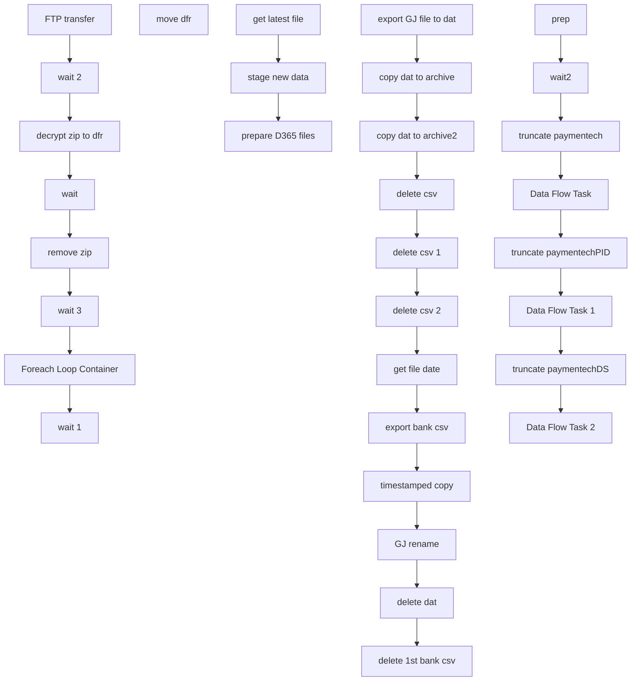

# SSIS Package: Package

**Project:** ERP_PaymentechETL  
**Folder:** ERP  
**Server:** STL-SSIS-P-01  

## Connection Managers

| Name | Type | Server | Catalog | Connection (sanitized) |
|---|---|---|---|---|
| Excel Connection Manager 2 | EXCEL | \\stl-dynsnc-p-01\d$\oData\paymentechD365\bankStatementFiles\bankChase.xlsx |  | Provider=Microsoft.ACE.OLEDB.12.0; Data Source=\\stl-dynsnc-p-01\d$\oData\paymentechD365\bankStatementFiles\bankChase.xlsx; Extended Properties="EXCEL 12.0 XML; HDR=YES" |
| STL-SSIS-P-01 | OLEDB | STL-SSIS-P-01 | IntegrationStaging | Data Source=STL-SSIS-P-01; Initial Catalog=IntegrationStaging; Provider=SQLNCLI11.1; Integrated Security=SSPI; Auto Translate=False |
| bankChase csv | FLATFILE |  |  |  |
| datetimestamp | FLATFILE |  |  |  |
| paymentechD365 | FILE |  |  |  |
| paymentechD365.csv | FLATFILE |  |  |  |
| paymentechFinal | FLATFILE |  |  |  |
| paymentechFinal 1 | FLATFILE |  |  |  |
| pid.csv | FLATFILE |  |  |  |
| stl-dynsnc-p-01 | OLEDB | stl-dynsnc-p-01 | DBAUtility | Data Source=stl-dynsnc-p-01; Initial Catalog=DBAUtility; Provider=SQLNCLI11.1; Integrated Security=SSPI; Auto Translate=False |

## Control Flow Tasks

| Task | Type |
|---|---|
| Package | Package |
| get latest file | SEQUENCE |
| decrypt zip to dfr | ExecuteProcess |
| Foreach Loop Container | FOREACHLOOP |
| move dfr | FileSystemTask |
| FTP transfer | ExecuteSQLTask |
| remove zip | ExecuteProcess |
| wait | ExecuteSQLTask |
| wait 1 | ExecuteSQLTask |
| wait 2 | ExecuteSQLTask |
| wait 3 | ExecuteSQLTask |
| prepare D365 files | SEQUENCE |
| copy dat to archive | FileSystemTask |
| copy dat to archive2 | FileSystemTask |
| delete 1st bank csv | FileSystemTask |
| delete csv | FileSystemTask |
| delete csv 1 | FileSystemTask |
| delete csv 2 | FileSystemTask |
| delete dat | FileSystemTask |
| export bank csv | Pipeline |
| export GJ file to dat | Pipeline |
| get file date | ExecuteSQLTask |
| GJ rename | FileSystemTask |
| timestamped copy | FileSystemTask |
| stage new data | SEQUENCE |
| Data Flow Task | Pipeline |
| Data Flow Task 1 | Pipeline |
| Data Flow Task 2 | Pipeline |
| prep | ExecuteSQLTask |
| truncate paymentech | ExecuteSQLTask |
| truncate paymentechDS | ExecuteSQLTask |
| truncate paymentechPID | ExecuteSQLTask |
| wait2 | ExecuteSQLTask |

## Control Flow Outline

```text
- get latest file [SEQUENCE]
  - FTP transfer [ExecuteSQLTask]
  - Foreach Loop Container [FOREACHLOOP]
    - move dfr [FileSystemTask]
  - decrypt zip to dfr [ExecuteProcess]
  - remove zip [ExecuteProcess]
  - wait [ExecuteSQLTask]
  - wait 1 [ExecuteSQLTask]
  - wait 2 [ExecuteSQLTask]
  - wait 3 [ExecuteSQLTask]
- prepare D365 files [SEQUENCE]
  - GJ rename [FileSystemTask]
  - copy dat to archive [FileSystemTask]
  - copy dat to archive2 [FileSystemTask]
  - delete 1st bank csv [FileSystemTask]
  - delete csv [FileSystemTask]
  - delete csv 1 [FileSystemTask]
  - delete csv 2 [FileSystemTask]
  - delete dat [FileSystemTask]
  - export GJ file to dat [Pipeline]
  - export bank csv [Pipeline]
  - get file date [ExecuteSQLTask]
  - timestamped copy [FileSystemTask]
- stage new data [SEQUENCE]
  - Data Flow Task [Pipeline]
  - Data Flow Task 1 [Pipeline]
  - Data Flow Task 2 [Pipeline]
  - prep [ExecuteSQLTask]
  - truncate paymentech [ExecuteSQLTask]
  - truncate paymentechDS [ExecuteSQLTask]
  - truncate paymentechPID [ExecuteSQLTask]
  - wait2 [ExecuteSQLTask]
```

## Architecture Diagram



## Variables

| Namespace | Name | Expression-bound |
|---|---|---|
| User | FilePath | No |
| User | GJ_path | No |
| User | RowHeader | No |
| User | bankStatementFile | No |
| User | bankStatementPath | Yes |
| User | csv_copy | Yes |
| User | d365archiveFile | Yes |
| User | d365archiveFile2 | Yes |
| User | d365file | No |
| User | datDelete | No |
| User | extension | No |
| User | extension2 | No |
| User | fileDate | No |
| User | file_to_delete | Yes |
| User | finalGJfilename | Yes |
| User | newFile | Yes |
| User | varArchiveFolder | No |
| User | varArchiveFolder2 | No |
| User | varBankStatementFolder | No |
| User | varBankStatementTemplateFolder | No |
| User | varCurrentDFR | No |
| User | xlsx_copy | Yes |

### Expression-bound variable values

#### User::bankStatementPath

**Expression:**

```sql
@[User::varBankStatementFolder] +  @[User::bankStatementFile] +  @[User::extension]
```

**Evaluated value:**

```sql
\\stl-dynsnc-p-01\d$\oData\paymentechD365\bankStatementFiles\bankChase.csv
```

#### User::csv_copy

**Expression:**

```sql
@[User::varBankStatementFolder] + @[User::bankStatementFile] + "_" + @[User::fileDate] + "_"+ (DT_WSTR, 4) year(getdate()) +  (DT_WSTR, 2) month(getdate()) +  (DT_WSTR, 2) day(getdate()) + RIGHT("0" + (DT_STR, 2, 1252)DATEPART("hh", GetDate()), 2) + RIGHT("0" + (DT_STR, 2, 1252)DATEPART("mi", GetDate()), 2) + RIGHT("0" + (DT_STR, 2, 1252)DATEPART("ss", GetDate()), 2) + @[User::extension]
```

**Evaluated value:**

```sql
\\stl-dynsnc-p-01\d$\oData\paymentechD365\bankStatementFiles\bankChase__202244114435.csv
```

#### User::d365archiveFile

**Expression:**

```sql
@[User::varArchiveFolder] + @[User::d365file] + "_"+  @[User::fileDate] + "_"+ (DT_WSTR, 4) year(getdate()) +  (DT_WSTR, 2) month(getdate()) +  (DT_WSTR, 2) day(getdate()) + RIGHT("0" + (DT_STR, 2, 1252)DATEPART("hh", GetDate()), 2) + RIGHT("0" + (DT_STR, 2, 1252)DATEPART("mi", GetDate()), 2) + RIGHT("0" + (DT_STR, 2, 1252)DATEPART("ss", GetDate()), 2) + @[User::extension]
```

**Evaluated value:**

```sql
\\stl-ssis-p-01\IntegrationStaging\paymentech\paymentechD365\archive\paymentechD365__202244114435.csv
```

#### User::d365archiveFile2

**Expression:**

```sql
@[User::varArchiveFolder2] + @[User::d365file] + "_"+  @[User::fileDate] + "_"+ (DT_WSTR, 4) year(getdate()) +  (DT_WSTR, 2) month(getdate()) +  (DT_WSTR, 2) day(getdate()) + RIGHT("0" + (DT_STR, 2, 1252)DATEPART("hh", GetDate()), 2) + RIGHT("0" + (DT_STR, 2, 1252)DATEPART("mi", GetDate()), 2) + RIGHT("0" + (DT_STR, 2, 1252)DATEPART("ss", GetDate()), 2) + @[User::extension]
```

**Evaluated value:**

```sql
\\stl-dynsnc-p-01\d$\oData\paymentechD365\archive\paymentechD365__202244114435.csv
```

#### User::file_to_delete

**Expression:**

```sql
@[User::varBankStatementFolder] + @[User::bankStatementFile] +  @[User::extension2]
```

**Evaluated value:**

```sql
\\stl-dynsnc-p-01\d$\oData\paymentechD365\bankStatementFiles\bankChase.xlsx
```

#### User::finalGJfilename

**Expression:**

```sql
@[User::GJ_path] + "paymentech" + "_"+  @[User::fileDate] + "_"+ (DT_WSTR, 4) year(getdate()) +  (DT_WSTR, 2) month(getdate()) +  (DT_WSTR, 2) day(getdate()) + RIGHT("0" + (DT_STR, 2, 1252)DATEPART("hh", GetDate()), 2) + RIGHT("0" + (DT_STR, 2, 1252)DATEPART("mi", GetDate()), 2) + RIGHT("0" + (DT_STR, 2, 1252)DATEPART("ss", GetDate()), 2) + @[User::extension]
```

**Evaluated value:**

```sql
\\stl-dynsnc-p-01\d$\BABWIntegrations\GeneralJournal\prod\1100\paymentech__202244114435.csv
```

#### User::newFile

**Expression:**

```sql
@[User::varBankStatementTemplateFolder] + @[User::bankStatementFile] +  @[User::extension2]
```

**Evaluated value:**

```sql
\\stl-ssis-p-01\IntegrationStaging\paymentech\paymentechD365\bankStatementFiles\template\bankChase.xlsx
```

#### User::xlsx_copy

**Expression:**

```sql
@[User::varBankStatementFolder] + @[User::bankStatementFile] + "_" + @[User::fileDate] + "_"+ (DT_WSTR, 4) year(getdate()) +  (DT_WSTR, 2) month(getdate()) +  (DT_WSTR, 2) day(getdate()) + RIGHT("0" + (DT_STR, 2, 1252)DATEPART("hh", GetDate()), 2) + RIGHT("0" + (DT_STR, 2, 1252)DATEPART("mi", GetDate()), 2) + RIGHT("0" + (DT_STR, 2, 1252)DATEPART("ss", GetDate()), 2) + @[User::extension2]
```

**Evaluated value:**

```sql
\\stl-dynsnc-p-01\d$\oData\paymentechD365\bankStatementFiles\bankChase__202244114435.xlsx
```

## Execute SQL Tasks

### FTP transfer

**Path:** `Package\get latest file\FTP transfer`  
**Connection:** STL-SSIS-P-01 (STL-SSIS-P-01/IntegrationStaging)  

```sql
declare 
 @winSCP varchar(1000),
 @script varchar(1000),
 @log varchar(1000),
 @FTP varchar(4000),
 @Log_query varchar(1000),
 @Log_filename varchar(100),
 @Log_file_location varchar(100),
 @Log_bcp varchar(1000),
 @body varchar(4000)
select
 @winSCP = '"\\stl-ssis-p-01\C$\Program Files (x86)\WinSCP\WinSCP.exe"',
 @script = ' /script=\\stl-ssis-p-01\IntegrationStaging\paymentech\SFTP_SSH\paymentech_SSH_SFTP.txt',
 @log = ' /log=\\stl-ssis-p-01\IntegrationStaging\paymentech\SFTP_SSH\Download.log',
 @FTP = (@winSCP + @script + @log)
   
   
exec master..xp_cmdshell @FTP
```

### wait

**Path:** `Package\get latest file\wait`  
**Connection:** STL-SSIS-P-01 (STL-SSIS-P-01/IntegrationStaging)  

```sql
WAITFOR DELAY '00:00:05'
```

### wait 1

**Path:** `Package\get latest file\wait 1`  
**Connection:** STL-SSIS-P-01 (STL-SSIS-P-01/IntegrationStaging)  

```sql
WAITFOR DELAY '00:00:05'
```

### wait 2

**Path:** `Package\get latest file\wait 2`  
**Connection:** STL-SSIS-P-01 (STL-SSIS-P-01/IntegrationStaging)  

```sql
WAITFOR DELAY '00:00:05'
```

### wait 3

**Path:** `Package\get latest file\wait 3`  
**Connection:** STL-SSIS-P-01 (STL-SSIS-P-01/IntegrationStaging)  

```sql
WAITFOR DELAY '00:00:05'
```

### get file date

**Path:** `Package\prepare D365 files\get file date`  
**Connection:** STL-SSIS-P-01 (STL-SSIS-P-01/IntegrationStaging)  

```sql
SELECT DISTINCT CONVERT(varchar(10), CAST(col5 AS date), 112) AS fileDate
FROM            babw_paymentechDS
```

### prep

**Path:** `Package\stage new data\prep`  
**Connection:** STL-SSIS-P-01 (STL-SSIS-P-01/IntegrationStaging)  

```sql
EXEC master..xp_CMDShell "\\stl-ssis-p-01\IntegrationStaging\paymentech\paymentechD365\prepUS.bat"
```

### truncate paymentech

**Path:** `Package\stage new data\truncate paymentech`  
**Connection:** STL-SSIS-P-01 (STL-SSIS-P-01/IntegrationStaging)  

```sql
truncate table [dbo].[babw_paymentech]
```

### truncate paymentechDS

**Path:** `Package\stage new data\truncate paymentechDS`  
**Connection:** STL-SSIS-P-01 (STL-SSIS-P-01/IntegrationStaging)  

```sql
truncate table [dbo].[babw_paymentechDS]
```

### truncate paymentechPID

**Path:** `Package\stage new data\truncate paymentechPID`  
**Connection:** STL-SSIS-P-01 (STL-SSIS-P-01/IntegrationStaging)  

```sql
truncate table [dbo].[babw_paymentechPID]
```

### wait2

**Path:** `Package\stage new data\wait2`  
**Connection:** stl-dynsnc-p-01 (stl-dynsnc-p-01/DBAUtility)  

```sql
WAITFOR DELAY '00:00:05'
```

## Data Flow: Sources

| Component | Source Object | Type | Data Flow Task | Connection | SQL Kind |
|---|---|---|---|---|---|
| OLE DB Source |  | OLEDBSource | export bank csv | STL-SSIS-P-01 | SqlCommand |
| OLE DB Source MAIN |  | OLEDBSource | export GJ file to dat | STL-SSIS-P-01 | SqlCommand |
| Flat File Source |  | FlatFileSource | Data Flow Task | paymentechD365.csv |  |
| Flat File Source |  | FlatFileSource | Data Flow Task 1 | pid.csv |  |
| Flat File Source |  | FlatFileSource | Data Flow Task 2 | datetimestamp |  |

#### OLE DB Source — SqlCommand

```sql
select (select distinct(col5) from [dbo].[babw_paymentechDS]) as 'As Of', 'USD' as 'Currency', 'ABA' as 'BankID Type','123456789' as 'BankID', '1100MCVCLEAR' as 'Account','Credits' as 'Data Type',
'399' as 'BAI Code','Deposit' as 'Description',sum(col11) as 'Amount','' as 'Balance/Value Date', convert(varchar, [col3]+1000) as 'Customer Reference','' as 'Immediate Availability', '' as '1 Day Float',
'' as '2 + DayFloat',(select top 1 convert(varchar(10),convert(date,[col3]),112) from [dbo].[babw_paymentechDS]) + convert(varchar, [col3]+1000) as 'Bank Reference','' as '# of Items', 
(select top 1 convert(varchar(10),convert(date,[col3]),112) from [dbo].[babw_paymentechDS]) + convert(varchar, [col3]+1000) as 'Text'
from [dbo].[babw_paymentech] where col9 = 'S' and col8 in ('SALE','REF') and [col7] not in ('AX', 'DI')  group by col3 having sum(col11) <> 0

--order by [Customer Reference]

union all

select (select distinct(col5) from [dbo].[babw_paymentechDS]) as 'As Of', 'USD' as 'Currency', 'ABA' as 'BankID Type','123456789' as 'BankID', '1100MCVCLEAR' as 'Account','Debits' as 'Data Type',
'699' as 'BAI Code','Disbursement' as 'Description',sum(col11) as 'Amount','' as 'Balance/Value Date', '9999' as 'Customer Reference','' as 'Immediate Availability', '' as '1 Day Float',
'' as '2 + DayFloat',(select top 1 convert(varchar(10),convert(date,[col3]),112) from [dbo].[babw_paymentechDS]) + '9999' as 'Bank Reference','' as '# of Items', 
(select top 1 convert(varchar(10),convert(date,[col3]),112) from [dbo].[babw_paymentechDS]) + '9999' as 'Text'
from [dbo].[babw_paymentech] where col9 = 'S' and col8 in ('SALE','REF') and [col7] not in ('AX', 'DI')
```

#### OLE DB Source MAIN — SqlCommand

```sql
declare @totalCredits decimal(18,2)
declare @totalDebits decimal(18,2)

set @totalCredits = 0 
set @totalDebits = 0 

--IF (select (sum(col11)) as 'total credits' from [dbo].[babw_paymentech] where col9 = 'S') > 0 set @totalCredits = (select (sum(col11)) as 'total credits' from [dbo].[babw_paymentech] where col9 = 'S')
--ELSE set @totalDebits = (select (sum(col11)) as 'total credits' from [dbo].[babw_paymentech] where col9 = 'S')

set @totalCredits = (select (sum(col11)) as 'total credits' from [dbo].[babw_paymentech] where col9 = 'S' and col11 > 0 and [col7] not in ('AX', 'DI') )
set @totalDebits = (select (sum(col11)) as 'total debits' from [dbo].[babw_paymentech] where col9 = 'S' and col11 < 0 and [col7] not in ('AX', 'DI') )


select 'GLNUM001' as JOURNALBATCHNUMBER, ROW_NUMBER() OVER(ORDER BY col2 ASC) AS LINENUMBER,

 'ACCOUNTDISPLAYVALUE' = CASE              WHEN [col3] in (285,470,990,991,999) and [col8] in ('SALE','REF') THEN 'MCVClear'
			                     WHEN [col3] in (285,470,990,991,999) and [col8] in ('CB') THEN '601060-9999-9999-10--'
				   WHEN [col3] in (285,470,990,991,999) and [col8] not in ('SALE','REF','CB') THEN '601000-9999-9999-10--'
			                      WHEN [col3] in ('0013') and [col8] in ('SALE','REF') THEN 'MCVClear'
				   WHEN [col3] in ('0013') and [col8] not in ('SALE','REF') THEN '601000-1013-9999-11--'
				   WHEN [col3] < 1000 and [col3] not in (285,470,990,991,999) and [col8] in ('SALE','REF') THEN 'MCVClear'
				   WHEN [col3] < 1000 and [col3] not in (285,470,990,991,999) and [col8] in ('CB') THEN '601060-' + convert(varchar, [col3]+1000) + '-9999-10--'
				   WHEN [col3] < 1000 and [col3] not in (285,470,990,991,999) and [col8] not in ('SALE','REF','CB') THEN '601000-' + convert(varchar, [col3]+1000) + '-9999-10--'
			                      WHEN [col3] > 1000 and [col8] in ('SALE','REF') THEN 'MCVClear'
				   WHEN [col3] > 1000 and [col8] in ('CB') THEN '601060-9999-9999-10--'
				    WHEN [col3] > 1000 and [col8] not in ('SALE','REF','CB') THEN '601000-9999-9999-10--' END,

'ACCOUNTTYPE' = CASE                               WHEN [col3] in (285,470,990,991,999) and [col8] in ('SALE','REF') THEN 'Bank'
				WHEN [col3] in (285,470,990,991,999) and [col8] in ('CB') THEN 'Ledger'
				WHEN [col3] in (285,470,990,991,999) and [col8] not in ('SALE','REF','CB') THEN 'Ledger'
			                     WHEN [col3] in ('0013') and [col8] in ('SALE','REF') THEN 'Bank'
				   WHEN [col3] in ('0013') and [col8] not in ('SALE','REF') THEN 'Ledger'
				   WHEN [col3] < 1000 and [col3] not in (285,470,990,991,999) and [col8] in ('SALE','REF') THEN 'Bank'
				   WHEN [col3] < 1000 and [col3] not in (285,470,990,991,999) and [col8] in ('CB') THEN 'Ledger'
				   WHEN [col3] < 1000 and [col3] not in (285,470,990,991,999) and [col8] not in ('SALE','REF','CB') THEN 'Ledger'
			                     WHEN [col3] > 1000 and [col8] in ('SALE','REF') THEN 'Bank'
				   WHEN [col3] > 1000 and [col8] in ('CB') THEN 'Ledger'
				    WHEN [col3] > 1000 and [col8] not in ('SALE','REF','CB') THEN 'Ledger' END,

'BANKTRANSTYPE' = CASE                            WHEN [col3] in (285,470,990,991,999) and [col8] in ('SALE','REF') THEN 'CHASE'
				  WHEN [col3] in (285,470,990,991,999) and [col8] in ('CB') THEN ''
				  WHEN [col3] in (285,470,990,991,999) and [col8] not in ('SALE','REF','CB') THEN ''
			                     WHEN [col3] in ('0013') and [col8] in ('SALE','REF') THEN 'CHASE'
				   WHEN [col3] in ('0013') and [col8] not in ('SALE','REF') THEN ''
				   WHEN [col3] < 1000 and [col3] not in (285,470,990,991,999) and [col8] in ('SALE','REF') THEN 'CHASE'
				   WHEN [col3] < 1000 and [col3] not in (285,470,990,991,999) and [col8] in ('CB') THEN ''
				   WHEN [col3] < 1000 and [col3] not in (285,470,990,991,999) and [col8] not in ('SALE','REF','CB') THEN ''
			                     WHEN [col3] > 1000 and [col8] in ('SALE','REF') THEN 'CHASE'
				   WHEN [col3] > 1000 and [col8] in ('CB') THEN ''
				    WHEN [col3] > 1000 and [col8] not in ('SALE','REF','CB') THEN '' END,


'CREDITAMOUNT' = CASE WHEN [col9] = 'S' and [col11] > 0 THEN [col11] ELSE 0 END, 
[col6] as CURRENCYCODE,
'DEBITAMOUNT' = CASE WHEN  [col9] = 'S' and [col11] < 0 THEN [col11]*-1 ELSE 0 END, 

'DEFAULTDIMENSIONDISPLAYVALUE' = CASE WHEN [col3] in (285,470,990,991,999) and [col8] in ('SALE','REF') THEN '9999-9999-10--'
				       WHEN [col3] in (285,470,990,991,999) and [col8] in ('CB') THEN ''
			                         WHEN [col3] in (285,470,990,991,999) and [col8] not in ('SALE','REF','CB') THEN ''
			                       WHEN [col3] in ('0013') and [col8] in ('SALE','REF') THEN '1013-9999-11--'
				   WHEN [col3] in ('0013') and [col8] not in ('SALE','REF') THEN ''
				   WHEN [col3] < 1000 and [col3] not in (285,470,990,991,999) and [col8] in ('SALE','REF') THEN convert(varchar, [col3]+1000) + '-9999-10--' 
				   WHEN [col3] < 1000 and [col3] not in (285,470,990,991,999) and [col8] in ('CB') THEN ''
				   WHEN [col3] < 1000 and [col3] not in (285,470,990,991,999) and [col8] not in ('SALE','REF','CB') THEN ''
			                      WHEN [col3] > 1000 and [col8] in ('SALE','REF') THEN '9999-9999-10--'
				   WHEN [col3] > 1000 and [col8] in ('CB') THEN ''
				    WHEN [col3] > 1000 and [col8] not in ('SALE','REF','CB') THEN '' END,

'MCVMERCH' + (select distinct(convert(varchar(10), cast(col5 as date), 112)) from [dbo].[babw_paymentechDS]) as 'DESCRIPTION',
'Yes' as 'ISPOSTED','GL-CC' as 'JOURNALNAME',
'PAYMENTMETHOD' = CASE							   WHEN [col8] = 'SALE' and [col7] = 'VI' THEN 'MERDEPVI' 
                                                   WHEN [col8] = 'SALE' and [col7] = 'MC' THEN 'MERDEPMC'
                                                   WHEN [col8] = 'SALE' and [col7] not in ('VI','MC') THEN 'MERDEPDB' 
                                                   WHEN [col8] = 'REF' and [col7] = 'VI' THEN 'MERREFVI' 
                                                   WHEN [col8] = 'REF' and [col7] = 'MC' THEN 'MERREFMC'
												   WHEN [col8] = 'REF' and [col7] not in ('VI','MC') THEN 'MERREF'
												   WHEN [col8] = 'CB' THEN 'MERCBMCV'
                                                   ELSE 'MERFEEMCV' END,
'PAYMENTREFERENCE' = CASE WHEN [col3] < 1000 THEN convert(varchar, [col3]+1000)
			WHEN [col3] > 1000 THEN [col3] END,
'Current' as 'POSTINGLAYER',
'TEXT' = CASE									   WHEN [col8] = 'SALE' and [col7] = 'VI' THEN 'MERDEPVI' + (select distinct(convert(varchar(10), cast(col4 as date), 112)) from [dbo].[babw_paymentechDS])
                                                   WHEN [col8] = 'SALE' and [col7] = 'MC' THEN 'MERDEPMC' + (select distinct(convert(varchar(10), cast(col4 as date), 112)) from [dbo].[babw_paymentechDS])
                                                   WHEN [col8] = 'SALE' and [col7] not in ('VI','MC') THEN 'MERDEPDB' + (select distinct(convert(varchar(10), cast(col4 as date), 112)) from [dbo].[babw_paymentechDS])
                                                   WHEN [col8] = 'REF' and [col7] = 'VI' THEN 'MERREFVI' + (select distinct(convert(varchar(10), cast(col4 as date), 112)) from [dbo].[babw_paymentechDS])
                                                   WHEN [col8] = 'REF' and [col7] = 'MC' THEN 'MERREFMC' + (select distinct(convert(varchar(10), cast(col4 as date), 112)) from [dbo].[babw_paymentechDS])
												   WHEN [col8] = 'REF' and [col7] not in ('VI','MC') THEN 'MERREF' + (select distinct(convert(varchar(10), cast(col4 as date), 112)) from [dbo].[babw_paymentechDS])
												   WHEN [col8] = 'CB' THEN 'MERCBMCV' + (select distinct(convert(varchar(10), cast(col4 as date), 112)) from [dbo].[babw_paymentechDS])
                                                   ELSE 'MERFEEMCV' + (select distinct(convert(varchar(10), cast(col4 as date), 112)) from [dbo].[babw_paymentechDS]) END,
(select distinct(col5) from [dbo].[babw_paymentechDS]) as 'TRANSDATE',
 'CHASE' + (select distinct(convert(varchar(10), cast(col5 as date), 112)) from [dbo].[babw_paymentechDS]) as 'VOUCHER'
from [dbo].[babw_paymentech] where col9 = 'S' and [col7] not in ('AX', 'DI') 

union all 

select top 1 'GLNUM001' as JOURNALBATCHNUMBER, 
(select count(*)+1 from  [dbo].[babw_paymentech]  where col9 = 'S') AS LINENUMBER,
'PNC_VISA' as 'ACCOUNTDISPLAYVALUE',
 'Bank' as ACCOUNTTYPE,'CHASE' as 'BANKTRANSTYPE',
 --  0 as 'CREDITAMOUNT', 'USD' as CURRENCYCODE, convert(varchar, @totalCredits-@totalDebits) as 'DEBITAMOUNT',   
 'CREDITAMOUNT' = CASE WHEN @totalCredits+@totalDebits < 0 then convert(varchar, -1*(@totalCredits+@totalDebits))
 else '0' end,
 'USD' as CURRENCYCODE,   
 'DEBITAMOUNT' = CASE WHEN @totalCredits+@totalDebits > 0 then convert(varchar, @totalCredits+@totalDebits) 
 else '0' end,
'9999-9999-10--' as DEFAULTDIMENSIONDISPLAYVALUE,'MCVMERCH' + 
(select distinct(convert(varchar(10), cast(col5 as date), 112)) from [dbo].[babw_paymentechDS]) as 'DESCRIPTION',
'Yes' as 'ISPOSTED','GL-CC' as 'JOURNALNAME',
'SUMMARY' as 'PAYMENTMETHOD',9999 as 'PAYMENTREFERENCE',
'Current' as 'POSTINGLAYER',
'CHASE' + (select distinct(convert(varchar(10), cast(col5 as date), 112)) from [dbo].[babw_paymentechDS]) as 'TEXT',
(select distinct(convert(varchar(10), cast(col5 as date), 101)) from [dbo].[babw_paymentechDS]) as 'TRANSDATE',
'CHASE' + (select distinct(convert(varchar(10), cast(col5 as date), 112)) from [dbo].[babw_paymentechDS]) as 'VOUCHER'
from [dbo].[babw_paymentech] where col9 = 'S'
```

## Data Flow: Destinations

| Component | Target Table | Type | Data Flow Task | Connection | SQL Kind |
|---|---|---|---|---|---|
| Flat File Destination |  | FlatFileDestination | export bank csv | bankChase csv |  |
| Flat File Destination |  | FlatFileDestination | export GJ file to dat | paymentechFinal |  |
| OLE DB Destination |  | OLEDBDestination | Data Flow Task | STL-SSIS-P-01 |  |
| OLE DB Destination |  | OLEDBDestination | Data Flow Task 1 | STL-SSIS-P-01 |  |
| OLE DB Destination |  | OLEDBDestination | Data Flow Task 2 | STL-SSIS-P-01 |  |
