# SSIS Package: Package

**Project:** ERP_PaymentechETL  
**Folder:** ERP  
**Server:** STL-SSIS-P-01  

## Architecture Diagram

```mermaid
flowchart TD
    subgraph Connections
        bankChase_csv_conn(["bankChase csv [FLATFILE]"])
        datetimestamp_conn(["datetimestamp [FLATFILE]"])
        Excel_Connection_Manager_2_conn(["Excel Connection Manager 2 [EXCEL]"])
        paymentechD365_conn(["paymentechD365 [FILE]"])
        paymentechD365_csv_conn(["paymentechD365.csv [FLATFILE]"])
        paymentechFinal_conn(["paymentechFinal [FLATFILE]"])
        paymentechFinal_1_conn(["paymentechFinal 1 [FLATFILE]"])
        pid_csv_conn(["pid.csv [FLATFILE]"])
        stl_dynsnc_p_01_conn(["stl-dynsnc-p-01 [OLEDB]"])
        STL_SSIS_P_01_conn(["STL-SSIS-P-01 [OLEDB]"])
    end
    subgraph ControlFlow
        Package_task["Package"]
        get_latest_file_task["get latest file"]
        Package_task --> get_latest_file_task
        decrypt_zip_to_dfr_task["decrypt zip to dfr"]
        get_latest_file_task --> decrypt_zip_to_dfr_task
        Foreach_Loop_Container_task["Foreach Loop Container"]
        decrypt_zip_to_dfr_task --> Foreach_Loop_Container_task
        move_dfr_task["move dfr"]
        Foreach_Loop_Container_task --> move_dfr_task
        FTP_transfer_task["FTP transfer"]
        move_dfr_task --> FTP_transfer_task
        remove_zip_task["remove zip"]
        FTP_transfer_task --> remove_zip_task
        wait_task["wait"]
        remove_zip_task --> wait_task
        wait_1_task["wait 1"]
        wait_task --> wait_1_task
        wait_2_task["wait 2"]
        wait_1_task --> wait_2_task
        wait_3_task["wait 3"]
        wait_2_task --> wait_3_task
        prepare_D365_files_task["prepare D365 files"]
        wait_3_task --> prepare_D365_files_task
        copy_dat_to_archive_task["copy dat to archive"]
        prepare_D365_files_task --> copy_dat_to_archive_task
        copy_dat_to_archive2_task["copy dat to archive2"]
        copy_dat_to_archive_task --> copy_dat_to_archive2_task
        delete_1st_bank_csv_task["delete 1st bank csv"]
        copy_dat_to_archive2_task --> delete_1st_bank_csv_task
        delete_csv_task["delete csv"]
        delete_1st_bank_csv_task --> delete_csv_task
        delete_csv_1_task["delete csv 1"]
        delete_csv_task --> delete_csv_1_task
        delete_csv_2_task["delete csv 2"]
        delete_csv_1_task --> delete_csv_2_task
        delete_dat_task["delete dat"]
        delete_csv_2_task --> delete_dat_task
        export_bank_csv_task["export bank csv"]
        delete_dat_task --> export_bank_csv_task
        export_GJ_file_to_dat_task["export GJ file to dat"]
        export_bank_csv_task --> export_GJ_file_to_dat_task
        get_file_date_task["get file date"]
        export_GJ_file_to_dat_task --> get_file_date_task
        GJ_rename_task["GJ rename"]
        get_file_date_task --> GJ_rename_task
        timestamped_copy_task["timestamped copy"]
        GJ_rename_task --> timestamped_copy_task
        stage_new_data_task["stage new data"]
        timestamped_copy_task --> stage_new_data_task
        Data_Flow_Task_task["Data Flow Task"]
        stage_new_data_task --> Data_Flow_Task_task
        Data_Flow_Task_1_task["Data Flow Task 1"]
        Data_Flow_Task_task --> Data_Flow_Task_1_task
        Data_Flow_Task_2_task["Data Flow Task 2"]
        Data_Flow_Task_1_task --> Data_Flow_Task_2_task
        prep_task["prep"]
        Data_Flow_Task_2_task --> prep_task
        truncate_paymentech_task["truncate paymentech"]
        prep_task --> truncate_paymentech_task
        truncate_paymentechDS_task["truncate paymentechDS"]
        truncate_paymentech_task --> truncate_paymentechDS_task
        truncate_paymentechPID_task["truncate paymentechPID"]
        truncate_paymentechDS_task --> truncate_paymentechPID_task
        wait2_task["wait2"]
        truncate_paymentechPID_task --> wait2_task
    end
```

## Connection Managers

| Name | Type |
|---|---|
| bankChase csv | FLATFILE |
| datetimestamp | FLATFILE |
| Excel Connection Manager 2 | EXCEL |
| paymentechD365 | FILE |
| paymentechD365.csv | FLATFILE |
| paymentechFinal | FLATFILE |
| paymentechFinal 1 | FLATFILE |
| pid.csv | FLATFILE |
| stl-dynsnc-p-01 | OLEDB |
| STL-SSIS-P-01 | OLEDB |

## Control Flow Tasks

| Task | Type |
|---|---|
| Package | Microsoft.Package |
| get latest file | STOCK:SEQUENCE |
| decrypt zip to dfr | Microsoft.ExecuteProcess |
| Foreach Loop Container | STOCK:FOREACHLOOP |
| move dfr | Microsoft.FileSystemTask |
| FTP transfer | Microsoft.ExecuteSQLTask |
| remove zip | Microsoft.ExecuteProcess |
| wait | Microsoft.ExecuteSQLTask |
| wait 1 | Microsoft.ExecuteSQLTask |
| wait 2 | Microsoft.ExecuteSQLTask |
| wait 3 | Microsoft.ExecuteSQLTask |
| prepare D365 files | STOCK:SEQUENCE |
| copy dat to archive | Microsoft.FileSystemTask |
| copy dat to archive2 | Microsoft.FileSystemTask |
| delete 1st bank csv | Microsoft.FileSystemTask |
| delete csv | Microsoft.FileSystemTask |
| delete csv 1 | Microsoft.FileSystemTask |
| delete csv 2 | Microsoft.FileSystemTask |
| delete dat | Microsoft.FileSystemTask |
| export bank csv | Microsoft.Pipeline |
| export GJ file to dat | Microsoft.Pipeline |
| get file date | Microsoft.ExecuteSQLTask |
| GJ rename | Microsoft.FileSystemTask |
| timestamped copy | Microsoft.FileSystemTask |
| stage new data | STOCK:SEQUENCE |
| Data Flow Task | Microsoft.Pipeline |
| Data Flow Task 1 | Microsoft.Pipeline |
| Data Flow Task 2 | Microsoft.Pipeline |
| prep | Microsoft.ExecuteSQLTask |
| truncate paymentech | Microsoft.ExecuteSQLTask |
| truncate paymentechDS | Microsoft.ExecuteSQLTask |
| truncate paymentechPID | Microsoft.ExecuteSQLTask |
| wait2 | Microsoft.ExecuteSQLTask |

## Data Flow: Sources

| Component | SQL Preview |
|---|---|
|  | select (select distinct(col5) from [dbo].[babw_paymentechDS]) as 'As Of', 'USD' as 'Currency', 'ABA' as 'BankID Type','123456789' as 'BankID', '1100MCVCLEAR' as 'Account','Credits' as 'Data Type', '399' as 'BAI Code','Deposit' as 'Description',sum(col11) as 'Amount','' as 'Balance/Value Date', convert(varchar, [col3]+1000) as 'Customer Reference','' as 'Immediate Availability', '' as '1 Day Float' |
|  | declare @totalCredits decimal(18,2) declare @totalDebits decimal(18,2)  set @totalCredits = 0  set @totalDebits = 0   --IF (select (sum(col11)) as 'total credits' from [dbo].[babw_paymentech] where col9 = 'S') > 0 set @totalCredits = (select (sum(col11)) as 'total credits' from [dbo].[babw_paymentech] where col9 = 'S') --ELSE set @totalDebits = (select (sum(col11)) as 'total credits' from [dbo].[b |

## Data Flow: Destinations

| Component | Destination |
|---|---|
|  | [dbo].[babw_paymentech] |
|  | [dbo].[babw_paymentechPID] |
|  | [dbo].[babw_paymentechDS] |

