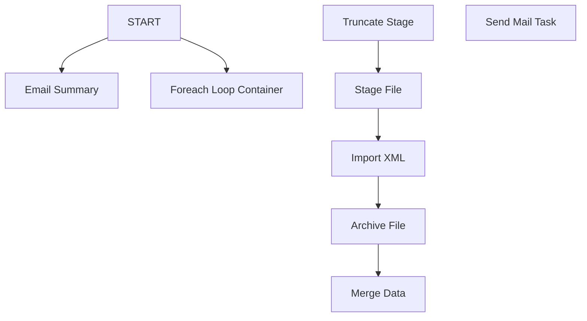

# SSIS Package: ERP_Validation_POReceipts

**Project:** ERP_Validation_POReceipts  
**Folder:** ERP  
**Server:** STL-SSIS-P-01  

## Connection Managers

| Name | Type | Server | Catalog | Connection (sanitized) |
|---|---|---|---|---|
| IntegrationStaging | OLEDB | STL-SSIS-p-01 | IntegrationStaging | Data Source=STL-SSIS-p-01; Initial Catalog=IntegrationStaging; Provider=SQLNCLI11.1; Integrated Security=SSPI; Auto Translate=False |
| SMTP | SMTP |  |  |  |

## Control Flow Tasks

| Task | Type |
|---|---|
| Package | Package |
| Email Summary | ExecuteSQLTask |
| Foreach Loop Container | FOREACHLOOP |
| Archive File | FileSystemTask |
| Import XML | Pipeline |
| Merge Data | ExecuteSQLTask |
| Stage File | FileSystemTask |
| Truncate Stage | ExecuteSQLTask |
| START | ExecuteSQLTask |
| Send Mail Task | SendMailTask |

## Control Flow Outline

```text
- Send Mail Task [SendMailTask]
- Email Summary [ExecuteSQLTask]
- Foreach Loop Container [FOREACHLOOP]
  - Archive File [FileSystemTask]
  - Import XML [Pipeline]
  - Merge Data [ExecuteSQLTask]
  - Stage File [FileSystemTask]
  - Truncate Stage [ExecuteSQLTask]
- START [ExecuteSQLTask]
```

## Architecture Diagram



## Variables

| Namespace | Name | Expression-bound |
|---|---|---|
| System | Propagate | No |
| User | DateTimeStamp | Yes |
| User | EndDate | Yes |
| User | EndDateAsDATE | Yes |
| User | Entity | No |
| User | FilePath_POReceiptXML | Yes |
| User | GetDate | Yes |
| User | GetDateAsDATE | Yes |
| User | POReceiptArchiveFile | Yes |
| User | POReceiptXMLFile | No |
| User | PO_CSV | No |
| User | SendEmailFlag | No |
| User | StageFileName | Yes |
| User | StartDate | Yes |
| User | StartDateAsDATE | Yes |

### Expression-bound variable values

#### User::DateTimeStamp

**Expression:**

```sql
(DT_WSTR,4)DATEPART("yyyy",GetDate()) 
+ (DT_WSTR,4)DATEPART("mm",GetDate()) 
+ (DT_WSTR,4)DATEPART("dd",GetDate()) 
+ (DT_WSTR,4)DATEPART("hh",GetDate()) 
+ (DT_WSTR,4)DATEPART("mi",GetDate()) 
+ (DT_WSTR,4)DATEPART("ss",GetDate()) 
+ (DT_WSTR,4)DATEPART("ms",GetDate())
```

**Evaluated value:**

```sql
201811693011997
```

#### User::EndDate

**Expression:**

```sql
dateadd("dd", @[$Package::DaysToInclude], @[User::StartDate])
```

**Evaluated value:**

```sql
11/6/2018
```

#### User::EndDateAsDATE

**Expression:**

```sql
(DT_WSTR, 4) datepart("year", @[User::EndDate])  + "-" + 
(DT_WSTR, 2) datepart("mm", @[User::EndDate])  + "-" + 
(DT_WSTR, 2) datepart("dd",  @[User::EndDate])
```

**Evaluated value:**

```sql
2018-11-6
```

#### User::FilePath_POReceiptXML

**Expression:**

```sql
"\\\\" + @[$Package::DynamicsServerName] + "\\BABWIntegrations\\DataValidations\\POReceipts\\" +  @[$Package::DynamicsEnvironment] + "\\" + @[User::Entity] + "\\"
```

**Evaluated value:**

```sql
\\stl-dynsnc-p-01\BABWIntegrations\DataValidations\POReceipts\Prod\1100\
```

#### User::GetDate

**Expression:**

```sql
(DT_DATE)DATEDIFF("Day", (DT_DATE) 0, GETDATE())
```

**Evaluated value:**

```sql
11/6/2018
```

#### User::GetDateAsDATE

**Expression:**

```sql
(DT_WSTR, 4) datepart("year", @[User::GetDate])  + "-" + 
(DT_WSTR, 2) datepart("mm", @[User::GetDate])  + "-" + 
(DT_WSTR, 2) datepart("dd",  @[User::GetDate])
```

**Evaluated value:**

```sql
2018-11-6
```

#### User::POReceiptArchiveFile

**Expression:**

```sql
@[User::FilePath_POReceiptXML] + "Archive\\POReceiptLogged" +  @[User::DateTimeStamp] + ".xml"
```

**Evaluated value:**

```sql
\\stl-dynsnc-p-01\BABWIntegrations\DataValidations\POReceipts\Prod\1100\Archive\POReceiptLogged201811693011997.xml
```

#### User::StageFileName

**Expression:**

```sql
@[User::FilePath_POReceiptXML] + "ETLStage\\POReceipt.xml"
```

**Evaluated value:**

```sql
\\stl-dynsnc-p-01\BABWIntegrations\DataValidations\POReceipts\Prod\1100\ETLStage\POReceipt.xml
```

#### User::StartDate

**Expression:**

```sql
dateadd("dd", -@[$Package::DaysToGoBack] , @[User::GetDate] )
```

**Evaluated value:**

```sql
10/30/2018
```

#### User::StartDateAsDATE

**Expression:**

```sql
(DT_WSTR, 4) datepart("year", @[User::StartDate])  + "-" + 
(DT_WSTR, 2) datepart("mm", @[User::StartDate])  + "-" + 
(DT_WSTR, 2) datepart("dd",  @[User::StartDate])
```

**Evaluated value:**

```sql
2018-10-30
```

## Execute SQL Tasks

### Email Summary

**Path:** `Package\Email Summary`  
**Connection:** IntegrationStaging (STL-SSIS-p-01/IntegrationStaging)  

```sql
ERP.spEmailPoReceiptsValidation ?
```

### Merge Data

**Path:** `Package\Foreach Loop Container\Merge Data`  
**Connection:** IntegrationStaging (STL-SSIS-p-01/IntegrationStaging)  

```sql
exec ERP.spMergeDynamicsValidationPOReceipts
```

### Truncate Stage

**Path:** `Package\Foreach Loop Container\Truncate Stage`  
**Connection:** IntegrationStaging (STL-SSIS-p-01/IntegrationStaging)  

```sql
TRUNCATE TABLE ERP.DynamicsValidationPOReceiptStage
```

### START

**Path:** `Package\START`  
**Connection:** IntegrationStaging (STL-SSIS-p-01/IntegrationStaging)  

```sql
--DO NOTHING--
```

## Data Flow: Sources

_None detected._

## Data Flow: Destinations

| Component | Target Table | Type | Data Flow Task | Connection | SQL Kind |
|---|---|---|---|---|---|
| DynamicsValidationPOReceiptStage |  | OLEDBDestination | Import XML | IntegrationStaging |  |
