# SSIS Package: ERP_Validation_POReceipts

**Project:** ERP_Validation_POReceipts  
**Folder:** ERP  
**Server:** STL-SSIS-P-01  

## Architecture Diagram

```mermaid
flowchart TD
    subgraph Connections
        IntegrationStaging_conn(["IntegrationStaging [OLEDB]"])
        SMTP_conn(["SMTP [SMTP]"])
    end
    subgraph ControlFlow
        Package_task["Package"]
        Email_Summary_task["Email Summary"]
        Package_task --> Email_Summary_task
        Foreach_Loop_Container_task["Foreach Loop Container"]
        Email_Summary_task --> Foreach_Loop_Container_task
        Archive_File_task["Archive File"]
        Foreach_Loop_Container_task --> Archive_File_task
        Import_XML_task["Import XML"]
        Archive_File_task --> Import_XML_task
        Merge_Data_task["Merge Data"]
        Import_XML_task --> Merge_Data_task
        Stage_File_task["Stage File"]
        Merge_Data_task --> Stage_File_task
        Truncate_Stage_task["Truncate Stage"]
        Stage_File_task --> Truncate_Stage_task
        START_task["START"]
        Truncate_Stage_task --> START_task
        Send_Mail_Task_task["Send Mail Task"]
        START_task --> Send_Mail_Task_task
    end
```

## Connection Managers

| Name | Type |
|---|---|
| IntegrationStaging | OLEDB |
| SMTP | SMTP |

## Control Flow Tasks

| Task | Type |
|---|---|
| Package | Microsoft.Package |
| Email Summary | Microsoft.ExecuteSQLTask |
| Foreach Loop Container | STOCK:FOREACHLOOP |
| Archive File | Microsoft.FileSystemTask |
| Import XML | Microsoft.Pipeline |
| Merge Data | Microsoft.ExecuteSQLTask |
| Stage File | Microsoft.FileSystemTask |
| Truncate Stage | Microsoft.ExecuteSQLTask |
| START | Microsoft.ExecuteSQLTask |
| Send Mail Task | Microsoft.SendMailTask |

## Data Flow: Sources

_None detected._

## Data Flow: Destinations

| Component | Destination |
|---|---|
|  | [ERP].[DynamicsValidationPOReceiptStage] |

