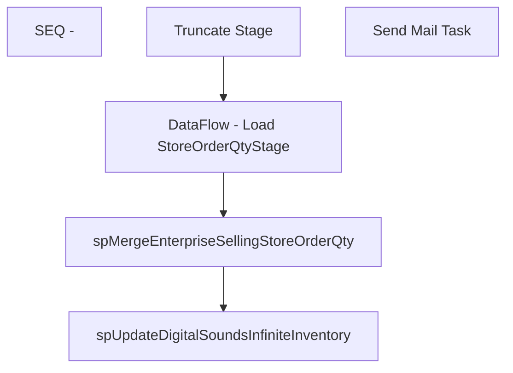

# SSIS Package: EnterpriseSellingInventoryUpdate

**Project:** EnterpriseSellingInventoryUpdate  
**Folder:** EnterpriseSelling  
**Server:** STL-SSIS-P-01  

## Connection Managers

| Name | Type | Server | Catalog | Connection (sanitized) |
|---|---|---|---|---|
| SMTP | SMTP |  |  |  |
| WebOrderProcessing | OLEDB | BEARCLUSTER01.SQL.BUILDABEAR.COM | WebOrderProcessing | Data Source=BEARCLUSTER01.SQL.BUILDABEAR.COM; Initial Catalog=WebOrderProcessing; Provider=SQLNCLI11.1; Integrated Security=SSPI; Auto Translate=False |
| esell | OLEDB | bedrockdb02 | esell | Data Source=bedrockdb02; Initial Catalog=esell; Provider=SQLNCLI11.1; Integrated Security=SSPI; Auto Translate=False |

## Control Flow Tasks

| Task | Type |
|---|---|
| EnterpriseSellingInventoryUpdate | Package |
| SEQ - | SEQUENCE |
| DataFlow - Load StoreOrderQtyStage | Pipeline |
| spMergeEnterpriseSellingStoreOrderQty | ExecuteSQLTask |
| spUpdateDigitalSoundsInfiniteInventory | ExecuteSQLTask |
| Truncate Stage | ExecuteSQLTask |
| Send Mail Task | SendMailTask |

## Control Flow Outline

```text
- Send Mail Task [SendMailTask]
- SEQ - [SEQUENCE]
  - DataFlow - Load StoreOrderQtyStage [Pipeline]
  - Truncate Stage [ExecuteSQLTask]
  - spMergeEnterpriseSellingStoreOrderQty [ExecuteSQLTask]
  - spUpdateDigitalSoundsInfiniteInventory [ExecuteSQLTask]
```

## Architecture Diagram



## Variables

| Namespace | Name | Expression-bound |
|---|---|---|
| System | Propagate | No |
| User | DateTimeStamp | Yes |
| User | EndDate | Yes |
| User | EndDateAsDATE | Yes |
| User | GetDate | Yes |
| User | GetDateAsDATE | Yes |
| User | StartDate | Yes |
| User | StartDateAsDATE | Yes |

### Expression-bound variable values

#### User::DateTimeStamp

**Expression:**

```sql
(DT_WSTR,4)DATEPART("yyyy",GetDate()) 
+ (DT_WSTR,4)DATEPART("mm",GetDate()) 
+ (DT_WSTR,4)DATEPART("dd",GetDate()) 
+ (DT_WSTR,4)DATEPART("hh",GetDate()) 
+ (DT_WSTR,4)DATEPART("mi",GetDate()) 
+ (DT_WSTR,4)DATEPART("ss",GetDate()) 
+ (DT_WSTR,4)DATEPART("ms",GetDate())
```

**Evaluated value:**

```sql
2020428126443
```

#### User::EndDate

**Expression:**

```sql
dateadd("dd", @[$Package::DaysToInclude], @[User::StartDate])
```

**Evaluated value:**

```sql
4/28/2020
```

#### User::EndDateAsDATE

**Expression:**

```sql
(DT_WSTR, 4) datepart("year", @[User::EndDate])  + "-" + 
(DT_WSTR, 2) datepart("mm", @[User::EndDate])  + "-" + 
(DT_WSTR, 2) datepart("dd",  @[User::EndDate])
```

**Evaluated value:**

```sql
2020-4-28
```

#### User::GetDate

**Expression:**

```sql
(DT_DATE)DATEDIFF("Day", (DT_DATE) 0, GETDATE())
```

**Evaluated value:**

```sql
4/28/2020
```

#### User::GetDateAsDATE

**Expression:**

```sql
(DT_WSTR, 4) datepart("year", @[User::GetDate])  + "-" + 
(DT_WSTR, 2) datepart("mm", @[User::GetDate])  + "-" + 
(DT_WSTR, 2) datepart("dd",  @[User::GetDate])
```

**Evaluated value:**

```sql
2020-4-28
```

#### User::StartDate

**Expression:**

```sql
dateadd("dd", -@[$Package::DaysToGoBack] , @[User::GetDate] )
```

**Evaluated value:**

```sql
4/27/2020
```

#### User::StartDateAsDATE

**Expression:**

```sql
(DT_WSTR, 4) datepart("year", @[User::StartDate])  + "-" + 
(DT_WSTR, 2) datepart("mm", @[User::StartDate])  + "-" + 
(DT_WSTR, 2) datepart("dd",  @[User::StartDate])
```

**Evaluated value:**

```sql
2020-4-27
```

## Execute SQL Tasks

### Truncate Stage

**Path:** `Package\SEQ -\Truncate Stage`  
**Connection:** esell (bedrockdb02/esell)  

```sql
TRUNCATE TABLE StoreOrderQtyStage
```

### spMergeEnterpriseSellingStoreOrderQty

**Path:** `Package\SEQ -\spMergeEnterpriseSellingStoreOrderQty`  
**Connection:** esell (bedrockdb02/esell)  

```sql
exec spMergeEnterpriseSellingStoreOrderQty

```

### spUpdateDigitalSoundsInfiniteInventory

**Path:** `Package\SEQ -\spUpdateDigitalSoundsInfiniteInventory`  
**Connection:** esell (bedrockdb02/esell)  

```sql
exec spUpdateDigitalSoundsInfiniteInventory
```

## Data Flow: Sources

| Component | Source Object | Type | Data Flow Task | Connection | SQL Kind |
|---|---|---|---|---|---|
| Web Order Data |  | OLEDBSource | DataFlow - Load StoreOrderQtyStage | WebOrderProcessing | SqlCommand |

#### Web Order Data — SqlCommand

```sql
select 
	o.PickUpStore,
	oi.sku ItemNumber,
	sum(oi.qty) ItemQty
from wm.Orders o with (nolock)
join wm.OrderStatus os with (nolock) 
	on o.OrderID=os.OrderID
	and os.CurrentStatus=1
	and os.[Status] not in ('Cancelled', 'Complete', 'Shipped') 
join wm.OrderItems oi with (nolock) 
	on o.OrderID=oi.OrderID
where 1=1
and isnull(o.PickUpStore,'') not in ('', '2013','0013')
and len(oi.sku) = 6
group by 
	o.PickUpStore,
	oi.sku
```

## Data Flow: Destinations

| Component | Target Table | Type | Data Flow Task | Connection | SQL Kind |
|---|---|---|---|---|---|
| StoreOrderQtyStage |  | OLEDBDestination | DataFlow - Load StoreOrderQtyStage | esell |  |
