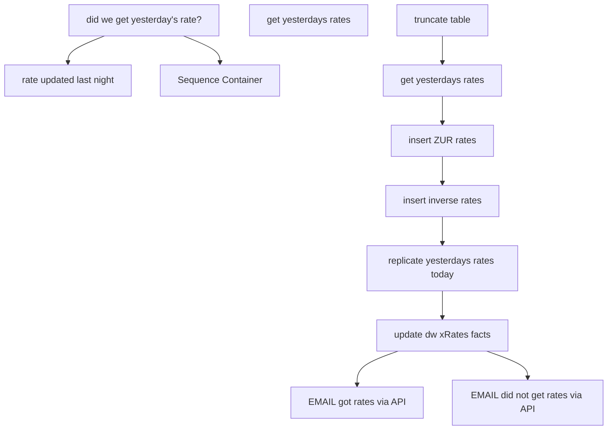

# SSIS Package: Package

**Project:** ERP_xRateDaily  
**Folder:** ExchangeRates  
**Server:** STL-SSIS-P-01  

## Connection Managers

| Name | Type | Server | Catalog | Connection (sanitized) |
|---|---|---|---|---|
| Dynamics AX Connection Manager | DynamicsAX |  |  |  |
| IntegrationStaging | OLEDB | stl-ssis-p-01 | IntegrationStaging | Data Source=stl-ssis-p-01; Initial Catalog=IntegrationStaging; Provider=SQLNCLI11.1; Integrated Security=SSPI; Auto Translate=False |
| SMTP Connection Manager | SMTP |  |  |  |
| papamart.dw | OLEDB | papamart | dw | Data Source=papamart; Initial Catalog=dw; Provider=SQLNCLI11.1; Integrated Security=SSPI; Auto Translate=False |
| papamarttest.dw | OLEDB | papamarttest | dw | Data Source=papamarttest; Initial Catalog=dw; Provider=SQLNCLI11.1; Integrated Security=SSPI; Auto Translate=False |

## Control Flow Tasks

| Task | Type |
|---|---|
| Package | Package |
| did we get yesterday's rate? | ExecuteSQLTask |
| get yesterdays rates | Pipeline |
| rate updated last night | SendMailTask |
| Sequence Container | SEQUENCE |
| EMAIL did not get rates via API | ExecuteSQLTask |
| EMAIL got rates via API | ExecuteSQLTask |
| get yesterdays rates | Pipeline |
| insert inverse rates | ExecuteSQLTask |
| insert ZUR rates | ExecuteSQLTask |
| replicate yesterdays rates today | ExecuteSQLTask |
| truncate table | ExecuteSQLTask |
| update dw xRates facts | Pipeline |

## Control Flow Outline

```text
- Sequence Container [SEQUENCE]
  - EMAIL did not get rates via API [ExecuteSQLTask]
  - EMAIL got rates via API [ExecuteSQLTask]
  - get yesterdays rates [Pipeline]
  - insert ZUR rates [ExecuteSQLTask]
  - insert inverse rates [ExecuteSQLTask]
  - replicate yesterdays rates today [ExecuteSQLTask]
  - truncate table [ExecuteSQLTask]
  - update dw xRates facts [Pipeline]
- did we get yesterday's rate? [ExecuteSQLTask]
- get yesterdays rates [Pipeline]
- rate updated last night [SendMailTask]
```

## Architecture Diagram



## Variables

| Namespace | Name | Expression-bound |
|---|---|---|
| User | varResult | No |
| User | varRowCount | No |
| User | xRateDate | No |

## Execute SQL Tasks

### EMAIL did not get rates via API

**Path:** `Package\Sequence Container\EMAIL did not get rates via API`  
**Connection:** papamart.dw (papamart/dw)  

```sql
exec [dbo].[spEmailExchangeRateAlert] 0
```

### EMAIL got rates via API

**Path:** `Package\Sequence Container\EMAIL got rates via API`  
**Connection:** papamart.dw (papamart/dw)  

```sql
exec [dbo].[spEmailExchangeRateAlert] 1
```

### insert ZUR rates

**Path:** `Package\Sequence Container\insert ZUR rates`  
**Connection:** IntegrationStaging (stl-ssis-p-01/IntegrationStaging)  

```sql
INSERT INTO [dbo].[babw_xRates_daily]([rateDescription],[fromCurrency],[toCurrency],[startDate],[endDate],[rate])
select rateDescription,  'ZUR' as FromCurrency, ToCurrency,StartDate, EndDate, Rate FROM [dbo].[babw_xRates_daily] where fromCurrency = 'EUR' and toCurrency = 'GBP'

INSERT INTO [dbo].[babw_xRates_daily]([rateDescription],[fromCurrency],[toCurrency],[startDate],[endDate],[rate])
select rateDescription,  'ZUR' as FromCurrency,ToCurrency, StartDate, EndDate, Rate FROM [dbo].[babw_xRates_daily] where fromCurrency = 'EUR' and toCurrency = 'USD'

```

### insert inverse rates

**Path:** `Package\Sequence Container\insert inverse rates`  
**Connection:** IntegrationStaging (stl-ssis-p-01/IntegrationStaging)  

```sql
INSERT INTO [dbo].[babw_xRates_daily]([rateDescription],[fromCurrency],[toCurrency],[startDate],[endDate],[rate])
select rateDescription, ToCurrency AS FromCurrency1, FromCurrency AS ToCurrency2, StartDate, EndDate, 1/Rate AS Rate
from [dbo].[babw_xRates_daily]


```

### replicate yesterdays rates today

**Path:** `Package\Sequence Container\replicate yesterdays rates today`  
**Connection:** IntegrationStaging (stl-ssis-p-01/IntegrationStaging)  

```sql
INSERT INTO [dbo].[babw_xRates_daily]([rateDescription],[fromCurrency],[toCurrency],[startDate],[endDate],[rate])
select rateDescription, fromCurrency, toCurrency, dateadd(day, 1, startDate), endDate, rate
from [dbo].[babw_xRates_daily]

```

### truncate table

**Path:** `Package\Sequence Container\truncate table`  
**Connection:** IntegrationStaging (stl-ssis-p-01/IntegrationStaging)  

```sql
truncate table [dbo].[babw_xRates_daily]
```

### did we get yesterday's rate?

**Path:** `Package\did we get yesterday's rate?`  
**Connection:** papamart.dw (papamart/dw)  

```sql
declare @result varchar(10)

if (   
	select sum(bbw_rate) from [dbo].[exchange_rate_facts] where convert(varchar,actual_date, 101) =  convert(varchar,getdate()-1, 101))
	=
	(select sum(bbw_rate) from [dbo].[exchange_rate_facts] where convert(varchar,actual_date, 101) =  convert(varchar,getdate()-2, 101)
	)

 set @result = 'fix'
 else
 set @result = 'ok'
  

  select @result as 'result'

```

## Data Flow: Sources

| Component | Source Object | Type | Data Flow Task | Connection | SQL Kind |
|---|---|---|---|---|---|
| OLE DB Source |  | OLEDBSource | update dw xRates facts | IntegrationStaging | SqlCommand |

#### OLE DB Source — SqlCommand

```sql
select fromCurrency, toCurrency, 
dateadd(hour, -12, CONVERT(VARCHAR(24), CONVERT(DATETIME, startDate, 103), 121)) as startDate,
endDate, Rate from [dbo].[babw_xRates_daily]
```

## Data Flow: Destinations

| Component | Target Table | Type | Data Flow Task | Connection | SQL Kind |
|---|---|---|---|---|---|
| OLE DB Destination |  | OLEDBDestination | get yesterdays rates | IntegrationStaging |  |
| OLE DB Destination |  | OLEDBDestination | get yesterdays rates | IntegrationStaging |  |
