# SSIS Package: CleansePIIRecords

**Project:** RetrieveData  
**Folder:** ForgetMe  
**Server:** STL-SSIS-P-01  

## Architecture Diagram

```mermaid
flowchart TD
    subgraph Connections
        WebOrderProcessing_conn(["WebOrderProcessing [OLEDB]"])
    end
    subgraph ControlFlow
        CleansePIIRecords_task["CleansePIIRecords"]
        Execute_SQL_Task_task["Execute SQL Task"]
        CleansePIIRecords_task --> Execute_SQL_Task_task
        GetEmailList_task["GetEmailList"]
        Execute_SQL_Task_task --> GetEmailList_task
        StepThroughEmails_task["StepThroughEmails"]
        GetEmailList_task --> StepThroughEmails_task
        ListDatabases_task["ListDatabases"]
        StepThroughEmails_task --> ListDatabases_task
        Log_Request_Completion_task["Log Request Completion"]
        ListDatabases_task --> Log_Request_Completion_task
        Step_Through_Databases_task["Step Through Databases"]
        Log_Request_Completion_task --> Step_Through_Databases_task
        ListQueries_task["ListQueries"]
        Step_Through_Databases_task --> ListQueries_task
        StepThroughQueries_task["StepThroughQueries"]
        ListQueries_task --> StepThroughQueries_task
        Execute_SQL_Task_task["Execute SQL Task"]
        StepThroughQueries_task --> Execute_SQL_Task_task
        Flag_no_update_records_as_complete_task["Flag no update records as complete"]
        Execute_SQL_Task_task --> Flag_no_update_records_as_complete_task
        ListRecordsForUpdate_task["ListRecordsForUpdate"]
        Flag_no_update_records_as_complete_task --> ListRecordsForUpdate_task
        Log_Query_completion_task["Log Query completion"]
        ListRecordsForUpdate_task --> Log_Query_completion_task
        Step_Through_Reocrds_task["Step Through Reocrds"]
        Log_Query_completion_task --> Step_Through_Reocrds_task
        Anonymize_Data_task["Anonymize Data"]
        Step_Through_Reocrds_task --> Anonymize_Data_task
        Flag_records_as_complete_task["Flag records as complete"]
        Anonymize_Data_task --> Flag_records_as_complete_task
    end
```

## Connection Managers

| Name | Type |
|---|---|
| WebOrderProcessing | OLEDB |

## Control Flow Tasks

| Task | Type |
|---|---|
| CleansePIIRecords | Microsoft.Package |
| Execute SQL Task | Microsoft.ExecuteSQLTask |
| GetEmailList | Microsoft.ExecuteSQLTask |
| StepThroughEmails | STOCK:FOREACHLOOP |
| ListDatabases | Microsoft.ExecuteSQLTask |
| Log Request Completion | Microsoft.ExecuteSQLTask |
| Step Through Databases | STOCK:FOREACHLOOP |
| ListQueries | Microsoft.ExecuteSQLTask |
| StepThroughQueries | STOCK:FOREACHLOOP |
| Execute SQL Task | Microsoft.ExecuteSQLTask |
| Flag no update records as complete | Microsoft.ExecuteSQLTask |
| ListRecordsForUpdate | Microsoft.ExecuteSQLTask |
| Log Query completion | Microsoft.ExecuteSQLTask |
| Step Through Reocrds | STOCK:FOREACHLOOP |
| Anonymize Data | Microsoft.ExecuteSQLTask |
| Flag records as complete | Microsoft.ExecuteSQLTask |

## Data Flow: Sources

_None detected._

## Data Flow: Destinations

_None detected._

