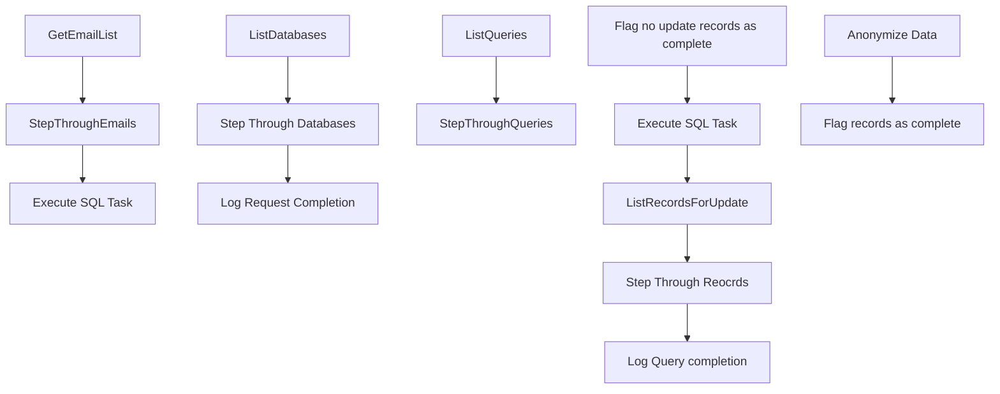

# SSIS Package: CleansePIIRecords

**Project:** RetrieveData  
**Folder:** ForgetMe  
**Server:** STL-SSIS-P-01  

## Connection Managers

| Name | Type | Server | Catalog | Connection (sanitized) |
|---|---|---|---|---|
| WebOrderProcessing | OLEDB | STL-SQL-T-02 | WebOrderProcessing | Data Source=STL-SQL-T-02; Initial Catalog=WebOrderProcessing; Provider=SQLNCLI11.1; Integrated Security=SSPI; Auto Translate=False |

## Control Flow Tasks

| Task | Type |
|---|---|
| CleansePIIRecords | Package |
| Execute SQL Task | ExecuteSQLTask |
| GetEmailList | ExecuteSQLTask |
| StepThroughEmails | FOREACHLOOP |
| ListDatabases | ExecuteSQLTask |
| Log Request Completion | ExecuteSQLTask |
| Step Through Databases | FOREACHLOOP |
| ListQueries | ExecuteSQLTask |
| StepThroughQueries | FOREACHLOOP |
| Execute SQL Task | ExecuteSQLTask |
| Flag no update records as complete | ExecuteSQLTask |
| ListRecordsForUpdate | ExecuteSQLTask |
| Log Query completion | ExecuteSQLTask |
| Step Through Reocrds | FOREACHLOOP |
| Anonymize Data | ExecuteSQLTask |
| Flag records as complete | ExecuteSQLTask |

## Control Flow Outline

```text
- Execute SQL Task [ExecuteSQLTask]
- GetEmailList [ExecuteSQLTask]
- StepThroughEmails [FOREACHLOOP]
  - ListDatabases [ExecuteSQLTask]
  - Log Request Completion [ExecuteSQLTask]
  - Step Through Databases [FOREACHLOOP]
    - ListQueries [ExecuteSQLTask]
    - StepThroughQueries [FOREACHLOOP]
      - Execute SQL Task [ExecuteSQLTask]
      - Flag no update records as complete [ExecuteSQLTask]
      - ListRecordsForUpdate [ExecuteSQLTask]
      - Log Query completion [ExecuteSQLTask]
      - Step Through Reocrds [FOREACHLOOP]
        - Anonymize Data [ExecuteSQLTask]
        - Flag records as complete [ExecuteSQLTask]
```

## Architecture Diagram



## Variables

| Namespace | Name | Expression-bound |
|---|---|---|
| User | ATKeyValue | No |
| User | DataBase | No |
| User | DataBaseList | No |
| User | EmailAddress | No |
| User | EmailAddressinQuotes | Yes |
| User | EmailList | No |
| User | ListKeyValueQuery | Yes |
| User | LocateIDQuery | No |
| User | LocateIDQueryComplete | Yes |
| User | LogKey | No |
| User | QueryID | No |
| User | RecordIDList | No |
| User | RecordKey | No |
| User | Server | No |
| User | TableKey | No |
| User | TableList | No |
| User | TableName | No |
| User | Variable | No |

### Expression-bound variable values

#### User::EmailAddressinQuotes

**Expression:**

```sql
"'"+  @[User::EmailAddress] + "'"
```

**Evaluated value:**

```sql
''John.eck868@gmail.com''
```

#### User::ListKeyValueQuery

**Expression:**

```sql
"select atkeyValue from ActionLog where recordKey =" + (DT_WSTR, 30) @[User::RecordKey] + " and AQKey = " + (DT_WSTR, 20) @[User::QueryID]
```

**Evaluated value:**

```sql
select atkeyValue from ActionLog where recordKey =asdfghjklqwertyuiopzxcvbnm and AQKey = 1
```

#### User::LocateIDQueryComplete

**Expression:**

```sql
@[User::LocateIDQuery] + "'" +    @[User::ATKeyValue]  + "'"
```

**Evaluated value:**

```sql
select 'Testaaaaaaaaaaaaaaaaaaaaaaaaaaaaaaaaaaaaaaaaaaaaaa' AS ATKeyValue,GetDate() as ActionDate  from wm.Orders where BillToemail = ''
```

## Execute SQL Tasks

### Execute SQL Task

**Path:** `Package\Execute SQL Task`  
**Connection:** {6FA14CFB-85E5-4B98-9F6B-66F903719E85}  

```sql
Update actionStatus
set CompletionDate = GetDate()
where completionDate is NULL and actionrequestID = 1
and recordKey in (select recordkey from vwOpenRequests where ReviewStatus = 'REview Complete')
```

### GetEmailList

**Path:** `Package\GetEmailList`  
**Connection:** {6FA14CFB-85E5-4B98-9F6B-66F903719E85}  

```sql
select emailAddress, s.RecordKey from ActionStatus S Left Join (
select S.RecordKey,Q.AQKey
from actionStatus S cross join actionQuery Q
                  left join RequestCompletionLog  L on (q.AQKey = l.AqKey and S.RecordKey = l.RecordKey)
Where validationDate is not null and RequestLogID is null and CleanseRecordQuery in( 'Manual' , 'API CALL')
and FindRecordQuery <> 'Unknown'

) C  on S.REcordKey = C.RecordKey
Left Join (select RecordKey from actionLog where RemoveData is null group by recordKey) D on S.RecordKey = D.RecordKey
 where-- c.recordKey is null and 
 ValidationDate is not null and completionDate is null and d.RecordKey is null and  RecordsFlaggedDate is not null 
 and actionRequestID = 0
```

### ListDatabases

**Path:** `Package\StepThroughEmails\ListDatabases`  
**Connection:** {6FA14CFB-85E5-4B98-9F6B-66F903719E85}  

```sql
SELECT DISTINCT ServerName, DBName
from ActionTables where servername not in ('3RDPARTY',
'MANUAL')
```

### Log Request Completion

**Path:** `Package\StepThroughEmails\Log Request Completion`  
**Connection:** {6FA14CFB-85E5-4B98-9F6B-66F903719E85}  

```sql
update ActionStatus Set CompletionDate = GetDate() where emailAddress = ?
```

### ListQueries

**Path:** `Package\StepThroughEmails\Step Through Databases\ListQueries`  
**Connection:** {6FA14CFB-85E5-4B98-9F6B-66F903719E85}  

```sql
select TableName,T.ATKey,CleanseRecordQuery,AQKey
 from actionTables T inner join ActionQuery Q 
   on T.ATKey = Q.ATKey
where DBName = ? and ServerName = ?
and CleanseRecordQuery <> 'APICALL' and AQKey <> 21
```

### Execute SQL Task

**Path:** `Package\StepThroughEmails\Step Through Databases\StepThroughQueries\Execute SQL Task`  
**Connection:** {6FA14CFB-85E5-4B98-9F6B-66F903719E85}  

```sql
insert into Queryrunlog select ?, getDate()
```

### Flag no update records as complete

**Path:** `Package\StepThroughEmails\Step Through Databases\StepThroughQueries\Flag no update records as complete`  
**Connection:** {6FA14CFB-85E5-4B98-9F6B-66F903719E85}  

```sql
Update ActionLog 
set RemoveDate = GetDate()
where RecordKey = ? and AQKey = ? and RemoveData = 0
```

### ListRecordsForUpdate

**Path:** `Package\StepThroughEmails\Step Through Databases\StepThroughQueries\ListRecordsForUpdate`  
**Connection:** {6FA14CFB-85E5-4B98-9F6B-66F903719E85}  

```sql
SELECT        ATKeyValue, LogKey
FROM            ActionLog AS L
WHERE        (RecordKey = ?) AND (AQKey = ?) AND (RemoveData = 1) and RemoveDate is null
```

### Log Query completion

**Path:** `Package\StepThroughEmails\Step Through Databases\StepThroughQueries\Log Query completion`  
**Connection:** {6FA14CFB-85E5-4B98-9F6B-66F903719E85}  

```sql
Insert into 
RequestCompletionLog 
Select ? , ? , 1
```

### Anonymize Data

**Path:** `Package\StepThroughEmails\Step Through Databases\StepThroughQueries\Step Through Reocrds\Anonymize Data`  
**Connection:** WebOrderProcessing (STL-SQL-T-02/WebOrderProcessing)  

```sql
User::LocateIDQueryComplete
```

### Flag records as complete

**Path:** `Package\StepThroughEmails\Step Through Databases\StepThroughQueries\Step Through Reocrds\Flag records as complete`  
**Connection:** {6FA14CFB-85E5-4B98-9F6B-66F903719E85}  

```sql
Update ActionLog 
set RemoveDate = GetDate()
where LogKey = ? 
```

## Data Flow: Sources

_None detected._

## Data Flow: Destinations

_None detected._
