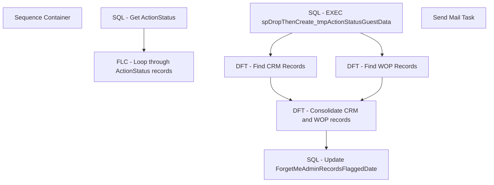

# SSIS Package: LoadAdminReviewRecords

**Project:** RetrieveData  
**Folder:** ForgetMe  
**Server:** STL-SSIS-P-01  

## Connection Managers

| Name | Type | Server | Catalog | Connection (sanitized) |
|---|---|---|---|---|
| CRM | OLEDB | stl-crmdb-p-01 | crm | Data Source=stl-crmdb-p-01; Initial Catalog=crm; Provider=SQLNCLI11.1; Integrated Security=SSPI; Auto Translate=False |
| SMTP | SMTP |  |  |  |
| WebOrderProcessing | OLEDB | stl-sql-t-02 | WebOrderProcessing | Data Source=stl-sql-t-02; Initial Catalog=WebOrderProcessing; Provider=SQLNCLI11.1; Integrated Security=SSPI; Auto Translate=False |

## Control Flow Tasks

| Task | Type |
|---|---|
| LoadAdminReviewRecords | Package |
| Sequence Container | SEQUENCE |
| FLC - Loop through ActionStatus records | FOREACHLOOP |
| DFT - Consolidate CRM and WOP records | Pipeline |
| DFT - Find CRM Records | Pipeline |
| DFT - Find WOP Records | Pipeline |
| SQL - EXEC spDropThenCreate_tmpActionStatusGuestData | ExecuteSQLTask |
| SQL - Update ForgetMeAdminRecordsFlaggedDate | ExecuteSQLTask |
| SQL - Get ActionStatus | ExecuteSQLTask |
| Send Mail Task | SendMailTask |

## Control Flow Outline

```text
- Send Mail Task [SendMailTask]
- Sequence Container [SEQUENCE]
  - FLC - Loop through ActionStatus records [FOREACHLOOP]
    - DFT - Consolidate CRM and WOP records [Pipeline]
    - DFT - Find CRM Records [Pipeline]
    - DFT - Find WOP Records [Pipeline]
    - SQL - EXEC spDropThenCreate_tmpActionStatusGuestData [ExecuteSQLTask]
    - SQL - Update ForgetMeAdminRecordsFlaggedDate [ExecuteSQLTask]
  - SQL - Get ActionStatus [ExecuteSQLTask]
```

## Architecture Diagram



## Variables

| Namespace | Name | Expression-bound |
|---|---|---|
| System | Propagate | No |
| User | Address1 | No |
| User | Address2 | No |
| User | AddressMatchKey | No |
| User | City | No |
| User | DateTimeStamp | Yes |
| User | EmailAddress | No |
| User | EndDate | Yes |
| User | EndDateAsDATE | Yes |
| User | FirstName | No |
| User | ForgetMeAdminRecords | No |
| User | GetDate | Yes |
| User | GetDateAsDATE | Yes |
| User | GuestDataTypeIDCRM | No |
| User | GuestDataTypeIDWOP | No |
| User | LastName | No |
| User | PhoneNumber | No |
| User | PostalCode | No |
| User | RecordKey | No |
| User | StartDate | Yes |
| User | StartDateAsDATE | Yes |
| User | State | No |

### Expression-bound variable values

#### User::DateTimeStamp

**Expression:**

```sql
(DT_WSTR,4)DATEPART("yyyy",GetDate()) 
+ (DT_WSTR,4)DATEPART("mm",GetDate()) 
+ (DT_WSTR,4)DATEPART("dd",GetDate()) 
+ (DT_WSTR,4)DATEPART("hh",GetDate()) 
+ (DT_WSTR,4)DATEPART("mi",GetDate()) 
+ (DT_WSTR,4)DATEPART("ss",GetDate()) 
+ (DT_WSTR,4)DATEPART("ms",GetDate())
```

**Evaluated value:**

```sql
2020630121039683
```

#### User::EndDate

**Expression:**

```sql
dateadd("dd", @[$Package::DaysToInclude], @[User::StartDate])
```

**Evaluated value:**

```sql
6/30/2020
```

#### User::EndDateAsDATE

**Expression:**

```sql
(DT_WSTR, 4) datepart("year", @[User::EndDate])  + "-" + 
(DT_WSTR, 2) datepart("mm", @[User::EndDate])  + "-" + 
(DT_WSTR, 2) datepart("dd",  @[User::EndDate])
```

**Evaluated value:**

```sql
2020-6-30
```

#### User::GetDate

**Expression:**

```sql
(DT_DATE)DATEDIFF("Day", (DT_DATE) 0, GETDATE())
```

**Evaluated value:**

```sql
6/30/2020
```

#### User::GetDateAsDATE

**Expression:**

```sql
(DT_WSTR, 4) datepart("year", @[User::GetDate])  + "-" + 
(DT_WSTR, 2) datepart("mm", @[User::GetDate])  + "-" + 
(DT_WSTR, 2) datepart("dd",  @[User::GetDate])
```

**Evaluated value:**

```sql
2020-6-30
```

#### User::StartDate

**Expression:**

```sql
dateadd("dd", -@[$Package::DaysToGoBack] , @[User::GetDate] )
```

**Evaluated value:**

```sql
6/29/2020
```

#### User::StartDateAsDATE

**Expression:**

```sql
(DT_WSTR, 4) datepart("year", @[User::StartDate])  + "-" + 
(DT_WSTR, 2) datepart("mm", @[User::StartDate])  + "-" + 
(DT_WSTR, 2) datepart("dd",  @[User::StartDate])
```

**Evaluated value:**

```sql
2020-6-29
```

## Execute SQL Tasks

### SQL - EXEC spDropThenCreate_tmpActionStatusGuestData

**Path:** `Package\Sequence Container\FLC - Loop through ActionStatus records\SQL - EXEC spDropThenCreate_tmpActionStatusGuestData`  
**Connection:** {6FA14CFB-85E5-4B98-9F6B-66F903719E85}  

```sql
EXEC spDropThenCreate_tmpActionStatusGuestData
```

### SQL - Update ForgetMeAdminRecordsFlaggedDate

**Path:** `Package\Sequence Container\FLC - Loop through ActionStatus records\SQL - Update ForgetMeAdminRecordsFlaggedDate`  
**Connection:** {6FA14CFB-85E5-4B98-9F6B-66F903719E85}  

```sql
  UPDATE [BABWForgetMe].[dbo].[ActionStatus]
  SET ForgetMeAdminRecordsFlaggedDate = GETDATE()
  WHERE RecordKey = ?
```

### SQL - Get ActionStatus

**Path:** `Package\Sequence Container\SQL - Get ActionStatus`  
**Connection:** {6FA14CFB-85E5-4B98-9F6B-66F903719E85}  

```sql
    SELECT [RecordKey]
      ,[EmailAddress]
      ,ISNULL([FirstName], '') AS 'FirstName'
      ,ISNULL([LastName], '') AS 'LastName'
      ,ISNULL([Address1], '-12345') AS 'Address1'
      ,ISNULL([Address2], '') AS 'Address2'
      ,ISNULL([City], '') AS 'City'
      ,ISNULL([State], '') AS 'State'
      ,ISNULL([PostalCode], '-12345') AS 'PostalCode'
      ,REPLACE(REPLACE(ISNULL([PhoneNumber], '-12345'), '-', ''), ' ', '') AS 'PhoneNumber'
	  ,LEFT(REPLACE(ISNULL(PostalCode,'-1234'), ' ', ''), 5) + LEFT(LEFT(LTRIM(ISNULL(Address1, '-1234')), CHARINDEX(' ', LTRIM(ISNULL(Address1, '-1234')))) + '        ', 8) + UPPER(LEFT(LEFT(LTRIM(RTRIM(SUBSTRING(LTRIM(ISNULL(Address1, '-1234')), CHARINDEX(' ', LTRIM(ISNULL(Address1, '-1234'))) + 1, LEN(LTRIM(ISNULL(Address1, '-1234')))))), 5) + '            ', 12)) AS 'AddressMatchKey'
  FROM [BABWForgetMe].[dbo].[ActionStatus]
  WHERE ValidationDate IS NOT NULL AND ForgetMeAdminRecordsFlaggedDate IS NULL
```

## Data Flow: Sources

| Component | Source Object | Type | Data Flow Task | Connection | SQL Kind |
|---|---|---|---|---|---|
| Distinct tmpActionStatusGuestData Records |  | OLEDBSource | DFT - Consolidate CRM and WOP records | {6FA14CFB-85E5-4B98-9F6B-66F903719E85}:external | SqlCommand |
| CRM Address Records |  | OLEDBSource | DFT - Find CRM Records | CRM | SqlCommand |
| CRM Email Records |  | OLEDBSource | DFT - Find CRM Records | CRM | SqlCommand |
| CRM Phone Records |  | OLEDBSource | DFT - Find CRM Records | CRM | SqlCommand |
| WOP BillTo Address Records |  | OLEDBSource | DFT - Find WOP Records | WebOrderProcessing | SqlCommand |
| WOP BillTo Email Records |  | OLEDBSource | DFT - Find WOP Records | WebOrderProcessing | SqlCommand |
| WOP BillTo Phone Records |  | OLEDBSource | DFT - Find WOP Records | WebOrderProcessing | SqlCommand |
| WOP ShipTo Address Records |  | OLEDBSource | DFT - Find WOP Records | WebOrderProcessing | SqlCommand |
| WOP ShipTo Phone Records |  | OLEDBSource | DFT - Find WOP Records | WebOrderProcessing | SqlCommand |
| WOP ShipTo Records |  | OLEDBSource | DFT - Find WOP Records | WebOrderProcessing | SqlCommand |

#### Distinct tmpActionStatusGuestData Records — SqlCommand

```sql
SELECT DISTINCT [RecordKey]
      ,[GuestDataTypeID]
      ,[FirstName]
      ,[LastName]
      ,[Address1]
      ,[Address2]
      ,[City]
      ,[State]
      ,[PostalCode]
      ,[Country]
      ,[Phone]
  FROM [BABWForgetMe].[dbo].[tmpActionStatusGuestData]
```

#### CRM Address Records — SqlCommand

```sql
SELECT cust.first_name
      ,cust.last_name
      ,[address_1]
      ,[address_2]
	  ,[address_3] AS 'City'
	  ,[address_4] AS 'State'
	  ,[post_code]
      ,addr.[country_code]
      --,[address_match_key]
      ,phone.telephone_no
  FROM [crm].[dbo].[address] addr
  INNER JOIN [crm].[dbo].[customer] cust ON addr.customer_id = cust.customer_id
  INNER JOIN [crm].[dbo].[phone] ON phone.customer_id = cust.customer_id
  WHERE addr.address_match_key = ?
```

#### CRM Email Records — SqlCommand

```sql
SELECT cust.first_name
      ,cust.last_name
      ,[address_1]
      ,[address_2]
	  ,[address_3] AS 'City'
	  ,[address_4] AS 'State'
	  ,[post_code]
      ,addr.[country_code]
      ,phone.telephone_no
  FROM [crm].[dbo].[address] addr
  INNER JOIN [crm].[dbo].[customer] cust ON addr.customer_id = cust.customer_id
  INNER JOIN [crm].[dbo].[phone] ON phone.customer_id = cust.customer_id
  INNER JOIN [crm].[dbo].[email] ON email.customer_id = cust.customer_id
  WHERE email_address = ?
```

#### CRM Phone Records — SqlCommand

```sql
SELECT cust.first_name
      ,cust.last_name
      ,[address_1]
      ,[address_2]
	  ,[address_3] AS 'City'
	  ,[address_4] AS 'State'
	  ,[post_code]
      ,addr.[country_code]
      --,[address_match_key]
      ,phone.telephone_no
  FROM [crm].[dbo].[address] addr
  INNER JOIN [crm].[dbo].[customer] cust ON addr.customer_id = cust.customer_id
  INNER JOIN [crm].[dbo].[phone] ON phone.customer_id = cust.customer_id
  WHERE phone.telephone_no = ?
```

#### WOP BillTo Address Records — SqlCommand

```sql
DECLARE @address VARCHAR(20), @postalCode VARCHAR(10)
SET @address = ?
SET @postalCode = ?

SELECT CAST([BillToFName] AS NVARCHAR(20)) AS 'first_name'
      ,CAST([BillToLName] AS NVARCHAR(50)) AS 'last_name'
      ,CAST([BillToAddress1] AS NVARCHAR(100)) AS 'address_1'
      ,CAST([BillToAddress2] AS NVARCHAR(100)) AS 'address_2'
      ,CAST([BillToCity] AS NVARCHAR(50)) AS 'city'
      ,CAST([BillToState] AS NVARCHAR(50)) AS 'state'
      ,CAST([BillToPostalCode] AS NVARCHAR(20)) AS 'post_code'
      ,CAST([BillToCountry] AS NVARCHAR(30)) AS 'country_code'
      ,CAST([BillToPhone] AS NVARCHAR(20)) AS 'telephone_no'
  FROM [WebOrderProcessing].[WM].[Orders] WITH (NOLOCK)
  WHERE BillToaddress1 LIKE (LEFT(LTRIM(@address), CHARINDEX(' ', LTRIM(@address))) + LEFT(LTRIM(RTRIM(SUBSTRING(LTRIM(@address), CHARINDEX(' ', LTRIM(@address)) + 1, LEN(LTRIM(@address))))), 5) + '%') AND BillToPostalCode LIKE (LEFT(@postalCode, 5) + '%')
```

#### WOP BillTo Email Records — SqlCommand

```sql
SELECT CAST([BillToFName] AS NVARCHAR(20)) AS 'first_name'
      ,CAST([BillToLName] AS NVARCHAR(50)) AS 'last_name'
      ,CAST([BillToAddress1] AS NVARCHAR(100)) AS 'address_1'
      ,CAST([BillToAddress2] AS NVARCHAR(100)) AS 'address_2'
      ,CAST([BillToCity] AS NVARCHAR(50)) AS 'city'
      ,CAST([BillToState] AS NVARCHAR(50)) AS 'state'
      ,CAST([BillToPostalCode] AS NVARCHAR(20)) AS 'post_code'
      ,CAST([BillToCountry] AS NVARCHAR(30)) AS 'country_code'
      ,CAST([BillToPhone] AS NVARCHAR(20)) AS 'telephone_no'
  FROM [WebOrderProcessing].[WM].[Orders] WITH (NOLOCK)
  WHERE BillToEmail = ?
```

#### WOP BillTo Phone Records — SqlCommand

```sql
SELECT CAST([BillToFName] AS NVARCHAR(20)) AS 'first_name'
      ,CAST([BillToLName] AS NVARCHAR(50)) AS 'last_name'
      ,CAST([BillToAddress1] AS NVARCHAR(100)) AS 'address_1'
      ,CAST([BillToAddress2] AS NVARCHAR(100)) AS 'address_2'
      ,CAST([BillToCity] AS NVARCHAR(50)) AS 'city'
      ,CAST([BillToState] AS NVARCHAR(50)) AS 'state'
      ,CAST([BillToPostalCode] AS NVARCHAR(20)) AS 'post_code'
      ,CAST([BillToCountry] AS NVARCHAR(30)) AS 'country_code'
      ,CAST([BillToPhone] AS NVARCHAR(20)) AS 'telephone_no'
  FROM [WebOrderProcessing].[WM].[Orders] WITH (NOLOCK)
  WHERE REPLACE(REPLACE(BillToPhone, '-', ''), ' ', '') = ?
```

#### WOP ShipTo Address Records — SqlCommand

```sql
DECLARE @address VARCHAR(20), @postalCode VARCHAR(10)
SET @address = ?
SET @postalCode = ?

SELECT CAST([ShipToFName] AS NVARCHAR(20)) AS 'first_name'
      ,CAST([ShipToLName] AS NVARCHAR(50)) AS 'last_name'
      ,CAST([ShipToAddress1] AS NVARCHAR(100)) AS 'address_1'
      ,CAST([ShipToAddress2] AS NVARCHAR(100)) AS 'address_2'
      ,CAST([ShipToCity] AS NVARCHAR(50)) AS 'city'
      ,CAST([ShipToState] AS NVARCHAR(50)) AS 'state'
      ,CAST([ShipToPostalCode] AS NVARCHAR(20)) AS 'post_code'
      ,CAST([ShipToCountry] AS NVARCHAR(30)) AS 'country_code'
      ,CAST([ShipToPhone] AS NVARCHAR(20)) AS 'telephone_no'
  FROM [WebOrderProcessing].[WM].[Orders] WITH (NOLOCK)
  WHERE ShipToaddress1 LIKE (LEFT(LTRIM(@address), CHARINDEX(' ', LTRIM(@address))) + LEFT(LTRIM(RTRIM(SUBSTRING(LTRIM(@address), CHARINDEX(' ', LTRIM(@address)) + 1, LEN(LTRIM(@address))))), 5) + '%') AND ShipToPostalCode LIKE (LEFT(@postalCode, 5) + '%')
```

#### WOP ShipTo Phone Records — SqlCommand

```sql
SELECT CAST([ShipToFName] AS NVARCHAR(20)) AS 'first_name'
      ,CAST([ShipToLName] AS NVARCHAR(50)) AS 'last_name'
      ,CAST([ShipToAddress1] AS NVARCHAR(100)) AS 'address_1'
      ,CAST([ShipToAddress2] AS NVARCHAR(100)) AS 'address_2'
      ,CAST([ShipToCity] AS NVARCHAR(50)) AS 'city'
      ,CAST([ShipToState] AS NVARCHAR(50)) AS 'state'
      ,CAST([ShipToPostalCode] AS NVARCHAR(20)) AS 'post_code'
      ,CAST([ShipToCountry] AS NVARCHAR(30)) AS 'country_code'
      ,CAST([ShipToPhone] AS NVARCHAR(20)) AS 'telephone_no'
  FROM [WebOrderProcessing].[WM].[Orders] WITH (NOLOCK)
  WHERE REPLACE(REPLACE(ShipToPhone, '-', ''), ' ', '') = ?
```

#### WOP ShipTo Records — SqlCommand

```sql
SELECT CAST([ShipToFName] AS NVARCHAR(20)) AS 'first_name'
      ,CAST([ShipToLName] AS NVARCHAR(50)) AS 'last_name'
      ,CAST([ShipToAddress1] AS NVARCHAR(100)) AS 'address_1'
      ,CAST([ShipToAddress2] AS NVARCHAR(100)) AS 'address_2'
      ,CAST([ShipToCity] AS NVARCHAR(50)) AS 'city'
      ,CAST([ShipToState] AS NVARCHAR(50)) AS 'state'
      ,CAST([ShipToPostalCode] AS NVARCHAR(20)) AS 'post_code'
      ,CAST([ShipToCountry] AS NVARCHAR(30)) AS 'country_code'
      ,CAST([ShipToPhone] AS NVARCHAR(20)) AS 'telephone_no'
  FROM [WebOrderProcessing].[WM].[Orders] WITH (NOLOCK)
  WHERE ShipToEmail = ?
```

## Data Flow: Destinations

| Component | Target Table | Type | Data Flow Task | Connection | SQL Kind |
|---|---|---|---|---|---|
| Insert ActionStatusGuestData |  | OLEDBDestination | DFT - Consolidate CRM and WOP records | {6FA14CFB-85E5-4B98-9F6B-66F903719E85}:external |  |
| Insert 1 tmpActionStatusGuestData |  | OLEDBDestination | DFT - Find CRM Records | {6FA14CFB-85E5-4B98-9F6B-66F903719E85}:external |  |
| Insert 2 tmpActionStatusGuestData |  | OLEDBDestination | DFT - Find CRM Records | {6FA14CFB-85E5-4B98-9F6B-66F903719E85}:external |  |
| Insert 3 tmpActionStatusGuestData |  | OLEDBDestination | DFT - Find CRM Records | {6FA14CFB-85E5-4B98-9F6B-66F903719E85}:external |  |
| Insert 1 tmpActionStatusGuestData |  | OLEDBDestination | DFT - Find WOP Records | {6FA14CFB-85E5-4B98-9F6B-66F903719E85}:external |  |
| Insert 2 tmpActionStatusGuestData |  | OLEDBDestination | DFT - Find WOP Records | {6FA14CFB-85E5-4B98-9F6B-66F903719E85}:external |  |
| Insert 3 tmpActionStatusGuestData |  | OLEDBDestination | DFT - Find WOP Records | {6FA14CFB-85E5-4B98-9F6B-66F903719E85}:external |  |
| Insert 4 tmpActionStatusGuestData |  | OLEDBDestination | DFT - Find WOP Records | {6FA14CFB-85E5-4B98-9F6B-66F903719E85}:external |  |
| Insert 5 tmpActionStatusGuestData |  | OLEDBDestination | DFT - Find WOP Records | {6FA14CFB-85E5-4B98-9F6B-66F903719E85}:external |  |
| Insert 6 tmpActionStatusGuestData |  | OLEDBDestination | DFT - Find WOP Records | {6FA14CFB-85E5-4B98-9F6B-66F903719E85}:external |  |
