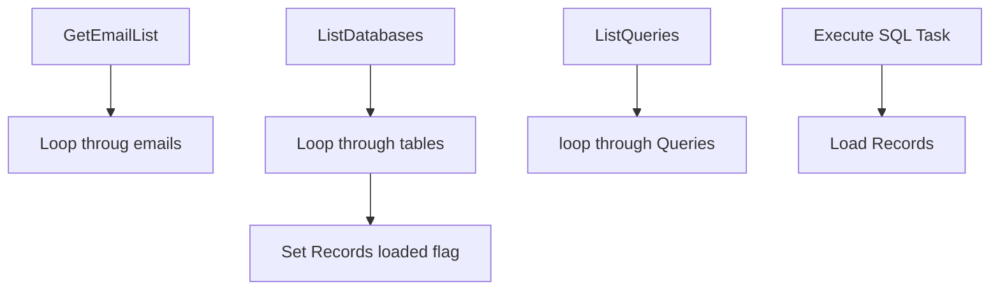

# SSIS Package: LoadPIIRecords

**Project:** RetrieveData  
**Folder:** ForgetMe  
**Server:** STL-SSIS-P-01  

## Connection Managers

| Name | Type | Server | Catalog | Connection (sanitized) |
|---|---|---|---|---|
| STL-SQL-T-02.WebOrderProcessing | OLEDB | STL-SQL-T-02 | WebOrderProcessing | Data Source=STL-SQL-T-02; Initial Catalog=WebOrderProcessing; Provider=SQLNCLI11.1; Integrated Security=SSPI; Auto Translate=False |

## Control Flow Tasks

| Task | Type |
|---|---|
| LoadPIIRecords | Package |
| GetEmailList | ExecuteSQLTask |
| Loop throug emails | FOREACHLOOP |
| ListDatabases | ExecuteSQLTask |
| Loop through tables | FOREACHLOOP |
| ListQueries | ExecuteSQLTask |
| loop through Queries | FOREACHLOOP |
| Execute SQL Task | ExecuteSQLTask |
| Load Records | Pipeline |
| Set Records loaded flag | ExecuteSQLTask |

## Control Flow Outline

```text
- GetEmailList [ExecuteSQLTask]
- Loop throug emails [FOREACHLOOP]
  - ListDatabases [ExecuteSQLTask]
  - Loop through tables [FOREACHLOOP]
    - ListQueries [ExecuteSQLTask]
    - loop through Queries [FOREACHLOOP]
      - Execute SQL Task [ExecuteSQLTask]
      - Load Records [Pipeline]
  - Set Records loaded flag [ExecuteSQLTask]
```

## Architecture Diagram



## Variables

| Namespace | Name | Expression-bound |
|---|---|---|
| User | DataBase | No |
| User | DataBaseList | No |
| User | EmailAddress | No |
| User | EmailAddressinQuotes | Yes |
| User | EmailList | No |
| User | LocateIDQuery | No |
| User | LocateIDQueryComplete | Yes |
| User | QueryID | No |
| User | RecordKey | No |
| User | Server | No |
| User | TableKey | No |
| User | TableList | No |
| User | TableName | No |

### Expression-bound variable values

#### User::EmailAddressinQuotes

**Expression:**

```sql
"'"+  @[User::EmailAddress] + "'"
```

**Evaluated value:**

```sql
''John.eck868@gmail.com''
```

#### User::LocateIDQueryComplete

**Expression:**

```sql
@[User::LocateIDQuery] +   @[User::EmailAddressinQuotes]
```

**Evaluated value:**

```sql
select 'Testaaaaaaaaaaaaaaaaaaaaaaaaaaaaaaaaaaaaaaaaaaaaaa' AS ATKeyValue,GetDate() as ActionDate  from wm.Orders where BillToemail = ''John.eck868@gmail.com''
```

## Execute SQL Tasks

### GetEmailList

**Path:** `Package\GetEmailList`  
**Connection:** {6FA14CFB-85E5-4B98-9F6B-66F903719E85}  

```sql
select emailAddress,RecordKey from ActionStatus where RecordsFlaggedDate is null and ForgetMeAdminValidationDate is not null and  validationresponseID = 1
```

### ListDatabases

**Path:** `Package\Loop throug emails\ListDatabases`  
**Connection:** {6FA14CFB-85E5-4B98-9F6B-66F903719E85}  

```sql
SELECT DISTINCT ServerName, DBName
from ActionTables where isProduction <= ?
and servername not in ('3RDPARTY','Manual')
```

### ListQueries

**Path:** `Package\Loop throug emails\Loop through tables\ListQueries`  
**Connection:** {6FA14CFB-85E5-4B98-9F6B-66F903719E85}  

```sql
select TableName,T.ATKey,FindRecordQuery,AQKey
 from actionTables T inner join ActionQuery Q 
   on T.ATKey = Q.ATKey
where DBName = ? and ServerName = ?
and findRecordQuery not in ('APICALL','Unknown','Manual')
and aqkey <> 65

```

### Execute SQL Task

**Path:** `Package\Loop throug emails\Loop through tables\loop through Queries\Execute SQL Task`  
**Connection:** {6FA14CFB-85E5-4B98-9F6B-66F903719E85}  

```sql
insert into Queryrunlog select ?, getDate()
```

### Set Records loaded flag

**Path:** `Package\Loop throug emails\Set Records loaded flag`  
**Connection:** {6FA14CFB-85E5-4B98-9F6B-66F903719E85}  

```sql
update ActionStatus Set RecordsFlaggedDate = GetDate() where emailAddress = ?
```

## Data Flow: Sources

| Component | Source Object | Type | Data Flow Task | Connection | SQL Kind |
|---|---|---|---|---|---|
| OLE DB Source |  | OLEDBSource | Load Records | STL-SQL-T-02.WebOrderProcessing |  |

## Data Flow: Destinations

| Component | Target Table | Type | Data Flow Task | Connection | SQL Kind |
|---|---|---|---|---|---|
| OLE DB Destination |  | OLEDBDestination | Load Records | {6FA14CFB-85E5-4B98-9F6B-66F903719E85}:external |  |
