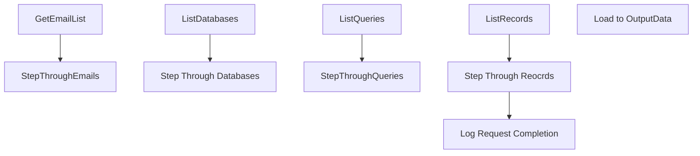

# SSIS Package: LoadRetrieveMe

**Project:** RetrieveData  
**Folder:** ForgetMe  
**Server:** STL-SSIS-P-01  

## Connection Managers

| Name | Type | Server | Catalog | Connection (sanitized) |
|---|---|---|---|---|
| STL-SQL-T-02.WebOrderProcessing | OLEDB | STL-SQL-T-02 | WebOrderProcessing | Data Source=STL-SQL-T-02; Initial Catalog=WebOrderProcessing; Provider=SQLNCLI11.1; Integrated Security=SSPI; Auto Translate=False |

## Control Flow Tasks

| Task | Type |
|---|---|
| LoadRetrieveMe | Package |
| GetEmailList | ExecuteSQLTask |
| StepThroughEmails | FOREACHLOOP |
| ListDatabases | ExecuteSQLTask |
| Step Through Databases | FOREACHLOOP |
| ListQueries | ExecuteSQLTask |
| StepThroughQueries | FOREACHLOOP |
| ListRecords | ExecuteSQLTask |
| Log Request Completion | ExecuteSQLTask |
| Step Through Reocrds | FOREACHLOOP |
| Load to OutputData | Pipeline |

## Control Flow Outline

```text
- GetEmailList [ExecuteSQLTask]
- StepThroughEmails [FOREACHLOOP]
  - ListDatabases [ExecuteSQLTask]
  - Step Through Databases [FOREACHLOOP]
    - ListQueries [ExecuteSQLTask]
    - StepThroughQueries [FOREACHLOOP]
      - ListRecords [ExecuteSQLTask]
      - Log Request Completion [ExecuteSQLTask]
      - Step Through Reocrds [FOREACHLOOP]
        - Load to OutputData [Pipeline]
```

## Architecture Diagram



## Variables

| Namespace | Name | Expression-bound |
|---|---|---|
| RequestType | Variable | No |
| User | ATKeyValue | No |
| User | DataBase | No |
| User | DataBaseList | No |
| User | EmailAddress | No |
| User | EmailAddressinQuotes | Yes |
| User | EmailList | No |
| User | ListKeyValueQuery | Yes |
| User | LoadREtrieveQComplete | Yes |
| User | LoadRetriveQuery | No |
| User | LocateIDQuery | No |
| User | LocateIDQueryComplete | Yes |
| User | LogKey | No |
| User | QueryID | No |
| User | RecordIDList | No |
| User | RecordKey | No |
| User | Server | No |
| User | TableKey | No |
| User | TableList | No |
| User | TableName | No |

### Expression-bound variable values

#### User::EmailAddressinQuotes

**Expression:**

```sql
"'"+  @[User::EmailAddress] + "'"
```

**Evaluated value:**

```sql
''John.eck868@gmail.com''
```

#### User::ListKeyValueQuery

**Expression:**

```sql
"select atkeyValue from ActionLog where recordKey =" + (DT_WSTR, 30) @[User::RecordKey] + " and AQKey = " + (DT_WSTR, 20) @[User::QueryID]
```

**Evaluated value:**

```sql
select atkeyValue from ActionLog where recordKey =aaaaaaaaaaaaaaaaaaaaaaaaZZA and AQKey = 1
```

#### User::LoadREtrieveQComplete

**Expression:**

```sql
@[User::LoadRetriveQuery] + "'" +  @[User::ATKeyValue] + "'"
```

**Evaluated value:**

```sql
select  BillToFname FirstName,BillToLName LastName,BillToPhone PrimaryPhone,Null AS SecondaryPhone,BillToemail EmailAddress ,  BillToAddress1 Address1 ,BillToAddress2 Address2,Null AS Address3, BillToCity City,BillToState State,  BillToPostalCode ZipCode,BillToCountry Country   from  wm.Orders  where OrderID ='aaaaaaaaaaaaaaaaaaaaaaaaaaaaaaaaaaaaaaaaaaaaaaaaaaaaaaaaaaaaaaaaaaaaaaaaaaaaaaaaaaaaaaaaaaaaaaaaaaaaaaaaaaaaaaaaaaaaaaaaaaaaaaaaaaaaaaaaaaaaaaaaaaaaaaaaaaa'
```

#### User::LocateIDQueryComplete

**Expression:**

```sql
@[User::LocateIDQuery] + "'" +    @[User::ATKeyValue]  + "'"
```

**Evaluated value:**

```sql
select 'Testaaaaaaaaaaaaaaaaaaaaaaaaaaaaaaaaaaaaaaaaaaaaaa' AS ATKeyValue,GetDate() as ActionDate  from wm.Orders where BillToemail = 'aaaaaaaaaaaaaaaaaaaaaaaaaaaaaaaaaaaaaaaaaaaaaaaaaaaaaaaaaaaaaaaaaaaaaaaaaaaaaaaaaaaaaaaaaaaaaaaaaaaaaaaaaaaaaaaaaaaaaaaaaaaaaaaaaaaaaaaaaaaaaaaaaaaaaaaaaaa'
```

## Execute SQL Tasks

### GetEmailList

**Path:** `Package\GetEmailList`  
**Connection:** {6FA14CFB-85E5-4B98-9F6B-66F903719E85}  

```sql
select emailAddress,RecordKey,ActionRequestName
 from ActionStatus s
inner join actionRequest r on s.actionrequestid = r.actionrequestid
where validationresponseID = 1 and recordsFlaggedDate >= GetDate() -2 and completionDate is null
```

### ListDatabases

**Path:** `Package\StepThroughEmails\ListDatabases`  
**Connection:** {6FA14CFB-85E5-4B98-9F6B-66F903719E85}  

```sql
SELECT DISTINCT ServerName, DBName
from ActionTables where servername not in ('3RDPARTY',
'MANUAL')
```

### ListQueries

**Path:** `Package\StepThroughEmails\Step Through Databases\ListQueries`  
**Connection:** {6FA14CFB-85E5-4B98-9F6B-66F903719E85}  

```sql
select TableName,T.ATKey,RetrieveRecordQuery,AQKey
 from actionTables T inner join ActionQuery Q 
   on T.ATKey = Q.ATKey
where DBName = ? and ServerName = ? and 
RetrieveRecordQuery not in ( 'APICALL','Manual')
```

### ListRecords

**Path:** `Package\StepThroughEmails\Step Through Databases\StepThroughQueries\ListRecords`  
**Connection:** {6FA14CFB-85E5-4B98-9F6B-66F903719E85}  

```sql
Select ATKeyValue,LogKey from ActionLog where RecordKey = ? and AQKey = ?
```

### Log Request Completion

**Path:** `Package\StepThroughEmails\Step Through Databases\StepThroughQueries\Log Request Completion`  
**Connection:** {6FA14CFB-85E5-4B98-9F6B-66F903719E85}  

```sql

select RecordKey , ? , 1
from actionStatus s inner join actionRequest R
on s.actionRequestID = r.actionrequestID
where
 recordkey = ?
```

## Data Flow: Sources

| Component | Source Object | Type | Data Flow Task | Connection | SQL Kind |
|---|---|---|---|---|---|
| OLE DB Source |  | OLEDBSource | Load to OutputData | STL-SQL-T-02.WebOrderProcessing |  |

## Data Flow: Destinations

| Component | Target Table | Type | Data Flow Task | Connection | SQL Kind |
|---|---|---|---|---|---|
| OLE DB Destination |  | OLEDBDestination | Load to OutputData | {6FA14CFB-85E5-4B98-9F6B-66F903719E85}:external |  |
