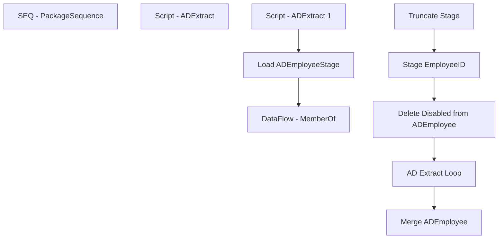

# SSIS Package: HR_ADEmployeeExtract

**Project:** HR_ADEmployeeExtract  
**Folder:** HR  
**Server:** STL-SSIS-P-01  

## Connection Managers

| Name | Type | Server | Catalog | Connection (sanitized) |
|---|---|---|---|---|
| DW | OLEDB | papamart | dw | Data Source=papamart; Initial Catalog=dw; Provider=SQLNCLI11.1; Integrated Security=SSPI; Auto Translate=False |
| DWStaging | OLEDB | papamart | DWStaging | Data Source=papamart; Initial Catalog=DWStaging; Provider=SQLNCLI11.1; Integrated Security=SSPI; Auto Translate=False |

## Control Flow Tasks

| Task | Type |
|---|---|
| HR_ADEmployeeExtract | Package |
| SEQ - PackageSequence | SEQUENCE |
| AD Extract Loop | FOREACHLOOP |
| DataFlow - MemberOf | Pipeline |
| Load ADEmployeeStage | ExecuteSQLTask |
| Script - ADExtract | ScriptTask |
| Script - ADExtract 1 | ScriptTask |
| Delete Disabled from ADEmployee | ExecuteSQLTask |
| Merge ADEmployee | ExecuteSQLTask |
| Stage EmployeeID | ExecuteSQLTask |
| Truncate Stage | ExecuteSQLTask |

## Control Flow Outline

```text
- SEQ - PackageSequence [SEQUENCE]
  - AD Extract Loop [FOREACHLOOP]
    - DataFlow - MemberOf [Pipeline]
    - Load ADEmployeeStage [ExecuteSQLTask]
    - Script - ADExtract [ScriptTask]
    - Script - ADExtract 1 [ScriptTask]
  - Delete Disabled from ADEmployee [ExecuteSQLTask]
  - Merge ADEmployee [ExecuteSQLTask]
  - Stage EmployeeID [ExecuteSQLTask]
  - Truncate Stage [ExecuteSQLTask]
```

## Architecture Diagram



## Variables

| Namespace | Name | Expression-bound |
|---|---|---|
| User | DateTimeStamp | Yes |
| User | EmployeeIDStage | No |
| User | EndDate | Yes |
| User | EndDateAsDate | Yes |
| User | GetDate | Yes |
| User | GetDateAsDate | Yes |
| User | SQL_MemberOfQuery | Yes |
| User | StartDate | Yes |
| User | StartDateAsDate | Yes |
| User | ad_EmployeeID | No |
| User | ad_cn | No |
| User | ad_company | No |
| User | ad_department | No |
| User | ad_description | No |
| User | ad_displayName | No |
| User | ad_givenname | No |
| User | ad_mail | No |
| User | ad_manager | No |
| User | ad_memberOf | No |
| User | ad_samaccountName | No |
| User | ad_sn | No |
| User | ad_title | No |

### Expression-bound variable values

#### User::DateTimeStamp

**Expression:**

```sql
(DT_WSTR,4)DATEPART("yyyy",GetDate()) 
+ (DT_WSTR,4)DATEPART("mm",GetDate()) 
+ (DT_WSTR,4)DATEPART("dd",GetDate()) 
+ (DT_WSTR,4)DATEPART("hh",GetDate()) 
+ (DT_WSTR,4)DATEPART("mi",GetDate()) 
+ (DT_WSTR,4)DATEPART("ss",GetDate()) 
+ (DT_WSTR,4)DATEPART("ms",GetDate())
```

**Evaluated value:**

```sql
20212191723640
```

#### User::EndDate

**Expression:**

```sql
dateadd("dd", @[$Package::DaysToInclude], @[User::StartDate])
```

**Evaluated value:**

```sql
2/19/2021
```

#### User::EndDateAsDate

**Expression:**

```sql
(DT_WSTR, 4) datepart("year", @[User::EndDate])  + "-" + 
(DT_WSTR, 2) datepart("mm", @[User::EndDate])  + "-" + 
(DT_WSTR, 2) datepart("dd",  @[User::EndDate])
```

**Evaluated value:**

```sql
2021-2-19
```

#### User::GetDate

**Expression:**

```sql
(DT_DATE)DATEDIFF("Day", (DT_DATE) 0, GETDATE())
```

**Evaluated value:**

```sql
2/19/2021
```

#### User::GetDateAsDate

**Expression:**

```sql
(DT_WSTR, 4) datepart("year", @[User::GetDate])  + "-" + 
(DT_WSTR, 2) datepart("mm", @[User::GetDate])  + "-" + 
(DT_WSTR, 2) datepart("dd",  @[User::GetDate])
```

**Evaluated value:**

```sql
2021-2-19
```

#### User::SQL_MemberOfQuery

**Expression:**

```sql
"
SELECT cast('" + @[User::ad_EmployeeID] + "' as nvarchar(7))  as EmployeeID, cast(replace(ADsPath, 'LDAP://', '') as nvarchar(4000)) as memberOf 
FROM OPENQUERY
	(
		ADSI, 
            'SELECT * FROM ''LDAP://DC=buildabear,DC=com'' 
             WHERE employeeID = ''" + @[User::ad_EmployeeID] + "'''
	)  
"
```

**Evaluated value:**

```sql

SELECT cast('' as nvarchar(7))  as EmployeeID, cast(replace(ADsPath, 'LDAP://', '') as nvarchar(4000)) as memberOf 
FROM OPENQUERY
	(
		ADSI, 
            'SELECT * FROM ''LDAP://DC=buildabear,DC=com'' 
             WHERE employeeID = '''''
	)  

```

#### User::StartDate

**Expression:**

```sql
dateadd("dd", -@[$Package::DaysToGoBack] , @[User::GetDate] )
```

**Evaluated value:**

```sql
2/18/2021
```

#### User::StartDateAsDate

**Expression:**

```sql
(DT_WSTR, 4) datepart("year", @[User::StartDate])  + "-" + 
(DT_WSTR, 2) datepart("mm", @[User::StartDate])  + "-" + 
(DT_WSTR, 2) datepart("dd",  @[User::StartDate])
```

**Evaluated value:**

```sql
2021-2-18
```

## Execute SQL Tasks

### Load ADEmployeeStage

**Path:** `Package\SEQ - PackageSequence\AD Extract Loop\Load ADEmployeeStage`  
**Connection:** DWStaging (papamart/DWStaging)  

```sql
with stage as 
(
select 
? as EmployeeID, 
? as cn, 
? as company, 
? as description, 
? as displayName, 
? as mail, 
? as manager, 
? as samaccountName, 
? as sn,
? as Department,
? as givenname,
? as memberOf,
? as Title
)

insert ADEmployeeStage 
select *
from Stage
/*
where 
 (
  samaccountName is not NULL
  and samaccountName <> ''
  and len(samaccountName) > 0
  and samaccountName <> 'no data'
 )
OR
 (
  mail is not NULL
  and mail <> ''
  and len(mail) > 0
  and mail <> 'no data'
  and mail like '@buildabear%'
 )
*/
```

### Delete Disabled from ADEmployee

**Path:** `Package\SEQ - PackageSequence\Delete Disabled from ADEmployee`  
**Connection:** DW (papamart/dw)  

```sql
with 
Staged as
 (
  select EmployeeID
  from vwUltiProStageFromAD
  UNION
  select distinct SupervisorID as EmployeeID
  from UHCMEMP
  where supervisorID is not null
  and SupervisorID not in (select EmployeeID from ADEmployee)
  UNION
  select EmployeeID
  from ADEmployee
  where memberof like '%disabled%'
  UNION
  select eepeeid as EmployeeID
  from uhcmemp
  where datediff(dd, isnull(UpdateDate, InsertDate), getdate()) = 0
 )
delete from ADEmployee
where EmployeeID in (select EmployeeID from Staged)

```

### Merge ADEmployee

**Path:** `Package\SEQ - PackageSequence\Merge ADEmployee`  
**Connection:** DWStaging (papamart/DWStaging)  

```sql
exec spMergeADEmployee
```

### Stage EmployeeID

**Path:** `Package\SEQ - PackageSequence\Stage EmployeeID`  
**Connection:** DW (papamart/dw)  

```sql
/*
select EepEEID from UHCMEmp where EepEEID in ('0065401','0065402','0065403','0065404','0065405','0065406','0065407')
*/

select EmployeeID
from vwUltiProStageFromAD
UNION
select distinct SupervisorID as EmployeeID
from UHCMEMP
where supervisorID is not null
and SupervisorID not in (select EmployeeID from ADEmployee)
and EepCompanyCode <> 'BABUK'
UNION
select EmployeeID
from ADEmployee
where memberof like '%disabled%'
UNION
select eepeeid as EmployeeID
from uhcmemp
where datediff(dd, isnull(UpdateDate, InsertDate), getdate()) = 0
and EepCompanyCode <> 'BABUK'
union
select eepeeid as EmployeeID
from uhcmemp
where sAMAccountName is null and EecEmplStatus = 'Active'
and EepCompanyCode <> 'BABUK'

```

### Truncate Stage

**Path:** `Package\SEQ - PackageSequence\Truncate Stage`  
**Connection:** DWStaging (papamart/DWStaging)  

```sql
TRUNCATE TABLE ADEmployeeStage
```

## Data Flow: Sources

| Component | Source Object | Type | Data Flow Task | Connection | SQL Kind |
|---|---|---|---|---|---|
| LDAP |  | OLEDBSource | DataFlow - MemberOf | DW |  |

## Data Flow: Destinations

_None detected._
