# SSIS Package: HR_Core_ETL

**Project:** HR_Core_ETL  
**Folder:** HR  
**Server:** STL-SSIS-P-01  

## Connection Managers

| Name | Type | Server | Catalog | Connection (sanitized) |
|---|---|---|---|---|
| Archive | FILE |  |  |  |
| Auditworks | OLEDB | bedrockdb01 | auditworks | Data Source=bedrockdb01; Initial Catalog=auditworks; Provider=SQLNCLI11.1; Integrated Security=SSPI; Auto Translate=False |
| BABWMstrData | OLEDB | Kodiak | BABWMstrData | Data Source=Kodiak; Initial Catalog=BABWMstrData; Provider=SQLNCLI11.1; Integrated Security=SSPI; Auto Translate=False |
| CRM | OLEDB | STL_CRMDB_P_01 | crm | Data Source=STL_CRMDB_P_01; Initial Catalog=crm; Provider=SQLNCLI11.1; Integrated Security=SSPI; Auto Translate=False |
| DW | OLEDB | papamart | dw | Data Source=papamart; Initial Catalog=dw; Provider=SQLNCLI11.1; Integrated Security=SSPI; Auto Translate=False |
| DWStaging | OLEDB | papamart | DWStaging | Data Source=papamart; Initial Catalog=DWStaging; Provider=SQLNCLI11.1; Integrated Security=SSPI; Auto Translate=False |
| EmployeeCSV | FLATFILE |  |  |  |
| Flat File Connection Manager | FLATFILE |  |  |  |
| Flat File Connection Manager 1 | FLATFILE |  |  |  |
| IntegrationStaging | OLEDB | STL-SSIS-p-01 | IntegrationStaging | Data Source=STL-SSIS-p-01; Initial Catalog=IntegrationStaging; Provider=SQLNCLI11.1; Integrated Security=SSPI; Auto Translate=False |
| ME_01 | OLEDB | bedrockdb02 | me_01 | Data Source=bedrockdb02; Initial Catalog=me_01; Provider=SQLNCLI11.1; Integrated Security=SSPI; Auto Translate=False |
| SMTP | SMTP |  |  |  |
| StoreCSV | FLATFILE |  |  |  |
| StoreMaster | FILE |  |  |  |
| UHCM | FILE |  |  |  |
| workbrain | OLEDB | labordb01 | workbrainProd | Data Source=labordb01; Initial Catalog=workbrainProd; Provider=SQLNCLI11.1; Integrated Security=SSPI; Auto Translate=False |

## Control Flow Tasks

| Task | Type |
|---|---|
| HR_Core_ETL | Package |
| Sequence Container | SEQUENCE |
| Populate BABWMstrData dbo STR_INFO | ExecuteSQLTask |
| Update STR_DIM DMS_MSA | ExecuteSQLTask |
| Stage File Data Sequence | SEQUENCE |
| Employee Foreach Loop | FOREACHLOOP |
| Archive Files | FileSystemTask |
| Merge Data | ExecuteSQLTask |
| Stage Data | Pipeline |
| Truncate Stage | ExecuteSQLTask |
| Move EMP Files from SFTP | FOREACHLOOP |
| Move Emp Files | FileSystemTask |
| Move Store Files from SFTP | FOREACHLOOP |
| Move Store Files | FileSystemTask |
| Store Foreach Loop | FOREACHLOOP |
| Archive Files | FileSystemTask |
| Merge Data | ExecuteSQLTask |
| Stage Data | Pipeline |
| Truncate Stage | ExecuteSQLTask |
| Store MDM Integration Contact and Role Dim | SEQUENCE |
| CNTC | SEQUENCE |
| Merge Into Contact Dim | ExecuteSQLTask |
| Stage to MasterData CNTC | Pipeline |
| Truncate Stage CNTC | ExecuteSQLTask |
| Role | SEQUENCE |
| Merge Into Role Dim | ExecuteSQLTask |
| Stage to MasterData Roles | Pipeline |
| Truncate Stage ROLE | ExecuteSQLTask |
| Store CNTC | SEQUENCE |
| fix staged nulls | ExecuteSQLTask |
| Merge into StoreCntc Dim | ExecuteSQLTask |
| Stage to masterData StoreCNTC | Pipeline |
| Truncate Stage Table | ExecuteSQLTask |
| WorkBrain Store Schedule Integration | SEQUENCE |
| Merge into Store Hr Dim | ExecuteSQLTask |
| Merge into Store Temp HR Dim | ExecuteSQLTask |
| Stage Store Default Hours | Pipeline |
| Stage Store Temp Hours | Pipeline |
| Truncate Stage Hrs | ExecuteSQLTask |
| Truncate Stage Temp Hrs | ExecuteSQLTask |
| Send Mail Task | SendMailTask |

## Control Flow Outline

```text
- Send Mail Task [SendMailTask]
- Sequence Container [SEQUENCE]
  - Populate BABWMstrData dbo STR_INFO [ExecuteSQLTask]
  - Update STR_DIM DMS_MSA [ExecuteSQLTask]
- Stage File Data Sequence [SEQUENCE]
  - Employee Foreach Loop [FOREACHLOOP]
    - Archive Files [FileSystemTask]
    - Merge Data [ExecuteSQLTask]
    - Stage Data [Pipeline]
    - Truncate Stage [ExecuteSQLTask]
  - Move EMP Files from SFTP [FOREACHLOOP]
    - Move Emp Files [FileSystemTask]
  - Move Store Files from SFTP [FOREACHLOOP]
    - Move Store Files [FileSystemTask]
  - Store Foreach Loop [FOREACHLOOP]
    - Archive Files [FileSystemTask]
    - Merge Data [ExecuteSQLTask]
    - Stage Data [Pipeline]
    - Truncate Stage [ExecuteSQLTask]
- Store MDM Integration Contact and Role Dim [SEQUENCE]
  - CNTC [SEQUENCE]
    - Merge Into Contact Dim [ExecuteSQLTask]
    - Stage to MasterData CNTC [Pipeline]
    - Truncate Stage CNTC [ExecuteSQLTask]
  - Role [SEQUENCE]
    - Merge Into Role Dim [ExecuteSQLTask]
    - Stage to MasterData Roles [Pipeline]
    - Truncate Stage ROLE [ExecuteSQLTask]
  - Store CNTC [SEQUENCE]
    - Merge into StoreCntc Dim [ExecuteSQLTask]
    - Stage to masterData StoreCNTC [Pipeline]
    - Truncate Stage Table [ExecuteSQLTask]
    - fix staged nulls [ExecuteSQLTask]
- WorkBrain Store Schedule Integration [SEQUENCE]
  - Merge into Store Hr Dim [ExecuteSQLTask]
  - Merge into Store Temp HR Dim [ExecuteSQLTask]
  - Stage Store Default Hours [Pipeline]
  - Stage Store Temp Hours [Pipeline]
  - Truncate Stage Hrs [ExecuteSQLTask]
  - Truncate Stage Temp Hrs [ExecuteSQLTask]
```

## Architecture Diagram

```mermaid
flowchart TD
    n_Package_Sequence_Container["Sequence Container"]
    n_Package_Sequence_Container_Populate_BABWMstrData_dbo_STR_INFO["Populate BABWMstrData dbo STR_INFO"]
    n_Package_Sequence_Container_Update_STR_DIM_DMS_MSA["Update STR_DIM DMS_MSA"]
    n_Package_Stage_File_Data_Sequence["Stage File Data Sequence"]
    n_Package_Stage_File_Data_Sequence_Employee_Foreach_Loop["Employee Foreach Loop"]
    n_Package_Stage_File_Data_Sequence_Employee_Foreach_Loop_Archive_Files["Archive Files"]
    n_Package_Stage_File_Data_Sequence_Employee_Foreach_Loop_Merge_Data["Merge Data"]
    n_Package_Stage_File_Data_Sequence_Employee_Foreach_Loop_Stage_Data["Stage Data"]
    n_Package_Stage_File_Data_Sequence_Employee_Foreach_Loop_Truncate_Stage["Truncate Stage"]
    n_Package_Stage_File_Data_Sequence_Move_EMP_Files_from_SFTP["Move EMP Files from SFTP"]
    n_Package_Stage_File_Data_Sequence_Move_EMP_Files_from_SFTP_Move_Emp_Files["Move Emp Files"]
    n_Package_Stage_File_Data_Sequence_Move_Store_Files_from_SFTP["Move Store Files from SFTP"]
    n_Package_Stage_File_Data_Sequence_Move_Store_Files_from_SFTP_Move_Store_Files["Move Store Files"]
    n_Package_Stage_File_Data_Sequence_Store_Foreach_Loop["Store Foreach Loop"]
    n_Package_Stage_File_Data_Sequence_Store_Foreach_Loop_Archive_Files["Archive Files"]
    n_Package_Stage_File_Data_Sequence_Store_Foreach_Loop_Merge_Data["Merge Data"]
    n_Package_Stage_File_Data_Sequence_Store_Foreach_Loop_Stage_Data["Stage Data"]
    n_Package_Stage_File_Data_Sequence_Store_Foreach_Loop_Truncate_Stage["Truncate Stage"]
    n_Package_Store_MDM_Integration_Contact_and_Role_Dim["Store MDM Integration Contact and Role Dim"]
    n_Package_Store_MDM_Integration_Contact_and_Role_Dim_CNTC["CNTC"]
    n_Package_Store_MDM_Integration_Contact_and_Role_Dim_CNTC_Merge_Into_Contact_Dim["Merge Into Contact Dim"]
    n_Package_Store_MDM_Integration_Contact_and_Role_Dim_CNTC_Stage_to_MasterData_CNTC["Stage to MasterData CNTC"]
    n_Package_Store_MDM_Integration_Contact_and_Role_Dim_CNTC_Truncate_Stage_CNTC["Truncate Stage CNTC"]
    n_Package_Store_MDM_Integration_Contact_and_Role_Dim_Role["Role"]
    n_Package_Store_MDM_Integration_Contact_and_Role_Dim_Role_Merge_Into_Role_Dim["Merge Into Role Dim"]
    n_Package_Store_MDM_Integration_Contact_and_Role_Dim_Role_Stage_to_MasterData_Roles["Stage to MasterData Roles"]
    n_Package_Store_MDM_Integration_Contact_and_Role_Dim_Role_Truncate_Stage_ROLE["Truncate Stage ROLE"]
    n_Package_Store_MDM_Integration_Contact_and_Role_Dim_Store_CNTC["Store CNTC"]
    n_Package_Store_MDM_Integration_Contact_and_Role_Dim_Store_CNTC_fix_staged_nulls["fix staged nulls"]
    n_Package_Store_MDM_Integration_Contact_and_Role_Dim_Store_CNTC_Merge_into_StoreCntc_Dim["Merge into StoreCntc Dim"]
    n_Package_Store_MDM_Integration_Contact_and_Role_Dim_Store_CNTC_Stage_to_masterData_StoreCNTC["Stage to masterData StoreCNTC"]
    n_Package_Store_MDM_Integration_Contact_and_Role_Dim_Store_CNTC_Truncate_Stage_Table["Truncate Stage Table"]
    n_Package_WorkBrain_Store_Schedule_Integration["WorkBrain Store Schedule Integration"]
    n_Package_WorkBrain_Store_Schedule_Integration_Merge_into_Store_Hr_Dim["Merge into Store Hr Dim"]
    n_Package_WorkBrain_Store_Schedule_Integration_Merge_into_Store_Temp_HR_Dim["Merge into Store Temp HR Dim"]
    n_Package_WorkBrain_Store_Schedule_Integration_Stage_Store_Default_Hours["Stage Store Default Hours"]
    n_Package_WorkBrain_Store_Schedule_Integration_Stage_Store_Temp_Hours["Stage Store Temp Hours"]
    n_Package_WorkBrain_Store_Schedule_Integration_Truncate_Stage_Hrs["Truncate Stage Hrs"]
    n_Package_WorkBrain_Store_Schedule_Integration_Truncate_Stage_Temp_Hrs["Truncate Stage Temp Hrs"]
    n_Package_EventHandlers_OnError__Send_Mail_Task["Send Mail Task"]
    n_Package_Sequence_Container_Update_STR_DIM_DMS_MSA --> n_Package_Sequence_Container_Populate_BABWMstrData_dbo_STR_INFO
    n_Package_Stage_File_Data_Sequence_Employee_Foreach_Loop_Truncate_Stage --> n_Package_Stage_File_Data_Sequence_Employee_Foreach_Loop_Stage_Data
    n_Package_Stage_File_Data_Sequence_Employee_Foreach_Loop_Stage_Data --> n_Package_Stage_File_Data_Sequence_Employee_Foreach_Loop_Archive_Files
    n_Package_Stage_File_Data_Sequence_Employee_Foreach_Loop_Archive_Files --> n_Package_Stage_File_Data_Sequence_Employee_Foreach_Loop_Merge_Data
    n_Package_Stage_File_Data_Sequence_Store_Foreach_Loop_Truncate_Stage --> n_Package_Stage_File_Data_Sequence_Store_Foreach_Loop_Stage_Data
    n_Package_Stage_File_Data_Sequence_Store_Foreach_Loop_Stage_Data --> n_Package_Stage_File_Data_Sequence_Store_Foreach_Loop_Archive_Files
    n_Package_Stage_File_Data_Sequence_Store_Foreach_Loop_Archive_Files --> n_Package_Stage_File_Data_Sequence_Store_Foreach_Loop_Merge_Data
    n_Package_Stage_File_Data_Sequence_Move_Store_Files_from_SFTP --> n_Package_Stage_File_Data_Sequence_Store_Foreach_Loop
    n_Package_Stage_File_Data_Sequence_Move_EMP_Files_from_SFTP --> n_Package_Stage_File_Data_Sequence_Employee_Foreach_Loop
    n_Package_Store_MDM_Integration_Contact_and_Role_Dim_CNTC_Stage_to_MasterData_CNTC --> n_Package_Store_MDM_Integration_Contact_and_Role_Dim_CNTC_Merge_Into_Contact_Dim
    n_Package_Store_MDM_Integration_Contact_and_Role_Dim_CNTC_Truncate_Stage_CNTC --> n_Package_Store_MDM_Integration_Contact_and_Role_Dim_CNTC_Stage_to_MasterData_CNTC
    n_Package_Store_MDM_Integration_Contact_and_Role_Dim_Role_Stage_to_MasterData_Roles --> n_Package_Store_MDM_Integration_Contact_and_Role_Dim_Role_Merge_Into_Role_Dim
    n_Package_Store_MDM_Integration_Contact_and_Role_Dim_Role_Truncate_Stage_ROLE --> n_Package_Store_MDM_Integration_Contact_and_Role_Dim_Role_Stage_to_MasterData_Roles
    n_Package_Store_MDM_Integration_Contact_and_Role_Dim_Store_CNTC_Truncate_Stage_Table --> n_Package_Store_MDM_Integration_Contact_and_Role_Dim_Store_CNTC_Stage_to_masterData_StoreCNTC
    n_Package_Store_MDM_Integration_Contact_and_Role_Dim_Store_CNTC_Stage_to_masterData_StoreCNTC --> n_Package_Store_MDM_Integration_Contact_and_Role_Dim_Store_CNTC_Merge_into_StoreCntc_Dim
    n_Package_Store_MDM_Integration_Contact_and_Role_Dim_Role --> n_Package_Store_MDM_Integration_Contact_and_Role_Dim_CNTC
    n_Package_Store_MDM_Integration_Contact_and_Role_Dim_CNTC --> n_Package_Store_MDM_Integration_Contact_and_Role_Dim_Store_CNTC
    n_Package_WorkBrain_Store_Schedule_Integration_Truncate_Stage_Hrs --> n_Package_WorkBrain_Store_Schedule_Integration_Stage_Store_Default_Hours
    n_Package_WorkBrain_Store_Schedule_Integration_Stage_Store_Default_Hours --> n_Package_WorkBrain_Store_Schedule_Integration_Merge_into_Store_Hr_Dim
    n_Package_WorkBrain_Store_Schedule_Integration_Truncate_Stage_Temp_Hrs --> n_Package_WorkBrain_Store_Schedule_Integration_Stage_Store_Temp_Hours
    n_Package_WorkBrain_Store_Schedule_Integration_Stage_Store_Temp_Hours --> n_Package_WorkBrain_Store_Schedule_Integration_Merge_into_Store_Temp_HR_Dim
    n_Package_Stage_File_Data_Sequence --> n_Package_Store_MDM_Integration_Contact_and_Role_Dim
    n_Package_Store_MDM_Integration_Contact_and_Role_Dim --> n_Package_WorkBrain_Store_Schedule_Integration
    n_Package_WorkBrain_Store_Schedule_Integration --> n_Package_Sequence_Container
```



## Variables

| Namespace | Name | Expression-bound |
|---|---|---|
| System | Propagate | No |
| User | DateTimeStamp | Yes |
| User | EMPLOYEE_FileName | No |
| User | EmpMaster | No |
| User | EndDate | Yes |
| User | EndDateAsDATE | Yes |
| User | GetDate | Yes |
| User | GetDateAsDATE | Yes |
| User | StartDate | Yes |
| User | StartDateAsDATE | Yes |
| User | StoreMaster | No |
| User | Store_FileName | No |
| User | Store_FileRename | Yes |

### Expression-bound variable values

#### User::DateTimeStamp

**Expression:**

```sql
(DT_WSTR,4)DATEPART("yyyy",GetDate()) 
+ (DT_WSTR,4)DATEPART("mm",GetDate()) 
+ (DT_WSTR,4)DATEPART("dd",GetDate()) 
+ (DT_WSTR,4)DATEPART("hh",GetDate()) 
+ (DT_WSTR,4)DATEPART("mi",GetDate()) 
+ (DT_WSTR,4)DATEPART("ss",GetDate()) 
+ (DT_WSTR,4)DATEPART("ms",GetDate())
```

**Evaluated value:**

```sql
2022126163014310
```

#### User::EndDate

**Expression:**

```sql
dateadd("dd", @[$Package::DaysToInclude], @[User::StartDate])
```

**Evaluated value:**

```sql
1/26/2022
```

#### User::EndDateAsDATE

**Expression:**

```sql
(DT_WSTR, 4) datepart("year", @[User::EndDate])  + "-" + 
(DT_WSTR, 2) datepart("mm", @[User::EndDate])  + "-" + 
(DT_WSTR, 2) datepart("dd",  @[User::EndDate])
```

**Evaluated value:**

```sql
2022-1-26
```

#### User::GetDate

**Expression:**

```sql
(DT_DATE)DATEDIFF("Day", (DT_DATE) 0, GETDATE())
```

**Evaluated value:**

```sql
1/26/2022
```

#### User::GetDateAsDATE

**Expression:**

```sql
(DT_WSTR, 4) datepart("year", @[User::GetDate])  + "-" + 
(DT_WSTR, 2) datepart("mm", @[User::GetDate])  + "-" + 
(DT_WSTR, 2) datepart("dd",  @[User::GetDate])
```

**Evaluated value:**

```sql
2022-1-26
```

#### User::StartDate

**Expression:**

```sql
dateadd("dd", -@[$Package::DaysToGoBack] , @[User::GetDate] )
```

**Evaluated value:**

```sql
1/25/2022
```

#### User::StartDateAsDATE

**Expression:**

```sql
(DT_WSTR, 4) datepart("year", @[User::StartDate])  + "-" + 
(DT_WSTR, 2) datepart("mm", @[User::StartDate])  + "-" + 
(DT_WSTR, 2) datepart("dd",  @[User::StartDate])
```

**Evaluated value:**

```sql
2022-1-25
```

#### User::Store_FileRename

**Expression:**

```sql
@[$Package::UHCM_FileStage] + "Archive\\" + @[User::Store_FileName]
```

**Evaluated value:**

```sql
\\stl-ssis-p-01\IntegrationStaging\HR\UHCM\Archive\
```

## Execute SQL Tasks

### Populate BABWMstrData dbo STR_INFO

**Path:** `Package\Sequence Container\Populate BABWMstrData dbo STR_INFO`  
**Connection:** BABWMstrData (Kodiak/BABWMstrData)  

```sql
EXEC dbo.STR_GET_Info
```

### Update STR_DIM DMS_MSA

**Path:** `Package\Sequence Container\Update STR_DIM DMS_MSA`  
**Connection:** BABWMstrData (Kodiak/BABWMstrData)  

```sql
exec spMDM_OutlookImport_DMS_MSA_UPDATE
```

### Merge Data

**Path:** `Package\Stage File Data Sequence\Employee Foreach Loop\Merge Data`  
**Connection:** DWStaging (papamart/DWStaging)  

```sql
exec spMergeUHCMEmp
```

### Truncate Stage

**Path:** `Package\Stage File Data Sequence\Employee Foreach Loop\Truncate Stage`  
**Connection:** DWStaging (papamart/DWStaging)  

```sql
Truncate Table UHCMEmpStage
```

### Merge Data

**Path:** `Package\Stage File Data Sequence\Store Foreach Loop\Merge Data`  
**Connection:** DWStaging (papamart/DWStaging)  

```sql
exec spMergeUHCMStore
```

### Truncate Stage

**Path:** `Package\Stage File Data Sequence\Store Foreach Loop\Truncate Stage`  
**Connection:** DWStaging (papamart/DWStaging)  

```sql
truncate table UHCM_StoreStage
```

### Merge Into Contact Dim

**Path:** `Package\Store MDM Integration Contact and Role Dim\CNTC\Merge Into Contact Dim`  
**Connection:** BABWMstrData (Kodiak/BABWMstrData)  

```sql
exec spMergeCNTCTDimMDM
```

### Truncate Stage CNTC

**Path:** `Package\Store MDM Integration Contact and Role Dim\CNTC\Truncate Stage CNTC`  
**Connection:** BABWMstrData (Kodiak/BABWMstrData)  

```sql
Truncate Table UHCMCNTCTDimStage
```

### Merge Into Role Dim

**Path:** `Package\Store MDM Integration Contact and Role Dim\Role\Merge Into Role Dim`  
**Connection:** BABWMstrData (Kodiak/BABWMstrData)  

```sql
exec spMergeRoleDimMDM
```

### Truncate Stage ROLE

**Path:** `Package\Store MDM Integration Contact and Role Dim\Role\Truncate Stage ROLE`  
**Connection:** BABWMstrData (Kodiak/BABWMstrData)  

```sql
Truncate Table UHCMRolesDimStage
```

### Merge into StoreCntc Dim

**Path:** `Package\Store MDM Integration Contact and Role Dim\Store CNTC\Merge into StoreCntc Dim`  
**Connection:** BABWMstrData (Kodiak/BABWMstrData)  

```sql
exec spMergeStoreCNTCTDimMDM
```

### Truncate Stage Table

**Path:** `Package\Store MDM Integration Contact and Role Dim\Store CNTC\Truncate Stage Table`  
**Connection:** BABWMstrData (Kodiak/BABWMstrData)  

```sql
Truncate Table UHCMStoreCntcDimStage
```

### fix staged nulls

**Path:** `Package\Store MDM Integration Contact and Role Dim\Store CNTC\fix staged nulls`  
**Connection:** BABWMstrData (Kodiak/BABWMstrData)  

```sql

update [dbo].[UHCMStoreCntcDimStage] set STR_ID = -1 where STR_ID is null 
```

### Merge into Store Hr Dim

**Path:** `Package\WorkBrain Store Schedule Integration\Merge into Store Hr Dim`  
**Connection:** BABWMstrData (Kodiak/BABWMstrData)  

```sql
exec spMergeStrOPRNLDimMDM
```

### Merge into Store Temp HR Dim

**Path:** `Package\WorkBrain Store Schedule Integration\Merge into Store Temp HR Dim`  
**Connection:** BABWMstrData (Kodiak/BABWMstrData)  

```sql
exec spMergeStrTempOPRNLDimMDM
```

### Truncate Stage Hrs

**Path:** `Package\WorkBrain Store Schedule Integration\Truncate Stage Hrs`  
**Connection:** BABWMstrData (Kodiak/BABWMstrData)  

```sql
Truncate Table UHCMStoreSchedule
```

### Truncate Stage Temp Hrs

**Path:** `Package\WorkBrain Store Schedule Integration\Truncate Stage Temp Hrs`  
**Connection:** BABWMstrData (Kodiak/BABWMstrData)  

```sql
Truncate Table UHCMStoreTempSchedule
```

## Data Flow: Sources

| Component | Source Object | Type | Data Flow Task | Connection | SQL Kind |
|---|---|---|---|---|---|
| UHCMEmpCSV |  | FlatFileSource | Stage Data | EmployeeCSV |  |
| Store File |  | FlatFileSource | Stage Data | StoreCSV |  |
| vwUHCMEmpCNTCT |  | OLEDBSource | Stage to MasterData CNTC | DW |  |
| vwUHCMEmpRoles |  | OLEDBSource | Stage to MasterData Roles | DW |  |
| UHCMEmp |  | OLEDBSource | Stage to masterData StoreCNTC | DW | SqlCommand |
| vwUHCMStoreSchedule |  | OLEDBSource | Stage Store Default Hours | workbrain |  |
| sp_DW_StoreMDM_GetTemporarySchedules |  | OLEDBSource | Stage Store Temp Hours | workbrain | SqlCommand |

#### UHCMEmp — SqlCommand

```sql
select  EepEEID, case when left(EecLocation,1) = '2' then cast(LEFT(EecLocation, 4) as int) else cast(right(LEFT(EecLocation, 4),3) as int) end as store_id
From UHCMEmp
Where EecOrgLvl1Code = 'STORE' and isnumeric(case when left(EecLocation,1) = '2' then cast(LEFT(EecLocation, 4) as varchar) else cast(right(LEFT(EecLocation, 4),3) as varchar) end) = 1 
and EecEmplStatus <> 'Terminated'
union 
select  EepEEID,case when left(EecLocation,1) = '2' then cast(LEFT(EecLocation, 4) as int) else cast(right(LEFT(EecLocation, 4),3) as int) end as store_id
From UHCMEmp
Where EecLocation like '2%' and isnumeric(case when left(EecLocation,1) = '2' then cast(LEFT(EecLocation, 4) as varchar) else cast(right(LEFT(EecLocation, 4),3) as varchar) end) = 1
 and EecEmplStatus <> 'Terminated'
```

#### sp_DW_StoreMDM_GetTemporarySchedules — SqlCommand

```sql
exec sp_DW_StoreMDM_GetTemporarySchedules
		@STARtDate = null,
@EnDDate = null
```

## Data Flow: Destinations

| Component | Target Table | Type | Data Flow Task | Connection | SQL Kind |
|---|---|---|---|---|---|
| UHCMEmpStage |  | OLEDBDestination | Stage Data | DWStaging |  |
| UHCM_StoreStage |  | OLEDBDestination | Stage Data | DWStaging |  |
| UHCMCNTCTDimStage |  | OLEDBDestination | Stage to MasterData CNTC | BABWMstrData |  |
| UHCMRolesDimStage |  | OLEDBDestination | Stage to MasterData Roles | BABWMstrData |  |
| UHCMStoreCntcDimStage |  | OLEDBDestination | Stage to masterData StoreCNTC | BABWMstrData |  |
| UHCMStoreSchedule |  | OLEDBDestination | Stage Store Default Hours | BABWMstrData |  |
| UHCMStoreTempSchedule |  | OLEDBDestination | Stage Store Temp Hours | BABWMstrData |  |
