# SSIS Package: HR_Core_ETL

**Project:** HR_Core_ETL  
**Folder:** HR  
**Server:** STL-SSIS-P-01  

## Architecture Diagram

```mermaid
flowchart TD
    subgraph Connections
        Archive_conn(["Archive [FILE]"])
        Auditworks_conn(["Auditworks [OLEDB]"])
        BABWMstrData_conn(["BABWMstrData [OLEDB]"])
        CRM_conn(["CRM [OLEDB]"])
        DW_conn(["DW [OLEDB]"])
        DWStaging_conn(["DWStaging [OLEDB]"])
        EmployeeCSV_conn(["EmployeeCSV [FLATFILE]"])
        Flat_File_Connection_Manager_conn(["Flat File Connection Manager [FLATFILE]"])
        Flat_File_Connection_Manager_1_conn(["Flat File Connection Manager 1 [FLATFILE]"])
        IntegrationStaging_conn(["IntegrationStaging [OLEDB]"])
        ME_01_conn(["ME_01 [OLEDB]"])
        SMTP_conn(["SMTP [SMTP]"])
        StoreCSV_conn(["StoreCSV [FLATFILE]"])
        StoreMaster_conn(["StoreMaster [FILE]"])
        UHCM_conn(["UHCM [FILE]"])
        workbrain_conn(["workbrain [OLEDB]"])
    end
    subgraph ControlFlow
        HR_Core_ETL_task["HR_Core_ETL"]
        Sequence_Container_task["Sequence Container"]
        HR_Core_ETL_task --> Sequence_Container_task
        Populate_BABWMstrData_dbo_STR_INFO_task["Populate BABWMstrData dbo STR_INFO"]
        Sequence_Container_task --> Populate_BABWMstrData_dbo_STR_INFO_task
        Update_STR_DIM_DMS_MSA_task["Update STR_DIM DMS_MSA"]
        Populate_BABWMstrData_dbo_STR_INFO_task --> Update_STR_DIM_DMS_MSA_task
        Stage_File_Data_Sequence_task["Stage File Data Sequence"]
        Update_STR_DIM_DMS_MSA_task --> Stage_File_Data_Sequence_task
        Employee_Foreach_Loop_task["Employee Foreach Loop"]
        Stage_File_Data_Sequence_task --> Employee_Foreach_Loop_task
        Archive_Files_task["Archive Files"]
        Employee_Foreach_Loop_task --> Archive_Files_task
        Merge_Data_task["Merge Data"]
        Archive_Files_task --> Merge_Data_task
        Stage_Data_task["Stage Data"]
        Merge_Data_task --> Stage_Data_task
        Truncate_Stage_task["Truncate Stage"]
        Stage_Data_task --> Truncate_Stage_task
        Move_EMP_Files_from_SFTP_task["Move EMP Files from SFTP"]
        Truncate_Stage_task --> Move_EMP_Files_from_SFTP_task
        Move_Emp_Files_task["Move Emp Files"]
        Move_EMP_Files_from_SFTP_task --> Move_Emp_Files_task
        Move_Store_Files_from_SFTP_task["Move Store Files from SFTP"]
        Move_Emp_Files_task --> Move_Store_Files_from_SFTP_task
        Move_Store_Files_task["Move Store Files"]
        Move_Store_Files_from_SFTP_task --> Move_Store_Files_task
        Store_Foreach_Loop_task["Store Foreach Loop"]
        Move_Store_Files_task --> Store_Foreach_Loop_task
        Archive_Files_task["Archive Files"]
        Store_Foreach_Loop_task --> Archive_Files_task
        Merge_Data_task["Merge Data"]
        Archive_Files_task --> Merge_Data_task
        Stage_Data_task["Stage Data"]
        Merge_Data_task --> Stage_Data_task
        Truncate_Stage_task["Truncate Stage"]
        Stage_Data_task --> Truncate_Stage_task
        Store_MDM_Integration_Contact_and_Role_Dim_task["Store MDM Integration Contact and Role Dim"]
        Truncate_Stage_task --> Store_MDM_Integration_Contact_and_Role_Dim_task
        CNTC_task["CNTC"]
        Store_MDM_Integration_Contact_and_Role_Dim_task --> CNTC_task
        Merge_Into_Contact_Dim_task["Merge Into Contact Dim"]
        CNTC_task --> Merge_Into_Contact_Dim_task
        Stage_to_MasterData_CNTC_task["Stage to MasterData CNTC"]
        Merge_Into_Contact_Dim_task --> Stage_to_MasterData_CNTC_task
        Truncate_Stage_CNTC_task["Truncate Stage CNTC"]
        Stage_to_MasterData_CNTC_task --> Truncate_Stage_CNTC_task
        Role_task["Role"]
        Truncate_Stage_CNTC_task --> Role_task
        Merge_Into_Role_Dim_task["Merge Into Role Dim"]
        Role_task --> Merge_Into_Role_Dim_task
        Stage_to_MasterData_Roles_task["Stage to MasterData Roles"]
        Merge_Into_Role_Dim_task --> Stage_to_MasterData_Roles_task
        Truncate_Stage_ROLE_task["Truncate Stage ROLE"]
        Stage_to_MasterData_Roles_task --> Truncate_Stage_ROLE_task
        Store_CNTC_task["Store CNTC"]
        Truncate_Stage_ROLE_task --> Store_CNTC_task
        fix_staged_nulls_task["fix staged nulls"]
        Store_CNTC_task --> fix_staged_nulls_task
        Merge_into_StoreCntc_Dim_task["Merge into StoreCntc Dim"]
        fix_staged_nulls_task --> Merge_into_StoreCntc_Dim_task
        Stage_to_masterData_StoreCNTC_task["Stage to masterData StoreCNTC"]
        Merge_into_StoreCntc_Dim_task --> Stage_to_masterData_StoreCNTC_task
        Truncate_Stage_Table_task["Truncate Stage Table"]
        Stage_to_masterData_StoreCNTC_task --> Truncate_Stage_Table_task
        WorkBrain_Store_Schedule_Integration_task["WorkBrain Store Schedule Integration"]
        Truncate_Stage_Table_task --> WorkBrain_Store_Schedule_Integration_task
        Merge_into_Store_Hr_Dim_task["Merge into Store Hr Dim"]
        WorkBrain_Store_Schedule_Integration_task --> Merge_into_Store_Hr_Dim_task
        Merge_into_Store_Temp_HR_Dim_task["Merge into Store Temp HR Dim"]
        Merge_into_Store_Hr_Dim_task --> Merge_into_Store_Temp_HR_Dim_task
        Stage_Store_Default_Hours_task["Stage Store Default Hours"]
        Merge_into_Store_Temp_HR_Dim_task --> Stage_Store_Default_Hours_task
        Stage_Store_Temp_Hours_task["Stage Store Temp Hours"]
        Stage_Store_Default_Hours_task --> Stage_Store_Temp_Hours_task
        Truncate_Stage_Hrs_task["Truncate Stage Hrs"]
        Stage_Store_Temp_Hours_task --> Truncate_Stage_Hrs_task
        Truncate_Stage_Temp_Hrs_task["Truncate Stage Temp Hrs"]
        Truncate_Stage_Hrs_task --> Truncate_Stage_Temp_Hrs_task
        Send_Mail_Task_task["Send Mail Task"]
        Truncate_Stage_Temp_Hrs_task --> Send_Mail_Task_task
    end
```

## Connection Managers

| Name | Type |
|---|---|
| Archive | FILE |
| Auditworks | OLEDB |
| BABWMstrData | OLEDB |
| CRM | OLEDB |
| DW | OLEDB |
| DWStaging | OLEDB |
| EmployeeCSV | FLATFILE |
| Flat File Connection Manager | FLATFILE |
| Flat File Connection Manager 1 | FLATFILE |
| IntegrationStaging | OLEDB |
| ME_01 | OLEDB |
| SMTP | SMTP |
| StoreCSV | FLATFILE |
| StoreMaster | FILE |
| UHCM | FILE |
| workbrain | OLEDB |

## Control Flow Tasks

| Task | Type |
|---|---|
| HR_Core_ETL | Microsoft.Package |
| Sequence Container | STOCK:SEQUENCE |
| Populate BABWMstrData dbo STR_INFO | Microsoft.ExecuteSQLTask |
| Update STR_DIM DMS_MSA | Microsoft.ExecuteSQLTask |
| Stage File Data Sequence | STOCK:SEQUENCE |
| Employee Foreach Loop | STOCK:FOREACHLOOP |
| Archive Files | Microsoft.FileSystemTask |
| Merge Data | Microsoft.ExecuteSQLTask |
| Stage Data | Microsoft.Pipeline |
| Truncate Stage | Microsoft.ExecuteSQLTask |
| Move EMP Files from SFTP | STOCK:FOREACHLOOP |
| Move Emp Files | Microsoft.FileSystemTask |
| Move Store Files from SFTP | STOCK:FOREACHLOOP |
| Move Store Files | Microsoft.FileSystemTask |
| Store Foreach Loop | STOCK:FOREACHLOOP |
| Archive Files | Microsoft.FileSystemTask |
| Merge Data | Microsoft.ExecuteSQLTask |
| Stage Data | Microsoft.Pipeline |
| Truncate Stage | Microsoft.ExecuteSQLTask |
| Store MDM Integration Contact and Role Dim | STOCK:SEQUENCE |
| CNTC | STOCK:SEQUENCE |
| Merge Into Contact Dim | Microsoft.ExecuteSQLTask |
| Stage to MasterData CNTC | Microsoft.Pipeline |
| Truncate Stage CNTC | Microsoft.ExecuteSQLTask |
| Role | STOCK:SEQUENCE |
| Merge Into Role Dim | Microsoft.ExecuteSQLTask |
| Stage to MasterData Roles | Microsoft.Pipeline |
| Truncate Stage ROLE | Microsoft.ExecuteSQLTask |
| Store CNTC | STOCK:SEQUENCE |
| fix staged nulls | Microsoft.ExecuteSQLTask |
| Merge into StoreCntc Dim | Microsoft.ExecuteSQLTask |
| Stage to masterData StoreCNTC | Microsoft.Pipeline |
| Truncate Stage Table | Microsoft.ExecuteSQLTask |
| WorkBrain Store Schedule Integration | STOCK:SEQUENCE |
| Merge into Store Hr Dim | Microsoft.ExecuteSQLTask |
| Merge into Store Temp HR Dim | Microsoft.ExecuteSQLTask |
| Stage Store Default Hours | Microsoft.Pipeline |
| Stage Store Temp Hours | Microsoft.Pipeline |
| Truncate Stage Hrs | Microsoft.ExecuteSQLTask |
| Truncate Stage Temp Hrs | Microsoft.ExecuteSQLTask |
| Send Mail Task | Microsoft.SendMailTask |

## Data Flow: Sources

| Component | SQL Preview |
|---|---|
|  | select * from [dbo].[ROLES_DIM] |
|  | select * from [dbo].[CNTCT_DIM] |
|  | select * from [dbo].[STR_DIM] |
|  | select  EepEEID, case when left(EecLocation,1) = '2' then cast(LEFT(EecLocation, 4) as int) else cast(right(LEFT(EecLocation, 4),3) as int) end as store_id From UHCMEmp Where EecOrgLvl1Code = 'STORE' and isnumeric(case when left(EecLocation,1) = '2' then cast(LEFT(EecLocation, 4) as varchar) else cast(right(LEFT(EecLocation, 4),3) as varchar) end) = 1  and EecEmplStatus <> 'Terminated' union  sele |
|  | SELECT     STR_ID, NM_ABBRV, STR_NUM FROM         dbo.STR_DIM WHERE     (isSystemMAINT = 0) |
|  | SELECT     STR_NUM, STR_ID, NM_ABBRV FROM         dbo.STR_DIM |
|  | exec sp_DW_StoreMDM_GetTemporarySchedules 		@STARtDate = null, @EnDDate = null |

## Data Flow: Destinations

| Component | Destination |
|---|---|
|  | [UHCMEmpStage] |
|  | [UHCM_StoreStage] |
|  | [UHCMCNTCTDimStage] |
|  | [dbo].[vwUHCMEmpCNTCT] |
|  | [UHCMRolesDimStage] |
|  | [dbo].[vwUHCMEmpRoles] |
|  | [UHCMStoreCntcDimStage] |
|  | [UHCMStoreSchedule] |
|  | [dbo].[vwUHCMStoreSchedule] |
|  | [UHCMStoreTempSchedule] |

