# SSIS Package: HR_SageNewHireNotification

**Project:** HR_SageNewHireNotification  
**Folder:** HR  
**Server:** STL-SSIS-P-01  

## Connection Managers

| Name | Type | Server | Catalog | Connection (sanitized) |
|---|---|---|---|---|
| Active Directory Connection Manager | ActiveDirectory |  |  |  |
| AdImportCsv | FLATFILE |  |  |  |
| Coredb01 | OLEDB | Coredb01 | AIMSConfig | Data Source=Coredb01; Initial Catalog=AIMSConfig; Provider=SQLNCLI11.1; Integrated Security=SSPI; Auto Translate=False |
| DW | OLEDB | papamart | dw | Data Source=papamart; Initial Catalog=dw; Provider=SQLNCLI11.1; Integrated Security=SSPI; Auto Translate=False |
| DW2 | OLEDB | papamart | dw | Data Source=papamart; Initial Catalog=dw; Provider=SQLOLEDB.1; Integrated Security=SSPI; Auto Translate=False; Application Name=SSIS-HR_ActiveDirectoryDataExtract-{B97A23FE-8436-4458-9D4C-425532AC790C}papamart.dw2 |
| DWStaging | OLEDB | papamart | DWStaging | Data Source=papamart; Initial Catalog=DWStaging; Provider=SQLNCLI11.1; Integrated Security=SSPI; Auto Translate=False |
| IntegrationStaging | OLEDB | STL-SSIS-P-01 | IntegrationStaging | Data Source=STL-SSIS-P-01; Initial Catalog=IntegrationStaging; Provider=SQLNCLI11.1; Integrated Security=SSPI; Auto Translate=False |
| Ldap1.buildabear.com | OLEDB | Ldap1.buildabear.com |  | Data Source=Ldap1.buildabear.com; Provider=ADsDSOObject; Integrated Security=SSPI |
| Ldap1.buildabear.com 1 | ADO.NET:System.Data.OleDb.OleDbConnection, System.Data, Version=4.0.0.0, Culture=neutral, PublicKeyToken=b77a5c561934e089 | Ldap1.buildabear.com |  | Data Source=Ldap1.buildabear.com; Provider=ADsDSOObject; Integrated Security=SSPI |
| SMTP | SMTP |  |  |  |
| UltiProImportEmailCSV | FLATFILE |  |  |  |
| UltiProImportSamAccountCSV | FLATFILE |  |  |  |
| stl-dc-p-01.buildabear.com | ADO.NET:System.Data.OleDb.OleDbConnection, System.Data, Version=4.0.0.0, Culture=neutral, PublicKeyToken=b77a5c561934e089 | stl-dc-p-01.buildabear.com |  | Data Source=stl-dc-p-01.buildabear.com; Provider=ADsDSOObject; Integrated Security=SSPI |

## Control Flow Tasks

| Task | Type |
|---|---|
| HR_SageNewHireNotification | Package |
| UK welcome email (named) | SEQUENCE |
| Count Rows to Send | ExecuteSQLTask |
| Data Flow - send email | Pipeline |
| UK welcome email (numbered) | SEQUENCE |
| Count Rows to Send | ExecuteSQLTask |
| Data Flow - send email | Pipeline |
| UK welcome email (numeric) | SEQUENCE |
| BB welcome email | Pipeline |
| Count Rows to Send | ExecuteSQLTask |
| Send Mail Task | SendMailTask |

## Control Flow Outline

```text
- Send Mail Task [SendMailTask]
- UK welcome email (named) [SEQUENCE]
  - Count Rows to Send [ExecuteSQLTask]
  - Data Flow - send email [Pipeline]
- UK welcome email (numbered) [SEQUENCE]
  - Count Rows to Send [ExecuteSQLTask]
  - Data Flow - send email [Pipeline]
- UK welcome email (numeric) [SEQUENCE]
  - BB welcome email [Pipeline]
  - Count Rows to Send [ExecuteSQLTask]
```

## Architecture Diagram

```mermaid
flowchart TD
    n_Package_UK_welcome_email__named_["UK welcome email (named)"]
    n_Package_UK_welcome_email__named__Count_Rows_to_Send["Count Rows to Send"]
    n_Package_UK_welcome_email__named__Data_Flow___send_email["Data Flow - send email"]
    n_Package_UK_welcome_email__numbered_["UK welcome email (numbered)"]
    n_Package_UK_welcome_email__numbered__Count_Rows_to_Send["Count Rows to Send"]
    n_Package_UK_welcome_email__numbered__Data_Flow___send_email["Data Flow - send email"]
    n_Package_UK_welcome_email__numeric_["UK welcome email (numeric)"]
    n_Package_UK_welcome_email__numeric__BB_welcome_email["BB welcome email"]
    n_Package_UK_welcome_email__numeric__Count_Rows_to_Send["Count Rows to Send"]
    n_Package_EventHandlers_OnError__Send_Mail_Task["Send Mail Task"]
    n_Package_UK_welcome_email__named__Count_Rows_to_Send --> n_Package_UK_welcome_email__named__Data_Flow___send_email
    n_Package_UK_welcome_email__numbered__Count_Rows_to_Send --> n_Package_UK_welcome_email__numbered__Data_Flow___send_email
    n_Package_UK_welcome_email__numeric__Count_Rows_to_Send --> n_Package_UK_welcome_email__numeric__BB_welcome_email
    n_Package_UK_welcome_email__numbered_ --> n_Package_UK_welcome_email__named_
```



## Variables

| Namespace | Name | Expression-bound |
|---|---|---|
| System | Propagate | No |
| User | ADExtract | No |
| User | ADFileNameLocation | No |
| User | AdArchiveFileReName | Yes |
| User | AdFilePath | No |
| User | AdFilePathTest | No |
| User | AdRowsToSendCount | No |
| User | AdRowsToSendCount2 | No |
| User | CountUltiProCSVRows | No |
| User | Count_UltiProImportEmailRows | No |
| User | Count_UltiProImportSamAccountNameRows | No |
| User | DateTimeStamp | Yes |
| User | EmployeeIDStage | No |
| User | EndDate | Yes |
| User | EndDateAsDATE | Yes |
| User | GetDate | Yes |
| User | GetDateAsDATE | Yes |
| User | LDAP | No |
| User | SQL_memberOf_query | Yes |
| User | StartDate | Yes |
| User | StartDateAsDATE | Yes |
| User | UltiProClearExpiryScriptPath | No |
| User | UltiProImportArchive | Yes |
| User | UltiProImportEmailCSVConnectionString | Yes |
| User | UltiProImportEmailCSVFileName | Yes |
| User | UltiProImportFilePreStagePath | Yes |
| User | UltiProImportFiles | No |
| User | UltiProImportSamAccountCSVConnectionString | Yes |
| User | UltiProImportSamAccountCSVFileName | Yes |
| User | ad_EmployeeID | No |
| User | ad_cn | No |
| User | ad_company | No |
| User | ad_department | No |
| User | ad_description | No |
| User | ad_displayName | No |
| User | ad_givenname | No |
| User | ad_mail | No |
| User | ad_manager | No |
| User | ad_memberOf | No |
| User | ad_samaccountName | No |
| User | ad_sn | No |
| User | ad_title | No |
| User | rehireObject | No |
| User | rehireString | No |
| User | varArg | No |
| User | varEmpId | No |
| User | varIdentity | No |
| User | varScriptString | Yes |

### Expression-bound variable values

#### User::AdArchiveFileReName

**Expression:**

```sql
"\\\\stl-ssis-p-01\\IntegrationStaging\\HR\\UHCM\\Archive\\ADImport" +  @[User::DateTimeStamp] +".csv"
```

**Evaluated value:**

```sql
\\stl-ssis-p-01\IntegrationStaging\HR\UHCM\Archive\ADImport20231212165030343.csv
```

#### User::DateTimeStamp

**Expression:**

```sql
(DT_WSTR,4)DATEPART("yyyy",GetDate()) 
+ (DT_WSTR,4)DATEPART("mm",GetDate()) 
+ (DT_WSTR,4)DATEPART("dd",GetDate()) 
+ (DT_WSTR,4)DATEPART("hh",GetDate()) 
+ (DT_WSTR,4)DATEPART("mi",GetDate()) 
+ (DT_WSTR,4)DATEPART("ss",GetDate()) 
+ (DT_WSTR,4)DATEPART("ms",GetDate())
```

**Evaluated value:**

```sql
20231212165030347
```

#### User::EndDate

**Expression:**

```sql
dateadd("dd", @[$Package::DaysToInclude], @[User::StartDate])
```

**Evaluated value:**

```sql
12/12/2023
```

#### User::EndDateAsDATE

**Expression:**

```sql
(DT_WSTR, 4) datepart("year", @[User::EndDate])  + "-" + 
(DT_WSTR, 2) datepart("mm", @[User::EndDate])  + "-" + 
(DT_WSTR, 2) datepart("dd",  @[User::EndDate])
```

**Evaluated value:**

```sql
2023-12-12
```

#### User::GetDate

**Expression:**

```sql
(DT_DATE)DATEDIFF("Day", (DT_DATE) 0, GETDATE())
```

**Evaluated value:**

```sql
12/12/2023
```

#### User::GetDateAsDATE

**Expression:**

```sql
(DT_WSTR, 4) datepart("year", @[User::GetDate])  + "-" + 
(DT_WSTR, 2) datepart("mm", @[User::GetDate])  + "-" + 
(DT_WSTR, 2) datepart("dd",  @[User::GetDate])
```

**Evaluated value:**

```sql
2023-12-12
```

#### User::SQL_memberOf_query

**Expression:**

```sql
"
SELECT cast('" + @[User::ad_EmployeeID] + "' as nvarchar(7))  as EmployeeID, cast(replace(ADsPath, 'LDAP://', '') as nvarchar(4000)) as memberOf 
FROM OPENQUERY
	(
		ADSI, 
            'SELECT * FROM ''LDAP://DC=buildabear,DC=com'' 
             WHERE employeeID = ''" + @[User::ad_EmployeeID] + "'''
	)  
"
```

**Evaluated value:**

```sql

SELECT cast('' as nvarchar(7))  as EmployeeID, cast(replace(ADsPath, 'LDAP://', '') as nvarchar(4000)) as memberOf 
FROM OPENQUERY
	(
		ADSI, 
            'SELECT * FROM ''LDAP://DC=buildabear,DC=com'' 
             WHERE employeeID = '''''
	)  

```

#### User::StartDate

**Expression:**

```sql
dateadd("dd", -@[$Package::DaysToGoBack] , @[User::GetDate] )
```

**Evaluated value:**

```sql
12/11/2023
```

#### User::StartDateAsDATE

**Expression:**

```sql
(DT_WSTR, 4) datepart("year", @[User::StartDate])  + "-" + 
(DT_WSTR, 2) datepart("mm", @[User::StartDate])  + "-" + 
(DT_WSTR, 2) datepart("dd",  @[User::StartDate])
```

**Evaluated value:**

```sql
2023-12-11
```

#### User::UltiProImportArchive

**Expression:**

```sql
@[User::UltiProImportFilePreStagePath] + "Archive\\"
```

**Evaluated value:**

```sql
\\stl-ssis-p-01\IntegrationStaging\HR\UltiProImport\Archive\
```

#### User::UltiProImportEmailCSVConnectionString

**Expression:**

```sql
@[$Package::UltiProFileStagePath_SamAccountEmail] +  @[User::UltiProImportEmailCSVFileName]
```

**Evaluated value:**

```sql
\\STL-SSIs-p-01\integrationStaging\HR\UltiProImport\UPEmail20231212165030347.csv
```

#### User::UltiProImportEmailCSVFileName

**Expression:**

```sql
"UPEmail" +  @[User::DateTimeStamp] + ".csv"
```

**Evaluated value:**

```sql
UPEmail20231212165030347.csv
```

#### User::UltiProImportFilePreStagePath

**Expression:**

```sql
"\\\\stl-ssis-p-01\\IntegrationStaging\\HR\\UltiProImport\\"
```

**Evaluated value:**

```sql
\\stl-ssis-p-01\IntegrationStaging\HR\UltiProImport\
```

#### User::UltiProImportSamAccountCSVConnectionString

**Expression:**

```sql
@[$Package::UltiProFileStagePath_SamAccountEmail] +  @[User::UltiProImportSamAccountCSVFileName]
```

**Evaluated value:**

```sql
\\STL-SSIs-p-01\integrationStaging\HR\UltiProImport\UPSamAccount20231212165030347.csv
```

#### User::UltiProImportSamAccountCSVFileName

**Expression:**

```sql
"UPSamAccount" +  @[User::DateTimeStamp] + ".csv"
```

**Evaluated value:**

```sql
UPSamAccount20231212165030347.csv
```

#### User::varScriptString

**Expression:**

```sql
"-ExecutionPolicy Unrestricted -File \"" + @[User::UltiProClearExpiryScriptPath] + "\\clearADexp.ps1\" \"" + @[User::varArg] + "\" \"" + @[User::varIdentity] + "\""
```

**Evaluated value:**

```sql
-ExecutionPolicy Unrestricted -File "\\stl-ssis-p-01\IntegrationStaging\HR\UltiproADmoveRename\clearADexp.ps1" "-identity" ""
```

## Execute SQL Tasks

### Count Rows to Send

**Path:** `Package\UK welcome email (named)\Count Rows to Send`  
**Connection:** DW (papamart/dw)  

```sql
select count(*)
from papamart.dw.dbo.UHCMEmp with (nolock) where EecEmplStatus = 'Active' --and ISNUMERIC([User Logon Name (Pre-Windows 2000)]) = 0 and [User Logon Name (Pre-Windows 2000)] is not null
and EecDateOfOriginalHire = cast(getdate() as date)
and EepCompanyCode = 'BABUK'
and sAMAccountName is not null
and sAMAccountName <> ''
and isnumeric(samaccountname) = 0


```

### Count Rows to Send

**Path:** `Package\UK welcome email (numbered)\Count Rows to Send`  
**Connection:** DW (papamart/dw)  

```sql
select count(*)
from papamart.dw.dbo.UHCMEmp with (nolock) 
where  1=1
and cast(EecDateOfOriginalHire as date) = cast(getdate() as date)
and EepCompanyCode = 'BABUK'
and JbcJobCode like '%Builder%'
and EecEmplStatus <> 'Terminated'


```

### Count Rows to Send

**Path:** `Package\UK welcome email (numeric)\Count Rows to Send`  
**Connection:** DW (papamart/dw)  

```sql
select count(*) as ROWZ
from vwUHCMUltiproToAD
where ProvisioningEvent = 'H' 
and UserProvisioningRole = 'UK Bear Builder'
and EmployeeID not in 
(
select EmployeeID from [coredb01].[AIMSConfig].[dbo].[DataLoaderStaging] where (ProvisioningEvent = 'H' and convert(varchar, DateInserted, 101) >= getdate() -1)
)
```

## Data Flow: Sources

| Component | Source Object | Type | Data Flow Task | Connection | SQL Kind |
|---|---|---|---|---|---|
| UK named accounts w start date today |  | OLEDBSource | Data Flow - send email | DW | SqlCommand |
| UK numbered accounts w start date today |  | OLEDBSource | Data Flow - send email | DW | SqlCommand |
| vwUHCMUltiproToAD |  | OLEDBSource | BB welcome email | DW | SqlCommand |

#### UK named accounts w start date today — SqlCommand

```sql
select EepEEID,  EecLocation, JbcJobCode, EecOrgLvl1Code, EepAddressEmail, samaccountname, EepNameFirst, EepNameLast, EepNamePreferred, SupervisorID, EepAddressEmail2
from papamart.dw.dbo.UHCMEmp with (nolock) where EecEmplStatus = 'Active' --and ISNUMERIC([User Logon Name (Pre-Windows 2000)]) = 0 and [User Logon Name (Pre-Windows 2000)] is not null
and EecDateOfOriginalHire = cast(getdate() as date)
and EepCompanyCode = 'BABUK'
and sAMAccountName is not null
and sAMAccountName <> ''
and isnumeric(samaccountname) = 0
and EecEmplStatus <> 'Terminated'
```

#### UK numbered accounts w start date today — SqlCommand

```sql
select EepEEID,  EecLocation, JbcJobCode, EecOrgLvl1Code, EepAddressEmail, samaccountname, EepNameFirst, EepNameLast, EepNamePreferred, SupervisorID, EepAddressEmail2
from papamart.dw.dbo.UHCMEmp with (nolock) 
where  1=1
and cast(EecDateOfOriginalHire as date) = cast(getdate() as date)
and EepCompanyCode = 'BABUK'
and JbcJobCode like '%Builder%'
and EecEmplStatus <> 'Terminated'
```

#### vwUHCMUltiproToAD — SqlCommand

```sql
select v.FirstName, v.LastName, v.EmployeeID, u.EecLocation
, u.EepAddressEMail2 as 'personalEmail'
, u2.EepAddressEMail as 'supervisorEmail'
,u.JbcJobCode as 'jobCode',
 u.EecOrgLvl1Code as 'orgCode'
,v.EmployeeID as 'futureSamaccountname'
from vwUHCMUltiproToAD v with (nolock)
join UHCMEmp u on v.EmployeeID = u.EepEEID
join UHCMEmp u2 on u.SupervisorID = u2.EepEEID
where v.ProvisioningEvent = 'H' 
and v.UserProvisioningRole = 'UK Bear Builder'
and EmployeeID not in 
(
select EmployeeID from [coredb01].[AIMSConfig].[dbo].[DataLoaderStaging] where (ProvisioningEvent = 'H' and convert(varchar, DateInserted, 101) >= getdate() -1)
)
```

## Data Flow: Destinations

_None detected._
