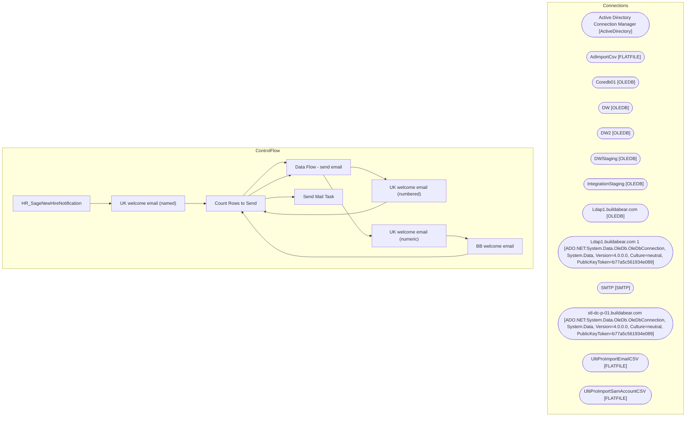

# SSIS Package: HR_SageNewHireNotification

**Project:** HR_SageNewHireNotification  
**Folder:** HR  
**Server:** STL-SSIS-P-01  

## Architecture Diagram

## Connection Managers

| Name | Type |
|---|---|
| Active Directory Connection Manager | ActiveDirectory |
| AdImportCsv | FLATFILE |
| Coredb01 | OLEDB |
| DW | OLEDB |
| DW2 | OLEDB |
| DWStaging | OLEDB |
| IntegrationStaging | OLEDB |
| Ldap1.buildabear.com | OLEDB |
| Ldap1.buildabear.com 1 | ADO.NET:System.Data.OleDb.OleDbConnection, System.Data, Version=4.0.0.0, Culture=neutral, PublicKeyToken=b77a5c561934e089 |
| SMTP | SMTP |
| stl-dc-p-01.buildabear.com | ADO.NET:System.Data.OleDb.OleDbConnection, System.Data, Version=4.0.0.0, Culture=neutral, PublicKeyToken=b77a5c561934e089 |
| UltiProImportEmailCSV | FLATFILE |
| UltiProImportSamAccountCSV | FLATFILE |

## Control Flow Tasks

| Task | Type |
|---|---|
| HR_SageNewHireNotification | Microsoft.Package |
| UK welcome email (named) | STOCK:SEQUENCE |
| Count Rows to Send | Microsoft.ExecuteSQLTask |
| Data Flow - send email | Microsoft.Pipeline |
| UK welcome email (numbered) | STOCK:SEQUENCE |
| Count Rows to Send | Microsoft.ExecuteSQLTask |
| Data Flow - send email | Microsoft.Pipeline |
| UK welcome email (numeric) | STOCK:SEQUENCE |
| BB welcome email | Microsoft.Pipeline |
| Count Rows to Send | Microsoft.ExecuteSQLTask |
| Send Mail Task | Microsoft.SendMailTask |

## Data Flow: Sources

| Component | SQL Preview |
|---|---|
|  | exec  [dbo].[spEmailSageNewHireNotificationAlpha]  @EmployeeID = ?,  @EecLocation = ?, @EepNameFirst  = ?, @EepNameLast  = ?, @JbcJobCode  = ?, @EecOrgLvl1Code  = ?, @samaccountname  = ?, @managerEmail = ?, @personalEmail = ? |
|  | select EepEEID, EepAddressEmail from papamart.dw.dbo.UHCMEmp where EecEmplStatus = 'Active' |
|  | select EepEEID,  EecLocation, JbcJobCode, EecOrgLvl1Code, EepAddressEmail, samaccountname, EepNameFirst, EepNameLast, EepNamePreferred, SupervisorID, EepAddressEmail2 from papamart.dw.dbo.UHCMEmp with (nolock) where EecEmplStatus = 'Active' --and ISNUMERIC([User Logon Name (Pre-Windows 2000)]) = 0 and [User Logon Name (Pre-Windows 2000)] is not null and EecDateOfOriginalHire = cast(getdate() as da |
|  | exec  [dbo].[spEmailSageNewHireNotificationNumeric]  @EmployeeID = ?,  @EecLocation = ?, @EepNameFirst  = ?, @EepNameLast  = ?, @JbcJobCode  = ?, @EecOrgLvl1Code  = ?, @samaccountname  = ?, @managerEmail = ?, @personalEmail = ? |
|  | select EepEEID, EepAddressEmail from papamart.dw.dbo.UHCMEmp where EecEmplStatus = 'Active' |
|  | select EepEEID,  EecLocation, JbcJobCode, EecOrgLvl1Code, EepAddressEmail, samaccountname, EepNameFirst, EepNameLast, EepNamePreferred, SupervisorID, EepAddressEmail2 from papamart.dw.dbo.UHCMEmp with (nolock)  where  1=1 and cast(EecDateOfOriginalHire as date) = cast(getdate() as date) and EepCompanyCode = 'BABUK' and JbcJobCode like '%Builder%' and EecEmplStatus <> 'Terminated' |
|  | select v.FirstName, v.LastName, v.EmployeeID, u.EecLocation , u.EepAddressEMail2 as 'personalEmail' , u2.EepAddressEMail as 'supervisorEmail' ,u.JbcJobCode as 'jobCode',  u.EecOrgLvl1Code as 'orgCode' ,v.EmployeeID as 'futureSamaccountname' from vwUHCMUltiproToAD v with (nolock) join UHCMEmp u on v.EmployeeID = u.EepEEID join UHCMEmp u2 on u.SupervisorID = u2.EepEEID where v.ProvisioningEvent = 'H |
|  | exec spEmailSageNewHireNotificationNumeric  @EmployeeID = ?, @EecLocation = ?, @EepNameFirst  = ?, @EepNameLast  = ?, @JbcJobCode  = ?, @EecOrgLvl1Code  = ?, @samaccountname  = ?, @managerEmail = ?, @personalEmail = ? |

## Data Flow: Destinations

_None detected._

