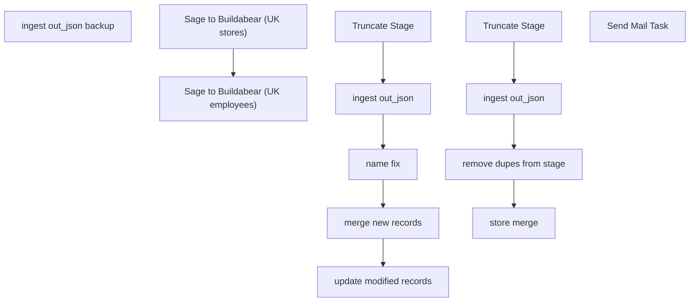

# SSIS Package: HR_Sage_ETL

**Project:** HR_Sage_ETL  
**Folder:** HR  
**Server:** STL-SSIS-P-01  

## Connection Managers

| Name | Type | Server | Catalog | Connection (sanitized) |
|---|---|---|---|---|
| ASNCorrections | FLATFILE |  |  |  |
| CRM | ADO.NET:SQL | stl-crmdb-p-01 |  | Data Source=stl-crmdb-p-01; Integrated Security=SSPI; Connect Timeout=30 |
| ESPStaging | OLEDB | stl-sql-p-04 | ESPStaging | Data Source=stl-sql-p-04; Initial Catalog=ESPStaging; Provider=SQLNCLI11.1; Integrated Security=SSPI; Auto Translate=False |
| IntegrationStaging | OLEDB | stl-ssis-p-01 | IntegrationStaging | Data Source=stl-ssis-p-01; Initial Catalog=IntegrationStaging; Provider=SQLNCLI11.1; Integrated Security=SSPI; Auto Translate=False |
| ProductInventory | FLATFILE |  |  |  |
| SMTP | SMTP |  |  |  |
| SendLog | FLATFILE |  |  |  |
| SendLogPIPE.csv | FILE |  |  |  |
| papamart.DWStaging | OLEDB | papamart | DWStaging | Data Source=papamart; Initial Catalog=DWStaging; Provider=SQLNCLI11.1; Integrated Security=SSPI; Auto Translate=False |
| papamart.dw | OLEDB | papamart | dw | Data Source=papamart; Initial Catalog=dw; Provider=SQLNCLI11.1; Integrated Security=SSPI; Auto Translate=False |
| papamarttest.DWStaging | OLEDB | papamarttest | DWStaging | Data Source=papamarttest; Initial Catalog=DWStaging; Provider=SQLNCLI11.1; Integrated Security=SSPI; Auto Translate=False |
| papamarttest.dw | OLEDB | papamarttest | dw | Data Source=papamarttest; Initial Catalog=dw; Provider=SQLNCLI11.1; Integrated Security=SSPI; Auto Translate=False |

## Control Flow Tasks

| Task | Type |
|---|---|
| HR_Sage_ETL | Package |
| Sage to Buildabear (UK employees) | SEQUENCE |
| ingest out_json | Pipeline |
| ingest out_json backup | Pipeline |
| merge new records | ExecuteSQLTask |
| name fix | ExecuteSQLTask |
| Truncate Stage | ExecuteSQLTask |
| update modified records | ExecuteSQLTask |
| Sage to Buildabear (UK stores) | SEQUENCE |
| ingest out_json | Pipeline |
| remove dupes from stage | ExecuteSQLTask |
| store merge | ExecuteSQLTask |
| Truncate Stage | ExecuteSQLTask |
| Send Mail Task | SendMailTask |

## Control Flow Outline

```text
- Send Mail Task [SendMailTask]
- Sage to Buildabear (UK employees) [SEQUENCE]
  - Truncate Stage [ExecuteSQLTask]
  - ingest out_json [Pipeline]
  - ingest out_json backup [Pipeline]
  - merge new records [ExecuteSQLTask]
  - name fix [ExecuteSQLTask]
  - update modified records [ExecuteSQLTask]
- Sage to Buildabear (UK stores) [SEQUENCE]
  - Truncate Stage [ExecuteSQLTask]
  - ingest out_json [Pipeline]
  - remove dupes from stage [ExecuteSQLTask]
  - store merge [ExecuteSQLTask]
```

## Architecture Diagram



## Variables

| Namespace | Name | Expression-bound |
|---|---|---|
| System | Propagate | No |
| User | DateTimeStamp | Yes |
| User | EndDate | Yes |
| User | EndDateAsDATE | Yes |
| User | GetDate | Yes |
| User | GetDateAsDATE | Yes |
| User | StartDate | Yes |
| User | StartDateAsDATE | Yes |
| User | archiveCsvFilename | Yes |
| User | archiveJsonFile | Yes |
| User | csvFilePath | Yes |
| User | intFiles | No |
| User | jsonFilePath | Yes |

### Expression-bound variable values

#### User::DateTimeStamp

**Expression:**

```sql
(DT_WSTR,4)DATEPART("yyyy",GetDate()) 
+ (DT_WSTR,4)DATEPART("mm",GetDate()) 
+ (DT_WSTR,4)DATEPART("dd",GetDate()) 
+ (DT_WSTR,4)DATEPART("hh",GetDate()) 
+ (DT_WSTR,4)DATEPART("mi",GetDate()) 
+ (DT_WSTR,4)DATEPART("ss",GetDate()) 
+ (DT_WSTR,4)DATEPART("ms",GetDate())
```

**Evaluated value:**

```sql
2024325111331937
```

#### User::EndDate

**Expression:**

```sql
dateadd("dd", @[$Package::DaysToInclude], @[User::StartDate])
```

**Evaluated value:**

```sql
3/25/2024
```

#### User::EndDateAsDATE

**Expression:**

```sql
(DT_WSTR, 4) datepart("year", @[User::EndDate])  + "-" +
right("0"+ (DT_WSTR, 2) datepart("mm", @[User::EndDate]),2)  + "-" +
right("0" +(DT_WSTR, 2) datepart("dd",  @[User::EndDate]),2)
```

**Evaluated value:**

```sql
2024-03-25
```

#### User::GetDate

**Expression:**

```sql
(DT_DATE)DATEDIFF("Day", (DT_DATE) 0, GETDATE())
```

**Evaluated value:**

```sql
3/25/2024
```

#### User::GetDateAsDATE

**Expression:**

```sql
(DT_WSTR, 4) datepart("year", @[User::GetDate])  + "-" +
right("0"+ (DT_WSTR, 2) datepart("mm", @[User::GetDate]),2)  + "-" +
right("0" +(DT_WSTR, 2) datepart("dd",  @[User::GetDate]),2)
```

**Evaluated value:**

```sql
2024-03-25
```

#### User::StartDate

**Expression:**

```sql
dateadd("dd", -@[$Package::DaysToGoBack] , @[User::GetDate] )
```

**Evaluated value:**

```sql
3/24/2024
```

#### User::StartDateAsDATE

**Expression:**

```sql
(DT_WSTR, 4) datepart("year", @[User::StartDate])  + "-" +
right("0"+ (DT_WSTR, 2) datepart("mm", @[User::StartDate]),2)  + "-" +
right("0" +(DT_WSTR, 2) datepart("dd",  @[User::StartDate]),2)
```

**Evaluated value:**

```sql
2024-03-24
```

#### User::archiveCsvFilename

**Expression:**

```sql
@[$Package::SageArchiveFilePath]  + @[User::intFiles] + @[User::DateTimeStamp] + ".csv"
```

**Evaluated value:**

```sql
\\stl-biapp-p-01\IntegrationStaging\HR\SageAutomation\Archive\2024325111331937.csv
```

#### User::archiveJsonFile

**Expression:**

```sql
@[$Package::SageArchiveFilePath] + @[User::intFiles] + @[User::DateTimeStamp] + ".json"
```

**Evaluated value:**

```sql
\\stl-biapp-p-01\IntegrationStaging\HR\SageAutomation\Archive\2024325111331937.json
```

#### User::csvFilePath

**Expression:**

```sql
@[$Package::SageFileStagePath] +  @[User::intFiles] + ".csv"
```

**Evaluated value:**

```sql
\\stl-ssis-p-01\IntegrationStaging\HR\SageAutomation\.csv
```

#### User::jsonFilePath

**Expression:**

```sql
@[$Package::SageFileStagePath] +  @[User::intFiles] + ".json"
```

**Evaluated value:**

```sql
\\stl-ssis-p-01\IntegrationStaging\HR\SageAutomation\.json
```

## Execute SQL Tasks

### Truncate Stage

**Path:** `Package\Sage to Buildabear (UK employees)\Truncate Stage`  
**Connection:** papamart.DWStaging (papamart/DWStaging)  

```sql
truncate table [dbo].[SHCMEmpStage]
```

### merge new records

**Path:** `Package\Sage to Buildabear (UK employees)\merge new records`  
**Connection:** papamart.DWStaging (papamart/DWStaging)  

```sql
exec [dbo].[spMergeSHCMEmp]
```

### name fix

**Path:** `Package\Sage to Buildabear (UK employees)\name fix`  
**Connection:** papamart.DWStaging (papamart/DWStaging)  

```sql

update SHCMEmpStage set EepNameFirst = 'Etain' where EepEEID = 2016644

update SHCMEmpStage set FullName = 'Etain Mullan' where EepEEID = 2016644


--update SHCMEmpStage set EmpNamePreferred = 'Aimee' where EepEEID = 2014169
--update SHCMEmpStage set FullName = 'Aimee Jade Rawcliffe' where EepEEID = 2014169

update SHCMEmpStage set EepNamePreferred = null where EepEEID = 2014169
update SHCMEmpStage set FullName = null where EepEEID = 2014169


update SHCMEmpStage set EecEmplStatus = null where EepEEID in  
('2017311','2017377','2017425','2017650','2017654','2017668','2017672','2017226', '2017220','2017828','2017725','2017733','2017734',
'2017756','2017868','2018184','2018196','2018240','2018261','2017307','2017492','2017501','2017490','2018092','2017077','2018039','2018043'
,'2018115','2018020','2016883','2017164','2017567','2017576','2017934','2017044','2017432','2017467','2017509','2017897','2017943','2017957','2017994'
,'2017360','2018004', '2017699', '2018048', '2017248')

```

### update modified records

**Path:** `Package\Sage to Buildabear (UK employees)\update modified records`  
**Connection:** papamart.dw (papamart/dw)  

```sql
update t
set [EecLocation] = coalesce(s.EecLocation, t.EecLocation),
[JbcJobCode]= coalesce(s.JbcJobCode, t.JbcJobCode),
[JbcLongDesc]= coalesce(s.JbcLongDesc,t.JbcLongDesc),
[EecOrgLvl1Code]= coalesce(s.EecOrgLvl1Code, t.EecOrgLvl1Code),
[EecOrgLvl1Description]= coalesce(s.EecOrgLvl1Description, t.EecOrgLvl1Description),
[LocDesc]= coalesce(s.LocDesc, t.LocDesc),
[EecEmplStatus]= coalesce(s.EecEmplStatus, t.EecEmplStatus),
[EepNameFirst]= coalesce(s.EepNameFirst, t.EepNameFirst),
[EepNameLast]= coalesce(s.EepNameLast, t.EepNameLast),
[EepNameMiddle]= coalesce(s.EepNameMiddle, t.EepNameMiddle),
[EepAddressEMail]= coalesce(s.EepAddressEMail, t.EepAddressEMail),
[EepAddressEMail2]= coalesce(s.EepAddressEMail2, t.EepAddressEMail2),
[WorkPhoneNumber]= coalesce(s.WorkPhoneNumber, t.WorkPhoneNumber),
[efoPhoneExtension]= coalesce(s.efoPhoneExtension, t.efoPhoneExtension),
[EecSalaryOrHourly]= coalesce(s.EecSalaryOrHourly, t.EecSalaryOrHourly),
[EepNamePreferred]= coalesce(s.EepNamePreferred, t.EepNamePreferred),
[EecDateOfOriginalHire]= coalesce(s.EecDateOfOriginalHire, t.EecDateOfOriginalHire),
[EepCompanyCode]= coalesce(s.EepCompanyCode, t.EepCompanyCode),
[TerminationDate]= coalesce(s.TerminationDate, t.TerminationDate),
[samaccountname] = CASE WHEN s.[EecEmplStatus] = 'Terminated' THEN '' ELSE coalesce(s.samaccountname, t.samaccountname) END,
[SupervisorID]= coalesce(s.SupervisorID, t.SupervisorID),
[SupervisorName]= coalesce(s.SupervisorName, t.SupervisorName),
[SupervisorPosition]= coalesce(s.SupervisorPosition, t.SupervisorPosition),
[TerminatedFlag]= coalesce(s.TerminatedFlag, t.TerminatedFlag),
[TerminatedEffectiveDate]= coalesce(s.TerminatedEffectiveDate, t.TerminatedEffectiveDate),
[TerminatedEnteredDate]= coalesce(s.TerminatedEnteredDate, t.TerminatedEnteredDate),
[FullName]= coalesce(s.FullName, t.FullName),
[UpdateDate] = getdate(),
[SendUpdateFlag] = CASE WHEN isnumeric(s.samaccountname) = 0 and (isnumeric(t.samaccountname) = 1 or t.samaccountname is null or t.samaccountname = '') THEN 2
WHEN s.[EecLocation] is null and s.[JbcJobCode] is null and s.[JbcLongDesc] is null and 
s.[EecOrgLvl1Code] is null and s.[EecOrgLvl1Description] is null and s.[LocDesc] is null and s.[EecEmplStatus] is null and 
s.[EepNameFirst] is null and s.[EepNameLast]  is null and s.[EepNameMiddle]  is null and s.[EepAddressEMail]  is null and 
s.[DateOfBirth]  is null and s.[WorkPhoneNumber]  is null and s.[efoPhoneExtension] is null and s.[EecSalaryOrHourly]  is null and 
s.[EepNamePreferred]  is null and s.[EecDateOfOriginalHire] is null and s.[EepCompanyCode]  is null and 
s.[TerminationDate]  is null and s.[SupervisorID]  is null and s.[SupervisorName]  is null and s.[SupervisorPosition] is null and 
s.[TerminatedFlag]  is null and s.[TerminatedEffectiveDate]  is null and s.[TerminatedEnteredDate]  is null and s.[FullName]  is null and 
s.[LocationName]  is null and s.[PhoneNumber] is null and s.[Address]  is null and s.[City]  is null and s.[State/Province]  is null and 
s.[Postal Code] is null and s.[Country]  is null and s.[FaxNumber]  is null and s.[EepAddressEMail2]  is null THEN 0 
ELSE 1 END,
[LocationName]= coalesce(s.LocationName, t.LocationName),
[PhoneNumber]= coalesce(s.PhoneNumber, t.PhoneNumber),
[Address]= coalesce(s.[Address], t.[Address]),
[State/Province]= coalesce(s.[State/Province], t.[State/Province]),
[Postal Code]= coalesce(s.[Postal Code], t.[Postal Code]),
[Country]= coalesce(s.Country, t.Country),
[FaxNumber]= coalesce(s.FaxNumber, t.FaxNumber),
[DateOfBirth]= coalesce(s.DateOfBirth, t.DateOfBirth),
[City]= coalesce(s.City, t.City)
from dw.dbo.UHCMEmp t 
join DWStaging.dbo.SHCMEmpStage s on t.EepEEID = s.EepEEID 
where s.action = 'modify' 
```

### Truncate Stage

**Path:** `Package\Sage to Buildabear (UK stores)\Truncate Stage`  
**Connection:** papamart.DWStaging (papamart/DWStaging)  

```sql
truncate table [dbo].[SHCMStoreStage]
```

### remove dupes from stage

**Path:** `Package\Sage to Buildabear (UK stores)\remove dupes from stage`  
**Connection:** papamart.DWStaging (papamart/DWStaging)  

```sql
WITH duplicateStores AS (
   SELECT [LocationName]
      ,[PhoneNumber]
      ,[Address]
      ,[City]
      ,[State/Province]
      ,[Postal Code]
      ,[Country]
      ,[FaxNumber]
      ,[StoreNumber],
        ROW_NUMBER() OVER (
            PARTITION BY 
                StoreNumber
            ORDER BY 
                StoreNumber
        ) row_num
     FROM 
         DWStaging.dbo.SHCMStoreStage
)
--select * from duplicateStores
DELETE FROM duplicateStores
WHERE row_num > 1;
```

### store merge

**Path:** `Package\Sage to Buildabear (UK stores)\store merge`  
**Connection:** papamart.DWStaging (papamart/DWStaging)  

```sql
exec [dbo].[spMergeSHCMStore]
```

## Data Flow: Sources

_None detected._

## Data Flow: Destinations

| Component | Target Table | Type | Data Flow Task | Connection | SQL Kind |
|---|---|---|---|---|---|
| OLE DB Destination |  | OLEDBDestination | ingest out_json | papamart.DWStaging |  |
| OLE DB Destination |  | OLEDBDestination | ingest out_json backup | papamart.DWStaging |  |
| OLE DB Destination |  | OLEDBDestination | ingest out_json | papamart.DWStaging |  |
