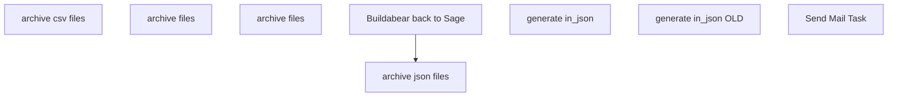

# SSIS Package: HR_Sage_ETL_2

**Project:** HR_Sage_ETL2  
**Folder:** HR  
**Server:** STL-SSIS-P-01  

## Connection Managers

| Name | Type | Server | Catalog | Connection (sanitized) |
|---|---|---|---|---|
| ASNCorrections | FLATFILE |  |  |  |
| CRM | ADO.NET:SQL | stl-crmdb-p-01 |  | Data Source=stl-crmdb-p-01; Integrated Security=SSPI; Connect Timeout=30 |
| ESPStaging | OLEDB | stl-sql-p-04 | ESPStaging | Data Source=stl-sql-p-04; Initial Catalog=ESPStaging; Provider=SQLNCLI11.1; Integrated Security=SSPI; Auto Translate=False |
| IntegrationStaging | OLEDB | stl-ssis-t-01 | IntegrationStaging | Data Source=stl-ssis-t-01; Initial Catalog=IntegrationStaging; Provider=SQLNCLI11.1; Integrated Security=SSPI; Auto Translate=False |
| ProductInventory | FLATFILE |  |  |  |
| SMTP | SMTP |  |  |  |
| SendLog | FLATFILE |  |  |  |
| SendLogPIPE.csv | FILE |  |  |  |
| papamart.DWStaging | OLEDB | papamart | DWStaging | Data Source=papamart; Initial Catalog=DWStaging; Provider=SQLNCLI11.1; Integrated Security=SSPI; Auto Translate=False |
| papamart.dw | OLEDB | papamart | dw | Data Source=papamart; Initial Catalog=dw; Provider=SQLNCLI11.1; Integrated Security=SSPI; Auto Translate=False |
| papamarttest.DWStaging | OLEDB | papamarttest | DWStaging | Data Source=papamarttest; Initial Catalog=DWStaging; Provider=SQLNCLI11.1; Integrated Security=SSPI; Auto Translate=False |
| papamarttest.dw | OLEDB | papamarttest | dw | Data Source=papamarttest; Initial Catalog=dw; Provider=SQLNCLI11.1; Integrated Security=SSPI; Auto Translate=False |

## Control Flow Tasks

| Task | Type |
|---|---|
| HR_Sage_ETL_2 | Package |
| archive csv files | FOREACHLOOP |
| archive files | FileSystemTask |
| archive json files | FOREACHLOOP |
| archive files | FileSystemTask |
| Buildabear back to Sage | SEQUENCE |
| generate in_json | Pipeline |
| generate in_json OLD | Pipeline |
| Send Mail Task | SendMailTask |

## Control Flow Outline

```text
- Send Mail Task [SendMailTask]
- Buildabear back to Sage [SEQUENCE]
  - generate in_json [Pipeline]
- archive csv files [FOREACHLOOP]
  - archive files [FileSystemTask]
- archive json files [FOREACHLOOP]
  - archive files [FileSystemTask]
- generate in_json OLD [Pipeline]
```

## Architecture Diagram



## Variables

| Namespace | Name | Expression-bound |
|---|---|---|
| System | Propagate | No |
| User | DateTimeStamp | Yes |
| User | EndDate | Yes |
| User | EndDateAsDATE | Yes |
| User | GetDate | Yes |
| User | GetDateAsDATE | Yes |
| User | StartDate | Yes |
| User | StartDateAsDATE | Yes |
| User | archiveCsvFilename | Yes |
| User | archiveJsonFile | Yes |
| User | csvFilePath | Yes |
| User | intFiles | No |
| User | jsonFilePath | Yes |

### Expression-bound variable values

#### User::DateTimeStamp

**Expression:**

```sql
(DT_WSTR,4)DATEPART("yyyy",GetDate()) 
+ (DT_WSTR,4)DATEPART("mm",GetDate()) 
+ (DT_WSTR,4)DATEPART("dd",GetDate()) 
+ (DT_WSTR,4)DATEPART("hh",GetDate()) 
+ (DT_WSTR,4)DATEPART("mi",GetDate()) 
+ (DT_WSTR,4)DATEPART("ss",GetDate()) 
+ (DT_WSTR,4)DATEPART("ms",GetDate())
```

**Evaluated value:**

```sql
2021614135829147
```

#### User::EndDate

**Expression:**

```sql
dateadd("dd", @[$Package::DaysToInclude], @[User::StartDate])
```

**Evaluated value:**

```sql
6/14/2021
```

#### User::EndDateAsDATE

**Expression:**

```sql
(DT_WSTR, 4) datepart("year", @[User::EndDate])  + "-" +
right("0"+ (DT_WSTR, 2) datepart("mm", @[User::EndDate]),2)  + "-" +
right("0" +(DT_WSTR, 2) datepart("dd",  @[User::EndDate]),2)
```

**Evaluated value:**

```sql
2021-06-14
```

#### User::GetDate

**Expression:**

```sql
(DT_DATE)DATEDIFF("Day", (DT_DATE) 0, GETDATE())
```

**Evaluated value:**

```sql
6/14/2021
```

#### User::GetDateAsDATE

**Expression:**

```sql
(DT_WSTR, 4) datepart("year", @[User::GetDate])  + "-" +
right("0"+ (DT_WSTR, 2) datepart("mm", @[User::GetDate]),2)  + "-" +
right("0" +(DT_WSTR, 2) datepart("dd",  @[User::GetDate]),2)
```

**Evaluated value:**

```sql
2021-06-14
```

#### User::StartDate

**Expression:**

```sql
dateadd("dd", -@[$Package::DaysToGoBack] , @[User::GetDate] )
```

**Evaluated value:**

```sql
6/13/2021
```

#### User::StartDateAsDATE

**Expression:**

```sql
(DT_WSTR, 4) datepart("year", @[User::StartDate])  + "-" +
right("0"+ (DT_WSTR, 2) datepart("mm", @[User::StartDate]),2)  + "-" +
right("0" +(DT_WSTR, 2) datepart("dd",  @[User::StartDate]),2)
```

**Evaluated value:**

```sql
2021-06-13
```

#### User::archiveCsvFilename

**Expression:**

```sql
@[$Package::SageArchiveFilePath]  + @[User::intFiles] + @[User::DateTimeStamp] + ".csv"
```

**Evaluated value:**

```sql
\\stl-biapp-p-01\IntegrationStaging\HR\SageAutomation\Archive\2021614135829147.csv
```

#### User::archiveJsonFile

**Expression:**

```sql
@[$Package::SageArchiveFilePath] + @[User::intFiles] + @[User::DateTimeStamp] + ".json"
```

**Evaluated value:**

```sql
\\stl-biapp-p-01\IntegrationStaging\HR\SageAutomation\Archive\2021614135829147.json
```

#### User::csvFilePath

**Expression:**

```sql
@[$Package::SageFileStagePath] +  @[User::intFiles] + ".csv"
```

**Evaluated value:**

```sql
\\stl-biapp-p-01\IntegrationStaging\HR\SageAutomation\.csv
```

#### User::jsonFilePath

**Expression:**

```sql
@[$Package::SageFileStagePath] +  @[User::intFiles] + ".json"
```

**Evaluated value:**

```sql
\\stl-biapp-p-01\IntegrationStaging\HR\SageAutomation\.json
```

## Execute SQL Tasks

_None detected._

## Data Flow: Sources

| Component | Source Object | Type | Data Flow Task | Connection | SQL Kind |
|---|---|---|---|---|---|
| OLE DB Source |  | OLEDBSource | generate in_json | papamart.dw | SqlCommand |
| OLE DB Source |  | OLEDBSource | generate in_json OLD | papamart.dw | SqlCommand |

#### OLE DB Source — SqlCommand

```sql
SELECT u.EecLocation,u.EepEEID,u.JbcJobCode,u.JbcLongDesc,u.EecOrgLvl1Code,u.EecOrgLvl1Description,u.LocDesc,u.EecEmplStatus,u.EepNameFirst,u.EepNameLast,u.EepNameMiddle,u.EepAddressEMail,u.EepAddressEMail2
,u.WorkPhoneNumber,u.efoPhoneExtension,u.EecSalaryOrHourly,u.EepNamePreferred,u.EecDateOfOriginalHire,u.EepCompanyCode,u.TerminationDate,
--u.sAMAccountName
isnull(a.SamAccountName,'') as sAMAccountName
--sAMAccountName = case when u.EepEEID in ('2014153','2014831','2015526','2015962','2015963','2015965','2014242','2014433','2015150','2014818','2006659') then isnull(a.SamAccountName, '')
--else '' end
,u.SupervisorID,u.SupervisorName,u.SupervisorPosition,u.TerminatedFlag,u.TerminatedEffectiveDate,u.TerminatedEnteredDate,u.FullName,u.LocationName,u.PhoneNumber,u.Address,u.[State/Province]
,u.[Postal Code],u.Country,u.FaxNumber,u.DateOfBirth,u.City
FROM dw.dbo.UHCMEmp u
left join DWStaging.dbo.ADattributes a on u.EepEEID = a.EmployeeId
where u.EepCompanyCode = 'BABUK'
--and u.EepEEID <> '2014816'
and u.EepEEID <> '2222222'
--and u.EepEEID in ('2014153','2014831','2015526','2015962','2015963','2015965','2014242','2014433','2015150','2014818','2014816')
order by u.EepEEID asc
```

#### OLE DB Source — SqlCommand

```sql
SELECT u.EecLocation,u.EepEEID,u.JbcJobCode,u.JbcLongDesc,u.EecOrgLvl1Code,u.EecOrgLvl1Description,u.LocDesc,u.EecEmplStatus,u.EepNameFirst,u.EepNameLast,u.EepNameMiddle,u.EepAddressEMail
,u.WorkPhoneNumber,u.efoPhoneExtension,u.EecSalaryOrHourly,u.EepNamePreferred,u.EecDateOfOriginalHire,u.EepCompanyCode,u.TerminationDate,
--u.sAMAccountName
isnull(a.SamAccountName,'') as sAMAccountName
--sAMAccountName = case when u.EepEEID in ('2014153','2014831','2015526','2015962','2015963','2015965','2014242','2014433','2015150','2014818','2006659') then isnull(a.SamAccountName, '')
--else '' end
,u.SupervisorID,u.SupervisorName,u.SupervisorPosition,u.TerminatedFlag,u.TerminatedEffectiveDate,u.TerminatedEnteredDate,u.FullName,u.LocationName,u.PhoneNumber,u.Address,u.[State/Province]
,u.[Postal Code],u.Country,u.FaxNumber,u.DateOfBirth,u.City
FROM dw.dbo.UHCMEmp u
left join DWStaging.dbo.ADattributes a on u.EepEEID = a.EmployeeId
where u.EepCompanyCode = 'BABUK'
--and u.EepEEID <> '2014816'
and u.EepEEID <> '2222222'
--and u.EepEEID in ('2014153','2014831','2015526','2015962','2015963','2015965','2014242','2014433','2015150','2014818','2014816')
order by u.EepEEID asc
```

## Data Flow: Destinations

_None detected._
