# SSIS Package: HR_Store_AD

**Project:** HR_Store_AD  
**Folder:** HR  
**Server:** STL-SSIS-P-01  

## Connection Managers

| Name | Type | Server | Catalog | Connection (sanitized) |
|---|---|---|---|---|
| Active Directory Connection Manager | ActiveDirectory |  |  |  |
| Active Directory Connection Manager 1 | ActiveDirectory |  |  |  |
| Active Directory Connection Manager 2 | ActiveDirectory |  |  |  |
| Auditworks | OLEDB | bedrocktestdb01 | auditworks | Data Source=bedrocktestdb01; Initial Catalog=auditworks; Provider=SQLNCLI11.1; Integrated Security=SSPI; Auto Translate=False |
| Azure Service Bus | Azure Service Bus (KingswaySoft) |  |  |  |
| CRM | OLEDB | crmtestdb02 | crm | Data Source=crmtestdb02; Initial Catalog=crm; Provider=SQLNCLI11.1; Integrated Security=SSPI; Auto Translate=False |
| DW | OLEDB | papamart | dw | Data Source=papamart; Initial Catalog=dw; Provider=SQLNCLI11.1; Integrated Security=SSPI; Auto Translate=False |
| DWStaging | OLEDB | papamart | DWStaging | Data Source=papamart; Initial Catalog=DWStaging; Provider=SQLNCLI11.1; Integrated Security=SSPI; Auto Translate=False |
| Flat File Connection Manager | FLATFILE |  |  |  |
| HTTP Connection Manager | HTTP (KingswaySoft) |  |  |  |
| IntegrationStaging | OLEDB | STL-SSIS-t-01 | IntegrationStaging | Data Source=STL-SSIS-t-01; Initial Catalog=IntegrationStaging; Provider=SQLNCLI11.1; Integrated Security=SSPI; Auto Translate=False |
| ME_01 | OLEDB | bedrocktestdb02 | me_01 | Data Source=bedrocktestdb02; Initial Catalog=me_01; Provider=SQLNCLI11.1; Integrated Security=SSPI; Auto Translate=False |
| SMTP | SMTP |  |  |  |
| UltiProImportEmailCSV | FLATFILE |  |  |  |
| UltiProImportSamAccountCSV | FLATFILE |  |  |  |
| coredb01 | OLEDB | coredb01 | AIMSConfig | Data Source=coredb01; Initial Catalog=AIMSConfig; Provider=SQLNCLI11.1; Integrated Security=SSPI; Auto Translate=False |
| empIDs | FLATFILE |  |  |  |
| empNoID | FLATFILE |  |  |  |
| namedAndNumbered | FLATFILE |  |  |  |
| papamart.dw1 | OLEDB | papamart | dw | Data Source=papamart; Initial Catalog=dw; Provider=SQLOLEDB.1; Integrated Security=SSPI; Application Name=SSIS-Package-{3AE9F320-D541-4496-80AB-31E67461FEC7}papamart.dw1; Auto Translate=False |

## Control Flow Tasks

| Task | Type |
|---|---|
| HR_Store_AD | Package |
| create new account | SEQUENCE |
| add user obj to group obj | SEQUENCE |
| add store to default groups | Pipeline |
| add store to default groups 1 | Pipeline |
| add store to district | Pipeline |
| add store to DL | Pipeline |
| wait | ExecuteSQLTask |
| count new stores | ExecuteSQLTask |
| group object create | SEQUENCE |
| Foreach Loop Container | FOREACHLOOP |
| add email | ExecuteProcess |
| Send Mail Task | SendMailTask |
| move to store OU | Pipeline |
| stage group to variable | ExecuteSQLTask |
| store AD group object | Pipeline |
| wait | ExecuteSQLTask |
| wait 1 | ExecuteSQLTask |
| store object create | SEQUENCE |
| Foreach Loop Container | FOREACHLOOP |
| account enable | ExecuteProcess |
| Send Mail Task | SendMailTask |
| move to store OU | Pipeline |
| stage identity to variable | ExecuteSQLTask |
| store AD user object | Pipeline |
| wait | ExecuteSQLTask |
| wait 1 | ExecuteSQLTask |
| repopulate AD attributes | SEQUENCE |
| merge ADattributesMerged | ExecuteSQLTask |
| populate ADattributes | Pipeline |
| populate ADattributes_Group | Pipeline |
| truncate ADattributes | ExecuteSQLTask |
| update EmployeeADGroup | ExecuteSQLTask |
| Send Mail Task | SendMailTask |

## Control Flow Outline

```text
- Send Mail Task [SendMailTask]
- create new account [SEQUENCE]
  - add user obj to group obj [SEQUENCE]
    - add store to DL [Pipeline]
    - add store to default groups [Pipeline]
    - add store to default groups 1 [Pipeline]
    - add store to district [Pipeline]
    - wait [ExecuteSQLTask]
  - count new stores [ExecuteSQLTask]
  - group object create [SEQUENCE]
    - Foreach Loop Container [FOREACHLOOP]
      - Send Mail Task [SendMailTask]
      - add email [ExecuteProcess]
    - move to store OU [Pipeline]
    - stage group to variable [ExecuteSQLTask]
    - store AD group object [Pipeline]
    - wait [ExecuteSQLTask]
    - wait 1 [ExecuteSQLTask]
  - store object create [SEQUENCE]
    - Foreach Loop Container [FOREACHLOOP]
      - Send Mail Task [SendMailTask]
      - account enable [ExecuteProcess]
    - move to store OU [Pipeline]
    - stage identity to variable [ExecuteSQLTask]
    - store AD user object [Pipeline]
    - wait [ExecuteSQLTask]
    - wait 1 [ExecuteSQLTask]
- repopulate AD attributes [SEQUENCE]
  - merge ADattributesMerged [ExecuteSQLTask]
  - populate ADattributes [Pipeline]
  - populate ADattributes_Group [Pipeline]
  - truncate ADattributes [ExecuteSQLTask]
  - update EmployeeADGroup [ExecuteSQLTask]
```

## Architecture Diagram

```mermaid
flowchart TD
    n_Package_create_new_account["create new account"]
    n_Package_create_new_account_add_user_obj_to_group_obj["add user obj to group obj"]
    n_Package_create_new_account_add_user_obj_to_group_obj_add_store_to_default_groups["add store to default groups"]
    n_Package_create_new_account_add_user_obj_to_group_obj_add_store_to_default_groups_1["add store to default groups 1"]
    n_Package_create_new_account_add_user_obj_to_group_obj_add_store_to_district["add store to district"]
    n_Package_create_new_account_add_user_obj_to_group_obj_add_store_to_DL["add store to DL"]
    n_Package_create_new_account_add_user_obj_to_group_obj_wait["wait"]
    n_Package_create_new_account_count_new_stores["count new stores"]
    n_Package_create_new_account_group_object_create["group object create"]
    n_Package_create_new_account_group_object_create_Foreach_Loop_Container["Foreach Loop Container"]
    n_Package_create_new_account_group_object_create_Foreach_Loop_Container_add_email["add email"]
    n_Package_create_new_account_group_object_create_Foreach_Loop_Container_Send_Mail_Task["Send Mail Task"]
    n_Package_create_new_account_group_object_create_move_to_store_OU["move to store OU"]
    n_Package_create_new_account_group_object_create_stage_group_to_variable["stage group to variable"]
    n_Package_create_new_account_group_object_create_store_AD_group_object["store AD group object"]
    n_Package_create_new_account_group_object_create_wait["wait"]
    n_Package_create_new_account_group_object_create_wait_1["wait 1"]
    n_Package_create_new_account_store_object_create["store object create"]
    n_Package_create_new_account_store_object_create_Foreach_Loop_Container["Foreach Loop Container"]
    n_Package_create_new_account_store_object_create_Foreach_Loop_Container_account_enable["account enable"]
    n_Package_create_new_account_store_object_create_Foreach_Loop_Container_Send_Mail_Task["Send Mail Task"]
    n_Package_create_new_account_store_object_create_move_to_store_OU["move to store OU"]
    n_Package_create_new_account_store_object_create_stage_identity_to_variable["stage identity to variable"]
    n_Package_create_new_account_store_object_create_store_AD_user_object["store AD user object"]
    n_Package_create_new_account_store_object_create_wait["wait"]
    n_Package_create_new_account_store_object_create_wait_1["wait 1"]
    n_Package_repopulate_AD_attributes["repopulate AD attributes"]
    n_Package_repopulate_AD_attributes_merge_ADattributesMerged["merge ADattributesMerged"]
    n_Package_repopulate_AD_attributes_populate_ADattributes["populate ADattributes"]
    n_Package_repopulate_AD_attributes_populate_ADattributes_Group["populate ADattributes_Group"]
    n_Package_repopulate_AD_attributes_truncate_ADattributes["truncate ADattributes"]
    n_Package_repopulate_AD_attributes_update_EmployeeADGroup["update EmployeeADGroup"]
    n_Package_EventHandlers_OnError__Send_Mail_Task["Send Mail Task"]
    n_Package_create_new_account_add_user_obj_to_group_obj_wait --> n_Package_create_new_account_add_user_obj_to_group_obj_add_store_to_default_groups
    n_Package_create_new_account_add_user_obj_to_group_obj_add_store_to_default_groups --> n_Package_create_new_account_add_user_obj_to_group_obj_add_store_to_DL
    n_Package_create_new_account_add_user_obj_to_group_obj_add_store_to_DL --> n_Package_create_new_account_add_user_obj_to_group_obj_add_store_to_district
    n_Package_create_new_account_group_object_create_wait --> n_Package_create_new_account_group_object_create_store_AD_group_object
    n_Package_create_new_account_group_object_create_store_AD_group_object --> n_Package_create_new_account_group_object_create_wait_1
    n_Package_create_new_account_group_object_create_wait_1 --> n_Package_create_new_account_group_object_create_move_to_store_OU
    n_Package_create_new_account_group_object_create_move_to_store_OU --> n_Package_create_new_account_group_object_create_stage_group_to_variable
    n_Package_create_new_account_group_object_create_stage_group_to_variable --> n_Package_create_new_account_group_object_create_Foreach_Loop_Container
    n_Package_create_new_account_store_object_create_store_AD_user_object --> n_Package_create_new_account_store_object_create_wait
    n_Package_create_new_account_store_object_create_wait --> n_Package_create_new_account_store_object_create_stage_identity_to_variable
    n_Package_create_new_account_store_object_create_stage_identity_to_variable --> n_Package_create_new_account_store_object_create_Foreach_Loop_Container
    n_Package_create_new_account_store_object_create_Foreach_Loop_Container --> n_Package_create_new_account_store_object_create_wait_1
    n_Package_create_new_account_store_object_create_wait_1 --> n_Package_create_new_account_store_object_create_move_to_store_OU
    n_Package_create_new_account_count_new_stores --> n_Package_create_new_account_store_object_create
    n_Package_create_new_account_store_object_create --> n_Package_create_new_account_group_object_create
    n_Package_create_new_account_group_object_create --> n_Package_create_new_account_add_user_obj_to_group_obj
    n_Package_repopulate_AD_attributes_truncate_ADattributes --> n_Package_repopulate_AD_attributes_populate_ADattributes
    n_Package_repopulate_AD_attributes_populate_ADattributes --> n_Package_repopulate_AD_attributes_populate_ADattributes_Group
    n_Package_repopulate_AD_attributes_populate_ADattributes_Group --> n_Package_repopulate_AD_attributes_update_EmployeeADGroup
    n_Package_repopulate_AD_attributes_update_EmployeeADGroup --> n_Package_repopulate_AD_attributes_merge_ADattributesMerged
    n_Package_create_new_account --> n_Package_repopulate_AD_attributes
```



## Variables

| Namespace | Name | Expression-bound |
|---|---|---|
| System | Propagate | No |
| User | DateTimeStamp | Yes |
| User | EmployeeIDStage | No |
| User | EndDate | Yes |
| User | EndDateAsDATE | Yes |
| User | GetDate | Yes |
| User | GetDateAsDATE | Yes |
| User | SQL_MemberOfQuery | Yes |
| User | StartDate | Yes |
| User | StartDateAsDATE | Yes |
| User | UltiProClearExpiryScriptPath | No |
| User | UltiProImportEmailCSVFileName | Yes |
| User | UltiProImportFilePreStagePath | Yes |
| User | UltiProImportFiles | No |
| User | UltiProImportSamAccountCSVConnectionString | Yes |
| User | UltiProImportSamAccountCSVFileName | Yes |
| User | UltiproImportArchive | Yes |
| User | UltiproImportEmailCSVConnectionString | Yes |
| User | ad_EmployeeID | No |
| User | ad_cn | No |
| User | ad_company | No |
| User | ad_department | No |
| User | ad_description | No |
| User | ad_displayName | No |
| User | ad_givenname | No |
| User | ad_mail | No |
| User | ad_manager | No |
| User | ad_memberOf | No |
| User | ad_samaccountName | No |
| User | ad_sn | No |
| User | ad_title | No |
| User | empDemoteCount | No |
| User | empMoveCount | No |
| User | empPromoteCount | No |
| User | newADaccount | No |
| User | newADaccount2 | No |
| User | newStoreCount | No |
| User | varArg | No |
| User | varArg2 | No |
| User | varGroupEmail | No |
| User | varIdentity | No |
| User | varIdentity2 | No |
| User | varScriptString | Yes |
| User | varScriptString2 | Yes |
| User | varScriptString3 | Yes |

### Expression-bound variable values

#### User::DateTimeStamp

**Expression:**

```sql
(DT_WSTR,4)DATEPART("yyyy",GetDate()) 
+ (DT_WSTR,4)DATEPART("mm",GetDate()) 
+ (DT_WSTR,4)DATEPART("dd",GetDate()) 
+ (DT_WSTR,4)DATEPART("hh",GetDate()) 
+ (DT_WSTR,4)DATEPART("mi",GetDate()) 
+ (DT_WSTR,4)DATEPART("ss",GetDate()) 
+ (DT_WSTR,4)DATEPART("ms",GetDate())
```

**Evaluated value:**

```sql
20251111161116107
```

#### User::EndDate

**Expression:**

```sql
dateadd("dd", @[$Package::DaysToInclude], @[User::StartDate])
```

**Evaluated value:**

```sql
11/11/2025
```

#### User::EndDateAsDATE

**Expression:**

```sql
(DT_WSTR, 4) datepart("year", @[User::EndDate])  + "-" + 
(DT_WSTR, 2) datepart("mm", @[User::EndDate])  + "-" + 
(DT_WSTR, 2) datepart("dd",  @[User::EndDate])
```

**Evaluated value:**

```sql
2025-11-11
```

#### User::GetDate

**Expression:**

```sql
(DT_DATE)DATEDIFF("Day", (DT_DATE) 0, GETDATE())
```

**Evaluated value:**

```sql
11/11/2025
```

#### User::GetDateAsDATE

**Expression:**

```sql
(DT_WSTR, 4) datepart("year", @[User::GetDate])  + "-" + 
(DT_WSTR, 2) datepart("mm", @[User::GetDate])  + "-" + 
(DT_WSTR, 2) datepart("dd",  @[User::GetDate])
```

**Evaluated value:**

```sql
2025-11-11
```

#### User::SQL_MemberOfQuery

**Expression:**

```sql
"
SELECT cast('" + @[User::ad_EmployeeID] + "' as nvarchar(7))  as EmployeeID, cast(replace(ADsPath, 'LDAP://', '') as nvarchar(4000)) as memberOf 
FROM OPENQUERY
	(
		ADSI, 
            'SELECT * FROM ''LDAP://DC=buildabear,DC=com'' 
             WHERE employeeID = ''" + @[User::ad_EmployeeID] + "'''
	)  
"
```

**Evaluated value:**

```sql

SELECT cast('' as nvarchar(7))  as EmployeeID, cast(replace(ADsPath, 'LDAP://', '') as nvarchar(4000)) as memberOf 
FROM OPENQUERY
	(
		ADSI, 
            'SELECT * FROM ''LDAP://DC=buildabear,DC=com'' 
             WHERE employeeID = '''''
	)  

```

#### User::StartDate

**Expression:**

```sql
dateadd("dd", -@[$Package::DaysToGoBack] , @[User::GetDate] )
```

**Evaluated value:**

```sql
11/10/2025
```

#### User::StartDateAsDATE

**Expression:**

```sql
(DT_WSTR, 4) datepart("year", @[User::StartDate])  + "-" + 
(DT_WSTR, 2) datepart("mm", @[User::StartDate])  + "-" + 
(DT_WSTR, 2) datepart("dd",  @[User::StartDate])
```

**Evaluated value:**

```sql
2025-11-10
```

#### User::UltiProImportEmailCSVFileName

**Expression:**

```sql
"UPEmail" +  @[User::DateTimeStamp] + ".csv"
```

**Evaluated value:**

```sql
UPEmail20251111161116113.csv
```

#### User::UltiProImportFilePreStagePath

**Expression:**

```sql
"\\\\stl-ssis-p-01\\IntegrationStaging\\HR\\UltiProTermSamaccount\\"
```

**Evaluated value:**

```sql
\\stl-ssis-p-01\IntegrationStaging\HR\UltiProTermSamaccount\
```

#### User::UltiProImportSamAccountCSVConnectionString

**Expression:**

```sql
@[$Package::UltiProFileStagePath_SamAccountEmail] +  @[User::UltiProImportSamAccountCSVFileName]
```

**Evaluated value:**

```sql
\\STL-SSIs-p-01\integrationStaging\HR\UltiProTermSamaccount\UPSamAccount20251111161116113.csv
```

#### User::UltiProImportSamAccountCSVFileName

**Expression:**

```sql
"UPSamAccount" +  @[User::DateTimeStamp] + ".csv"
```

**Evaluated value:**

```sql
UPSamAccount20251111161116113.csv
```

#### User::UltiproImportArchive

**Expression:**

```sql
@[User::UltiProImportFilePreStagePath]  + "Archive\\"
```

**Evaluated value:**

```sql
\\stl-ssis-p-01\IntegrationStaging\HR\UltiProTermSamaccount\Archive\
```

#### User::UltiproImportEmailCSVConnectionString

**Expression:**

```sql
@[$Package::UltiProFileStagePath_SamAccountEmail] +  @[User::UltiProImportEmailCSVFileName]
```

**Evaluated value:**

```sql
\\STL-SSIs-p-01\integrationStaging\HR\UltiProTermSamaccount\UPEmail20251111161116113.csv
```

#### User::varScriptString

**Expression:**

```sql
"-ExecutionPolicy Unrestricted -File \"" + @[User::UltiProClearExpiryScriptPath] + "\\enableAD.ps1\" \"" + @[User::varArg] + "\" \"" + @[User::varIdentity] + "\""
```

**Evaluated value:**

```sql
-ExecutionPolicy Unrestricted -File "\\stl-ssis-p-01\IntegrationStaging\HR\UltiproADmoveRename\enableAD.ps1" "-identity" ""
```

#### User::varScriptString2

**Expression:**

```sql
"-ExecutionPolicy Unrestricted -File \"" + @[User::UltiProClearExpiryScriptPath] + "\\populateEmail.ps1\" \"" + @[User::varArg] + "\" \"" + @[User::varIdentity2] + "\" \"" +  @[User::varArg2] + "\" \"" +  @[User::varGroupEmail]  + "\""
```

**Evaluated value:**

```sql
-ExecutionPolicy Unrestricted -File "\\stl-ssis-p-01\IntegrationStaging\HR\UltiproADmoveRename\populateEmail.ps1" "-identity" "Store 638 - Teddybear Shopping Center" "-mail" "2222222@buildabear.com"
```

#### User::varScriptString3

**Expression:**

```sql
"-ExecutionPolicy Unrestricted -File \"" + @[User::UltiProClearExpiryScriptPath] + "\\populateEmail.ps1\" \"" + @[User::varIdentity2] + "\" \"" + @[User::varGroupEmail] + "\""
```

**Evaluated value:**

```sql
-ExecutionPolicy Unrestricted -File "\\stl-ssis-p-01\IntegrationStaging\HR\UltiproADmoveRename\populateEmail.ps1" "Store 638 - Teddybear Shopping Center" "2222222@buildabear.com"
```

## Execute SQL Tasks

### wait

**Path:** `Package\create new account\add user obj to group obj\wait`  
**Connection:** DW (papamart/dw)  

```sql
WAITFOR DELAY '00:00:22';
```

### count new stores

**Path:** `Package\create new account\count new stores`  
**Connection:** DW (papamart/dw)  

```sql
select count(*)  from [dbo].[vwStoreMDMtoAD]
```

### stage group to variable

**Path:** `Package\create new account\group object create\stage group to variable`  
**Connection:** DW (papamart/dw)  

```sql
 select newGroupName as 'identity2', newGroupEmail as 'newGroupEmail' from [dbo].[vwStoreMDMtoAD]
```

### wait

**Path:** `Package\create new account\group object create\wait`  
**Connection:** DW (papamart/dw)  

```sql
WAITFOR DELAY '00:00:22';
```

### wait 1

**Path:** `Package\create new account\group object create\wait 1`  
**Connection:** DW (papamart/dw)  

```sql
WAITFOR DELAY '00:00:22';
```

### stage identity to variable

**Path:** `Package\create new account\store object create\stage identity to variable`  
**Connection:** DW (papamart/dw)  

```sql
select [StoreNameAbbr_spacesRemoved] as 'identity' from [dbo].[vwStoreMDMtoAD]
    
```

### wait

**Path:** `Package\create new account\store object create\wait`  
**Connection:** DW (papamart/dw)  

```sql
WAITFOR DELAY '00:00:30';
```

### wait 1

**Path:** `Package\create new account\store object create\wait 1`  
**Connection:** DW (papamart/dw)  

```sql
WAITFOR DELAY '00:00:30';
```

### merge ADattributesMerged

**Path:** `Package\repopulate AD attributes\merge ADattributesMerged`  
**Connection:** DWStaging (papamart/DWStaging)  

```sql
exec [dbo].[spMergeADattributes]
```

### truncate ADattributes

**Path:** `Package\repopulate AD attributes\truncate ADattributes`  
**Connection:** DWStaging (papamart/DWStaging)  

```sql
truncate table [dbo].[ADattributes]
truncate table [dbo].[ADattributesGroup]
```

### update EmployeeADGroup

**Path:** `Package\repopulate AD attributes\update EmployeeADGroup`  
**Connection:** DWStaging (papamart/DWStaging)  

```sql
update [dbo].[ADattributes] set EmployeeADGroup = 
left(REPLACE(REPLACE(REPLACE(SUBSTRING(AdsPath, CHARINDEX(',', AdsPath) + 1, 500), ',', '|'), 'OU=', ''), 'DC=', ''),
charindex('|', REPLACE(REPLACE(REPLACE(SUBSTRING(AdsPath, CHARINDEX(',', AdsPath) + 1, 500), ',', '|'), 'OU=', ''), 'DC=', ''))-1)

```

## Data Flow: Sources

| Component | Source Object | Type | Data Flow Task | Connection | SQL Kind |
|---|---|---|---|---|---|
| OLE DB Source |  | OLEDBSource | add store to default groups | DW | SqlCommand |
| OLE DB Source |  | OLEDBSource | add store to default groups 1 | DW | SqlCommand |
| OLE DB Source |  | OLEDBSource | add store to district | DW | SqlCommand |
| OLE DB Source |  | OLEDBSource | add store to DL | DW | SqlCommand |
| OLE DB Source |  | OLEDBSource | move to store OU | DW | SqlCommand |
| OLE DB Source |  | OLEDBSource | store AD group object | DW | SqlCommand |
| OLE DB Source |  | OLEDBSource | move to store OU | DW | SqlCommand |
| OLE DB Source |  | OLEDBSource | store AD user object | DW | SqlCommand |

#### OLE DB Source — SqlCommand

```sql
select * from [dbo].[vwStoreMDMtoAD]
```

#### OLE DB Source — SqlCommand

```sql
SELECT [storeNumber]
      ,[StoreID]
      ,[StoreNameFull]
      ,[StoreNameAbbr]
       ,[StoreNameAbbr_spacesRemoved]
      ,[District]
      ,[initialPassword]
      ,[defaultAdsPath]
      ,[newDisplayName]
      ,[newFirstName]
      ,[newLastName]
      ,[newFullName]
      ,[newDescription]
      ,[newOffice]
      ,[newEmail]
      ,[newPager]
      ,[newCompany]
      ,[newAdsPath]
      ,[newUPN]
      ,[newGroupName]
      ,[newGroupAccount]
      ,[newGroupEmail]
      ,[newGroupDescription]
      ,[newGroupDisplayName]
      ,[GroupScope]
      ,[IsSecurityGroup]
      ,[defaultAdsPath2]
      ,[newAdsPath2]
      ,[AdsPath]
      ,[LastName]
      ,[Description]
      ,[PhysicalDeliveryOfficeName]
      ,[UserPrincipalName]
      ,[SamAccountName]
      ,[EmployeeADGroup]
      ,[EmployeeId]
  FROM [dbo].[vwStoreMDMtoAD]
```

#### OLE DB Source — SqlCommand

```sql
SELECT [storeNumber]
      ,[StoreID]
      ,[StoreNameFull]
      ,[StoreNameAbbr]
      ,[StoreNameAbbr_spacesRemoved]
      ,[District]
      ,[initialPassword]
      ,[defaultAdsPath]
      ,[newDisplayName]
      ,[newFirstName]
      ,[newLastName]
      ,[newFullName]
      ,[newDescription]
      ,[newOffice]
      ,[newEmail]
      ,[newPager]
      ,[newCompany]
      ,[newAdsPath]
      ,[newUPN]
      ,[newGroupName]
      ,[newGroupAccount]
      ,[newGroupEmail]
      ,[newGroupDescription]
      ,[newGroupDisplayName]
      ,[GroupScope]
      ,[IsSecurityGroup]
      ,[AdsPath]
      ,[LastName]
      ,[Description]
      ,[PhysicalDeliveryOfficeName]
      ,[UserPrincipalName]
      ,[SamAccountName]
      ,[EmployeeADGroup]
      ,[EmployeeId]
  FROM [dbo].[vwStoreMDMtoAD]
```

#### OLE DB Source — SqlCommand

```sql
SELECT [storeNumber]
      ,[StoreID]
      ,[StoreNameFull]
      ,[StoreNameAbbr]
      ,[StoreNameAbbr_spacesRemoved]
      ,[District]
      ,[initialPassword]
      ,[defaultAdsPath]
      ,[newAdsPath]
      ,[newUPN]
      ,[AdsPath]
      ,[LastName]
      ,[Description]
      ,[PhysicalDeliveryOfficeName]
      ,[UserPrincipalName]
      ,[SamAccountName]
      ,[EmployeeADGroup]
      ,[EmployeeId]
  FROM [dbo].[vwStoreMDMtoAD]
```

## Data Flow: Destinations

| Component | Target Table | Type | Data Flow Task | Connection | SQL Kind |
|---|---|---|---|---|---|
| err |  | OLEDBDestination | add store to default groups | DWStaging |  |
| err 1 |  | OLEDBDestination | add store to default groups | DWStaging |  |
| err 2 |  | OLEDBDestination | add store to default groups | DWStaging |  |
| err 3 |  | OLEDBDestination | add store to default groups | DWStaging |  |
| err 4 |  | OLEDBDestination | add store to default groups | DWStaging |  |
| err 5 |  | OLEDBDestination | add store to default groups | DWStaging |  |
| err 5 1 |  | OLEDBDestination | add store to default groups | DWStaging |  |
| err |  | OLEDBDestination | add store to default groups 1 | DWStaging |  |
| err 1 |  | OLEDBDestination | add store to default groups 1 | DWStaging |  |
| err 2 |  | OLEDBDestination | add store to default groups 1 | DWStaging |  |
| err 3 |  | OLEDBDestination | add store to default groups 1 | DWStaging |  |
| err 4 |  | OLEDBDestination | add store to default groups 1 | DWStaging |  |
| err 5 |  | OLEDBDestination | add store to default groups 1 | DWStaging |  |
| OLE DB Destination |  | OLEDBDestination | add store to district | DWStaging |  |
| OLE DB Destination |  | OLEDBDestination | add store to DL | DWStaging |  |
| OLE DB Destination |  | OLEDBDestination | move to store OU | DWStaging |  |
| OLE DB Destination |  | OLEDBDestination | store AD group object | DWStaging |  |
| OLE DB Destination |  | OLEDBDestination | move to store OU | DWStaging |  |
| OLE DB Destination |  | OLEDBDestination | store AD user object | DWStaging |  |
| OLE DB Destination |  | OLEDBDestination | populate ADattributes | DWStaging |  |
| OLE DB Destination |  | OLEDBDestination | populate ADattributes_Group | DWStaging |  |
