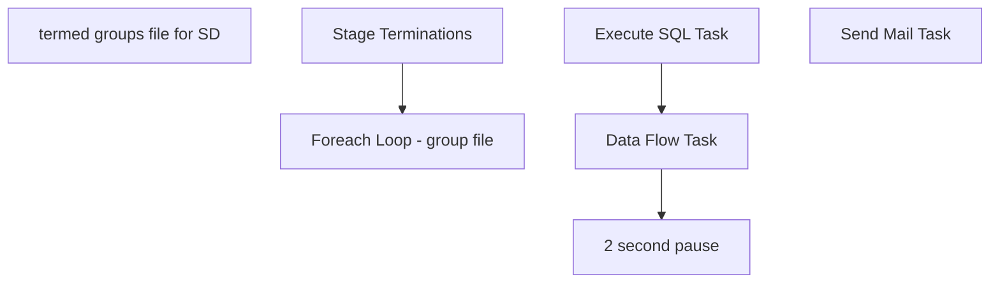

# SSIS Package: HR_TerminationGroups

**Project:** HR_TerminationGroups  
**Folder:** HR  
**Server:** STL-SSIS-P-01  

## Connection Managers

| Name | Type | Server | Catalog | Connection (sanitized) |
|---|---|---|---|---|
| Active Directory Connection Manager | ActiveDirectory |  |  |  |
| DW | OLEDB | papamart | dw | Data Source=papamart; Initial Catalog=dw; Provider=SQLNCLI11.1; Integrated Security=SSPI; Auto Translate=False |
| EmployeesCSV | FLATFILE |  |  |  |
| SMTP | SMTP |  |  |  |
| papamart.DWStaging | OLEDB | papamart | DWStaging | Data Source=papamart; Initial Catalog=DWStaging; Provider=SQLNCLI11.1; Integrated Security=SSPI; Auto Translate=False |
| termedEmployeesGroupsFile | FLATFILE |  |  |  |
| termedEmployeesGroupsFile2 | FLATFILE |  |  |  |
| termedEmployeesGroupsFile3 | FLATFILE |  |  |  |

## Control Flow Tasks

| Task | Type |
|---|---|
| HR_TerminationGroups | Package |
| termed groups file for SD | SEQUENCE |
| Foreach Loop - group file | FOREACHLOOP |
| 2 second pause | FORLOOP |
| Data Flow Task | Pipeline |
| Execute SQL Task | ExecuteSQLTask |
| Stage Terminations | ExecuteSQLTask |
| Send Mail Task | SendMailTask |

## Control Flow Outline

```text
- Send Mail Task [SendMailTask]
- termed groups file for SD [SEQUENCE]
  - Foreach Loop - group file [FOREACHLOOP]
    - 2 second pause [FORLOOP]
    - Data Flow Task [Pipeline]
    - Execute SQL Task [ExecuteSQLTask]
  - Stage Terminations [ExecuteSQLTask]
```

## Architecture Diagram



## Variables

| Namespace | Name | Expression-bound |
|---|---|---|
| System | Propagate | No |
| User | DateTimeStamp | Yes |
| User | EffectiveDate | No |
| User | EmployeeID | No |
| User | EmployeeName | No |
| User | EmployeesFile | No |
| User | EndDate | Yes |
| User | EndDateAsDATE | Yes |
| User | GetDate | Yes |
| User | GetDateAsDATE | Yes |
| User | JobDescription | No |
| User | RowCount | No |
| User | StagedTerminations | No |
| User | StagedTerminationsLoopVariable | No |
| User | StartDate | Yes |
| User | StartDateAsDATE | Yes |
| User | SupervisorID | No |
| User | SupervisorName | No |
| User | TerminationEmailAddress | No |
| User | TerminationGroups | No |
| User | Terminations | No |
| User | samaccountname | No |
| User | varGroupFilePath | No |
| User | varGroupFilePath2 | No |

### Expression-bound variable values

#### User::DateTimeStamp

**Expression:**

```sql
(DT_WSTR,4)DATEPART("yyyy",GetDate()) 
+ (DT_WSTR,4)DATEPART("mm",GetDate()) 
+ (DT_WSTR,4)DATEPART("dd",GetDate()) 
+ (DT_WSTR,4)DATEPART("hh",GetDate()) 
+ (DT_WSTR,4)DATEPART("mi",GetDate()) 
+ (DT_WSTR,4)DATEPART("ss",GetDate()) 
+ (DT_WSTR,4)DATEPART("ms",GetDate())
```

**Evaluated value:**

```sql
2022110105146277
```

#### User::EndDate

**Expression:**

```sql
dateadd("dd", @[$Package::DaysToInclude], @[User::StartDate])
```

**Evaluated value:**

```sql
1/10/2022
```

#### User::EndDateAsDATE

**Expression:**

```sql
(DT_WSTR, 4) datepart("year", @[User::EndDate])  + "-" + 
(DT_WSTR, 2) datepart("mm", @[User::EndDate])  + "-" + 
(DT_WSTR, 2) datepart("dd",  @[User::EndDate])
```

**Evaluated value:**

```sql
2022-1-10
```

#### User::GetDate

**Expression:**

```sql
(DT_DATE)DATEDIFF("Day", (DT_DATE) 0, GETDATE())
```

**Evaluated value:**

```sql
1/10/2022
```

#### User::GetDateAsDATE

**Expression:**

```sql
(DT_WSTR, 4) datepart("year", @[User::GetDate])  + "-" + 
(DT_WSTR, 2) datepart("mm", @[User::GetDate])  + "-" + 
(DT_WSTR, 2) datepart("dd",  @[User::GetDate])
```

**Evaluated value:**

```sql
2022-1-10
```

#### User::StartDate

**Expression:**

```sql
dateadd("dd", -@[$Package::DaysToGoBack] , @[User::GetDate] )
```

**Evaluated value:**

```sql
1/9/2022
```

#### User::StartDateAsDATE

**Expression:**

```sql
(DT_WSTR, 4) datepart("year", @[User::StartDate])  + "-" + 
(DT_WSTR, 2) datepart("mm", @[User::StartDate])  + "-" + 
(DT_WSTR, 2) datepart("dd",  @[User::StartDate])
```

**Evaluated value:**

```sql
2022-1-9
```

## Execute SQL Tasks

### Execute SQL Task

**Path:** `Package\termed groups file for SD\Foreach Loop - group file\Execute SQL Task`  
**Connection:** DW (papamart/dw)  

```sql
-- do nothing
```

### Stage Terminations

**Path:** `Package\termed groups file for SD\Stage Terminations`  
**Connection:** DW (papamart/dw)  

```sql

select
 eepEEID as EmployeeID,
 concat(eepNameFirst, ' ', eepNameLast) as EmployeeName,
 jbcLongDesc as JobDescription,
 isnull(convert(varchar, TerminatedEffectiveDate,101), 'null') as EffectiveDate,
 SupervisorID, 
 SupervisorName,
 samaccountname
from UHCMEmp 
where 1=1
and datediff(dd, TerminatedEffectiveDate, getdate()) <= 7
and isnumeric(samaccountname) = 0
and samaccountname is not null
and samaccountname <> ''
```

## Data Flow: Sources

| Component | Source Object | Type | Data Flow Task | Connection | SQL Kind |
|---|---|---|---|---|---|
| OLE DB Source |  | OLEDBSource | Data Flow Task | papamart.DWStaging | SqlCommand |

#### OLE DB Source — SqlCommand

```sql
DECLARE @s NVARCHAR(MAX)

set @s = (select MemberOf from [dbo].[ADattributes] where EmployeeID = ?);


select left(replace(Item,'CN=',''),charindex(',',replace(Item,'CN=',''),1)-1) 
as groupsNames
FROM dbo.SplitStrings_CTE     (@s, N';');
```

## Data Flow: Destinations

| Component | Target Table | Type | Data Flow Task | Connection | SQL Kind |
|---|---|---|---|---|---|
| Flat File Destination |  | FlatFileDestination | Data Flow Task | termedEmployeesGroupsFile3 |  |
