# SSIS Package: HR_TerminationNotification

**Project:** HR_TerminationNotification  
**Folder:** HR  
**Server:** STL-SSIS-P-01  

## Connection Managers

| Name | Type | Server | Catalog | Connection (sanitized) |
|---|---|---|---|---|
| Active Directory Connection Manager | ActiveDirectory |  |  |  |
| DW | OLEDB | papamart | dw | Data Source=papamart; Initial Catalog=dw; Provider=SQLNCLI11.1; Integrated Security=SSPI; Auto Translate=False |
| EmployeesCSV | FLATFILE |  |  |  |
| SMTP | SMTP |  |  |  |
| papamart.DWStaging | OLEDB | papamart | DWStaging | Data Source=papamart; Initial Catalog=DWStaging; Provider=SQLNCLI11.1; Integrated Security=SSPI; Auto Translate=False |
| termedEmployeesGroupsFile | FLATFILE |  |  |  |
| termedEmployeesGroupsFile2 | FLATFILE |  |  |  |
| termedEmployeesGroupsFile3 | FLATFILE |  |  |  |

## Control Flow Tasks

| Task | Type |
|---|---|
| HR_TerminationNotification | Package |
| SEQ - UltiPro Terminations for EmployeeID NOT in AD | SEQUENCE |
| Count Rows | ExecuteSQLTask |
| DataFlow - ActiveDirectoryDataStage | Pipeline |
| DataFlow - UltiProTerminatedEmployeesNotInAD | Pipeline |
| Foreach Loop Container | FOREACHLOOP |
| Send Mail | SendMailTask |
| Truncate ActiveDirectoryDataStage | ExecuteSQLTask |
| Sequence Container | SEQUENCE |
| Foreach Loop - Email Terminations | FOREACHLOOP |
| Send Mail Task | SendMailTask |
| Stage Terminations | ExecuteSQLTask |
| termed groups file for SD | SEQUENCE |
| Foreach Loop - group file | FOREACHLOOP |
| 2 second pause | FORLOOP |
| Data Flow Task | Pipeline |
| Execute SQL Task | ExecuteSQLTask |
| Stage Terminations | ExecuteSQLTask |
| Send Mail Task | SendMailTask |

## Control Flow Outline

```text
- Send Mail Task [SendMailTask]
- SEQ - UltiPro Terminations for EmployeeID NOT in AD [SEQUENCE]
  - Count Rows [ExecuteSQLTask]
  - DataFlow - ActiveDirectoryDataStage [Pipeline]
  - DataFlow - UltiProTerminatedEmployeesNotInAD [Pipeline]
  - Foreach Loop Container [FOREACHLOOP]
    - Send Mail [SendMailTask]
  - Truncate ActiveDirectoryDataStage [ExecuteSQLTask]
- Sequence Container [SEQUENCE]
  - Foreach Loop - Email Terminations [FOREACHLOOP]
    - Send Mail Task [SendMailTask]
  - Stage Terminations [ExecuteSQLTask]
- termed groups file for SD [SEQUENCE]
  - Foreach Loop - group file [FOREACHLOOP]
    - 2 second pause [FORLOOP]
    - Data Flow Task [Pipeline]
    - Execute SQL Task [ExecuteSQLTask]
  - Stage Terminations [ExecuteSQLTask]
```

## Architecture Diagram

```mermaid
flowchart TD
    n_Package_SEQ___UltiPro_Terminations_for_EmployeeID_NOT_in_AD["SEQ - UltiPro Terminations for EmployeeID NOT in AD"]
    n_Package_SEQ___UltiPro_Terminations_for_EmployeeID_NOT_in_AD_Count_Rows["Count Rows"]
    n_Package_SEQ___UltiPro_Terminations_for_EmployeeID_NOT_in_AD_DataFlow___ActiveDirectoryDataStage["DataFlow - ActiveDirectoryDataStage"]
    n_Package_SEQ___UltiPro_Terminations_for_EmployeeID_NOT_in_AD_DataFlow___UltiProTerminatedEmployeesNotInAD["DataFlow - UltiProTerminatedEmployeesNotInAD"]
    n_Package_SEQ___UltiPro_Terminations_for_EmployeeID_NOT_in_AD_Foreach_Loop_Container["Foreach Loop Container"]
    n_Package_SEQ___UltiPro_Terminations_for_EmployeeID_NOT_in_AD_Foreach_Loop_Container_Send_Mail["Send Mail"]
    n_Package_SEQ___UltiPro_Terminations_for_EmployeeID_NOT_in_AD_Truncate_ActiveDirectoryDataStage["Truncate ActiveDirectoryDataStage"]
    n_Package_Sequence_Container["Sequence Container"]
    n_Package_Sequence_Container_Foreach_Loop___Email_Terminations["Foreach Loop - Email Terminations"]
    n_Package_Sequence_Container_Foreach_Loop___Email_Terminations_Send_Mail_Task["Send Mail Task"]
    n_Package_Sequence_Container_Stage_Terminations["Stage Terminations"]
    n_Package_termed_groups_file_for_SD["termed groups file for SD"]
    n_Package_termed_groups_file_for_SD_Foreach_Loop___group_file["Foreach Loop - group file"]
    n_Package_termed_groups_file_for_SD_Foreach_Loop___group_file_2_second_pause["2 second pause"]
    n_Package_termed_groups_file_for_SD_Foreach_Loop___group_file_Data_Flow_Task["Data Flow Task"]
    n_Package_termed_groups_file_for_SD_Foreach_Loop___group_file_Execute_SQL_Task["Execute SQL Task"]
    n_Package_termed_groups_file_for_SD_Stage_Terminations["Stage Terminations"]
    n_Package_EventHandlers_OnError__Send_Mail_Task["Send Mail Task"]
    n_Package_SEQ___UltiPro_Terminations_for_EmployeeID_NOT_in_AD_Truncate_ActiveDirectoryDataStage --> n_Package_SEQ___UltiPro_Terminations_for_EmployeeID_NOT_in_AD_DataFlow___ActiveDirectoryDataStage
    n_Package_SEQ___UltiPro_Terminations_for_EmployeeID_NOT_in_AD_DataFlow___UltiProTerminatedEmployeesNotInAD --> n_Package_SEQ___UltiPro_Terminations_for_EmployeeID_NOT_in_AD_Foreach_Loop_Container
    n_Package_SEQ___UltiPro_Terminations_for_EmployeeID_NOT_in_AD_DataFlow___ActiveDirectoryDataStage --> n_Package_SEQ___UltiPro_Terminations_for_EmployeeID_NOT_in_AD_Count_Rows
    n_Package_SEQ___UltiPro_Terminations_for_EmployeeID_NOT_in_AD_Count_Rows --> n_Package_SEQ___UltiPro_Terminations_for_EmployeeID_NOT_in_AD_DataFlow___UltiProTerminatedEmployeesNotInAD
    n_Package_Sequence_Container_Stage_Terminations --> n_Package_Sequence_Container_Foreach_Loop___Email_Terminations
    n_Package_termed_groups_file_for_SD_Foreach_Loop___group_file_Data_Flow_Task --> n_Package_termed_groups_file_for_SD_Foreach_Loop___group_file_2_second_pause
    n_Package_termed_groups_file_for_SD_Foreach_Loop___group_file_Execute_SQL_Task --> n_Package_termed_groups_file_for_SD_Foreach_Loop___group_file_Data_Flow_Task
    n_Package_termed_groups_file_for_SD_Stage_Terminations --> n_Package_termed_groups_file_for_SD_Foreach_Loop___group_file
    n_Package_Sequence_Container --> n_Package_SEQ___UltiPro_Terminations_for_EmployeeID_NOT_in_AD
    n_Package_SEQ___UltiPro_Terminations_for_EmployeeID_NOT_in_AD --> n_Package_termed_groups_file_for_SD
```



## Variables

| Namespace | Name | Expression-bound |
|---|---|---|
| System | Propagate | No |
| User | DateTimeStamp | Yes |
| User | EffectiveDate | No |
| User | EmployeeID | No |
| User | EmployeeName | No |
| User | EmployeesFile | No |
| User | EndDate | Yes |
| User | EndDateAsDATE | Yes |
| User | GetDate | Yes |
| User | GetDateAsDATE | Yes |
| User | JobDescription | No |
| User | RowCount | No |
| User | StagedTerminations | No |
| User | StagedTerminationsLoopVariable | No |
| User | StartDate | Yes |
| User | StartDateAsDATE | Yes |
| User | SupervisorID | No |
| User | SupervisorName | No |
| User | TerminationEmailAddress | No |
| User | TerminationGroups | No |
| User | Terminations | No |
| User | samaccountname | No |
| User | varGroupFilePath | No |
| User | varGroupFilePath2 | No |

### Expression-bound variable values

#### User::DateTimeStamp

**Expression:**

```sql
(DT_WSTR,4)DATEPART("yyyy",GetDate()) 
+ (DT_WSTR,4)DATEPART("mm",GetDate()) 
+ (DT_WSTR,4)DATEPART("dd",GetDate()) 
+ (DT_WSTR,4)DATEPART("hh",GetDate()) 
+ (DT_WSTR,4)DATEPART("mi",GetDate()) 
+ (DT_WSTR,4)DATEPART("ss",GetDate()) 
+ (DT_WSTR,4)DATEPART("ms",GetDate())
```

**Evaluated value:**

```sql
202452910410753
```

#### User::EndDate

**Expression:**

```sql
dateadd("dd", @[$Package::DaysToInclude], @[User::StartDate])
```

**Evaluated value:**

```sql
5/29/2024
```

#### User::EndDateAsDATE

**Expression:**

```sql
(DT_WSTR, 4) datepart("year", @[User::EndDate])  + "-" + 
(DT_WSTR, 2) datepart("mm", @[User::EndDate])  + "-" + 
(DT_WSTR, 2) datepart("dd",  @[User::EndDate])
```

**Evaluated value:**

```sql
2024-5-29
```

#### User::GetDate

**Expression:**

```sql
(DT_DATE)DATEDIFF("Day", (DT_DATE) 0, GETDATE())
```

**Evaluated value:**

```sql
5/29/2024
```

#### User::GetDateAsDATE

**Expression:**

```sql
(DT_WSTR, 4) datepart("year", @[User::GetDate])  + "-" + 
(DT_WSTR, 2) datepart("mm", @[User::GetDate])  + "-" + 
(DT_WSTR, 2) datepart("dd",  @[User::GetDate])
```

**Evaluated value:**

```sql
2024-5-29
```

#### User::StartDate

**Expression:**

```sql
dateadd("dd", -@[$Package::DaysToGoBack] , @[User::GetDate] )
```

**Evaluated value:**

```sql
5/28/2024
```

#### User::StartDateAsDATE

**Expression:**

```sql
(DT_WSTR, 4) datepart("year", @[User::StartDate])  + "-" + 
(DT_WSTR, 2) datepart("mm", @[User::StartDate])  + "-" + 
(DT_WSTR, 2) datepart("dd",  @[User::StartDate])
```

**Evaluated value:**

```sql
2024-5-28
```

## Execute SQL Tasks

### Count Rows

**Path:** `Package\SEQ - UltiPro Terminations for EmployeeID NOT in AD\Count Rows`  
**Connection:** DW (papamart/dw)  

```sql
select count(*) as RowzCount
from vwUltiProTerminationsEmployeeIdNotInAD
```

### Truncate ActiveDirectoryDataStage

**Path:** `Package\SEQ - UltiPro Terminations for EmployeeID NOT in AD\Truncate ActiveDirectoryDataStage`  
**Connection:** DW (papamart/dw)  

```sql
Truncate Table ActiveDirectoryDataStage
```

### Stage Terminations

**Path:** `Package\Sequence Container\Stage Terminations`  
**Connection:** DW (papamart/dw)  

```sql
select
	eepEEID as EmployeeID,
	concat(eepNameFirst, ' ', eepNameLast) as EmployeeName,
	jbcLongDesc as JobDescription,
	convert(varchar, TerminatedEffectiveDate,101) as EffectiveDate,
	SupervisorID, 
	SupervisorName
from UHCMEmp 
where 1=1
and datediff(dd, TerminatedEffectiveDate, getdate()) = 0
and JbcJobCode not in ('BB', 'SL', 'AWM', 'CWM', 'CNBB', 'CNSL', 'CNAWM', 'CNCWM', 'UKBB', 'UKSL', 'UKAWM', 'UKCWM', 'WEBBBI', 'WEBBBII','SLTMP',
'Assistant Workshop Manager','Bear Builder','Bearbuilder','IrelandAssistant Workshop Manager30','IrelandBear Builder4','IrelandSales Lead Hourly12',
'IrelandSales Lead Hourly20','Sales Lead','Sales Lead Hourly','Sales Lead(Annual Salary)','Sales Lead(Hourly)','UKSales Lead Hourly12',
'UKSales Lead Hourly20','UKSales Lead Hourly4','UKAssistant Workshop Manager20','UKAssistant Workshop Manager25','UKAssistant Workshop Manager30',
'UKAssistant Workshop Manager35','UKAssistant Workshop Manager40','UKBear Builder4')
order by SupervisorName, EmployeeID


```

### Execute SQL Task

**Path:** `Package\termed groups file for SD\Foreach Loop - group file\Execute SQL Task`  
**Connection:** DW (papamart/dw)  

```sql
-- do nothing
```

### Stage Terminations

**Path:** `Package\termed groups file for SD\Stage Terminations`  
**Connection:** DW (papamart/dw)  

```sql
select
 eepEEID as EmployeeID,
 concat(eepNameFirst, ' ', eepNameLast) as EmployeeName,
 jbcLongDesc as JobDescription,
 isnull(convert(varchar, TerminatedEffectiveDate,101), 'null') as EffectiveDate,
 SupervisorID, 
 SupervisorName,
 samaccountname
from UHCMEmp 
where 1=1
and datediff(dd, TerminatedEffectiveDate, getdate()) = 0
and isnumeric(samaccountname) = 0
and samaccountname is not null
and samaccountname <> ''


```

## Data Flow: Sources

| Component | Source Object | Type | Data Flow Task | Connection | SQL Kind |
|---|---|---|---|---|---|
| SQL |  | OLEDBSource | DataFlow - UltiProTerminatedEmployeesNotInAD | DW | SqlCommand |
| OLE DB Source |  | OLEDBSource | Data Flow Task | papamart.DWStaging | SqlCommand |

#### SQL — SqlCommand

```sql
with 
StagedTerminations as
	(
		select t.EmployeeID
		from vwUltiProValidationVsADStageVsAD t
		left join ActiveDirectoryDataStage ad on t.EmployeeID=ad.EmployeeID
		where datediff(dd, t.ADStageDate, getdate()) <=1
		and t.StagedProvisionEvent = 'T'
		--and t.EmployeeID = '0036964'
		and ad.EmployeeID is NULL
		UNION
		select t.EmployeeID
		from vwUltiProValidationVsADStageVsAD t
		join ActiveDirectoryDataStage ad on t.EmployeeID=ad.EmployeeID
		where 1=1
		and datediff(dd, t.ADStageDate, getdate()) <= 1
		and t.StagedProvisionEvent = 'T'
		and ad.memberOf like '%SelfServe%'
	)
select 
	eepeeid EmployeeID,
	eepnamefirst FirstName,
	eepnameLast LastName,
	JbcLongDesc JobDescription,
	eecemplStatus EmployeeStatus,
	eecDateofLastHire,
	TerminationDate,
	TerminatedEffectiveDate,
	TErminatedEnteredDate,
	eepAddressEmail EmailAddress,
	sAMAccountName,
	isnull(UpdateDate, InsertDate) LastUltiProUpdate
from uhcmemp
where 1=1
and EecLocation <> 'UKBQ'   
and EecLocation not like '2%'
and eecEmplStatus = 'Terminated'
--and datediff(dd, isnull(UpdateDate, InsertDate), getdate()) = 0
and eepeeid in (select EmployeeID from StagedTerminations)
order by eecemplStatus, JobDescription,isnull(UpdateDate, InsertDate), eepeeid
```

#### OLE DB Source — SqlCommand

```sql
DECLARE @s NVARCHAR(MAX)

set @s = (select MemberOf from [dbo].[ADattributes] where EmployeeID = ?);


select left(replace(Item,'CN=',''),charindex(',',replace(Item,'CN=',''),1)-1) 
as groupsNames
FROM dbo.SplitStrings_CTE     (@s, N';');
```

## Data Flow: Destinations

| Component | Target Table | Type | Data Flow Task | Connection | SQL Kind |
|---|---|---|---|---|---|
| ActiveDirectoryDataStage |  | OLEDBDestination | DataFlow - ActiveDirectoryDataStage | DW |  |
| EmployeesCSV |  | FlatFileDestination | DataFlow - UltiProTerminatedEmployeesNotInAD | EmployeesCSV |  |
| Flat File Destination |  | FlatFileDestination | Data Flow Task | termedEmployeesGroupsFile3 |  |
