# SSIS Package: HR_TerminationNotification

**Project:** HR_TerminationNotification  
**Folder:** HR  
**Server:** STL-SSIS-P-01  

## Architecture Diagram

```mermaid
flowchart TD
    subgraph Connections
        Active_Directory_Connection_Manager_conn(["Active Directory Connection Manager [ActiveDirectory]"])
        DW_conn(["DW [OLEDB]"])
        EmployeesCSV_conn(["EmployeesCSV [FLATFILE]"])
        papamart_DWStaging_conn(["papamart.DWStaging [OLEDB]"])
        SMTP_conn(["SMTP [SMTP]"])
        termedEmployeesGroupsFile_conn(["termedEmployeesGroupsFile [FLATFILE]"])
        termedEmployeesGroupsFile2_conn(["termedEmployeesGroupsFile2 [FLATFILE]"])
        termedEmployeesGroupsFile3_conn(["termedEmployeesGroupsFile3 [FLATFILE]"])
    end
    subgraph ControlFlow
        HR_TerminationNotification_task["HR_TerminationNotification"]
        SEQ___UltiPro_Terminations_for_EmployeeID_NOT_in_AD_task["SEQ - UltiPro Terminations for EmployeeID NOT in AD"]
        HR_TerminationNotification_task --> SEQ___UltiPro_Terminations_for_EmployeeID_NOT_in_AD_task
        Count_Rows_task["Count Rows"]
        SEQ___UltiPro_Terminations_for_EmployeeID_NOT_in_AD_task --> Count_Rows_task
        DataFlow___ActiveDirectoryDataStage_task["DataFlow - ActiveDirectoryDataStage"]
        Count_Rows_task --> DataFlow___ActiveDirectoryDataStage_task
        DataFlow___UltiProTerminatedEmployeesNotInAD_task["DataFlow - UltiProTerminatedEmployeesNotInAD"]
        DataFlow___ActiveDirectoryDataStage_task --> DataFlow___UltiProTerminatedEmployeesNotInAD_task
        Foreach_Loop_Container_task["Foreach Loop Container"]
        DataFlow___UltiProTerminatedEmployeesNotInAD_task --> Foreach_Loop_Container_task
        Send_Mail_task["Send Mail"]
        Foreach_Loop_Container_task --> Send_Mail_task
        Truncate_ActiveDirectoryDataStage_task["Truncate ActiveDirectoryDataStage"]
        Send_Mail_task --> Truncate_ActiveDirectoryDataStage_task
        Sequence_Container_task["Sequence Container"]
        Truncate_ActiveDirectoryDataStage_task --> Sequence_Container_task
        Foreach_Loop___Email_Terminations_task["Foreach Loop - Email Terminations"]
        Sequence_Container_task --> Foreach_Loop___Email_Terminations_task
        Send_Mail_Task_task["Send Mail Task"]
        Foreach_Loop___Email_Terminations_task --> Send_Mail_Task_task
        Stage_Terminations_task["Stage Terminations"]
        Send_Mail_Task_task --> Stage_Terminations_task
        termed_groups_file_for_SD_task["termed groups file for SD"]
        Stage_Terminations_task --> termed_groups_file_for_SD_task
        Foreach_Loop___group_file_task["Foreach Loop - group file"]
        termed_groups_file_for_SD_task --> Foreach_Loop___group_file_task
        2_second_pause_task["2 second pause"]
        Foreach_Loop___group_file_task --> 2_second_pause_task
        Data_Flow_Task_task["Data Flow Task"]
        2_second_pause_task --> Data_Flow_Task_task
        Execute_SQL_Task_task["Execute SQL Task"]
        Data_Flow_Task_task --> Execute_SQL_Task_task
        Stage_Terminations_task["Stage Terminations"]
        Execute_SQL_Task_task --> Stage_Terminations_task
        Send_Mail_Task_task["Send Mail Task"]
        Stage_Terminations_task --> Send_Mail_Task_task
    end
```

## Connection Managers

| Name | Type |
|---|---|
| Active Directory Connection Manager | ActiveDirectory |
| DW | OLEDB |
| EmployeesCSV | FLATFILE |
| papamart.DWStaging | OLEDB |
| SMTP | SMTP |
| termedEmployeesGroupsFile | FLATFILE |
| termedEmployeesGroupsFile2 | FLATFILE |
| termedEmployeesGroupsFile3 | FLATFILE |

## Control Flow Tasks

| Task | Type |
|---|---|
| HR_TerminationNotification | Microsoft.Package |
| SEQ - UltiPro Terminations for EmployeeID NOT in AD | STOCK:SEQUENCE |
| Count Rows | Microsoft.ExecuteSQLTask |
| DataFlow - ActiveDirectoryDataStage | Microsoft.Pipeline |
| DataFlow - UltiProTerminatedEmployeesNotInAD | Microsoft.Pipeline |
| Foreach Loop Container | STOCK:FOREACHLOOP |
| Send Mail | Microsoft.SendMailTask |
| Truncate ActiveDirectoryDataStage | Microsoft.ExecuteSQLTask |
| Sequence Container | STOCK:SEQUENCE |
| Foreach Loop - Email Terminations | STOCK:FOREACHLOOP |
| Send Mail Task | Microsoft.SendMailTask |
| Stage Terminations | Microsoft.ExecuteSQLTask |
| termed groups file for SD | STOCK:SEQUENCE |
| Foreach Loop - group file | STOCK:FOREACHLOOP |
| 2 second pause | STOCK:FORLOOP |
| Data Flow Task | Microsoft.Pipeline |
| Execute SQL Task | Microsoft.ExecuteSQLTask |
| Stage Terminations | Microsoft.ExecuteSQLTask |
| Send Mail Task | Microsoft.SendMailTask |

## Data Flow: Sources

| Component | SQL Preview |
|---|---|
|  | with  StagedTerminations as 	( 		select t.EmployeeID 		from vwUltiProValidationVsADStageVsAD t 		left join ActiveDirectoryDataStage ad on t.EmployeeID=ad.EmployeeID 		where datediff(dd, t.ADStageDate, getdate()) <=1 		and t.StagedProvisionEvent = 'T' 		--and t.EmployeeID = '0036964' 		and ad.EmployeeID is NULL 		UNION 		select t.EmployeeID 		from vwUltiProValidationVsADStageVsAD t 		join ActiveDir |
|  | DECLARE @s NVARCHAR(MAX)  set @s = (select MemberOf from [dbo].[ADattributes] where EmployeeID = ?);   select left(replace(Item,'CN=',''),charindex(',',replace(Item,'CN=',''),1)-1)  as groupsNames FROM dbo.SplitStrings_CTE     (@s, N';'); |

## Data Flow: Destinations

| Component | Destination |
|---|---|
|  | [ActiveDirectoryDataStage] |
|  | [dbo].[vwUltiProTerminationsEmployeeIdNotInAD] |

