# SSIS Package: HR_UKPanToSageNewHireCSV

**Project:** HR_UKPanToSageNewHireCSV  
**Folder:** HR  
**Server:** STL-SSIS-P-01  

## Connection Managers

| Name | Type | Server | Catalog | Connection (sanitized) |
|---|---|---|---|---|
| IntegrationStaging | OLEDB | stl-ssis-p-01 | IntegrationStaging | Data Source=stl-ssis-p-01; Initial Catalog=IntegrationStaging; Provider=SQLNCLI11.1; Integrated Security=SSPI; Auto Translate=False |
| PersonnelActionNotification | OLEDB | kodiak | PersonnelActionNotification | Data Source=kodiak; Initial Catalog=PersonnelActionNotification; Provider=SQLNCLI11.1; Integrated Security=SSPI; Auto Translate=False |
| SMTP | SMTP |  |  |  |
| UKPanToSageNewHireLoad_ CSV | FLATFILE |  |  |  |
| UKPanToSageNewHireLoad_ CSV_ | FLATFILE |  |  |  |
| dw | OLEDB | papamart | dw | Data Source=papamart; Initial Catalog=dw; Provider=SQLNCLI11.1; Integrated Security=SSPI; Auto Translate=False |

## Control Flow Tasks

| Task | Type |
|---|---|
| HR_UKPanToSageNewHireCSV | Package |
| Sequence Container - Load PAN Data to CSV | SEQUENCE |
| Data Flow Task - Load Last 3 Days of Data to IntStaging | Pipeline |
| Data Flow Task - Load Last 3 Days of Data to IntStaging (backup) | Pipeline |
| Data Flow Task - Load Yesterdayto CSV | Pipeline |
| Data Flow Task - Load Yesterdayto CSV (backup) | Pipeline |
| Execute SQL Task - Truncate Stage | ExecuteSQLTask |
| Sequence Container - Upload CSV To SFTP | SEQUENCE |
| FEL - Archive File | FOREACHLOOP |
| Archive File | FileSystemTask |
| FEL - move file to UKPAN folder | FOREACHLOOP |
| move to UKPAN folder | FileSystemTask |
| WinScp - Upload File to FairSail | ExecuteProcess |
| Send Mail Task | SendMailTask |

## Control Flow Outline

```text
- Send Mail Task [SendMailTask]
- Sequence Container - Load PAN Data to CSV [SEQUENCE]
  - Data Flow Task - Load Last 3 Days of Data to IntStaging [Pipeline]
  - Data Flow Task - Load Last 3 Days of Data to IntStaging (backup) [Pipeline]
  - Data Flow Task - Load Yesterdayto CSV [Pipeline]
  - Data Flow Task - Load Yesterdayto CSV (backup) [Pipeline]
  - Execute SQL Task - Truncate Stage [ExecuteSQLTask]
- Sequence Container - Upload CSV To SFTP [SEQUENCE]
  - FEL - Archive File [FOREACHLOOP]
    - Archive File [FileSystemTask]
  - FEL - move file to UKPAN folder [FOREACHLOOP]
    - move to UKPAN folder [FileSystemTask]
  - WinScp - Upload File to FairSail [ExecuteProcess]
```

## Architecture Diagram

```mermaid
flowchart TD
    n_Package_Sequence_Container___Load_PAN_Data_to_CSV["Sequence Container - Load PAN Data to CSV"]
    n_Package_Sequence_Container___Load_PAN_Data_to_CSV_Data_Flow_Task___Load_Last_3_Days_of_Data_to_IntStaging["Data Flow Task - Load Last 3 Days of Data to IntStaging"]
    n_Package_Sequence_Container___Load_PAN_Data_to_CSV_Data_Flow_Task___Load_Last_3_Days_of_Data_to_IntStaging__backup_["Data Flow Task - Load Last 3 Days of Data to IntStaging (backup)"]
    n_Package_Sequence_Container___Load_PAN_Data_to_CSV_Data_Flow_Task___Load_Yesterdayto_CSV["Data Flow Task - Load Yesterdayto CSV"]
    n_Package_Sequence_Container___Load_PAN_Data_to_CSV_Data_Flow_Task___Load_Yesterdayto_CSV__backup_["Data Flow Task - Load Yesterdayto CSV (backup)"]
    n_Package_Sequence_Container___Load_PAN_Data_to_CSV_Execute_SQL_Task___Truncate_Stage["Execute SQL Task - Truncate Stage"]
    n_Package_Sequence_Container___Upload_CSV_To_SFTP["Sequence Container - Upload CSV To SFTP"]
    n_Package_Sequence_Container___Upload_CSV_To_SFTP_FEL___Archive_File["FEL - Archive File"]
    n_Package_Sequence_Container___Upload_CSV_To_SFTP_FEL___Archive_File_Archive_File["Archive File"]
    n_Package_Sequence_Container___Upload_CSV_To_SFTP_FEL___move_file_to_UKPAN_folder["FEL - move file to UKPAN folder"]
    n_Package_Sequence_Container___Upload_CSV_To_SFTP_FEL___move_file_to_UKPAN_folder_move_to_UKPAN_folder["move to UKPAN folder"]
    n_Package_Sequence_Container___Upload_CSV_To_SFTP_WinScp___Upload_File_to_FairSail["WinScp - Upload File to FairSail"]
    n_Package_EventHandlers_OnError__Send_Mail_Task["Send Mail Task"]
    n_Package_Sequence_Container___Load_PAN_Data_to_CSV_Execute_SQL_Task___Truncate_Stage --> n_Package_Sequence_Container___Load_PAN_Data_to_CSV_Data_Flow_Task___Load_Last_3_Days_of_Data_to_IntStaging
    n_Package_Sequence_Container___Load_PAN_Data_to_CSV_Data_Flow_Task___Load_Last_3_Days_of_Data_to_IntStaging --> n_Package_Sequence_Container___Load_PAN_Data_to_CSV_Data_Flow_Task___Load_Yesterdayto_CSV
    n_Package_Sequence_Container___Upload_CSV_To_SFTP_FEL___move_file_to_UKPAN_folder --> n_Package_Sequence_Container___Upload_CSV_To_SFTP_FEL___Archive_File
    n_Package_Sequence_Container___Load_PAN_Data_to_CSV --> n_Package_Sequence_Container___Upload_CSV_To_SFTP
```



## Variables

| Namespace | Name | Expression-bound |
|---|---|---|
| System | Propagate | No |
| User | ArchiveFileDest | No |
| User | ArchiveFileName | No |
| User | DateTimeStamp | Yes |
| User | EndDate | Yes |
| User | EndDateAsDATE | Yes |
| User | FileDestDir | No |
| User | FileDestDir2 | No |
| User | GetDate | Yes |
| User | GetDateAsDATE | Yes |
| User | StartDate | Yes |
| User | StartDateAsDATE | Yes |

### Expression-bound variable values

#### User::DateTimeStamp

**Expression:**

```sql
(DT_WSTR,4)DATEPART("yyyy",GetDate()) 
+ (DT_WSTR,4)DATEPART("mm",GetDate()) 
+ (DT_WSTR,4)DATEPART("dd",GetDate()) 
+ (DT_WSTR,4)DATEPART("hh",GetDate()) 
+ (DT_WSTR,4)DATEPART("mi",GetDate()) 
+ (DT_WSTR,4)DATEPART("ss",GetDate()) 
+ (DT_WSTR,4)DATEPART("ms",GetDate())
```

**Evaluated value:**

```sql
202251975111517
```

#### User::EndDate

**Expression:**

```sql
dateadd("dd", @[$Package::DaysToInclude], @[User::StartDate])
```

**Evaluated value:**

```sql
5/19/2022
```

#### User::EndDateAsDATE

**Expression:**

```sql
(DT_WSTR, 4) datepart("year", @[User::EndDate])  + "-" +
right("0"+ (DT_WSTR, 2) datepart("mm", @[User::EndDate]),2)  + "-" +
right("0" +(DT_WSTR, 2) datepart("dd",  @[User::EndDate]),2)
```

**Evaluated value:**

```sql
2022-05-19
```

#### User::GetDate

**Expression:**

```sql
(DT_DATE)DATEDIFF("Day", (DT_DATE) 0, GETDATE())
```

**Evaluated value:**

```sql
5/19/2022
```

#### User::GetDateAsDATE

**Expression:**

```sql
(DT_WSTR, 4) datepart("year", @[User::GetDate])  + "-" +
right("0"+ (DT_WSTR, 2) datepart("mm", @[User::GetDate]),2)  + "-" +
right("0" +(DT_WSTR, 2) datepart("dd",  @[User::GetDate]),2)
```

**Evaluated value:**

```sql
2022-05-19
```

#### User::StartDate

**Expression:**

```sql
dateadd("dd", -@[$Package::DaysToGoBack] , @[User::GetDate] )
```

**Evaluated value:**

```sql
5/18/2022
```

#### User::StartDateAsDATE

**Expression:**

```sql
(DT_WSTR, 4) datepart("year", @[User::StartDate])  + "-" +
right("0"+ (DT_WSTR, 2) datepart("mm", @[User::StartDate]),2)  + "-" +
right("0" +(DT_WSTR, 2) datepart("dd",  @[User::StartDate]),2)
```

**Evaluated value:**

```sql
2022-05-18
```

## Execute SQL Tasks

### Execute SQL Task - Truncate Stage

**Path:** `Package\Sequence Container - Load PAN Data to CSV\Execute SQL Task - Truncate Stage`  
**Connection:** IntegrationStaging (stl-ssis-p-01/IntegrationStaging)  

```sql
truncate table [HR].[UKPanToSageNewHireStaging]

```

## Data Flow: Sources

| Component | Source Object | Type | Data Flow Task | Connection | SQL Kind |
|---|---|---|---|---|---|
| OLE DB Source - KODIAK - PAN |  | OLEDBSource | Data Flow Task - Load Last 3 Days of Data to IntStaging | PersonnelActionNotification | SqlCommand |
| OLE DB Source - KODIAK - PAN |  | OLEDBSource | Data Flow Task - Load Last 3 Days of Data to IntStaging (backup) | PersonnelActionNotification | SqlCommand |
| OLE DB Source - UKPanToSageNewHireStaging |  | OLEDBSource | Data Flow Task - Load Yesterdayto CSV | IntegrationStaging | SqlCommand |
| OLE DB Source - UKPanToSageNewHireStaging |  | OLEDBSource | Data Flow Task - Load Yesterdayto CSV (backup) | IntegrationStaging | SqlCommand |

#### OLE DB Source - KODIAK - PAN — SqlCommand

```sql
select 
p.CreatedDate,substring(e.firstName,1,80) as fHCM2__First_Name__c,substring(e.LastName,1,80) as fHCM2__Surname__c,	e.ManagerID as fHCM2__Manager__c,
convert(varchar(10),n.StartDate,101) as fHCM2__Employment__cfHCM2__Start_Date__c,substring(n.Phone, 1, 40)  as	fHCM2__Personal_Mobile__c,
convert(varchar(10),n.DateOfBirth,101) as fHCM2__Birth_Date__c, substring(replace(n.NationalInsuranceNumber,' ',''), 1,9) as National_Insurance_Number__c,	
g.GenderName as fHCM2__Gender__c,substring(n.EmailAddress, 1,80) as Activ_Payroll_Email_Address__c,case when n.Rehire = '1' then 'TRUE' else 'FALSE' end as Is_a_rehire__c,
a.Address1 as fHCM2__Home_Address_1__c,a.Address2 asfHCM2__Home_Address_2__c, a.City as fHCM2__Home_Address_City__c,substring(a.PostalCode,1,16) as fHCM2__Home_Address_Postal_Code__c,
null as Title__c,substring(pa1.AttributeText,1,80) as fHCM2__Department__c,pa2.AttributeText as	fHCM2__Policy__c,pa3.AttributeText as	Payroll_Group__c,'TRUE' as	StoreForce_User__c,
null as	fHCM2__Employment_Status__c,j.JobName as  Job_Title1__c,pa4.AttributeText as Minimum_Weekly_Contract_Hours__c,pa5.AttributeText as Maximum_Weekly_Contract_Hours__c,			
pr.HoursContracted as fHCM2__Hours_Worked__c,pa6.AttributeText as Division__c,pa7.AttributeText as Business__c, pa8.AttributeText as Team__c,s.STR_NUM as Function__c,  
null as fHCM2__Continuous_Service_Date__c,s.NM_FULL as fHCM2__Work_Location__c, substring(et.EmployeeName,1,9) as fHCM2__Basis__c,ct.ContractName as Contract_Type__c,convert(varchar(10),
pr.ContractEndDate,101) as fHCM2__Contract_End_Date__c,null as PPS_Number__c,b.BankName as fHCM2__Bank_Name__c,	b.AccountHoldersName as fHCM2__Account_Name__c,
substring(b.AccountNumber,1,8) as fHCM2__Account_No__c,	substring(b.SortCode,1,6) as fHCM2__Sort_Code__c,null as IBAN__c,null as	SWIFT__c,null as fHCM2__Start_Date__c,
case when prt.PayRateName = 'Hourly Pay' then 'Hour' else 'Year' end as [fHCM2__Period__c],
pr.Rate as fHCM2__Amount__c,case when pa1.AttributeText like '%Ireland%' then 'EUR' else 'GBP' end as fHCM2__Currency__c,
null as	fHCM2__Change_Reason__c,null as	fHCM2__Annual_Multiplier__c,1 as [udf_Bulk_Import_Flag__c]
from [PersonnelActionNotification].[dbo].[Employee] e
inner join [PersonnelActionNotification].[dbo].[Pan] p on e.EmployeeID =p.EmployeeID
inner join [PersonnelActionNotification].[dbo].[NewHire] n on p.PANID = n.PANID
join [PersonnelActionNotification].[dbo].[EmployeeType] et on n.EmployeeTypeID = et.EmployeeTypeID 
inner join [PersonnelActionNotification].[dbo].[Address] a on a.AddressID =  n.AddressID
left join [PersonnelActionNotification].[dbo].[GenderType] g on g.gendertypeid = n.gendertypeid
left join [PersonnelActionNotification].[dbo].[JobType] j on j.JobTypeID = n.JobTypeID
left join [PersonnelActionNotification].[dbo].[PayRate] pr on pr.PayRateID = n.PayRateID
left join [PersonnelActionNotification].[dbo].[PayRateType] prt on pr.PayRateTypeID = prt.PayRateTypeID
left join [PersonnelActionNotification].[dbo].[DistrictManagers] dm on dm.DistrictManagerID = n.DistrictManagerID
left join [BABWMstrData].[dbo].[STR_DIM] s on s.STR_ID = e.StoreID 
left join [PersonnelActionNotification].[dbo].[ContractType] ct on ct.ContractTypeID = pr.ContractTypeID
left join [PersonnelActionNotification].[dbo].[Bank] b on b.BankID = n.BankID
left join [PersonnelActionNotification].[dbo].[PANAttribute] pa1 on p.PANID = pa1.PANID and pa1.AttributeMasterID = 2
left join [PersonnelActionNotification].[dbo].[PANAttribute] pa2 on p.PANID = pa2.PANID and pa2.AttributeMasterID = 3
left join [PersonnelActionNotification].[dbo].[PANAttribute] pa3 on p.PANID = pa3.PANID and pa3.AttributeMasterID = 4
left join [PersonnelActionNotification].[dbo].[PANAttribute] pa4 on p.PANID = pa4.PANID and pa4.AttributeMasterID = 6
left join [PersonnelActionNotification].[dbo].[PANAttribute] pa5 on p.PANID = pa5.PANID and pa5.AttributeMasterID = 5
left join [PersonnelActionNotification].[dbo].[PANAttribute] pa6 on p.PANID = pa6.PANID and pa6.AttributeMasterID = 7
left join [PersonnelActionNotification].[dbo].[PANAttribute] pa7 on p.PANID = pa7.PANID and pa7.AttributeMasterID = 8
left join [PersonnelActionNotification].[dbo].[PANAttribute] pa8 on p.PANID = pa8.PANID and pa8.AttributeMasterID = 9
where 1=1
--and DATEDIFF(d,CreatedDate,GETDATE()) <= 20
and DATEDIFF(hh,CreatedDate,GETDATE())<24
order by 1
```

#### OLE DB Source - KODIAK - PAN — SqlCommand

```sql
select 
p.CreatedDate,substring(e.firstName,1,80) as fHCM2__First_Name__c,substring(e.LastName,1,80) as fHCM2__Surname__c,	e.ManagerID as fHCM2__Manager__c,
convert(varchar(10),n.StartDate,101) as fHCM2__Employment__cfHCM2__Start_Date__c,substring(n.Phone, 1, 40)  as	fHCM2__Personal_Mobile__c,
convert(varchar(10),n.DateOfBirth,101) as fHCM2__Birth_Date__c, substring(replace(n.NationalInsuranceNumber,' ',''), 1,9) as National_Insurance_Number__c,	
g.GenderName as fHCM2__Gender__c,substring(n.EmailAddress, 1,80) as Activ_Payroll_Email_Address__c,case when n.Rehire = '1' then 'TRUE' else 'FALSE' end as Is_a_rehire__c,
a.Address1 as fHCM2__Home_Address_1__c,a.Address2 asfHCM2__Home_Address_2__c, a.City as	fHCM2__Home_Address_City__c,substring(a.PostalCode,1,16) as	fHCM2__Home_Address_Postal_Code__c,
null as Title__c,
null as	fHCM2__Department__c,
null as	fHCM2__Policy__c,
null as	Payroll_Group__c,
1 as	StoreForce_User__c,
null as	fHCM2__Employment_Status__c,
j.JobName as Job_Title1__c,
null as Minimum_Weekly_Contract_Hours__c,
null as Maximum_Weekly_Contract_Hours__c,	
pr.HoursContracted as fHCM2__Hours_Worked__c,
null as Division__c,	
dm.BudgetLine as Business__c,
null as Team__c,
s.STR_NUM as Function__c,  --Ask Ben about store id 747
null as fHCM2__Continuous_Service_Date__c,	
s.NM_FULL as fHCM2__Work_Location__c,  --Ask Ben about store name 
case when n.EmployeeTypeID = 1 then 'Permanent' when n.EmployeeTypeID = 2 then 'Temporary' else null end as fHCM2__Basis__c,
ct.ContractName as Contract_Type__c,
convert(varchar(10),pr.ContractEndDate,101) as fHCM2__Contract_End_Date__c,  
null as PPS_Number__c,
b.BankName as fHCM2__Bank_Name__c,	b.AccountHoldersName as fHCM2__Account_Name__c,substring(b.AccountNumber,1,8) as fHCM2__Account_No__c,	substring(b.SortCode,1,6) as fHCM2__Sort_Code__c,	
null as IBAN__c,
null as	SWIFT__c,
null as fHCM2__Start_Date__c,
null as	fHCM2__Period__c,
null as fHCM2__Amount__c,
null as	fHCM2__Currency__c,
null as	fHCM2__Change_Reason__c,
null as	fHCM2__Annual_Multiplier__c,
1 as [udf_Bulk_Import_Flag__c]
--select * 
from [PersonnelActionNotification].[dbo].[Employee] e
inner join [PersonnelActionNotification].[dbo].[Pan] p on e.EmployeeID =p.EmployeeID
inner join [PersonnelActionNotification].[dbo].[NewHire] n on p.PANID = n.PANID
inner join [PersonnelActionNotification].[dbo].[Address] a on a.AddressID =  n.AddressID
--inner join [PersonnelActionNotification].[dbo].[Comment] c  on p.CommentID = c.CommentID
left join [PersonnelActionNotification].[dbo].[GenderType] g on g.gendertypeid = n.gendertypeid
--inner join  [PersonnelActionNotification].[dbo].[PANType] y on p.PANTypeID = y.PANTypeID
left join [PersonnelActionNotification].[dbo].[JobType] j on j.JobTypeID = n.JobTypeID
left join [PersonnelActionNotification].[dbo].[PayRate] pr on pr.PayRateID = n.PayRateID
left join [PersonnelActionNotification].[dbo].[DistrictManagers] dm on dm.DistrictManagerID = n.DistrictManagerID
left join [BABWMstrData].[dbo].[STR_DIM] s on s.STR_ID = e.StoreID 
left join [PersonnelActionNotification].[dbo].[ContractType] ct on ct.ContractTypeID = pr.ContractTypeID
left join [PersonnelActionNotification].[dbo].[Bank] b on b.BankID = n.BankID
where 1=1
and DATEDIFF(d,CreatedDate,GETDATE()) <= 30
--and e.LastName like 'Reid%'
order by 1
```

#### OLE DB Source - UKPanToSageNewHireStaging — SqlCommand

```sql
select 
fHCM2__Unique_Id__c,
replace(fHCM2__First_Name__c,',','')as fHCM2__First_Name__c,
replace(fHCM2__Surname__c,',','')as fHCM2__Surname__c,
upper(replace(fHCM2__Manager__c,',',''))as fHCM2__Manager__c,
convert(varchar(10),[fHCM2__Employment__c.fHCM2__Start_Date__c],101) as 'fHCM2__Employment__c.fHCM2__Start_Date__c',
fHCM2__Personal_Mobile__c,
convert(varchar(10),fHCM2__Birth_Date__c,101) as fHCM2__Birth_Date__c,
replace(National_Insurance_Number__c,',','')as National_Insurance_Number__c,
replace(fHCM2__Gender__c,',','')as fHCM2__Gender__c,
replace(Activ_Payroll_Email_Address__c,',','')as Activ_Payroll_Email_Address__c,
replace([fHCM2__Employment__c.Is_a_rehire__c],',','')as 'fHCM2__Employment__c.Is_a_rehire__c',
replace(fHCM2__Home_Address_1__c,',','')as fHCM2__Home_Address_1__c,
replace(asfHCM2__Home_Address_2__c,',','')as fHCM2__Home_Address_2__c,
replace(fHCM2__Home_Address_City__c,',','')as fHCM2__Home_Address_City__c,
replace(fHCM2__Home_Address_Postal_Code__c,',','')as fHCM2__Home_Address_Postal_Code__c,
Title__c,
fHCM2__Department__c,
fHCM2__Policy__c,
Payroll_Group__c,
StoreForce_User__c,
fHCM2__Employment_Status__c,
[fHCM2__Employment__c.Job_Title1__c],
[fHCM2__Employment__c.Minimum_Weekly_Contract_Hours__c],
[fHCM2__Employment__c.Maximum_Weekly_Contract_Hours__c],
[fHCM2__Employment__c.fHCM2__Hours_Worked__c],
[fHCM2__Employment__c.fHCM2__Work_Location__c] as [fHCM2__Employment__c.Division__c],
[fHCM2__Employment__c.Business__c],
[fHCM2__Employment__c.Team__c],
[fHCM2__Employment__c.Function__c],
convert(varchar(10),[fHCM2__Employment__c.fHCM2__Continuous_Service_Date__c],101) as 'fHCM2__Employment__c.fHCM2__Continuous_Service_Date__c',
[fHCM2__Employment__c.fHCM2__Work_Location__c],
[fHCM2__Employment__c.fHCM2__Basis__c],
[fHCM2__Employment__c.Contract_Type__c],
convert(varchar(10),[fHCM2__Employment__c.fHCM2__Contract_End_Date__c],101) as 'fHCM2__Employment__c.fHCM2__Contract_End_Date__c',
PPS_Number__c,
replace([fHCM2__Employment__c.fHCM2__Bank_Name__c],',','') as 'fHCM2__Employment__c.fHCM2__Bank_Name__c',
replace([fHCM2__Employment__c.fHCM2__Account_Name__c],',','')as 'fHCM2__Employment__c.fHCM2__Account_Name__c',
[fHCM2__Employment__c.fHCM2__Account_No__c],
[fHCM2__Employment__c.fHCM2__Sort_Code__c],
[fHCM2__Employment__c.IBAN__c],
[fHCM2__Employment__c.SWIFT__c],
[fHCM2__Salary__c.fHCM2__Start_Date__c],
[fHCM2__Salary__c.fHCM2__Period__c],
[fHCM2__Salary__c.fHCM2__Amount__c],
[fHCM2__Salary__c.fHCM2__Currency__c],
[fHCM2__Salary__c.fHCM2__Change_Reason__c],
[fHCM2__Salary__c.fHCM2__Annual_Multiplier__c],
udf_Bulk_Import_Flag__c
from [HR].[UKPanToSageNewHireStaging]
--where DATEDIFF
--	(d, 
--	convert(datetime, CreatedDate At Time Zone 'Central Standard Time' At Time Zone 'GMT Standard Time' ),
--	convert(datetime,getdate() At Time Zone 'Central Standard Time' at Time Zone 'GMT Standard Time') 
--	) = 1
--and DATEPART
--	(hh, 
--	convert(datetime, CreatedDate At Time Zone 'Central Standard Time' At Time Zone 'GMT Standard Time' )
--	) < 24
--where Activ_Payroll_Email_Address__c not in--('jpcubbs95@gmail.com','heathf9@me.com','caitlyndando1@icloud.com','caitlyndando1@icloud.com','prydeeva@gmail.com','lucyjagger23@gmail.com','HANNAHBOFFIN@GMAIL.COM')
order by 1
```

#### OLE DB Source - UKPanToSageNewHireStaging — SqlCommand

```sql
select 
fHCM2__Unique_Id__c,
replace(fHCM2__First_Name__c,',','')as fHCM2__First_Name__c,
replace(fHCM2__Surname__c,',','')as fHCM2__Surname__c,
upper(replace(fHCM2__Manager__c,',',''))as fHCM2__Manager__c,
convert(varchar(10),[fHCM2__Employment__c.fHCM2__Start_Date__c],101) as 'fHCM2__Employment__c.fHCM2__Start_Date__c',
fHCM2__Personal_Mobile__c,
fHCM2__Birth_Date__c,
replace(National_Insurance_Number__c,',','')as National_Insurance_Number__c,
replace(fHCM2__Gender__c,',','')as fHCM2__Gender__c,
replace(Activ_Payroll_Email_Address__c,',','')as Activ_Payroll_Email_Address__c,
replace([fHCM2__Employment__c.Is_a_rehire__c],',','')as 'fHCM2__Employment__c.Is_a_rehire__c',
replace(fHCM2__Home_Address_1__c,',','')as fHCM2__Home_Address_1__c,
replace(asfHCM2__Home_Address_2__c,',','')as fHCM2__Home_Address_2__c,
replace(fHCM2__Home_Address_City__c,',','')as fHCM2__Home_Address_City__c,
replace(fHCM2__Home_Address_Postal_Code__c,',','')as fHCM2__Home_Address_Postal_Code__c,
Title__c,
fHCM2__Department__c,
fHCM2__Policy__c,
Payroll_Group__c,
case when  StoreForce_User__c = 1 then 'TRUE' else 'FALSE' end as  StoreForce_User__c,
fHCM2__Employment_Status__c,
--replace(Job_Title1__c,',','')as Job_Title1__c,
[fHCM2__Employment__c.Job_Title1__c],
[fHCM2__Employment__c.Minimum_Weekly_Contract_Hours__c],
[fHCM2__Employment__c.Maximum_Weekly_Contract_Hours__c],
[fHCM2__Employment__c.fHCM2__Hours_Worked__c],
[fHCM2__Employment__c.Division__c],
[fHCM2__Employment__c.Business__c],
[fHCM2__Employment__c.Team__c],
[fHCM2__Employment__c.Function__c],
[fHCM2__Employment__c.fHCM2__Continuous_Service_Date__c],
replace([fHCM2__Employment__c.fHCM2__Work_Location__c],',','')as 'fHCM2__Employment__c.fHCM2__Work_Location__c',
replace([fHCM2__Employment__c.fHCM2__Basis__c],',','')as 'fHCM2__Employment__c.fHCM2__Basis__c',
replace([fHCM2__Employment__c.Contract_Type__c],',','')as 'fHCM2__Employment__c.Contract_Type__c',
[fHCM2__Employment__c.fHCM2__Contract_End_Date__c],
PPS_Number__c,
replace([fHCM2__Employment__c.fHCM2__Bank_Name__c],',','') as 'fHCM2__Employment__c.fHCM2__Bank_Name__c',
replace([fHCM2__Employment__c.fHCM2__Account_Name__c],',','')as 'fHCM2__Employment__c.fHCM2__Account_Name__c',
[fHCM2__Employment__c.fHCM2__Account_No__c],
[fHCM2__Employment__c.fHCM2__Sort_Code__c],
[fHCM2__Employment__c.IBAN__c],
[fHCM2__Employment__c.SWIFT__c],
[fHCM2__Salary__c.fHCM2__Start_Date__c],
[fHCM2__Salary__c.fHCM2__Period__c],
[fHCM2__Salary__c.fHCM2__Amount__c],
[fHCM2__Salary__c.fHCM2__Currency__c],
[fHCM2__Salary__c.fHCM2__Change_Reason__c],
[fHCM2__Salary__c.fHCM2__Annual_Multiplier__c],
udf_Bulk_Import_Flag__c
from [HR].[UKPanToSageNewHireStaging]
--where DATEDIFF
--	(d, 
--	convert(datetime, CreatedDate At Time Zone 'Central Standard Time' At Time Zone 'GMT Standard Time' ),
--	convert(datetime,getdate() At Time Zone 'Central Standard Time' at Time Zone 'GMT Standard Time') 
--	) = 1
--and DATEPART
--	(hh, 
--	convert(datetime, CreatedDate At Time Zone 'Central Standard Time' At Time Zone 'GMT Standard Time' )
--	) < 24
--where Activ_Payroll_Email_Address__c not in--('jpcubbs95@gmail.com','heathf9@me.com','caitlyndando1@icloud.com','caitlyndando1@icloud.com','prydeeva@gmail.com','lucyjagger23@gmail.com','HANNAHBOFFIN@GMAIL.COM')
order by 1
```

## Data Flow: Destinations

| Component | Target Table | Type | Data Flow Task | Connection | SQL Kind |
|---|---|---|---|---|---|
| OLE DB Destination |  | OLEDBDestination | Data Flow Task - Load Last 3 Days of Data to IntStaging | IntegrationStaging |  |
| OLE DB Destination - UKPanToSageNewHireStaging |  | OLEDBDestination | Data Flow Task - Load Last 3 Days of Data to IntStaging | IntegrationStaging |  |
| OLE DB Destination - UKPanToSageNewHireStaging |  | OLEDBDestination | Data Flow Task - Load Last 3 Days of Data to IntStaging (backup) | IntegrationStaging |  |
| Flat File Destination |  | FlatFileDestination | Data Flow Task - Load Yesterdayto CSV | UKPanToSageNewHireLoad_ CSV_ |  |
| Flat File Destination |  | FlatFileDestination | Data Flow Task - Load Yesterdayto CSV (backup) | UKPanToSageNewHireLoad_ CSV |  |
