# SSIS Package: HR_UKPanToSageNewHireCSV

**Project:** HR_UKPanToSageNewHireCSV  
**Folder:** HR  
**Server:** STL-SSIS-P-01  

## Architecture Diagram

```mermaid
flowchart TD
    subgraph Connections
        dw_conn(["dw [OLEDB]"])
        IntegrationStaging_conn(["IntegrationStaging [OLEDB]"])
        PersonnelActionNotification_conn(["PersonnelActionNotification [OLEDB]"])
        SMTP_conn(["SMTP [SMTP]"])
        UKPanToSageNewHireLoad__CSV_conn(["UKPanToSageNewHireLoad_ CSV [FLATFILE]"])
        UKPanToSageNewHireLoad__CSV__conn(["UKPanToSageNewHireLoad_ CSV_ [FLATFILE]"])
    end
    subgraph ControlFlow
        HR_UKPanToSageNewHireCSV_task["HR_UKPanToSageNewHireCSV"]
        Sequence_Container___Load_PAN_Data_to_CSV_task["Sequence Container - Load PAN Data to CSV"]
        HR_UKPanToSageNewHireCSV_task --> Sequence_Container___Load_PAN_Data_to_CSV_task
        Data_Flow_Task___Load_Last_3_Days_of_Data_to_IntStaging_task["Data Flow Task - Load Last 3 Days of Data to IntStaging"]
        Sequence_Container___Load_PAN_Data_to_CSV_task --> Data_Flow_Task___Load_Last_3_Days_of_Data_to_IntStaging_task
        Data_Flow_Task___Load_Last_3_Days_of_Data_to_IntStaging__backup__task["Data Flow Task - Load Last 3 Days of Data to IntStaging (backup)"]
        Data_Flow_Task___Load_Last_3_Days_of_Data_to_IntStaging_task --> Data_Flow_Task___Load_Last_3_Days_of_Data_to_IntStaging__backup__task
        Data_Flow_Task___Load_Yesterdayto_CSV_task["Data Flow Task - Load Yesterdayto CSV"]
        Data_Flow_Task___Load_Last_3_Days_of_Data_to_IntStaging__backup__task --> Data_Flow_Task___Load_Yesterdayto_CSV_task
        Data_Flow_Task___Load_Yesterdayto_CSV__backup__task["Data Flow Task - Load Yesterdayto CSV (backup)"]
        Data_Flow_Task___Load_Yesterdayto_CSV_task --> Data_Flow_Task___Load_Yesterdayto_CSV__backup__task
        Execute_SQL_Task___Truncate_Stage_task["Execute SQL Task - Truncate Stage"]
        Data_Flow_Task___Load_Yesterdayto_CSV__backup__task --> Execute_SQL_Task___Truncate_Stage_task
        Sequence_Container___Upload_CSV_To_SFTP_task["Sequence Container - Upload CSV To SFTP"]
        Execute_SQL_Task___Truncate_Stage_task --> Sequence_Container___Upload_CSV_To_SFTP_task
        FEL___Archive_File_task["FEL - Archive File"]
        Sequence_Container___Upload_CSV_To_SFTP_task --> FEL___Archive_File_task
        Archive_File_task["Archive File"]
        FEL___Archive_File_task --> Archive_File_task
        FEL___move_file_to_UKPAN_folder_task["FEL - move file to UKPAN folder"]
        Archive_File_task --> FEL___move_file_to_UKPAN_folder_task
        move_to_UKPAN_folder_task["move to UKPAN folder"]
        FEL___move_file_to_UKPAN_folder_task --> move_to_UKPAN_folder_task
        WinScp___Upload_File_to_FairSail_task["WinScp - Upload File to FairSail"]
        move_to_UKPAN_folder_task --> WinScp___Upload_File_to_FairSail_task
        Send_Mail_Task_task["Send Mail Task"]
        WinScp___Upload_File_to_FairSail_task --> Send_Mail_Task_task
    end
```

## Connection Managers

| Name | Type |
|---|---|
| dw | OLEDB |
| IntegrationStaging | OLEDB |
| PersonnelActionNotification | OLEDB |
| SMTP | SMTP |
| UKPanToSageNewHireLoad_ CSV | FLATFILE |
| UKPanToSageNewHireLoad_ CSV_ | FLATFILE |

## Control Flow Tasks

| Task | Type |
|---|---|
| HR_UKPanToSageNewHireCSV | Microsoft.Package |
| Sequence Container - Load PAN Data to CSV | STOCK:SEQUENCE |
| Data Flow Task - Load Last 3 Days of Data to IntStaging | Microsoft.Pipeline |
| Data Flow Task - Load Last 3 Days of Data to IntStaging (backup) | Microsoft.Pipeline |
| Data Flow Task - Load Yesterdayto CSV | Microsoft.Pipeline |
| Data Flow Task - Load Yesterdayto CSV (backup) | Microsoft.Pipeline |
| Execute SQL Task - Truncate Stage | Microsoft.ExecuteSQLTask |
| Sequence Container - Upload CSV To SFTP | STOCK:SEQUENCE |
| FEL - Archive File | STOCK:FOREACHLOOP |
| Archive File | Microsoft.FileSystemTask |
| FEL - move file to UKPAN folder | STOCK:FOREACHLOOP |
| move to UKPAN folder | Microsoft.FileSystemTask |
| WinScp - Upload File to FairSail | Microsoft.ExecuteProcess |
| Send Mail Task | Microsoft.SendMailTask |

## Data Flow: Sources

| Component | SQL Preview |
|---|---|
|  | select LocationName, cast(StoreNumber as int)  as StoreNumber from [dbo].[SHCMStore] where LocationName is not null |
|  | select  p.CreatedDate,substring(e.firstName,1,80) as fHCM2__First_Name__c,substring(e.LastName,1,80) as fHCM2__Surname__c,	e.ManagerID as fHCM2__Manager__c, convert(varchar(10),n.StartDate,101) as fHCM2__Employment__cfHCM2__Start_Date__c,substring(n.Phone, 1, 40)  as	fHCM2__Personal_Mobile__c, convert(varchar(10),n.DateOfBirth,101) as fHCM2__Birth_Date__c, substring(replace(n.NationalInsuranceNumb |
|  | select  p.CreatedDate,substring(e.firstName,1,80) as fHCM2__First_Name__c,substring(e.LastName,1,80) as fHCM2__Surname__c,	e.ManagerID as fHCM2__Manager__c, convert(varchar(10),n.StartDate,101) as fHCM2__Employment__cfHCM2__Start_Date__c,substring(n.Phone, 1, 40)  as	fHCM2__Personal_Mobile__c, convert(varchar(10),n.DateOfBirth,101) as fHCM2__Birth_Date__c, substring(replace(n.NationalInsuranceNumb |
|  | select  fHCM2__Unique_Id__c, replace(fHCM2__First_Name__c,',','')as fHCM2__First_Name__c, replace(fHCM2__Surname__c,',','')as fHCM2__Surname__c, upper(replace(fHCM2__Manager__c,',',''))as fHCM2__Manager__c, convert(varchar(10),[fHCM2__Employment__c.fHCM2__Start_Date__c],101) as 'fHCM2__Employment__c.fHCM2__Start_Date__c', fHCM2__Personal_Mobile__c, convert(varchar(10),fHCM2__Birth_Date__c,101) as  |
|  | select  fHCM2__Unique_Id__c, replace(fHCM2__First_Name__c,',','')as fHCM2__First_Name__c, replace(fHCM2__Surname__c,',','')as fHCM2__Surname__c, upper(replace(fHCM2__Manager__c,',',''))as fHCM2__Manager__c, convert(varchar(10),[fHCM2__Employment__c.fHCM2__Start_Date__c],101) as 'fHCM2__Employment__c.fHCM2__Start_Date__c', fHCM2__Personal_Mobile__c, fHCM2__Birth_Date__c, replace(National_Insurance_ |

## Data Flow: Destinations

| Component | Destination |
|---|---|
|  | [HR].[UKPanToSageNewHireStagingError] |
|  | [HR].[UKPanToSageNewHireStaging] |
|  | [HR].[UKPanToSageNewHireStaging] |

