# SSIS Package: HR_UTA_ETL

**Project:** HR_UTA_ETL  
**Folder:** HR  
**Server:** STL-SSIS-P-01  

## Architecture Diagram

```mermaid
flowchart TD
    subgraph Connections
        CalcGroupCSV_conn(["CalcGroupCSV [FLATFILE]"])
        DepartmentCSV_conn(["DepartmentCSV [FLATFILE]"])
        DW_conn(["DW [OLEDB]"])
        DWStaging_conn(["DWStaging [OLEDB]"])
        EmployeeCSV_conn(["EmployeeCSV [FLATFILE]"])
        EmployeeJobCSV_conn(["EmployeeJobCSV [FLATFILE]"])
        HourTypeCSV_conn(["HourTypeCSV [FLATFILE]"])
        IntegrationStaging_conn(["IntegrationStaging [OLEDB]"])
        JobCSV_conn(["JobCSV [FLATFILE]"])
        PayGroupCSV_conn(["PayGroupCSV [FLATFILE]"])
        ProjectCSV_conn(["ProjectCSV [FLATFILE]"])
        SMTP_conn(["SMTP [SMTP]"])
        TimeCodesCSV_conn(["TimeCodesCSV [FLATFILE]"])
        TimeCodeUpdate_csv_conn(["TimeCodeUpdate.csv [FLATFILE]"])
        WorkBrainTeamCSV_conn(["WorkBrainTeamCSV [FLATFILE]"])
        WorkDetailAdjustCSV_conn(["WorkDetailAdjustCSV [FLATFILE]"])
        WorkDetailCSV_conn(["WorkDetailCSV [FLATFILE]"])
        WorkSummaryCSV_conn(["WorkSummaryCSV [FLATFILE]"])
    end
    subgraph ControlFlow
        HR_UTA_ETL_task["HR_UTA_ETL"]
        Foreach_Loop_GET_FILES_FROM_FTP_STAGE_task["Foreach Loop GET FILES FROM FTP STAGE"]
        HR_UTA_ETL_task --> Foreach_Loop_GET_FILES_FROM_FTP_STAGE_task
        Move_Files_to_Integration_Stage_task["Move Files to Integration Stage"]
        Foreach_Loop_GET_FILES_FROM_FTP_STAGE_task --> Move_Files_to_Integration_Stage_task
        Merge_DW_Labor_Dim_and_Fact_Sequence_task["Merge DW Labor Dim and Fact Sequence"]
        Move_Files_to_Integration_Stage_task --> Merge_DW_Labor_Dim_and_Fact_Sequence_task
        Merge_Labor_Employee_Dim_task["Merge Labor_Employee_Dim"]
        Merge_DW_Labor_Dim_and_Fact_Sequence_task --> Merge_Labor_Employee_Dim_task
        Merge_Labor_Hours_Fact_task["Merge Labor_Hours_Fact"]
        Merge_Labor_Employee_Dim_task --> Merge_Labor_Hours_Fact_task
        Merge_Labor_Job_Dim_task["Merge Labor_Job_Dim"]
        Merge_Labor_Hours_Fact_task --> Merge_Labor_Job_Dim_task
        Merge_Labor_Timecode_Dim_task["Merge Labor_Timecode_Dim"]
        Merge_Labor_Job_Dim_task --> Merge_Labor_Timecode_Dim_task
        Stage_File_Data_Sequence_task["Stage File Data Sequence"]
        Merge_Labor_Timecode_Dim_task --> Stage_File_Data_Sequence_task
        Calc_Group_Loop_task["Calc Group Loop"]
        Stage_File_Data_Sequence_task --> Calc_Group_Loop_task
        Archive_File_task["Archive File"]
        Calc_Group_Loop_task --> Archive_File_task
        Merge_Data_task["Merge Data"]
        Archive_File_task --> Merge_Data_task
        Stage_Data_task["Stage Data"]
        Merge_Data_task --> Stage_Data_task
        Truncate_Stage_task["Truncate Stage"]
        Stage_Data_task --> Truncate_Stage_task
        Department_Loop_task["Department Loop"]
        Truncate_Stage_task --> Department_Loop_task
        Archive_File_task["Archive File"]
        Department_Loop_task --> Archive_File_task
        Merge_Data_task["Merge Data"]
        Archive_File_task --> Merge_Data_task
        Stage_Data_task["Stage Data"]
        Merge_Data_task --> Stage_Data_task
        Truncate_Stage_task["Truncate Stage"]
        Stage_Data_task --> Truncate_Stage_task
        Employee_Job_Loop_task["Employee Job Loop"]
        Truncate_Stage_task --> Employee_Job_Loop_task
        Archive_File_task["Archive File"]
        Employee_Job_Loop_task --> Archive_File_task
        Merge_Data_task["Merge Data"]
        Archive_File_task --> Merge_Data_task
        Stage_Data_task["Stage Data"]
        Merge_Data_task --> Stage_Data_task
        Truncate_Stage_task["Truncate Stage"]
        Stage_Data_task --> Truncate_Stage_task
        Employee_Loop_task["Employee Loop"]
        Truncate_Stage_task --> Employee_Loop_task
        Archive_File_task["Archive File"]
        Employee_Loop_task --> Archive_File_task
        Merge_Data_task["Merge Data"]
        Archive_File_task --> Merge_Data_task
        Stage_Data_task["Stage Data"]
        Merge_Data_task --> Stage_Data_task
        Truncate_Stage_task["Truncate Stage"]
        Stage_Data_task --> Truncate_Stage_task
        Hour_Type_Loop_task["Hour Type Loop"]
        Truncate_Stage_task --> Hour_Type_Loop_task
        Archive_File_task["Archive File"]
        Hour_Type_Loop_task --> Archive_File_task
        Merge_Data_task["Merge Data"]
        Archive_File_task --> Merge_Data_task
        Stage_Data_task["Stage Data"]
        Merge_Data_task --> Stage_Data_task
        Truncate_Stage_task["Truncate Stage"]
        Stage_Data_task --> Truncate_Stage_task
        Job_For_Each_Loop_task["Job For Each Loop"]
        Truncate_Stage_task --> Job_For_Each_Loop_task
        Archive_File_task["Archive File"]
        Job_For_Each_Loop_task --> Archive_File_task
        Merge_Data_task["Merge Data"]
        Archive_File_task --> Merge_Data_task
        Stage_Data_task["Stage Data"]
        Merge_Data_task --> Stage_Data_task
        Truncate_Stage_task["Truncate Stage"]
        Stage_Data_task --> Truncate_Stage_task
        Pay_Group_Loop_task["Pay Group Loop"]
        Truncate_Stage_task --> Pay_Group_Loop_task
        Archive_File_task["Archive File"]
        Pay_Group_Loop_task --> Archive_File_task
        Merge_Data_task["Merge Data"]
        Archive_File_task --> Merge_Data_task
        Stage_Data_task["Stage Data"]
        Merge_Data_task --> Stage_Data_task
        Truncate_Stage_task["Truncate Stage"]
        Stage_Data_task --> Truncate_Stage_task
        Project_Loop_task["Project Loop"]
        Truncate_Stage_task --> Project_Loop_task
        Archive_File_task["Archive File"]
        Project_Loop_task --> Archive_File_task
        Merge_Data_task["Merge Data"]
        Archive_File_task --> Merge_Data_task
        Stage_Data_task["Stage Data"]
        Merge_Data_task --> Stage_Data_task
        Truncate_Stage_task["Truncate Stage"]
        Stage_Data_task --> Truncate_Stage_task
        Time_Code_Loop_task["Time Code Loop"]
        Truncate_Stage_task --> Time_Code_Loop_task
        Archive_File_task["Archive File"]
        Time_Code_Loop_task --> Archive_File_task
        Merge_Data_task["Merge Data"]
        Archive_File_task --> Merge_Data_task
        Stage_Data_task["Stage Data"]
        Merge_Data_task --> Stage_Data_task
        Truncate_Stage_task["Truncate Stage"]
        Stage_Data_task --> Truncate_Stage_task
        Work_Detail_Adjust_Loop_task["Work Detail Adjust Loop"]
        Truncate_Stage_task --> Work_Detail_Adjust_Loop_task
        Archive_File_task["Archive File"]
        Work_Detail_Adjust_Loop_task --> Archive_File_task
        Merge_Data_task["Merge Data"]
        Archive_File_task --> Merge_Data_task
        Stage_Data_task["Stage Data"]
        Merge_Data_task --> Stage_Data_task
        Truncate_Stage_task["Truncate Stage"]
        Stage_Data_task --> Truncate_Stage_task
        Work_Detail_Loop_task["Work Detail Loop"]
        Truncate_Stage_task --> Work_Detail_Loop_task
        Archive_File_task["Archive File"]
        Work_Detail_Loop_task --> Archive_File_task
        Merge_Data_task["Merge Data"]
        Archive_File_task --> Merge_Data_task
        Stage_Data_task["Stage Data"]
        Merge_Data_task --> Stage_Data_task
        Truncate_Stage_task["Truncate Stage"]
        Stage_Data_task --> Truncate_Stage_task
        Work_Summary_Loop_task["Work Summary Loop"]
        Truncate_Stage_task --> Work_Summary_Loop_task
        Archive_File_task["Archive File"]
        Work_Summary_Loop_task --> Archive_File_task
        Merge_Data_task["Merge Data"]
        Archive_File_task --> Merge_Data_task
        Stage_Data_task["Stage Data"]
        Merge_Data_task --> Stage_Data_task
        Truncate_Stage_task["Truncate Stage"]
        Stage_Data_task --> Truncate_Stage_task
        Workbrain_Team_Loop_task["Workbrain Team Loop"]
        Truncate_Stage_task --> Workbrain_Team_Loop_task
        Archive_File_task["Archive File"]
        Workbrain_Team_Loop_task --> Archive_File_task
        Merge_Data_task["Merge Data"]
        Archive_File_task --> Merge_Data_task
        Stage_Data_task["Stage Data"]
        Merge_Data_task --> Stage_Data_task
        Truncate_Stage_task["Truncate Stage"]
        Stage_Data_task --> Truncate_Stage_task
        TimeCodeUpdates_task["TimeCodeUpdates"]
        Truncate_Stage_task --> TimeCodeUpdates_task
        Send_Mail_Task_task["Send Mail Task"]
        TimeCodeUpdates_task --> Send_Mail_Task_task
    end
```

## Connection Managers

| Name | Type |
|---|---|
| CalcGroupCSV | FLATFILE |
| DepartmentCSV | FLATFILE |
| DW | OLEDB |
| DWStaging | OLEDB |
| EmployeeCSV | FLATFILE |
| EmployeeJobCSV | FLATFILE |
| HourTypeCSV | FLATFILE |
| IntegrationStaging | OLEDB |
| JobCSV | FLATFILE |
| PayGroupCSV | FLATFILE |
| ProjectCSV | FLATFILE |
| SMTP | SMTP |
| TimeCodesCSV | FLATFILE |
| TimeCodeUpdate.csv | FLATFILE |
| WorkBrainTeamCSV | FLATFILE |
| WorkDetailAdjustCSV | FLATFILE |
| WorkDetailCSV | FLATFILE |
| WorkSummaryCSV | FLATFILE |

## Control Flow Tasks

| Task | Type |
|---|---|
| HR_UTA_ETL | Microsoft.Package |
| Foreach Loop GET FILES FROM FTP STAGE | STOCK:FOREACHLOOP |
| Move Files to Integration Stage | Microsoft.FileSystemTask |
| Merge DW Labor Dim and Fact Sequence | STOCK:SEQUENCE |
| Merge Labor_Employee_Dim | Microsoft.ExecuteSQLTask |
| Merge Labor_Hours_Fact | Microsoft.ExecuteSQLTask |
| Merge Labor_Job_Dim | Microsoft.ExecuteSQLTask |
| Merge Labor_Timecode_Dim | Microsoft.ExecuteSQLTask |
| Stage File Data Sequence | STOCK:SEQUENCE |
| Calc Group Loop | STOCK:FOREACHLOOP |
| Archive File | Microsoft.FileSystemTask |
| Merge Data | Microsoft.ExecuteSQLTask |
| Stage Data | Microsoft.Pipeline |
| Truncate Stage | Microsoft.ExecuteSQLTask |
| Department Loop | STOCK:FOREACHLOOP |
| Archive File | Microsoft.FileSystemTask |
| Merge Data | Microsoft.ExecuteSQLTask |
| Stage Data | Microsoft.Pipeline |
| Truncate Stage | Microsoft.ExecuteSQLTask |
| Employee Job Loop | STOCK:FOREACHLOOP |
| Archive File | Microsoft.FileSystemTask |
| Merge Data | Microsoft.ExecuteSQLTask |
| Stage Data | Microsoft.Pipeline |
| Truncate Stage | Microsoft.ExecuteSQLTask |
| Employee Loop | STOCK:FOREACHLOOP |
| Archive File | Microsoft.FileSystemTask |
| Merge Data | Microsoft.ExecuteSQLTask |
| Stage Data | Microsoft.Pipeline |
| Truncate Stage | Microsoft.ExecuteSQLTask |
| Hour Type Loop | STOCK:FOREACHLOOP |
| Archive File | Microsoft.FileSystemTask |
| Merge Data | Microsoft.ExecuteSQLTask |
| Stage Data | Microsoft.Pipeline |
| Truncate Stage | Microsoft.ExecuteSQLTask |
| Job For Each Loop | STOCK:FOREACHLOOP |
| Archive File | Microsoft.FileSystemTask |
| Merge Data | Microsoft.ExecuteSQLTask |
| Stage Data | Microsoft.Pipeline |
| Truncate Stage | Microsoft.ExecuteSQLTask |
| Pay Group Loop | STOCK:FOREACHLOOP |
| Archive File | Microsoft.FileSystemTask |
| Merge Data | Microsoft.ExecuteSQLTask |
| Stage Data | Microsoft.Pipeline |
| Truncate Stage | Microsoft.ExecuteSQLTask |
| Project Loop | STOCK:FOREACHLOOP |
| Archive File | Microsoft.FileSystemTask |
| Merge Data | Microsoft.ExecuteSQLTask |
| Stage Data | Microsoft.Pipeline |
| Truncate Stage | Microsoft.ExecuteSQLTask |
| Time Code Loop | STOCK:FOREACHLOOP |
| Archive File | Microsoft.FileSystemTask |
| Merge Data | Microsoft.ExecuteSQLTask |
| Stage Data | Microsoft.Pipeline |
| Truncate Stage | Microsoft.ExecuteSQLTask |
| Work Detail Adjust Loop | STOCK:FOREACHLOOP |
| Archive File | Microsoft.FileSystemTask |
| Merge Data | Microsoft.ExecuteSQLTask |
| Stage Data | Microsoft.Pipeline |
| Truncate Stage | Microsoft.ExecuteSQLTask |
| Work Detail Loop | STOCK:FOREACHLOOP |
| Archive File | Microsoft.FileSystemTask |
| Merge Data | Microsoft.ExecuteSQLTask |
| Stage Data | Microsoft.Pipeline |
| Truncate Stage | Microsoft.ExecuteSQLTask |
| Work Summary Loop | STOCK:FOREACHLOOP |
| Archive File | Microsoft.FileSystemTask |
| Merge Data | Microsoft.ExecuteSQLTask |
| Stage Data | Microsoft.Pipeline |
| Truncate Stage | Microsoft.ExecuteSQLTask |
| Workbrain Team Loop | STOCK:FOREACHLOOP |
| Archive File | Microsoft.FileSystemTask |
| Merge Data | Microsoft.ExecuteSQLTask |
| Stage Data | Microsoft.Pipeline |
| Truncate Stage | Microsoft.ExecuteSQLTask |
| TimeCodeUpdates | Microsoft.Pipeline |
| Send Mail Task | Microsoft.SendMailTask |

## Data Flow: Sources

_None detected._

## Data Flow: Destinations

| Component | Destination |
|---|---|
|  | [UTACalcGroupStage] |
|  | [UTACalcGroupStageRejects] |
|  | [dbo].[UTADepartmentStage] |
|  | [dbo].[UTADepartmentStageRejects] |
|  | [UTAEmployeeJobStage] |
|  | [UTAEmployeeJobStageRejects] |
|  | [UTAEmployeeStage] |
|  | [UTAEmployeeStageRejects] |
|  | [UTAHourTypeStage] |
|  | [UTAHourTypeStageRejects] |
|  | [UTAJobStage] |
|  | [UTAJobStageRejects] |
|  | [UTAPayGroupStage] |
|  | [UTAPayGroupStageRejects] |
|  | [dbo].[UTAProjectStage] |
|  | [dbo].[UTAProjectStageRejects] |
|  | [UTATimeCodeStage] |
|  | [UTATimeCodeStageRejects] |
|  | [UTAWorkDetailAdjustStage] |
|  | [UTAWorkDetailAdjustStageRejects] |
|  | [UTAWorkDetailStage] |
|  | [UTAWorkDetailStageRejects] |
|  | [UTAWorkSummaryStage] |
|  | [UTAWorkSummaryStageRejects] |
|  | [UTAWorkBrainTeamStage] |
|  | [UTAWorkBrainTeamStageRejects] |
|  | [TimeCodeUpdateStage] |

