# SSIS Package: HR_UTA_ETL

**Project:** HR_UTA_ETL  
**Folder:** HR  
**Server:** STL-SSIS-P-01  

## Connection Managers

| Name | Type | Server | Catalog | Connection (sanitized) |
|---|---|---|---|---|
| CalcGroupCSV | FLATFILE |  |  |  |
| DW | OLEDB | papamart | dw | Data Source=papamart; Initial Catalog=dw; Provider=SQLNCLI11.1; Integrated Security=SSPI; Auto Translate=False |
| DWStaging | OLEDB | papamart | DWStaging | Data Source=papamart; Initial Catalog=DWStaging; Provider=SQLNCLI11.1; Integrated Security=SSPI; Auto Translate=False |
| DepartmentCSV | FLATFILE |  |  |  |
| EmployeeCSV | FLATFILE |  |  |  |
| EmployeeJobCSV | FLATFILE |  |  |  |
| HourTypeCSV | FLATFILE |  |  |  |
| IntegrationStaging | OLEDB | STL-SSIS-p-01 | IntegrationStaging | Data Source=STL-SSIS-p-01; Initial Catalog=IntegrationStaging; Provider=SQLNCLI11.1; Integrated Security=SSPI; Auto Translate=False |
| JobCSV | FLATFILE |  |  |  |
| PayGroupCSV | FLATFILE |  |  |  |
| ProjectCSV | FLATFILE |  |  |  |
| SMTP | SMTP |  |  |  |
| TimeCodeUpdate.csv | FLATFILE |  |  |  |
| TimeCodesCSV | FLATFILE |  |  |  |
| WorkBrainTeamCSV | FLATFILE |  |  |  |
| WorkDetailAdjustCSV | FLATFILE |  |  |  |
| WorkDetailCSV | FLATFILE |  |  |  |
| WorkSummaryCSV | FLATFILE |  |  |  |

## Control Flow Tasks

| Task | Type |
|---|---|
| HR_UTA_ETL | Package |
| Foreach Loop GET FILES FROM FTP STAGE | FOREACHLOOP |
| Move Files to Integration Stage | FileSystemTask |
| Merge DW Labor Dim and Fact Sequence | SEQUENCE |
| Merge Labor_Employee_Dim | ExecuteSQLTask |
| Merge Labor_Hours_Fact | ExecuteSQLTask |
| Merge Labor_Job_Dim | ExecuteSQLTask |
| Merge Labor_Timecode_Dim | ExecuteSQLTask |
| Stage File Data Sequence | SEQUENCE |
| Calc Group Loop | FOREACHLOOP |
| Archive File | FileSystemTask |
| Merge Data | ExecuteSQLTask |
| Stage Data | Pipeline |
| Truncate Stage | ExecuteSQLTask |
| Department Loop | FOREACHLOOP |
| Archive File | FileSystemTask |
| Merge Data | ExecuteSQLTask |
| Stage Data | Pipeline |
| Truncate Stage | ExecuteSQLTask |
| Employee Job Loop | FOREACHLOOP |
| Archive File | FileSystemTask |
| Merge Data | ExecuteSQLTask |
| Stage Data | Pipeline |
| Truncate Stage | ExecuteSQLTask |
| Employee Loop | FOREACHLOOP |
| Archive File | FileSystemTask |
| Merge Data | ExecuteSQLTask |
| Stage Data | Pipeline |
| Truncate Stage | ExecuteSQLTask |
| Hour Type Loop | FOREACHLOOP |
| Archive File | FileSystemTask |
| Merge Data | ExecuteSQLTask |
| Stage Data | Pipeline |
| Truncate Stage | ExecuteSQLTask |
| Job For Each Loop | FOREACHLOOP |
| Archive File | FileSystemTask |
| Merge Data | ExecuteSQLTask |
| Stage Data | Pipeline |
| Truncate Stage | ExecuteSQLTask |
| Pay Group Loop | FOREACHLOOP |
| Archive File | FileSystemTask |
| Merge Data | ExecuteSQLTask |
| Stage Data | Pipeline |
| Truncate Stage | ExecuteSQLTask |
| Project Loop | FOREACHLOOP |
| Archive File | FileSystemTask |
| Merge Data | ExecuteSQLTask |
| Stage Data | Pipeline |
| Truncate Stage | ExecuteSQLTask |
| Time Code Loop | FOREACHLOOP |
| Archive File | FileSystemTask |
| Merge Data | ExecuteSQLTask |
| Stage Data | Pipeline |
| Truncate Stage | ExecuteSQLTask |
| Work Detail Adjust Loop | FOREACHLOOP |
| Archive File | FileSystemTask |
| Merge Data | ExecuteSQLTask |
| Stage Data | Pipeline |
| Truncate Stage | ExecuteSQLTask |
| Work Detail Loop | FOREACHLOOP |
| Archive File | FileSystemTask |
| Merge Data | ExecuteSQLTask |
| Stage Data | Pipeline |
| Truncate Stage | ExecuteSQLTask |
| Work Summary Loop | FOREACHLOOP |
| Archive File | FileSystemTask |
| Merge Data | ExecuteSQLTask |
| Stage Data | Pipeline |
| Truncate Stage | ExecuteSQLTask |
| Workbrain Team Loop | FOREACHLOOP |
| Archive File | FileSystemTask |
| Merge Data | ExecuteSQLTask |
| Stage Data | Pipeline |
| Truncate Stage | ExecuteSQLTask |
| TimeCodeUpdates | Pipeline |
| Send Mail Task | SendMailTask |

## Control Flow Outline

```text
- Send Mail Task [SendMailTask]
- Foreach Loop GET FILES FROM FTP STAGE [FOREACHLOOP]
  - Move Files to Integration Stage [FileSystemTask]
- Merge DW Labor Dim and Fact Sequence [SEQUENCE]
  - Merge Labor_Employee_Dim [ExecuteSQLTask]
  - Merge Labor_Hours_Fact [ExecuteSQLTask]
  - Merge Labor_Job_Dim [ExecuteSQLTask]
  - Merge Labor_Timecode_Dim [ExecuteSQLTask]
- Stage File Data Sequence [SEQUENCE]
  - Calc Group Loop [FOREACHLOOP]
    - Archive File [FileSystemTask]
    - Merge Data [ExecuteSQLTask]
    - Stage Data [Pipeline]
    - Truncate Stage [ExecuteSQLTask]
  - Department Loop [FOREACHLOOP]
    - Archive File [FileSystemTask]
    - Merge Data [ExecuteSQLTask]
    - Stage Data [Pipeline]
    - Truncate Stage [ExecuteSQLTask]
  - Employee Job Loop [FOREACHLOOP]
    - Archive File [FileSystemTask]
    - Merge Data [ExecuteSQLTask]
    - Stage Data [Pipeline]
    - Truncate Stage [ExecuteSQLTask]
  - Employee Loop [FOREACHLOOP]
    - Archive File [FileSystemTask]
    - Merge Data [ExecuteSQLTask]
    - Stage Data [Pipeline]
    - Truncate Stage [ExecuteSQLTask]
  - Hour Type Loop [FOREACHLOOP]
    - Archive File [FileSystemTask]
    - Merge Data [ExecuteSQLTask]
    - Stage Data [Pipeline]
    - Truncate Stage [ExecuteSQLTask]
  - Job For Each Loop [FOREACHLOOP]
    - Archive File [FileSystemTask]
    - Merge Data [ExecuteSQLTask]
    - Stage Data [Pipeline]
    - Truncate Stage [ExecuteSQLTask]
  - Pay Group Loop [FOREACHLOOP]
    - Archive File [FileSystemTask]
    - Merge Data [ExecuteSQLTask]
    - Stage Data [Pipeline]
    - Truncate Stage [ExecuteSQLTask]
  - Project Loop [FOREACHLOOP]
    - Archive File [FileSystemTask]
    - Merge Data [ExecuteSQLTask]
    - Stage Data [Pipeline]
    - Truncate Stage [ExecuteSQLTask]
  - Time Code Loop [FOREACHLOOP]
    - Archive File [FileSystemTask]
    - Merge Data [ExecuteSQLTask]
    - Stage Data [Pipeline]
    - Truncate Stage [ExecuteSQLTask]
  - Work Detail Adjust Loop [FOREACHLOOP]
    - Archive File [FileSystemTask]
    - Merge Data [ExecuteSQLTask]
    - Stage Data [Pipeline]
    - Truncate Stage [ExecuteSQLTask]
  - Work Detail Loop [FOREACHLOOP]
    - Archive File [FileSystemTask]
    - Merge Data [ExecuteSQLTask]
    - Stage Data [Pipeline]
    - Truncate Stage [ExecuteSQLTask]
  - Work Summary Loop [FOREACHLOOP]
    - Archive File [FileSystemTask]
    - Merge Data [ExecuteSQLTask]
    - Stage Data [Pipeline]
    - Truncate Stage [ExecuteSQLTask]
  - Workbrain Team Loop [FOREACHLOOP]
    - Archive File [FileSystemTask]
    - Merge Data [ExecuteSQLTask]
    - Stage Data [Pipeline]
    - Truncate Stage [ExecuteSQLTask]
- TimeCodeUpdates [Pipeline]
```

## Architecture Diagram

```mermaid
flowchart TD
    n_Package_Foreach_Loop_GET_FILES_FROM_FTP_STAGE["Foreach Loop GET FILES FROM FTP STAGE"]
    n_Package_Foreach_Loop_GET_FILES_FROM_FTP_STAGE_Move_Files_to_Integration_Stage["Move Files to Integration Stage"]
    n_Package_Merge_DW_Labor_Dim_and_Fact_Sequence["Merge DW Labor Dim and Fact Sequence"]
    n_Package_Merge_DW_Labor_Dim_and_Fact_Sequence_Merge_Labor_Employee_Dim["Merge Labor_Employee_Dim"]
    n_Package_Merge_DW_Labor_Dim_and_Fact_Sequence_Merge_Labor_Hours_Fact["Merge Labor_Hours_Fact"]
    n_Package_Merge_DW_Labor_Dim_and_Fact_Sequence_Merge_Labor_Job_Dim["Merge Labor_Job_Dim"]
    n_Package_Merge_DW_Labor_Dim_and_Fact_Sequence_Merge_Labor_Timecode_Dim["Merge Labor_Timecode_Dim"]
    n_Package_Stage_File_Data_Sequence["Stage File Data Sequence"]
    n_Package_Stage_File_Data_Sequence_Calc_Group_Loop["Calc Group Loop"]
    n_Package_Stage_File_Data_Sequence_Calc_Group_Loop_Archive_File["Archive File"]
    n_Package_Stage_File_Data_Sequence_Calc_Group_Loop_Merge_Data["Merge Data"]
    n_Package_Stage_File_Data_Sequence_Calc_Group_Loop_Stage_Data["Stage Data"]
    n_Package_Stage_File_Data_Sequence_Calc_Group_Loop_Truncate_Stage["Truncate Stage"]
    n_Package_Stage_File_Data_Sequence_Department_Loop["Department Loop"]
    n_Package_Stage_File_Data_Sequence_Department_Loop_Archive_File["Archive File"]
    n_Package_Stage_File_Data_Sequence_Department_Loop_Merge_Data["Merge Data"]
    n_Package_Stage_File_Data_Sequence_Department_Loop_Stage_Data["Stage Data"]
    n_Package_Stage_File_Data_Sequence_Department_Loop_Truncate_Stage["Truncate Stage"]
    n_Package_Stage_File_Data_Sequence_Employee_Job_Loop["Employee Job Loop"]
    n_Package_Stage_File_Data_Sequence_Employee_Job_Loop_Archive_File["Archive File"]
    n_Package_Stage_File_Data_Sequence_Employee_Job_Loop_Merge_Data["Merge Data"]
    n_Package_Stage_File_Data_Sequence_Employee_Job_Loop_Stage_Data["Stage Data"]
    n_Package_Stage_File_Data_Sequence_Employee_Job_Loop_Truncate_Stage["Truncate Stage"]
    n_Package_Stage_File_Data_Sequence_Employee_Loop["Employee Loop"]
    n_Package_Stage_File_Data_Sequence_Employee_Loop_Archive_File["Archive File"]
    n_Package_Stage_File_Data_Sequence_Employee_Loop_Merge_Data["Merge Data"]
    n_Package_Stage_File_Data_Sequence_Employee_Loop_Stage_Data["Stage Data"]
    n_Package_Stage_File_Data_Sequence_Employee_Loop_Truncate_Stage["Truncate Stage"]
    n_Package_Stage_File_Data_Sequence_Hour_Type_Loop["Hour Type Loop"]
    n_Package_Stage_File_Data_Sequence_Hour_Type_Loop_Archive_File["Archive File"]
    n_Package_Stage_File_Data_Sequence_Hour_Type_Loop_Merge_Data["Merge Data"]
    n_Package_Stage_File_Data_Sequence_Hour_Type_Loop_Stage_Data["Stage Data"]
    n_Package_Stage_File_Data_Sequence_Hour_Type_Loop_Truncate_Stage["Truncate Stage"]
    n_Package_Stage_File_Data_Sequence_Job_For_Each_Loop["Job For Each Loop"]
    n_Package_Stage_File_Data_Sequence_Job_For_Each_Loop_Archive_File["Archive File"]
    n_Package_Stage_File_Data_Sequence_Job_For_Each_Loop_Merge_Data["Merge Data"]
    n_Package_Stage_File_Data_Sequence_Job_For_Each_Loop_Stage_Data["Stage Data"]
    n_Package_Stage_File_Data_Sequence_Job_For_Each_Loop_Truncate_Stage["Truncate Stage"]
    n_Package_Stage_File_Data_Sequence_Pay_Group_Loop["Pay Group Loop"]
    n_Package_Stage_File_Data_Sequence_Pay_Group_Loop_Archive_File["Archive File"]
    n_Package_Stage_File_Data_Sequence_Pay_Group_Loop_Merge_Data["Merge Data"]
    n_Package_Stage_File_Data_Sequence_Pay_Group_Loop_Stage_Data["Stage Data"]
    n_Package_Stage_File_Data_Sequence_Pay_Group_Loop_Truncate_Stage["Truncate Stage"]
    n_Package_Stage_File_Data_Sequence_Project_Loop["Project Loop"]
    n_Package_Stage_File_Data_Sequence_Project_Loop_Archive_File["Archive File"]
    n_Package_Stage_File_Data_Sequence_Project_Loop_Merge_Data["Merge Data"]
    n_Package_Stage_File_Data_Sequence_Project_Loop_Stage_Data["Stage Data"]
    n_Package_Stage_File_Data_Sequence_Project_Loop_Truncate_Stage["Truncate Stage"]
    n_Package_Stage_File_Data_Sequence_Time_Code_Loop["Time Code Loop"]
    n_Package_Stage_File_Data_Sequence_Time_Code_Loop_Archive_File["Archive File"]
    n_Package_Stage_File_Data_Sequence_Time_Code_Loop_Merge_Data["Merge Data"]
    n_Package_Stage_File_Data_Sequence_Time_Code_Loop_Stage_Data["Stage Data"]
    n_Package_Stage_File_Data_Sequence_Time_Code_Loop_Truncate_Stage["Truncate Stage"]
    n_Package_Stage_File_Data_Sequence_Work_Detail_Adjust_Loop["Work Detail Adjust Loop"]
    n_Package_Stage_File_Data_Sequence_Work_Detail_Adjust_Loop_Archive_File["Archive File"]
    n_Package_Stage_File_Data_Sequence_Work_Detail_Adjust_Loop_Merge_Data["Merge Data"]
    n_Package_Stage_File_Data_Sequence_Work_Detail_Adjust_Loop_Stage_Data["Stage Data"]
    n_Package_Stage_File_Data_Sequence_Work_Detail_Adjust_Loop_Truncate_Stage["Truncate Stage"]
    n_Package_Stage_File_Data_Sequence_Work_Detail_Loop["Work Detail Loop"]
    n_Package_Stage_File_Data_Sequence_Work_Detail_Loop_Archive_File["Archive File"]
    n_Package_Stage_File_Data_Sequence_Work_Detail_Loop_Merge_Data["Merge Data"]
    n_Package_Stage_File_Data_Sequence_Work_Detail_Loop_Stage_Data["Stage Data"]
    n_Package_Stage_File_Data_Sequence_Work_Detail_Loop_Truncate_Stage["Truncate Stage"]
    n_Package_Stage_File_Data_Sequence_Work_Summary_Loop["Work Summary Loop"]
    n_Package_Stage_File_Data_Sequence_Work_Summary_Loop_Archive_File["Archive File"]
    n_Package_Stage_File_Data_Sequence_Work_Summary_Loop_Merge_Data["Merge Data"]
    n_Package_Stage_File_Data_Sequence_Work_Summary_Loop_Stage_Data["Stage Data"]
    n_Package_Stage_File_Data_Sequence_Work_Summary_Loop_Truncate_Stage["Truncate Stage"]
    n_Package_Stage_File_Data_Sequence_Workbrain_Team_Loop["Workbrain Team Loop"]
    n_Package_Stage_File_Data_Sequence_Workbrain_Team_Loop_Archive_File["Archive File"]
    n_Package_Stage_File_Data_Sequence_Workbrain_Team_Loop_Merge_Data["Merge Data"]
    n_Package_Stage_File_Data_Sequence_Workbrain_Team_Loop_Stage_Data["Stage Data"]
    n_Package_Stage_File_Data_Sequence_Workbrain_Team_Loop_Truncate_Stage["Truncate Stage"]
    n_Package_TimeCodeUpdates["TimeCodeUpdates"]
    n_Package_EventHandlers_OnError__Send_Mail_Task["Send Mail Task"]
    n_Package_Merge_DW_Labor_Dim_and_Fact_Sequence_Merge_Labor_Job_Dim --> n_Package_Merge_DW_Labor_Dim_and_Fact_Sequence_Merge_Labor_Timecode_Dim
    n_Package_Merge_DW_Labor_Dim_and_Fact_Sequence_Merge_Labor_Timecode_Dim --> n_Package_Merge_DW_Labor_Dim_and_Fact_Sequence_Merge_Labor_Employee_Dim
    n_Package_Merge_DW_Labor_Dim_and_Fact_Sequence_Merge_Labor_Employee_Dim --> n_Package_Merge_DW_Labor_Dim_and_Fact_Sequence_Merge_Labor_Hours_Fact
    n_Package_Stage_File_Data_Sequence_Calc_Group_Loop_Stage_Data --> n_Package_Stage_File_Data_Sequence_Calc_Group_Loop_Archive_File
    n_Package_Stage_File_Data_Sequence_Calc_Group_Loop_Archive_File --> n_Package_Stage_File_Data_Sequence_Calc_Group_Loop_Merge_Data
    n_Package_Stage_File_Data_Sequence_Calc_Group_Loop_Truncate_Stage --> n_Package_Stage_File_Data_Sequence_Calc_Group_Loop_Stage_Data
    n_Package_Stage_File_Data_Sequence_Department_Loop_Truncate_Stage --> n_Package_Stage_File_Data_Sequence_Department_Loop_Stage_Data
    n_Package_Stage_File_Data_Sequence_Department_Loop_Stage_Data --> n_Package_Stage_File_Data_Sequence_Department_Loop_Archive_File
    n_Package_Stage_File_Data_Sequence_Department_Loop_Archive_File --> n_Package_Stage_File_Data_Sequence_Department_Loop_Merge_Data
    n_Package_Stage_File_Data_Sequence_Employee_Job_Loop_Stage_Data --> n_Package_Stage_File_Data_Sequence_Employee_Job_Loop_Archive_File
    n_Package_Stage_File_Data_Sequence_Employee_Job_Loop_Archive_File --> n_Package_Stage_File_Data_Sequence_Employee_Job_Loop_Merge_Data
    n_Package_Stage_File_Data_Sequence_Employee_Job_Loop_Truncate_Stage --> n_Package_Stage_File_Data_Sequence_Employee_Job_Loop_Stage_Data
    n_Package_Stage_File_Data_Sequence_Employee_Loop_Stage_Data --> n_Package_Stage_File_Data_Sequence_Employee_Loop_Archive_File
    n_Package_Stage_File_Data_Sequence_Employee_Loop_Archive_File --> n_Package_Stage_File_Data_Sequence_Employee_Loop_Merge_Data
    n_Package_Stage_File_Data_Sequence_Employee_Loop_Truncate_Stage --> n_Package_Stage_File_Data_Sequence_Employee_Loop_Stage_Data
    n_Package_Stage_File_Data_Sequence_Hour_Type_Loop_Stage_Data --> n_Package_Stage_File_Data_Sequence_Hour_Type_Loop_Archive_File
    n_Package_Stage_File_Data_Sequence_Hour_Type_Loop_Archive_File --> n_Package_Stage_File_Data_Sequence_Hour_Type_Loop_Merge_Data
    n_Package_Stage_File_Data_Sequence_Hour_Type_Loop_Truncate_Stage --> n_Package_Stage_File_Data_Sequence_Hour_Type_Loop_Stage_Data
    n_Package_Stage_File_Data_Sequence_Job_For_Each_Loop_Stage_Data --> n_Package_Stage_File_Data_Sequence_Job_For_Each_Loop_Archive_File
    n_Package_Stage_File_Data_Sequence_Job_For_Each_Loop_Archive_File --> n_Package_Stage_File_Data_Sequence_Job_For_Each_Loop_Merge_Data
    n_Package_Stage_File_Data_Sequence_Job_For_Each_Loop_Truncate_Stage --> n_Package_Stage_File_Data_Sequence_Job_For_Each_Loop_Stage_Data
    n_Package_Stage_File_Data_Sequence_Pay_Group_Loop_Stage_Data --> n_Package_Stage_File_Data_Sequence_Pay_Group_Loop_Archive_File
    n_Package_Stage_File_Data_Sequence_Pay_Group_Loop_Archive_File --> n_Package_Stage_File_Data_Sequence_Pay_Group_Loop_Merge_Data
    n_Package_Stage_File_Data_Sequence_Pay_Group_Loop_Truncate_Stage --> n_Package_Stage_File_Data_Sequence_Pay_Group_Loop_Stage_Data
    n_Package_Stage_File_Data_Sequence_Project_Loop_Truncate_Stage --> n_Package_Stage_File_Data_Sequence_Project_Loop_Stage_Data
    n_Package_Stage_File_Data_Sequence_Project_Loop_Stage_Data --> n_Package_Stage_File_Data_Sequence_Project_Loop_Archive_File
    n_Package_Stage_File_Data_Sequence_Project_Loop_Archive_File --> n_Package_Stage_File_Data_Sequence_Project_Loop_Merge_Data
    n_Package_Stage_File_Data_Sequence_Time_Code_Loop_Stage_Data --> n_Package_Stage_File_Data_Sequence_Time_Code_Loop_Archive_File
    n_Package_Stage_File_Data_Sequence_Time_Code_Loop_Archive_File --> n_Package_Stage_File_Data_Sequence_Time_Code_Loop_Merge_Data
    n_Package_Stage_File_Data_Sequence_Time_Code_Loop_Truncate_Stage --> n_Package_Stage_File_Data_Sequence_Time_Code_Loop_Stage_Data
    n_Package_Stage_File_Data_Sequence_Work_Detail_Adjust_Loop_Stage_Data --> n_Package_Stage_File_Data_Sequence_Work_Detail_Adjust_Loop_Archive_File
    n_Package_Stage_File_Data_Sequence_Work_Detail_Adjust_Loop_Archive_File --> n_Package_Stage_File_Data_Sequence_Work_Detail_Adjust_Loop_Merge_Data
    n_Package_Stage_File_Data_Sequence_Work_Detail_Adjust_Loop_Truncate_Stage --> n_Package_Stage_File_Data_Sequence_Work_Detail_Adjust_Loop_Stage_Data
    n_Package_Stage_File_Data_Sequence_Work_Detail_Loop_Stage_Data --> n_Package_Stage_File_Data_Sequence_Work_Detail_Loop_Archive_File
    n_Package_Stage_File_Data_Sequence_Work_Detail_Loop_Archive_File --> n_Package_Stage_File_Data_Sequence_Work_Detail_Loop_Merge_Data
    n_Package_Stage_File_Data_Sequence_Work_Detail_Loop_Truncate_Stage --> n_Package_Stage_File_Data_Sequence_Work_Detail_Loop_Stage_Data
    n_Package_Stage_File_Data_Sequence_Work_Summary_Loop_Stage_Data --> n_Package_Stage_File_Data_Sequence_Work_Summary_Loop_Archive_File
    n_Package_Stage_File_Data_Sequence_Work_Summary_Loop_Archive_File --> n_Package_Stage_File_Data_Sequence_Work_Summary_Loop_Merge_Data
    n_Package_Stage_File_Data_Sequence_Work_Summary_Loop_Truncate_Stage --> n_Package_Stage_File_Data_Sequence_Work_Summary_Loop_Stage_Data
    n_Package_Stage_File_Data_Sequence_Workbrain_Team_Loop_Stage_Data --> n_Package_Stage_File_Data_Sequence_Workbrain_Team_Loop_Archive_File
    n_Package_Stage_File_Data_Sequence_Workbrain_Team_Loop_Archive_File --> n_Package_Stage_File_Data_Sequence_Workbrain_Team_Loop_Merge_Data
    n_Package_Stage_File_Data_Sequence_Workbrain_Team_Loop_Truncate_Stage --> n_Package_Stage_File_Data_Sequence_Workbrain_Team_Loop_Stage_Data
    n_Package_Stage_File_Data_Sequence_Job_For_Each_Loop --> n_Package_Stage_File_Data_Sequence_Time_Code_Loop
    n_Package_Stage_File_Data_Sequence_Time_Code_Loop --> n_Package_Stage_File_Data_Sequence_Workbrain_Team_Loop
    n_Package_Stage_File_Data_Sequence_Pay_Group_Loop --> n_Package_Stage_File_Data_Sequence_Calc_Group_Loop
    n_Package_Stage_File_Data_Sequence_Calc_Group_Loop --> n_Package_Stage_File_Data_Sequence_Project_Loop
    n_Package_Stage_File_Data_Sequence_Workbrain_Team_Loop --> n_Package_Stage_File_Data_Sequence_Work_Summary_Loop
    n_Package_Stage_File_Data_Sequence_Work_Summary_Loop --> n_Package_Stage_File_Data_Sequence_Work_Detail_Loop
    n_Package_Stage_File_Data_Sequence_Work_Detail_Loop --> n_Package_Stage_File_Data_Sequence_Work_Detail_Adjust_Loop
    n_Package_Stage_File_Data_Sequence_Work_Detail_Adjust_Loop --> n_Package_Stage_File_Data_Sequence_Employee_Loop
    n_Package_Stage_File_Data_Sequence_Employee_Loop --> n_Package_Stage_File_Data_Sequence_Employee_Job_Loop
    n_Package_Stage_File_Data_Sequence_Employee_Job_Loop --> n_Package_Stage_File_Data_Sequence_Department_Loop
    n_Package_Stage_File_Data_Sequence_Department_Loop --> n_Package_Stage_File_Data_Sequence_Hour_Type_Loop
    n_Package_Stage_File_Data_Sequence_Hour_Type_Loop --> n_Package_Stage_File_Data_Sequence_Pay_Group_Loop
    n_Package_Stage_File_Data_Sequence --> n_Package_Merge_DW_Labor_Dim_and_Fact_Sequence
    n_Package_Foreach_Loop_GET_FILES_FROM_FTP_STAGE --> n_Package_Stage_File_Data_Sequence
```



## Variables

| Namespace | Name | Expression-bound |
|---|---|---|
| System | Propagate | No |
| User | CalcGroup_FileName | No |
| User | CalcGroup_FileRename | Yes |
| User | DateTimeStamp | Yes |
| User | Department_FileName | No |
| User | Department_FileRename | Yes |
| User | EmployeeJob_FileName | No |
| User | EmployeeJob_FileRename | Yes |
| User | Employee_FileName | No |
| User | Employee_FileRename | Yes |
| User | EndDate | Yes |
| User | EndDateAsDATE | Yes |
| User | GetDate | Yes |
| User | GetDateAsDATE | Yes |
| User | HourType_FileName | No |
| User | HourType_FileRename | Yes |
| User | Job_FileName | No |
| User | Job_FileRename | Yes |
| User | PayGroup_FileName | No |
| User | PayGroup_FileReName | Yes |
| User | Project_FileName | No |
| User | Project_FileRename | Yes |
| User | StagedFileFromFTP | No |
| User | StartDate | Yes |
| User | StartDateAsDATE | Yes |
| User | TimeCode_FileName | No |
| User | TimeCode_FileRename | Yes |
| User | WorkBrainTeam_FileName | No |
| User | WorkBrainTeam_FileReName | Yes |
| User | WorkDetailAdjust_FileName | No |
| User | WorkDetailAdjust_FileReName | Yes |
| User | WorkDetail_FileName | No |
| User | WorkDetail_FileReName | Yes |
| User | WorkSummary_FileName | No |
| User | WorkSummary_FileReName | Yes |

### Expression-bound variable values

#### User::CalcGroup_FileRename

**Expression:**

```sql
@[$Package::UTA_FileStage]  + "Archive\\CalcGroup" +  @[User::DateTimeStamp] + ".csv"
```

**Evaluated value:**

```sql
\\stl-ssis-p-01\IntegrationStaging\HR\UTA\Archive\CalcGroup20191125102728923.csv
```

#### User::DateTimeStamp

**Expression:**

```sql
(DT_WSTR,4)DATEPART("yyyy",GetDate()) 
+ (DT_WSTR,4)DATEPART("mm",GetDate()) 
+ (DT_WSTR,4)DATEPART("dd",GetDate()) 
+ (DT_WSTR,4)DATEPART("hh",GetDate()) 
+ (DT_WSTR,4)DATEPART("mi",GetDate()) 
+ (DT_WSTR,4)DATEPART("ss",GetDate()) 
+ (DT_WSTR,4)DATEPART("ms",GetDate())
```

**Evaluated value:**

```sql
20191125102728923
```

#### User::Department_FileRename

**Expression:**

```sql
@[$Package::UTA_FileStage]  + "Archive\\Department" +  @[User::DateTimeStamp] + ".csv"
```

**Evaluated value:**

```sql
\\stl-ssis-p-01\IntegrationStaging\HR\UTA\Archive\Department20191125102728923.csv
```

#### User::EmployeeJob_FileRename

**Expression:**

```sql
@[$Package::UTA_FileStage]  + "Archive\\EmployeeJob" +  @[User::DateTimeStamp] + ".csv"
```

**Evaluated value:**

```sql
\\stl-ssis-p-01\IntegrationStaging\HR\UTA\Archive\EmployeeJob20191125102728923.csv
```

#### User::Employee_FileRename

**Expression:**

```sql
@[$Package::UTA_FileStage]  + "Archive\\Employee" +  @[User::DateTimeStamp] + ".csv"
```

**Evaluated value:**

```sql
\\stl-ssis-p-01\IntegrationStaging\HR\UTA\Archive\Employee20191125102728923.csv
```

#### User::EndDate

**Expression:**

```sql
dateadd("dd", @[$Package::DaysToInclude], @[User::StartDate])
```

**Evaluated value:**

```sql
11/25/2019
```

#### User::EndDateAsDATE

**Expression:**

```sql
(DT_WSTR, 4) datepart("year", @[User::EndDate])  + "-" + 
(DT_WSTR, 2) datepart("mm", @[User::EndDate])  + "-" + 
(DT_WSTR, 2) datepart("dd",  @[User::EndDate])
```

**Evaluated value:**

```sql
2019-11-25
```

#### User::GetDate

**Expression:**

```sql
(DT_DATE)DATEDIFF("Day", (DT_DATE) 0, GETDATE())
```

**Evaluated value:**

```sql
11/25/2019
```

#### User::GetDateAsDATE

**Expression:**

```sql
(DT_WSTR, 4) datepart("year", @[User::GetDate])  + "-" + 
(DT_WSTR, 2) datepart("mm", @[User::GetDate])  + "-" + 
(DT_WSTR, 2) datepart("dd",  @[User::GetDate])
```

**Evaluated value:**

```sql
2019-11-25
```

#### User::HourType_FileRename

**Expression:**

```sql
@[$Package::UTA_FileStage]  + "Archive\\HourType" +  @[User::DateTimeStamp] + ".csv"
```

**Evaluated value:**

```sql
\\stl-ssis-p-01\IntegrationStaging\HR\UTA\Archive\HourType20191125102728927.csv
```

#### User::Job_FileRename

**Expression:**

```sql
@[$Package::UTA_FileStage]  + "Archive\\Job" +  @[User::DateTimeStamp] + ".csv"
```

**Evaluated value:**

```sql
\\stl-ssis-p-01\IntegrationStaging\HR\UTA\Archive\Job20191125102728927.csv
```

#### User::PayGroup_FileReName

**Expression:**

```sql
@[$Package::UTA_FileStage]  + "Archive\\PayGroup" +  @[User::DateTimeStamp] + ".csv"
```

**Evaluated value:**

```sql
\\stl-ssis-p-01\IntegrationStaging\HR\UTA\Archive\PayGroup20191125102728927.csv
```

#### User::Project_FileRename

**Expression:**

```sql
@[$Package::UTA_FileStage]  + "Archive\\Project" +  @[User::DateTimeStamp] + ".csv"
```

**Evaluated value:**

```sql
\\stl-ssis-p-01\IntegrationStaging\HR\UTA\Archive\Project20191125102728927.csv
```

#### User::StartDate

**Expression:**

```sql
dateadd("dd", -@[$Package::DaysToGoBack] , @[User::GetDate] )
```

**Evaluated value:**

```sql
11/24/2019
```

#### User::StartDateAsDATE

**Expression:**

```sql
(DT_WSTR, 4) datepart("year", @[User::StartDate])  + "-" + 
(DT_WSTR, 2) datepart("mm", @[User::StartDate])  + "-" + 
(DT_WSTR, 2) datepart("dd",  @[User::StartDate])
```

**Evaluated value:**

```sql
2019-11-24
```

#### User::TimeCode_FileRename

**Expression:**

```sql
@[$Package::UTA_FileStage]  + "Archive\\TimeCode" +  @[User::DateTimeStamp] + ".csv"
```

**Evaluated value:**

```sql
\\stl-ssis-p-01\IntegrationStaging\HR\UTA\Archive\TimeCode20191125102728927.csv
```

#### User::WorkBrainTeam_FileReName

**Expression:**

```sql
@[$Package::UTA_FileStage]  + "Archive\\WorkBrainTeam" +  @[User::DateTimeStamp] + ".csv"
```

**Evaluated value:**

```sql
\\stl-ssis-p-01\IntegrationStaging\HR\UTA\Archive\WorkBrainTeam20191125102728927.csv
```

#### User::WorkDetailAdjust_FileReName

**Expression:**

```sql
@[$Package::UTA_FileStage]  + "Archive\\WorkDetailAdjust" +  @[User::DateTimeStamp] + ".csv"
```

**Evaluated value:**

```sql
\\stl-ssis-p-01\IntegrationStaging\HR\UTA\Archive\WorkDetailAdjust20191125102728927.csv
```

#### User::WorkDetail_FileReName

**Expression:**

```sql
@[$Package::UTA_FileStage]  + "Archive\\WorkDetail" +  @[User::DateTimeStamp] + ".csv"
```

**Evaluated value:**

```sql
\\stl-ssis-p-01\IntegrationStaging\HR\UTA\Archive\WorkDetail20191125102728927.csv
```

#### User::WorkSummary_FileReName

**Expression:**

```sql
@[$Package::UTA_FileStage]  + "Archive\\WorkSummary" +  @[User::DateTimeStamp] + ".csv"
```

**Evaluated value:**

```sql
\\stl-ssis-p-01\IntegrationStaging\HR\UTA\Archive\WorkSummary20191125102728930.csv
```

## Execute SQL Tasks

### Merge Labor_Employee_Dim

**Path:** `Package\Merge DW Labor Dim and Fact Sequence\Merge Labor_Employee_Dim`  
**Connection:** DW (papamart/dw)  

```sql
exec spMergeLaborEmployeeDim
```

### Merge Labor_Hours_Fact

**Path:** `Package\Merge DW Labor Dim and Fact Sequence\Merge Labor_Hours_Fact`  
**Connection:** DW (papamart/dw)  

```sql
exec spMergeLaborHoursFact
```

### Merge Labor_Job_Dim

**Path:** `Package\Merge DW Labor Dim and Fact Sequence\Merge Labor_Job_Dim`  
**Connection:** DW (papamart/dw)  

```sql
exec spMergeLaborJobDim
```

### Merge Labor_Timecode_Dim

**Path:** `Package\Merge DW Labor Dim and Fact Sequence\Merge Labor_Timecode_Dim`  
**Connection:** DW (papamart/dw)  

```sql
exec spMergeLaborTimeCodeDim
```

### Merge Data

**Path:** `Package\Stage File Data Sequence\Calc Group Loop\Merge Data`  
**Connection:** DWStaging (papamart/DWStaging)  

```sql
exec spMergeUTACalcGroup
```

### Truncate Stage

**Path:** `Package\Stage File Data Sequence\Calc Group Loop\Truncate Stage`  
**Connection:** DWStaging (papamart/DWStaging)  

```sql
TRUNCATE TABLE UTACalcGroupStage
```

### Merge Data

**Path:** `Package\Stage File Data Sequence\Department Loop\Merge Data`  
**Connection:** DWStaging (papamart/DWStaging)  

```sql
exec spMergeUTADepartment
```

### Truncate Stage

**Path:** `Package\Stage File Data Sequence\Department Loop\Truncate Stage`  
**Connection:** DWStaging (papamart/DWStaging)  

```sql
TRUNCATE TABLE UTADepartmentStage
```

### Merge Data

**Path:** `Package\Stage File Data Sequence\Employee Job Loop\Merge Data`  
**Connection:** DWStaging (papamart/DWStaging)  

```sql
exec spMergeUTAEmployeeJob
```

### Truncate Stage

**Path:** `Package\Stage File Data Sequence\Employee Job Loop\Truncate Stage`  
**Connection:** DWStaging (papamart/DWStaging)  

```sql
TRUNCATE TABLE UTAEmployeeJobStage
```

### Merge Data

**Path:** `Package\Stage File Data Sequence\Employee Loop\Merge Data`  
**Connection:** DWStaging (papamart/DWStaging)  

```sql
exec spMergeUTAEmployee
```

### Truncate Stage

**Path:** `Package\Stage File Data Sequence\Employee Loop\Truncate Stage`  
**Connection:** DWStaging (papamart/DWStaging)  

```sql
TRUNCATE TABLE UTAEmployeeStage
```

### Merge Data

**Path:** `Package\Stage File Data Sequence\Hour Type Loop\Merge Data`  
**Connection:** DWStaging (papamart/DWStaging)  

```sql
exec spMergeUTAHourType
```

### Truncate Stage

**Path:** `Package\Stage File Data Sequence\Hour Type Loop\Truncate Stage`  
**Connection:** DWStaging (papamart/DWStaging)  

```sql
TRUNCATE TABLE UTAHourTypeStage
```

### Merge Data

**Path:** `Package\Stage File Data Sequence\Job For Each Loop\Merge Data`  
**Connection:** DWStaging (papamart/DWStaging)  

```sql
exec spMergeUTAJob
```

### Truncate Stage

**Path:** `Package\Stage File Data Sequence\Job For Each Loop\Truncate Stage`  
**Connection:** DWStaging (papamart/DWStaging)  

```sql
TRUNCATE TABLE UTAJobStage
```

### Merge Data

**Path:** `Package\Stage File Data Sequence\Pay Group Loop\Merge Data`  
**Connection:** DWStaging (papamart/DWStaging)  

```sql
exec spMergeUTAPayGroup
```

### Truncate Stage

**Path:** `Package\Stage File Data Sequence\Pay Group Loop\Truncate Stage`  
**Connection:** DWStaging (papamart/DWStaging)  

```sql
TRUNCATE TABLE UTAPayGroupStage
```

### Merge Data

**Path:** `Package\Stage File Data Sequence\Project Loop\Merge Data`  
**Connection:** DWStaging (papamart/DWStaging)  

```sql
exec spMergeUTAProject
```

### Truncate Stage

**Path:** `Package\Stage File Data Sequence\Project Loop\Truncate Stage`  
**Connection:** DWStaging (papamart/DWStaging)  

```sql
TRUNCATE TABLE UTAProjectStage
```

### Merge Data

**Path:** `Package\Stage File Data Sequence\Time Code Loop\Merge Data`  
**Connection:** DWStaging (papamart/DWStaging)  

```sql
exec spMergeUTATimeCode
```

### Truncate Stage

**Path:** `Package\Stage File Data Sequence\Time Code Loop\Truncate Stage`  
**Connection:** DWStaging (papamart/DWStaging)  

```sql
TRUNCATE TABLE UTATimeCodeStage
```

### Merge Data

**Path:** `Package\Stage File Data Sequence\Work Detail Adjust Loop\Merge Data`  
**Connection:** DWStaging (papamart/DWStaging)  

```sql
exec spMergeUTAWorkDetailAdjust
```

### Truncate Stage

**Path:** `Package\Stage File Data Sequence\Work Detail Adjust Loop\Truncate Stage`  
**Connection:** DWStaging (papamart/DWStaging)  

```sql
TRUNCATE TABLE UTAWorkDetailAdjustStage
```

### Merge Data

**Path:** `Package\Stage File Data Sequence\Work Detail Loop\Merge Data`  
**Connection:** DWStaging (papamart/DWStaging)  

```sql
exec spMergeUTAWorkDetail
```

### Truncate Stage

**Path:** `Package\Stage File Data Sequence\Work Detail Loop\Truncate Stage`  
**Connection:** DWStaging (papamart/DWStaging)  

```sql
TRUNCATE TABLE UTAWorkDetailStage
```

### Merge Data

**Path:** `Package\Stage File Data Sequence\Work Summary Loop\Merge Data`  
**Connection:** DWStaging (papamart/DWStaging)  

```sql
exec spMergeUTAWorkSummary
```

### Truncate Stage

**Path:** `Package\Stage File Data Sequence\Work Summary Loop\Truncate Stage`  
**Connection:** DWStaging (papamart/DWStaging)  

```sql
TRUNCATE TABLE UTAWorkSummaryStage
```

### Merge Data

**Path:** `Package\Stage File Data Sequence\Workbrain Team Loop\Merge Data`  
**Connection:** DWStaging (papamart/DWStaging)  

```sql
exec spMergeUTAWorkBrainTeam
```

### Truncate Stage

**Path:** `Package\Stage File Data Sequence\Workbrain Team Loop\Truncate Stage`  
**Connection:** DWStaging (papamart/DWStaging)  

```sql
TRUNCATE TABLE UTAWorkBrainTeamStage
```

## Data Flow: Sources

| Component | Source Object | Type | Data Flow Task | Connection | SQL Kind |
|---|---|---|---|---|---|
| CalcGroupCSV |  | FlatFileSource | Stage Data | CalcGroupCSV |  |
| DepartmentCSV |  | FlatFileSource | Stage Data | DepartmentCSV |  |
| EmployeeJobCSV |  | FlatFileSource | Stage Data | EmployeeJobCSV |  |
| EmployeeCSV |  | FlatFileSource | Stage Data | EmployeeCSV |  |
| HourTypeCSV |  | FlatFileSource | Stage Data | HourTypeCSV |  |
| Job CSV |  | FlatFileSource | Stage Data | JobCSV |  |
| PayGroupCSV |  | FlatFileSource | Stage Data | PayGroupCSV |  |
| Project CSV |  | FlatFileSource | Stage Data | ProjectCSV |  |
| TimeCodeCSV |  | FlatFileSource | Stage Data | TimeCodesCSV |  |
| WorkDetailAdjustCSV |  | FlatFileSource | Stage Data | WorkDetailAdjustCSV |  |
| WorkDetailCSV |  | FlatFileSource | Stage Data | WorkDetailCSV |  |
| WorkSummaryCSV |  | FlatFileSource | Stage Data | WorkSummaryCSV |  |
| WorkBrainTeamCSV |  | FlatFileSource | Stage Data | WorkBrainTeamCSV |  |
| Flat File Source |  | FlatFileSource | TimeCodeUpdates | TimeCodeUpdate.csv |  |

## Data Flow: Destinations

| Component | Target Table | Type | Data Flow Task | Connection | SQL Kind |
|---|---|---|---|---|---|
| UTACalcGroupStage |  | OLEDBDestination | Stage Data | DWStaging |  |
| UTACalcGroupStageRejects |  | OLEDBDestination | Stage Data | DWStaging |  |
| UTADepartmentStage |  | OLEDBDestination | Stage Data | DWStaging |  |
| UTADepartmentStageRejects |  | OLEDBDestination | Stage Data | DWStaging |  |
| UTAEmployeeJobStage |  | OLEDBDestination | Stage Data | DWStaging |  |
| UTAEmployeeJobStageRejects |  | OLEDBDestination | Stage Data | DWStaging |  |
| UTAEmployeeStage |  | OLEDBDestination | Stage Data | DWStaging |  |
| UTAEmployeeStageRejects |  | OLEDBDestination | Stage Data | DWStaging |  |
| UTAHourTypeStage |  | OLEDBDestination | Stage Data | DWStaging |  |
| UTAHourTypeStageRejects |  | OLEDBDestination | Stage Data | DWStaging |  |
| UTAJobStage |  | OLEDBDestination | Stage Data | DWStaging |  |
| UTAJobStageRejects |  | OLEDBDestination | Stage Data | DWStaging |  |
| UTAPayGroupStage |  | OLEDBDestination | Stage Data | DWStaging |  |
| UTAPayGroupStageRejects |  | OLEDBDestination | Stage Data | DWStaging |  |
| UTAProjectStage |  | OLEDBDestination | Stage Data | DWStaging |  |
| UTAProjectStageRejects |  | OLEDBDestination | Stage Data | DWStaging |  |
| UTATimeCodeStage |  | OLEDBDestination | Stage Data | DWStaging |  |
| UTATimeCodeStageRejects |  | OLEDBDestination | Stage Data | DWStaging |  |
| UTAWorkDetailAdjustStage |  | OLEDBDestination | Stage Data | DWStaging |  |
| UTAWorkDetailAdjustStageRejects |  | OLEDBDestination | Stage Data | DWStaging |  |
| UTAWorkDetailStage |  | OLEDBDestination | Stage Data | DWStaging |  |
| UTAWorkDetailStageRejects |  | OLEDBDestination | Stage Data | DWStaging |  |
| UTAWorkSummaryStage |  | OLEDBDestination | Stage Data | DWStaging |  |
| UTAWorkSummaryStageRejects |  | OLEDBDestination | Stage Data | DWStaging |  |
| UTAWorkBrainTeamStage |  | OLEDBDestination | Stage Data | DWStaging |  |
| UTAWorkBrainTeamStageRejects |  | OLEDBDestination | Stage Data | DWStaging |  |
| TimeCodeUpdate |  | OLEDBDestination | TimeCodeUpdates | DWStaging |  |
