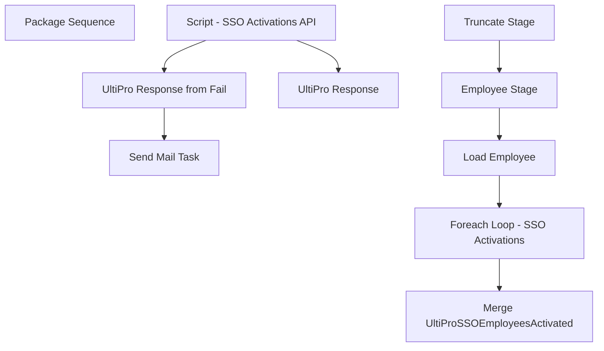

# SSIS Package: HR_UltiProActivations

**Project:** HR_UltiProActivations  
**Folder:** HR  
**Server:** STL-SSIS-P-01  

## Connection Managers

| Name | Type | Server | Catalog | Connection (sanitized) |
|---|---|---|---|---|
| Activations | FLATFILE |  |  |  |
| DW | OLEDB | papamart | dw | Data Source=papamart; Initial Catalog=dw; Provider=SQLNCLI11.1; Integrated Security=SSPI; Auto Translate=False |
| DWStaging | OLEDB | papamart | DWStaging | Data Source=papamart; Initial Catalog=DWStaging; Provider=SQLNCLI11.1; Integrated Security=SSPI; Auto Translate=False |
| HRFile | FLATFILE |  |  |  |
| IntegrationStaging | OLEDB | STL-SSIS-P-01 | IntegrationStaging | Data Source=STL-SSIS-P-01; Initial Catalog=IntegrationStaging; Provider=SQLNCLI11.1; Integrated Security=SSPI; Auto Translate=False |
| SMTP | SMTP |  |  |  |

## Control Flow Tasks

| Task | Type |
|---|---|
| HR_UltiProActivations | Package |
| Package Sequence | SEQUENCE |
| Employee Stage | Pipeline |
| Foreach Loop - SSO Activations | FOREACHLOOP |
| Script - SSO Activations API | ScriptTask |
| Send Mail Task | SendMailTask |
| UltiPro Response | ExecuteSQLTask |
| UltiPro Response from Fail | ExecuteSQLTask |
| Load Employee | ExecuteSQLTask |
| Merge UltiProSSOEmployeesActivated | ExecuteSQLTask |
| Truncate Stage | ExecuteSQLTask |

## Control Flow Outline

```text
- Package Sequence [SEQUENCE]
  - Employee Stage [Pipeline]
  - Foreach Loop - SSO Activations [FOREACHLOOP]
    - Script - SSO Activations API [ScriptTask]
    - Send Mail Task [SendMailTask]
    - UltiPro Response [ExecuteSQLTask]
    - UltiPro Response from Fail [ExecuteSQLTask]
  - Load Employee [ExecuteSQLTask]
  - Merge UltiProSSOEmployeesActivated [ExecuteSQLTask]
  - Truncate Stage [ExecuteSQLTask]
```

## Architecture Diagram



## Variables

| Namespace | Name | Expression-bound |
|---|---|---|
| User | APIDump | No |
| User | ActivationsFile | No |
| User | DateTimeStamp | Yes |
| User | EmployeeActivationStage | No |
| User | EndDate | Yes |
| User | EndDateAsDATE | Yes |
| User | GetDate | Yes |
| User | GetDateAsDATE | Yes |
| User | StartDate | Yes |
| User | StartDateAsDATE | Yes |
| User | UltiProClientUserName | No |
| User | UltiProEmployeeID | No |
| User | UltiProResponse | No |
| User | UltiProUserName | No |

### Expression-bound variable values

#### User::DateTimeStamp

**Expression:**

```sql
(DT_WSTR,4)DATEPART("yyyy",GetDate()) 
+ (DT_WSTR,4)DATEPART("mm",GetDate()) 
+ (DT_WSTR,4)DATEPART("dd",GetDate()) 
+ (DT_WSTR,4)DATEPART("hh",GetDate()) 
+ (DT_WSTR,4)DATEPART("mi",GetDate()) 
+ (DT_WSTR,4)DATEPART("ss",GetDate()) 
+ (DT_WSTR,4)DATEPART("ms",GetDate())
```

**Evaluated value:**

```sql
2021614214322333
```

#### User::EndDate

**Expression:**

```sql
dateadd("dd", @[$Package::DaysToInclude], @[User::StartDate])
```

**Evaluated value:**

```sql
6/14/2021
```

#### User::EndDateAsDATE

**Expression:**

```sql
(DT_WSTR, 4) datepart("year", @[User::EndDate])  + "-" + 
(DT_WSTR, 2) datepart("mm", @[User::EndDate])  + "-" + 
(DT_WSTR, 2) datepart("dd",  @[User::EndDate])
```

**Evaluated value:**

```sql
2021-6-14
```

#### User::GetDate

**Expression:**

```sql
(DT_DATE)DATEDIFF("Day", (DT_DATE) 0, GETDATE())
```

**Evaluated value:**

```sql
6/14/2021
```

#### User::GetDateAsDATE

**Expression:**

```sql
(DT_WSTR, 4) datepart("year", @[User::GetDate])  + "-" + 
(DT_WSTR, 2) datepart("mm", @[User::GetDate])  + "-" + 
(DT_WSTR, 2) datepart("dd",  @[User::GetDate])
```

**Evaluated value:**

```sql
2021-6-14
```

#### User::StartDate

**Expression:**

```sql
dateadd("dd", -@[$Package::DaysToGoBack] , @[User::GetDate] )
```

**Evaluated value:**

```sql
6/13/2021
```

#### User::StartDateAsDATE

**Expression:**

```sql
(DT_WSTR, 4) datepart("year", @[User::StartDate])  + "-" + 
(DT_WSTR, 2) datepart("mm", @[User::StartDate])  + "-" + 
(DT_WSTR, 2) datepart("dd",  @[User::StartDate])
```

**Evaluated value:**

```sql
2021-6-13
```

## Execute SQL Tasks

### UltiPro Response

**Path:** `Package\Package Sequence\Foreach Loop - SSO Activations\UltiPro Response`  
**Connection:** IntegrationStaging (STL-SSIS-P-01/IntegrationStaging)  

```sql
declare @EmpID varchar(50), @Response nvarchar(4000)
select @EmpID = ?, @Response = ?

Update HR.UltiProEmployeeActivationStage 
set UltiProResponse = isnull(@Response, 'xx') , 
Success = 1, 
Activated = 1, --EVEN THOUGH WE GET A RESPONSE THAT MAY SEEM LIKE AN ERROR, AFTER SPOT CHECKING W/KATIE IN HR, THEY ARE ACTIVATED SO SETTING FLAG AS SUCH
ActivatedDate = getdate()
where EmployeeIdentifier = @EmpID 
```

### UltiPro Response from Fail

**Path:** `Package\Package Sequence\Foreach Loop - SSO Activations\UltiPro Response from Fail`  
**Connection:** IntegrationStaging (STL-SSIS-P-01/IntegrationStaging)  

```sql
declare @EmpID varchar(50), @Response nvarchar(4000)
select @EmpID = ?, @Response = ?

Update HR.UltiProEmployeeActivationStage 
set UltiProResponse = isnull(@Response, 'xx') , Success = 0
where EmployeeIdentifier = @EmpID 
```

### Load Employee

**Path:** `Package\Package Sequence\Load Employee`  
**Connection:** IntegrationStaging (STL-SSIS-P-01/IntegrationStaging)  

```sql
select 
	EmployeeIdentifier, 
	concat(EmployeeIdentifier,'@buildabear.com') as ClientUserName
from HR.UltiProEmployeeActivationStage

```

### Merge UltiProSSOEmployeesActivated

**Path:** `Package\Package Sequence\Merge UltiProSSOEmployeesActivated`  
**Connection:** IntegrationStaging (STL-SSIS-P-01/IntegrationStaging)  

```sql
exec HR.spMergeUltiProSSOEmployeesActivated
```

### Truncate Stage

**Path:** `Package\Package Sequence\Truncate Stage`  
**Connection:** IntegrationStaging (STL-SSIS-P-01/IntegrationStaging)  

```sql
TRUNCATE TABLE HR.UltiProEmployeeActivationStage
```

## Data Flow: Sources

| Component | Source Object | Type | Data Flow Task | Connection | SQL Kind |
|---|---|---|---|---|---|
| UHCMEmp |  | OLEDBSource | Employee Stage | DW | SqlCommand |

#### UHCMEmp — SqlCommand

```sql
with 
NamedSam as
	(
		select --named samaccounts to be excluded
			EepEEID
		from UHCMEmp
		where samaccountname<>EepEEID
		and samaccountname is not null 
	)
select
	EmployeeID as EmployeeIdentifier,
	concat(EmployeeID, '@buildabear.com') as ClientUserName,
	getdate() as InsertDate
from vwUltiProValidationVsADStageVsAD with (nolock)
where UltiProSamAccountName is not null --HAS A SAMACCOUNT
and EmployeeID not in (select EepEEID from NamedSam) --NOT A NAMED ACCOUNT
and UltiProStatus = 'Active' --IS ACTIVE EMPLOYEE
and cast(getdate() as date) >= LastHireDate ---HIRE DATE IS TODAY OR BEFORE
and datediff(dd, LastHireDate , getdate()) <= 10
```

## Data Flow: Destinations

| Component | Target Table | Type | Data Flow Task | Connection | SQL Kind |
|---|---|---|---|---|---|
| UltiProEmployeeActivationStage |  | OLEDBDestination | Employee Stage | IntegrationStaging |  |
