# SSIS Package: HR_UltiProToADtoUltiPro

**Project:** HR_UltiProToADtoUltiPro  
**Folder:** HR  
**Server:** STL-SSIS-P-01  

## Connection Managers

| Name | Type | Server | Catalog | Connection (sanitized) |
|---|---|---|---|---|
| Active Directory Connection Manager | ActiveDirectory |  |  |  |
| AdImportCsv | FLATFILE |  |  |  |
| Coredb01 | OLEDB | Coredb01 | AIMSConfig | Data Source=Coredb01; Initial Catalog=AIMSConfig; Provider=SQLNCLI11.1; Integrated Security=SSPI; Auto Translate=False |
| DW | OLEDB | papamart | dw | Data Source=papamart; Initial Catalog=dw; Provider=SQLNCLI11.1; Integrated Security=SSPI; Auto Translate=False |
| DW2 | OLEDB | papamart | dw | Data Source=papamart; Initial Catalog=dw; Provider=SQLOLEDB.1; Integrated Security=SSPI; Application Name=SSIS-HR_ActiveDirectoryDataExtract-{B97A23FE-8436-4458-9D4C-425532AC790C}papamart.dw2; Auto Translate=False |
| DWStaging | OLEDB | papamart | DWStaging | Data Source=papamart; Initial Catalog=DWStaging; Provider=SQLNCLI11.1; Integrated Security=SSPI; Auto Translate=False |
| IntegrationStaging | OLEDB | STL-SSIS-P-01 | IntegrationStaging | Data Source=STL-SSIS-P-01; Initial Catalog=IntegrationStaging; Provider=SQLNCLI11.1; Integrated Security=SSPI; Auto Translate=False |
| Ldap1.buildabear.com | OLEDB | Ldap1.buildabear.com |  | Data Source=Ldap1.buildabear.com; Provider=ADsDSOObject; Integrated Security=SSPI |
| Ldap1.buildabear.com 1 | ADO.NET:System.Data.OleDb.OleDbConnection, System.Data, Version=4.0.0.0, Culture=neutral, PublicKeyToken=b77a5c561934e089 | Ldap1.buildabear.com |  | Data Source=Ldap1.buildabear.com; Provider=ADsDSOObject; Integrated Security=SSPI |
| SMTP | SMTP |  |  |  |
| UltiProImportEmailCSV | FLATFILE |  |  |  |
| UltiProImportSamAccountCSV | FLATFILE |  |  |  |
| stl-dc-p-01.buildabear.com | ADO.NET:System.Data.OleDb.OleDbConnection, System.Data, Version=4.0.0.0, Culture=neutral, PublicKeyToken=b77a5c561934e089 | stl-dc-p-01.buildabear.com |  | Data Source=stl-dc-p-01.buildabear.com; Provider=ADsDSOObject; Integrated Security=SSPI |

## Control Flow Tasks

| Task | Type |
|---|---|
| HR_UltiproToADtoUltipro | Package |
| SEQ - AD to UltiPro - SamAccountName - Email | SEQUENCE |
| Data Flow - reset send flag | Pipeline |
| SEQ - Generate AD File | SEQUENCE |
| correct hyphen char | ExecuteSQLTask |
| Count Rows to Send | ExecuteSQLTask |
| Data Flow - Stage C for AD | Pipeline |
| Data Flow - Stage for AD | Pipeline |
| Scrub Phone From AD Stage | ExecuteSQLTask |
| Scrub Phone from DW | ExecuteSQLTask |
| update TermEmailSentFlag | ExecuteSQLTask |
| SEQ - Generate SamAccountName and Email CSV Files | SEQUENCE |
| Foreach Loop -  CSV | FOREACHLOOP |
| Archive File | FileSystemTask |
| SEQ - EmailCSV | SEQUENCE |
| Count Rows for Email CSV | ExecuteSQLTask |
| Generate UltiPro Import Email CSV | Pipeline |
| SEQ - SamAccountCSV | SEQUENCE |
| Count Rows for SamAccountName CSV | ExecuteSQLTask |
| Generate UltiPro Import SamAccountName CSV | Pipeline |
| sFTP Upload | ExecuteSQLTask |
| SEQ - send C event for promotion | SEQUENCE |
| Count Rows to Send | ExecuteSQLTask |
| Data Flow - stage C records | Pipeline |
| SEQ - Generate SamAccountName and Email CSV Files | SEQUENCE |
| Foreach Loop -  CSV | FOREACHLOOP |
| Archive File | FileSystemTask |
| SEQ - EmailCSV | SEQUENCE |
| Generate Email CSV | Pipeline |
| SEQ - SamAccountCSV | SEQUENCE |
| Generate SamAccountName CSV | Pipeline |
| sFTP Upload | ExecuteSQLTask |
| UK HR named account change | SEQUENCE |
| Count Rows to Send | ExecuteSQLTask |
| UK C record notification | Pipeline |
| UK welcome email (numeric) | SEQUENCE |
| BB welcome email | Pipeline |
| Count Rows to Send | ExecuteSQLTask |
| Send Mail Task | SendMailTask |

## Control Flow Outline

```text
- Send Mail Task [SendMailTask]
- SEQ - AD to UltiPro - SamAccountName - Email [SEQUENCE]
  - Data Flow - reset send flag [Pipeline]
  - SEQ - Generate AD File [SEQUENCE]
    - Count Rows to Send [ExecuteSQLTask]
    - Data Flow - Stage C for AD [Pipeline]
    - Data Flow - Stage for AD [Pipeline]
    - Scrub Phone From AD Stage [ExecuteSQLTask]
    - Scrub Phone from DW [ExecuteSQLTask]
    - correct hyphen char [ExecuteSQLTask]
    - update TermEmailSentFlag [ExecuteSQLTask]
  - SEQ - Generate SamAccountName and Email CSV Files [SEQUENCE]
    - Foreach Loop -  CSV [FOREACHLOOP]
      - Archive File [FileSystemTask]
    - SEQ - EmailCSV [SEQUENCE]
      - Count Rows for Email CSV [ExecuteSQLTask]
      - Generate UltiPro Import Email CSV [Pipeline]
    - SEQ - SamAccountCSV [SEQUENCE]
      - Count Rows for SamAccountName CSV [ExecuteSQLTask]
      - Generate UltiPro Import SamAccountName CSV [Pipeline]
    - sFTP Upload [ExecuteSQLTask]
  - SEQ - send C event for promotion [SEQUENCE]
    - Count Rows to Send [ExecuteSQLTask]
    - Data Flow - stage C records [Pipeline]
    - SEQ - Generate SamAccountName and Email CSV Files [SEQUENCE]
      - Foreach Loop -  CSV [FOREACHLOOP]
        - Archive File [FileSystemTask]
      - SEQ - EmailCSV [SEQUENCE]
        - Generate Email CSV [Pipeline]
      - SEQ - SamAccountCSV [SEQUENCE]
        - Generate SamAccountName CSV [Pipeline]
      - sFTP Upload [ExecuteSQLTask]
  - UK HR named account change [SEQUENCE]
    - Count Rows to Send [ExecuteSQLTask]
    - UK C record notification [Pipeline]
  - UK welcome email (numeric) [SEQUENCE]
    - BB welcome email [Pipeline]
    - Count Rows to Send [ExecuteSQLTask]
```

## Architecture Diagram

```mermaid
flowchart TD
    n_Package_SEQ___AD_to_UltiPro___SamAccountName___Email["SEQ - AD to UltiPro - SamAccountName - Email"]
    n_Package_SEQ___AD_to_UltiPro___SamAccountName___Email_Data_Flow___reset_send_flag["Data Flow - reset send flag"]
    n_Package_SEQ___AD_to_UltiPro___SamAccountName___Email_SEQ___Generate_AD_File["SEQ - Generate AD File"]
    n_Package_SEQ___AD_to_UltiPro___SamAccountName___Email_SEQ___Generate_AD_File_correct_hyphen_char["correct hyphen char"]
    n_Package_SEQ___AD_to_UltiPro___SamAccountName___Email_SEQ___Generate_AD_File_Count_Rows_to_Send["Count Rows to Send"]
    n_Package_SEQ___AD_to_UltiPro___SamAccountName___Email_SEQ___Generate_AD_File_Data_Flow___Stage_C_for_AD["Data Flow - Stage C for AD"]
    n_Package_SEQ___AD_to_UltiPro___SamAccountName___Email_SEQ___Generate_AD_File_Data_Flow___Stage_for_AD["Data Flow - Stage for AD"]
    n_Package_SEQ___AD_to_UltiPro___SamAccountName___Email_SEQ___Generate_AD_File_Scrub_Phone_From_AD_Stage["Scrub Phone From AD Stage"]
    n_Package_SEQ___AD_to_UltiPro___SamAccountName___Email_SEQ___Generate_AD_File_Scrub_Phone_from_DW["Scrub Phone from DW"]
    n_Package_SEQ___AD_to_UltiPro___SamAccountName___Email_SEQ___Generate_AD_File_update_TermEmailSentFlag["update TermEmailSentFlag"]
    n_Package_SEQ___AD_to_UltiPro___SamAccountName___Email_SEQ___Generate_SamAccountName_and_Email_CSV_Files["SEQ - Generate SamAccountName and Email CSV Files"]
    n_Package_SEQ___AD_to_UltiPro___SamAccountName___Email_SEQ___Generate_SamAccountName_and_Email_CSV_Files_Foreach_Loop____CSV["Foreach Loop -  CSV"]
    n_Package_SEQ___AD_to_UltiPro___SamAccountName___Email_SEQ___Generate_SamAccountName_and_Email_CSV_Files_Foreach_Loop____CSV_Archive_File["Archive File"]
    n_Package_SEQ___AD_to_UltiPro___SamAccountName___Email_SEQ___Generate_SamAccountName_and_Email_CSV_Files_SEQ___EmailCSV["SEQ - EmailCSV"]
    n_Package_SEQ___AD_to_UltiPro___SamAccountName___Email_SEQ___Generate_SamAccountName_and_Email_CSV_Files_SEQ___EmailCSV_Count_Rows_for_Email_CSV["Count Rows for Email CSV"]
    n_Package_SEQ___AD_to_UltiPro___SamAccountName___Email_SEQ___Generate_SamAccountName_and_Email_CSV_Files_SEQ___EmailCSV_Generate_UltiPro_Import_Email_CSV["Generate UltiPro Import Email CSV"]
    n_Package_SEQ___AD_to_UltiPro___SamAccountName___Email_SEQ___Generate_SamAccountName_and_Email_CSV_Files_SEQ___SamAccountCSV["SEQ - SamAccountCSV"]
    n_Package_SEQ___AD_to_UltiPro___SamAccountName___Email_SEQ___Generate_SamAccountName_and_Email_CSV_Files_SEQ___SamAccountCSV_Count_Rows_for_SamAccountName_CSV["Count Rows for SamAccountName CSV"]
    n_Package_SEQ___AD_to_UltiPro___SamAccountName___Email_SEQ___Generate_SamAccountName_and_Email_CSV_Files_SEQ___SamAccountCSV_Generate_UltiPro_Import_SamAccountName_CSV["Generate UltiPro Import SamAccountName CSV"]
    n_Package_SEQ___AD_to_UltiPro___SamAccountName___Email_SEQ___Generate_SamAccountName_and_Email_CSV_Files_sFTP_Upload["sFTP Upload"]
    n_Package_SEQ___AD_to_UltiPro___SamAccountName___Email_SEQ___send_C_event_for_promotion["SEQ - send C event for promotion"]
    n_Package_SEQ___AD_to_UltiPro___SamAccountName___Email_SEQ___send_C_event_for_promotion_Count_Rows_to_Send["Count Rows to Send"]
    n_Package_SEQ___AD_to_UltiPro___SamAccountName___Email_SEQ___send_C_event_for_promotion_Data_Flow___stage_C_records["Data Flow - stage C records"]
    n_Package_SEQ___AD_to_UltiPro___SamAccountName___Email_SEQ___send_C_event_for_promotion_SEQ___Generate_SamAccountName_and_Email_CSV_Files["SEQ - Generate SamAccountName and Email CSV Files"]
    n_Package_SEQ___AD_to_UltiPro___SamAccountName___Email_SEQ___send_C_event_for_promotion_SEQ___Generate_SamAccountName_and_Email_CSV_Files_Foreach_Loop____CSV["Foreach Loop -  CSV"]
    n_Package_SEQ___AD_to_UltiPro___SamAccountName___Email_SEQ___send_C_event_for_promotion_SEQ___Generate_SamAccountName_and_Email_CSV_Files_Foreach_Loop____CSV_Archive_File["Archive File"]
    n_Package_SEQ___AD_to_UltiPro___SamAccountName___Email_SEQ___send_C_event_for_promotion_SEQ___Generate_SamAccountName_and_Email_CSV_Files_SEQ___EmailCSV["SEQ - EmailCSV"]
    n_Package_SEQ___AD_to_UltiPro___SamAccountName___Email_SEQ___send_C_event_for_promotion_SEQ___Generate_SamAccountName_and_Email_CSV_Files_SEQ___EmailCSV_Generate_Email_CSV["Generate Email CSV"]
    n_Package_SEQ___AD_to_UltiPro___SamAccountName___Email_SEQ___send_C_event_for_promotion_SEQ___Generate_SamAccountName_and_Email_CSV_Files_SEQ___SamAccountCSV["SEQ - SamAccountCSV"]
    n_Package_SEQ___AD_to_UltiPro___SamAccountName___Email_SEQ___send_C_event_for_promotion_SEQ___Generate_SamAccountName_and_Email_CSV_Files_SEQ___SamAccountCSV_Generate_SamAccountName_CSV["Generate SamAccountName CSV"]
    n_Package_SEQ___AD_to_UltiPro___SamAccountName___Email_SEQ___send_C_event_for_promotion_SEQ___Generate_SamAccountName_and_Email_CSV_Files_sFTP_Upload["sFTP Upload"]
    n_Package_SEQ___AD_to_UltiPro___SamAccountName___Email_UK_HR_named_account_change["UK HR named account change"]
    n_Package_SEQ___AD_to_UltiPro___SamAccountName___Email_UK_HR_named_account_change_Count_Rows_to_Send["Count Rows to Send"]
    n_Package_SEQ___AD_to_UltiPro___SamAccountName___Email_UK_HR_named_account_change_UK_C_record_notification["UK C record notification"]
    n_Package_SEQ___AD_to_UltiPro___SamAccountName___Email_UK_welcome_email__numeric_["UK welcome email (numeric)"]
    n_Package_SEQ___AD_to_UltiPro___SamAccountName___Email_UK_welcome_email__numeric__BB_welcome_email["BB welcome email"]
    n_Package_SEQ___AD_to_UltiPro___SamAccountName___Email_UK_welcome_email__numeric__Count_Rows_to_Send["Count Rows to Send"]
    n_Package_EventHandlers_OnError__Send_Mail_Task["Send Mail Task"]
    n_Package_SEQ___AD_to_UltiPro___SamAccountName___Email_SEQ___Generate_AD_File_Data_Flow___Stage_C_for_AD --> n_Package_SEQ___AD_to_UltiPro___SamAccountName___Email_SEQ___Generate_AD_File_Data_Flow___Stage_for_AD
    n_Package_SEQ___AD_to_UltiPro___SamAccountName___Email_SEQ___Generate_AD_File_Data_Flow___Stage_for_AD --> n_Package_SEQ___AD_to_UltiPro___SamAccountName___Email_SEQ___Generate_AD_File_update_TermEmailSentFlag
    n_Package_SEQ___AD_to_UltiPro___SamAccountName___Email_SEQ___Generate_AD_File_Scrub_Phone_from_DW --> n_Package_SEQ___AD_to_UltiPro___SamAccountName___Email_SEQ___Generate_AD_File_Scrub_Phone_From_AD_Stage
    n_Package_SEQ___AD_to_UltiPro___SamAccountName___Email_SEQ___Generate_AD_File_update_TermEmailSentFlag --> n_Package_SEQ___AD_to_UltiPro___SamAccountName___Email_SEQ___Generate_AD_File_correct_hyphen_char
    n_Package_SEQ___AD_to_UltiPro___SamAccountName___Email_SEQ___Generate_AD_File_Count_Rows_to_Send --> n_Package_SEQ___AD_to_UltiPro___SamAccountName___Email_SEQ___Generate_AD_File_Data_Flow___Stage_C_for_AD
    n_Package_SEQ___AD_to_UltiPro___SamAccountName___Email_SEQ___Generate_AD_File_correct_hyphen_char --> n_Package_SEQ___AD_to_UltiPro___SamAccountName___Email_SEQ___Generate_AD_File_Scrub_Phone_from_DW
    n_Package_SEQ___AD_to_UltiPro___SamAccountName___Email_SEQ___Generate_SamAccountName_and_Email_CSV_Files_SEQ___EmailCSV_Count_Rows_for_Email_CSV --> n_Package_SEQ___AD_to_UltiPro___SamAccountName___Email_SEQ___Generate_SamAccountName_and_Email_CSV_Files_SEQ___EmailCSV_Generate_UltiPro_Import_Email_CSV
    n_Package_SEQ___AD_to_UltiPro___SamAccountName___Email_SEQ___Generate_SamAccountName_and_Email_CSV_Files_SEQ___SamAccountCSV_Count_Rows_for_SamAccountName_CSV --> n_Package_SEQ___AD_to_UltiPro___SamAccountName___Email_SEQ___Generate_SamAccountName_and_Email_CSV_Files_SEQ___SamAccountCSV_Generate_UltiPro_Import_SamAccountName_CSV
    n_Package_SEQ___AD_to_UltiPro___SamAccountName___Email_SEQ___Generate_SamAccountName_and_Email_CSV_Files_SEQ___EmailCSV --> n_Package_SEQ___AD_to_UltiPro___SamAccountName___Email_SEQ___Generate_SamAccountName_and_Email_CSV_Files_sFTP_Upload
    n_Package_SEQ___AD_to_UltiPro___SamAccountName___Email_SEQ___Generate_SamAccountName_and_Email_CSV_Files_SEQ___SamAccountCSV --> n_Package_SEQ___AD_to_UltiPro___SamAccountName___Email_SEQ___Generate_SamAccountName_and_Email_CSV_Files_sFTP_Upload
    n_Package_SEQ___AD_to_UltiPro___SamAccountName___Email_SEQ___Generate_SamAccountName_and_Email_CSV_Files_sFTP_Upload --> n_Package_SEQ___AD_to_UltiPro___SamAccountName___Email_SEQ___Generate_SamAccountName_and_Email_CSV_Files_Foreach_Loop____CSV
    n_Package_SEQ___AD_to_UltiPro___SamAccountName___Email_SEQ___send_C_event_for_promotion_SEQ___Generate_SamAccountName_and_Email_CSV_Files_SEQ___EmailCSV --> n_Package_SEQ___AD_to_UltiPro___SamAccountName___Email_SEQ___send_C_event_for_promotion_SEQ___Generate_SamAccountName_and_Email_CSV_Files_sFTP_Upload
    n_Package_SEQ___AD_to_UltiPro___SamAccountName___Email_SEQ___send_C_event_for_promotion_SEQ___Generate_SamAccountName_and_Email_CSV_Files_SEQ___SamAccountCSV --> n_Package_SEQ___AD_to_UltiPro___SamAccountName___Email_SEQ___send_C_event_for_promotion_SEQ___Generate_SamAccountName_and_Email_CSV_Files_sFTP_Upload
    n_Package_SEQ___AD_to_UltiPro___SamAccountName___Email_SEQ___send_C_event_for_promotion_SEQ___Generate_SamAccountName_and_Email_CSV_Files_sFTP_Upload --> n_Package_SEQ___AD_to_UltiPro___SamAccountName___Email_SEQ___send_C_event_for_promotion_SEQ___Generate_SamAccountName_and_Email_CSV_Files_Foreach_Loop____CSV
    n_Package_SEQ___AD_to_UltiPro___SamAccountName___Email_SEQ___send_C_event_for_promotion_Count_Rows_to_Send --> n_Package_SEQ___AD_to_UltiPro___SamAccountName___Email_SEQ___send_C_event_for_promotion_Data_Flow___stage_C_records
    n_Package_SEQ___AD_to_UltiPro___SamAccountName___Email_SEQ___send_C_event_for_promotion_Data_Flow___stage_C_records --> n_Package_SEQ___AD_to_UltiPro___SamAccountName___Email_SEQ___send_C_event_for_promotion_SEQ___Generate_SamAccountName_and_Email_CSV_Files
    n_Package_SEQ___AD_to_UltiPro___SamAccountName___Email_UK_HR_named_account_change_Count_Rows_to_Send --> n_Package_SEQ___AD_to_UltiPro___SamAccountName___Email_UK_HR_named_account_change_UK_C_record_notification
    n_Package_SEQ___AD_to_UltiPro___SamAccountName___Email_UK_welcome_email__numeric__Count_Rows_to_Send --> n_Package_SEQ___AD_to_UltiPro___SamAccountName___Email_UK_welcome_email__numeric__BB_welcome_email
    n_Package_SEQ___AD_to_UltiPro___SamAccountName___Email_UK_welcome_email__numeric_ --> n_Package_SEQ___AD_to_UltiPro___SamAccountName___Email_SEQ___Generate_AD_File
    n_Package_SEQ___AD_to_UltiPro___SamAccountName___Email_SEQ___Generate_AD_File --> n_Package_SEQ___AD_to_UltiPro___SamAccountName___Email_SEQ___Generate_SamAccountName_and_Email_CSV_Files
    n_Package_SEQ___AD_to_UltiPro___SamAccountName___Email_SEQ___Generate_SamAccountName_and_Email_CSV_Files --> n_Package_SEQ___AD_to_UltiPro___SamAccountName___Email_UK_HR_named_account_change
    n_Package_SEQ___AD_to_UltiPro___SamAccountName___Email_SEQ___send_C_event_for_promotion --> n_Package_SEQ___AD_to_UltiPro___SamAccountName___Email_Data_Flow___reset_send_flag
    n_Package_SEQ___AD_to_UltiPro___SamAccountName___Email_UK_HR_named_account_change --> n_Package_SEQ___AD_to_UltiPro___SamAccountName___Email_SEQ___send_C_event_for_promotion
```



## Variables

| Namespace | Name | Expression-bound |
|---|---|---|
| System | Propagate | No |
| User | ADExtract | No |
| User | ADFileNameLocation | No |
| User | AdArchiveFileReName | Yes |
| User | AdFilePath | No |
| User | AdFilePathTest | No |
| User | AdRowsToSendCount | No |
| User | AdRowsToSendCount2 | No |
| User | AdRowsToSendCount3 | No |
| User | CountUltiProCSVRows | No |
| User | Count_UltiProImportEmailRows | No |
| User | Count_UltiProImportSamAccountNameRows | No |
| User | DateTimeStamp | Yes |
| User | EmployeeIDStage | No |
| User | EndDate | Yes |
| User | EndDateAsDATE | Yes |
| User | GetDate | Yes |
| User | GetDateAsDATE | Yes |
| User | LDAP | No |
| User | SQL_memberOf_query | Yes |
| User | StartDate | Yes |
| User | StartDateAsDATE | Yes |
| User | UltiProClearExpiryScriptPath | No |
| User | UltiProImportArchive | Yes |
| User | UltiProImportEmailCSVConnectionString | Yes |
| User | UltiProImportEmailCSVFileName | Yes |
| User | UltiProImportFilePreStagePath | Yes |
| User | UltiProImportFiles | No |
| User | UltiProImportSamAccountCSVConnectionString | Yes |
| User | UltiProImportSamAccountCSVFileName | Yes |
| User | ad_EmployeeID | No |
| User | ad_cn | No |
| User | ad_company | No |
| User | ad_department | No |
| User | ad_description | No |
| User | ad_displayName | No |
| User | ad_givenname | No |
| User | ad_mail | No |
| User | ad_manager | No |
| User | ad_memberOf | No |
| User | ad_samaccountName | No |
| User | ad_sn | No |
| User | ad_title | No |
| User | rehireObject | No |
| User | rehireString | No |
| User | varArg | No |
| User | varEmpId | No |
| User | varIdentity | No |
| User | varScriptString | Yes |

### Expression-bound variable values

#### User::AdArchiveFileReName

**Expression:**

```sql
"\\\\stl-ssis-p-01\\IntegrationStaging\\HR\\UHCM\\Archive\\ADImport" +  @[User::DateTimeStamp] +".csv"
```

**Evaluated value:**

```sql
\\stl-ssis-p-01\IntegrationStaging\HR\UHCM\Archive\ADImport2023121216184100.csv
```

#### User::DateTimeStamp

**Expression:**

```sql
(DT_WSTR,4)DATEPART("yyyy",GetDate()) 
+ (DT_WSTR,4)DATEPART("mm",GetDate()) 
+ (DT_WSTR,4)DATEPART("dd",GetDate()) 
+ (DT_WSTR,4)DATEPART("hh",GetDate()) 
+ (DT_WSTR,4)DATEPART("mi",GetDate()) 
+ (DT_WSTR,4)DATEPART("ss",GetDate()) 
+ (DT_WSTR,4)DATEPART("ms",GetDate())
```

**Evaluated value:**

```sql
2023121216184100
```

#### User::EndDate

**Expression:**

```sql
dateadd("dd", @[$Package::DaysToInclude], @[User::StartDate])
```

**Evaluated value:**

```sql
12/12/2023
```

#### User::EndDateAsDATE

**Expression:**

```sql
(DT_WSTR, 4) datepart("year", @[User::EndDate])  + "-" + 
(DT_WSTR, 2) datepart("mm", @[User::EndDate])  + "-" + 
(DT_WSTR, 2) datepart("dd",  @[User::EndDate])
```

**Evaluated value:**

```sql
2023-12-12
```

#### User::GetDate

**Expression:**

```sql
(DT_DATE)DATEDIFF("Day", (DT_DATE) 0, GETDATE())
```

**Evaluated value:**

```sql
12/12/2023
```

#### User::GetDateAsDATE

**Expression:**

```sql
(DT_WSTR, 4) datepart("year", @[User::GetDate])  + "-" + 
(DT_WSTR, 2) datepart("mm", @[User::GetDate])  + "-" + 
(DT_WSTR, 2) datepart("dd",  @[User::GetDate])
```

**Evaluated value:**

```sql
2023-12-12
```

#### User::SQL_memberOf_query

**Expression:**

```sql
"
SELECT cast('" + @[User::ad_EmployeeID] + "' as nvarchar(7))  as EmployeeID, cast(replace(ADsPath, 'LDAP://', '') as nvarchar(4000)) as memberOf 
FROM OPENQUERY
	(
		ADSI, 
            'SELECT * FROM ''LDAP://DC=buildabear,DC=com'' 
             WHERE employeeID = ''" + @[User::ad_EmployeeID] + "'''
	)  
"
```

**Evaluated value:**

```sql

SELECT cast('' as nvarchar(7))  as EmployeeID, cast(replace(ADsPath, 'LDAP://', '') as nvarchar(4000)) as memberOf 
FROM OPENQUERY
	(
		ADSI, 
            'SELECT * FROM ''LDAP://DC=buildabear,DC=com'' 
             WHERE employeeID = '''''
	)  

```

#### User::StartDate

**Expression:**

```sql
dateadd("dd", -@[$Package::DaysToGoBack] , @[User::GetDate] )
```

**Evaluated value:**

```sql
12/11/2023
```

#### User::StartDateAsDATE

**Expression:**

```sql
(DT_WSTR, 4) datepart("year", @[User::StartDate])  + "-" + 
(DT_WSTR, 2) datepart("mm", @[User::StartDate])  + "-" + 
(DT_WSTR, 2) datepart("dd",  @[User::StartDate])
```

**Evaluated value:**

```sql
2023-12-11
```

#### User::UltiProImportArchive

**Expression:**

```sql
@[User::UltiProImportFilePreStagePath] + "Archive\\"
```

**Evaluated value:**

```sql
\\stl-ssis-p-01\IntegrationStaging\HR\UltiProImport\Archive\
```

#### User::UltiProImportEmailCSVConnectionString

**Expression:**

```sql
@[$Package::UltiProFileStagePath_SamAccountEmail] +  @[User::UltiProImportEmailCSVFileName]
```

**Evaluated value:**

```sql
\\STL-SSIs-p-01\integrationStaging\HR\UltiProImport\UPEmail2023121216184103.csv
```

#### User::UltiProImportEmailCSVFileName

**Expression:**

```sql
"UPEmail" +  @[User::DateTimeStamp] + ".csv"
```

**Evaluated value:**

```sql
UPEmail2023121216184103.csv
```

#### User::UltiProImportFilePreStagePath

**Expression:**

```sql
"\\\\stl-ssis-p-01\\IntegrationStaging\\HR\\UltiProImport\\"
```

**Evaluated value:**

```sql
\\stl-ssis-p-01\IntegrationStaging\HR\UltiProImport\
```

#### User::UltiProImportSamAccountCSVConnectionString

**Expression:**

```sql
@[$Package::UltiProFileStagePath_SamAccountEmail] +  @[User::UltiProImportSamAccountCSVFileName]
```

**Evaluated value:**

```sql
\\STL-SSIs-p-01\integrationStaging\HR\UltiProImport\UPSamAccount2023121216184103.csv
```

#### User::UltiProImportSamAccountCSVFileName

**Expression:**

```sql
"UPSamAccount" +  @[User::DateTimeStamp] + ".csv"
```

**Evaluated value:**

```sql
UPSamAccount2023121216184103.csv
```

#### User::varScriptString

**Expression:**

```sql
"-ExecutionPolicy Unrestricted -File \"" + @[User::UltiProClearExpiryScriptPath] + "\\clearADexp.ps1\" \"" + @[User::varArg] + "\" \"" + @[User::varIdentity] + "\""
```

**Evaluated value:**

```sql
-ExecutionPolicy Unrestricted -File "\\stl-ssis-p-01\IntegrationStaging\HR\UltiproADmoveRename\clearADexp.ps1" "-identity" ""
```

## Execute SQL Tasks

### Count Rows to Send

**Path:** `Package\SEQ - AD to UltiPro - SamAccountName - Email\SEQ - Generate AD File\Count Rows to Send`  
**Connection:** DW (papamart/dw)  

```sql
select count(*) as ROWZ
from vwUHCMUltiproToAD

/*
Select Count(*) as ROWZ
from  UHCMEmp 
where SendUpdateFlag = 1
*/

```

### Scrub Phone From AD Stage

**Path:** `Package\SEQ - AD to UltiPro - SamAccountName - Email\SEQ - Generate AD File\Scrub Phone From AD Stage`  
**Connection:** Coredb01 (Coredb01/AIMSConfig)  

```sql
update DataLoaderStaging
set ExtensionAttribute1 = NULL
where ExtensionAttribute1 is not NULL
and datediff(dd, DateInserted, getdate()) >= 7
```

### Scrub Phone from DW

**Path:** `Package\SEQ - AD to UltiPro - SamAccountName - Email\SEQ - Generate AD File\Scrub Phone from DW`  
**Connection:** DW (papamart/dw)  

```sql
if (
		select count(*) as Rowz
		from UHCMEMP with  (nolock)
		where efoPhoneNumber is not NULL
		and datediff(dd, isnull(UpdateDate, InsertDate), getdate()) >=3
	) > 0

begin
	Update UHCMEmp
	set efoPhoneNumber = NULL
	where efoPhoneNumber is not NULL
	and datediff(dd, isnull(UpdateDate, InsertDate), getdate()) >=3
end 
```

### correct hyphen char

**Path:** `Package\SEQ - AD to UltiPro - SamAccountName - Email\SEQ - Generate AD File\correct hyphen char`  
**Connection:** Coredb01 (Coredb01/AIMSConfig)  

```sql
update [dbo].[DataLoaderStaging] set UserProvisioningRole =  Replace(UserProvisioningRole, '–', '-') where UpdatedTimeStamp > getdate()
```

### update TermEmailSentFlag

**Path:** `Package\SEQ - AD to UltiPro - SamAccountName - Email\SEQ - Generate AD File\update TermEmailSentFlag`  
**Connection:** DW (papamart/dw)  

```sql
update [dbo].[UHCMEmp] set TermEmailSentFlag = null where  EecEmplStatus = 'Active' and TermEmailSentFlag is not null
```

### Count Rows for Email CSV

**Path:** `Package\SEQ - AD to UltiPro - SamAccountName - Email\SEQ - Generate SamAccountName and Email CSV Files\SEQ - EmailCSV\Count Rows for Email CSV`  
**Connection:** DW (papamart/dw)  

```sql
select count(*) RowsForCSV
from vwUltiProNeedsEmail
where CompanyCode <> 'BABUK'

```

### Count Rows for SamAccountName CSV

**Path:** `Package\SEQ - AD to UltiPro - SamAccountName - Email\SEQ - Generate SamAccountName and Email CSV Files\SEQ - SamAccountCSV\Count Rows for SamAccountName CSV`  
**Connection:** DW (papamart/dw)  

```sql
select count(*) RowsForCSV
from vwUltiProNeedsSamAccount
where CompanyCode <> 'BABUK'

```

### sFTP Upload

**Path:** `Package\SEQ - AD to UltiPro - SamAccountName - Email\SEQ - Generate SamAccountName and Email CSV Files\sFTP Upload`  
**Connection:** IntegrationStaging (STL-SSIS-P-01/IntegrationStaging)  

```sql
declare
@winSCP varchar(1000),
@script varchar(1000),
@log varchar(1000),
@FTP varchar(4000),
@Log_query varchar(1000),
@Log_filename varchar(100),
@Log_file_location varchar(100),
@Log_bcp varchar(1000),
@body varchar(4000)

select 
@winSCP = '"\\stl-ssis-p-01\C$\Program Files (x86)\WinSCP\WinSCP.exe"',
@script = ' /script=\\STL-SSIs-p-01\integrationStaging\HR\UltiProImport\FTP\sFTPuploadScript.txt',
@log = ' /log=\\STL-SSIs-p-01\integrationStaging\HR\UltiProImport\FTP\FTPUpload.log',
@FTP = (@winSCP + @script + @log)

exec master..xp_cmdshell @FTP
--exec master..xp_cmdshell 'move \\STL-SSIS-P-01\integrationStaging\HR\UltiProImport\*.csv \\STL-SSIS-P-01\integrationStaging\HR\UltiProImport\Archive'
```

### Count Rows to Send

**Path:** `Package\SEQ - AD to UltiPro - SamAccountName - Email\SEQ - send C event for promotion\Count Rows to Send`  
**Connection:** DW (papamart/dw)  

```sql
/*select count(*) as ROWZ2
from vwUHCMUltiproToAD2*/

select count(*)  from vwUHCMUltiproToAD2 with (nolock) where Status = 'Active' and ISNUMERIC([User Logon Name (Pre-Windows 2000)]) = 0 and [User Logon Name (Pre-Windows 2000)] is not null
and isnull(UserProvisioningRole, 'null') <> 'US Bear Builder'
and EmployeeID not in 
(
select EmployeeID from [coredb01].[AIMSConfig].[dbo].[DataLoaderStaging] where (ProvisioningEvent = 'H' and convert(varchar, DateInserted, 101) > getdate() -2)
)
```

### sFTP Upload

**Path:** `Package\SEQ - AD to UltiPro - SamAccountName - Email\SEQ - send C event for promotion\SEQ - Generate SamAccountName and Email CSV Files\sFTP Upload`  
**Connection:** IntegrationStaging (STL-SSIS-P-01/IntegrationStaging)  

```sql
declare
@winSCP varchar(1000),
@script varchar(1000),
@log varchar(1000),
@FTP varchar(4000),
@Log_query varchar(1000),
@Log_filename varchar(100),
@Log_file_location varchar(100),
@Log_bcp varchar(1000),
@body varchar(4000)

select 
@winSCP = '"\\stl-ssis-p-01\C$\Program Files (x86)\WinSCP\WinSCP.exe"',
@script = ' /script=\\STL-SSIs-p-01\integrationStaging\HR\UltiProImport\FTP\sFTPuploadScript.txt',
@log = ' /log=\\STL-SSIs-p-01\integrationStaging\HR\UltiProImport\FTP\FTPUpload.log',
@FTP = (@winSCP + @script + @log)

exec master..xp_cmdshell @FTP
--exec master..xp_cmdshell 'move \\STL-SSIS-P-01\integrationStaging\HR\UltiProImport\*.csv \\STL-SSIS-P-01\integrationStaging\HR\UltiProImport\Archive'
```

### Count Rows to Send

**Path:** `Package\SEQ - AD to UltiPro - SamAccountName - Email\UK HR named account change\Count Rows to Send`  
**Connection:** DW (papamart/dw)  

```sql
select count(*) from vwUHCMUltiproToAD2 with (nolock) where Status in ('Active','PreJoiner') and ISNUMERIC([User Logon Name (Pre-Windows 2000)]) = 0 and [User Logon Name (Pre-Windows 2000)] is not null
and UserProvisioningRole <> 'UK Bear Builder'
and EmployeeID like '2%'
```

### Count Rows to Send

**Path:** `Package\SEQ - AD to UltiPro - SamAccountName - Email\UK welcome email (numeric)\Count Rows to Send`  
**Connection:** DW (papamart/dw)  

```sql
select count(*) as ROWZ
from vwUHCMUltiproToAD
where ProvisioningEvent = 'H' 
and UserProvisioningRole = 'UK Bear Builder'
and EmployeeID not in 
(
select EmployeeID from [coredb01].[AIMSConfig].[dbo].[DataLoaderStaging] where (ProvisioningEvent = 'H' and convert(varchar, DateInserted, 101) >= getdate() -1)
)
```

## Data Flow: Sources

| Component | Source Object | Type | Data Flow Task | Connection | SQL Kind |
|---|---|---|---|---|---|
| vwUHCMUltiproToAD |  | OLEDBSource | Data Flow - reset send flag | DW | SqlCommand |
| OLE DB Source |  | OLEDBSource | Data Flow - Stage C for AD | DW | SqlCommand |
| vwUHCMUltiproToAD |  | OLEDBSource | Data Flow - Stage for AD | DW | SqlCommand |
| SQL |  | OLEDBSource | Generate UltiPro Import Email CSV | DW | SqlCommand |
| SQL |  | OLEDBSource | Generate UltiPro Import SamAccountName CSV | DW | SqlCommand |
| vwUHCMUltiproToAD |  | OLEDBSource | Data Flow - stage C records | DW | SqlCommand |
| SQL |  | OLEDBSource | Generate Email CSV | DW | SqlCommand |
| SQL |  | OLEDBSource | Generate SamAccountName CSV | DW | SqlCommand |
| vwUHCMUltiproToAD |  | OLEDBSource | UK C record notification | DW | SqlCommand |
| vwUHCMUltiproToAD |  | OLEDBSource | BB welcome email | DW | SqlCommand |

#### vwUHCMUltiproToAD — SqlCommand

```sql
select *
from vwUHCMUltiproToAD2 with (nolock)
```

#### OLE DB Source — SqlCommand

```sql
SELECT [UpdatedTimeStamp],[StartDate],[EndDate],'C' as ProvisioningEvent,[ProvisioningValue(s)],[UserProvisioningRole],[FirstName],[MiddleName],[LastName],[ContainerOU],[AccountExpiration],[Title],[Department],[Office],[Street],[City],[State]
,[Zip/PostalCode],[Country],[Business],[Fax],[Mobile],[Pager],[Home],[EmployeeID],[EmployeeNumber],[AccountingCode],[ManagerEmployeeID],[ManagerEmployeeNumber],[ManagerEmail],[ManagerFirstName]
,[ManagerMiddleName],[ManagerLastName],[Description],[UserPassword],[Extension Attribute 1],[Extension Attribute 2],[Extension Attribute 3],[Extension Attribute 4],[Extension Attribute 5],[Extension Attribute 6],
[Extension Attribute 7],[Extension Attribute 8],[Extension Attribute 9],[Extension Attribute 10],[Extension Attribute 11],[Extension Attribute 12],[Extension Attribute 13],[Extension Attribute 14]
,[Extension Attribute 15],[User Logon Name (Pre-Windows 2000)],[User Logon Name],[Full Name],[Display Name],[Email],[Exchange Alias],[Exchange Display Name],[InsertDate],[DateUpdated] 
FROM [dbo].[vwUHCMUltiproToAD]
where ProvisioningEvent = 'P'
```

#### vwUHCMUltiproToAD — SqlCommand

```sql
select *
from vwUHCMUltiproToAD with (nolock)
```

#### SQL — SqlCommand

```sql
select * from vwUltiProNeedsEmail
where CompanyCode <> 'BABUK'
```

#### SQL — SqlCommand

```sql
select * from vwUltiProNeedsSamAccount
where CompanyCode <> 'BABUK'
```

#### vwUHCMUltiproToAD — SqlCommand

```sql
select * from vwUHCMUltiproToAD2 with (nolock) where Status = 'Active' and ISNUMERIC([User Logon Name (Pre-Windows 2000)]) = 0 and [User Logon Name (Pre-Windows 2000)] is not null
and isnull(UserProvisioningRole,'null') <> 'US Bear Builder'
and EmployeeID not like '2%'
and EmployeeID not in 
(
select EmployeeID from [coredb01].[AIMSConfig].[dbo].[DataLoaderStaging] where (ProvisioningEvent = 'H' and convert(varchar, DateInserted, 101) > getdate() -2)
)
```

#### SQL — SqlCommand

```sql
select 
	u.eepCompanyCode as CompanyCode,
	convert(varchar, getdate(), 101) as EffectiveDate,
	u.EepEEID,
	cast(u.samaccountname as nvarchar) + '@buildabear.com' as PrimaryEmail
from UHCMEmp u 
where EepEEID in
(select EmployeeID from vwUHCMUltiproToAD2 with (nolock) where ISNUMERIC([User Logon Name (Pre-Windows 2000)]) = 0
and EmployeeID not like '2%'
)
```

#### SQL — SqlCommand

```sql
select 
	u.eepCompanyCode as CompanyCode,
	convert(varchar, getdate(), 101) as EffectiveDate,
	u.EepEEID,
	cast(u.samaccountname as nvarchar) as samAccount
from UHCMEmp u 
where EepEEID in
(select EmployeeID from vwUHCMUltiproToAD2 with (nolock) where ISNUMERIC([User Logon Name (Pre-Windows 2000)]) = 0
and EmployeeID not like '2%'
)
```

#### vwUHCMUltiproToAD — SqlCommand

```sql
select * from vwUHCMUltiproToAD2 with (nolock) where Status  in ('Active','PreJoiner')  and ISNUMERIC([User Logon Name (Pre-Windows 2000)]) = 0 and [User Logon Name (Pre-Windows 2000)] is not null
and UserProvisioningRole <> 'UK Bear Builder'
and EmployeeID like '2%'
```

#### vwUHCMUltiproToAD — SqlCommand

```sql
select v.FirstName, v.LastName, v.EmployeeID, u.EecLocation
, u.EepAddressEMail2 as 'personalEmail'
, u2.EepAddressEMail as 'supervisorEmail'
,u.JbcJobCode as 'jobCode',
 u.EecOrgLvl1Code as 'orgCode'
,v.EmployeeID as 'futureSamaccountname'
from vwUHCMUltiproToAD v with (nolock)
join UHCMEmp u on v.EmployeeID = u.EepEEID
join UHCMEmp u2 on u.SupervisorID = u2.EepEEID
where v.ProvisioningEvent = 'H' 
and v.UserProvisioningRole = 'UK Bear Builder'
and EmployeeID not in 
(
select EmployeeID from [coredb01].[AIMSConfig].[dbo].[DataLoaderStaging] where (ProvisioningEvent = 'H' and convert(varchar, DateInserted, 101) >= getdate() -1)
)
```

## Data Flow: Destinations

| Component | Target Table | Type | Data Flow Task | Connection | SQL Kind |
|---|---|---|---|---|---|
| DataLoaderStaging |  | OLEDBDestination | Data Flow - Stage C for AD | Coredb01 |  |
| DataLoaderStaging |  | OLEDBDestination | Data Flow - Stage for AD | Coredb01 |  |
| UP CSV |  | FlatFileDestination | Generate UltiPro Import Email CSV | UltiProImportEmailCSV |  |
| UP CSV |  | FlatFileDestination | Generate UltiPro Import SamAccountName CSV | UltiProImportSamAccountCSV |  |
| DataLoaderStaging |  | OLEDBDestination | Data Flow - stage C records | Coredb01 |  |
| UP CSV |  | FlatFileDestination | Generate Email CSV | UltiProImportEmailCSV |  |
| UP CSV |  | FlatFileDestination | Generate SamAccountName CSV | UltiProImportSamAccountCSV |  |
