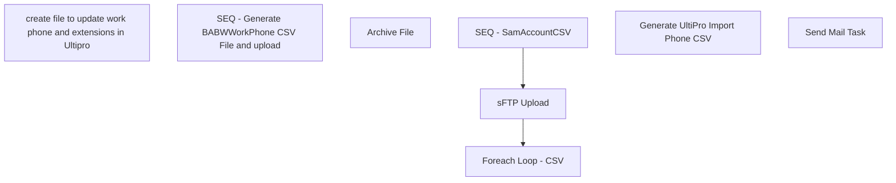

# SSIS Package: Package

**Project:** HR_UltiproADphoneExt  
**Folder:** HR  
**Server:** STL-SSIS-P-01  

## Connection Managers

| Name | Type | Server | Catalog | Connection (sanitized) |
|---|---|---|---|---|
| Active Directory Connection Manager 1 | ActiveDirectory |  |  |  |
| Active Directory Connection Manager 2 | ActiveDirectory |  |  |  |
| Auditworks | OLEDB | bedrocktestdb01 | auditworks | Data Source=bedrocktestdb01; Initial Catalog=auditworks; Provider=SQLNCLI11.1; Integrated Security=SSPI; Auto Translate=False |
| Azure Service Bus | Azure Service Bus (KingswaySoft) |  |  |  |
| CRM | OLEDB | crmtestdb02 | crm | Data Source=crmtestdb02; Initial Catalog=crm; Provider=SQLNCLI11.1; Integrated Security=SSPI; Auto Translate=False |
| DW | OLEDB | papamart | dw | Data Source=papamart; Initial Catalog=dw; Provider=SQLNCLI11.1; Integrated Security=SSPI; Auto Translate=False |
| DWStaging | OLEDB | papamart | DWStaging | Data Source=papamart; Initial Catalog=DWStaging; Provider=SQLNCLI11.1; Integrated Security=SSPI; Auto Translate=False |
| HTTP Connection Manager | HTTP (KingswaySoft) |  |  |  |
| IntegrationStaging | OLEDB | STL-SSIS-t-01 | IntegrationStaging | Data Source=STL-SSIS-t-01; Initial Catalog=IntegrationStaging; Provider=SQLNCLI11.1; Integrated Security=SSPI; Auto Translate=False |
| ME_01 | OLEDB | bedrocktestdb02 | me_01 | Data Source=bedrocktestdb02; Initial Catalog=me_01; Provider=SQLNCLI11.1; Integrated Security=SSPI; Auto Translate=False |
| SMTP | SMTP |  |  |  |
| UltiProImportPhoneCSV | FLATFILE |  |  |  |
| empIDs | FLATFILE |  |  |  |
| empNoID | FLATFILE |  |  |  |
| namedAndNumbered | FLATFILE |  |  |  |
| papamart.dw1 | OLEDB | papamart | dw | Data Source=papamart; Initial Catalog=dw; Provider=SQLOLEDB.1; Integrated Security=SSPI; Application Name=SSIS-Package-{3AE9F320-D541-4496-80AB-31E67461FEC7}papamart.dw1; Auto Translate=False |

## Control Flow Tasks

| Task | Type |
|---|---|
| Package | Package |
| create file to update work phone and extensions in Ultipro | SEQUENCE |
| SEQ - Generate BABWWorkPhone CSV File and upload | SEQUENCE |
| Foreach Loop -  CSV | FOREACHLOOP |
| Archive File | FileSystemTask |
| SEQ - SamAccountCSV | SEQUENCE |
| Generate UltiPro Import Phone CSV | Pipeline |
| sFTP Upload | ExecuteSQLTask |
| Send Mail Task | SendMailTask |

## Control Flow Outline

```text
- Send Mail Task [SendMailTask]
- create file to update work phone and extensions in Ultipro [SEQUENCE]
  - SEQ - Generate BABWWorkPhone CSV File and upload [SEQUENCE]
    - Foreach Loop -  CSV [FOREACHLOOP]
      - Archive File [FileSystemTask]
    - SEQ - SamAccountCSV [SEQUENCE]
      - Generate UltiPro Import Phone CSV [Pipeline]
    - sFTP Upload [ExecuteSQLTask]
```

## Architecture Diagram



## Variables

| Namespace | Name | Expression-bound |
|---|---|---|
| System | Propagate | No |
| User | DateTimeStamp | Yes |
| User | EmployeeIDStage | No |
| User | EndDate | Yes |
| User | EndDateAsDATE | Yes |
| User | GetDate | Yes |
| User | GetDateAsDATE | Yes |
| User | SQL_MemberOfQuery | Yes |
| User | StartDate | Yes |
| User | StartDateAsDATE | Yes |
| User | UltiProImportFilePreStagePath | Yes |
| User | UltiProImportFiles | No |
| User | UltiProImportPhoneCSVConnectionString | Yes |
| User | UltiProImportPhoneCSVFileName | Yes |
| User | UltiproImportArchive | Yes |
| User | ad_EmployeeID | No |
| User | ad_cn | No |
| User | ad_company | No |
| User | ad_department | No |
| User | ad_description | No |
| User | ad_displayName | No |
| User | ad_givenname | No |
| User | ad_mail | No |
| User | ad_manager | No |
| User | ad_memberOf | No |
| User | ad_samaccountName | No |
| User | ad_sn | No |
| User | ad_title | No |
| User | empCount | No |

### Expression-bound variable values

#### User::DateTimeStamp

**Expression:**

```sql
(DT_WSTR,4)DATEPART("yyyy",GetDate()) 
+ (DT_WSTR,4)DATEPART("mm",GetDate()) 
+ (DT_WSTR,4)DATEPART("dd",GetDate()) 
+ (DT_WSTR,4)DATEPART("hh",GetDate()) 
+ (DT_WSTR,4)DATEPART("mi",GetDate()) 
+ (DT_WSTR,4)DATEPART("ss",GetDate()) 
+ (DT_WSTR,4)DATEPART("ms",GetDate())
```

**Evaluated value:**

```sql
202275214415887
```

#### User::EndDate

**Expression:**

```sql
dateadd("dd", @[$Package::DaysToInclude], @[User::StartDate])
```

**Evaluated value:**

```sql
7/5/2022
```

#### User::EndDateAsDATE

**Expression:**

```sql
(DT_WSTR, 4) datepart("year", @[User::EndDate])  + "-" + 
(DT_WSTR, 2) datepart("mm", @[User::EndDate])  + "-" + 
(DT_WSTR, 2) datepart("dd",  @[User::EndDate])
```

**Evaluated value:**

```sql
2022-7-5
```

#### User::GetDate

**Expression:**

```sql
(DT_DATE)DATEDIFF("Day", (DT_DATE) 0, GETDATE())
```

**Evaluated value:**

```sql
7/5/2022
```

#### User::GetDateAsDATE

**Expression:**

```sql
(DT_WSTR, 4) datepart("year", @[User::GetDate])  + "-" + 
(DT_WSTR, 2) datepart("mm", @[User::GetDate])  + "-" + 
(DT_WSTR, 2) datepart("dd",  @[User::GetDate])
```

**Evaluated value:**

```sql
2022-7-5
```

#### User::SQL_MemberOfQuery

**Expression:**

```sql
"
SELECT cast('" + @[User::ad_EmployeeID] + "' as nvarchar(7))  as EmployeeID, cast(replace(ADsPath, 'LDAP://', '') as nvarchar(4000)) as memberOf 
FROM OPENQUERY
	(
		ADSI, 
            'SELECT * FROM ''LDAP://DC=buildabear,DC=com'' 
             WHERE employeeID = ''" + @[User::ad_EmployeeID] + "'''
	)  
"
```

**Evaluated value:**

```sql

SELECT cast('' as nvarchar(7))  as EmployeeID, cast(replace(ADsPath, 'LDAP://', '') as nvarchar(4000)) as memberOf 
FROM OPENQUERY
	(
		ADSI, 
            'SELECT * FROM ''LDAP://DC=buildabear,DC=com'' 
             WHERE employeeID = '''''
	)  

```

#### User::StartDate

**Expression:**

```sql
dateadd("dd", -@[$Package::DaysToGoBack] , @[User::GetDate] )
```

**Evaluated value:**

```sql
7/4/2022
```

#### User::StartDateAsDATE

**Expression:**

```sql
(DT_WSTR, 4) datepart("year", @[User::StartDate])  + "-" + 
(DT_WSTR, 2) datepart("mm", @[User::StartDate])  + "-" + 
(DT_WSTR, 2) datepart("dd",  @[User::StartDate])
```

**Evaluated value:**

```sql
2022-7-4
```

#### User::UltiProImportFilePreStagePath

**Expression:**

```sql
"\\\\stl-ssis-p-01\\IntegrationStaging\\HR\\UltiproADphoneExt\\"
```

**Evaluated value:**

```sql
\\stl-ssis-p-01\IntegrationStaging\HR\UltiproADphoneExt\
```

#### User::UltiProImportPhoneCSVConnectionString

**Expression:**

```sql
@[$Package::UltiProFileStagePath_SamAccountEmail] +  @[User::UltiProImportPhoneCSVFileName]
```

**Evaluated value:**

```sql
\\stl-ssis-p-01\IntegrationStaging\HR\UltiproADphoneExt\BABWWorkPhone202275214415887.csv
```

#### User::UltiProImportPhoneCSVFileName

**Expression:**

```sql
"BABWWorkPhone" +  @[User::DateTimeStamp] + ".csv"
```

**Evaluated value:**

```sql
BABWWorkPhone202275214415887.csv
```

#### User::UltiproImportArchive

**Expression:**

```sql
@[User::UltiProImportFilePreStagePath] + "Archive\\"
```

**Evaluated value:**

```sql
\\stl-ssis-p-01\IntegrationStaging\HR\UltiproADphoneExt\Archive\
```

## Execute SQL Tasks

### sFTP Upload

**Path:** `Package\create file to update work phone and extensions in Ultipro\SEQ - Generate BABWWorkPhone CSV File and upload\sFTP Upload`  
**Connection:** IntegrationStaging (STL-SSIS-t-01/IntegrationStaging)  

```sql
declare
@winSCP varchar(1000),
@script varchar(1000),
@log varchar(1000),
@FTP varchar(4000),
@Log_query varchar(1000),
@Log_filename varchar(100),
@Log_file_location varchar(100),
@Log_bcp varchar(1000),
@body varchar(4000)

select 
@winSCP = '"\\stl-ssis-p-01\C$\Program Files (x86)\WinSCP\WinSCP.exe"',
@script = ' /script=\\STL-SSIs-p-01\integrationStaging\HR\UltiproADphoneExt\FTP\sFTPuploadScript.txt',
@log = ' /log=\\STL-SSIs-p-01\integrationStaging\HR\UltiproADphoneExt\FTP\FTPUpload.log',
@FTP = (@winSCP + @script + @log)

exec master..xp_cmdshell @FTP
--exec master..xp_cmdshell 'move \\STL-SSIS-P-01\integrationStaging\HR\UltiproADphoneExt\*.csv \\STL-SSIS-P-01\integrationStaging\HR\UltiproADphoneExt\Archive'
```

## Data Flow: Sources

| Component | Source Object | Type | Data Flow Task | Connection | SQL Kind |
|---|---|---|---|---|---|
| SQL |  | OLEDBSource | Generate UltiPro Import Phone CSV | DW | SqlCommand |

#### SQL — SqlCommand

```sql
SELECT [Company],[Effective Date],[emp #],[phone number],[ext] FROM [dbo].[vwUHCMUltiproFromADphoneExt]
--where [emp #] = '0063553'
```

## Data Flow: Destinations

| Component | Target Table | Type | Data Flow Task | Connection | SQL Kind |
|---|---|---|---|---|---|
| UP CSV |  | FlatFileDestination | Generate UltiPro Import Phone CSV | UltiProImportPhoneCSV |  |
