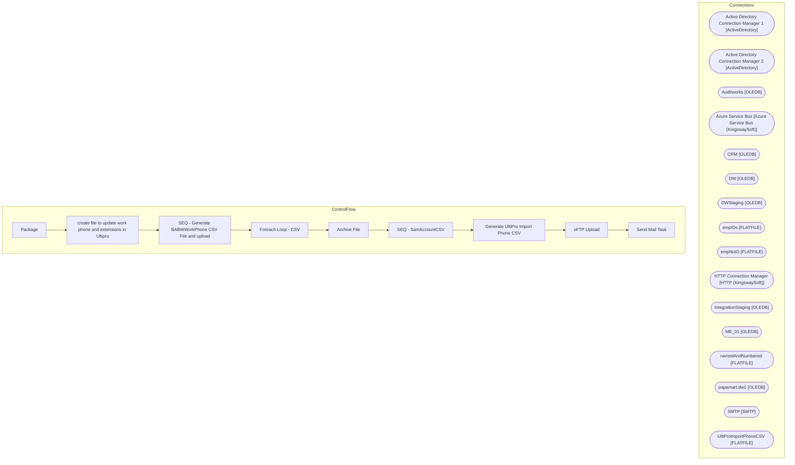

# SSIS Package: Package

**Project:** HR_UltiproADphoneExt  
**Folder:** HR  
**Server:** STL-SSIS-P-01  

## Architecture Diagram

## Connection Managers

| Name | Type |
|---|---|
| Active Directory Connection Manager 1 | ActiveDirectory |
| Active Directory Connection Manager 2 | ActiveDirectory |
| Auditworks | OLEDB |
| Azure Service Bus | Azure Service Bus (KingswaySoft) |
| CRM | OLEDB |
| DW | OLEDB |
| DWStaging | OLEDB |
| empIDs | FLATFILE |
| empNoID | FLATFILE |
| HTTP Connection Manager | HTTP (KingswaySoft) |
| IntegrationStaging | OLEDB |
| ME_01 | OLEDB |
| namedAndNumbered | FLATFILE |
| papamart.dw1 | OLEDB |
| SMTP | SMTP |
| UltiProImportPhoneCSV | FLATFILE |

## Control Flow Tasks

| Task | Type |
|---|---|
| Package | Microsoft.Package |
| create file to update work phone and extensions in Ultipro | STOCK:SEQUENCE |
| SEQ - Generate BABWWorkPhone CSV File and upload | STOCK:SEQUENCE |
| Foreach Loop -  CSV | STOCK:FOREACHLOOP |
| Archive File | Microsoft.FileSystemTask |
| SEQ - SamAccountCSV | STOCK:SEQUENCE |
| Generate UltiPro Import Phone CSV | Microsoft.Pipeline |
| sFTP Upload | Microsoft.ExecuteSQLTask |
| Send Mail Task | Microsoft.SendMailTask |

## Data Flow: Sources

| Component | SQL Preview |
|---|---|
|  | SELECT [Company],[Effective Date],[emp #],[phone number],[ext] FROM [dbo].[vwUHCMUltiproFromADphoneExt] --where [emp #] = '0063553' |

## Data Flow: Destinations

| Component | Destination |
|---|---|
|  | [dbo].[vwUltiProNeedsSamAccount] |

